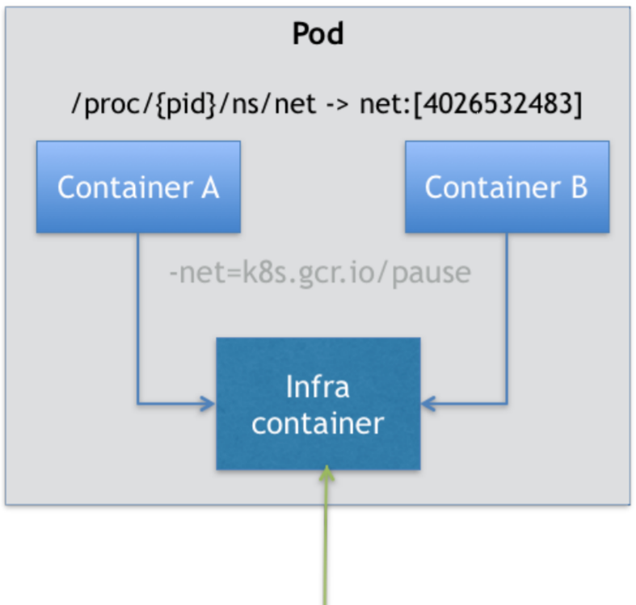

# Pod

## 基础操作

- 

### 创建 Pod

编写一个YAML 文件，记录容器的定义、参数、配置，然后就可以通过`kubectl apply -f nginx-deployment.yaml`运行这个起来。相比于`docker run`的方式，通过YAML 文件进行部署是 Kubernetes **声明式 API** 所推荐的使用方法。作为用户，你不必关心当前的操作是创建，还是更新，你执行的命令始终是 `kubectl apply`，而 Kubernetes 则会根据YAML 文件的内容变化，自动进行具体的处理。这个流程的好处是，它有助于帮助开发和运维人员，**围绕着可以版本化管理的 YAML 文件，而不**
**是“行踪不定”的命令行进行协作，从而大大降低开发人员和运维人员之间的沟通成本**。

```
apiVersion: apps/v1
kind: Deployment
metadata:
  name: nginx-deployment
spec:
  selector:
    matchLabels:
	  app: nginx
  replicas: 2
  template:
	metadata:
	  labels:
		app: nginx
	spec:
	  containers:
	  - name: nginx
		image: nginx:1.17.8
		ports:
		- containerPort: 80
```

这样的一个 YAML 文件，对应到 Kubernetes 中，就是一个 API Object（API 对象）。为这个对象的各个字段填好值并提交给 Kubernetes 之后，Kubernetes 就会负责创建出这些对象所定义的容器或者其他类型的 API 资源。

这个 YAML 文件中的 `kind `字段，指定了这个 API 对象的类型（Type），是一个`Deployment`，**Deployment是一个定义多副本应用（即多个副本 Pod）的对象**，它可以保持Pod 的副本数量，当Pod 出错时，会自动创建一个新的Pod，例如这个YAML 文件中副本数量(`spec.replicas`) 是：2。。它还在 Pod 定义发生变化时，对每个副本进行滚动更新（Rolling Update）。


通过`kubectl create`就可以将这个YAML 文件“运行”起来：

```
$ kubectl create -f nginx-deployment.yaml
deployment.apps/nginx-deployment created

# -l 匹配label
$ kubectl get pods -l app=nginx
NAME                                READY   STATUS    RESTARTS   AGE
nginx-deployment-57f4c486cc-cqm9v   1/1     Running   0          5m48s
nginx-deployment-57f4c486cc-wlvg5   1/1     Running   0          5m48s
```

有两个 Pod 处于 Running 状态，也就意味着这个 Deployment 所管理的 Pod 都处于预期的状态。可以通过`kubectl describe`查看API 对象的细节：

```
$ kubectl describe po nginx-deployment-57f4c486cc-cqm9v
Name:         nginx-deployment-57f4c486cc-cqm9v
Namespace:    default
Priority:     0
Node:         client3/10.0.2.15
Start Time:   Sat, 04 Jul 2020 00:43:03 +0000
Labels:       app=nginx
              pod-template-hash=57f4c486cc
Annotations:  <none>
Status:       Running
IP:           10.244.2.36
IPs:
  IP:           10.244.2.36
Controlled By:  ReplicaSet/nginx-deployment-57f4c486cc
Containers:
  nginx:
    ...
Conditions:
    ...
Volumes:
  ...
QoS Class:       BestEffort
Node-Selectors:  <none>
Tolerations:     node.kubernetes.io/not-ready:NoExecute for 300s
                 node.kubernetes.io/unreachable:NoExecute for 300s
Events:
  Type    Reason     Age   From               Message
  ----    ------     ----  ----               -------
  Normal  Scheduled  60m   default-scheduler  Successfully assigned default/nginx-deployment-57f4c486cc-cqm9v to client3
  Normal  Pulled     60m   kubelet, client3   Container image "nginx:1.17.8" already present on machine
  Normal  Created    60m   kubelet, client3   Created container nginx
  Normal  Started    60m   kubelet, client3   Started container nginx
```

最下面的`Events`部分，会记录对 API 对象的所有重要操作，是将来进行 Debug 的重要依据。如果有异常发生，一定要第一时间查看这些 Events，往往可以看到非常详细的错误信息。

比如，对于这个 Pod，我们可以看到它被创建之后，被调度器调度（Successfully assigned）到了 client3，发现指定的镜像已经有了，然后启动了 Pod 里定义的容器（Started container）。


在实际使用 Kubernetes 的过程中，相比于编写一个单独的 Pod 的 YAML 文件，使用一个 `replicas=1` 的 Deployment 是更推荐的做法。

因为使用Deployment 后，当pod 所在的节点出故障的时候，pod 可以调度到健康的节点上，而单独的pod只能在节点健康的情况下由kubelet 保证pod 的健康状况。

同时，使用Deployment 有助于后续的扩容缩容，升级回滚，节点间调度等。


### 获取 Pod 信息

- `kubectl get po -n  ${namespace} -o wide`：打印某个`namespace`下的所有Pods信息
- `kubectl get po --all-namespaces`：打印所有namespace 下的Pods的信息
- `kubectl describe po ${PODNAME} -n  ${namespace}`：打印某个Pod的详细信息


### 升级 Pod

如果要对这个 Nginx 服务进行升级，把它的镜像版本从 1.17.8 升级为 1.17.10，只需要修改YAML 文件：

```
...
	spec:
	  containers:
	  - name: nginx
		image: nginx:1.17.10 # change from 1.17.8 to 1.17.10
		ports:
		- containerPort: 80
```

然后使用`kubectl replace`指令完成这个更新：

```
$ kubectl replace -f nginx-deployment.yaml
```

可以看到新旧两个 Pod，被交替创建、删除，最后剩下的就是新版本的Pod，即**滚动更新**。

> 不管是`kubectl create`或者`kubectl replace`，都可以用`kubectl apply`替代。`kubectl apply`是 Kubernetes“声明式 API”所推荐的使用方法。作为用户，你不必关心当前的操作是创建，还是更新，你执行的命令始终是 `kubectl apply`，而 Kubernetes 则会根据YAML 文件的内容变化，自动进行具体的处理。


### 进入 Pod

跟Docker 提供的`exec`指令一样，通过`kubectl exec`也可以进入到Pod 中（即容器的 Namespace 中）：

```
$ kubectl exec -it nginx-deployment-5c96cff55b-dcrlr -n default -- /bin/bash
error: unable to upgrade connection: pod does not exist
```

这个问题的解决可以参考[这个issue](https://github.com/kubernetes/kubernetes/issues/63702)，即网络原因，需要在worker 节点上修改kubelet 的配置，即往`/etc/systemd/system/kubelet.service.d/10-kubeadm.conf`文件中加入下面一行，指定worker 节点IP，然后重启kubelet。

```
Environment="KUBELET_EXTRA_ARGS=--node-ip=<worker IP address>"
```

然后就可以进入Pod 里了：

```
$ kubectl exec -it nginx-deployment-5c96cff55b-dcrlr -n default -- /bin/bash
root@nginx-deployment-5c96cff55b-dcrlr:/#
```


### 删除 Pod

要从Kubernetes 集群中删除这个 Nginx Deployment 的话，只需要执行：

```
$ kubectl delete -f nginx-deployment.yaml
```

如果有Pod 在删除后一直没退出，可以强制删除：

```
$ kubectl delete pod ${PODNAME} --grace-period=0 --force -n ${namespace}
```


## 定义 Pod 

`spec.template`部分是Pod 模版，描述了想要创建的 Pod 的细节。在上面的YAML 文件中，这个 Pod 里只有一个容器，这个容器的镜像`spec.containers.image`是`nginx:1.17.8`，这个容器监听端口`containerPort`是 80。

**Pod 就是 Kubernetes 世界里的“应用”；而一个应用，可以由多个容器组成。**

> 这种使用一种 API 对象（Deployment）管理另一种 API 对象（Pod）的方法，在 Kubernetes 中，叫作“控制器”模式（controller pattern）。在这个例子中，Deployment扮演的正是 Pod 的控制器的角色。

每一个 API 对象都有一个叫作 `Metadata `的字段，这个字段就是 API 对象的“标识”，即元数据，它也是我们从 Kubernetes 里找到这个对象的主要依据。这其中最主要使用到的字段是 Labels。

Labels 就是一组 key-value 格式的标签。像 Deployment 这样的控制器对象，就可以通过这个 `Labels `字段从 Kubernetes 中过滤出它所关心的被控制对象。

在这个例子中，Deployment 会把所有正在运行的、携带`app: nginx`标签的Pod 识别为被管理的对象，并确保这些 Pod 的总数严格等于两个。这个**过滤规则的定义，是在 Deployment 的`spec.selector.matchLabels`字段**，一般称之为：Label Selector。

在 Metadata 中，还有一个与 Labels 格式、层级完全相同的字段叫 `Annotations`，它专门用来携带 key-value 格式的内部信息。所谓内部信息，指的是对这些信息感兴趣的，是Kubernetes 组件本身，而不是用户。所以大多数 Annotations，都是在 Kubernetes 运行过程中，被自动加在这个 API 对象上。

一个 Kubernetes 的 API 对象的定义，大多可以分为 Metadata 和 Spec 两个部分。前者存放的是这个对象的元数据，对所有 API 对象来说，这一部分的字段和格式基本上是一样的；而后者存放的，则是属于这个对象独有的定义，用来描述它所要表达的功能。


### 声明 Volume

在 Kubernetes 中，Volume 是属于 Pod 对象的一部分。所以就需要修改 YAML 文件里的 `template.spec` 字段：

```
apiVersion: apps/v1
kind: Deployment
metadata:
  name: nginx-deployment
spec:
  selector:
    matchLabels:
      app: nginx
  replicas: 2
  template:
    metadata:
      labels:
        app: nginx
    spec:
      containers:
      - name: nginx
        image: nginx:1.17.10
        ports:
        - containerPort: 80
        volumeMounts:
        - mountPath: "/usr/share/nginx/html"
          name: nginx-vol
      volumes:
      - name: nginx-vol
        emptyDir: {}
```

在 Deployment 的 Pod 模板部分添加了一个 volumes 字段，定义了这个 Pod 声明的所有 Volume。它的名字叫作 `nginx-vol`，类型是 emptyDir。

emptyDir 就相当于Docker 的隐式 Volume 参数，即不显式声明宿主机目录的 Volume。所以，Kubernetes 也会在宿主机上创建一个临时目录，这个目录将来就会被绑定挂载到容器所声明的 Volume 目录上。

> Kubernetes 的 emptyDir 类型，只是把 Kubernetes 创建的临时目录作为 Volume 的宿主机目录，交给了 Docker。这么做的原因，是 Kubernetes 不想依赖 Docker 自己创建的那个 _data 目录。

Pod 中的容器，使用的是 `volumeMounts`字段来声明自己要挂载哪个 Volume，并通过`mountPath `字段来定义挂载到容器内的位置。

Kubernetes 也提供了显式的 Volume 定义，它叫做 `hostPath`：

```
...
      volumes:
      - name: nginx-vol
        hostpath: 
          path: /var/date
```

修改完YAML 文件后，通过`apply`指令更新这个Deployment：

```
$ kubectl apply -f nginx-deployment.yaml
```

滚动更新过后，通过`describe`指令查看最新的Pod：

```
$ kubectl describe po nginx-deployment-5c96cff55b-dcrlr
...
Volumes:
  nginx-vol:
    Type:       EmptyDir (a temporary directory that shares a pod's lifetime)
    Medium:
    SizeLimit:  <unset>
...
```


在Pod 运行的宿主机上执行下面的语句可以看到emptyDir Volume对应在宿主机上的文件：

```
$ ls -l /var/lib/kubelet/pods/`kubectl get pod -n ${namespace} ${PODNAME} -o 'jsonpath={.metadata.uid}'`/volumes/kubernetes.io~empty-dir
```


## 为什么需要 Pod

### 进程组

对于Linux 容器来说，Namespace 做隔离，Cgroups 做限制，rootfs 做文件系统，为什么还需要Pod 呢？

首先，容器的本质是进程，容器镜像就相当于进程的静态形式——“.exe”安装包，而Kubernetes 就是操作系统了。

在 Linux 系统中，执行`pstree -g`可以看到当前系统中正在运行的进程的树状结构。在一个真正的操作系统里，进程并不是“孤苦伶仃”地独自运行的，而是以进程组的方式，“有原则的”组织在一起。在进程的树状图中，每一个进程后面括号里的数字，就是它的进程组 ID（Process Group ID, PGID）。

```
$ pstree -g
systemd(1)─┬─AliYunDun(1224)─┬─{AliYunDun}(1224)
			......
           ├─rsyslogd(696)─┬─{in:imklog}(696)
                ├─{in:imuxsock}(696)
                └─{rs:main Q:Reg}(696)
```

以 rsyslogd 的程序为例，它负责的是 Linux 操作系统里的日志处理。可以看到，rsyslogd 的主程序 main，和它要用到的内核日志模块 imklog 等，同属于 696 进程组。这些进程相互协作，共同完成 rsyslogd 程序的职责。

对于操作系统来说，通过进程组的方式 更方便管理。例如，Linux 操作系统只需要将信号，比如 SIGKILL 信号，发送给一个进程组，那么该进程组中的所有进程就都会收到这个信号而终止运行。

而 Kubernetes 所做的，就是**将“进程组”的概念映射到了容器技术中**，并使其成为了这个云计算“操作系统”里的“一等公民”。

如果事先没有“组”的概念，运维起来就会非常难以处理。例如 rsyslogd 由三个进程组成：一个 imklog 模块，一个imuxsock 模块，一个 rsyslogd 自己的 main 函数主进程。这三个进程一定要运行在同一台机器上，否则，它们之间基于 Socket 的通信和文件交换，都会出现问题。

如果以容器的方式部署 rsyslogd 应用，由于受限于容器的“**单进程模型**”，这三个模块必须被分别制作成三个不同的容器。而在这三个容器运行的时候，它们设置的内存配额都是 1 GB。

> **容器的“单进程模型”，并不是指容器里只能运行“一个”进程，而是指容器没有管理多个进程的能力。**这是因为容器里 `PID=1` 的进程就是应用本身，其他的进程都是这个`PID=1 `进程的子进程。可是，**用户编写的应用，并不能够像正常操作系统里的 init 进程或者systemd 那样拥有进程管理的功能。**
>
> 比如，容器的应用是一个 Java Web 程序（`PID=1`），通过执行 `docker exec `在后台启动了一个 Nginx 进程（PID=3）。可是，当这个 Nginx 进程异常退出的时候，你该怎么知道呢？这个进程退出后的垃圾收集工作，又应该由谁去做呢？

假设 Kubernetes 集群上有两个节点：worker1 上有 3 GB 可用内存，worker2 有 2.5 GB 可用内存。

这时，假设用 Docker Swarm 来运行这个 rsyslogd 程序。为了能够让这三个容器都运行在同一台机器上，我就必须在另外两个容器上设置一个 `affinity=main`（与 main 容器有亲和性）的约束，即：它们俩必须和 main 容器运行在同一台机器上。

然后顺序执行：`docker run main; docker run imklog; docker run imuxsock`，创建这三个容器。这样，这三个容器都会进入 Swarm 的待调度队列。然后，main 容器和 imklog 容器都先后出队并被调度到了 worker2 上（这个情况是完全有可能的）。

可是，当 imuxsock 容器出队开始被调度时，worker2 上的可用资源只有 0.5GB 了，并不足以运行 imuxsock 容器；可是，根据 `affinity=main` 的约束，imuxsock 容器又只能运行在 worker2 上。这就是一个典型的**成组调度**（gang scheduling）没有被妥善处理的例子。

> 关于 成组调度 这个问题的讨论，Mesos 中就有一个资源囤积（resource hoarding）的机制，会在所有设置了 Affinity 约束的任务都达到时，才开始对它们统一进行调度。而在 Google Omega 论文中，则提出了使用乐观
> 调度处理冲突的方法，即：先不管这些冲突，而是通过精心设计的回滚机制在出现了冲突之后解决问题。
>
> 不过，这些方法都谈不上完美。资源囤积带来了不可避免的调度效率损失和死锁的可能性；而乐观调度的复杂程度，则不是常规技术团队所能驾驭的。

但是，在 Kubernetes 中，这样的问题就迎刃而解了：Pod 是 Kubernetes 里的原子调度单位，而一个Pod 可以由多个容器组成。这就意味着，**Kubernetes 的调度器，是统一按照 Pod 而非容器的资源需求进行计算的**。

像 imklog、imuxsock 和 main 函数主进程这样的三个容器，正是一个典型的由三个容器组成的 Pod。Kubernetes 项目在调度时，自然就会去选择可用内存等于 3 GB 的 worker1 节点进行绑定，而根本不会考虑 worker2。

这种容器间的紧密协作，可以称为“超亲密关系”。具有“超亲密关系”容器的典型特征包括但不限于：互相之间会发生直接的文件交换、使用 localhost 或者 Socket 文件进行本地通信、会发生非常频繁的远程调用、需要共享某些 Linux Namespace（比如，一个容器要加入另一个容器的 Network Namespace）等等。

这也就意味着，并不是所有有“关系”的容器都属于同一个 Pod。比如，PHP 应用容器和 MySQL虽然会发生访问关系，但并没有必要、也不应该部署在同一台机器上，它们更适合做成两个 Pod。


### 容器设计模式

如果只是处理“超亲密关系”这样的调度问题，Kubernetes 可以在调度器层面给它解决掉，而不需要创造Pod 。Pod 在 Kubernetes 里有更重要的意义，那就是：容器设计模式。

#### Pod 实现原理

首先，关于 Pod 最重要的一个事实是：**它只是一个逻辑概念**。Kubernetes 真正处理的，还是宿主机操作系统上 Linux 容器的 Namespace 和Cgroups，而**并不存在一个所谓的 Pod 的边界或者隔离环境**。

**Pod，其实是一组共享了某些资源的容器，Pod 里的所有容器，共享的是同一个 Network Namespace，并且可以声明共享同一个Volume**。

一个有 A、B 两个容器的 Pod，不就等同于一个容器（容器 A）共享另外一个容器（容器 B）的网络和 Volume ，这通过 `docker run --net --volumes-from` 命令就能实现嘛，比如：

```
$ docker run --net=B --volumes-from=B --name=A image-A ..
```

但是，如果真这样做的话，容器 B 就必须比容器 A 先启动，这样一个 Pod 里的多个容器就不是对等关系，而是拓扑关系了。

所以，**在 Kubernetes 里，Pod 的实现需要使用一个中间容器**，这个容器叫作 Infra 容器。在每个 Pod 中，Infra 容器永远都是第一个被创建的容器，而其他用户定义的容器，则通过 Join Network Namespace 的方式，与 Infra 容器关联在一起。



上图中这个 Pod 里有两个用户容器 A 和 B，还有一个 Infra 容器。很容易理解，在Kubernetes 项目里，Infra 容器一定要占用极少的资源，所以它使用的是一个非常特殊的镜像：`k8s.gcr.io/pause`。这个镜像是一个用汇编语言编写的、永远处于“暂停”状态的容器，解压后的大小也只有几百 KB。

在 Infra 容器“Hold 住”Network Namespace 后，用户容器就可以加入到 Infra 容器的Network Namespace 当中了。所以，如果查看这些容器在宿主机上的 Namespace 文件，它们指向的值一定是完全一样的。

> Linux Namespaces: mount、pid、network、ipc、uid、UTS、cgroup、time

这就意味着，对于 Pod 里的容器 A 和容器 B 来说：

- 它们可以直接使用 localhost 进行通信
- 它们看到的网络设备跟 Infra 容器看到的完全一样
- 一个 Pod 只有一个 IP 地址，也就是这个 Pod 的 Network Namespace 对应的 IP 地址
- 当然，其他的所有网络资源，都是一个 Pod 一份，并且被该 Pod 中的所有容器共享
- Pod 的生命周期只跟 Infra 容器一致，而与容器 A 和 B 无关

对于同一个 Pod 里面的所有用户容器来说，它们的进出流量，也可以认为都是通过 Infra 容器完成的。这一点很重要，因为将来如果要为 Kubernetes 开发一个网络插件时，应该重点考虑的是如何配置这个 Pod 的 Network Namespace，而不是每一个用户容器如何使用你的网络配置，这是没有意义的。

这意味着，如果网络插件需要在容器里安装某些包或者配置才能完成的话，是不可取的：Infra 容器镜像的 rootfs 里几乎什么都没有，没有你随意发挥的空间。当然，这同时也意味着网络插件完全不必关心用户容器的启动与否，而只需要关注如何配置 Pod，也就是 Infra 容器的 Network Namespace 即可。

有了这个设计之后，共享 Volume 就简单多了：Kubernetes 只要把所有 Volume 的定义都设计在 Pod 层级即可。一个 Volume 对应的宿主机目录对于 Pod 来说就只有一个，Pod 里的容器只要声明挂载这个 Volume，就一定可以共享这个 Volume 对应的宿主机目录。

```
apiVersion: v1
kind: Pod
metadata:
  name: two-containers
spec:
  restartPolicy: Never
  volumes:
  - name: shared-data
  hostPath:
    path: /data
  containers:
  - name: nginx-container
    image: nginx
    volumeMounts:
    - name: shared-data
      mountPath: /usr/share/nginx/html
  - name: debian-container
    image: debian
    volumeMounts:
    - name: shared-data
      mountPath: /pod-data
    command: ["/bin/sh"]
    args: ["-c", "echo Hello from the debian container > /pod-data/index.html"]
```


#### 例子

明白了 Pod 的实现原理后，再来看“容器设计模式”，就容易多了。Pod 这种“超亲密关系”容器的设计思想，实际上就是希望，**当用户想在一个容器里跑多个功能并不相关的应用时，应该优先考虑它们是不是更应该被描述成一个 Pod 里的多个容器。**

为了能够掌握这种思考方式，尽量尝试使用它来描述一些用单个容器难以解决的问题。

##### WAR 包与 Web 服务器

假设有一个 Java Web 应用的 WAR 包，它需要被放在 Tomcat 的 `webapps `目录下运行起来。

如果只能用 Docker 来做这件事情，把 WAR 包直接放在 Tomcat 镜像的 `webapps `目录下，做成一个新的镜像运行起来。但是如果要更新 WAR 包的内容，或者升级 Tomcat 镜像，就要重新制作一个新的发布镜像，非常麻烦。

那如果不考虑 WAR 包，永远只发布一个 Tomcat 容器。不过，这个容器的`webapps `目录，就必须声明一个 `hostPath `类型的 Volume，从而把宿主机上的 WAR 包挂载进Tomcat 容器当中运行起来。不过，这样就必须要解决一个问题，即：如何让每一台宿主机，都预先准备好这个存储有 WAR 包的目录呢？这样子只能独立维护一套分布式存储系统了。


而通过Pod 来实现这个功能就很简单，把WAR 包和 Tomcat 分别做成两个镜像，然后用一个`initContainer`把WAR 包提前放到Tomcat 的`webapps`目录下，最后再启动Tomcat 容器：

```
apiVersion: v1
kind: Pod
metadata:
  name: javaweb-2
spec:
  initContainers:
  - image: xxx/cpWar:v2
    name: war
    command: ["cp", "/sample.war", "/app"]
    volumeMounts:
    - mountPath: /app
      name: app-volume
  containers:
  - image: xxx/tomcat:7.0
    name: tomcat
    command: ["sh","-c","/path-to-tomcat/bin/start.sh"]
    volumeMounts:
    - mountPath: /path-to-tomcat/webapps
      name: app-volume
    ports:
    - containerPort: 8080
      hostPort: 8001
  volumes:
  - name: app-volume
    emptyDir: {}
```

在 Pod 中，所有 `Init Container` 定义的容器，都会比 `spec.containers` 定义的用户容器先启动。并且，**`Init Container `容器会按顺序逐一启动**，而直到它们都启动并且退出了，用户容器才会启动。

因此，等 Tomcat 容器启动时，它的 `webapps `目录下就一定会存在 `sample.war` 文件：这个文件正是 WAR 包容器启动时拷贝到这个 Volume 里面的，而这个 Volume 是被这两个容器共享的。

这种组合方式，解决了 WAR 包与 Tomcat 容器之间耦合关系的问题。实际上，这个所谓的“组合”操作，正是容器设计模式里最常用的一种模式：**sidecar**。顾名思义，**sidecar 指的就是可以在一个 Pod 中，启动一个辅助容器，来完成一些独立于主进程（主容器）之外的工作。**

比如，在这个应用 Pod 中，Tomcat 容器是我们要使用的主容器，而 WAR 包容器的存在，只是为了给它提供一个 WAR 包而已。所以，我们用 Init Container 的方式优先运行 WAR 包容器，扮演了一个 sidecar 的角色。


##### 日志收集

假如现在有一个应用，需要不断地把日志文件输出到容器的 `/var/log` 目录中。这时就可以把一个 Pod 里的 Volume 挂载到应用容器的 `/var/log` 目录上。然后，在这个 Pod 里同时运行一个 sidecar 容器，它也声明挂载同一个 Volume 到自己的 `/var/log` 目录上。

接下来 sidecar 容器就只需要做一件事：不断地从自己的 `/var/log `目录里读取日志文件，转发到 MongoDB 或者 Elasticsearch 中存储起来。这样，一个最基本的日志收集工作就完成了。

跟上一个例子一样，这个例子中的 sidecar 的主要工作也是使用共享的 Volume 来完成对文件的操作。

但不要忘记，Pod 的另一个重要特性是，它的所有容器都共享同一个 Network Namespace。这就使得很多与 Pod 网络相关的配置和管理，也都可以交给 sidecar 完成，而完全无须干涉用户容器。这里最典型的例子莫过于 Istio 这个微服务治理项目了。


