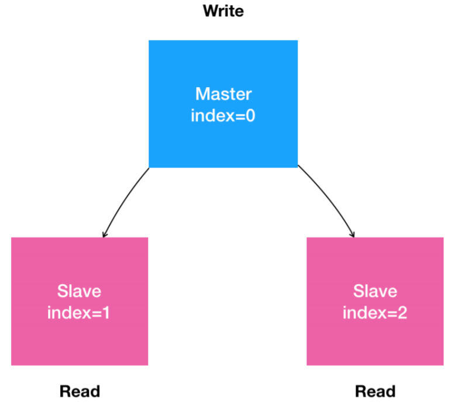

# StatefulSet

Deployment 对应用做了一个简单化假设：一个应用的所有 Pod，是完全一样的。所以，它们互相之间没有顺序，也无所谓运行在哪台宿主机上。需要的时候，Deployment 就可以通过 Pod 模板创建新的 Pod；不需要的时候，Deployment 就可以“杀掉”任意一个 Pod。

这导致 Deployment 不足以覆盖所有的应用编排问题。因为在实际的场景中，并不是所有的应用都可以满足这样的要求。

尤其是分布式应用，它的多个实例之间，往往有依赖关系，比如：主从关系、主备关系。

还有数据存储类应用，它的多个实例，往往都会在本地磁盘上保存一份数据。而这些实例一旦被杀掉，即便重建出来，实例与数据之间的对应关系也已经丢失，从而导致应用失败。

所以，**这种实例之间有不对等关系，以及实例对外部数据有依赖关系的应用，就被称为“有状态应用”（Stateful Application）。**

容器技术诞生后，用它来封装“无状态应用”（Stateless Application），尤其是 Web 服务，非常好用。但是，一旦用容器运行“有状态应用”，其困难程度就会直线上升。得益于“控制器模式”的设计思想，Kubernetes 很早就在 Deployment 的基础上，扩展出了对“有状态应用”的初步支持。这个编排功能，就是：StatefulSet。

StatefulSet 把真实世界里的应用状态，抽象为了两种情况：
1. **拓扑状态**：应用的多个实例之间不是完全对等的关系。**这些应用实例，必须按照某些顺序启动**，比如应用的主节点 A 要先于从节点 B 启动。而如果把 A 和 B 两个 Pod 删除掉，它们再次被创建出来时也必须严格按照这个顺序才行。并且，**新创建出来的 Pod，必须和原来 Pod 的网络标识一样**，这样原先的访问者才能使用同样的方法，访问到这个新 Pod。

即使A、B两个节点都在运行，只有其中一个节点挂了，在重新创建该节点时，也会重新创建另一个节点，以严格保证它们之间的先后关系。即**任何pod的变化都会触发一次statefulset的滚动更新。**

2. **存储状态**：应用的多个实例分别绑定了不同的存储数据。对于这些应用实例来说，Pod A 第一次读取到的数据，和隔了十分钟之后再次读取到的数据，应该是同一份，哪怕在此期间 Pod A 被重新创建过。这种情况最典型的例子，就是一个数据库应用的多个存储实例。

**StatefulSet 的核心功能，就是通过某种方式记录这些状态，然后在 Pod 被重新创建时，能够为新 Pod 恢复这些状态。**


## Headless Service

Service 是 Kubernetes 中用来**将一组 Pod 暴露给外界访问的一种机制**。比如，一个 Deployment 有 3 个 Pod，那么我就可以定义一个 Service。然后，用户只要能访问到这个 Service，它就能访问到某个具体的 Pod。有两种方式实现 Service：

- 通过 Service 的 VIP（Virtual IP）。比如：访问 `10.0.23.1`这个 Service 的 IP 地址时，`10.0.23.1` 其实就是一个 VIP，它会把请求转发到该 Service 所代理的某一个 Pod 上。
- 通过 Service 的 DNS 方式。比如：访问`my-svc.mynamespace.svc.cluster.local`这条 DNS 记录，就可以访问到namespace为`mynamespace`底下的名叫 `my-svc` 的 Service 所代理的某一个 Pod。具体还可以分为两种处理方法：
  - Normal Service。这种情况下，访问`my-svc.mynamespace.svc.cluster.local`解析到的，正是 my-svc 这个 Service 的 VIP，后面的流程就跟VIP 方式一致了。
  - Headless Service。这种情况下，访问`my-svc.mynamespace.svc.cluster.local`解析到的，直接就是 my-svc 代理的某一个 Pod 的 IP 地址。可以看到，这里的区别在于，Headless Service 不需要分配一个 VIP，而是可以**直接以 DNS 记录的方式解析出被代理 Pod 的 IP 地址。**

定义一个 Headless Service：

```
apiVersion: v1
kind: Service
metadata:
  name: nginx
  labels:
    app: nginx
spec:
  ports:
  - port: 80
    name: web
  clusterIP: None
  selector:
    app: nginx
```

Headless Service，是一个标准 Service 的 YAML 文件。只不过，它的 `clusterIP `字段的值是：None，即这个 Service，没有一个 VIP 作为“头”。这也就是Headless 的含义。所以，这个 Service 被创建后并不会被分配一个 VIP，而是会以 DNS 记录的方式暴露出它所代理的 Pod。

**代理的Pod**

它所代理的 Pod 是通过Label Selector 机制选择出来的，即：所有携带了 `app=nginx` label 的 Pod，都会被这个 Service 代理起来。

**被代理 Pod 的效果**

通过这样的方式创建了一个 Headless Service 之后，它所代理的所有 Pod 的 IP 地址，都会被绑定一个这样格式的 DNS 记录：`<pod-name>.<svc-name>.<namespace>.svc.cluster.local`。

这个 DNS 记录，正是 Kubernetes 为 Pod 分配的唯一的“可解析身份”（Resolvable Identity）。有了这个“可解析身份”，只要知道一个 Pod 的名字，以及它对应的 Service 的名字，就可以非常确定地通过这条 DNS 记录访问到 Pod 的 IP 地址。


## 拓扑状态

通过下面的 StatefulSet 的 YAML 文件，解释 StatefulSet 是如何使用这个 Headless Service 的 DNS 记录来维持 Pod 的拓扑状态。

```
apiVersion: apps/v1
kind: StatefulSet
metadata:
  name: web
spec:
  serviceName: "nginx"
  replicas: 2
  selector:
    matchLabels:
      app: nginx
  template:
    metadata:
      labels:
        app: nginx
    spec:
      containers:
      - name: nginx
        image: nginx:1.17.8
        ports:
        - containerPort: 80
          name: web
```

这个 YAML 文件，相比 nginx-deployment 的唯一区别，就是多了一个`serviceName=nginx `字段。这个字段的作用，就是告诉 StatefulSet 控制器，在执行控制循环（Control Loop）的时候，请使用 nginx 这个 Headless Service 来保证 Pod 的“可解析身份”。

所以，通过 `kubectl create` 创建了上面这个 Service 和 StatefulSet 之后，就会看到如下两个对象：

```
$ kubectl create -f svc.yaml
service/nginx created
$ kubectl get svc nginx
NAME    TYPE        CLUSTER-IP   EXTERNAL-IP   PORT(S)   AGE
nginx   ClusterIP   None         <none>        80/TCP    10s

$ kubectl create -f statefulset.yaml
statefulset.apps/web created

# -w: Watch 实时查看 StatefulSet 创建两个有状态实例的过程，也可以通过describe 查看sts的Events
$ kubectl get po -w -l app=nginx
nginx-deployment-5c765bcb8f-c8ngt   1/1     Running             1          18h
nginx-deployment-5c765bcb8f-ckpjg   1/1     Running             1          18h
nginx-deployment-5c765bcb8f-xtjzq   1/1     Running             1          18h
web-0                               0/1     ContainerCreating   0          1s
web-0                               1/1     Running             0          4s
web-1                               0/1     Pending             0          0s
web-1                               0/1     Pending             0          0s
web-1                               0/1     ContainerCreating   0          0s
web-1                               1/1     Running             0          3s

$ kubectl get sts web
NAME   READY   AGE
web    2/2     38s
```

通过上面这个 Pod 的创建过程，不难发现，StatefulSet 给它所管理的所有 Pod 的名字，进行了编号，编号规则是：`${sts name}-${number}`。这些编号都是从 0 开始累加，与 StatefulSet 的每个 Pod 实例一一对应，绝不重复。

更重要的是，**这些 Pod 的创建，也是严格按照编号顺序进行的。**比如，在 web-0 进入到Running 状态、并且细分状态（Conditions）成为 Ready 之前，web-1 会一直处于 Pending状态。

> Ready 状态再次展现了 为 Pod 设置 `livenessProbe `和 `readinessProbe `的重要性。

这两个Pod 都进入 Running 状态后，就可以查看它们各自唯一的 可解析身份了：

```
$ kubectl exec web-0 -- sh -c "hostname"
web-0
$ kubectl exec web-1 -- sh -c "hostname"
web-1
```

这两个 Pod 的 hostname 与 Pod 名字是一致的，都被分配了对应的编号。还可以 以 DNS 的方式，访问这个Headless Service：

```
$ nslookup web-0.nginx.default.svc.cluster.local
Server:         10.96.0.10
Address:        10.96.0.10:53

Name:   web-0.nginx.default.svc.cluster.local
Address: 10.244.0.39

$ nslookup web-1.nginx.default.svc.cluster.local
Server:         10.96.0.10
Address:        10.96.0.10:53

Name:   web-1.nginx.default.svc.cluster.local
Address: 10.244.1.66
```


这时，把这两个“有状态应用”的 Pod 删掉，并在另一个Terminal 中Watch 这两个Pod 的状态变化

```
$ kubectl delete po -l app=nginx
pod "web-0" deleted
pod "web-1" deleted

# another terminal
$ kubectl get po -w -l app=nginx
NAME    READY   STATUS    	RESTARTS   AGE
web-0   1/1     Running    	  2          4h45m
web-1   1/1     Running   	  1          4h45m
web-0   1/1     Terminating   2          4h45m
web-1   1/1     Terminating   1          4h45m
web-0   0/1     Terminating   2          4h45m
web-1   0/1     Terminating   1          4h45m
web-0   0/1     Terminating   2          4h45m
web-0   0/1     Pending       0          0s
web-0   0/1     Pending       0          0s
web-0   0/1     ContainerCreating   0          0s
web-0   1/1     Running             0          2s
web-1   0/1     Pending             0          0s
web-1   0/1     Pending             0          0s
web-1   0/1     ContainerCreating   0          0s
web-1   1/1     Running             0          4s
```

把这两个 Pod 删除之后，Kubernetes 会按照原先编号的顺序，创建出两个新的 Pod。并且，Kubernetes 依然为它们分配了与原来相同的“网络身份”：`web-0.nginx.default.svc.cluster.local` 和` web-1.nginx.default.svc.cluster.local`。

**通过这种严格的对应规则，StatefulSet 就保证了 Pod 网络标识的稳定性。**

如果 web-0 是一个需要先启动的主节点，web-1 是一个后启动的从节点，那么只要这个 StatefulSet 不被删除，访问 `web-0.nginx.default.svc.cluster.local`时始终都会落在主节点上，访问  ` web-1.nginx.default.svc.cluster.local` 时，则始终都会落在从节点上，这个关系绝对不会发生任何变化。

再用 `nslookup `命令，查看一下这个新 Pod 对应的 Headless Service ：

```
$ nslookup web-0.nginx.default.svc.cluster.local
Server:         10.244.0.40
Address:        10.244.0.40:53

Name:   web-0.nginx.default.svc.cluster.local
Address: 10.244.2.73

$ nslookup web-1.nginx.default.svc.cluster.local
Server:         10.244.0.40
Address:        10.244.0.40:53

Name:   web-1.nginx.default.svc.cluster.local
Address: 10.244.1.67
```

> 注意到这里DNS server IP变了，这是因为原来的DNS server IP ping不通，通信不了，因此手动修改`/etc/resolv.conf`，指定coreDNS的 IP 地址。
>
> 相同域名 通过DNS 解析得到的Pod IP 不是一成不变的，对于“有状态应用”实例的访问，你必须使用 DNS 记录或者 hostname 的方式，而绝不应该直接访问这些 Pod 的 IP 地址。

通过这种方法，Kubernetes 就成功地将 Pod 的拓扑状态（比如：哪个节点先启动，哪个节点后启动），按照 Pod 的 **名字 + 编号** 的方式固定了下来。此外，Kubernetes 还为每一个Pod 提供了一个固定并且唯一的访问入口，即：这个 Pod 对应的 DNS 记录。

这些状态，在 StatefulSet 的整个生命周期里都会保持不变，绝不会因为对应 Pod 的删除或者重新创建而失效。


### 总结

StatefulSet 这个控制器的主要作用之一，就是使用 Pod 模板创建 Pod 的时候，对它们进行编号，并且按照编号顺序逐一完成创建工作。而当 StatefulSet 的“控制循环”发现 Pod 的“实际状态”与“期望状态”不一致，需要新建或者删除Pod 进行“调谐”的时候，它会严格按照这些 Pod 编号的顺序，逐一完成这些操作。

所以，StatefulSet 其实可以认为是对 Deployment 的改良。

与此同时，通过 Headless Service 的方式，StatefulSet 为每个 Pod 创建了一个固定并且稳定的 DNS 记录，来作为它的访问入口。


## 存储状态

### PVC 

要在一个 Pod 里声明 Volume，只要在 Pod 里加上 `spec.volumes` 字段，然后在这个字段里定义一个具体类型的 Volume 了，比如：hostPath。

可是，对于应用开发者来说，他可能对持久化存储项目（比如 Ceph、GlusterFS 等）一窍不通，也不知道公司的 Kubernetes 集群里到底是怎么搭建出来的，自然也不会编写它们对应的 Volume 定义文件。这种情况下要怎么使用Volume 呢？

这些关于 Volume 的管理和远程持久化存储的知识，不仅超越了开发者的知识储备，还会有暴露公司基础设施秘密的风险。例如下面这个YAML 文件，暴露了存储服务器的地址、用户名、授权文件的位置。对于不懂 Ceph RBD 使用方法的开发人员，这个 Pod 里 `volumes `字段也不知道怎么填。

```
apiVersion: v1
kind: Pod
metadata:
  name: rbd
spec:
  containers:
  - image: kubernetes/pause
    name: rbd-rw
    volumeMounts:
    - name: rbdpd
      mountPath: /mnt/rbd
  volumes:
  - name: rbdpd
    rbd:
      monitors:
      - '10.16.154.78:6789'
      - '10.16.154.82:6789'
      - '10.16.154.83:6789'
      pool: kube
      image: foo
      fsType: ext4
      readOnly: true
      user: admin
      keyring: /etc/ceph/keyring
      imageformat: "2"
      imagefeatures: "layering"
```


因此， Kubernetes 引入了一组叫作 Persistent Volume Claim（PVC）和 Persistent Volume（PV）的 API 对象，大大降低了用户声明和使用持久化 Volume 的门槛。

PVC 和 PV 间的关系，类似于 接口 与 实现 之间的关系，要使用volume 的用户只需要声明 PVC 就可以了，而 PVC 真正使用的 PV，则依靠专门的运维人员实现。

#### 声明与使用 PVC

要使用一个 Volume，只需要先定义一个 PVC，声明想要的 Volume 属性：

```
kind: PersistentVolumeClaim
apiVersion: v1
metadata:
  name: pv-claim
spec:
  accessModes:
  - ReadWriteOnce
  resources:
    requests:
      storage: 1Gi
```

在这个 PVC 对象里，不需要任何关于 Volume 细节的字段，只有描述性的属性和定义。比如：

- `storage: 1Gi`： Volume 大小至少是 1 GB

- `accessModes:ReadWriteOnce`：这个 Volume 的挂载方式是可读写，并且只能挂载在一个节点上而非被多个节点共享

  > 关于哪种类型的 Volume 支持哪种类型的 `AccessMode`，可以查看Kubernetes 官方文档中的[详细列表](https://kubernetes.io/docs/concepts/storage/persistent-volumes/#access-modes)。

接下来，在需要使用 Volume 的应用 Pod 中，声明使用这个 PVC：

```
apiVersion: v1
kind: Pod
metadata:
  name: pv-pod
spec:
  containers:
  - name: pv-container
    image: nginx
    ports:
    - containerPort: 80
      name: "http-server"
    volumeMounts:
    - mountPath: "/usr/share/nginx/html"
      name: pv-storage
  volumes:
  - name: pv-storage
    persistentVolumeClaim:
      claimName: pv-claim
```

在这个 Pod 的 `Volumes `定义中，只需要声明它的类型是 `persistentVolumeClaim`，然后指定 PVC 的名字，而完全不必关心 Volume 本身的定义。


#### 创建 PV

只要我们创建一个 PVC 对象，Kubernetes 就会自动为它绑定一个符合条件的 Volume。可是，这些符合条件的 Volume 又是从哪里来的呢？

它们来自于由运维人员维护的 PV（Persistent Volume）对象。下面是一个常见的 PV 对象的 YAML 文件：

```
kind: PersistentVolume
apiVersion: v1
metadata:
  name: pv-volume
  labels:
    type: local
spec:
  capacity:
    storage: 10Gi
  accessModes:
  - ReadWriteOnce
  rbd:
    monitors: # rook-ceph-mon-xxx 的IP
    - '10.244.0.55:6789'
    - '10.244.1.82:6789'
    - '10.244.2.87:6789'
    pool: kube
    image: foo
    fsType: ext4
    readOnly: false
    user: admin
    keyring: /etc/ceph/keyring
```

这个 PV 对象的 `spec.rbd` 字段，就是 Ceph RBD Volume 的详细定义。而且，它还声明了这个 PV 的容量是 10 GB。这样，Kubernetes 就会为刚刚创建的 PVC 对象绑定这个 PV。

这种解耦，就避免了因为向开发者暴露过多的存储系统细节而带来的隐患。此外，这种职责的分离，往往也意味着出现事故时可以更容易定位问题和明确责任，从而避免“扯皮”现象的出现。

```
$ kubectl apply -f pvc.yaml
$ kubectl apply -f pvpod.yaml
$ kubectl apply -f pv.yaml
$ kubectl get pvc
NAME       STATUS   VOLUME      CAPACITY   ACCESS MODES   STORAGECLASS   AGE
pv-claim   Bound    pv-volume   10Gi       RWO                           23m

$ kubectl get pv
NAME        CAPACITY   ACCESS MODES   RECLAIM POLICY   STATUS   CLAIM              STORAGECLASS   REASON   AGE
pv-volume   10Gi       RWO            Retain           Bound    default/pv-claim                           85s
```

PVC 就相当于一种特殊的 Volume，只不过一个 PVC 具体是什么类型的 Volume，要在跟某个 PV 绑定之后才知道。

当然，PVC 与 PV 的绑定得以实现的前提是，运维人员已经在系统里创建好了符合条件的 PV；或者，Kubernetes 集群运行在公有云上，这样 Kubernetes 就会通过 Dynamic Provisioning 的方式，自动创建与 PVC 匹配的 PV。


### 实践

```
apiVersion: apps/v1
kind: StatefulSet
metadata:
  name: web
spec:
  serviceName: "nginx"
  replicas: 2
  selector:
    matchLabels:
      app: nginx
  template:
    metadata:
      labels:
        app: nginx
    spec:
      containers:
      - name: nginx
        image: nginx:1.17.8
        ports:
        - containerPort: 80
          name: web
        volumeMounts:
        - name: www
          mountPath: /usr/share/nginx/html
  volumeClaimTemplates:
  - metadata:
      name: www
    spec:
      accessModes:
      - ReadWriteOnce
      resources:
        requests:
          storage: 1Gi
```

这个 StatefulSet 添加了一个 `volumeClaimTemplates `字段，它跟 Deployment 里 Pod 模板（PodTemplate）的作用类似。凡是被这个 StatefulSet 管理的 Pod，都会声明一个对应的 PVC；而这个 PVC 的定义，就来自于`volumeClaimTemplates `这个模板字段。更重要的是，**这个 PVC 的名字，会被分配一个与这个Pod 完全一致的编号**。

这个自动创建的 PVC，与 PV 绑定成功后，就会进入 Bound 状态，这就意味着这个 Pod 可以挂载并使用这个 PV 了。

```
$ kubectl apply -f sts.yaml
statefulset.apps/web created

$ kubectl get pvc -l app=nginx
NAME       STATUS   VOLUME      					CAPACITY   ACCESS MODES   STORAGECLASS   AGE
www-web-0  Bound  pvc-15c268c7-b507-11e6-932f-42010a800002 1Gi 		RWO 					48s
www-web-1  Bound  pvc-15c79307-b507-11e6-932f-42010a800002 1Gi 		RWO 					48s
```

这些 PVC，都以`<PVC 名字>-<StatefulSet 名字>-<编号>`的方式命名，并且处于 Bound 状态。这个 StatefulSet 创建出来的所有 Pod，都会声明使用编号的 PVC。比如，在名叫 `web-0` 的 Pod 的 `volumes `字段，它会声明使用名叫 `www-web-0` 的 PVC，从而挂载到这个 PVC 所绑定的 PV。

在 Pod 的 Volume 目录里写入一个文件，以验证上述 Volume 的分配情况：

```
$ for i in 0 1; do kubectl exec web-$i -- sh -c 'echo hello $(hostname) > /usr/share/nginx/html/index.html'; done
```

此时，如果在这个 Pod 容器里访问`http://localhost`，访问到的就是 Pod 里Nginx 服务器进程，它会为你返回 `/usr/share/nginx/html/index.html` 里的内容：

```
$ for i in 0 1; do kubectl exec -it web-$i -- curl localhost; done
hello web-0
hello web-1
```


这时，就算使用 `kubectl delete pod -l app=nginx` 命令删除这两个 Pod，这些 Volume 里的文件也不会丢失，因为 PV、 PVC 和 Pod 的生命周期是不一样的。而由于这两个Pod 是通过 StatefulSet 创建的，在被删除之后，这两个 Pod 会被按照编号的顺序重新创建出来。这时候在新创建的容器里通过访问`http://localhost`的方式去访问web-0 里的 Nginx 服务，得到的响应跟删除前是一样的。即原先与名叫 `web-0` 的 Pod 绑定的PV，在这个 Pod 被重新创建之后，依然同新的名叫 `web-0` 的 Pod 绑定在了一起。对于 Pod `web-1` 来说，也是完全一样的情况。 

StatefulSet 控制器恢复这个 Pod 的过程如下：

1. 把一个 Pod，比如 web-0，删除之后，这个 Pod 对应的 PVC 和 PV，并不会被删除，而这个 Volume 里已经写入的数据，也依然会保存在远程存储服务里（比如这个例子里用到的 Ceph 服务器）
2. 此时，StatefulSet 控制器发现，一个名叫 web-0 的 Pod 消失了。所以，控制器就会重新创建一个新的、名字还是叫作 web-0 的 Pod ，来“纠正”这个不一致的情况。需要注意的是，**在这个新的 Pod 对象的定义里，它声明使用的 PVC 的名字，还是叫作：www-web-0。**这个 PVC 的定义，还是来自于 PVC 模板（volumeClaimTemplates），这是StatefulSet 创建 Pod 的标准流程。
3. 所以，在这个新的 web-0 Pod 被创建出来之后，Kubernetes 为它查找名叫 www-web-0 的PVC 时，就会直接找到旧 Pod 遗留下来的同名的 PVC，进而找到跟这个 PVC 绑定在一起的PV。
4. 这样，新的 Pod 就可以挂载到旧 Pod 对应的那个 Volume，并且获取到保存在 Volume 里的数据。

通过这种方式，Kubernetes 的 StatefulSet 就实现了对应用存储状态的管理。


## 工作原理

首先，**StatefulSet 的控制器直接管理的是 Pod**。这是因为，StatefulSet 里的不同 Pod 实例，不像 ReplicaSet 中那样都是完全一样的，而是有了细微区别的。比如，每个 Pod 的hostname、名字等都是不同的、携带了编号的。而 StatefulSet 区分这些实例的方式，就是通过在 Pod 的名字里加上事先约定好的编号。

其次，**Kubernetes 通过 Headless Service，为这些有编号的 Pod，在 DNS 服务器中生成带有同样编号的 DNS 记录。**只要 StatefulSet 能够保证这些 Pod 名字里的编号不变，那么 Service里类似于 `web-0.nginx.default.svc.cluster.local` 这样的 DNS 记录也就不会变，而这条记录解析出来的 Pod 的 IP 地址，则会随着后端 Pod 的删除和再创建而自动更新。这是 Service 机制本身的能力，不需要 StatefulSet 操心。

最后，**StatefulSet 还为每一个 Pod 分配并创建一个同样编号的 PVC**。这样，Kubernetes 就可以通过 Persistent Volume 机制为这个 PVC 绑定上对应的 PV，从而保证了每一个 Pod 都拥有一个独立的 Volume。在这种情况下，即使 Pod 被删除，它所对应的 PVC 和 PV 依然会保留下来。所以当这个 Pod被重新创建出来之后，Kubernetes 会为它找到同样编号的 PVC，挂载这个 PVC 对应的Volume，从而获取到以前保存在 Volume 里的数据。


StatefulSet 的容器启动有先后顺序，当序号较小的容器由于某种原因需要重启时，会不会先把序号较大的容器KILL掉，再按照它们本来的顺序重新启动一次？

不会，因为重启不会破坏拓扑规则。


## 主从 MySQL 集群搭建

[官方例子](https://kubernetes.io/zh/docs/tasks/run-application/run-replicated-stateful-application/)

### 需求分析

要搭建的主从模式 MySQL 集群具有如下特征：

1. 是一个“主从复制”（Maser-Slave Replication）的 MySQL 集群
2. 有 1 个主节点（Master）
3. 有多个从节点（Slave）
4. 从节点需要能水平扩展
5. 所有的写操作，只能在主节点上执行
6. 读操作可以在所有节点上执行



在常规环境里，部署这样一个主从模式的 MySQL 集群的主要难点在于：**如何让从节点能够拥有主节点的数据**，即：如何配置主（Master）从（Slave）节点的复制与同步。

所以，在安装好 MySQL 的 Master 节点之后，你需要做的第一步工作，就是通过 XtraBackup 将 Master 节点的数据备份到指定目录。

> XtraBackup 是业界主要使用的开源 MySQL 备份和恢复工具。

这一步会自动在目标目录里生成一个名叫`xtrabackup_binlog_info`的备份信息文件，这个文件一般会包含如下两个在配置 Slave 节点时需要的信息，即备份文件名称和偏移量：

```
$ cat xtrabackup_binlog_info
TheMaster-bin.000001 481
```


接下来就要配置 Slave 节点了。在Slave 节点在第一次启动前，需要把 Master 节点的备份数据，连同备份信息文件，一起拷贝到自己的数据目录（`/var/lib/mysql`）下。然后，执行下面的SQL：

```
mysql> CHANGE MASTER TO
	MASTER_HOST='$masterip',
	MASTER_USER='xxx',
	MASTER_PASSWORD='xxx',
	MASTER_LOG_FILE='TheMaster-bin.000001',
	MASTER_LOG_POS=481;
	
mysql> START SLAVE;
```

现在 Slave 节点就启动了，它会使用备份信息文件中的二进制日志文件和偏移量，与主节点进行数据同步。


接下来就可以在这个集群中添加更多的 Slave 节点了。需要注意的是，**新添加的 Slave 节点的备份数据，来自于已经存在的 Slave 节点。**所以，需要将 Slave 节点的数据备份在指定目录。而这个备份操作会自动生成另一种备份信息文件，名叫：`xtrabackup_slave_info`。同样地，这个文件也包含了`MASTER_LOG_FILE `和 `MASTER_LOG_POS `两个字段。

然后就可以在新的节点里执行跟前面一样的`CHANGE MASTER TO`和`START SLAVE`”指令，来初始化并启动这个新的 Slave 节点了。


因此，要想在 Kubernetes 上部署MySQL 集群，需要能够“容器化”地解决三个问题：

- Master 节点和 Slave 节点需要有不同的配置文件（即：不同的 my.cnf）
- Master 节点和 Salve 节点需要能够传输备份信息文件
- 在 Slave 节点第一次启动之前，需要执行一些初始化 SQL 操作

由于 MySQL 本身同时拥有拓扑状态（主从节点的区别）和存储状态（MySQL 保存在本地的数据），我们自然要通过 StatefulSet 来解决这些问题。


### 搭建框架

#### 配置文件

对于第一个问题：Master 节点和 Slave 节点需要有不同的配置文件，可以借助 StatefulSet 生成 Pod 时自动为 Pod 编号的机制进行处理：如果编号为0，就当作 Master 节点，否则就是 Slave 节点。

我们只需要给所有节点都准备两份不同的 MySQL 配置文件，然后根据 Pod 的序号（Index）挂载相应的配置文件进去。

而配置文件信息，保存在 ConfigMap 中就可以了：

```
apiVersion: v1
kind: ConfigMap
metadata:
  name: mysql
  labels:
    app: mysql
data:
  master.cnf: |
    [mysqld]
    log-bin
  slave.cnf: |
    [mysqld]
    super-read-only
```

ConfigMap 定义里的 data 部分，是 Key-Value 格式的，这份数据挂载进 Pod 后，就会在 Volume 目录里生成 `master.cnf` 和 `slave.cnf` 两个文件。这里定义了 `master.cnf` 和 `slave.cnf` 两个 MySQL 的配置文件。

`master.cnf` 开启了 `log-bin`，即：使用二进制日志文件的方式进行主从复制，这是一个标准的设置。

`slave.cnf` 的开启了 `super-read-only`，代表的是从节点会拒绝除了主节点的数据同步操作之外的所有写操作，即：它对用户是只读的。


#### Service

```
apiVersion: v1
kind: Service
metadata:
  name: mysql
  labels:
    app: mysql
spec:
  ports:
  - name: mysql
    port: 3306
  clusterIP: None
  selector:
    app: mysql
---
apiVersion: v1
kind: Service
metadata:
  name: mysql-read
  labels:
    app: mysql
spec:
  ports:
  - name: mysql
    port: 3306
  selector:
    app: mysql
```

这两个 Service 都代理了所有携带 `app=mysql` 标签的 Pod，也就是所有的 MySQL Pod。端口映射都是用 Service 的 3306 端口对应 Pod 的 3306 端口。

不同的是，第一个名叫“mysql”的 Service 是一个 Headless Service（即：`clusterIP=None`），它的作用是通过为 Pod 分配 DNS 记录来固定它的拓扑状态，比如“`mysql0.mysql`”和“`mysql-1.mysql`”这样的 DNS 名字。其中，编号为 0 的节点就是主节点。

而第二个名叫“mysql-read”的 Service，则是一个常规的 Service。并且我们规定，所有用户的读请求，都必须访问第二个 Service 被自动分配的 DNS 记录，即：“mysql-read”（也可以访问这个 Service 的 VIP）。这样，读请求就可以被转发到任意一个 MySQL 的主节点或者从节点上。

而所有用户的写请求，则必须直接以 `mysql-0.mysql` 这条DNS 记录访问到 MySQL 的主节点。


#### StatefulSet

```
apiVersion: apps/v1
kind: StatefulSet
metadata:
  name: mysql
spec:
  selector:
    matchLabels:
      app: mysql
  serviceName: mysql
  replicas: 3
  template:
    metadata:
      labels:
        app: mysql
    spec:
      initContainers:
      - name: init-mysql ......
      - name: clone-mysql ......
      containers:
      - name: mysql ......
      - name: xtrabackup ......
      volumes:
      - name: conf
        emptyDir: {}
      - name: config-ap
        configMap:
          name: mysql
  volumeClaimTemplates:
  - metadata:
      name: data
    spec:
      accessModes: ["ReadWriteOnce"]
      resources:
        requests:
          storage: 2Gi
```

上面这个框架为 StatefulSet 定义了一些通用的字段。

`selector `表示，这个 StatefulSet 要管理的 Pod 必须携带 `app=mysql` 标签；它声明要使用的 Headless Service 的名字是：mysql。

这个 StatefulSet 的 `replicas `值是 3，表示它定义的 MySQL 集群有三个节点：一个 Master 节点，两个 Slave 节点。

可以看到，StatefulSet 管理的“有状态应用”的多个实例，也都是通过同一份 Pod 模板创建出来的，使用的是同一个 Docker 镜像。这也就意味着：如果应用要求不同节点的镜像不一样，那就不能再使用 StatefulSet 了，而应该考虑Operator。

除了这些基本的字段外，作为一个有存储状态的 MySQL 集群，StatefulSet 还需要管理存储状态。所以，我们需要通过 `volumeClaimTemplate`（PVC 模板）来为每个 Pod 定义 PVC。比如，这个 PVC 模板的 `resources.requests.strorage` 指定了存储的大小为 2 GB；`ReadWriteOnce `指定了该存储的属性为可读写，并且一个 PV 只允许挂载在一个宿主机上。将来，这个 PV 对应的的 Volume 就会充当 MySQL Pod 的存储数据目录。


#### 初始化 Pod 

由于 StatefulSet 管理的 Pod 都来自于同一个镜像，这就要求我们在编写 Pod 时，一定要保持清醒，用“人格分裂”的方式进行思考：
1. 如果这个 Pod 是 Master 节点，我们要怎么做；
2. 如果这个 Pod 是 Slave 节点，我们又要怎么做。

按照 Pod 的启动过程来一步步定义它们：

1. 从 ConfigMap 中获取MySQL 配置文件

   根据节点的角色是 Master 还是 Slave 节点，为 Pod 分配对应的配置文件。此外，MySQL 还要求集群里的每个节点都有一个唯一的 ID 文件，名叫 `server-id.cnf`。这种与存储相关的初始化工作可以通过`initContainers`实现：

   ```
   initContainers:
   - name: init-mysql 
     image: mysql:5.7
     command:
     - bash
     - "-c"
     - |
       set -ex # -e 失败就退出 -x 打印要执行的命令
       [[ `hostname` =~ -([0-9]+)$ ]] || exit 1 # 从Pod 的hostname 得到其编号
       ordinal=${BASH_REMATCH[1]}
       echo [mysqld] > /mnt/conf.d/server-id.conf
       #  由于 server-id=0 有特殊含义，因此给 ID 加一个 100
       echo server-id=$((100 + $ordinal)) >> /mnt/conf.d/server-id.conf
       if [[ $ordinal -eq 0 ]]; then
         cp /mnt/config-map/master.cnf /mnt/conf.d/
       else
         cp /mnt/config-map/slave.cnf /mnt/conf.d/
       fi
     volumeMounts: # spec.volumes 部分已经定义了conf和config-map
     - name: conf 
       mountPath: /mnt/conf.d
     - name: config-map
       mountPath: /mnt/config-map
   ```

   这一步实现了将 配置文件 存放到 `conf` Volume。基于 Pod Volume 共享的原理，当 `InitContainer` 复制完配置文件退出后，后面启动的 MySQL 容器只需要直接声明挂载这个名叫 `conf` 的 Volume，它所需要的`.cnf` 配置文件已经出现在里面了。
   
2. 在 Slave Pod 启动前，从 Master 或者其他 Slave Pod 里拷贝数据库数据到自己的目录下。
   
```
   initContainers:
- name: clone-mysql
     image: gcr.io/google-samples/xtrabackup:1.0
  command:
     - bash
     - "-c"
     - |
       set -ex
       # 只需要第一次启动时拷贝，如果数据已存在，可以跳过
       [[ -d /var/lib/mysql/mysql ]] && exit 0
       # master 节点不需要做这个操作
       [[ `hostname` =~ -([0-9]+)$ ]] || exit 1
       ordinal=${BASH_REMATCH[1]}
       [[ $ordinal -eq 0 ]] && exit 0
       # 通过 ncat，拷贝远程节点(该Pod 的前一个Pod)的数据到本地
       # 3307 端口运行着一个专门负责备份 MySQL 数据的辅助进程，在每个节点启动时启动
       ncat --recv-only mysql-$(($ordinal-1)).mysql 3307 | xbstream -x -C /var/lib/mysql
       # 执行 --prepare，让拷贝来的数据进入一致性状态，这样，这些数据才能被用作数据恢复
       xtrabackup --prepare --target-dir=/var/lib/mysql
     volumeMounts:
     - name: data # PVC，保证即使宿主机宕机，数据库的数据也不会丢失
       mountPath: /var/lib/mysql
       subPath: mysql
     - name: conf
       mountPath: /etc/mysql/conf.d
```

   > SHELL 语法：
   >
   > - `$((...))`：执行算术运算，并返回结果。`a=$((2+3))`
   > - `((...))`：执行算术运算，不返回结果。 `((a=2+3))`
   > - `(...)`：在subshell 中执行命令
   > - `$(...)`：在subshell 中执行命令，并返回该命令的stdout
   > - `${...}`：返回变量值。`echo ${SHELL}`
   > - `{...}`：将括号内的命令作为同一组并执行。`false || { echo "failed"; exit 1;}`

   

   

#### MySQL 容器

接下来就可以开始定义 MySQL 容器, 启动 MySQL 服务了。由于 StatefulSet 里的所有 Pod 都来自用同一个 Pod 模板，所以我们还要“人格分裂”地去思考：这个 MySQL 容器的启动命令，在 Master 和 Slave 两种情况下有什么不同。

在 Pod 里声明一个 Master 角色的 MySQL 容器，直接执行 MySQL 启动命令即可。

但是，对于第一次启动的 Slave 角色的 Pod，在执行 MySQL 启动命令之前，它就需要使用 `InitContainer `拷贝来的备份数据进行初始化。而**容器是一个单进程模型，**为了让 Slave 角色的 MySQL在第一次启动前执行初始化SQL，需要定义一个 sidecar 容器：

```
containers:
  - name: xtrabackup
    image: gcr.io/google-samples/xtrabackup:1.0
    ports: 
    - name: xtrabackup
      containerPort: 3307
    command:
    - bash
    - "-c"
    - |
      set -ex
      cd /var/lib/mysql
      # 读取备份文件里面 MASTER_LOG_FILEM 和 MASTER_LOG_POS 这两个字段的值，以拼接 CHANGE MASTER 语句
      if [[ -f xtrabackup_slave_info  && "x$(<xtrabackup_slave_info)" != "x" ]]; then 
        # 数据来自另一个 slave 节点
        # 这种情况下，XtraBackup 工具在备份的时候，就已经在这个文件里自动生成了 CHANGE MASTER TO 的SQL语句
        # 只需要把这个文件重命名为 change_master_to.sql.in，后面直接使用即可
        mv xtrabackup_slave_info change_master_to.sql.in
        # 所以，也就用不着 xtrabackup_binlog_info 了
        rm -f xtrabackup_binlog_info
      elif [[ -f xtrabackup_binlog_info ]]; then
        # 只存在这个文件，说明备份来自于 Master 节点，需要解析这个备份信息文件，读取所需的两个字段的值
        # [[:space:]]+ 匹配多个空格，相当于[ \t\n\r\f\v]，[[:blank:]]相当于[ \t]
        [[ `cat xtrabackup_binlog_info` =~ ^(.*?)[[:space:]]+(.*?)$ ]] || exit 1
        rm xtrabackup_binlog_info
        # 把两个字段的值拼装成 SQL，写入 change_master_to.sql.in 文件
        echo "CHANGE MASTER TO MASTER_LOG_FILE='${BASH_REMATCH[1]}',\
               MASTER_LOG_POS=${BASH_REMATCH[2]}" > change_master_to.sql.in
      fi
      
      if [[ -f change_master_to.sql.in ]]; then
        # 先等 MySQL 容器启动之后才能进行下一步连接 MySQL 的操作
        echo "Waiting for mysqld to be ready (accepting connections)"
        until mysql -h 127.0.0.1 -e "SELECT 1"; do sleep 1; done
        
        echo "Initializing replication from clone position"
        # 改名以防止容器重启的时候，因为又找到了 change_master_to.sql.in，从而重复执行一遍这个初始化流程
        mv change_master_to.sql.in change_master_to.sql.orig
        # 使用 change_master_to.sql.orig 的内容，组成一个完整的初始化和启动 Slave 的 SQL 语句
        mysql -h 127.0.0.1 << EOF
        $(<change_master_to.sql.orig),
        MASTER_HOST='mysql-0.mysql'
        MASTER_USER='root',
        MASTER_PASSWORD='',
        MASTER_CONNECT_RETRY=10;
        START SLAVE;
        EOF
      fi
      
      # 使用 ncat 监听 3307 端口
      # 在收到传输请求的时候，执行 "xtrabackup --backup" 命令，备份 MySQL 的数据并发送给请求者
      exec ncat --listen --keep-open --send-only --max-conns=1 3307 -c \
        "xtrabackup --backup --slave-info --stream=xbstream --host=127.0.0.1 --user=root"
    volumeMounts:
    - name: data
      mountPath: /var/lib/mysql
      subPath: mysql
    - name: conf
      mountPath: /etc/mysql/conf.d
```

这个 sidecar 容器的启动命令里，实现了两部分工作：

- MySQL 节点的初始化工作。这个初始化需要使用的 SQL，是 sidecar 容器拼装出来、保存在一个名为 `change_master_to.sql.in` 的文件里。
  接下来，sidecar 容器就可以执行初始化了。只要 `change_master_to.sql.in` 文件存在，那就说明接下来需要进行集群初始化操作。所以，这时候，sidecar 容器只需要读取并执行 `change_master_to.sql.in` 里面的`CHANGE MASTER TO`指令，再执行一句 `START SLAVE` 命令，一个 Slave 节点就被成功启动了。

  当然，上述这些初始化操作完成后，还要删除掉用到的这些备份信息文件。否则，下次这个容器重启时，就会发现这些文件存在，所以又会重新执行一次数据恢复和集群初始化的操作，这是不对的。因此`change_master_to.sql.in` 在使用后也要被重命名，以免容器重启时因为发现这个文件存在又执行一遍初始化。

- 启动一个数据传输服务。sidecar 容器会使用 `ncat `命令启动一个工作在 3307 端口上的网络发送服务。一旦收到数据传输请求时，sidecar 容器就会调用 `xtrabackup --backup` 指令备份当前 MySQL的数据，然后把这些备份数据返回给请求者。这就是为什么在 `InitContainer `里定义数据拷贝的时候，访问的是“上一个 MySQL 节点”的 3307 端口。

  由于 sidecar 容器和 MySQL 容器同处于一个 Pod 里，所以它是直接通过Localhost 来访问和备份 MySQL 容器里的数据的，非常方便。
  

> Pod 里的容器并没有先后顺序，所以在执行初始化 SQL 之前，必须先执行一句 SQL`select 1`来检查一下 MySQL 服务是否已经可用。


在完成初始化工作后，要定义 MySQL 容器就很简单了：

```
containers:
  - name: mysql
    image: mysql:5.7
    env:
    - name: MYSQL_ALLOW_EMPTY_PASSWORD
      value: "1"
    ports:
    - name: mysql
      containerPort: 3306
    volumeMounts:
    - name: data
      mountPath: /var/lib/mysql
      subPath: mysql
    - name: conf
      mountPath: /etc/mysql/conf.d
    resources:
      requests:
        cpu: 500m # 0.5个cpu，精度不能小于1m 
        memory: 1Gi
    livenessProbe:
      exec:
        command: ["mysqladmin", "ping"]
      initialDelaySeconds: 30
      periodSeconds: 10
      timeoutSeconds: 5
    readinessProbe:
      exec:
        command: ["mysql", "-h", "127.0.0.1", "-e", "select 1"]
      initialDelaySeconds: 5
      periodSeconds: 2
      timeoutSeconds: 1
```

如果 MySQL 容器是 Slave 节点的话，它的数据目录里的数据，就来自于 `InitContainer `从其他节点里拷贝而来的备份。它的配置文件目录 `/etc/mysql/conf.d` 里的内容，则来自于 `conf` Volume。而它的初始化工作，则是由同一个 Pod 里的sidecar 容器完成的。


#### StorageClass

在启动这个StatefulSet 之前，通过存储插件 Rook 创建 StorageClass，它的作用是自动地为集群里存在的每一个PVC，调用存储插件（Rook）创建对应的 PV，从而省去手动创建 PV 的机械劳动：

```
apiVersion: ceph.rook.io/v1
kind: CephBlockPool
metadata:
  name: replicapool
  namespace: rook-ceph
spec:
  replicated:
    size: 3
---
apiVersion: storage.k8s.io/v1
kind: StorageClass
metadata:
  name: rook-ceph-block
provisioner: ceph.rook.io/block
parameters:
  pool: replicapool
  clusterNamespace: rook-ceph
```


### 运行

```
$ kubectl create -f storageClass.yaml
# 设置成默认的storageclass
$ kubectl patch storageclass rook-ceph-block -p '{"metadata": {"annotations":{"storageclass.kubernetes.io/is-default-class":"true"}}}'
$ kubectl create -f conf.yaml
$ kubectl create -f svc.yaml
$ kubectl create -f sts.yaml
$ kubectl get po -l app=mysql

```

StatefulSet 启动成功后，会有三个 Pod 运行。接下来尝试向这个 MySQL 集群发起请求，执行一些 SQL 操作来验证它是否正常：

```
# 执行写操作必须使用master节点 mysql-0
$ kubectl run mysql-client --image=mysql:5.7 -i --rm --restart=Never -- mysql -h mysql-0.mysql << EOF
CREATE DATABASE test;
CREATE TABLE test.messages(msg varchar(200));
INSERT INTO test.messages values('hello');
EOF


$ kubectl run mysql-client --image=mysql:5.7 -it --rm --restart=Never -- mysql -h mysql-read -e "select * from test.messages"


```


对于 sts，要扩展MySQL 集群，跟Deployment 是一样的：

```
$ kubectl scale sts mysql --replicas=5
```


