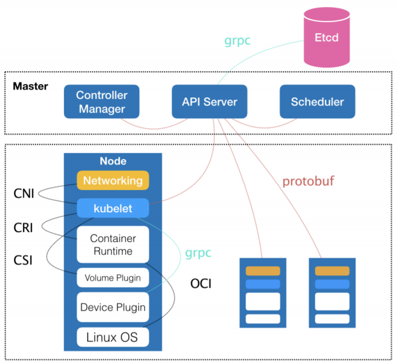
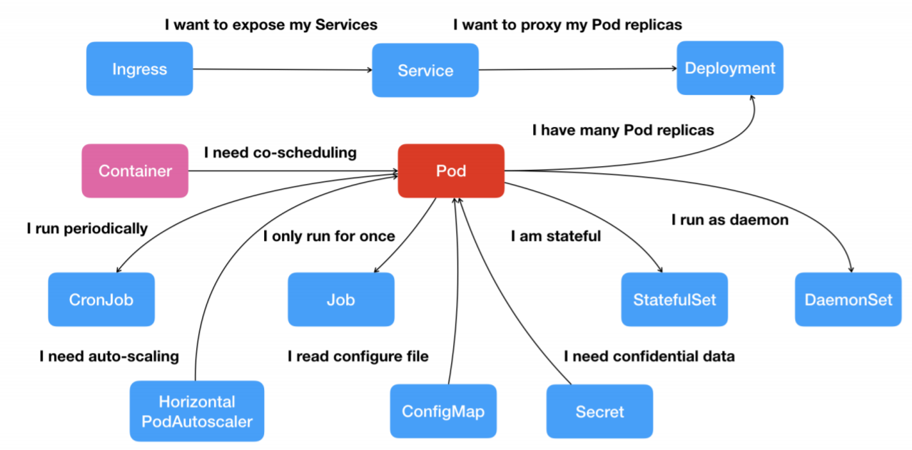

# k8s基础

## 架构

Kubernetes 项目的架构，跟它的原型项目 Borg 非常类似，都由 Master 和 Node两种节点组成，而这两种角色分别对应着控制节点和计算节点。

控制节点(Master)，由三个紧密协作的独立组件组合而成，它们分别是负责 API 服务的 kube-apiserver、负责调度的 kube-scheduler，以及负责容器编排的 kube-controller manager。整个集群的持久化数据，则由 kube-apiserver 处理后保存在 Etcd 中。

计算节点上最核心的部分，则是一个叫作 kubelet 的组件，它主要负责同容器运行时（比如 Docker）打交道。而这个交
互所依赖的，是一个称作 CRI（Container Runtime Interface）的远程调用接口，这个接口定义了容器运行时的各项核心操作，比如：启动一个容器需要的所有参数。

> Kubernetes 项目并不关心你部署的是什么容器运行时、使用的什么技术实现，只要这个容器运行时能够运行标准的容器镜像，它就可以通过实现 CRI 接入到 Kubernetes 项目当中。
>
> 具体的容器运行时，比如 Docker，则一般通过 OCI 这个容器运行时规范 同底层的 Linux 操作系统进行交互，即：把 CRI 请求翻译成对 Linux 操作系统的调用（操作 Linux Namespace 和 Cgroups 等）。

kubelet 通过 gRPC 协议同 Device Plugin 的插件进行交互，这个插件是 Kubernetes 项目用来管理 GPU 等宿主机物理设备的主要组件，也是基于 Kubernetes 项目进行机器学习训练、高性能作业支持等工作必须关注的功能。

kubelet 的另一个重要功能，则是调用网络插件和存储插件为容器配置网络和持久化存储。这两个插件与 kubelet 进行交互的接口，分别是 CNI（Container Networking Interface）和CSI（Container Storage Interface）。

> kubelet 这个名字，来自于 Borg 项目里的同源组件 Borglet。但两者除了命名相似，具体的功能相差很大。
>
> Borg 并不支持docker之类的容器技术，而只是简单地使用了 Linux Cgroups 对进程组进行限制。因此 Borglet 不需要像kubelet 这样考虑如何同 Docker 进行交互、如何对容器镜像进行管理的问题，也不需要支持 CRI、
> CNI、CSI 等诸多容器技术接口。
>
> kubelet 完全就是为了实现 Kubernetes 项目对容器的管理能力而重新实现的一个组件，与 borglet 之间并没有直接的传承关系。

### Borg  on  k8s

Borg 对于 Kubernetes 项目的指导作用主要体现在Master 节点上。Master 节点解决的问题是：**如何编排、管理、调度用户提交的作业**。

Borg 完全可以把 Docker 镜像看做是一种新的应用打包方式，这样就可以把Borg 在大规模作业管理与编排上的经验应用在 Kubernetes 上了。这体现在，Kubernetes 没有像同时期的各种“容器云”项目那样，把 Docker 作为整个架构的核心，而**仅仅把Docker 作为最底层的一个容器运行时实现**。

 Kubernetes 着重解决的问题是： **运行在大规模集群中的各种任务之间，实际上存在着各种各样的关系**。这些关系的处理，才是作业编排和管理系统最困难的地方。

> 比如，一个 Web 应用与数据库之间的访问关系，一个负载均衡器和它的后端服务之间的代理关系，一个门户应用与授权组件之间的调用关系。
>
> 同属于一个服务单位的不同功能之间，也完全可能存在这样的关系。比如，一个Web 应用与日志搜集组件之间的文件交换关系。

#### 容器间关系和容器运行时形态

在容器技术普及之前，传统虚拟机环境对这些关系的处理方法都是比较**粗粒度**的。很多功能并不相关的应用可能部署在同一台虚拟机中，只是因为它们之间偶尔会互相发起几个 HTTP 请求。更常见的情况则是，一个应用被部署在虚拟机里之后，还得手动维护很多跟它协作的守护进程（Daemon），用来处理它的日志搜集、灾难恢复、数据备份等辅助工作。

容器技术出现以后，在“功能单位”的划分上，容器有着独一无二的**细粒度**优势，毕竟容器的本质，只是一个进程而已。那些原先拥挤在同一个虚拟机里的各个应用、组件、守护进程，都可以被分别做成镜像，然后运行在一个个专属的容器中。它们之间互不干涉，拥有各自的资源配额，可以被调度在整个集群里的任何一台机器上。

封装微服务、调度单容器的功能，通过Docker Swarm 和 Compose 已经可以实现了，例如Compose 的`link`标记，定义了两个容器间的通信，Docker 会负责维护这个“link”关系，其具体做法是：Docker 会在 Web 容器中，将 DB 容器的 IP 地址、端口等信息以环境变量的方式注入进去，供应用进程使用，当 被`link` 的容器发生变化时（比如，镜像更新，被迁移到其他宿主机上等等），这些环境变量的值会由 Docker 自动更新。

可是，如果要求这个项目能够处理前面提到的所有类型的关系，甚至还要能够支持未来可能出现的更多种类的关系，这时，`link` 这种单独针对一种案例设计的解决方案就太过简单了。

Kubernetes 项目最主要的设计思想是，**从更宏观的角度，以统一的方式来定义任务之间的各种关系，并且为将来支持更多种类的关系留有余地**。

比如，Kubernetes 对容器间的“访问”进行了分类，首先总结出了一类非常常见的“紧密交互”的关系，即：这些应用之间需要非常频繁的交互和访问；又或者，它们会直接通过本地文件进行信息交换。

在常规环境下，这些应用往往会被直接部署在同一台机器上，通过 Localhost 通信，通过本地磁盘目录交换文件。而在 Kubernetes 中，这些容器则会被划分为一个“Pod”，Pod 是 Kubernetes 中最基础的一个对象，**Pod 里的容器共享同一个 Network Namespace、同一组数据卷，从而达到高效率交换信息的目的。**

对于另外一种更为常见的需求，比如 Web 应用与数据库之间的访问关系，Kubernetes 项目则提供了一种叫作**Service**的服务。像这样的两个应用，往往故意不部署在同一台机器上，这样即使Web 应用所在的机器宕机了，数据库也完全不受影响。

对于一个容器来说，它的IP 地址等信息不是固定的，那么 Web 应用又怎么找到数据库容器的 Pod 呢？

Kubernetes 的做法是给 Pod 绑定一个 Service 服务，而 Service 服务声明的 IP 地址等信息是“终生不变”的。这个Service 服务的主要作用，就是作为 Pod 的代理入口（Portal），从而代替 Pod 对外暴露一个固定的网络地址。

这样，对于 Web 应用的 Pod 来说，它需要关心的就是数据库 Pod 的 Service 信息。Service 后端真正代理的 Pod 的 IP 地址、端口等信息的自动更新、维护，则是 Kubernetes 的职责。

从容器这个最基础的概念出发，首先遇到了容器间“紧密协作”关系的难题，于是就扩展到了 Pod；有了 Pod 之后，我们希望能一次启动多个应用的实例，这样就需要Deployment 这个 Pod 的多实例管理器；而有了这样一组相同的 Pod 后，我们又需要通过一个固定的 IP 地址和端口以负载均衡的方式访问它，于是就有了 Service。

为了描述应用运行的形态，Kubernetes 定义了新的、基于 Pod 改进后的对象：

- Job：用来描述一次性运行的Pod（比如，大数据任务）
- DaemonSet：用来描述每个宿主机上必须且只能运行一个副本的守护进程服务
- CronJob：用于描述定时任务
- ……

#### secret

如果现在两个不同 Pod 之间不仅有“访问关系”，还要求在发起时加上授权信息。最典型的例子就是 Web 应用对数据库访问时需要 Credential（数据库的用户名和密码）信息。

对于这种关系，Kubernetes 提供了一种叫作 **Secret** 的对象，它其实是一个保存在 Etcd 里的键值对数据。这样，你把 Credential 信息以 Secret 的方式存在 Etcd 里，Kubernetes 就会在你指定的 Pod（比如，Web 应用的 Pod）启动时，自动把 Secret 里的数据以 Volume 的方式挂载到容器里。这样，这个 Web 应用就可以访问数据库了。

#### 声明式 API

Kubernetes 并没有像其他项目那样，为每一个管理功能创建一个指令，然后在项目中实现其中的逻辑。这种做法，的确可以解决当前的问题，但是在更多的问题来临之后，往往会力不从心。

相比之下，Kubernetes 中推崇的使用方法是：

- 首先，通过一个**编排对象**，比如 Pod、Job、CronJob 等，来描述你试图管理的应用
- 然后，再为它定义一些**服务对象**，比如 Service、Secret、Horizontal Pod Autoscaler（自动水平扩展器）等。这些对象，会负责具体的平台级功能。

这种使用方法，就是所谓的“声明式 API”。这种 API 对应的“编排对象”和“服务对象”，都是Kubernetes 项目中的 API 对象（API Object）。

