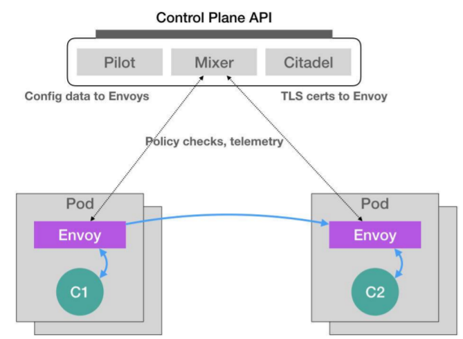
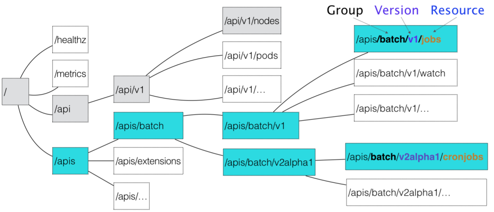
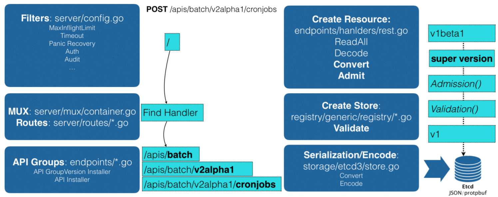
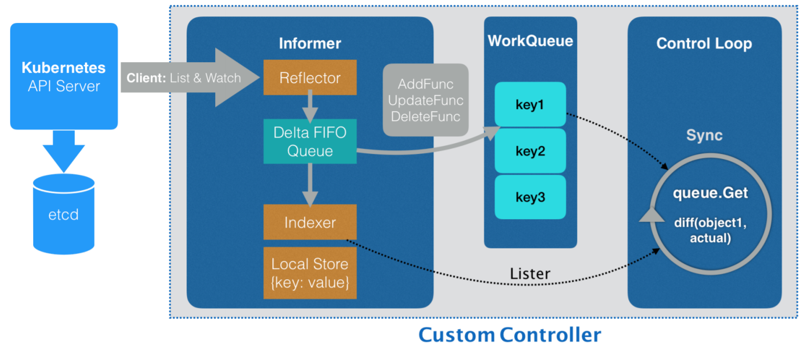

# 声明式API

Deployment、Pod、Job、StatefulSet、Service、Secret 等等，这些API 对象，有的是用来描述应用，有的则是为应用提供各种各样的服务。但是，无一例外地，为了使用这些 API 对象提供的能力，你都需要编写一个对应的 YAML 文件交给 Kubernetes。

这个 YAML 文件，正是 Kubernetes 声明式 API 所必须具备的一个要素。但是，用 YAML 文件替代命令行操作，还不能算是声明式 API 。


## 命令式

Docker Swarm 的编排操作都是基于命令行的，比如：

```
$ docker service create --name nginx --replicas 2 nginx
$ docker service update --image nginx:1.7.9 nginx
```

这种使用方式，称为**命令式命令行操作**。

像这样的创建和更新两个 Nginx 容器的操作，在 Kubernetes 里，首先要写一个 Deployment 的YAML 文件，然后使用`kubectl`命令创建和更新这个Deployment 对象：

```
$ kubectl create -f nginx.yaml
$ kubectl replace -f nginx.yaml # 先修改YAML 文件再replace
```

不过，上面的这种基于 YAML 文件的操作方式，不算是声明式API。`create + replace`的做法，只能算是**命令式配置文件操作**，它的处理方式，跟 Docker Swarm 的两句命令，没什么本质上的区别。只不过，它是把 Docker 命令行里的参数，写在了配置文件里而已。


## 声明式

`kubectl apply `命令才是“声明式 API”。对于上面的操作，可以通过`kubectl apply -f nginx.yaml`创建Deployment，在需要更新的时候，先修改YAML 文件，再执行一遍`kubectl apply -f nginx.yaml`命令，就会立即触发这个 Deployment 的“滚动更新”。

那么，`apply`与`replace`命令有什么区别呢？

`kubectl replace` 的执行过程，是**使用新的 YAML 文件中的 API对象，替换原有的 API 对象**；而 `kubectl apply`，则是执行了一个**对原有 API 对象的 PATCH 操作**。类似地，`kubectl set image` 和 `kubectl edit` 也是对已有 API 对象的修改。

更进一步地，这意味着 kube-apiserver 在响应命令式请求（比如，`kubectl replace`）的时候，一次只能处理一个写请求，否则会有产生冲突的可能。而对于声明式请求（比如，`kubectl apply`），**一次能处理多个写操作，并且具备 Merge 能力**。

这种区别，可能乍一听起来没那么重要。而且，正是由于要照顾到这样的 API 设计，做同样一件事情，Kubernetes 需要的步骤往往要比其他项目多不少。

但结合Kubernetes 的工作流程，就不难体会到这种声明式 API 的独到之处。以Istio 项目为例，了解声明式API 在实际使用时的重要意义。


### Istio

 Istio 项目，是一个基于 Kubernetes 项目的微服务治理框架，它的架构非常清晰：



Istio 最根本的组件，是运行在每一个应用 Pod 里的 Envoy 容器，Envoy 是一个高性能 C++ 网络代理。

Istio 把这个代理服务以 sidecar 容器的方式，运行在了每一个被治理的应用 Pod中。Pod 里的所有容器都共享同一个 Network Namespace。所以，Envoy 容器就能够通过配置 Pod 里的 iptables 规则，把整个 Pod 的进出流量接管下来。

这时候，Istio 的控制层（Control Plane）里的 Pilot 组件，就能够通过调用每个 Envoy 容器的API，对这个 Envoy 代理进行配置，从而实现微服务治理。

假设这个 Istio 架构图左边的 Pod 是已经在运行的应用，而右边的 Pod 则是刚刚上线的应用的新版本。这时候，Pilot 通过调节这两 Pod 里的 Envoy 容器的配置，从而将 90% 的流量分配给旧版本的应用，将 10% 的流量分配给新版本应用，并且，还可以在后续的过程中随时调整。这样，一个典型的“灰度发布”的场景就完成了。比如，Istio 可以调节这个流量从90%-10%，改到 80%-20%，再到 50%-50%，最后到 0%-100%，就完成了这个灰度发布的过程。

更重要的是，在整个微服务治理的过程中，无论是对 Envoy 容器的部署，还是像上面这样对Envoy 代理的配置，用户和应用都是完全“无感”的。


#### Dynamic Admission Control

Istio 之所以能使用户和应用无感知，是因为使用了 Kubernetes 中的一个非常重要的功能：Dynamic Admission Control。

在 Kubernetes 中，当一个 Pod 或者任何一个 API 对象被提交给 APIServer 之后，总有一些“初始化”性质的工作需要在它们被 Kubernetes 正式处理之前进行。比如，自动为所有Pod 加上某些标签（Labels）。

而这个“初始化”操作的实现，借助的是一个叫作 Admission 的功能。它是 Kubernetes 里一组被称为 Admission Controller 的代码，可以选择性地被编译进 APIServer 中，在API 对象创建之后会被立刻调用到。

但这就意味着，如果想要添加一些自己的规则到 Admission Controller，就会比较困难。因为，这要求重新编译并重启 APIServer。这种使用方法对 Istio 来说，影响太大了。

所以，Kubernetes 提供了一种“热插拔”式的 Admission 机制，它就是 Dynamic Admission Control，也叫作：Initializer。

假设有这么一个Pod：

```
apiVersion: v1
kind: Pod
metadata:
  name: myapp-pod
  labels:
    app: myapp
spec:
  containers:
  - name: myapp-container
    image: busybox
    command: ['sh', '-c', 'echo Hello Kubernetes! && sleep 3600']
```

Istio 要做的，就是在这个 Pod YAML 被提交给 Kubernetes 之后，在它对应的API 对象里自动加上 Envoy 容器的配置，使这个对象变成如下所示的样子：

```
apiVersion: v1
kind: Pod
metadata:
  name: myapp-pod
  labels:
    app: myapp
spec:
  containers:
  - name: myapp-container
    image: busybox
    command: ['sh', '-c', 'echo Hello Kubernetes! && sleep 3600']
  - name: envoy
    image: lyft/envoy:845747b88f102c0fd262ab234308e9e22f693a1
    command: ["/usr/local/bin/envoy"]
    ...
```

被 Istio 处理后的这个 Pod 里，除了用户自己定义的 myapp-container 容器之外，多出了一个叫作 envoy 的容器，它就是 Istio 要使用的 Envoy 代理。Istio 之所以能够在用户完全不知情的前提下完成这个操作，凭借的是一个用来为 Pod“自动注入” Envoy 容器的 Initializer。


首先，Istio 会将这个 Envoy 容器本身的定义，以 ConfigMap 的方式保存在 Kubernetes 当中。这个 ConfigMap的定义如下：

```
apiVersion: v1
kind: ConfigMap
metadata:
  name: envoy-initializer
data:
  config: |
    containers:
    - name: envoy
      image: lyft/envoy:845747db88f102c0fd262ab234308e9e22f693a1
      command: ["/usr/local/bin/envoy"]
      args:
      - "--concurrency 4"
      - "--config-path /etc/envoy/envoy.json"
      - "--mode serve"
      ports:
      - containerPort: 80
        protocol: TCP
    resources:
      limits:
        cpu: "1000m"
        memory: "512Mi"
      requests:
        cpu: "100m"
        memory: "64Mi"
    volumeMounts:
    - name: envoy-conf
      mountPath: /etc/envoy
  volumes:
  - name: envoy-conf
    configMap:
      name: envoy
```

这个 ConfigMap 的 data 部分，就是一个 Pod 对象的一部分定义，包括 Envoy 容器对应的 `containers `字段，以及一个用来声明 Envoy 配置文件的`volumes `字段。

Initializer 要做的工作，就是把这部分 Envoy 相关的字段，自动添加到用户提交的 Pod 的 API 对象里。由于用户提交的 Pod 里本来就有 `containers `字段和 `volumes `字段，所以 Kubernetes 在处理这样的更新请求时，就必须使用类似于 `git merge` 的操作，才能将这两部分内容合并在一起。

所以，**在 Initializer 更新用户的 Pod 对象的时候，必须使用 PATCH API 来完成。**而这种 PATCH API，正是声明式 API 最主要的能力。


接下来，Istio 将一个编写好的 Initializer，作为一个 Pod 部署在 Kubernetes 中。这个 Pod 的定义非常简单：

```
apiVersion: v1
kind: Pod
metadata:
  labels:
  app: envoy-initializer
  name: envoy-initializer
spec:
  containers:
  - name: envoy-initializer
    image: envoy-initializer:0.0.1
    imagePullPolicy: Always
```

这个 envoy-initializer 使用的 `envoy-initializer:0.0.1` 镜像，就是一个事先编写好的“自定义控制器”（Custom Controller）。

一个 Kubernetes 的控制器，实际上就是一个“死循环”：它不断地获取“实际状态”，然后与“期望状态”作对比，并以此为依据决定下一步的操作。而 Initializer 的控制器，不断获取到的“实际状态”，就是用户新创建的 Pod。而它的“期望状态”，则是：这个 Pod 里被添加了 Envoy 容器的定义。

- 如果这个 Pod 里面已经添加过 Envoy 容器，那么就“放过”这个 Pod，进入下一个检查周期。

- 如果还没有添加过 Envoy 容器，它就要进行 Initialize 操作了，即：修改该 Pod 的 API 对象（`doSomething `函数）。

  Istio 要往这个 Pod 里合并的字段，正是之前保存在 `envoyinitializer `这个 ConfigMap 里的数据。

```
for {
  pod := client.GetLatestPod() // 获取新创建的 Pod
  if !isInitialized(pod) { // Diff 一下，检查是否已经初始化过
    // 没有？那就来初始化一下
    doSomething(pod)
  }
}
```


在`doSomething`函数中，initializer 控制器首先从APIServer 获取到 ConfigMap，然后把这个ConfigMap 的`containers `和 `volumes `字段，直接添加进一个空的 Pod对象里，然后使用 Kubernetes 提供的`CreateTwoWayMergePatch`API，合并新旧两个 Pod 对象，然后向 APIServer 发起一个 PATCH 请求：

```
func doSomething(pod) {
  cm := client.Get(ConfigMap, "envoy-initializer")
 
  newPod := Pod{}
  newPod.Spec.Containers = cm.Containers
  newPod.Spec.Volumes = cm.Volumes
  
  // 生成 patch 数据
  patchBytes := strategicpatch.CreateTwoWayMergePatch(pod, newPod)
  // 发起 PATCH 请求，修改这个 pod 对象
  client.Patch(pod.Name, patchBytes)
}
```

这样，一个用户提交的 Pod 对象里，就会被自动加上 Envoy 容器相关的字段。


Kubernetes 还允许用户通过配置，来指定用什么initializer 对什么样的资源进行 Initialize 操作：

```
apiVersion: admissionregistration.k8s.io/v1alpha1
kind: InitializerConfiguration
metadata:
  name: envoy-config
initializers:
  - name: envoy.initializer.kubernetes.io   # 名字必须至少包括两个 "."
  rules:
    - apiGroups:
      - ""  # "" 就是 core API Group 的意思
    apiVersions:
    - v1
    resources:
    - pods
```

这个配置，就意味着 Kubernetes 要对所有的 Pod 进行这个 Initialize 操作，并且，我们指定了负责这个操作的 Initializer，名叫：envoy-initializer。

一旦这个 `InitializerConfiguration `被创建，Kubernetes 就会把这个 Initializer 的名字，加在所有新创建的 Pod 的 Metadata 上：

```
apiVersion: v1
kind: Pod
metadata:
  initializers:
    pending:
    - name: envoy.initializer.kubernetes.io
   name: myapp-pod
   labels:
     app: myapp
...
```

每一个新创建的 Pod，都会自动携带了 `metadata.initializers.pending` 的 Metadata 信息。这个 Metadata，是接下来 Initializer 的控制器判断这个 Pod 有没有执行过自己所负责的初始化操作的重要依据。

这也就意味着，**当你在 Initializer 里完成了要做的操作后，一定要将这个 `metadata.initializers.pending` 标志清除掉。**


除了上面的配置方法，还可以在具体的 Pod 的 `Annotation `里添加一个字段，从而声明要使用某个 Initializer：

```
apiVersion: v1
kind: Pod
metadata
  annotations:
    "initializer.kubernetes.io/envoy": "true"
  ...
```


#### 总结

Istio 的核心，就是由无数个运行在应用 Pod 中的 Envoy 容器组成的服务代理网格。这也正是 Service Mesh 的含义。

这个机制得以实现的原理，正是借助了 Kubernetes 能够对 API 对象进行在线更新的能力，这也正是Kubernetes“声明式 API”的独特之处：

- 所谓“声明式”，指的就是只需要提交一个定义好的 API 对象来“声明”，我所期望的状态是什么样子
- “声明式 API”允许有多个 API 写端，以 PATCH 的方式对 API 对象进行修改，而无需关心本地原始 YAML 文件的内容
- 有了上述两个能力，Kubernetes 项目才可以基于对 API 对象的增、删、改、查，在完全无需外界干预的情况下，完成对“实际状态”和“期望状态”的调谐（Reconcile）过程。


### API 对象设计

在 Kubernetes 中，一个 API 对象在 Etcd 里的完整资源路径，是由：Group（API 组）、Version（API 版本）和 Resource（API 资源类型）三个部分组成的。通过这样的结构，整个 Kubernetes 里的所有 API 对象，就可以用如下的树形结构表示出来：



Kubernetes 里 API 对象的组织方式，是层层递进的。假如要创建一个 CronJob 对象，YAML 文件的开头就这么写：

```
apiVersion: batch/v2alpha1
kind: CronJob
...
```

其中，`batch`就是所属的Group，`v2alpha1`是版本号，资源类型则是`CronJob`。


### API 对象创建流程

#### 匹配API 对象

提交 YAML 文件给 Kubernetes后，它就会把这个 YAML 文件里描述的内容，转换成 Kubernetes 里的一个 CronJob 对象。

Kubernetes 首先要对Group、Version、Resource 进行解析，得到资源对象的定义。在对Group 进行解析时，并不是所有的资源对象都有Group，对于核心API 对象（例如Pod、Node），它们的Group 是“”，它们是在`/api`层级下面的。而非核心 API 对象，则是在`/apis/${GROUP}`底下。

> 这些 **API Group 的分类是以对象功能为依据的**，比如 Job 和 CronJob 就都属于“batch” （离线业务）这个 Group。


**然后，Kubernetes 会进一步匹配到 API 对象的版本号。**对于 CronJob 这个 API 对象来说，Kubernetes 在 `batch `这个 Group 下，匹配到的版本号就是 `v2alpha1`。

**在 Kubernetes 中，同一种 API 对象可以有多个版本，这正是 Kubernetes 进行 API 版本化管理的重要手段。**这样，比如在 CronJob 的开发过程中，对于会影响到用户的变更就可以通过升级新版本来处理，从而保证了向后兼容。


**最后，Kubernetes 会匹配 API 对象的资源类型。**在前面匹配到正确的版本之后，Kubernetes 就知道，要创建是一个 `/apis/batch/v2alpha1` 下的 CronJob 对象。这时候，APIServer 就可以继续创建这个 CronJob 对象了。


#### 总体流程



首先，当我们发起了创建 CronJob 的 POST 请求之后，我们编写的 YAML 的信息就被提交给了 APIServer。

APIServer 的第一个功能，就是过滤这个请求，并完成一些前置性的工作，比如授权、超时处理、审计等。

然后，请求会进入 MUX 和 Routes 流程，MUX 和Routes 是 APIServer 完成 URL 和 Handler 绑定的场所。而 APIServer 的 Handler 要做的事情，就是进行匹配过程，找到对应的 CronJob 类型定义。

然后根据这个 CronJob 类型定义，使用用户提交的 YAML文件里的字段，创建一个 CronJob 对象。在这个过程中，APIServer 会进行一个 Convert 工作，即：把用户提交的 YAML 文件，转换成一个叫作 `Super Version` 的对象，它是该 API 资源类型所有版本的字段全集。这样用户提交的不同版本的 YAML 文件，就都可以用这个 Super Version 对象来进行处理了。

接下来，APIServer 会先后进行 `Admission() `和 `Validation()` 操作。 `Validation`会负责验证这个对象里的各个字段是否合法。被验证过的 API 对象，会保存在了 APIServer 里的 `Registry `数据结构中。也就是说，只要一个 API 对象的定义能在 Registry 里查到，它就是一个有效的 Kubernetes API 对象。

最后，APIServer 会把验证过的 API 对象转换成用户最初提交的版本，进行序列化操作，并调用 Etcd 的 API 把它保存起来。


## 自定义 API 对象

得益于Kubernetes 的 API 插件机制：CRD(Custom Resource Definition)，用户可以在Kubernetes 中添加一个跟 Pod、Node 类似的、新的 API 资源类型，即：自定义 API 资源。	

### 宏观定义

以添加一个名叫 `Network `的 API 资源类型为例，它的作用是，一旦用户创建一个 Network 对象，那么 Kubernetes 就应该使用这个对象定义的网络参数，调用真实的网络插件，比如 Neutron 项目，为用户创建一个真正的“网络”。这样，将来用户创建的 Pod，就可以声明使用这个“网络”了。

使用方法如下面的` example-network.yaml`文件：

```
apiVersion: samplecrd.k8s.io/v1
kind: Network
metadata:
  name: example-network
spec:
  cidr: "192.168.0.0/16"
  gateway: "192.168.0.1"
```

这个 “网络”的 API 资源类型是 `Network`；API 组是`samplecrd.k8s.io`；API 版本是 `v1`。但是，Kubernetes 该如何知道这个 API（`samplecrd.k8s.io/v1/network`）的存在呢？

上面的这个 YAML 文件，是一个具体的“自定义API 资源” 实例，即 Custom Resource，为了让 Kubernetes 认识这个CR，需要先通过 CRD 让它知道 CR 的宏观定义。

> 这就好比，你想让计算机认识各种兔子的照片，就得先让计算机明白，兔子的普遍定义是什么。比如，兔子“是哺乳动物”“有长耳朵，三瓣嘴”。


编写一个 CRD 的YAML 文件 `network.yaml`：

```
apiVersion: apiextensions.k8s.io/v1beta1
kind: CustomResourceDefinition
metadata:
  name: networks.samplecrd.k8s.io
spec:
  group: samplecrd.k8s.io
  version: v1
  names:
    kind: Network
    plural: networks
  scope: Namespaced
```

在这个 CRD 中，指定了`group: samplecrd.k8s.io` 、`version: v1`这样的 API 信息，也指定了这个 CR 的资源类型叫作 `Network`，复数（plural）是`networks`。还声明了它的 `scope `是 `Namespaced`，即：定义的这个 Network 的CR 是同一个Namespace 里可见的对象，类似于 Pod；如果`scope`是`Cluster`，则整个集群都可以看见。

> **删除一个命名空间将会删除该命名空间内所有的自定义对象。**
>
> CRD本身并不区分命名空间，对所有的命名空间可用。

这就是一个 Network API 资源类型的 API 部分的宏观定义了。这就等同于告诉了计算机：“兔子是哺乳动物”。所以这时候，Kubernetes 就能够认识和处理所有声明了 API 类型是`samplecrd.k8s.io/v1/network`的 YAML 文件了。


### 字段定义

接下来，还需要让 Kubernetes“认识”这种 YAML 文件里描述的“网络”部分，比如`cidr`（网段），`gateway`（网关）这些字段的含义。这就相当于告诉计算机：“兔子有长耳朵和三瓣嘴”。

创建一个 golang 项目，结构如下（由于代码生成时用的`code-generator`工具在go module下较难使用，所以项目不要使用go mod）：

```
$ tree src
src
├── controller.go
├── crd
│   └── network.yaml
├── example
│   └── example-network.yaml
├── main.go
└── pkg
    └── apis
        └── samplecrd
            ├── register.go
            └── v1
                ├── doc.go
                ├── register.go
                └── types.go
```

`pkg/apis/samplecrd` 就是 API 组的名字，`v1` 是版本，而 `v1` 下面的 `types.go` 文件里，则定义了 `Network `对象的完整描述。

` pkg/apis/samplecrd` 目录下创建的 `register.go `文件，用来放置后面要用到的全局变量：

```
package samplecrd

const (
  GroupName = "samplecrd.k8s.io"
  Version = "v1"
)
```


`pkg/apis/samplecrd/v1` 目录下的 `doc.go` 文件是Golang 的文档源文件：

```
// +k8s:deepcopy-gen=package
// +groupName=samplecrd.k8s.io

package v1
```

这个文件中，有` +<tag_name>[=value]` 格式的注释，这是 Kubernetes 进行代码生成要用的 `Annotation `风格的注释。

`+k8s:deepcopy-gen=package` 意思是，为整个 v1 包里的所有类型定义自动生成`DeepCopy `方法；而`+groupName=samplecrd.k8s.io`，则定义了这个包对应的 API 组的名字。

这些定义在 `doc.go` 文件的注释，起到的是全局的代码生成控制的作用，所以也被称为 Global Tags。


`types.go `文件的作用就是定义一个 Network 类型到底有哪些字段（比如，`spec `字段里的内容）：

```
package v1

import (
	metav1 "k8s.io/apimachinery/pkg/apis/meta/v1"
)

// +genclient
// +genclient:noStatus
// +k8s:deepcopy-gen:interfaces=k8s.io/apimachinery/pkg/runtime.Object

// Network describes a Network resource
type Network struct {
	// TypeMeta is the metadata for the resource, like kind and apiversion
	metav1.TypeMeta `json:",inline"`
	// ObjectMeta contains the metadata for the particular object, including
	// things like...
	//  - name
	//  - namespace
	//  - self link
	//  - labels
	//  - ... etc ...
	metav1.ObjectMeta `json:"metadata,omitempty"`

	// Spec is the custom resource spec
	Spec NetworkSpec `json:"spec"`
}

// NetworkSpec is the spec for a Network resource
type NetworkSpec struct {
	// Cidr and Gateway are example custom spec fields
	//
	// this is where you would put your custom resource data
	Cidr    string `json:"cidr"`
	Gateway string `json:"gateway"`
}

// +k8s:deepcopy-gen:interfaces=k8s.io/apimachinery/pkg/runtime.Object

// NetworkList is a list of Network resources
type NetworkList struct {
	metav1.TypeMeta `json:",inline"`
	metav1.ListMeta `json:"metadata"`

	Items []Network `json:"items"`
}
```

Network 类型定义方法跟标准的 Kubernetes 对象一样，都包括了 `TypeMeta`（API 元数据）和 `ObjectMeta`（对象元数据）字段。而其中的 `Spec `字段，则是需要我们自己定义的部分。所以，在 `networkspec `里，定义了`Cidr `和 `Gateway `两个字段。其中，每个字段最后面的tag，比如`json:"cidr"`，指的是这个字段被转换成 JSON 格式之后的名字，也就是 YAML 文件里的字段名字。

除了定义 `Network `类型，还需要定义一个 `NetworkList `类型，用来描述一组`Network `对象应该包括哪些字段。之所以需要这样一个类型，是因为在 Kubernetes 中，获取所有 X 对象的` List() `方法，返回值都是`List `类型，而不是 X 类型的数组。这是不一样的。

在 `Network `和 `NetworkList `类型上，也有代码生成注释。

- `+genclient` ：为下面这个 API 资源类型生成对应的 Client 代码。

  这个注释只需要写在 `Network `类型上，而不用写在 `NetworkList `上。因为`NetworkList `只是一个返回值类型，`Network `才是“主类型”。

-  `+genclient:noStatus` ：这个 API 资源类型定义里，没有 `Status `字段。否则，生成的 Client 就会自动带上 `UpdateStatus `方法。如果类型定义包括了 `Status `字段的话，就不需要这句` +genclient:noStatus` 注释了。

- `+k8s:deepcopygen:interfaces=k8s.io/apimachinery/pkg/runtime.Object`：在生成 `DeepCopy `的时候，实现 Kubernetes 提供的 `runtime.Object` 接口。否则，在某些版本的 Kubernetes 里，这个类型定义会出现编译错误。这是一个固定的操作。

由于在 Global Tags 里已经定义了为这个 package 的所有类型生成 `DeepCopy `方法，所以这里就不需要再显式地加上 `+k8s:deepcopy-gen=true` 了。当然，这也就意味着可以用 `+k8s:deepcopygen=false` 来阻止为某些类型生成 `DeepCopy`。

> 更多关于代码生成注释，可以查看这篇[博客](https://www.openshift.com/blog/kubernetes-deep-dive-code-generation-customresources)


最后，还需要编写一个 `pkg/apis/samplecrd/v1/register.go` 文件，在 APIServer 创建 API 对象时，会注册一个类型（Type）到 registry 中。这个内层目录下的 `register.go`，就是这个注册流程要使用的代码。它最主要的功能是，定义了 `addKnownTypes() `方法：

```
package v1

import (
	metav1 "k8s.io/apimachinery/pkg/apis/meta/v1"
	"k8s.io/apimachinery/pkg/runtime"
	"k8s.io/apimachinery/pkg/runtime/schema"

	"github.com/resouer/k8s-controller-custom-resource/pkg/apis/samplecrd"
)

// GroupVersion is the identifier for the API which includes
// the name of the group and the version of the API
var SchemeGroupVersion = schema.GroupVersion{
	Group:   samplecrd.GroupName,
	Version: samplecrd.Version,
}

// create a SchemeBuilder which uses functions to add types to the scheme
var (
	SchemeBuilder = runtime.NewSchemeBuilder(addKnownTypes)
	AddToScheme   = SchemeBuilder.AddToScheme
)

// Resource takes an unqualified resource and returns a Group qualified GroupResource
func Resource(resource string) schema.GroupResource {
	return SchemeGroupVersion.WithResource(resource).GroupResource()
}

// Kind takes an unqualified kind and returns back a Group qualified GroupKind
func Kind(kind string) schema.GroupKind {
	return SchemeGroupVersion.WithKind(kind).GroupKind()
}

// addKnownTypes adds our types to the API scheme by registering
// Network and NetworkList
func addKnownTypes(scheme *runtime.Scheme) error {
	scheme.AddKnownTypes(
		SchemeGroupVersion,
		&Network{},
		&NetworkList{},
	)

	// register the type in the scheme
	metav1.AddToGroupVersion(scheme, SchemeGroupVersion)
	return nil
}
```

> `register.go` 文件里的内容其实是非常固定的，可以直接使用这部分代码做模板，然后把其中的资源类型、`GroupName `和 `Version `替换成新定义的即可。


### 代码生成

使用 Kubernetes 提供的代码生成工具，为上面定义的 Network 资源类型自动生成 clientset、informer 和 lister。

```
# 代码生成的工作目录，也就是我们的项目路径
$ ROOT_PACKAGE="github.com/resouer/k8s-controller-custom-resource"
# API Group
$ CUSTOM_RESOURCE_NAME="samplecrd"
# API Version
$ CUSTOM_RESOURCE_VERSION="v1"

# 安装 k8s.io/code-generator
$ go get -u k8s.io/code-generator/...
$ go get -u k8s.io/apimachinery
$ cd $GOPATH/src/k8s.io/code-generator/
$ chmod +x ./generate-groups.sh

# 执行代码自动生成，其中 pkg/client 是生成目标目录，pkg/apis 是类型定义目录
$ ./generate-groups.sh all "$ROOT_PACKAGE/pkg/client" "$ROOT_PACKAGE/pkg/apis" "$CUSTOM_RESOURCE_NAME:$CUSTOM_RESOURCE_VERSION"
Generating deepcopy funcs
Generating clientset for samplecrd:v1 at github.com/resouer/k8s-controller-custom-resource/pkg/client/clientset
Generating listers for samplecrd:v1 at github.com/resouer/k8s-controller-custom-resource/pkg/client/listers
Generating informers for samplecrd:v1 at github.com/resouer/k8s-controller-custom-resource/pkg/client/informers

$ tree src/github.com/resouer/k8s-controller-custom-resource/pkg/
src/github.com/resouer/k8s-controller-custom-resource/pkg/
├── apis
│   └── samplecrd
│       ├── register.go
│       └── v1
│           ├── doc.go
│           ├── register.go
│           ├── types.go
│           └── zz_generated.deepcopy.go # 自动生成的DeepCopy 代码文件
└── client #  Kubernetes为 Network 类型生成的客户端库
    ├── clientset
    │   └── versioned
    │       ├── clientset.go
    │       ├── doc.go
    │       ├── fake
    │       │   ├── clientset_generated.go
    │       │   ├── doc.go
    │       │   └── register.go
    │       ├── scheme
    │       │   ├── doc.go
    │       │   └── register.go
    │       └── typed
    │           └── samplecrd
    │               └── v1
    │                   ├── doc.go
    │                   ├── fake
    │                   │   ├── doc.go
    │                   │   ├── fake_network.go
    │                   │   └── fake_samplecrd_client.go
    │                   ├── generated_expansion.go
    │                   ├── network.go
    │                   └── samplecrd_client.go
    ├── informers
    │   └── externalversions
    │       ├── factory.go
    │       ├── generic.go
    │       ├── internalinterfaces
    │       │   └── factory_interfaces.go
    │       └── samplecrd
    │           ├── interface.go
    │           └── v1
    │               ├── interface.go
    │               └── network.go
    └── listers
        └── samplecrd
            └── v1
                ├── expansion_generated.go
                └── network.go
```


### 自定义控制器

有了CRD 和 CR，kubernetes 知道这个CR 长什么样，有什么字段，但还不知道这些字段有什么作用，这需要为新的 API 对象编写一个自定义控制器（Custom Controller）。

> “声明式 API”并不像“命令式 API”那样有着明显的执行逻辑，这就使得基于声明式 API 的业务功能实现，往往需要通过控制器模式来“监视”API 对象的变化（比如，创建或者删除 Network），然后以此来决定实际要执行的具体工作。


自定义控制器的**工作原理**可以用下图表示：



控制器要做的第一件事，是从 Kubernetes 的 APIServer 里获取它所关心的对象，也就是上面定义的 Network 对象。

这个操作，依靠的是一个叫作 Informer的代码库完成的。**Informer 与API 对象是一一对应的**，所以传递给自定义控制器的，正是一个 Network 对象的Informer（Network Informer）。

Network Informer 需要使用这个 Network 的client，跟 APIServer 建立连接。不过，真正负责维护这个连接的，则是 Informer 所使用的 Reflector 包。Reflector 使用的是一种叫作`ListAndWatch`的方法，来“获取”并“监听”这些Network 对象实例的变化。

在 ListAndWatch 机制下，一旦 APIServer 端有新的 Network 实例被创建、删除或者更新，Reflector 都会收到“事件通知”。这时，该事件及它对应的 API 对象这个组合，就被称为增量（Delta），它会被放进一个 Delta FIFO Queue（增量先进先出队列）中。

同时，Informer 会不断地从这个 Delta FIFO Queue 里读取（Pop）增量。每拿到一个增量，Informer 就会判断这个增量里的事件类型，然后创建或者更新本地对象的缓存。这个缓存，在 Kubernetes 里一般被叫作 Store。

比如，如果事件类型是 `Added`（添加对象），那么 Informer 就会通过一个叫作 Indexer 的库把这个增量里的 API 对象保存在本地缓存中，并为它创建索引。相反地，如果增量的事件类型是 `Deleted`（删除对象），那么 Informer 就会从本地缓存中删除这个对象。**这个同步本地缓存的工作，是 Informer 的第一个职责，也是它最重要的职责。**

Informer 的第二个职责，则是**根据这些事件的类型，触发事先注册好的 ResourceEventHandler**。这些 Handler，需要在创建控制器的时候注册给它对应的 Informer。

> Informer 和控制循环之间，使用一个工作队列来进行协作，是为了解耦，防止控制循环执行过慢把Informer 拖死。


编写自定义控制器代码的过程包括：编写 main 函数、编写自定义控制器的定义，以及编写控制器里的业务逻辑三个部分。

#### main 函数

main 函数的主要工作就是，定义并初始化一个自定义控制器（Custom Controller），然后启动它。

```
var (
	masterURL  string
	kubeconfig string
)

func init() {
	flag.StringVar(&kubeconfig, "kubeconfig", "", "Path to a kubeconfig. Only required if out-of-cluster.")
	flag.StringVar(&masterURL, "master", "", "The address of the Kubernetes API server. Overrides any value in kubeconfig. Only required if out-of-cluster.")
}
```

首先读取命令行的参数，包括master 节点的url，以及和集群通信的 `kubeconfig`文件。


```
func main() {
	flag.Parse()

	// set up signals so we handle the first shutdown signal gracefully
	stopCh := signals.SetupSignalHandler()

	cfg, err := clientcmd.BuildConfigFromFlags(masterURL, kubeconfig)
	...
	kubeClient, err := kubernetes.NewForConfig(cfg)
	...
	networkClient, err := clientset.NewForConfig(cfg)
	...

	networkInformerFactory := informers.NewSharedInformerFactory(networkClient, time.Second*30)

	controller := NewController(kubeClient, networkClient,   
	    networkInformerFactory.Samplecrd().V1().Networks())

	go networkInformerFactory.Start(stopCh)

	if err = controller.Run(2, stopCh); err != nil {
		glog.Fatalf("Error running controller: %s", err.Error())
	}
}
```

`main `函数根据提供的 Master 配置（APIServer 的地址端口和 kubeconfig 的路径），创建一个 Kubernetes 的 client（`kubeClient`）和 Network 对象的client（`networkClient`）。

> 如果是以Pod 方式运行在集群中，就不需要提供 Master 和 kubeconfig 配置了。这时，main 函数会直接使用一种名叫`InClusterConfig`的方式来创建这个 client。
>
> Kubernetes 里所有的 Pod 都会以 Volume 的方式自动挂载 Kubernetes 的默认 `ServiceAccount`。然后这个控制器就会直接使用默认 `ServiceAccount `数据卷里的授权信息，来访问 APIServer。


接下来，`main `函数为 Network 对象创建一个叫作 InformerFactory（`networkInformerFactory`）的工厂，并使用它生成一个 Network 对象的 Informer，传递给控制器。

最后，`main `函数启动上述的 Informer，然后执行 `controller.Run`，启动自定义控制器。至此，main 函数就结束了。


#### 自定义控制器的定义

使用`main` 函数创建的Kubernetes 和 network 的client，以及Informer，初始化控制器。同时还会设置一个工作队列（work queue），它正是处于示意图中间位置的 WorkQueue。这个工作队列的作用是，负责同步 Informer 和控制循环之间的数据。

```
func NewController(
	kubeclientset kubernetes.Interface,
	networkclientset clientset.Interface,
	networkInformer informers.NetworkInformer) *Controller {
  ...
  controller := &Controller{
	kubeclientset:    kubeclientset,
	networkclientset: networkclientset,
	networksLister:   networkInformer.Lister(),
	networksSynced:   networkInformer.Informer().HasSynced,
	workqueue:        workqueue.NewNamedRateLimitingQueue(workqueue.DefaultControllerRateLimiter(), "Networks"),
	recorder:         recorder,
  }
  
  networkInformer.Informer().AddEventHandler(cache.ResourceEventHandlerFuncs{
	AddFunc: controller.enqueueNetwork,
	UpdateFunc: func(old, new interface{}) {
	  oldNetwork := old.(*samplecrdv1.Network)
	  newNetwork := new.(*samplecrdv1.Network)
	  if oldNetwork.ResourceVersion == newNetwork.ResourceVersion {
	  	// Periodic resync will send update events for all known Networks.
	  	// Two different versions of the same Network will always have different RVs.
	  	return
	  }
	  controller.enqueueNetwork(new)
	},
	DeleteFunc: controller.enqueueNetworkForDelete,
  })
  return controller
}
```

为 `networkInformer `注册了三个 Handler（`AddFunc`、`UpdateFunc `和 `DeleteFunc`），分别对应 API 对象的“添加”“更新”和“删除”事件。而具体的处理操作，都是将该事件对应的 API 对象加入到工作队列中。在控制循环中，会不断地从这个工作队列里拿到这些 Key，然后开始执行真正的控制逻辑。

> 实际入队的并不是 API 对象本身，而是它们的 Key，即：该 API 对象的`namespace/name`。

 **Informer，其实就是一个带有本地缓存和索引机制的、可以注册 EventHandler 的 client。**它是自定义控制器跟 APIServer 进行数据同步的重要组件。它通过 `ListAndWatch `方法，把 APIServer 中的 API 对象缓存在了本地，并负责更新和维护这个缓存。

`ListAndWatch `方法的含义是：首先，通过 APIServer 的 LIST API“获取”所有最新版本的 API 对象；然后，再通过 WATCH API 来“监听”所有这些 API 对象的变化。通过监听到的事件变化，Informer 就可以实时地更新本地缓存，并且调用这些事件对应的EventHandler 了。

在这个过程中，每经过 `resyncPeriod `指定的时间，Informer 维护的本地缓存，都会使用最近一次 LIST 返回的结果强制更新一次，从而保证缓存的有效性。在 Kubernetes 中，这个**缓存强制更新**的操作就叫作：resync。

这个定时 resync 操作，也会触发 Informer 注册的“更新”事件。但此时，这个“更新”事件对应的 Network 对象实际上并没有发生变化，即：新、旧两个 Network 对象的 `ResourceVersion `是一样的。在这种情况下，Informer 就不需要对这个更新事件再做进一步的处理了。

> 这也是为什么在 `UpdateFunc `方法里，先判断了一下新、旧两个 Network 对象的版本（`ResourceVersion`）是否发生了变化，然后才开始进行入队操作。


#### 业务逻辑

`main`函数最后调用的 `controller.Run() `就是启动了“控制循环”。启动控制循环的逻辑非常简单：

- 首先，等待 Informer 完成一次本地缓存的数据同步操作
- 然后，直接通过 goroutine 启动一个（或者并发启动多个）“无限循环”的任务

```
func (c *Controller) Run(threadiness int, stopCh <-chan struct{}) error {
  defer runtime.HandleCrash()
  defer c.workqueue.ShutDown()   
  ...
  if ok := cache.WaitForCacheSync(stopCh, c.networksSynced); !ok {
  	return fmt.Errorf("failed to wait for caches to sync")
  }
  
  // Launch two workers to process Network resources
  for i := 0; i < threadiness; i++ {
  	go wait.Until(c.runWorker, time.Second, stopCh)
  }  
  
  <-stopCh
  return nil
}
```

这个“无限循环”任务的每一个循环周期，执行的正是真正的业务逻辑。

```
func (c *Controller) runWorker() {
  for c.processNextWorkItem() {
  }
}

func (c *Controller) processNextWorkItem() bool {
  obj, shutdown := c.workqueue.Get()  
  ...
  // We wrap this block in a func so we can defer c.workqueue.Done.
  err := func(obj interface{}) error {
    ...
  	if err := c.syncHandler(key); err != nil {
  		return fmt.Errorf("error syncing '%s': %s", key, err.Error())
  	}
  	// Finally, if no error occurs we Forget this item so it does not
  	// get queued again until another change happens.
  	c.workqueue.Forget(obj)
  	glog.Infof("Successfully synced '%s'", key)
  	return nil
  }(obj)  
  ...
  return true
}

func (c *Controller) syncHandler(key string) error {
	// Convert the namespace/name string into a distinct namespace and name
	namespace, name, err := cache.SplitMetaNamespaceKey(key)
    ...
	network, err := c.networksLister.Networks(namespace).Get(name)
	...

	// FIX ME: Do diff().
	//
	// actualNetwork, exists := neutron.Get(namespace, name)
	//
	// if !exists {
	// 	neutron.Create(namespace, name)
	// } else if !reflect.DeepEqual(actualNetwork, network) {
	// 	neutron.Update(namespace, name)
	// }

	c.recorder.Event(network, corev1.EventTypeNormal, SuccessSynced, MessageResourceSynced)
	return nil
}
```

在一个执行周期里（`processNextWorkItem`），首先从工作队列里出队（`workqueue.Get`）了一个成员，也就是一个 Key（Network 对象的：`namespace/name`）。

然后，在 `syncHandler `方法中，使用这个 Key，尝试从 Informer 维护的缓存中拿到了它所对应的 Network 对象。这里使用了 `networksLister `来尝试获取这个 Key 对应的 Network 对象。这个操作，其实就是在访问本地缓存的索引。

> 在 Kubernetes 的源码中，会经常看到控制器从各种 Lister 里获取对象，比如：podLister、nodeLister 等等，它们使用的都是Informer 和缓存机制。

而如果控制循环**从缓存中拿不到这个对象**（即：`networksLister`返回了 `IsNotFound `错误），那就意味着这个 Network 对象的 Key 是通过前面的“删除”事件添加进工作队列的。所以，尽管队列里有这个 Key，但是对应的 Network 对象已经被删除了。这时候，就需要调用 Neutron 的 API，把这个 Key 对应的 Neutron 网络从真实的集群里删除掉。


如果能够获取到对应的 Network 对象，就可以执行控制器模式里的**对比“期望状态”和“实际状态”的逻辑**了。自定义控制器“千辛万苦”拿到的这个 Network 对象，正是 APIServer 里保存的“期望状态”，即：用户通过 YAML 文件提交到 APIServer 里的信息。当然，它已经被 Informer 缓存在了本地。

“实际状态”则是来自于实际的集群，控制循环需要通过 Neutron API 来查询实际的网络情况。可以先通过 Neutron 来查询这个 Network 对象对应的真实网络是否存在。

- 如果不存在，这就是一个典型的“期望状态”与“实际状态”不一致的情形。需要使用这个 Network 对象里的信息（比如：CIDR 和 Gateway），调用 Neutron API 来创建真实的网络。
- 如果存在，就读取这个真实网络的信息，判断它是否跟 Network 对象里的信息一致，从而决定是否要通过 Neutron 来更新这个已经存在的真实网络。

这样，我就通过对比“期望状态”和“实际状态”的差异，完成了一次调协（Reconcile）的过程。

至此，一个完整的自定义 API 对象和它所对应的自定义控制器，就编写完毕了。


#### 编译

```
$ cd k8s-controller-custom-resource
$ go get github.com/tools/godep
$ godep restore
$ go build -o samplecrd-controller .
```


### 创建自定义对象

首先使用` network.yaml` 文件，在 Kubernetes 中创建 Network 对象的 CRD（Custom Resource Definition）：

```
$ kubectl apply -f crd/network.yaml
customresourcedefinition.apiextensions.k8s.io/networks.samplecrd.k8s.io created

$ kubectl api-resources
NAME                              SHORTNAMES   APIGROUP                       NAMESPACED   KIND
......
networks                                       samplecrd.k8s.io               true         Network

$ kubectl get crd
NAME                                             CREATED AT
networks.samplecrd.k8s.io                        2020-07-16T15:09:48Z
```


然后就可以创建一个 Network 对象了：

```
$ kubectl apply -f example/example-network.yaml
network.samplecrd.k8s.io/example-network created

$ kubectl get network
NAME              AGE
example-network   20s

$ kubectl describe network example-network
Name:         example-network
Namespace:    default
Labels:       <none>
Annotations:  API Version:  samplecrd.k8s.io/v1
Kind:         Network
......
Spec:
  Cidr:     192.168.0.0/16
  Gateway:  192.168.0.1
Events:     <none>
```


启动自定义控制器：

```
$ ./samplecrd-controller -kubeconfig=$HOME/.kube/config -alsologtostderr=true
I0718 05:59:50.852078   20354 controller.go:84] Setting up event handlers
I0718 05:59:50.852643   20354 controller.go:113] Starting Network control loop
I0718 05:59:50.852696   20354 controller.go:116] Waiting for informer caches to sync
I0718 05:59:50.955874   20354 controller.go:121] Starting workers
I0718 05:59:50.955980   20354 controller.go:127] Started workers
I0718 05:59:50.956026   20354 controller.go:229] [Neutron] Try to process network: &v1.Network{TypeMeta:v1.TypeMeta{Kind:"Network", APIVersion:"samplecrd.k8s.io/v1"}, ObjectMeta:v1.ObjectMeta{Name:"example-network", GenerateName:"", Namespace:"default", SelfLink:"/apis/samplecrd.k8s.io/v1/namespaces/default/networks/example-network", UID:"1eeda5cb-d3c9-4fdc-af55-76a8df2ede6d", ResourceVersion:"590664", Generation:1, CreationTimestamp:v1.Time{Time:time.Time{wall:0x0, ext:63730509370, loc:(*time.Location)(0x18addc0)}}, DeletionTimestamp:(*v1.Time)(nil), DeletionGracePeriodSeconds:(*int64)(nil), Labels:map[string]string(nil), Annotations:map[string]string{"kubectl.kubernetes.io/last-applied-configuration":"{\"apiVersion\":\"samplecrd.k8s.io/v1\",\"kind\":\"Network\",\"metadata\":{\"annotations\":{},\"name\":\"example-network\",\"namespace\":\"default\"},\"spec\":{\"cidr\":\"192.168.0.0/16\",\"gateway\":\"192.168.0.1\"}}\n"}, OwnerReferences:[]v1.OwnerReference(nil), Initializers:(*v1.Initializers)(nil), Finalizers:[]string(nil), ClusterName:""}, Spec:v1.NetworkSpec{Cidr:"192.168.0.0/16", Gateway:"192.168.0.1"}} ...
I0718 05:59:50.956748   20354 controller.go:183] Successfully synced 'default/example-network'
I0718 05:59:50.956810   20354 event.go:221] Event(v1.ObjectReference{Kind:"Network", Namespace:"default", Name:"example-network", UID:"1eeda5cb-d3c9-4fdc-af55-76a8df2ede6d", APIVersion:"samplecrd.k8s.io/v1", ResourceVersion:"590664", FieldPath:""}): type: 'Normal' reason: 'Synced' Network synced successfully
```

之前创建 example-network 的操作，触发了 EventHandler 的“添加”事件，从而被放进了工作队列。紧接着，控制循环就从队列里拿到了这个对象，并且打印出了正在“处理”这个 Network 对象的日志。

可以看到，这个 Network 的 `ResourceVersion`，也就是 API 对象的版本号，是 590664，而它的 Spec 字段的内容，跟提交的 YAML 文件一模一样。


把`example-network.yaml`中的`cidr`改为`"192.168.1.0/16"`，`gateway`改为 `"192.168.1.1"`，然后`apply`这次更新：

```
$ kubectl apply -f example/example-network.yaml
network.samplecrd.k8s.io/example-network configured
```

同时，controller 输出如下：

```
I0718 06:04:30.723374   20354 controller.go:229] [Neutron] Try to process network: &v1.Network{TypeMeta:v1.TypeMeta{Kind:"", APIVersion:""}, ObjectMeta:v1.ObjectMeta{Name:"example-network", GenerateName:"", Namespace:"default", SelfLink:"/apis/samplecrd.k8s.io/v1/namespaces/default/networks/example-network", UID:"1eeda5cb-d3c9-4fdc-af55-76a8df2ede6d", ResourceVersion:"638028", Generation:2, CreationTimestamp:v1.Time{Time:time.Time{wall:0x0, ext:63730509370, loc:(*time.Location)(0x18addc0)}}, DeletionTimestamp:(*v1.Time)(nil), DeletionGracePeriodSeconds:(*int64)(nil), Labels:map[string]string(nil), Annotations:map[string]string{"kubectl.kubernetes.io/last-applied-configuration":"{\"apiVersion\":\"samplecrd.k8s.io/v1\",\"kind\":\"Network\",\"metadata\":{\"annotations\":{},\"name\":\"example-network\",\"namespace\":\"default\"},\"spec\":{\"cidr\":\"192.168.1.0/16\",\"gateway\":\"192.168.1.1\"}}\n"}, OwnerReferences:[]v1.OwnerReference(nil), Initializers:(*v1.Initializers)(nil), Finalizers:[]string(nil), ClusterName:""}, Spec:v1.NetworkSpec{Cidr:"192.168.1.0/16", Gateway:"192.168.1.1"}} ...
I0718 06:04:30.723701   20354 controller.go:183] Successfully synced 'default/example-network'
I0718 06:04:30.724037   20354 event.go:221] Event(v1.ObjectReference{Kind:"Network", Namespace:"default", Name:"example-network", UID:"1eeda5cb-d3c9-4fdc-af55-76a8df2ede6d", APIVersion:"samplecrd.k8s.io/v1", ResourceVersion:"638028", FieldPath:""}): type: 'Normal' reason: 'Synced' Network synced successfully
```

这一次，Informer 注册的“更新”事件被触发，更新后的 Network 对象的 Key 被添加到了工作队列之中。接下来控制循环从工作队列里拿到的 Network 对象，与前一个对象是不同的：它的`ResourceVersion`的值变成了 638028；而 Spec 里的字段，则变成了 `192.168.1.0/16` 网段。


最后，把这个对象删除掉：

```
$ kubectl delete -f exam
ple/example-network.yaml
network.samplecrd.k8s.io "example-network" deleted
```

Informer 注册的“删除”事件被触发，并且控制循环“调用”Neutron API“删除”了真实环境里的网络。这个输出如下所示：

```
W0718 06:08:39.382485   20354 controller.go:212] Network: default/example-network does not exist in local cache, will delete it from Neutron ...
I0718 06:08:39.383119   20354 controller.go:215] [Neutron] Deleting network: default/example-network ...
I0718 06:08:39.383142   20354 controller.go:183] Successfully synced 'default/example-network'
```


### 总结

这套流程不仅可以用在自定义 API 资源上，也可以用在 Kubernetes 原生的默认API 对象上。

比如，在 `main`函数里，除了创建一个 Network Informer 外，还可以初始化一个Kubernetes 默认 API 对象的 Informer 工厂，比如 Deployment 对象的 Informer：

```
func main() {
  ...
  kubeInformerFactory := kubeinformers.NewSharedInformerFactory(kubeClient, time.Second*30)

  controller := NewController(kubeClient, exampleClient,
  kubeInformerFactory.Apps().V1().Deployments(),
  networkInformerFactory.Samplecrd().V1().Networks())
 
  go kubeInformerFactory.Start(stopCh)
  ...
}
```

首先使用 Kubernetes 的 client（`kubeClient`）创建了一个工厂；然后，用跟 Network 类似的处理方法，生成了一个 Deployment Informer；接着，把 Deployment Informer 传递给了自定义控制器；最后调用 `Start `方法来启动这个 Deployment Informer。

有了这个 Deployment Informer ，这个控制器也就持有了所有 Deployment 对象的信息。接下来，它既可以通过 `deploymentInformer.Lister()` 来获取 Etcd 里的所有 Deployment对象，也可以为这个 Deployment Informer 注册具体的 Handler 来。

更重要的是，这就使得在这个自定义控制器里面，可以通过对自定义 API 对象和默认 API 对象进行协同，从而实现更加复杂的编排功能。

比如：用户每创建一个新的 Deployment，这个自定义控制器，就可以为它创建一个对应的Network 供它使用。

