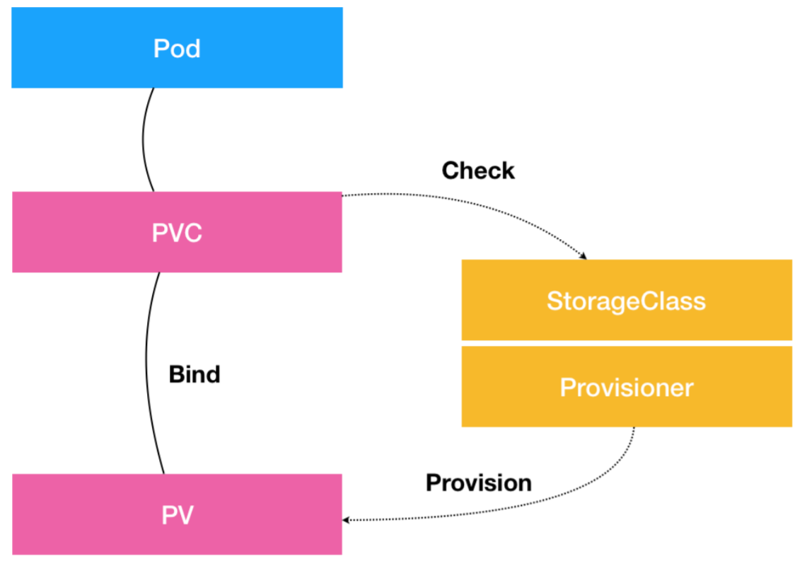

# 存储

## 概念

### PV

Persistent Volume，持久化存储数据卷，主要定义的是一个**持久化存储在宿主机上的目录**，比如一个 NFS 的挂载目录。

通常情况下，PV 对象是由运维人员事先创建在 Kubernetes 集群里待用的。比如，运维人员可以定义这样一个 NFS 类型的 PV：

```
apiVersion: v1
kind: PersistentVolume
metadata:
  name: nfs
spec:
  storageClassName: manual
  capacity:
    storage: 1Gi
  accessModes:
  - ReadWriteMany
  nfs:
    server: 10.244.1.4
    path: "/"
```


### PVC

Persistent Volume Claim 描述的，是 Pod 所希望使用的持久化存储的属性。比如，Volume 存储的大小、可读写权限等等。

PVC 对象通常由开发人员创建；或者以 PVC 模板的方式成为 StatefulSet 的一部分，然后由StatefulSet 控制器负责创建带编号的 PVC。比如，声明一个 1 GiB 大小的 PVC：

```
apiVersion: v1
kind: PersistentVolumeClaim
metadata:
  name: nfs
spec:
  accessModes:
  - ReadWriteMany
  storageClassName: manual
  resources:
    requests:
      storage: 1Gi
```

用户创建的 PVC 要真正被容器使用起来，就必须先和某个符合条件的 PV 进行绑定。这里要检查的条件，包括两部分：

- PV 和 PVC 的 `spec `字段。比如，PV 的存储（storage）大小，就必须满足 PVC 的要求。
- PV 和 PVC 的 `storageClassName `字段必须一样。

> PV 和 PVC 是一对一的关系。可以创建一个大的PVC 共用，通过`subPath`区分。

PVC 和 PV 成功进行绑定之后，Pod 就能够像使用 `hostPath `等常规类型的 Volume 一样，在自己的 YAML 文件里声明使用这个 PVC 了：

```
apiVersion: v1
kind: Pod
metadata:
  labels:
    role: web-frontend
spec:
  containers:
  - name: web
    image: nginx
    ports:
    - name: web
      containerPort: 80
    volumeMounts:
    - name: nfs
      mountPath: "/usr/share/nginx/html"
  volumes:
  - name: nfs
    persistentVolumeClaim:
      claimName: nfs
```

Pod 需要做的，就是在 `volumes `字段里声明自己要使用的 PVC 名字。接下来，等这个 Pod 创建之后，kubelet 就会把这个 PVC 所对应的 PV，也就是一个 NFS 类型的 Volume，挂载在这个 Pod 容器内的目录上。

**PVC 和 PV 的设计，跟“面向对象”的思想完全一致。**PVC 可以理解为持久化存储的“接口”，它提供了对某种持久化存储的描述，但不提供具体的实现；而这个持久化存储的实现部分则由 PV 负责完成。


### Volume Controller

如果在创建 Pod 的时候，系统里并没有合适的 PV 跟它定义的 PVC 绑定，即此时容器想要使用的 Volume 不存在。这时候，Pod 的启动就会报错。过了一会儿，运维人员也发现了这个情况，所以他赶紧创建了一个对应的 PV。这时候，我们当然希望 Kubernetes 能够再次完成 PVC 和 PV 的绑定操作，从而启动 Pod。

实际上，在 Kubernetes 中，存在着一个专门处理持久化存储的控制器，叫作 VolumeController。这个 Volume Controller 维护着多个控制循环，其中有一个叫 PersistentVolumeController 的循环，扮演的就是撮合 PV 和 PVC 的“红娘”角色。

PersistentVolumeController 会不断地查看当前每一个 PVC，是不是已经处于 Bound（已绑定）状态。如果不是，那它就会遍历所有的、可用的 PV，并尝试将其与这个“单身”的 PVC进行绑定。这样，Kubernetes 就可以保证用户提交的每一个 PVC，只要有合适的 PV 出现，它就能够很快进入绑定状态。

而所谓**将一个 PV 与 PVC 进行“绑定”，就是将这个 PV 对象的名字，填在了 PVC 对象的`spec.volumeName` 字段上。**所以，Kubernetes 只要获取到 PVC 对象，就一定能够找到它所绑定的 PV。

绑定后，这个PV 要成为容器里的一个持久化存储，还需要进行挂载。

> 所谓容器的 Volume，就是将一个宿主机上的目录，跟一个容器里的目录绑定挂载在了一起。
>
> 所谓的“持久化 Volume”，指的就是这个宿主机上的目录，具备“持久性”。即：**这个目录里面的内容，既不会因为容器的删除而被清理掉，也不会跟当前的宿主机绑定。**这样，当容器重启或者在其他节点上重建出来之后，它仍然能够通过挂载这个 Volume，访问到这些内容。
>
> 显然，`hostPath `和 `emptyDir `类型的 Volume 并不具备这个特征：它们既有可能被 kubelet 清理掉，也不能被“迁移”到其他节点上。

大多数情况下，持久化 Volume 的实现，往往依赖于一个远程存储服务，比如：远程文件存储（比如，NFS、GlusterFS）、远程块存储（比如，公有云提供的远程磁盘）等等。

 Kubernetes 需要做的工作，就是使用这些存储服务，来为容器准备一个持久化的宿主机目录，以供将来进行绑定挂载时使用。这里的持久化，指的是容器在这个目录里写入的文件，都会保存在远程存储中，从而使得这个目录具备了持久性。


#### 持久化过程

准备“持久化”宿主机目录的过程，可以形象地称为“两阶段处理”。

第一步是**虚拟机挂载远程磁盘的操作**，在 Kubernetes中，把这个阶段称为 **Attach**。

当一个 Pod 调度到一个节点上之后，kubelet 就要负责为这个 Pod 创建它的 Volume 目录。默认情况下，kubelet 为 Volume 创建的目录是如下所示的一个宿主机上的路径：

```
/var/lib/kubelet/pods/<Pod 的 ID>/volumes/kubernetes.io~<Volume 类型 >/<Volume 名字>
```

接下来，kubelet 要做的操作就取决于 Volume 类型了。如果是远程块存储，比如 Google Cloud 的 Persistent Disk（GCE 提供的远程磁盘服务），那么 kubelet 就需要先调用 Goolge Cloud 的 API，将它所提供的 PersistentDisk 挂载到 Pod 所在的宿主机上。

> 可以直接把块存储理解为：一块磁盘。


Attach 阶段完成后，为了能够使用这个远程磁盘，需要**将磁盘设备格式化并挂载到 Volume 宿主机目录**，对应的是“两阶段处理”的第二个阶段：**Mount**。还是由 kubelet 进行这个操作，不难理解，这个挂载点，正是前面提到的 Volume 的宿主机目录。

```
# 通过 lsblk 命令获取磁盘设备 ID
$ sudo lsblk
# 格式化成 ext4 格式，只有RAW 格式才会格式化，如果已经有数据就不会格式化
$ sudo mkfs.ext4 -m 0 -F -E lazy_itable_init=0,lazy_journal_init=0,discard /dev/<磁盘设备 ID>
# 挂载到挂载点
$ sudo mkdir -p /var/lib/kubelet/pods/<Pod 的 ID>/volumes/kubernetes.io~<Volume 类型 >/<Volume 名字 >
```

Mount 阶段完成后，这个 Volume 的宿主机目录就是一个“持久化”的目录了，容器在它里面写入的内容，会保存在远程磁盘中。


如果 Volume 类型是远程文件存储（比如 NFS）的话，kubelet 的处理过程就会更简单一些。因为在这种情况下，kubelet 可以跳过“第一阶段”（Attach）的操作，因为一般来说，远程文件存储并没有一个“存储设备”需要挂载在宿主机上。

所以，kubelet 会直接从“第二阶段”（Mount）开始准备宿主机上的 Volume 目录。在这一步，kubelet 需要作为 client，将远端 NFS 服务器的目录（比如：`/`目录），挂载到Volume 的宿主机目录上：

```
$ mount -t nfs <NFS 服务器地址 >:/ /var/lib/kubelet/pods/<Pod 的 ID>/volumes/kubernetes.io~<Volume 类型 >/<Volume 名字 > 
```

通过这个挂载操作，Volume 的宿主机目录就成为了一个远程 NFS 目录的挂载点，之后在这个目录里写入的所有文件，都会被保存在远程 NFS 服务器上。所以，我们也就完成了对这个Volume 宿主机目录的“持久化”。


**Kubernetes 是如何定义和区分这两个阶段的呢？**

在具体的 Volume 插件的实现接口上，Kubernetes 分别给这两个阶段提供了两种不同的参数列表：

- 对于“第一阶段”（Attach），Kubernetes 提供的可用参数是 `nodeName`，即宿主机的名字。
- 对于“第二阶段”（Mount），Kubernetes 提供的可用参数是 `dir`，即 Volume 的宿主机目录。


经过“两阶段处理”，就得到一个“持久化”的 Volume 宿主机目录。接下来，kubelet 只要把这个 Volume 目录通过 CRI 里的 Mounts 参数，传递给 Docker，然后就可以为 Pod 里的容器挂载这个“持久化”的 Volume 了。

```
$ docker run -v /var/lib/kubelet/pods/<Pod 的 ID>/volumes/kubernetes.io~<Volume 类型 >/<Volume 名字 >:/< 容器内的目标目录 > <image> ...
```

这就是 Kubernetes 处理 PV 的具体原理。

对应地，在删除一个 PV 的时候，Kubernetes 也需要执行“反向操作”，即 `Unmount `和`Dettach `两个阶段来处理。


#### 两阶段处理的控制循环

PV 的处理流程跟 Pod 以及容器的启动流程没有太多的耦合，只要 kubelet 在向 Docker 发起 CRI 请求之前，确保“持久化”的宿主机目录已经处理完毕即可。所以，在 Kubernetes 中，上述关于 PV 的“两阶段处理”流程，是靠独立于 kubelet 主控制循环（Kubelet Sync Loop）之外的两个控制循环来实现的。

“第一阶段”的 Attach（以及 Dettach）操作，是由 Volume Controller 负责维护的，这个控制循环的名字叫作：`AttachDetachController`。它的作用，就是**不断地检查每一个Pod 对应的 PV，和这个 Pod 所在宿主机之间挂载情况。**从而决定，是否需要对这个 PV 进行Attach（或者 Dettach）操作。

需要注意，作为一个 Kubernetes 内置的控制器，Volume Controller 自然是 kubecontroller-manager 的一部分，所以**`AttachDetachController `也一定是运行在 Master 节点上的**。当然，Attach 操作只需要调用公有云或者具体存储项目的 API，并不需要在具体的宿主机上执行操作，所以这个设计没有任何问题。


“第二阶段”的 Mount（以及 Unmount）操作，**必须发生在 Pod 对应的宿主机上，所以它必须是 kubelet 组件的一部分。**这个控制循环的名字，叫作：`VolumeManagerReconciler`，它运行起来之后，是一个独立于 kubelet 主循环的 Goroutine。

通过这样将 Volume 的处理同 kubelet 的主循环解耦，Kubernetes 就避免了这些耗时的远程挂载操作拖慢 kubelet 的主控制循环，进而导致 Pod 的创建效率大幅下降的问题。实际上，**kubelet 的一个主要设计原则，就是它的主控制循环绝对不可以被 block。**


### StorageClass

PV 对象的创建，是由运维人员完成的。但是，在大规模的生产环境里，这是一个非常麻烦的工作。所以，Kubernetes 提供了一套可以自动创建 PV 的机制，即：**Dynamic Provisioning**。相比之下，前面人工管理 PV 的方式就叫作 Static Provisioning。

Dynamic Provisioning 机制工作的核心，在于一个名叫 StorageClass 的 API 对象，它的作用就是**创建 PV 的模板**。为了创建PV 的模板，在定义 StorageClass 对象的时候需要提供如下两部分内容：

- PV 的属性。比如，存储类型、Volume 的大小等。
- 创建这种 PV 需要用到的存储插件。比如 Ceph 等。

有了这样两个信息之后，Kubernetes 就能够根据用户提交的 PVC，找到一个对应的StorageClass 了。然后，Kubernetes 就会调用该 StorageClass 声明的存储插件，创建出需要的 PV。


假如 Volume 的类型是 GCE 的 Persistent Disk 的话，运维人员就需要定义一个如下所示的 StorageClass：

```
apiVersion: storage.k8s.io/v1
kind: StorageClass
metadata:
  name: block-service
provisioner: kubernetes.io/gce-pd
parameters:
  type: pd-ssd
```

在这个 YAML 文件里，定义了一个名叫 `block-service` 的 StorageClass。这个 StorageClass 的 `provisioner `字段的值就是Kubernetes 内置的 GCE PD 存储插件的名字。

而这个 StorageClass 的 `parameters `字段，就是 PV 的参数。 `type=pd-ssd`，指的是这个 PV 的类型是“SSD 格式的 GCE 远程磁盘”。

> 由于需要使用 GCE Persistent Disk，这个例子只有在 GCE 提供的Kubernetes 服务里才能实践。


作为应用开发者，只需要在 PVC 里指定要使用的 `StorageClass `名字即可。**Kubernetes 只会将 StorageClass 相同的 PVC 和 PV 绑定起来。**

```
apiVersion: v1
kind: PersistentVolumeClaim
metadata:
  name: claim1
spec:
  accessModes:
  - ReadWriteOnce
  storageClassName: block-service
  resources:
    requests:
      storage: 30Gi
```

以 Google Cloud 为例，通过 `kubectl create` 创建上述 PVC 对象之后，Kubernetes 就会调用 Google Cloud 的API，创建出一块 SSD 格式的 Persistent Disk。然后，再使用这个 Persistent Disk 的信息，自动创建出一个对应的 PV 对象。


有了 Dynamic Provisioning 机制，运维人员只需要在 Kubernetes 集群里创建出数量有限的StorageClass 对象就可以了。这就好比，运维人员在 Kubernetes 集群里创建出了各种各样的PV 模板。这时候，当开发人员提交了包含 StorageClass 字段的 PVC 之后，Kubernetes 就会根据这个 StorageClass 创建出对应的 PV。

> Kubernetes 的[官方文档](https://kubernetes.io/docs/concepts/storage/storage-classes/#provisioner)里列出了默认支持 Dynamic Provisioning 的内置存储插件。对于不在文档里的插件，比如 NFS，或者其他非内置存储插件，可以通过[kubernetes-incubator/external-storage](https://github.com/kubernetes-incubator/external-storage)这个库编写一个外部插件完成这个工作。


不过，StorageClass 并不是专门为了 Dynamic Provisioning 而设计的。

比如，在 PV 和 PVC 里都声明了 `storageClassName=manual`。而集群里实际上并没有一个名叫 manual 的 StorageClass 对象。这完全没有问题，这个时候 Kubernetes 进行的是 Static Provisioning，但在做绑定决策的时候，它依然会考虑 PV 和PVC 的 StorageClass 定义。

这么做的好处也很明显：这个 PVC 和 PV 的绑定关系，就完全在用户的掌控之中。

> 在 StatefulSet 中，并没有声明StorageClass ，但不影响使用。
>
> 这是因为，如果集群已经开启了名叫 `DefaultStorageClass `的 Admission Plugin，它就会为PVC 和 PV 自动添加一个默认的 StorageClass；否则，PVC 的 `storageClassName `的值就是`“”`，这也意味着它只能够跟 `storageClassName `也是`“”`的 PV 进行绑定。


### 总结



- PVC 描述的，是 Pod 想要使用的持久化存储的属性，比如存储的大小、读写权限等。
- PV 描述的，则是一个具体的 Volume 的属性，比如 Volume 的类型、挂载目录、远程存储服务器地址等。
- StorageClass 的作用，是充当 PV 的模板。并且，只有同属于一个 StorageClass 的PV 和 PVC，才可以绑定在一起。
- StorageClass 的另一个重要作用，是指定 PV 的 Provisioner（存储插件）。这时候，如果存储插件支持 Dynamic Provisioning 的话，Kubernetes 就可以自动创建 PV 了。


## 本地持久化

Kubernetes 直接使用宿主机上的本地磁盘目录，而不依赖于远程存储服务，来提供“持久化”的容器 Volume。这样做的好处很明显，由于这个 Volume 直接使用的是本地磁盘，它的读写性能相比于大多数远程存储来说，要好得多。这个需求对本地物理服务器部署的私有 Kubernetes集群来说，非常常见。

Kubernetes 在 v1.10 之后，就逐渐依靠 PV、PVC 体系实现了这个特性：**Local Persistent Volume**。

不过，Local Persistent Volume 并不适用于所有应用，它的适用范围非常固定，比如：高优先级的系统应用，需要在多个不同节点上存储数据，并且对 I/O 较为敏感。典型的应用包括：分布式数据存储比如 MongoDB、Cassandra 等，分布式文件系统比如 GlusterFS、Ceph 等，以及需要在本地磁盘上进行大量数据缓存的分布式应用。

而且，相比于正常的 PV，一旦这些节点宕机且不能恢复时，Local Persistent Volume 的数据就可能丢失。这就要求使用 Local Persistent Volume 的应用必须具备**数据备份和恢复的能力**，允许把这些数据定时备份在其他位置。


### 难点

Local Persistent Volume 的设计，主要面临两个难点：

- **如何把本地磁盘抽象成 PV。**

  也许有人会说，Local Persistent Volume，不就等同于 `hostPath `加 `NodeAffinity `吗？
  比如，一个 Pod 可以声明使用类型为 Local 的 PV，而这个 PV 其实就是一个 `hostPath `类型的Volume。如果这个 `hostPath `对应的目录，已经在节点 A 上被事先创建好了。那么，就只需要再给这个 Pod 加上一个 `nodeAffinity=nodeA`，不就可以使用这个 Volume 了吗？

  事实上，不应该把一个宿主机上的目录当作 PV 使用。因为，这种本地目录的存储行为完全不可控，它所在的磁盘随时都可能被应用写满，甚至造成整个宿主机宕机。而且，不同的本地目录之间也缺乏最基础的 I/O 隔离机制。

  所以，一个 Local Persistent Volume 对应的存储介质，一定是一块额外挂载在宿主机的**磁盘或者块设备**（“额外”的意思是，它不应该是宿主机根目录所使用的主硬盘）。这个原则，可以称为“**一个 PV 一块盘**”。

- **调度器如何保证 Pod 始终能被正确地调度到它所请求的 Local PersistentVolume 所在的节点上呢？**

  对于常规的 PV 来说，Kubernetes 都是先调度 Pod 到某个节点上，然后，再通过“两阶段处理”来“持久化”这台机器上的 Volume 目录，进而完成 Volume 目录与容器的绑定挂载。

  对于 Local PV 来说，节点上可供使用的磁盘（或者块设备），必须是运维人员提前准备好的。它们在不同节点上的挂载情况可以完全不同，甚至有的节点可以没这种磁盘。所以，调度器必须能够知道**所有节点与 Local Persistent Volume 对应的磁盘的关联关系**，然后根据这个信息来调度 Pod。

  这个原则，称为“**在调度的时候考虑 Volume 分布**”。在 Kubernetes 的调度器里， `VolumeBindingChecker `过滤条件专门负责这个事情。在 Kubernetes v1.11中，这个过滤条件已经默认开启了。


### 实践

基于上述讲述，在开始使用 Local Persistent Volume 之前，首先需要在集群里配置好磁盘或者块设备。在公有云上，这个操作等同于给虚拟机额外挂载一个磁盘，比如 GCE 的 Local SSD类型的磁盘就是一个典型例子。

而在我们部署的私有环境中，你有两种办法来完成这个步骤。

- 给宿主机挂载并格式化一个可用的本地磁盘，这也是最常规的操作
- 对于实验环境，可以在宿主机上挂载几个 RAM Disk（内存盘）来模拟本地磁盘

以内存盘为例，在 Kubernetes 集群上进行实践。首先，在名叫 `manager` 的宿主机上创建一个挂载点，比如` /mnt/disks`；然后，用几个 RAM Disk 来模拟本地磁盘，如下所示：

```
$ mkdir /mnt/disks
$ for vol in vol1 vol2 vol3; do
  mkdir /mnt/disks/$vol
  mount -t tmpfs $vol /mnt/disks/$vol
done
```

> 如果希望其他节点也能支持 Local Persistent Volume 的话，那就需要为它们也执行上述操作，并且**确保这些磁盘的名字（vol1、vol2 等）都不重复。**


然后为这些本地磁盘定义对应的 PV：

```
apiVersion: v1
kind: PersistentVolume
metadata:
  name: example-pv
spec:
  capacity:
    storage: 256Mi
  volumeMode: Filesystem
  accessModes:
  - ReadWriteOnce
  persistentVolumeReclaimPolicy: Delete
  storageClassName: local-storage
  local:
    path: /mnt/disks/vol1
  nodeAffinity:
    required:
      nodeSelectorTerms:
      - matchExpressions:
        - key: kubernetes.io/hostname
          operator: In
          values:
          - manager
```

> `ReclaimPolicy`有`retain`、`recycle` 和 `delete` 三种选项，分别对应在删除 PVC 后，对应的 PV 仍然保留但不能被另一个PVC 使用、清空PV 的数据并可以被继续使用 和 删除对应的PV。

这个 PV 的定义里的`local `字段，指定了它是一个 Local Persistent Volume；而 `path `字段，指定的正是这个 PV 对应的本地磁盘的路径。

这也意味着如果 Pod 要想使用这个 PV，那它就必须运行在 `manager` 上。所以，在这个 PV 的定义里，需要有一个 `nodeAffinity `字段指定`manager` 这个节点的名字。这样，调度器在调度 Pod 的时候，就能够知道一个 PV 与节点的对应关系，从而做出正确的选择。这正是Kubernetes 实现“在调度的时候就考虑 Volume 分布”的主要方法。

接下来就可以使用` kubect create `来创建这个 PV 了：

```
$ kubectl create -f pv.yaml
persistentvolume/example-pv created
$ kubectl get pv
NAME         CAPACITY   ACCESS MODES   RECLAIM POLICY   STATUS      CLAIM   STORAGECLASS    REASON   AGE
example-pv   256Mi      RWO            Delete           Available           local-storage            11s
```

这个 PV 创建后，进入了 Available（可用）状态。而使用 PV 和 PVC 的最佳实践，是创建一个 StorageClass 来描述这个 PV，如下所示：

```
kind: StorageClass
apiVersion: storage.k8s.io/v1
metadata:
  name: local-storage
provisioner: kubernetes.io/no-provisioner
volumeBindingMode: WaitForFirstConsumer
```

这个名叫 `local-storage` 的 StorageClass ，在它的 `provisioner `字段，指定的是 `no-provisioner`。这是因为 Local Persistent Volume 目前尚不支持 Dynamic Provisioning，所以它没办法在用户创建 PVC 的时候，就自动创建出对应的 PV。也就是说，前面创建 PV 的操作，是不可以省略的。

> “延迟绑定” 跟 Dynamic Provisioning 有冲突，是因为Dynamic Provisioning 对于新提交的PVC，会去创建相应的PV，而对于LPV 来说，由于后续使用PVC 的 Pod 的调度情况（运行节点）还不清楚，不一定调度到Dynamic Provisioning 创建的PV 所在的节点上。


这个 StorageClass 还定义了 `volumeBindingMode=WaitForFirstConsumer`，它是 Local Persistent Volume 里一个非常重要的特性，即：**延迟绑定**。

在提交了 PV 和 PVC 的 YAML 文件之后，Kubernetes 就会根据它们俩的属性，以及它们指定的 StorageClass 来进行绑定。只有绑定成功后，Pod 才能通过声明这个 PVC 来使用对应的 PV。

可是，如果使用的是 Local Persistent Volume ，就会发现，这个流程根本行不通。比如，现在有一个只能运行在 node-2 上的 Pod，它声明使用的 PVC 叫作 pvc-1。

而在 Kubernetes 集群中，有两个属性（比如：大小、读写权限）相同的 Local 类型的 PV。其中，第一个 PV 的名字叫作 pv-1，它对应的磁盘所在的节点是 node-1。而第二个 PV 的名字叫作 pv-2，它对应的磁盘所在的节点是 node-2。

假设现在，Kubernetes 的 Volume 控制循环里，首先检查到了 pvc-1 和 pv-1 的属性是匹配的，于是就将它们俩绑定在一起。然后用 `kubectl create` 创建了这个 Pod。

这时候，问题就出现了。调度器看到，这个 Pod 所声明的 pvc-1 已经绑定了 pv-1，而 pv-1 所在的节点是 node-1，根
据“调度器必须在调度的时候考虑 Volume 分布”的原则，这个 Pod 自然会被调度到 node-1 上。可是，前面已经规定过，这个 Pod 根本不允许运行在 node-1 上。所以。最后的结果就是，这个 Pod 的调度必然会失败。


因此，**在使用 Local Persistent Volume 的时候，必须想办法推迟这个“绑定”操作。 这个绑定操作会被推迟到调度的时候。** StorageClass 里的` volumeBindingMode=WaitForFirstConsumer` 的含义，就是告诉 Kubernetes 里的 Volume 控制循环（“红娘”）：虽然你已经发现这个 StorageClass 关联的 PVC 与 PV 可以绑定在一起，但请不要现在就执行绑定操作（即：设置 PVC 的`VolumeName `字段）。而**要等到第一个声明使用该 PVC 的 Pod 出现在调度器之后，调度器再综合考虑所有的调度规则**，当然也包括每个 PV 所在的节点位置，来统一决定，这个 Pod 声明的 PVC，到底应该跟哪个 PV 进行绑定。

这样，在上面的例子里，由于这个 Pod 不允许运行在 pv-1 所在的节点 node-1，所以它的 PVC 最后会跟 pv-2 绑定，并且 Pod 也会被调度到 node-2 上。

通过这个延迟绑定机制，原本实时发生的 PVC 和 PV 的绑定过程，就被延迟到了 Pod 第一次调度的时候在调度器中进行，从而保证了这个绑定结果不会影响 Pod 的正常调度。

在具体实现中，调度器实际上维护了一个与 Volume Controller 类似的控制循环，专门负责为那些声明了“延迟绑定”的 PV 和 PVC 进行绑定工作。通过这样的设计，这个额外的绑定操作，并不会拖慢调度器的性能。而当一个 Pod 的 PVC 尚未
完成绑定时，调度器也不会等待，而是会直接把这个 Pod 重新放回到待调度队列，等到下一个调度周期再做处理。

创建这个 StorageClass 并声明一个PVC 使用它：

```
$ kubectl create -f sc.yaml
storageclass.storage.k8s.io/local-storage created

$ cat << EOF > pvc.yaml
kind: PersistentVolumeClaim
apiVersion: v1
metadata:
  name: example-local-claim
spec:
  accessModes:
  - ReadWriteOnce
  resources:
    requests:
      storage: 256Mi
  storageClassName: local-storage # 上面刚刚创建的 SC 的 name
EOF

$ kubectl create -f pvc.yaml
persistentvolumeclaim/example-local-claim created
$ kubectl get pvc
NAME                  STATUS    VOLUME   CAPACITY   ACCESS MODES   STORAGECLASS    AGE
example-local-claim   Pending                                      local-storage   3s
```

尽管这个时候，Kubernetes 里已经存在了一个可以与 PVC 匹配的 PV，但这个 PVC 依然处于 Pending 状态，也就是等待绑定的状态。需要编写一个使用这个 PVC 的Pod：

```
kind: Pod
apiVersion: v1
metadata:
  name: example-pv-pod
spec:
  volumes:
  - name: example-pv-storage
    persistentVolumeClaim:
      claimName: example-local-claim
  containers:
  - name: example-pv-container
    image: nginx:1.17.8
    ports:
    - containerPort: 80
      name: "http-server"
    volumeMounts:
    - mountPath: "/usr/share/nginx/html"
      name: example-pv-storage
```

这个 Pod 的 `volumes `字段声明要使用前面定义的 `example-local-claim`  PVC 。

```
$ kubectl create -f pod.yaml
pod/example-pv-pod created
$ kubectl get pvc
NAME                  STATUS   VOLUME       CAPACITY   ACCESS MODES   STORAGECLASS    AGE
example-local-claim   Bound    example-pv   256Mi      RWO            local-storage   4m54s
$ kubectl get pv
NAME         CAPACITY   ACCESS MODES   RECLAIM POLICY   STATUS   CLAIM                         STORAGECLASS    REASON   AGE
example-pv   256Mi      RWO            Delete           Bound    default/example-local-claim   local-storage                   28m
```

这说明是在我们创建的 Pod 进入调度器之后，“绑定”操作才开始进行。

在这个 Pod 的 Volume 目录里，创建一个测试文件，然后查看`manager`节点该Local PV 的目录：

```
$ kubectl exec -it example-pv-pod -- bash
root@example-pv-pod:/# cd /usr/share/nginx/html && touch test.txt

$ ls /mnt/disks/vol1/
test.txt
```


即使删除并重新创建这个 Pod ，之前创建的测试文件，依然被保存在这个持久化 Volume 当中：

```
$ kubectl delete -f pod.yaml
pod "example-pv-pod" deleted
$ kubectl create -f pod.yaml
pod/example-pv-pod created
$ kubectl exec -it example-pv-pod -- bash
root@example-pv-pod:/# ls /usr/share/nginx/html/
test.txt
```

这就说明，像 Kubernetes 这样构建出来的、基于本地存储的 Volume，完全可以提供容器持久化存储的功能。所以，像 StatefulSet 这样的有状态编排工具，也完全可以通过声明 Local 类型的 PV 和 PVC，来管理应用的存储状态。


需要注意的是，这种手动创建 PV 的方式，即 Static 的 PV 管理方式，在删除 PV 时需要按如下流程执行操作：

1. 删除使用这个 PV 的 Pod；
2. 从宿主机移除本地磁盘（比如，`umount `）；
3. 删除 PVC；
4. 删除 PV。


由于上面这些创建 PV 和删除 PV 的操作比较繁琐，Kubernetes 提供了一个 [Static Provisioner](https://github.com/kubernetes-sigs/sig-storage-local-static-provisioner) 来管理这些 PV。比如，现在的所有磁盘，都挂载在宿主机的 `/mnt/disks` 目录下。那么，当 Static Provisioner 启动后，它就会通过 DaemonSet，自动检查每个宿主机的`/mnt/disks` 目录。然后，调用 Kubernetes API，为这些目录下面的每一个挂载，创建一个对应的 PV 对象出来。


## 存储插件

### FlexVolume

以编写一个使用 NFS 实现的 FlexVolume 插件为例，对于一个 FlexVolume 类型的 PV 来说，它的 YAML 文件如下所示：

```
apiVersion: v1
kind: PersistentVolume
metadata:
  name: pv-flex-nfs
spec:
  capacity:
    storage: 512Mi
  accessModes:
  - ReadWriteMany
  flexVolume:
    driver: "k8s/nfs" # vendor-drive
    fsType: "nfs"
    options:
      server: "192.168.50.150" # NFS 服务器地址
      share: "/export" # 共享的目录
```

创建这个PV 后，一旦和某个 PVC 绑定起来，这个 FlexVolume 类型的 Volume 就会进入到 Volume 的 “两阶段处理”，即“Attach 阶段”和“Mount 阶段”。它们的主要作用，是在 Pod 所绑定的宿主机上，完成这个 Volume 目录的持久化过程，比如为虚拟机挂载磁盘（Attach），或者挂载一个 NFS 的共享目录（Mount）。

> **用Docker 运行 NFS**
>
> 用这个[镜像](https://github.com/ehough/docker-nfs-server)部署，需要先创建一个共享目录，和一个[exports](https://linux.die.net/man/5/exports)文件：
>
> ```
> $ mkdir -p ~/nfs/shared
> $ cat << EOF > ~/nfs/exports
> /export   192.168.50.0/24(rw)
> EOF
> 
> $ touch ~/nfs/shared/test.txt
> 
> $ modprobe {nfs,nfsd,rpcsec_gss_krb5}
> $ docker run                              \
>   -v ~/nfs/shared:/export                 \
>   -v ~/nfs/exports:/etc/exports:ro        \
>   --privileged  -p 2049:2049       erichough/nfs-server
> ```
>
> 


在具体的控制循环中，这`Attach` 和 `Mount` 这两个操作实际上调用的，是 Kubernetes 的 `pkg/volume` 目录下的存储插件（Volume Plugin）。在这个例子里，就是 [pkg/volume/flexvolume](https://github.com/kubernetes/kubernetes/tree/master/pkg/volume/flexvolume) 这个目录里的代码。这个目录其实只是 FlexVolume 插件的入口。以“Mount 阶段”为例，在[FlexVolume/mounter.go](https://github.com/kubernetes/kubernetes/blob/master/pkg/volume/flexvolume/mounter.go) 文件中，它的处理过程非常简单，如下所示：

```
// SetUpAt creates new directory.
func (f *flexVolumeMounter) SetUpAt(dir string, mounterArgs volume.MounterArgs) error {
	...
	call := f.plugin.NewDriverCall(mountCmd)

	// Interface parameters
	call.Append(dir)

	extraOptions := make(map[string]string)

	// pod metadata
	extraOptions[optionKeyPodName] = f.podName
	extraOptions[optionKeyPodNamespace] = f.podNamespace
	extraOptions[optionKeyPodUID] = string(f.podUID)
	// service account metadata
	extraOptions[optionKeyServiceAccountName] = f.podServiceAccountName
	...

	call.AppendSpec(f.spec, f.plugin.host, extraOptions)
	_, err = call.Run()
    ...
	return nil
}
```

这个方法是 FlexVolume 插件对“Mount 阶段”的实现位置，它实际上只做了一件事：封装出了一行命令（即：NewDriverCall），由 kubelet 在“Mount 阶段”去执行。在这个例子中，kubelet 要通过插件在宿主机上执行的命令如下：

```
/usr/libexec/kubernetes/kubelet-plugins/volume/exec/k8s~nfs/nfs mount <mount dir> <json param>
```

`/usr/libexec/kubernetes/kubelet-plugins/volume/exec/k8s~nfs/nfs` 是插件的可执行文件的路径，这个名叫 nfs 的文件，正是编写的插件的实现。它可以是一个二进制文件，也可以是一个脚本，只要能在宿主机上被执行起来即可。

这个路径里的 `k8s~nfs` 部分，正是这个插件在 Kubernetes 里的名字，它是从 `driver="k8s/nfs"`字段解析出来的。

**因此，在编写完 FlexVolume 的实现之后，一定要把它的可执行文件放在每个节点的插件目录下。**

紧跟在可执行文件后面的`mount`参数，定义的就是当前的操作。在 FlexVolume 里，这些操作参数的名字是固定的，比如 `init`、`mount`、`unmount`、`attach`，以及 `detach `等等，分别对应不同的 Volume 处理操作。

跟在 `mount `参数后面的两个字段：`<mount dir>`和`<json param>`，则是 FlexVolume必须提供给这条命令的两个执行参数。

- `mount dir` 是kubelet 调用 `SetUpAt() `方法传递来的 `dir `的值，它代表的是当前正在处理的 Volume 在宿主机上的目录。在这个例子里，这个路径如下所示：

  ```
   /var/lib/kubelet/pods/<Pod ID>/volumes/k8s~nfs/test
  ```

  `test `是前面定义的 PV 的名字；而 `k8s~nfs`，则是插件的名字。

- `json param` 是一个 JSON Map 格式的参数列表。 PV里定义的 `options `字段的值，都会被追加在这个参数里。此外，在` SetUpAt() `方法里可以看到，这个参数列表里还包括了 Pod 的名字、Namespace 等元数据（Metadata）。


这个插件的可执行文件的实现部分可以用[shell 脚本](https://github.com/kubernetes/examples/blob/master/staging/volumes/flexvolume/nfs)实现，它对`mount`阶段的处理过程如下：

```
domount() {
	MNTPATH=$1

	NFS_SERVER=$(echo $2 | jq -r '.server')
	SHARE=$(echo $2 | jq -r '.share')

	if [ $(ismounted) -eq 1 ] ; then
		log '{"status": "Success"}'
		exit 0
	fi

	mkdir -p ${MNTPATH} &> /dev/null

	mount -t nfs ${NFS_SERVER}:/${SHARE} ${MNTPATH} &> /dev/null
	if [ $? -ne 0 ]; then
		err "{ \"status\": \"Failure\", \"message\": \"Failed to mount ${NFS_SERVER}:${SHARE} at ${MNTPATH}\"}"
		exit 1
	fi
	log '{"status": "Success"}'
	exit 0
}
```

当 kubelet 在宿主机上执行`nfs mount <mount dir> <json params>`  时，这个名叫 `nfs `的脚本，就可以直接从参数里拿到 Volume 在宿主机上的挂载目录，nfs 服务的地址和共享目录，之后就可以执行`mount -t nfs` 命令进行挂载。

这个脚本需要返回一个 JOSN 格式的字符串给调用者 kubelet，比如：`{“status”: “Success”}`，这是 kubelet 判断这次调用是否成功的唯一依据。


#### 总结

在“Mount 阶段”，kubelet 的 `VolumeManagerReconcile `控制循环里的一次“调谐”操作的执行流程，如下所示：

```
kubelet --> pkg/volume/flexvolume.SetUpAt() --> /usr/libexec/kubernetes/kubelet-plugins/volume/exec/k8s~nfs/nfs mount <mount dir> <json param>
```

> 一个用go语言实现的FlexVolume例子：[flexvolume](https://github.com/kubernetes/frakti/tree/master/pkg/flexvolume)。


FlexVolume 实现方式，虽然简单，但局限性却很大。比如，跟 Kubernetes 内置的 NFS 插件类似，这个 NFS FlexVolume 插件，也不能支持Dynamic Provisioning（即：为每个 PVC 自动创建 PV 和对应的 Volume）。除非为它编
写一个专门的 External Provisioner。

再比如，插件在执行 `mount `操作的时候，可能会生成一些挂载信息。这些信息，在后面执行 `unmount `操作的时候会被用到。可是，在上述 FlexVolume 的实现里，没办法把这些信息保存在一个变量里，等到 `unmount `的时候直接使用。因为 FlexVolume 每一次对插件可执行文件的调用，都是一次完全独立的操作。所以，我们只能把这些信息写在一个宿主机上的临时文件里，等到 `unmount `的时候再去读取。


### CSI


上图展示了 Kubernetes 里通过存储插件管理容器持久化存储的原理，无论是 FlexVolume，还是 Kubernetes 内置的其他存储插件，它们实际上担任的角色，仅仅是 Volume 管理中的“Attach 阶段”和“Mount 阶段”的具体执行者（使用PV）。而像 Dynamic Provisioning 这样的功能（生成PV），就不是存储插件的责任，而是 Kubernetes 本身存储管理功能的一部分。

而 CSI 插件体系的设计思想，就是把这个 Provision 阶段，以及 Kubernetes 里的一部分存储管理功能，从主干代码里剥离出来，做成了几个单独的组件。这些组件会通过 Watch API 监听 Kubernetes 里与存储相关的事件变化，比如 PVC 的创建，来执行具体的存储管理动作。

而这些管理动作，比如“Attach 阶段”和“Mount 阶段”的具体操作，实际上就是通过调用CSI 插件来完成的。


这套存储插件体系多了三个独立的外部组件（External Components），即：Driver Registrar、External Provisioner 和 External Attacher，对应的正是从 Kubernetes 项目里面剥离出来的那部分存储管理功能。

> External Components 虽然是外部组件，但依然由 Kubernetes 社区来开发和维护。

图中最右侧的部分，就是需要我们编写代码来实现的 CSI 插件。一个 CSI 插件只有一个二进制文件，但它会以 gRPC 的方式对外提供三个服务（gRPC Service），分别叫作：CSI Identity、CSI Controller 和 CSI Node。


#### External Components

**Driver Registrar 组件**，负责将插件注册到 kubelet 里面（可以类比为，将可执行文件放在插件目录下）。而在具体实现上，Driver Registrar 需要请求 CSI 插件的 Identity 服务来获取插件信息。


**External Provisioner 组件**，负责的正是 Provision 阶段。在具体实现上，External Provisioner 监听（Watch）了 APIServer 里的 PVC 对象。当一个 PVC 被创建时，它就会调用 CSI Controller 的 `CreateVolume `方法，创建对应 PV。

如果使用的存储是公有云提供的磁盘（或者块设备）的话，这一步就需要调用公有云（或者块设备服务）的 API 来创建这个 PV 所描述的磁盘（或者块设备）了。

> 由于 CSI 插件是独立于 Kubernetes 之外的，所以在 CSI 的 API 里不会直接使用 Kubernetes 定义的 PV 类型，而是会自己定义一个单独的 Volume 类型。
>
> 把 Kubernetes 里的持久化卷类型叫作 PV，把 CSI 里的持久化卷类型叫作 CSI Volume。


**External Attacher 组件**，负责的正是“Attach 阶段”。在具体实现上，它监听了 APIServer 里 `VolumeAttachment `对象的变化。`VolumeAttachment `对象是 Kubernetes 确认一个 Volume 可以进入“Attach 阶段”的重要标志。一旦出现了 `VolumeAttachment `对象，External Attacher 就会调用 CSI Controller 服务的 `ControllerPublish `方法，完成它所对应的 Volume 的 Attach 阶段。

而 Volume 的“Mount 阶段”，并不属于 External Components 的职责。当 kubelet 的 `VolumeManagerReconciler `控制循环检查到它需要执行 Mount 操作的时候，会通过 `pkg/volume/csi` 包，直接调用 CSI Node 服务完成 Volume 的“Mount 阶段”。


#### CSI 插件

**CSI Identity**，负责对外暴露这个插件本身的信息：

```
service Identity {
  // return the version and name of the plugin
  rpc GetPluginInfo(GetPluginInfoRequest)
    returns (GetPluginInfoResponse) {}
  // reports whether the plugin has the ability of serving the Controller interface
  rpc GetPluginCapabilities(GetPluginCapabilitiesRequest)
    returns (GetPluginCapabilitiesResponse) {}
  // called by the CO just to check whether the plugin is running or not
  rpc Probe (ProbeRequest)
    returns (ProbeResponse) {}
}
```

> 这些proto 定义可以在[container-storage-interface/spec](https://github.com/container-storage-interface/spec/blob/master/csi.proto)找到。


**CSI Controller** 服务，定义的则是对 CSI Volume（对应 Kubernetes 里的 PV）的管理接口，比如：创建和删除 CSI Volume、对 CSI Volume 进行 `Attach/Dettach`（在 CSI 里，这个操作被叫作 `Publish/Unpublish`），以及对 CSI Volume 进行 Snapshot 等，它们的接口定义如下所示：

```
service Controller {
  // provisions a volume
  rpc CreateVolume (CreateVolumeRequest)
    returns (CreateVolumeResponse) {}
 
  // deletes a previously provisioned volume
  rpc DeleteVolume (DeleteVolumeRequest)
    returns (DeleteVolumeResponse) {}
 
  // make a volume available on some required node
  rpc ControllerPublishVolume (ControllerPublishVolumeRequest)
    returns (ControllerPublishVolumeResponse) {}
 
  // make a volume un-available on some required node
  rpc ControllerUnpublishVolume (ControllerUnpublishVolumeRequest)
    returns (ControllerUnpublishVolumeResponse) {}
 
  ...
 
  // make a snapshot
  rpc CreateSnapshot (CreateSnapshotRequest)
    returns (CreateSnapshotResponse) {}
 
  // Delete a given snapshot
  rpc DeleteSnapshot (DeleteSnapshotRequest)
    returns (DeleteSnapshotResponse) {}
 
  ...
}
```

CSI Controller 服务里定义的这些操作有个共同特点，那就是**它们都无需在宿主机上进行**，而是属于 Kubernetes 里 Volume Controller 的逻辑，也就是属于 Master 节点的一部分。

CSI Controller 服务的实际调用者，并不是 Kubernetes（即：通过 `pkg/volume/csi `发起 CSI 请求），而是 External Provisioner 和 External Attacher。这两个 External Components，分别通过监听 PVC 和 VolumeAttachement 对象，来跟 Kubernetes 进行协作。


CSI Volume 需要在宿主机上执行的操作，都定义在了 **CSI Node** 服务里面，如下所示：

```
service Node {
  // temporarily mount the volume to a staging path
  rpc NodeStageVolume (NodeStageVolumeRequest)
    returns (NodeStageVolumeResponse) {}
 
  // unmount the volume from staging path
  rpc NodeUnstageVolume (NodeUnstageVolumeRequest)
    returns (NodeUnstageVolumeResponse) {}
 
  // mount the volume from staging to target path
  rpc NodePublishVolume (NodePublishVolumeRequest)
    returns (NodePublishVolumeResponse) {}
 
  // unmount the volume from staging path
  rpc NodeUnpublishVolume (NodeUnpublishVolumeRequest)
    returns (NodeUnpublishVolumeResponse) {}
 
  // stats for the volume
  rpc NodeGetVolumeStats (NodeGetVolumeStatsRequest)
    returns (NodeGetVolumeStatsResponse) {}
 
  ...
 
  // Similar to NodeGetId
  rpc NodeGetInfo (NodeGetInfoRequest)
    returns (NodeGetInfoResponse) {}
}
```

“Mount 阶段”在 CSI Node 里的接口，是由 `NodeStageVolume `和 `NodePublishVolume `两个接口共同实现的。


#### VS  FlexVolume

相比于 FlexVolume，CSI 的设计思想，把插件的职责从“两阶段处理”，扩展成了 Provision、Attach 和 Mount 三个阶段。其中，Provision 等价于“创建磁盘”，Attach 等价于“挂载磁盘到虚拟机”，Mount 等价于“将该磁盘格式化后，挂载在 Volume 的宿主机目录上”。

- 当 AttachDetachController 需要进行“Attach”操作时（“Attach 阶段”），它实际上会执行到` pkg/volume/csi `目录中，创建一个 VolumeAttachment 对象，从而**触发 ExternalAttacher 调用 CSI Controller 服务**的 `ControllerPublishVolume `方法。
- 当 VolumeManagerReconciler 需要进行“Mount”操作时（“Mount 阶段”），它实际上也会执行到 `pkg/volume/csi` 目录中，**直接**向 CSI Node 服务发起调用`NodePublishVolume `方法的请求。


#### 插件编写

让Kubernetes 集群使用 DigitalOcean 提供的块存储服务，作为容器的持久化存储。有了 CSI 插件之后，要使用持久化存储，只需要创建一个StorageClass 对象即可：

```
kind: StorageClass
apiVersion: storage.k8s.io/v1
metadata:
  name: do-block-storage
  namespace: kube-system
  annotations:
  storageclass.kubernetes.io/is-default-class: "true" # 设置为默认的持久化存储提供者
provisioner: com.digitalocean.csi.dobs
```

有了这个 StorageClass，External Provisoner 就会为集群中新出现的 PVC 自动创建出 PV，然后调用 CSI 插件创建出这个 PV 对应的 Volume，这正是 CSI 体系中 Dynamic Provisioning的实现方式。

`provisioner` 字段告诉Kubernetes，使用`com.digitalocean.csi.dobs` 这个CSI 插件处理这个StorageClass 相关的所有操作。而 Kubernetes 要想知道一个 CSI 插件的名字，就是 CSI Identity 服务的职责了。


一个 CSI 插件的**代码结构**非常简单：

```
$ tree $GOPATH/src/github.com/digitalocean/csi-digitalocean/driver 
$GOPATH/src/github.com/digitalocean/csi-digitalocean/driver
├── controller.go
├── driver.go
├── health.go
├── identity.go
├── mounter.go
├── node.go
└── paging.go
```


##### gRPC

为了能够让 Kubernetes 访问到 CSI Identity 服务，需要先在 `driver.go` 文件里，定义一个标准的 gRPC Server：

```
// Run starts the CSI plugin by communication over the given endpoint
func (d *Driver) Run(ctx context.Context) error {
  ...
  grpcListener, err := net.Listen(u.Scheme, grpcAddr)
  ...
  
  d.srv = grpc.NewServer(grpc.UnaryInterceptor(errHandler))
  csi.RegisterIdentityServer(d.srv, d)
  csi.RegisterControllerServer(d.srv, d)
  csi.RegisterNodeServer(d.srv, d)

  d.ready = true // we're now ready to go!
  ...

  return eg.Wait()
}
```

只要把编写好的 gRPC Server 注册给 CSI，它就可以响应来自 External Components 的 CSI 请求了。


##### CSI Identity

CSI Identity 服务的实现，就定义在了 driver 目录下的` identity.go` 文件里，最重要的接口是 `GetPluginInfo`，它返回的是这个插件的名字和版本号：

```
// GetPluginInfo returns metadata of the plugin
func (d *Driver) GetPluginInfo(ctx context.Context, req *csi.GetPluginInfoRequest) (*csi.GetPluginInfoResponse, error) {
  resp := &csi.GetPluginInfoResponse{
    Name:          d.name, // com.digitalocean.csi.dobs
    VendorVersion: version,
  }
  ...
  return resp, nil
}
```

Kubernetes 正是通过`GetPluginInfo` 的返回值，找到在 StorageClass 里声明要使用的 CSI 插件。

> CSI 要求插件的名字遵守[反向 DNS](https://en.wikipedia.org/wiki/Reverse_domain_name_notation)格式。


Identity 服务的`GetPluginCapabilities `接口也很重要，它返回这个 CSI 插件的“能力”。

如果 CSI 插件不准备实现“Provision 阶段”和“Attach 阶段”（一个最简单的 NFS 存储插件就不需要这两个阶段）时，就可以通过这个接口返回：本插件不提供CSI Controller 服务，即没有`csi.PluginCapability_Service_CONTROLLER_SERVICE` 这个“能力”。这样，Kubernetes 就知道这个信息了。

CSI Identity 服务还提供了一个 `Probe `接口，Kubernetes 会调用它来检查这个 CSI 插件是否正常工作。一般情况下，在编写插件时给它设置一个 `Ready `标志，当插件的 gRPC Server 停止的时候，把这个 `Ready `标志设置为 `false`。或者，也你可以在这里访问一下插件的端口，类似于健康检查的做法。


#####  CSI Controller

CSI Controller 服务的代码实现`controller.go` 文件里，主要实现的就是 Volume 管理流程中的“Provision 阶段”和“Attach 阶段”。`CreateVolume `的主要逻辑如下所示：

```
// CreateVolume creates a new volume from the given request. The function is idempotent.
func (d *Driver) CreateVolume(ctx context.Context, req *csi.CreateVolumeRequest) (*csi.CreateVolumeResponse, error) {
  ...
  volumeName := req.Name

  // get volume first, if it's created do no thing
  volumes, _, err := d.storage.ListVolumes(ctx, &godo.ListVolumeParams{
    Region: d.region,
    Name:   volumeName,
  })
  ...

  // volume already exist, do nothing
  if len(volumes) != 0 {
    ...
    return &csi.CreateVolumeResponse{
      Volume: &csi.Volume{
        VolumeId:      vol.ID,
        CapacityBytes: vol.SizeGigaBytes * giB,
      },
    }, nil
  }

  volumeReq := &godo.VolumeCreateRequest{
    Region:        d.region,
    Name:          volumeName,
    Description:   createdByDO,
    SizeGigaBytes: size / giB,
  }
  ...
  vol, _, err := d.storage.CreateVolume(ctx, volumeReq)
  ...

  resp := &csi.CreateVolumeResponse{
    Volume: &csi.Volume{
      VolumeId:      vol.ID,
      CapacityBytes: size,
      AccessibleTopology: []*csi.Topology{
        {
          Segments: map[string]string{
            "region": d.region,
          },
        },
      },
    },
  }
  ...
  return resp, nil
```

对于 DigitalOcean 这样的公有云来说，`CreateVolume `需要做的操作，就是先判断是否已经存在需要的Volume，不存在就调用DigitalOcean 块存储服务的 API，创建出一个存储卷（`d.storage.CreateVolume`）。如果使用的是其他类型的块存储（比如 Cinder、Ceph RBD 等），对应的操作也是类似地调用创建存储卷的 API。


“Attach 阶段”对应的接口是 `ControllerPublishVolume `和`ControllerUnpublishVolume`，它们的调用者是 External Attacher。`ControllerPublishVolume ` 的逻辑如下所示：

```
// ControllerPublishVolume attaches the given volume to the node
func (d *Driver) ControllerPublishVolume(ctx context.Context, req *csi.ControllerPublishVolumeRequest) (*csi.ControllerPublishVolumeResponse, error) {
  ...
  dropletID, err := strconv.Atoi(req.NodeId)
  ...
  // check if volume exist before trying to attach it
  vol, resp, err := d.storage.GetVolume(ctx, req.VolumeId)
  ...
  // check if droplet exist before trying to attach the volume to the droplet
  _, resp, err = d.droplets.Get(ctx, dropletID)
  
  // check if has been attached
  for _, id := range vol.DropletIDs {
    attachedID = id
    if id == dropletID {
      log.Info("volume is already attached")
      return &csi.ControllerPublishVolumeResponse{
        PublishContext: map[string]string{
          d.publishInfoVolumeName: vol.Name,
        },
      }, nil
    }
  }
  ...
  // attach the volume to the correct node
  action, resp, err := d.storageActions.Attach(ctx, req.VolumeId, dropletID)
  ...
  return &csi.ControllerPublishVolumeResponse{
    PublishContext: map[string]string{
      d.publishInfoVolumeName: vol.Name,
    },
  }, nil
}
```

对于 DigitalOcean 来说，`ControllerPublishVolume `在“Attach 阶段”需要做的工作，是调用 DigitalOcean 的 API，将前面创建的存储卷，挂载到指定的虚拟机上（`d.StorageActions.Attach`）。其中，存储卷由请求中的 `VolumeId `来指定。而虚拟机，也就是将要运行 Pod 的宿主机，则由请求中的 `NodeId `来指定。这些参数，都是 External Attacher 在发起请求时需要设置的。


External Attacher 的工作原理，是监听（Watch）了名叫 `VolumeAttachment `的 API 对象。这个 API 对象的主要字段如下所示：

```
// VolumeAttachmentSpec is the specification of a VolumeAttachment request.
type VolumeAttachmentSpec struct {
  // Attacher indicates the name of the volume driver that MUST handle this
  // request. This is the name returned by GetPluginName().
  Attacher string
  // Source represents the volume that should be attached.
  Source VolumeAttachmentSource
  // The node that the volume should be attached to.
  NodeName string
}
```

这个对象的生命周期，是由 `AttachDetachController `负责管理的，这个控制循环的职责，是**不断检查 Pod 所对应的 PV，在它所绑定的宿主机上的挂载情况**，从而决定是否需要对这个 PV 进行 Attach（或者 Dettach）操作。

而这个 Attach 操作，在 CSI 体系里，就是创建出上面这样一个 VolumeAttachment 对象。可以看到，Attach 操作所需的 PV 的名字（Source）、宿主机的名字（NodeName）、存储插件的名字（Attacher），都是这个 VolumeAttachment 对象的一部分。

而当 External Attacher 监听到这样的一个对象出现之后，就可以立即使用VolumeAttachment 里的这些字段，封装成一个 gRPC 请求调用 CSI Controller 的`ControllerPublishVolume `方法。


##### CSI Node

CSI Node 服务对应的，是 Volume 管理流程里的“Mount 阶段”，它的代码实现，在 `node.go` 文件里。kubelet 的 `VolumeManagerReconciler `控制循环会直接调用CSI Node 服务来完成 Volume 的“Mount 阶段”。

在具体的实现中，这个“Mount 阶段”的处理被细分成了 `NodeStageVolume `和 `NodePublishVolume `这两个接口。

对于磁盘以及块设备来说，它们被 Attach 到宿主机上之后，就成为了宿主机上的一个待用存储设备。而到了“Mount 阶段”，首先需要格式化这个设备，然后才能把它挂载到 Volume 对应的宿主机目录上。在 kubelet 的 `VolumeManagerReconciler `控制循环中，这两步操作分别叫作`MountDevice`和 `SetUp`。

`MountDevice `操作，就是直接调用了 CSI Node 服务里的 `NodeStageVolume `接口，格式化 Volume 在宿主机上对应的存储设备，然后挂载到一个临时目录（Staging 目录）上。对于 DigitalOcean 来说，`NodeStageVolume `接口实现如下：

```
// NodeStageVolume mounts the volume to a staging path on the node. This is
// called by the CO before NodePublishVolume and is used to temporary mount the
// volume to a staging path. Once mounted, NodePublishVolume will make sure to
// mount it to the appropriate path
func (d *Driver) NodeStageVolume(ctx context.Context, req *csi.NodeStageVolumeRequest) (*csi.NodeStageVolumeResponse, error) {
  ...
  if volName, ok := req.GetPublishContext()[d.publishInfoVolumeName]; !ok {
    return nil, status.Error(codes.InvalidArgument, "Could not find the volume by name")
  } else {
    volumeName = volName
  }
  ...
  source := getDeviceByIDPath(volumeName)
  target := req.StagingTargetPath
  ...
    if !formatted {
      log.Info("formatting the volume for staging")
      if err := d.mounter.Format(source, fsType); err != nil {
        return nil, status.Error(codes.Internal, err.Error())
      }
    } else {
      log.Info("source device is already formatted")
    }
  ...
  mounted, err := d.mounter.IsMounted(target)
  ...
  if !mounted {
    if err := d.mounter.Mount(source, target, fsType, options...); err != nil {
      return nil, status.Error(codes.Internal, err.Error())
    }
  } else {
    log.Info("source device is already mounted to the target path")
  }
  ...
  return &csi.NodeStageVolumeResponse{}, nil
```

在 `NodeStageVolume `的实现里，首先通过 DigitalOcean 的 API 获取这个 Volume 对应的设备路径(`getDeviceByIDPath`)， 然后把这个设备格式化成指定的格式（ `d.mounter.Format`）；最后把格式化后的设备挂载到了一个临时目录下。


`SetUp` 操作会调用 CSI Node 服务的 `NodePublishVolume `接口。有了上述对设备的预处理工作，它的实现就非常简单了：

```
// NodePublishVolume mounts the volume mounted to the staging path to the target path
func (d *Driver) NodePublishVolume(ctx context.Context, req *csi.NodePublishVolumeRequest) (*csi.NodePublishVolumeResponse, error) {
  ...
  switch req.GetVolumeCapability().GetAccessType().(type) {
  case *csi.VolumeCapability_Block:
    err = d.nodePublishVolumeForBlock(req, options, log)
  case *csi.VolumeCapability_Mount:
    err = d.nodePublishVolumeForFileSystem(req, options, log)
  default:
    return nil, status.Error(codes.InvalidArgument, "Unknown access type")
  }
  ...
  return &csi.NodePublishVolumeResponse{}, nil
}
```

这一步根据Volume 的类型，将 Staging 目录，绑定挂载到 Volume 对应的宿主机目录上。由于 Staging 目录，正是 Volume 对应的设备被格式化后挂载在宿主机上的位置，所以当它和Volume 的宿主机目录绑定挂载之后，这个 Volume 宿主机目录的“持久化”处理也就完成了。


对于文件系统类型的存储服务来说，比如 NFS 和 GlusterFS等，它们并没有一个对应的磁盘“设备”存在于宿主机上，所以 kubelet 在`VolumeManagerReconciler `控制循环中，会跳过 `MountDevice `操作而直接执行 `SetUp `操作。所以对于它们来说，也就不需要实现 `NodeStageVolume `接口了。


##### 使用

首先需要创建一个Secret 对象存放DO 的授权信息：

```
apiVersion: v1
kind: Secret
metadata:
  name: digitalocean
  namespace: kube-system
stringData:
  access-token: "REPLACE_ME"
```

然后通过DO 提供的YAML 文件部署：

```
$ kubectl apply -f https://github.com/digitalocean/csi-digitalocean/blob/master/deploy/kubernetes/releases/csi-digitalocean-v1.3.0.yaml
```

这个YAML 文件的DaemonSet 和 StatefulSet 如下：

```
kind: DaemonSet
apiVersion: apps/v1
metadata:
  name: csi-do-node
  namespace: kube-system
spec:
  selector:
    matchLabels:
      app: csi-do-node
  template:
    metadata:
      labels:
        app: csi-do-node
        role: csi-do
    spec:
      priorityClassName: system-node-critical
      serviceAccount: csi-do-node-sa
      hostNetwork: true
      initContainers:
        - name: automount-udev-deleter
          ...
      containers:
        - name: csi-node-driver-registrar
          ...
        - name: csi-do-plugin
          image: digitalocean/do-csi-plugin:v1.3.0
          args :
            - "--endpoint=$(CSI_ENDPOINT)"
            - "--url=$(DIGITALOCEAN_API_URL)"
          env:
            - name: CSI_ENDPOINT
              value: unix:///csi/csi.sock
            - name: DIGITALOCEAN_API_URL
              value: https://api.digitalocean.com/
          imagePullPolicy: "Always"
          securityContext:
            privileged: true
            capabilities:
              add: ["SYS_ADMIN"]
            allowPrivilegeEscalation: true
          volumeMounts:
            - name: plugin-dir
              mountPath: /csi
            - name: pods-mount-dir
              mountPath: /var/lib/kubelet
              # needed so that any mounts setup inside this container are
              # propagated back to the host machine.
              mountPropagation: "Bidirectional"
            - name: device-dir
              mountPath: /dev
      volumes:
        - name: registration-dir
          hostPath:
            path: /var/lib/kubelet/plugins_registry/
            type: DirectoryOrCreate
        - name: plugin-dir
          hostPath:
            path: /var/lib/kubelet/plugins/dobs.csi.digitalocean.com
            type: DirectoryOrCreate
        - name: pods-mount-dir
          hostPath:
            path: /var/lib/kubelet
            type: Directory
        - name: device-dir
          hostPath:
            path: /dev
        - name: udev-rules-dir
          hostPath:
            path: /etc/udev/rules.d/
            
---
kind: StatefulSet
apiVersion: apps/v1
metadata:
  name: csi-do-controller
  namespace: kube-system
spec:
  serviceName: "csi-do"
  selector:
    matchLabels:
      app: csi-do-controller
  replicas: 1
  template:
    metadata:
      labels:
        app: csi-do-controller
        role: csi-do
    spec:
      priorityClassName: system-cluster-critical
      serviceAccount: csi-do-controller-sa
      containers:
        - name: csi-provisioner
          ...
        - name: csi-attacher
          ...
        - name: csi-snapshotter
          ...
        - name: csi-resizer
          ...
        - name: csi-do-plugin
          image: digitalocean/do-csi-plugin:v1.3.0
          args :
            - "--endpoint=$(CSI_ENDPOINT)"
            - "--token=$(DIGITALOCEAN_ACCESS_TOKEN)"
            - "--url=$(DIGITALOCEAN_API_URL)"
          env:
            - name: CSI_ENDPOINT
              value: unix:///var/lib/csi/sockets/pluginproxy/csi.sock
            - name: DIGITALOCEAN_API_URL
              value: https://api.digitalocean.com/
            - name: DIGITALOCEAN_ACCESS_TOKEN
              valueFrom:
                secretKeyRef:
                  name: digitalocean
                  key: access-token
          imagePullPolicy: "Always"
          volumeMounts:
            - name: socket-dir
              mountPath: /var/lib/csi/sockets/pluginproxy/
      volumes:
        - name: socket-dir
          emptyDir: {}
```

CSI 插件只有一个二进制文件，它的镜像是 `digitalocean/do-csi-plugin:v1.3.0`。**部署 CSI 插件的常用原则**是：

- 通过 DaemonSet 在每个节点上都启动一个 CSI 插件，来为 kubelet 提供 CSI Node 服务。这是因为，CSI Node 服务需要被 kubelet 直接调用，所以它要和 kubelet“一对一”地部署起来。

  在 DaemonSet 的定义里面，除了 CSI 插件，还以 sidecar 的方式运行着` csi-node-driver-registrar` 这个外部组件。它的作用是向 kubelet 注册这个 CSI 插件。这个注册过程使用的插件信息，则通过访问同一个 Pod 里的 CSI 插件容器的 Identity 服务获取到。

  由于 CSI 插件运行在一个容器里，CSI Node 服务在“Mount 阶段”执行的挂载操作，实际上是发生在这个容器的 Mount Namespace 里的。可是，我们真正希望执行挂载操作的对象，都是宿主机 `/var/lib/kubelet` 目录下的文件和目录。
  所以，在定义 DaemonSet Pod 的时候，需要把宿主机的` /var/lib/kubelet `以 Volume 的方式挂载进 CSI 插件容器的同名目录下，然后设置这个 Volume 的`mountPropagation=Bidirectional`，即开启双向挂载传播，从而将容器在这个目录下进行的挂载操作“传播”给宿主机，反之亦然。

- 通过 StatefulSet 在任意一个节点上再启动一个 CSI 插件，为 External Components 提供 CSI Controller 服务。所以，作为 CSI Controller 服务的调用者，External Provisioner 和External Attacher 这两个外部组件，就需要以 sidecar 的方式和这次部署的 CSI 插件定义在同一个 Pod 里。

  为什么用 StatefulSet 而不是 Deployment 来运行这个 CSI 插件，是因为，由于 StatefulSet 需要确保应用拓扑状态的稳定性，所以它对 Pod 的更新，是严格保证顺序的，即：只有在前一个 Pod 停止并删除之后，它才会创建并启动下一个 Pod。
  而像上面这样将 StatefulSet 的 `replicas `设置为 1 的话，StatefulSet 就会确保 Pod 被删除重建的时候，永远有且只有一个 CSI 插件的 Pod 运行在集群中。这对 CSI 插件的正确性来说，至关重要。

之后就可以用一开始声明的StorageClass 创建相应的PVC 文件了， 把 PVC 提交给 Kubernetes 之后，就可以在 Pod 里声明使用以作为持久化存储了。


##### 总结

对于一个部署了 CSI 存储插件的 Kubernetes 集群来说：

当用户创建了一个 PVC 之后，StatefulSet 里的 External Provisioner 容器，就会监听到这个 PVC 的诞生，然后调用同一个 Pod 里的 CSI 插件的 CSI Controller 服务的 `CreateVolume `方法，为你创建出对应的 PV。

这时候，运行在 Kubernetes Master 节点上的 Volume Controller，就会通过PersistentVolumeController 控制循环，发现这对新创建出来的 PV 和 PVC，并且看到它们声明的是同一个 StorageClass。所以，它会把这一对 PV 和 PVC 绑定起来，使 PVC 进入 Bound状态。

然后，用户创建了一个声明使用上述 PVC 的 Pod，并且这个 Pod 被调度器调度到了宿主机 A上。这时候，Volume Controller 的 AttachDetachController 控制循环就会发现，上述 PVC对应的 Volume，需要被 Attach 到宿主机 A 上。所以，AttachDetachController 会创建一个 `VolumeAttachment `对象，这个对象携带了宿主机 A 和待处理的 Volume 的名字。

这样，StatefulSet 里的 External Attacher 容器，就会监听到这个 `VolumeAttachment `对象的诞生。于是，它就会使用这个对象里的宿主机和 Volume 名字，调用同一个 Pod 里的 CSI 插件的 CSI Controller 服务的 `ControllerPublishVolume `方法，完成“Attach 阶段”。

上述过程完成后，运行在宿主机 A 上的 kubelet，就会通过 VolumeManagerReconciler 控制循环，发现当前宿主机上有一个 Volume 对应的存储设备（比如磁盘）已经被 Attach 到了某个设备目录下。于是 kubelet 就会调用同一台宿主机上的 CSI 插件的 CSI Node 服务的`NodeStageVolume `和 `NodePublishVolume `方法，完成这个 Volume 的“Mount 阶段”。

至此，一个完整的持久化 Volume 的创建和挂载流程就结束了。