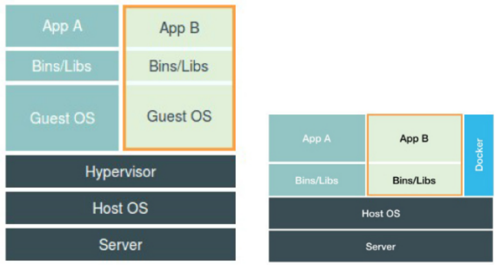
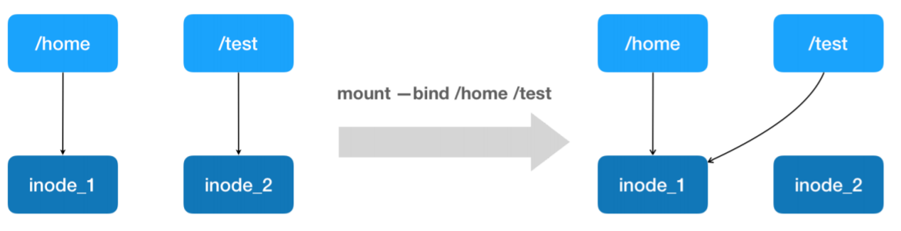
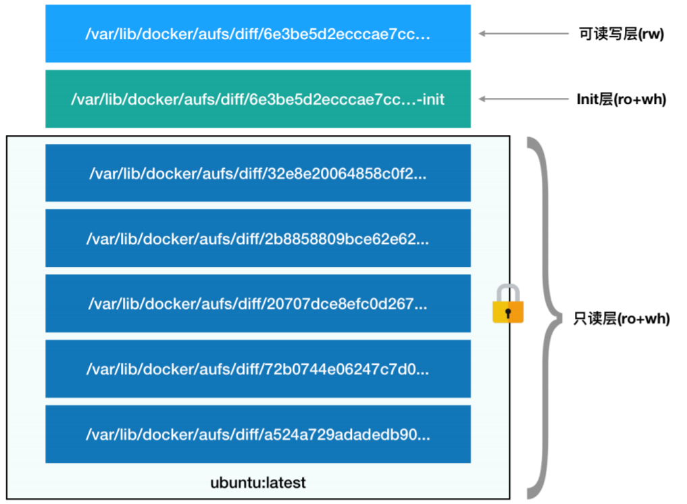

# 底层原理

容器是一种沙盒技术，将容器内的应用与宿主机的环境进行了隔离，容器技术的核心功能是通过**约束和修改进程的动态表现**实现的。

对于 Docker 等大多数 Linux 容器来说，Cgroups 技术是用来制造约束的主要手段，而Namespace 技术则是用来修改进程视图的主要方法。

> 之所以要强调 **Linux 容器**，是因为比如 Docker on Mac，以及 Windows Docker（Hyper-V 实现），实际上是基于**虚拟化技术**实现的，跟 Linux 容器完全不同。


## namespace

随便运行一个容器，然后进入到容器中查看该容器里的进程：

```
root@f229a8bc9bd6:/# ps aux
USER       PID %CPU %MEM    VSZ   RSS TTY      STAT START   TIME COMMAND
mysql        1  0.9  4.9 1993484 405252 ?      Ssl  Jun24  41:06 mysqld
root        67  7.0  0.0  20248  2968 pts/0    Ss   03:33   0:00 bash
root        73  0.0  0.0  17504  1796 pts/0    R+   03:33   0:00 ps aux
```

这是一个MySQL容器，这个容器内的1号进程就是`mysqld`。

如果在宿主机上查看进程，这个进程对应的PID则变成了25868。

```
$ ps aux|grep mysql  
999      25868  0.9  4.9 1993484 405252 ?      Ssl  Jun24  41:08 mysqld
```

本来，每当我们在宿主机上运行了一个`mysqld` 程序，操作系统都会给它分配一个进程编号，比如 `PID=25868`。这个编号是进程的唯一标识，就像员工的工牌一样。所以 `PID=25868`，可以粗略地理解为这个 `mysqld` 是公司里的第 25868号员工，而第 1 号员工就自然是比尔 · 盖茨这样统领全局的人物。

而现在，通过 Docker 把这个 `mysqld` 程序运行在一个容器当中。这时候，Docker 就会在这个第 25868 号员工入职时给他施一个“障眼法”，让他永远看不到前面的所有员工，更看不到比尔 · 盖茨。这样，他就会错误地以为自己就是公司里的第 1 号员工。

这种机制，其实就是对被隔离应用的进程空间做了手脚，使得这些进程只能看到重新计算过的进程编号，比如 `PID=1`。可实际上，它们在宿主机的操作系统里，还是原来的第 25868 号进程。

这种技术，就是 Linux 里面的 Namespace 机制，它其实只是 Linux 创建新进程的一个可选参数。在 Linux 系统中创建子进程的系统调用是` clone()`，比如：

```
int clone(int (*fn)(void *), void *child_stack,
                 int flags, void *arg, ...
                 /* pid_t *ptid, struct user_desc *tls, pid_t *ctid */ );


int pid = clone(main_function, stack_size, CLONE_NEWPID | SIGCHLD, NULL);
```

> `CLONE_NEWPID (since Linux 2.6.24)
>   If CLONE_NEWPID is set, then create the process in a new PID namespace.  If this flag is not set, then  (as with  fork(2))  the  process  is  created  in  the same PID namespace as the calling process.  This flag is intended for the implementation of containers.`

在新建进程的时候，指定`CLONE_NEWPID `参数就可以让新创建的进程看到一个全新的进程空间，在这个进程空间里，它的 PID 是 1。不过，在宿主机真实的进程空间里，它的PID还是真实的数值，比如 2332。

如果多次执行上面的 `clone()` 调用，就会创建多个 PID Namespace，而每个Namespace 里的应用进程，都会认为自己是当前容器里的第 1 号进程，它们既看不到宿主机里真正的进程空间，也看不到其他 PID Namespace 里的具体情况。


除了 PID Namespace，Linux 操作系统还提供了 Mount、UTS、IPC、Network 和 User 这些 Namespace，用来对各种不同的进程上下文进行“障眼法”操作。

Mount Namespace，用于让被隔离进程只看到当前 Namespace 里的挂载点信息；Network Namespace，用于让被隔离进程看到当前 Namespace 里的网络设备和配置。

因此，**容器不过是一种特殊的进程**，在创建容器进程时，指定了这个进程所需要启用的一组 Namespace 参数。这样，容器就只能“看”到当前 Namespace 所限定的资源、文件、设备、状态，或者配置。而对于宿主机以及其他不相关的程序，它就完全看不到了。


### VS 虚拟机



对于虚拟机，使用虚拟化技术作为应用沙盒，就必须要由 Hypervisor 来负责创建虚拟机，这个虚拟机是真实存在的，并且它里面必须运行一个完整的 Guest OS 才能执行用户的应用进程。这就不可避免地带来了额外的资源消耗和占用。

而用户运行在容器里的应用进程，跟宿主机上的其他进程一样，都**由宿主机操作系统统一管理**，只不过这些被隔离的进程拥有额外设置过的 Namespace 参数。Docker 在这里扮演的角色，更多的是旁路式的辅助和管理工作。

一个运行着 CentOS 的 KVM 虚拟机启动后，在不做优化的情况下，虚拟机自己就需要占用 100~200 MB 内存。此外，用户应用运行在虚拟机里面，它对宿主机操作系统的调用就不可避免地要经过虚拟化软件的拦截和处理，这本身又是一层性能损耗，尤其对计算资源、网络和磁盘 I/O 的损耗非常大。

容器化后的用户应用，却依然还是一个宿主机上的普通进程，这就意味着这些因为虚拟化而带来的性能损耗都是不存在的；而另一方面，使用 Namespace 作为隔离手段的容器并不需要单独的 Guest OS，这就使得容器额外的资源占用几乎可以忽略不计。


不过，基于 Linux Namespace 的隔离机制相比于虚拟化技术也有很多不足之处：

- **隔离得不彻底**：既然容器只是运行在宿主机上的一种特殊的进程，那么**多个容器之间使用的就还是同一个宿主机的操作系统内核**。

  尽管可以在容器里通过 Mount Namespace 单独挂载其他不同版本的操作系统文件，比如CentOS 或者 Ubuntu，但这并不能改变共享宿主机内核的事实。这意味着，如果要在Windows 宿主机上运行 Linux 容器，或者在低版本的 Linux 宿主机上运行高版本的 Linux 容器，都是行不通的。

  相比之下，拥有硬件虚拟化技术和独立 Guest OS 的虚拟机就要方便得多了。最极端的例子是，Microsoft 的云计算平台 Azure，实际上就是运行在 Windows 服务器集群上的，但这并不妨碍在它上面创建各种 Linux 虚拟机出来。

- **在 Linux 内核中，有很多资源和对象是不能被 Namespace 化的**：例如时间，如果容器中的程序使用`settimeofday(2) `系统调用修改了时间，整个宿主机的时间都会被随之修改。

尽管在实践中可以使用 Seccomp 等技术，**对容器内部发起的所有系统调用进行过滤和甄别**来进行安全加固，但这种方法因为多了一层对系统调用的过滤，一定会拖累容器的性能。何况，默认情况下，谁也不知道到底该开启哪些系统调用，禁止哪些系统调用。

不过，**基于虚拟化或者独立内核技术的容器**实现，则可以比较好地在隔离与性能之间做出平衡。


### exec

通过`exec`命令，我们可以进入到容器内部执行命令，这其实是新建一个进程，并把这个进程的namespace都设置为这个容器的namespace。首先需要知道容器在宿主机上的PID：

```
$ docker inspect --format '{{ .State.Pid }}' ${容器ID}
3327
$ ls -l /proc/3327/ns # 查看这个进程的所有namespace对应的文件
total 0
lrwxrwxrwx 1 root root 0 Jun 28 09:20 cgroup -> cgroup:[4026531835]
lrwxrwxrwx 1 root root 0 Jun 28 09:20 ipc -> ipc:[4026532216]
lrwxrwxrwx 1 root root 0 Jun 28 09:20 mnt -> mnt:[4026532214]
lrwxrwxrwx 1 root root 0 Jun 28 09:20 net -> net:[4026531957]
lrwxrwxrwx 1 root root 0 Jun 28 09:20 pid -> pid:[4026532217]
lrwxrwxrwx 1 root root 0 Jun 28 09:20 user -> user:[4026531837]
lrwxrwxrwx 1 root root 0 Jun 28 09:20 uts -> uts:[4026532215]
```

> 一个进程的每种 Linux Namespace，都在它对应的` /proc/${进程号}/ns` 下有一个对应的虚拟文件，并且链接到一个真实的 Namespace 文件上。


一个进程，可以选择加入到某个进程已有的 Namespace 当中，从而达到“进入”这个进程所在容器的目的，这正是 docker exec 的实现原理。这个操作依赖 `setns()`  Linux 系统调用。

下面的代码接收两个参数：

- 第一个参数是 `argv[1]`，即当前进程要加入的Namespace 文件的路径，比如 `/proc/3327/ns/net`
- 第二个参数，则是要在这个Namespace 里运行的进程，比如 `/bin/bash`。

```
#define _GNU_SOURCE
#include <fcntl.h>
#include <sched.h>
#include <unistd.h>
#include <stdlib.h>
#include <stdio.h>

#define errExit(msg) do { perror(msg); exit(EXIT_FAILURE);} while (0)

int main(int argc, char *argv[]) {
    int fd;
    fd = open(argv[1], O_RDONLY);
    if (setns(fd, 0) == -1) {
    	errExit("setns");
    }
    execvp(argv[2], &argv[2]);
    errExit("execvp");
}
```

```
root@ubuntu-bionic:~# gcc -o setns setns.c
root@ubuntu-bionic:~# ./setns /proc/3327/ns/net /bin/bash
root@ubuntu-bionic:~# ifconfig
eth0: flags=4163<UP,BROADCAST,RUNNING,MULTICAST>  mtu 1500
        inet 172.17.0.2  netmask 255.255.0.0  broadcast 172.17.255.255
        ether 02:42:ac:11:00:02  txqueuelen 0  (Ethernet)
        RX packets 16  bytes 1312 (1.3 KB)
        RX errors 0  dropped 0  overruns 0  frame 0
        TX packets 0  bytes 0 (0.0 B)
        TX errors 0  dropped 0 overruns 0  carrier 0  collisions 0

lo: flags=73<UP,LOOPBACK,RUNNING>  mtu 65536
        inet 127.0.0.1  netmask 255.0.0.0
        loop  txqueuelen 1000  (Local Loopback)
        RX packets 0  bytes 0 (0.0 B)
        RX errors 0  dropped 0  overruns 0  frame 0
        TX packets 0  bytes 0 (0.0 B)
        TX errors 0  dropped 0 overruns 0  carrier 0  collisions 0
```

宿主机上一共有5个网卡接口，但这里只显示了两个，在 `setns()` 之后看到的这两个网卡，正是 Docker 容器里的网卡。也就是说，新创建的这个 `/bin/bash` 进程，由于加入了该容器进程（PID=3327）的 Network Namepace，它看到的网络设备与这个容器里是一样的，即：`/bin/bash` 进程的网络设备视图，也被修改了。

一旦一个进程加入到了另一个 Namespace 当中，在宿主机的 Namespace 文件上，也会有所体现。

在宿主机上用 `ps` 指令找到这个 `setns `程序执行的 `/bin/bash` 进程：

```
$ ps aux|grep /bin/bash
root      3402  0.0  0.3  21904  3708 pts/1    S+   01:32   0:00 /bin/bash
$ ls -l /proc/3327/ns/net
lrwxrwxrwx 1 root root 0 Jun 28 01:33 net -> 'net:[4026532190]'
$ ls -l /proc/3402/ns/net
lrwxrwxrwx 1 root root 0 Jun 28 01:26 net -> 'net:[4026532190]'
```

可以发现，这两个进程指向的 Network Namespace 文件完全一样，说明这两个进程共享了这个名叫 `net:[4026532281] `的 Network Namespace。Docker 专门提供了一个参数，可以在启动一个新容器的时候“加入”到另一个容器的Network Namespace 里，这个参数就是 `-net`，比如:

```
$ docker run -it --net container:${container ID} busybox ifconfig
```

如果指定`–net=host`，就意味着这个容器不会为进程启用 Network Namespace，即这个容器拆除了 Network Namespace 的“隔离墙”，所以，它会和宿主机上的其他普通进程一样，直接共享宿主机的网络栈。这就为容器直接操作和使用宿主机网络提供了一个渠道。


### volume

Volume 机制，允许将宿主机上指定的目录或者文件，挂载到容器里面进行读取和修改操作。

Docker 支持两种 Volume 声明方式，可以把宿主机目录挂载进容器的` /test` 目录当中：

```
$ docker run -v /test ...
$ docker run -v /home:/test ...
```

这两种声明方式的本质，实际上是相同的：都是把一个宿主机的目录挂载进了容器的` /test` 目录。

在第一种情况下，由于没有显示声明宿主机目录，Docker 就会默认在宿主机上创建一个临时目录 `/var/lib/docker/volumes/[VOLUME_ID]/_data`，然后把它挂载到容器的`/test` 目录上。

在第二种情况下，Docker 就直接把宿主机的` /home` 目录挂载到容器的 `/test`目录上。

**Docker 是如何做到把一个宿主机上的目录或者文件，挂载到容器里面去呢？**

> 下面提到的 " 容器进程 "，是 Docker 创建的一个**容器初始化进程**(`dockerinit`)，而不是应用进程 (ENTRYPOINT + CMD)。`dockerinit `会负责完成根目录的准备、挂载设备和目录、配置 hostname 等一系列需要在容器内进行的初始化操作。最后，它通过` execv() `系统调用，让应用进程取代自己，成为容器里的 PID=1 的进程。

当容器进程被创建之后，尽管开启了 Mount Namespace，但是在它执行 `chroot`（或者 `pivot_root`）之前，容器进
程一直可以看到宿主机上的整个文件系统。

而宿主机上的文件系统，也自然包括了我们要使用的容器镜像。这个镜像的各个层，保存在`/var/lib/docker/aufs/diff` 目录下，在容器进程启动后，它们会被联合挂载在`/var/lib/docker/aufs/mnt/` 目录中，这样容器所需的 rootfs 就准备好了。

所以，我们只需要在 rootfs 准备好之后，在执行 `chroot `之前，把 Volume 指定的宿主机目录（比如 `/home` 目录），挂载到指定的容器目录（比如 `/test` 目录）在宿主机上对应的目录（即`/var/lib/docker/aufs/mnt/[可读写层 ID]/test`）上，这个 Volume 的挂载工作就完成了。

更重要的是，由于执行这个挂载操作时，“容器进程”已经创建了，也就意味着此时 Mount Namespace 已经开启了。所以，这个挂载事件只在这个容器里可见。在宿主机上，是看不见容器内部的这个挂载点的。这就保证了容器的隔离性不会被 Volume 打破。

这里使用的挂载技术，就是 Linux 的**绑定挂载（Bind Mount）机制**。它的主要作用就是，**允许你将一个目录或者文件，而不是整个设备，挂载到一个指定的目录上。**并且，这时你在该挂载点上进行的任何操作，只是发生在被挂载的目录或者文件上，而原挂载点的内容则会被隐藏起来且不受影响。

绑定挂载实际上是一个 inode 替换的过程。在Linux 操作系统中，inode 可以理解为存放文件内容的“对象”，而 dentry，也叫目录项，就是访问这个 inode 所使用的“指针”。



`mount --bind /home /test`，会将 `/home` 挂载到 `/test` 上。其实相当于将`/test `的 dentry，重定向到了 `/home` 的 inode。这样当我们修改 `/test` 目录时，实际修改的是`/home` 目录的 inode。这也就是为何，一旦执行 `umount `命令，`/test` 目录原先的内容就会恢复：因为修改真正发生在的，是 `/home` 目录里。

所以，**在一个正确的时机，进行一次绑定挂载，Docker 就可以成功地将一个宿主机上的目录或文件，不动声色地挂载到容器中。**

进程在容器里对这个 `/test `目录进行的所有操作，都实际发生在宿主机的对应目录（比如，`/home`，或者 `/var/lib/docker/volumes/[VOLUME_ID]/_data`）里，而不会影响容器镜像的内容。

这个 `/test` 目录里的内容，虽然挂载在容器 rootfs 的可读写层，但它不会被` docker commit `提交。因为 `docker commit`，是发生在宿主机空间的，而由于 Mount Namespace 的隔离作用，宿主机并不知道这个绑定挂载的存在。所
以，在宿主机看来，容器中可读写层的 `/test` 目录（`/var/lib/docker/aufs/mnt/[可读写层ID]/test`），始终是空的。

不过，由于 Docker 一开始还是要创建` /test` 这个目录作为挂载点，所以执行了 `docker commit` 之后，在新产生的镜像里，会多出来一个空的 `/test` 目录。毕竟，新建目录操作，又不是挂载操作，Mount Namespace 对它可起不到“障眼法”的作用。


#### mount验证

运行一个busybox，给它声明一个 Volume，挂载在容器里的` /test` 目录上：

```
$ docker run -d  -v /test busybox sleep 3600
17e53c7c3ecd6898045cc792a855f8b933f18f00d3ba68d6499f2e85a75184bb
 
# 查看这个 Volume 的 ID
$ docker volume ls
DRIVER              VOLUME NAME
local               7671ac5e75446a62861fb34e033d6a68b838b56b2ac8b27a25adb7241766d14d

# 找到这个volume在 Docker 工作目录下的 volumes 路径：
$ ls /var/lib/docker/volumes/7671ac5e75446a62861fb34e033d6a68b838b56b2ac8b27a25adb7241766d14d/_data/
```

这个 `_data` 文件夹，就是这个容器的 Volume 在宿主机上对应的临时目录了。

接下来，在容器的 Volume 里，添加一个文件 `text`：

```
$ docker exec -it 17e5 /bin/sh
/ # cd /test/
/test # ls
/test # touch text
```

在宿主机上查看这个volume对应的临时目录：

```
$ ls /var/lib/docker/volumes/7671ac5e75446a62861fb34e033d6a68b838b56b2ac8b27a25adb7241766d14d/_data/
text
```

可是，在宿主机上查看该容器的可读写层，虽然可以看到这个 `/test `目录，但其内容是空的

```
$ cat /var/lib/docker/image/aufs/layerdb/mounts/17e53c7c3ecd6898045cc792a855f8b933f18f00d3ba68d6499f2e85a75184bb/mount-id
f79f7466560764a4e05b66ef1c57b4fb18878a35808137ee31075504d366a253
$ ls /var/lib/docker/aufs/mnt/f79f7466560764a4e05b66ef1c57b4fb18878a35808137ee31075504d366a253
bin  dev  etc  home  proc  root  sys  test  tmp  usr  var
$ ls /var/lib/docker/aufs/mnt/f79f7466560764a4e05b66ef1c57b4fb18878a35808137ee31075504d366a253/test

```

可以确认，容器 Volume 里的信息，并不会被 `docker commit` 提交掉；但这个挂载点目录`/test` 本身，则会出现在新的镜像当中。


## cgroups

虽然容器内的第 1 号进程在“障眼法”的干扰下只能看到容器里的情况，但是宿主机上，它作为第 100 号进程与其他所有进程之间依然是平等的竞争关系。这就意味着，虽然第 100 号进程表面上被隔离了起来，但是它所能够使用到的资源（比如 CPU、内存），却是可以随时被宿主机上的其他进程（或者其他容器）占用的。同样，这个 100 号进程自己也可能把所有资源吃光。这些情况，显然都不是一个“沙盒”应该表现出来的合理行为。

Linux Cgroups ，即 Linux Control Group，让 Linux 内核能够限制一个进程组能够使用的资源上限，包括 CPU、内存、磁盘、网络带宽等等，还能够对进程进行优先级设置、审计，以及将进程挂起和恢复等操作。

> 在 Google 内部，“容器”这个术语长期以来都被用于形容**被 Cgroups 限制过的进程组**。这和docker容器差别很大。

在 Linux 中，**Cgroups 通过 文件系统 暴露接口**，即它以文件和目录的方式组织在操作系统的 `/sys/fs/cgroup` 路径下：

```
$ mount -t cgroup
cgroup on /sys/fs/cgroup/systemd type cgroup (rw,nosuid,nodev,noexec,relatime,xattr,name=systemd)
cgroup on /sys/fs/cgroup/hugetlb type cgroup (rw,nosuid,nodev,noexec,relatime,hugetlb)
cgroup on /sys/fs/cgroup/net_cls,net_prio type cgroup (rw,nosuid,nodev,noexec,relatime,net_cls,net_prio)
cgroup on /sys/fs/cgroup/blkio type cgroup (rw,nosuid,nodev,noexec,relatime,blkio)
cgroup on /sys/fs/cgroup/rdma type cgroup (rw,nosuid,nodev,noexec,relatime,rdma)
cgroup on /sys/fs/cgroup/cpuset type cgroup (rw,nosuid,nodev,noexec,relatime,cpuset)
cgroup on /sys/fs/cgroup/memory type cgroup (rw,nosuid,nodev,noexec,relatime,memory)
cgroup on /sys/fs/cgroup/freezer type cgroup (rw,nosuid,nodev,noexec,relatime,freezer)
cgroup on /sys/fs/cgroup/cpu,cpuacct type cgroup (rw,nosuid,nodev,noexec,relatime,cpu,cpuacct)
cgroup on /sys/fs/cgroup/perf_event type cgroup (rw,nosuid,nodev,noexec,relatime,perf_event)
cgroup on /sys/fs/cgroup/devices type cgroup (rw,nosuid,nodev,noexec,relatime,devices)
cgroup on /sys/fs/cgroup/pids type cgroup (rw,nosuid,nodev,noexec,relatime,pids)
```

> 如果没看到这些目录，就需要先挂载cgroups：`mount -t cgroup -o remount,cpu,cpuset,memory cpu_and_mem /cgroup/cpu_and_mem` 挂载 cpuset, cpu, cpuacct, memory 4个subsystem到/cgroup/cpu_and_mem 目录下。

在 `/sys/fs/cgroup` 下面有很多诸如 cpuset、cpu、 memory 这样的子目录，也叫子系统。在子系统对应的资源种类下，可以看到该类资源具体可以被限制的方法。比如 CPU 子系统：

```
$ ls /sys/fs/cgroup/cpu
cgroup.clone_children  cpu.shares         cpuacct.usage_percpu       notify_on_release
cgroup.procs           cpu.stat           cpuacct.usage_percpu_sys   release_agent
cgroup.sane_behavior   cpuacct.stat       cpuacct.usage_percpu_user  system.slice
cpu.cfs_period_us      cpuacct.usage      cpuacct.usage_sys          tasks
cpu.cfs_quota_us       cpuacct.usage_all  cpuacct.usage_user         user.slice
```

 通过`cfs_period_us `和 `cfs_quota_us `这两个参数的组合使用，可以用来限制进程在长度为 `cfs_period_us`的一段时间内，只能被分配到总量为 `cfs_quota_us`的 CPU 时间。`cfs_period_us`默认值是100000 (us)，即 100 ms，而`cfs_quota_us`默认值为-1，即不限制CPU使用时间。


### 使用cgroups限制进程

执行命令如下：

```
$ while : ; do : ; done & 
[1] 7096
```

> `while`里的`:`表示true，`do`里的`:`表示no-op

这个死循环，可以把计算机一个核的 CPU 吃到 100%，接下来限制其CPU使用率最多为20%。

```
$ cd /sys/fs/cgroup/cpu &&  mkdir container && cd container
$ ls
cgroup.clone_children  cpu.shares     cpuacct.usage_all          cpuacct.usage_sys
cgroup.procs           cpu.stat       cpuacct.usage_percpu       cpuacct.usage_user
cpu.cfs_period_us      cpuacct.stat   cpuacct.usage_percpu_sys   notify_on_release
cpu.cfs_quota_us       cpuacct.usage  cpuacct.usage_percpu_user  tasks
```

这个目录就称为一个“控制组”，操作系统会在新创建的 container 目录下，自动生成该子系统对应的资源限制文件。

```
$ cat /sys/fs/cgroup/cpu/container/cpu.cfs_quota_us
-1
$ cat /sys/fs/cgroup/cpu/container/cpu.cfs_period_us
100000

# 向cfs_quota_us文件写入20000us 20ms，即每 100 ms 的时间里，被该控制组限制的进程只能使用 20 ms 的 CPU 时间
$ echo 20000 > /sys/fs/cgroup/cpu/container/cpu.cfs_quota_us

# 把被限制的进程的 PID 写入 container 组里的 tasks 文件，上面的设置就会对该进程生效了
# $ echo 7096 > /sys/fs/cgroup/cpu/container/tasks
```

现在用`top`查看CPU使用率，就可以发现被限制到20%左右了。


### docker资源限制

通过这个例子，可以猜测docker进行资源限制的方式：只需要在每个子系统下面，为每个容器创建一个控制组（即创建一个新目录），然后在启动容器进程之后，把这个容器的所有进程的 PID 填写到对应控制组的 tasks 文件中。

在这些控制组下面的资源文件里填上什么值，就靠用户执行 `docker run` 时的参数指定了：

```
$ docker run -it --cpu-period=100000 --cpu-quota=20000 busybox /bin/sh
```

启动这个容器后，可以进入容器的`/sys/fs/cgroup/cpu`目录，或查看宿主机 Cgroups 文件系统下，CPU 子系统中，“docker”这个控制组里的资源限制文件的内容来确认：

```
$ cat /sys/fs/cgroup/cpu/docker/ca4334199f2/cpu.cfs_period_us
100000
$ cat /sys/fs/cgroup/cpu/docker/ca4334199f2/cpu.cfs_quota_us
20000
```


### 不足

Cgroups 对资源的限制能力也有很多不完善的地方，被提及最多的是 `/proc` 文件系统的问题。

Linux 下的 `/proc` 目录存储的是**记录当前内核运行状态的一系列特殊文件**，用户可以通过访问这些文件，查看系统以及当前正在运行的进程的信息，比如 CPU 使用情况、内存占用率等，这些文件也是 `top `指令查看系统信息的主要数据来源。

但是，如果在容器里执行 `top `指令，它显示的信息居然是宿主机的 CPU 和内存数据，而不是当前容器的数据。

造成这个问题的原因就是，`/proc `文件系统并不知道用户通过 Cgroups 给这个容器做了什么样的资源限制，即：`/proc` 文件系统不了解 Cgroups 限制的存在。


这个问题可以通过 [lxcfs](https://github.com/lxc/lxcfs) 解决，lxcfs为容器提供如下目录：

```
/proc/cpuinfo
/proc/diskstats
/proc/meminfo
/proc/stat
/proc/swaps
/proc/uptime
/sys/devices/system/cpu/online
```

当容器里内进程访问到这些目录后，lxcfs 将转换到进程所在的cgroup（也就是进程所在容器的宿主机cgoup里）读取memlimit，swaplimit ，cpuset，disk、uptime等，由此提供容器独特视角的`/proc/xx`信息。

**使用方法：**

把宿主机的`/var/lib/lxcfs/proc` 文件系统挂载到 Docker 容器的 `/proc` 目录下。使得容器中进程读取相应文件内容时，实际上会从容器对应的 Cgroups 中读取正确的资源限制。 从而得到正确的 `top `命令的返回值。


Linux 内核从 4.6 开始，支持了一个新的 Namespace 叫作：Cgroup Namespace。 正常情况下，在一个容器里查看 `/proc/$PID/cgroup`，是会看到整个宿主机的 cgroup 信息的。而有了 Cgroup Namespace 后，每个容器里的进程都会有自己 Cgroup Namespace，从而获得一个属于自己的 Cgroups 文件目录视图。也就是说，Cgroups 文件系统也可以被Namespace 隔离起来了。


## 文件系统

是不是通过 Mount Namespace，就可以让容器里的应用进程看到一份 **完全独立 的文件系统**呢？这样，它就可以在自己的容器目录（比如 `/tmp`）下进行操作，而完全不会受宿主机以及其他容器的影响。

下面的代码在创建子进程时开启指定的 Namespace，使用它来验证这个问题。

```
#define _GNU_SOURCE
#include <sched.h>
#include <signal.h>
#include <unistd.h>
#define STACK_SIZE (1024 * 1024)
static char container_stack[STACK_SIZE];
char* const container_args[] = {
  "/bin/bash",
  NULL
};

int container_main(void* arg) {  
  printf("Container - inside the container!\n");
  execv(container_args[0], container_args);
  printf("Something's wrong!\n");
  return 1;
}

int main() {
  extern int errno;
  printf("Parent - start a container!\n");
  int container_pid = clone(container_main, container_stack+STACK_SIZE, CLONE_NEWNS | SIGCHLD, NULL);
  printf("%d\n", container_pid);
  if (container_pid == -1) {
    perror("clone: ");
  }
  waitpid(container_pid, NULL, 0);
  printf("Parent - container stopped!\n");
  return 0;
}
```

在 `main `函数里，通过 `clone()` 系统调用创建了一个新的子进程`container_main`，并且声明要为它启用 Mount Namespace（即：`CLONE_NEWNS `标志）。

> ```
> CLONE_NEWNS (since Linux 2.4.19)
>   If CLONE_NEWNS is set, the cloned child is started in a new mount namespace, initialized with a copy of the namespace of the parent.  If CLONE_NEWNS is not set, the child lives in the same  mount  namespace  as  the parent.
> ```

而这个子进程执行的，是一个`/bin/bash`程序，也就是一个 shell。所以这个 shell 就运行在了 Mount Namespace 的隔离环境中。

```
$ gcc -o ns ns.c
$ ./ns
Parent - start a container!
Container - inside the container!
$ ls
# 仍然能看见宿主机的文件
```

**即使开启了 Mount Namespace，容器进程看到的文件系统也跟宿主机完全一样。**

这是因为，Mount Namespace 修改的，是容器进程对文件系统“挂载点”的认知。但是，这也就意味着，只有在“挂载”这个操作发生之后，进程的视图才会被改变。而**在此之前，新创建的容器会直接继承宿主机的各个挂载点。**

创建新进程时，除了声明要启用 Mount Namespace之外，要告诉容器进程，有哪些目录需要重新挂载，比如这个` /tmp `目录。于是，我们在容器进程执行前可以添加一步重新挂载 `/tmp` 目录的操作：

```
int container_main(void* arg){
    printf("Container - inside the container!\n");
    mount("none", "/tmp", "tmpfs", 0, ""); // 以 tmpfs（内存盘）格式，重新挂载 /tmp 目录
    execv(container_args[0], container_args);
    printf("Something's wrong!\n");
    return 1;
}
```

```
$ gcc -o ns ns.c
$ ./ns
Parent - start a container!
Container - inside the container!
$ ls /tmp
# 空目录
```

` /tmp` 变成了一个空目录，这意味着重新挂载生效了，可以用 `mount -l` 检查一下：

```
$ mount -l | grep tmpfs
none on /tmp type tmpfs (rw,relatime)
```

因为我们创建的新进程启用了 Mount Namespace，所以这次重新挂载的操作，只在容器进程的 Mount Namespace 中有效。如果在宿主机上用 `mount -l` 来检查一下这个挂载，你会发现它是不存在的：

```
# 在宿主机上
$ mount -l | grep tmpfs
```

这就是 Mount Namespace 跟其他 Namespace 的使用略有不同的地方：**它对容器进程视图的改变，一定是伴随着挂载操作（mount）才能生效。**


### chroot

作为一个普通用户，我们希望 每当创建一个新容器时，容器进程看到的文件系统就是一个独立的隔离环境，而不是继承自宿主机的文件系统。

可以在容器进程启动之前重新挂载它的整个根目录`/`，而由于 MountNamespace 的存在，这个挂载对宿主机不可见，所以容器进程就可以在里面随便折腾了。

在 Linux 操作系统里， `chroot `命令可以帮助你在 shell 中方便地完成这个工作。顾名思义，它的作用就是帮你“change root file system”，即**改变进程的根目录到你指定的位置**。

假设，现在有一个 `$HOME/test` 目录，想要把它作为一个` /bin/bash` 进程的根目录。

```
# 首先，创建一个 test 目录和几个 lib 文件夹
$ mkdir -p $HOME/test
$ mkdir -p $HOME/test/{bin,lib64,lib}
$ cd ~

# 把 bash 命令拷贝到 test 目录对应的 bin 路径下
$ cp -v /bin/{bash,ls} $HOME/test/bin

# 把 ls 命令需要的所有 so 文件，也拷贝到 test 目录对应的 lib 路径下
$ T=$HOME/test
$ list="$(ldd /bin/bash /bin/ls | egrep -o '/lib.*\.[0-9]')"
$ for i in $list; do cp "$i" "${T}${i}"; done
```

执行 `chroot `命令，启动` /bin/bash` 进程，并将 `$HOME/test `目录作为其根目录：

```
$ chroot $HOME/test /bin/bash
bash-4.4# ls
bin  lib  lib64
bash-4.4# cat
bash: cat: command not found
```

对于被 chroot 的进程来说，它并不会感受到自己的根目录已经被“修改”成`$HOME/test` 了，这种视图被修改的原理跟namespace很类似。

> 实际上，Mount Namespace 正是基于对 chroot 的不断改良才被发明出来的，它也是 Linux操作系统里的第一个 Namespace。


当然，为了能够让容器的根目录看起来更“真实”，一般会在这个容器的根目录下挂载一个完整操作系统的文件系统，比如 Ubuntu16.04 的 ISO。这样，在容器启动之后，在容器里通过执行`ls /` 查看根目录下的内容，就是 Ubuntu 16.04 的所有目录和文件。

而这个挂载在容器根目录上、用来为容器进程提供隔离后执行环境的文件系统，就是所谓的“容器镜像”。它还有一个更为专业的名字，叫作：**rootfs**（根文件系统）。

一个最常见的 rootfs，或者说容器镜像，会包括如下所示的一些目录和文件，比如/bin，/etc，/proc 等等：

```
$ ls /
bin dev etc home lib lib64 mnt opt proc root run sbin sys tmp usr var
```

进入容器之后执行的 `/bin/bash`，就是 `/bin` 目录下的可执行文件，与宿主机的` /bin/bash`完全不同。


对 Docker 项目来说，它**最核心的原理**实际上就是为待创建的用户进程：

1. 启用 Linux Namespace 配置；

2. 设置指定的 Cgroups 参数；

3. 切换进程的根目录（Change Root）。优先使用`pivot_root `系统调用，如果系统不支持，才会使用 `chroot`。

   > `pivot_root`和`chroot`的主要区别是，`pivot_root`主要是把整个系统切换到一个新的root目录，而移除对之前root文件系统的依赖，这样就能够`umount`原先的root文件系统。而`chroot`是针对某个进程，而系统的其它部分依旧运行于老的root目录。

> **rootfs 只是一个操作系统所包含的文件、配置和目录，并不包括操作系统内核。**在 Linux 操作系统中，这两部分是分开存放的，**操作系统只有在开机启动时才会加载指定版本的内核镜像**。

所以说，rootfs 只包括了操作系统的“躯壳”，并没有包括操作系统的“灵魂”。

实际上，同一台机器上的所有容器，都共享宿主机操作系统的内核。这就意味着，如果某个应用程序需要配置内核参数、加载额外的内核模块，以及跟内核进行直接的交互，你就需要注意了：这些操作和依赖的对象，都是宿主机操作系统的内核，它对于该机器上的所有容器来说是一个“全局变量”，牵一发而动全身。

这也是容器相比于虚拟机的主要缺陷之一：毕竟后者不仅有模拟出来的硬件机器充当沙盒，而且每个沙盒里还运行着一个完整的 Guest OS 给应用随便折腾。

不过，正是由于 rootfs 的存在，容器才有了一个被反复宣传至今的重要特性：**一致性**。即本地环境与部署环境几乎完全一致。因为 rootfs 里打包的不只是应用，而是整个操作系统的文件和目录，也就意味着，应用以及它运行所需要的所有依赖，都被封装在了一起。

> 事实上，对于大多数开发者而言，他们对应用依赖的理解，一直局限在编程语言层面。比如Golang 的 Godeps.json、python的requirements.txt。但实际上，一个一直以来很容易被忽视的事实是，对一个应用来说，**操作系统本身才是它运行所需要的最完整的“依赖库”**。

有了容器镜像“打包操作系统”的能力，这个最基础的依赖环境也终于变成了应用沙盒的一部分。这就赋予了容器所谓的一致性：无论在本地、云端，还是在一台任何地方的机器上，用户只需要解压打包好的容器镜像，那么这个应用运行所需要的完整的执行环境就被重现出来了。


### union file system

难道每开发一个应用，或者升级一下现有的应用，都要重复制作一次 rootfs 吗？

由于对rootfs的修改都基于一个旧的rootfs，那就可以以增量的方式去做并记录这些修改。这样做的好处是，所有人都只需要维护相对于 base rootfs 修改的增量内容，而不是每次修改都制造一个“fork”。

这也是Docker的一个创新点：在镜像的设计中，引入了层（layer）的概念。用户制作镜像的每一步操作，都会生成一个层，也就是一个增量 rootfs。这个想法基于**联合文件系统**（Union File System）实现。

Union File System 也叫 UnionFS，最主要的功能是**将多个不同位置的目录联合挂载（union mount）到同一个目录下**。比如，现在有两个目录 A 和 B，它们分别有两个文件：

```
$ tree
.
├── A
│   ├── a
│   └── x
└── B
    ├── b
    └── x

2 directories, 4 files

# 使用联合挂载的方式，将这两个目录挂载到一个公共的目录 C 上
$ mkdir C
$ mount -t aufs -o dirs=./A:./B none ./C
$ tree ./C
./C
├── a
├── b
└── x

0 directories, 3 files
```

> 注意到`A`目录和`B`目录下都有一个`x`文件，在进行union的时候，高优先级的目录底下的同名文件会被保留，而低优先级目录下的同名文件被忽略。这个优先级可以通过`mount`命令中的`dirs`属性中目录出现的位置调整，`dirs=./A:./B`：显示`A`目录底下的`x`文件，`dirs=./B:./A`：显示`B`目录底下的`x`文件。

如果在目录 `C `里对 `a、b、x `文件做修改，这些修改也会在对应的目录 `A、B` 中生效。


#### docker中的aufs

` docker info` 的输出中，Server部分的Storage Driver即展示了容器的文件系统，`AUFS`是`Docker`最先使用的`storage driver`，也是Docker 18.06 及更早的版本中优先使用的storage drive，之后的版本优先使用的driver是`overlay2`。

对于 AuFS 来说，它最关键的目录结构在 `/var/lib/docker` 路径下的 `diff `目录：`/var/lib/docker/aufs/diff/<layer_id>`，启动一个容器来看看这个目录的作用：

```
$ docker run -d ubuntu:latest sleep 3600
$ docker image inspect ubuntu:latest
...
"RootFS": {
    "Type": "layers",
    "Layers": [
        "sha256:f49017d4d5ce9c0f544c...",
        "sha256:8f2b771487e9d6354080...",
        "sha256:ccd4d61916aaa2159429...",
        "sha256:c01d74f99de40e097c73...",
        "sha256:268a067217b5fe78e000..."
    ]
}
```

Docker 从 Docker Hub 上拉取一个 Ubuntu 镜像到本地。这个所谓的“镜像”，实际上就是一个 Ubuntu 操作系统的 rootfs，它的内容是 Ubuntu 操作系统的所有文件和目录。不过，从`inspect`命令的输出，可以发现Docker 镜像使用的rootfs，往往由多个“层”组成。

这个 Ubuntu 镜像，实际上由五个层组成。这五个层就是五个增量 rootfs，每一层都是 Ubuntu 操作系统文件与目录的一部分；而在使用镜像时，Docker 会把这些增量联合挂载在一个统一的挂载点上。挂载点可以通过`docker ps`得到容器ID后，查询`/var/lib/docker/image/aufs/layerdb/mounts/${容器完整id}/mount-id`得到。

```
$ docker ps
CONTAINER ID        IMAGE          ...
575d4da56        ubuntu:test    ...

$ cat /var/lib/docker/image/aufs/layerdb/mounts/575d4da56XXXXXXXXXXXXXXX/mount-id
6e3be5d2ecccae7cc0fcfa2a2f5c89dc21ee30e166be823ceaeba15dce645b3e

# 这个目录底下是一个完整的 Ubuntu 操作系统
$ ls /var/lib/docker/aufs/mnt/6e3be5d2ecccae7cc0fcfa2a2f5c89dc21ee30e166be823ceaeba15dce645b3
bin boot dev etc home lib lib64 media mnt opt proc root run sbin srv sys tmp usr var
```


前面提到的五个镜像层，又是如何被联合挂载成这样一个完整的 Ubuntu 文件系统的呢？

这个信息记录在 AuFS 的系统目录` /sys/fs/aufs` 下面。

首先，通过查看 AuFS 的挂载信息，找到这个目录对应的 AuFS 的内部 ID（也叫：`si`）：

```
$ cat /proc/mounts| grep aufs
none /var/lib/docker/aufs/mnt/6e3be5d2ecccae7cc0fc... aufs rw,relatime,si=972c6d361e6b32ba,dio,dirperm1 0 0
```

得到`si=972c6d361e6b32ba`，然后就可以使用这个ID到` /sys/fs/aufs `下查看被联合挂载在一起的各个层的信息：

```
$ cat /sys/fs/aufs/si_972c6d361e6b32ba/br[0-9]*
/var/lib/docker/aufs/diff/6e3be5d2ecccae7cc...=rw
/var/lib/docker/aufs/diff/6e3be5d2ecccae7cc...-init=ro+wh
/var/lib/docker/aufs/diff/32e8e20064858c0f2...=ro+wh
/var/lib/docker/aufs/diff/2b8858809bce62e62...=ro+wh
/var/lib/docker/aufs/diff/20707dce8efc0d267...=ro+wh
/var/lib/docker/aufs/diff/72b0744e06247c7d0...=ro+wh
/var/lib/docker/aufs/diff/a524a729adadedb90...=ro+wh
```

可以看到，镜像的层都放置在 `/var/lib/docker/aufs/diff` 目录下，然后被联合挂载在 `/var/lib/docker/aufs/mnt` 里面。这个容器的 rootfs 由下图所示的三部分组成：



- 第一部分，**只读层**。

  它是这个容器的 rootfs 最下面的五层，对应的正是 ubuntu:latest 镜像的五层。可以看到，它们的挂载方式都是只读的（ro+wh，即 readonly+whiteout）。分别查看一下这些层的内容：

  ```
  $ ls /var/lib/docker/aufs/diff/72b0744e06247c7d0...
  etc sbin usr var
  $ ls /var/lib/docker/aufs/diff/32e8e20064858c0f2...
  run
  $ ls /var/lib/docker/aufs/diff/a524a729adadedb900...
  bin boot dev etc home lib lib64 media mnt opt proc root run sbin srv sys tmp usr var
  ```

  这些层都以增量的方式分别包含了 Ubuntu 操作系统的一部分。

  **既然这些层是以只读方式挂载的，那么又如何在容器里修改这些层的内容呢？**

  修改一个镜像里的文件的时候，联合文件系统首先会从上到下在各个层中查找有没有目标文件。如果找到，就**把这个文件复制到可读写层**进行修改。这个修改的结果会屏蔽掉下层的文件，这种方式就被称为 **copy-on-write**。

- 第二部分，**可读写层**。

  它是这个容器的 rootfs 最上面的一层（6e3be5d2ecccae7cc），它的挂载方式为：rw，即read write。在没有写入文件之前，这个目录是空的。而一旦在容器里做了写操作，你修改产生的内容就会以增量的方式出现在这个层中。

  如果现在要做的，是删除只读层里的一个文件呢？

  **为了实现这样的删除操作，AuFS 会在可读写层创建一个 whiteout 文件，把只读层里的文件“遮挡”起来。**

  比如，你要删除只读层里一个名叫 foo 的文件，那么这个删除操作实际上是在可读写层创建了一个名叫.wh.foo 的文件。这样，当这两个层被联合挂载之后，foo 文件就会被.wh.foo 文件“遮挡”起来，“消失”了。这个功能，就是“ro+wh”的挂载方式，即只读 +whiteout 的含义。

  所以，**最上面这个可读写层的作用，就是专门用来存放修改 rootfs 后产生的增量，无论是增、删、改，都发生在这里。**而当我们使用完了这个被修改过的容器之后，还可以使用` docker commit `和 `push `指令，保存这个被修改过的可读写层，并上传到 Docker Hub 上，供其他人使用；而与此同时，原先的只读层里的内容则不会有任何变化。这，就是增量 rootfs 的好处。

- 第三部分，**Init 层**。

  它是一个以“-init”结尾的层，夹在只读层和读写层之间。Init 层是 Docker 项目单独生成的一个内部层，专门用来存放 `/etc/hosts、/etc/resolv.conf` 等信息。

  需要这样一层的原因是，这些文件本来属于只读的 Ubuntu 镜像的一部分，但是用户往往需要在启动容器时写入一些指定的值比如 `hostname`，所以就需要在可读写层对它们进行修改。

  可是，**这些修改往往只对当前的容器有效**，我们并不希望执行 `docker commit `时，把这些信息连同可读写层一起提交掉。所以，Docker 做法是，在修改了这些文件之后，以一个单独的层挂载了出来。而用户执行`docker commit` 只会提交可读写层，所以是不包含这些内容的。

最终，这 7 个层都被联合挂载到 `/var/lib/docker/aufs/mnt `目录下，表现为一个完整的Ubuntu 操作系统供容器使用。


