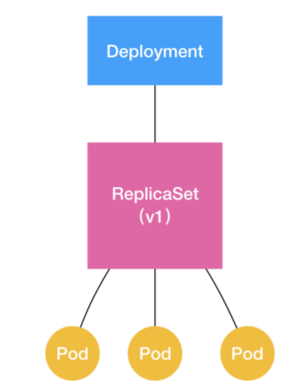
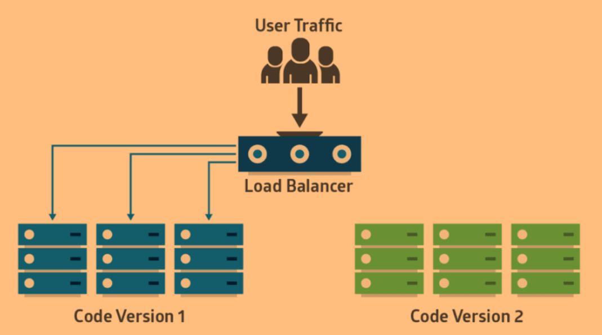

# 控制器模式

Pod 这个看似复杂的 API 对象，实际上就是对容器的进一步抽象和封装而已。因为容器这样一个“沙盒”的概念，对于描述应用来说，还是太过简单了。所以Pod 对象，其实就是容器的升级版。它对容器进行了组合，添加了更多的属性和字段。

而 **Kubernetes 操作这些属性的逻辑，都由控制器（Controller）完成。**

## 概念

```
apiVersion: apps/v1
kind: Deployment
metadata:
  name: nginx-deployment
spec:
  selector:
    matchLabels:
      app: nginx
  replicas: 2
  
  template:
    metadata:
      labels:
        app: nginx
    spec:
      containers:
      - name: nginx
        image: nginx:1.7.9
        ports:
        - containerPort: 80
```

这个 Deployment 定义的编排动作非常简单：确保携带 `app=nginx` 标签的 Pod 的个数，永远等于 `spec.replicas` 指定的个数，即 2 个。这就意味着，如果在这个集群中，携带 `app=nginx `标签的 Pod 的个数大于 2 的时候，就会有旧的Pod 被删除；反之，就会有新的 Pod 被创建。

 Kubernetes 中的哪个组件，在执行这些操作呢？

kube-controller-manager，这个组件是一系列控制器的集合。查看 Kubernetes 的 `pkg/controller` 目录：

```
$ ls -d pkg/controller/
deployment/ 	job/ 				podautoscaler/
cloud/ 			disruption/ 		namespace/
replicaset/ 	serviceaccount/ 	volume/
cronjob/ 		garbagecollector/ 	nodelifecycle/
...
```

这个目录下面的每一个控制器，都以独有的方式负责某种编排功能。Deployment，正是这些控制器中的一种。


### 控制循环

这些控制器之所以被统一放在 `pkg/controller` 目录下，就是因为它们都遵循 Kubernetes中的一个通用编排模式，即：控制循环（control loop）。

比如，现在有一种待编排的对象 X，它有一个对应的控制器。用伪代码描述这个控制循环就是：

```
for {
	actualState := 获取集群中对象 X 的实际状态（Actual State）
    desiredState := 获取集群中对象 X 的期望状态（Desired State）
    if actualState == desiredState{
      // do nothing
    } else {
      执行编排动作，将实际状态调整为期望状态
	}
}
```

**在具体实现中，实际状态往往来自于 Kubernetes 集群本身。**比如，kubelet 通过心跳汇报的容器状态和节点状态，或者监控系统中保存的应用监控数据，或者控制器主动收集的它自己感兴趣的信息，这些都是常见的实际状态的来源。

**期望状态，一般来自于用户提交的 YAML 文件。**比如，Deployment 对象中 `Replicas `字段的值。很明显，这些信息往往都保存在 Etcd 中。

以 Deployment 为例，它对控制器模型的实现如下：

1. Deployment 控制器从 Etcd 中获取到所有携带了`app: nginx`标签的 Pod，统计它们的数量，这就是实际状态；
2. Deployment 对象的 `Replicas `字段的值就是期望状态；
3. Deployment 控制器将两个状态做比较，然后根据比较结果，确定是创建 Pod，还是删除已有的 Pod。

一个 Kubernetes 对象的主要编排逻辑，实际上是在第三步的“对比”阶段完成的。这个操作，通常被叫作调谐（Reconcile）。这个调谐的过程，则被称作“Reconcile Loop”（调谐循环）或者“Sync Loop”（同步循环）。

调谐的最终结果，往往都是对被控制对象的某种写操作。比如，增加 Pod，删除已有的 Pod，或者更新 Pod 的某个字段。这也是 Kubernetes **面向API 对象编程**的一个直观体现。

像 Deployment 这种控制器的设计原理，就是“用一种对象管理另一种对象”的“艺术”。

 StatefulSet、DaemonSet 等容器编排，它们无一例外地都有这样一个甚至多个控制器的存在，并遵循控制循环（control loop）的流程，完成各自的编排逻辑。实际上，跟 Deployment 相似，这些控制循环最后的执行结果，要么就是创建、更新一些 Pod（或者其他的 API 对象、资源），要么就是删除一些已经存在的 Pod（或者其他的 API 对象、资源）。

在这个统一的编排框架下，不同的控制器可以在具体执行过程中，设计不同的业务逻辑，从而达到不同的编排效果。


### 控制器

控制器对象本身，负责定义被管理对象的期望状态。比如，Deployment 里的 `replicas=2` 这个字段。

而被控制对象的定义，则来自于一个“模板”。比如，Deployment 里的 `template `字段。Deployment 的 `template `字段里的内容，跟一个标准的 Pod 对象的 API 定义，丝毫不差。而所有被这个 Deployment 管理的 Pod 实例，其实都是根据这个 `template `字段的内容创建出来的。

> Deployment 定义的 `template `字段，在 Kubernetes 中有一个专有的名字：**PodTemplate**（Pod 模板）。除了这个，还有很多其他类型的对象模板，比如 Volume 的模板。

因此，**一个Deployment 控制器，可以看作为由上半部分的控制器定义（包括期望状态），加上下半部分的被控制对象的模板组成的。**


这就是为什么，在所有 API 对象的 Metadata 里，都有一个字段叫作 `ownerReference`，用于保存当前这个 API 对象的拥有者（Owner）的信息。

> 可以通过` kubectl get po ${PODNAME}$ -n ${namespace}$ -o yaml`查看。


### VS 事件驱动

Kubernetes 的“控制器模式”，跟“事件驱动”，最关键的区别在于：

- 对于控制器来说，被监听对象的变化是一个**持续的信号**，比如变成 ADD 状态。只要这个状态没变化，那么此后无论任何时候控制器再去查询对象的状态，都应该是 ADD。
- 而对于事件驱动来说，它**只会在 ADD 事件发生的时候发出一个事件**。如果控制器错过了这个事件，那么它就有可能再也没办法知道 ADD 这个事件的发生了。


## Deployment

Deployment 看似简单，但实际上，它实现了 Kubernetes 中一个非常重要的功能：**Pod的“水平扩展 / 收缩”**（horizontal scaling out/in）。

如果更新了 Deployment 的 Pod 模板（比如，修改了容器的镜像），那么Deployment 就需要遵循一种叫作“滚动更新” (rolling update)的方式，来升级现有的容器。这个能力的实现，依赖的是 Kubernetes 中的一个非常重要的概念（API 对象）：**ReplicaSet**。

ReplicaSet 的结构非常简单，**一个 ReplicaSet 对象，其实就是由副本数目的定义和一个 Pod 模板组成的。**它的定义其实就是 Deployment 的一个子集。更重要的是，**Deployment 控制器实际操纵的，正是这样的 ReplicaSet 对象，而不是 Pod 对象。**

```
apiVersion: apps/v1
kind: ReplicaSet
metadata:
  name: nginx-set
  labels:
    app: nginx
spec:
  replicas: 3
  selector:
    matchLabels:
      app: nginx
  template:
    metadata:
      labels:
        app: nginx
    spec:
      containers:
      - name: nginx
        image: nginx:1.7.9
```

定义一个nginx-deployment，其中定义的 Pod 副本个数是3（`spec.replicas=3`）。

```
apiVersion: apps/v1
kind: Deployment
metadata:
  name: nginx-deployment
  labels:
    app: nginx
spec:
  replicas: 3
  selector:
    matchLabels:
      app: nginx
  template:
    metadata:
      labels:
        app: nginx
    spec:
      containers:
      - name: nginx
        image: nginx:1.17.8
        ports:
        - containerPort: 80
```

Deployment、ReplicaSet、Pod 三者之间是一种“**层层控制**”的关系：



ReplicaSet 负责通过“控制器模式”，保证系统中 Pod 的个数永远等于指定的个数。这也正是 Deployment 只允许容器的 `restartPolicy=Always` 的主要原因：只有在容器能保证自己始终是 Running 状态的前提下，ReplicaSet 调整 Pod 的个数才有意义。

在此基础上，Deployment 同样通过“控制器模式”，来操作 ReplicaSet 的个数和属性，进而实现**“水平扩展 / 收缩”和“滚动更新”**这两个编排动作。

**“水平扩展 / 收缩”非常容易实现，Deployment Controller 只需要修改它所控制的ReplicaSet 的 Pod 副本个数就可以了。**

比如，把这个值从 3 改成 4，那么 Deployment 所对应的 ReplicaSet，就会根据修改后的值自动创建一个新的 Pod。这就是“水平扩展”了；“水平收缩”则反之。而用户想要执行这个操作的指令也非常简单，就是 `kubectl scale`，比如：

```
$ kubectl scale deployment nginx-deployment --replicas=4
deployment.apps/nginx-deployment scaled
```


### 滚动更新

带`–record `参数创建一个 deployment，这个参数会记录下你每次操作这个deployment 所执行的命令，以方便后面查看。

```
$ kubectl apply -f nginx-deployment.yaml --record
deployment.apps/nginx-deployment created

$ kubectl get deployments
NAME               READY   UP-TO-DATE   AVAILABLE   AGE
nginx-deployment   0/3     3            0           2s
```

在返回结果中，有三个状态字段，它们的含义如下所示：
1. `UP-TO-DATE`：当前处于最新版本的 Pod 的个数，所谓最新版本指的是 Pod 的 Spec 部分与 Deployment 里 Pod 模板里定义的完全一致
2. `AVAILABLE`：当前已经可用的 Pod 的个数，即：既是 Running 状态，又是最新版本，并且已经处于 Ready（健康检查正确）状态的 Pod 的个数。**只有这个字段，描述的才是用户所期望的最终状态。**
3. `READY`：处于`AVAILABLE`状态的Pod 个数 和 用户期望的 Pod 副本个数（`spec.replicas` 的值）

还可以**实时查看 Deployment 对象的状态变化**：

```
$ kubectl rollout status deployment/nginx-deployment
Waiting for rollout to finish: 2 out of 3 new replicas have been updated...
deployment.apps/nginx-deployment successfully rolled out
```

这个返回结果中，`2 out of 3 new replicas have been updated`意味着已经有 2 个 Pod进入了 UP-TO-DATE 状态。再等一会就全部成功`rolled out`了。


**查看这个deployment 控制看作的 ReplicaSet**：

```
$ kubectl get rs
NAME                          DESIRED   CURRENT   READY   AGE
nginx-deployment-5c765bcb8f   3         3         3       7m38s
```

在用户提交了一个 Deployment 对象后，Deployment Controller 就会立即创建一个 Pod 副本个数为 3 的 ReplicaSet。这个 ReplicaSet 的名字，是由 Deployment 的名字和一个随机字符串共同组成。这个随机字符串叫作 `pod-template-hash`，在这个例子里就是：5c765bcb8f。

ReplicaSet 会把这个随机字符串加在它所控制的所有 Pod 的标签里，从而保证这些 Pod 不会与集群里的其他 Pod 混淆。
而 ReplicaSet 的 `DESIRED`、`CURRENT `和 `READY `字段的含义，和 Deployment 中是一致的。所以，相比之下，Deployment 只是在 ReplicaSet 的基础上，添加了 `UP-TO-DATE` 这个跟版本有关的状态字段。

这个时候，如果修改 Deployment 的 Pod 模板，“滚动更新”就会被自动触发。这次不使用修改YAML 文件，再执行`apply`命令的方法，而是直接`edit`。 `kubectl edit` 指令，会直接打开 nginx-deployment 的 API 对象。然后就可以修改这里的 Pod 模板部分了。它的原理是把 API 对象的内容下载到了本地文件，在修改完成后再提交上去。

```
# 要添加 --record 参数，之后才能在history里面看见
$ kubectl edit deployment/nginx-deployment --record
...
    spec:
      containers:
      - image: nginx:1.17.10 # 1.17.8 -> 1.17.10
        imagePullPolicy: IfNotPresent
        name: nginx
        
:wq
deployment.apps/nginx-deployment edited
```

`kubectl edit` 指令编辑完成后，保存退出，Kubernetes 就会立刻触发“滚动更新”的过程。可以通过查看 Deployment 的 Events，看到这个“滚动更新”的流程：

```
$ kubectl describe deployment nginx-deployment
  Events:
  Type    Reason             Age   From                   Message
  ----    ------             ----  ----                   -------
  Normal  ScalingReplicaSet  56m   deployment-controller  Scaled up replica set nginx-deployment-5c765bcb8f to 3
  Normal  ScalingReplicaSet  33s   deployment-controller  Scaled up replica set nginx-deployment-5c96cff55b to 1
  Normal  ScalingReplicaSet  30s   deployment-controller  Scaled down replica set nginx-deployment-5c765bcb8f to 2
  Normal  ScalingReplicaSet  30s   deployment-controller  Scaled up replica set nginx-deployment-5c96cff55b to 2
  Normal  ScalingReplicaSet  27s   deployment-controller  Scaled down replica set nginx-deployment-5c765bcb8f to 1
  Normal  ScalingReplicaSet  27s   deployment-controller  Scaled up replica set nginx-deployment-5c96cff55b to 3
  Normal  ScalingReplicaSet  24s   deployment-controller  Scaled down replica set nginx-deployment-5c765bcb8f to 0
```

在修改了 Deployment 里的 Pod 定义之后，Deployment Controller 会使用这个修改后的 Pod 模板，创建一个新的 ReplicaSet（hash=5c96cff55b），这个新的ReplicaSet 的初始 Pod 副本数是：0。

然后，在 `Age=33s` 的位置，Deployment Controller 开始将这个新的 ReplicaSet 所控制的Pod 副本数从 0 个变成 1 个，即：“水平扩展”出一个副本。紧接着，在 `Age=30s` 的位置，Deployment Controller 又将旧的ReplicaSet（hash=5c765bcb8f）所控制的旧 Pod 副本数减少一个，即：“水平收缩”成两个副本。

如此交替进行，新 ReplicaSet 管理的 Pod 副本数，从 0 个变成 1 个，再变成 2 个，最后变成3 个。而旧的 ReplicaSet 管理的 Pod 副本数则从 3 个变成 2 个，再变成 1 个，最后变成 0个。这样，就完成了这一组 Pod 的版本升级过程。像这样，将一个集群中正在运行的多个 Pod 版本，**交替地逐一升级**的过程，就是“滚动更新”。

在完成滚动更新后，新旧两个ReplicaSet 状态如下：

```
$ kubectl get rs
NAME                          DESIRED   CURRENT   READY   AGE
nginx-deployment-5c765bcb8f   0         0         0       61m
nginx-deployment-5c96cff55b   3         3         3       5m36s
```

这种“滚动更新”的好处是显而易见的。比如，在升级刚开始的时候，集群里只有 1 个新版本的 Pod。如果这时，新版本 Pod 有问题启动不起来，那么“滚动更新”就会停止，从而允许开发和运维人员介入。而在这个过程中，由于应用本身还有两个旧版本的 Pod 在线，所以服务并不会受到太大的影响。

当然，这也要求一定要使用 Pod 的 Health Check 机制检查应用的运行状态，而不是简单地依赖于容器的 Running 状态。不然，虽然容器已经变成 Running 了，但服务很有可能尚未启动，“滚动更新”的效果也就达不到了。

而为了进一步保证服务的连续性，Deployment Controller 还会确保，**在任何时间窗口内，只有指定比例的 Pod 处于离线状态。**同时，它也会确保，**在任何时间窗口内，只有指定比例的新Pod 被创建出来。**这两个比例的值都是可以配置的，默认都是 DESIRED 值的 25%。

在上面这个 Deployment 中，它有 3 个 Pod 副本，那么控制器在“滚动更新”的过程中永远都会确保至少有 2 个 Pod 处于可用状态，至多只有 4 个 Pod 同时存在于集群中。这个策略，是 Deployment 对象的一个字段，名叫 `RollingUpdateStrategy`，如下所示：

```
apiVersion: apps/v1
kind: Deployment
metadata:
  name: nginx-deployment
  labels:
    app: nginx
spec:
  ...
  strategy:
    type: RollingUpdate
    rollingUpdate:
      maxSurge: 1
      maxUnavailable: 1
```

`maxSurge `指定的是除了 DESIRED 数量之外，在一次“滚动”中，Deployment 控制器还可以创建多少个新 Pod；而 `maxUnavailable`指的是，在一次“滚动”中，Deployment 控制器可以删除多少个旧 Pod。这两个配置也可以用百分比形式表示，比如：`maxUnavailable=50%`，指的是最多可以一次删除`50% * DESIRED 数量`个 Pod。


在滚动更新时，deployment、replicaset、pod间关系如下：


Deployment 的控制器，实际上控制的是 ReplicaSet 的数目，以及每个 ReplicaSet 的属性。而**一个应用的版本，对应的正是一个 ReplicaSet**；这个版本应用的 Pod 数量，则由 ReplicaSet 通过它自己的控制器（ReplicaSet Controller）来保证。

通过这样的多个 ReplicaSet 对象，Kubernetes 项目就实现了对多个“应用版本”的描述。


### 版本控制

应用版本和 ReplicaSet 一一对应，Deployment 对应用进行版本管理，也是通过RedplicaSet 实现的。

通过`kubectl set image`修改 nginx-deployment 使用的镜像为不存在的镜像：

```
$ kubectl set image deployment/nginx-deployment nginx=nginx:2.17.10 --record
deployment.apps/nginx-deployment image updated
```

由于`nginx:2.17.10`这个镜像不存在，所以这个Deployment 的滚动更新被触发后，会立刻报错并停止：

```
$ kubectl get rs
NAME                          DESIRED   CURRENT   READY   AGE
nginx-deployment-5c765bcb8f   0         0         0       4h40m
nginx-deployment-5c96cff55b   3         3         3       3h43m
nginx-deployment-68484f5b9f   1         1         0       23s
```

新版本的 ReplicaSet（hash=68484f5b9f）的“水平扩展”已经停止。此时，它已经创建了一个 Pod，但是没有进入 READY 状态。这当然是因为这个 Pod 拉取不到有效的镜像。

与此同时，旧版本的 ReplicaSet（hash=5c96cff55b）的“水平收缩”还没开始，因为没有新的Pod 就绪。

那么这个时候，如何让这个 Deployment 的 Pod，回滚到以前的旧版本呢？

```
$ kubectl rollout undo deployment/nginx-deployment
deployment.apps/nginx-deployment rolled back
$ kubectl get rs
NAME                          DESIRED   CURRENT   READY   AGE
nginx-deployment-5c765bcb8f   0         0         0       4h44m
nginx-deployment-5c96cff55b   3         3         3       3h47m
nginx-deployment-68484f5b9f   0         0         0       4m4s
```

`rollout undo`命令在具体操作上，就是由 Deployment 的控制器，让这个旧 ReplicaSet（hash=5c96cff55b）再次“扩展”成 3 个 Pod，而让新的 ReplicaSet（hash=68484f5b9f）重新“收缩”到 0 个 Pod。


如果想回滚到更早之前的版本，首先使用 `kubectl rollout history` 命令，查看每次 Deployment 变更对应的版本。

> 因为在创建这个 Deployment 的时候，指定了`–record` 参数，所以创建这些版本时执行的 kubectl 命令，都会被记录下来。

```
$ kubectl rollout history deployment/nginx-deployment
deployment.apps/nginx-deployment
REVISION  CHANGE-CAUSE
1         kubectl apply --filename=nginx-deployment.yaml --record=true
2         kubectl edit deployment/nginx-deployment --record=true
3         kubectl set image deployment/nginx-deployment nginx=nginx:2.17.10 --record=true

# 查看某个版本的具体信息
$ kubectl rollout history deployment/nginx-deployment --revision=2
deployment.apps/nginx-deployment with revision #2
Pod Template:
  Labels:       app=nginx
        pod-template-hash=5c96cff55b
  Annotations:  kubernetes.io/change-cause: kubectl edit deployment/nginx-deployment --record=true
  Containers:
   nginx:
    Image:      nginx:1.17.10
    Port:       80/TCP
    Host Port:  0/TCP
    Environment:        <none>
    Mounts:
      /usr/share/nginx/html from nginx-vol (rw)
  Volumes:
   nginx-vol:
    Type:       EmptyDir (a temporary directory that shares a pod's lifetime)
    Medium:
    SizeLimit:  <unset>
    
# 回滚到指定版本
$ kubectl rollout undo deployment/nginx-deployment --to-revision=1
deployment.apps/nginx-deployment rolled back
```

这样，Deployment Controller 就按照“滚动更新”的方式，完成对 Deployment 的降级操作。不过，我们**对 Deployment 进行的每一次更新操作，都会生成一个新的 ReplicaSet 对象。**

Kubernetes 也提供了一个指令，使得我们对 Deployment 的多次更新操作，最后只生成一个 ReplicaSet。具体的做法是，在更新 Deployment 前，先执行一条 `kubectl rollout pause `指令，让这个 Deployment 进入了一个“暂停”状态：

```
$ kubectl rollout pause deployment/nginx-deployment
deployment.extensions/nginx-deployment paused
```

现在就可以使用 `kubectl edit` 或者 `kubectl set image `指令，修改这个Deployment 的内容了。由于此时 Deployment 正处于“暂停”状态，所以我们对 Deployment 的所有修改，都不会触发新的“滚动更新”，也不会创建新的 ReplicaSet。

等到对 Deployment 修改操作都完成之后，只需要再执行一条 `kubectl rollout resume`指令，就可以把这个 Deployment“恢复”回来：

```
$ kubectl rollout resume deploy/nginx-deployment
deployment.extensions/nginx-deployment resumed
```

**在这个 `kubectl rollout resume` 指令执行之前，在` kubectl rollout pause` 指令之后的这段时间里，对 Deployment 进行的所有修改，最后只会触发一次“滚动更新”。**

不过，即使这么小心翼翼地控制 ReplicaSet 的生成数量，随着应用版本的不断增加，Kubernetes 中还是会为同一个 Deployment 保存很多很多不同的 ReplicaSet。

Deployment 对象有一个字段，叫作 `spec.revisionHistoryLimit`，可以控制这些“历史”ReplicaSet 的数量。如果把它设置为 0，那就再也不能做回滚操作了。


### 金丝雀发布、蓝绿发布

这个[仓库](https://github.com/ContainerSolutions/k8s-deployment-strategies)记录了Kubernetes deployment的策略。

#### 蓝绿发布 Blue-Green Deployment

两个相同的生产环境并行工作，一个是当前运行的生产环境，接收所有的用户流量（称之为蓝）。另一个是它的副本，但是闲置（称之为绿）。**两者使用相同的数据库后端和应用配置**：



应用的新版本部署在绿色版本环境中，进行功能和性能测试。一旦测试通过，应用的流量从蓝色版本路由到绿色版本。然后绿色版本变成新的生产环境。


如果绿色版本激活后发现了问题，则将流量路由回到蓝色版本中。

一旦绿色版本被激活，你可以关闭或者是回收旧的蓝色版本实例。你可以在这些实例上部署一个新版本，用作下次发布的新的绿色版本。

**蓝绿部署依赖流量路由**。这可以通过更新主机的 DNS CNAMES 来完成。但是，TTL 太久会导致这些变更被延迟。或者，你可以改变负载均衡的配置，让变更立即生效。类似 ELB 的连接特性可以用来提供无缝连接。


#### 金丝雀发布 Canary Deployment

金丝雀部署和蓝绿有点像，但是它更加规避风险。它可以阶段性的进行，而不用一次性从蓝色版本切换到绿色版本。

首先在生产环境的基础设施中 小范围 地部署新的应用代码。一旦应用签署发布，只有少数用户被路由到它。最大限度的降低影响。如果没有错误发生，新版本可以逐渐推广到整个基础设施。


金丝雀部署的主要挑战是**设计一种 路由部分用户到新应用 的方法**。此外，一些应用可能需要同类用户进行测试，另一些应用可能每次都需要不同类型的用户。


### 重启Deployment

如果Deployment `spec`没有发生任何变化，即使使用 `kubectl appply -f deployment-spec.yaml`也是没用的，因为K8S会认为没有变化就什么都不做了。但是可以通过给Container添加一个无关紧要的环境变量，这个环境变量的值就是时间戳，而这个时间戳则是每次执行上述命令的系统当前时间。这样一来对于K8S来讲这个Deployment spec就变化了。

```
$ kubectl patch deployment <deployment-name> \
  -p '{"spec":{"template":{"spec":{"containers":[{"name":"<container-name>","env":[{"name":"RESTART_","value":"'$(date +%s)'"}]}]}}}}'
```

