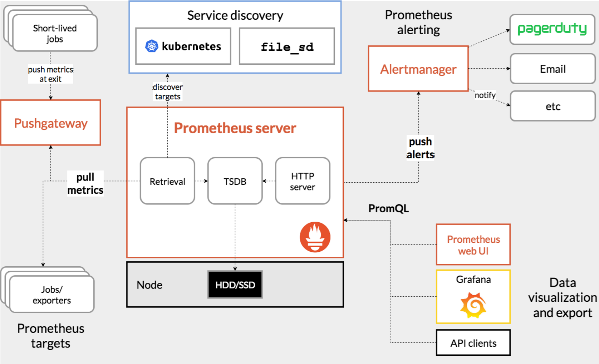
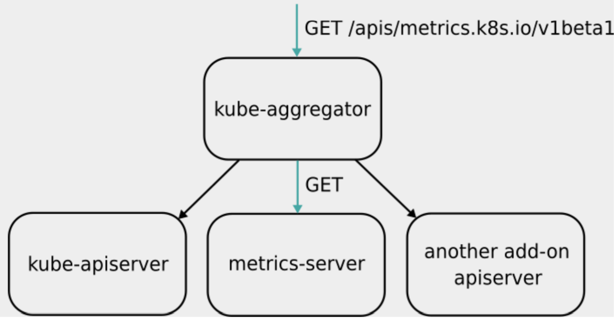
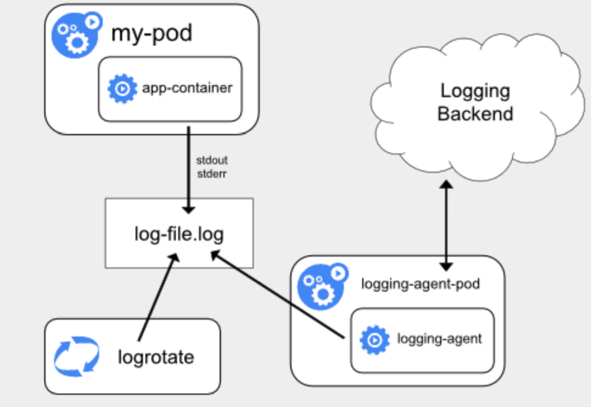
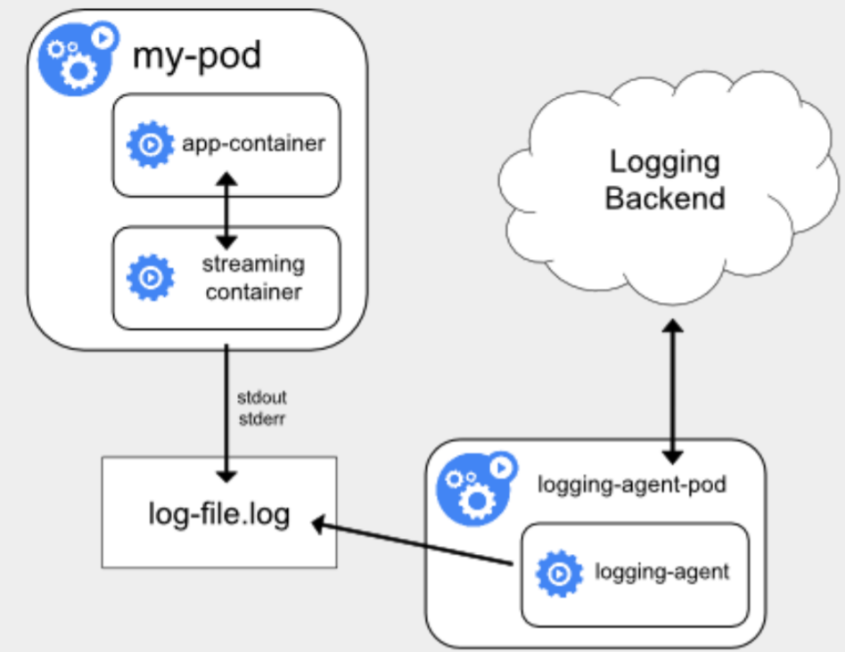
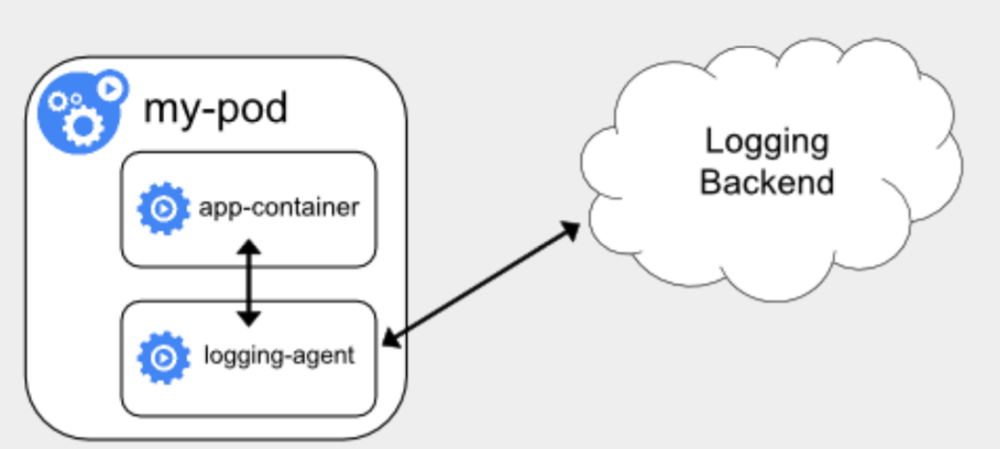
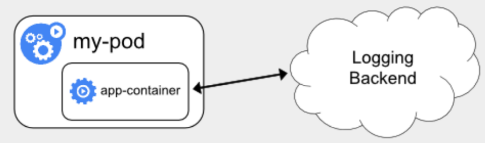

# 监控

## 监控体系

### Prometheus 

Prometheus 与 Kubernetes 一样，也来自于 Google 的 Borg 体系，它的原型系统，叫作 BorgMon，是一个几乎与 Borg 同时诞生的内部监控系统。作为一个监控系统，Prometheus 项目的作用和工作方式，可以用如下所示的一张官方示意图来解释：



Prometheus 工作的核心，是使用 Pull （抓取）的方式去搜集被监控对象的 Metrics 数据（监控指标数据），然后，再把这些数据保存在一个 TSDB （时间序列数据库，比如 OpenTSDB、InfluxDB 等）当中，以便后续可以按照时间进行检索。

有了这套核心监控机制， Prometheus 剩下的组件就是用来配合这套机制的运行。比如 Pushgateway，可以允许被监控对象以 Push 的方式向 Prometheus 推送 Metrics 数据。而Alertmanager，则可以根据 Metrics 信息灵活地设置报警。当然， Prometheus 最受用户欢迎的功能，还是通过 Grafana 对外暴露出的、可以灵活配置的监控数据可视化界面。

有了 Prometheus 之后，就可以按照 **Metrics 数据的来源**，来对 Kubernetes 的监控体系做一个汇总了。

- **宿主机的监控数据**。这部分数据的提供，需要借助一个由 Prometheus 维护的[Node Exporter](https://github.com/prometheus/node_exporter) 工具。一般来说，Node Exporter 会以 DaemonSet 的方式运行在宿主机上。其实，所谓的 Exporter，就是代替被监控对象来对 Prometheus 暴露出可以被“抓取”的Metrics 信息的一个辅助进程。

  Node Exporter 可以暴露给 Prometheus 采集的 Metrics 数据， 不单单是节点的负载（Load）、CPU 、内存、磁盘以及网络这样的常规信息，它的 [Metrics 指标](https://github.com/prometheus/node_exporter#enabled-by-default)可以说是“包罗万象”。

- **来自于 Kubernetes 的 API Server、kubelet 等组件的 `/metrics` API**。

  除了常规的 CPU、内存的信息外，这部分信息还主要包括了各个组件的核心监控指标。比如，对于 API Server 来说，它就会在` /metrics` API 里，暴露出各个 Controller 的工作队列（Work Queue）的长度、请求的 QPS 和延迟数据等等。这些信息，是检查 Kubernetes 本身工作情况的主要依据。

- **Kubernetes 相关的监控数据**。这部分数据，一般叫作 Kubernetes 核心监控数据（core metrics），包括了 Pod、Node、容器、Service 等主要 Kubernetes核心概念的 Metrics。

  容器相关的 Metrics 主要来自于 kubelet 内置的 cAdvisor 服务。在 kubelet 启动后，cAdvisor 服务也随之启动，而它能够提供的信息，可以细化到每一个容器的 CPU 、文件系统、内存、网络等资源的使用情况。


### Metrics Server

Kubernetes 核心监控数据，使用的是 Kubernetes 的一个非常重要的扩展能力，即 Metrics Server。它把监控数据信息通过标准的 Kubernetes API 暴露了出来，用户可以通过标准的 Kubernetes API 来访问到这些监控数据。

比如，这个 URL：`http://127.0.0.1:8001/apis/metrics.k8s.io/v1beta1/namespace//pods/`。访问这个 Metrics API 时，它就会返回一个 Pod 的监控数据，而这些数据，是从 kubelet 的 Summary API （即 `<kubelet_ip>:<kubelet_port>/stats/summary`）采集而来的。Summary API 返回的信息，既包括了 cAdVisor 的监控数据，也包括了 kubelet 本身汇总的信息。


 Metrics Server 并不是 kube-apiserver 的一部分，而是通过 **Aggregator** 这种插件机制，在独立部署的情况下同 kube-apiserver 一起统一对外服务的。



当 Kubernetes 的 API Server 开启了 Aggregator 模式之后，在访问`apis/metrics.k8s.io/v1beta1` 的时候，实际上访问到的是一个叫作 kube-aggregator 的代理。而 kube-apiserver，正是这个代理的一个后端；而 Metrics Server，则是另一个后端。

在这个机制下，可以添加更多的后端给这个 kube-aggregator。所以kube-aggregator 其实就是一个**根据 URL 选择具体的 API 后端的代理服务器**。通过这种方式可以很方便地扩展 Kubernetes 的 API 了。

Aggregator 模式的开启也非常简单：

- 对于使用 kubeadm 或者官方的 kube-up.sh 脚本部署 Kubernetes 集群的话，Aggregator 模式就是默认开启的

- 如果是手动 DIY 搭建的话，需要在 kube-apiserver 的启动参数里加上如下所示的配置：

  ```
  --requestheader-client-ca-file=<path to aggregator CA cert>
  --requestheader-allowed-names=front-proxy-client
  --requestheader-extra-headers-prefix=X-Remote-Extra-
  --requestheader-group-headers=X-Remote-Group
  --requestheader-username-headers=X-Remote-User
  --proxy-client-cert-file=<path to aggregator proxy cert>
  --proxy-client-key-file=<path to aggregator proxy key>
  ```

  这些配置的作用，主要就是为 Aggregator 这一层设置对应的 Key 和 Cert 文件。而[这些文件的生成](https://github.com/kubernetes-sigs/apiserver-builder-alpha/blob/master/docs/concepts/auth.md)，就需要自己手动完成了。

Aggregator 功能开启之后，只需要部署 Metrics Server 的 YAML 文件， `metrics.k8s.io` 这个 API 就会出现在了Kubernetes API 列表当中：

```
$ git clone https://github.com/kubernetes-sigs/metrics-server
$ cd metrics-server && kubectl apply -f manifests/release/kustomization.yaml
```


### 原则

**USE 原则**：按照如下三个维度来规划**资源监控指标**：

1. 利用率（Utilization），资源被有效利用起来提供服务的平均时间占比；
2. 饱和度（Saturation），资源拥挤的程度，比如工作队列的长度；
3. 错误率（Errors），错误的数量。

 **RED 原则**：按照如下三个维度来规划**服务监控指标**：

1. 每秒请求数量（Rate）；
2.  每秒错误数量（Errors）；
3. 服务响应时间（Duration）。


## Custom Metrics

借助监控体系，Kubernetes 可以提供一种非常有用的能力，那就是 Custom Metrics，**自定义监控指标**。

在真实的场景中，用户进行 Auto Scaling 的依据不只是机器的CPU、内存使用率，还会有自定义的监控指标。比如，某个应用的等待队列的长度，或者某种应用相关资源的使用情况。这些复杂多变的需求，在传统PaaS 项目和其他容器编排项目里，几乎是不可能轻松支持的。

而凭借强大的 API 扩展机制，Custom Metrics 已经成为了 Kubernetes 的一项标准能力。并且，Kubernetes 的自动扩展器组件 Horizontal Pod Autoscaler （HPA）， 也可以直接使用Custom Metrics 来执行用户指定的扩展策略，这里的整个过程都是非常灵活和可定制的。

Kubernetes 里的 Custom Metrics 机制，也是借助 Aggregator APIServer 扩展机制来实现的。这里的具体原理是，当你把 Custom Metrics APIServer 启动之后，Kubernetes 里就会出现一个叫作`custom.metrics.k8s.io`的 API。在访问这个 URL 时，Aggregator 就会把请求转发给 Custom Metrics APIServer 。

Custom Metrics APIServer 的实现，其实就是一个 Prometheus 的 Adaptor。比如，现在要实现一个根据指定 Pod 收到的 HTTP 请求数量来进行 Auto Scaling 的Custom Metrics，这个 Metrics 就可以通过访问这样一个自定义监控的 URL 获取到：`https://<apiserver_ip>/apis/custom-metrics.metrics.k8s.io/v1beta1/namespaces/default/pods/sample-metrics-app/http_requests `。

访问这个 URL 时，Custom Metrics APIServer 就会去 Prometheus 里查询名叫 `sample-metrics-app` 这个 Pod 的 `http_requests `指标的值，然后按照固定的格式返回给访问者。

当然，`http_requests `指标的值，就需要由 Prometheus 监控体系，从目标 Pod 上采集来。这里具体的做法有很多种，最普遍的做法，就是让 Pod 里的应用本身暴露出一个 `/metrics`API，然后在这个 API 里返回自己收到的 HTTP 的请求的数量。

接下来 HPA 只需要定时访问自定义监控 URL，然后根据这些值计算是否要执行 Scaling 即可。


### 实践

```
$ git clone https://github.com/luxas/kubeadm-workshop && cd kubeadm-workshop

# 使用 Prometheus Operator 部署 Prometheus
$ kubectl apply -f demos/monitoring/prometheus-operator.yaml
$ kubectl apply -f demos/monitoring/sample-prometheus-instance.yaml

# 部署 Custom Metrics APIServer
$ kubectl apply -f demos/monitoring/custom-metrics.yaml

# 为 Custom Metrics APIServer 创建对应的 ClusterRoleBinding，以便使用 curl直接访问 Custom Metrics 的 API
$ kubectl create clusterrolebinding allowall-cm --clusterrole custom-metrics-server-resources --user system:anonymous

# 部署待监控的应用和 HPA
$ kubectl apply -f demos/monitoring/sample-metrics-app.yaml
```

HPA 配置如下：

```
kind: HorizontalPodAutoscaler
apiVersion: autoscaling/v2beta1
metadata:
  name: sample-metrics-app-hpa
spec:
  scaleTargetRef:
    apiVersion: apps/v1
    kind: Deployment
    name: sample-metrics-app
  minReplicas: 2
  maxReplicas: 10
  metrics:
  - type: Object
    object:
      target:
        kind: Service
        name: sample-metrics-app
      metricName: http_requests
      targetValue: 100
```

HPA 的配置，就是设置 Auto Scaling 规则的地方。

`scaleTargetRef`字段，就指定了被监控的对象，并且，它最小的实例数目是 2，最大是10。

在 `metrics `字段，指定了这个 HPA 进行 Scale 的依据，是名叫 `http_requests `的Metrics。而获取这个 Metrics 的途径，则是访问名叫 `sample-metrics-app` 的 Service。

有了这些字段里的定义， HPA 就可以向这个 URL 发起请求来获取 Custom Metrics 的值了：`https://<apiserver_ip>/apis/custom-metrics.metrics.k8s.io/v1beta1/namespaces/default/services/sample-metrics-app/http_requests`。这个 URL 对应的被监控对象，是应用对应的 Service，而不是某个Pod，这对于一个多实例应用来说，通过 Service 来采集 Pod 的 Custom Metrics 才是合理的做法。


接下来通过 [hey](https://github.com/rakyll/hey) 这个测试工具来为应用模拟负载：

```
$ docker run -it -v /usr/local/bin:/go/bin golang:latest go get github.com/rakyll/hey

$ export APP_ENDPOINT=$(kubectl get svc sample-metrics-app -o template --template {{.spec.clusterIP}}); echo ${APP_ENDPOINT}

$ hey -n 50000 -c 1000 http://${APP_ENDPOINT}

# 同时访问应用 Service 的 Custom Metircs URL，查看这个 URL 返回的应用收到的 HTTP 请求数量
$ curl -sSLk https://<apiserver_ip>/apis/custom-metrics.metrics.k8s.io/v1beta1/namespaces/default/services/sample-metrics-app/http_requests
{
  "kind": "MetricValueList",
  "apiVersion": "custom-metrics.metrics.k8s.io/v1beta1",
  "metadata": {
    "selfLink": "/apis/custom-metrics.metrics.k8s.io/v1beta1/namespaces/default/services/sample-metrics-app/http_requests"
  },
  "items": [
    {
      "describedObject": {
        "kind": "Service",
        "name": "sample-metrics-app",
        "apiVersion": "/__internal"
      },
      "metricName": "http_requests",
      "timestamp": "2018-11-30T20:56:34Z",
      "value": "501484m"
    }
  ]
}
```

这里需要注意下 Custom Metrics API 返回的 Value 的格式。在为被监控应用编写` /metrics` API 的返回值时，比较容易计算的，是该 Pod 收到的HTTP request 的总数。所以，应用的代码其实是如下所示的样子：

```
if (request.url == "/metrics") {
    response.end("# HELP http_requests_total The amount of requests served by the server in total\n# TYPE http_requests_total counter\nhttp_requests_total " + totalrequests + "\n");
    return;
}
```

应用在` /metrics` 对应的 HTTP response 里返回的，其实是`http_requests_total `的值，这也是 Prometheus 收集到的值。而 Custom Metrics APIServer 在收到对 `http_requests `指标的访问请求之后，它会从Prometheus 里查询 `http_requests_total `的值，然后把它折算成一个以时间为单位的请求率，最后把这个结果作为 `http_requests `指标对应的值返回回去。

所以在对 Custom Metircs URL 进行访问时，得到的值是 501484m，这里的格式是 milli-requests，相当于是在过去两分钟内，每秒有 501 个请求。这样，应用的开发者就无需关心如何计算每秒的请求个数了。而这样的“请求率”的格式，是可以直接被HPA 拿来使用的。


这时候，如果同时查看 Pod 的个数的话，就会看到 HPA 开始增加 Pod 的数目了。不过，Prometheus 是如何知道**采集哪些 Pod 的`/metrics` API 作为监控指标的来源**？

实际上，在前面创建的YAML文件中，有一个类型是 `ServiceMonitor`的对象，它的 YAML 文件如下所示：

```
apiVersion: monitoring.coreos.com/v1
kind: ServiceMonitor
metadata:
  name: sample-metrics-app
  labels:
    service-monitor: sample-metrics-app
spec:
  selector:
    matchLabels:
      app: sample-metrics-app
  endpoints:
  - port: web
```

**这个 ServiceMonitor 对象，正是 Prometheus Operator 用来指定被监控 Pod 的一个配置文件**。这里是通过 Label Selector 为 Prometheus 来指定被监控应用的。


## 日志收集与管理

Kubernetes 里对容器日志的处理方式，都叫作 **cluster-level-logging**，即：这个日志处理系统，与容器、Pod 以及 Node 的生命周期都是完全无关的。这种设计是为了保证，无论是容器挂了、Pod 被删除，甚至节点宕机的时候，应用的日志依然可以被正常获取到。

对于容器来说，当应用把日志输出到 stdout 和 stderr 之后，容器在默认情况下就会把这些日志输出到宿主机上的一个 JSON 文件里。这样，就可以通过 `kubectl logs` 命令看到这些容器的日志了。如果应用是把文件输出到其他地方，比如直接输出到了容器里的某个文件里，或者输出到了远程存储里，那就属于特殊情况了。

Kubernetes 本身，实际上不会做容器日志收集工作，所以为了实现 cluster-level-logging，需要在部署集群的时候，提前对具体的日志方案进行规划。而 Kubernetes 本身，主要推荐了三种日志方案：

- **在 Node 上部署 logging agent，将日志文件转发到后端存储里保存起来。**

  

  这里的核心就在于 logging agent ，它一般都会以 DaemonSet 的方式运行在节点上，然后将宿主机上的容器日志目录挂载进去，最后由 logging-agent 把日志转发出去。

  例如，可以通过 Fluentd 项目作为宿主机上的 logging-agent，然后把日志转发到远端的 ElasticSearch 里保存起来供将来进行检索。[这里](https://kubernetes.io/docs/tasks/debug-application-cluster/logging-elasticsearch-kibana/)是具体的操作过程。

  另外，在很多 Kubernetes 的部署里，会自动启用 [logrotate](https://linux.die.net/man/8/logrotate)，在日志文件超过 10MB 的时候自动对日志文件进行 rotate 操作。
  在 Node 上部署 logging agent 最大的优点，在于**一个节点只需要部署一个 agent，并且不会对应用和 Pod 有任何侵入性。**所以，这个方案在社区里是最常用的一种。

  但是，这种方案的不足之处就在于，它**要求应用输出的日志，都必须是直接输出到容器的 stdout 和 stderr 里**。

- 当容器的日志只能输出到某些文件里的时候，**通过一个 sidecar 容器把这些日志文件重新输出到sidecar 的 stdout 和 stderr 上，这样就能够继续使用第一种方案了**。

  

  ```
  apiVersion: v1
  kind: Pod
  metadata:
    name: counter
  spec:
    containers:
    - name: count
      image: busybox
      args:
      - /bin/sh
      - -c
      - >
        i=0;
        while true;
        do
          echo "$i: $(date)" >> /var/log/1.log;
          echo "$(date) INFO $i" >> /var/log/2.log;
          i=$((i+1));
          sleep 1;
        done
      volumeMounts:
      - name: varlog
        mountPath: /var/log
    volumes:
    - name: varlog
      emptyDir: {}
  ```

  这个Pod 中的容器，日志输出到了文件中，在这种情况下，用 `kubectl logs` 命令是看不到应用的任何日志的。这个时候，就可以为这个 Pod 添加两个 sidecar 容器，分别将上述两个日志文件里的内容重新以 stdout 和 stderr 的方式输出出来：

  ```
  containers:
   - name: count
     ...
   - name: count-log-1
     image: busybox
     args: [/bin/sh, -c, 'tail -n+1 -f /var/log/1.log']
     volumeMounts:
     - name: varlog
       mountPath: /var/log
   - name: count-log-2
     image: busybox
     args: [/bin/sh, -c, 'tail -n+1 -f /var/log/2.log']
     volumeMounts:
     - name: varlog
       mountPath: /var/log
  ```

  这时候就可以通过 `kubectl logs counter count-log-1/count-log-2`命令查看这两个 sidecar 容器的日志。

  由于 sidecar 跟主容器之间是共享 Volume 的，所以这里的 sidecar 方案的额外性能损耗并不高，也就是多占用一点 CPU 和内存罢了。但是，**宿主机上实际上会存在两份相同的日志文件**：一份是应用自己写入的；另一份则是 sidecar 的 stdout 和 stderr 对应的 JSON 文件。这对磁盘是很大的浪费，所以，除非万不得已或者应用容器完全不可能被修改，否则还是直接使用方案一，或者直接使用下面的第三种方案。

- **通过一个 sidecar 容器，直接把应用的日志文件发送到远程存储里面去。**也就是相当于把方案一里的 logging agent，放在了应用 Pod 里。

  

  在这种方案里，应用可以直接把日志输出到固定的文件里而不是 stdout， logging-agent 还可以使用 fluentd，后端存储还可以是 ElasticSearch。只不过， fluentd 的输入源，变成了应用的日志文件。一般会把 fluentd 的输入源配置保存在一个 ConfigMap里：

  ```
  apiVersion: v1
  kind: ConfigMap
  metadata:
    name: fluentd-config
  data:
    fluentd.conf: |
    <source>
      type tail
      format none
      path /var/log/1.log
      pos_file /var/log/1.log.pos
      tag count.format1
    </source>
   
    <source>
      type tail
      format none
      path /var/log/2.log
      pos_file /var/log/2.log.pos
      tag count.format2
    </source>
  
    <match **>
      type google_cloud
    </match>
  ```

  然后在应用 Pod 的定义里，就可以声明一个 Fluentd 容器作为 sidecar，专门负责将应用生成的 1.log 和 2.log 转发到 ElasticSearch 当中：

  ```
  apiVersion: v1
  kind: Pod
  metadata:
    name: counter
  spec:
    containers:
      - name: count
        image: busybox
        args:
        - /bin/sh
        - -c
        - >
          i=0;
          while true;
          do
            echo "$i: $(date)" >> /var/log/1.log;
            echo "$(date) INFO $i" >> /var/log/2.log;
            i=$((i+1));
            sleep 1;
          done
        volumeMounts:
        - name: varlog
          mountPath: /var/log
      - name: count-agent
        image: k8s.gcr.io/fluentd-gcp:1.30
        env:
        - name: FLUENTD_ARGS
          value: -c /etc/fluentd-config/fluentd.conf
        volumeMounts:
        - name: varlog
          mountPath: /var/log
        - name: config-volume
          mountPath: /etc/fluentd-config
    volumes:
    - name: varlog
      emptyDir: {}
    - name: config-volume
      configMap:
        name: fluentd-config
  ```

  这个 Fluentd 容器使用的输入源，就是通过引用 ConfigMap 来指定的，即使用 Projected Volume 来把 ConfigMap 挂载到 Pod 里。

  这种方案虽然部署简单，并且对宿主机非常友好，但是这个 sidecar 容器很可能会消耗较多的资源，甚至拖垮应用容器。并且，由于日志还是没有输出到 stdout 上，所以通过` kubectl logs` 是看不到任何日志输出的。


除了这几种方案，还有一种方式就是在编写应用的时候，直接指定好日志的存储后端：



这种方案下，Kubernetes 就完全不必操心容器日志的收集了


将日志直接输出到 stdout 和 stderr，这样做有一个问题，就是日志都需要经过 Docker Daemon 的处理才会写到宿主机磁盘上，所以宿主机没办法以容器为单位进行日志文件的 Rotate。这时候，还是要考虑通过宿主机的 Agent 来对容器日志进行处理和收集的方案。