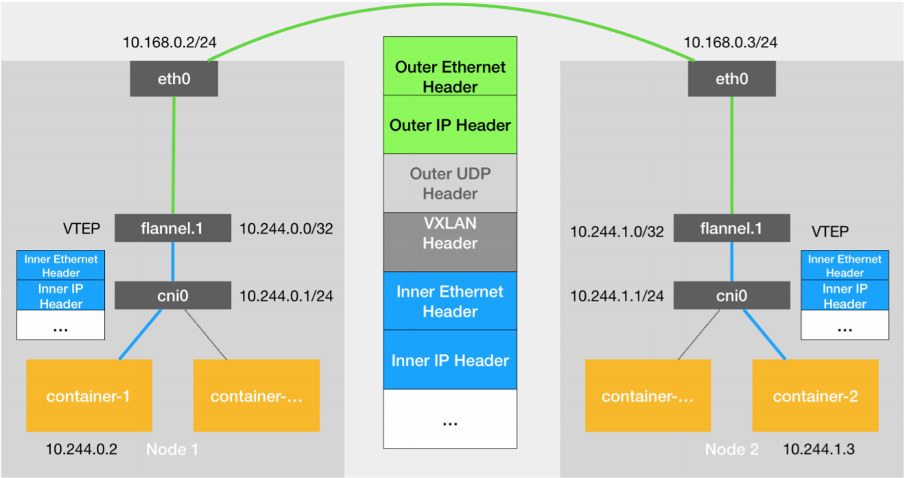
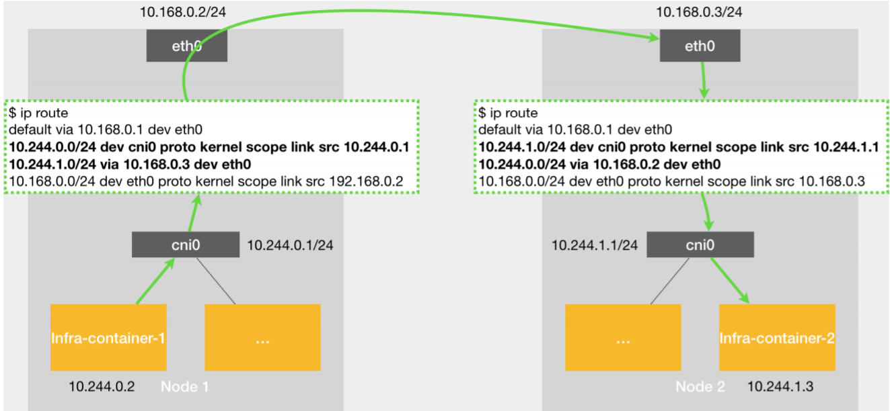
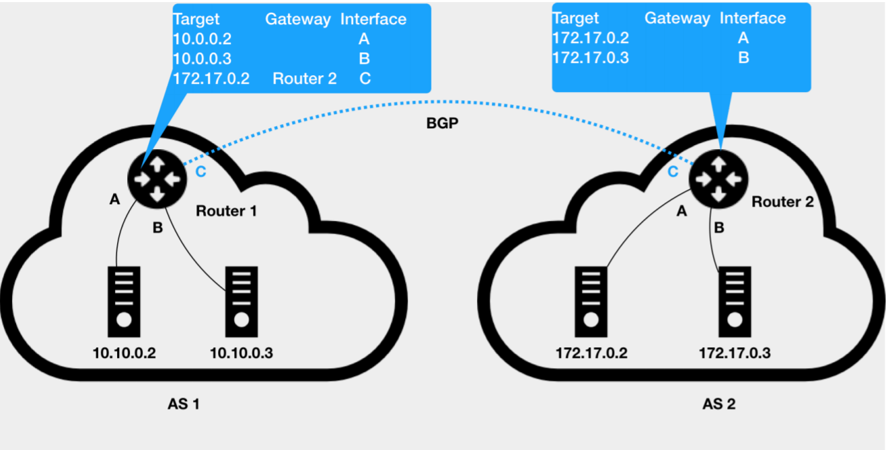
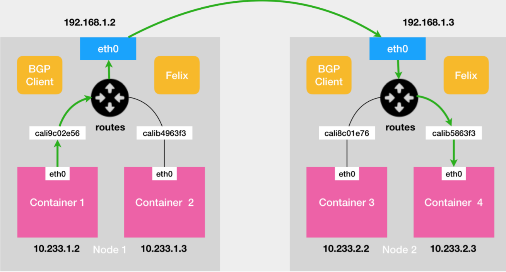
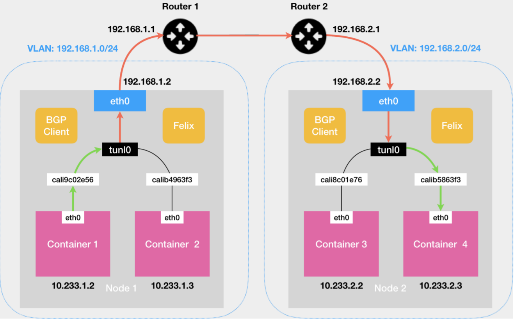
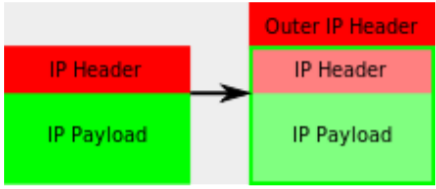

# Kubernetes 网络


## CNI

UDP 和 VXLAN 模式下的容器网络，有一个共同点：用户的容器都连接在 docker0 网桥上。而网络插件则在宿主机上创建了一个特殊的设备（UDP 模式创建的是 TUN 设备，VXLAN 模式创建的则是 VTEP 设备），docker0 与这个设备之间，通过 IP 转发（路由表）进行协作。

网络插件真正要做的事情，是通过某种方法，把不同宿主机上的特殊设备连通，从而达到容器跨主机通信的目的。

这个流程，也正是 Kubernetes 对容器网络的主要处理方法。只不过，Kubernetes 是通过一个叫作 CNI 的接口，维护了一个单独的CNI 网桥来代替 docker0，它在宿主机上的设备名称默认是：cni0。


### 跨主机通信

以 Flannel 的 VXLAN 模式为例，在 Kubernetes 环境里，它的工作方式跟跨主机通信时的容器相同。只是docker0 网桥被替换成了 CNI 网桥而已：



> Kubernetes 为 Flannel 分配的子网范围是`10.244.0.0/16`，可以在执行`kubeadm init`时用 `pod-network-cidr `参数指定。也可以在部署完成后，通过修改 kube-controller-manager 的配置文件来指定。

这时候，假设 Infra-container-1 要访问 Infra-container-2（也就是 Pod-1 要访问 Pod-2），这个 IP 包的源地址就是 10.244.0.2，目的 IP 地址是 10.244.1.3。而此时，Infra-container-1里的 eth0 设备，同样是以 Veth Pair 的方式连接在 Node 1 的 cni0 网桥上。所以这个 IP 包就会经过 cni0 网桥出现在宿主机上。Pod-1 所在宿主机的路由表如下：

```
$ route
Kernel IP routing table
Destination     Gateway         Genmask         Flags Metric Ref    Use Iface
...
10.244.0.0      0.0.0.0         255.255.255.0   U     0      0        0 cni0
10.244.1.0      10.244.1.0      255.255.255.0   UG    0      0        0 flannel.1
10.244.2.0      10.244.2.0      255.255.255.0   UG    0      0        0 flannel.1
172.17.0.0      0.0.0.0         255.255.0.0     U     0      0        0 docker0
192.168.50.0    0.0.0.0         255.255.255.0   U     0      0        0 enp0s8
```

因为 IP 包的目的 IP 地址是 10.244.1.3，所以只能匹配到 10.244.1.0 对应的这条路由规则。这条规则指定了本机的 flannel.1 设备进行处理。并且，flannel.1 在处理完后，要将 IP 包转发到的网关（Gateway），正是“隧道”另一端的 VTEP 设备，也就是 Pod-2 所在宿主机的 flannel.1 设备。接下来的流程，跟Docker 环境下的 Flannel VXLAN 模式完全一样。

> **CNI 网桥只接管所有 CNI 插件负责的、即 Kubernetes 创建的容器（Pod）。**
>
> 如果用 `docker run` 单独启动一个容器，那么 Docker 项目还是会把这个容器连接到 docker0 网桥上。所以这个容器的 IP 地址，一定是属于 docker0 网桥的172.17.0.0/16 网段。


### CNI插件使用

Kubernetes 之所以要设置一个与 docker0 网桥功能几乎一样的 CNI 网桥，主要原因包括两个方面：

- Kubernetes 项目并没有使用 Docker 的网络模型（CNM），所以它并不希望、也不具备配置 docker0 网桥的能力
- 与 Kubernetes 如何配置 Pod，也就是 Infra 容器的 Network Namespace密切相关

Kubernetes 创建一个 Pod 的第一步，就是创建并启动一个 Infra 容器，用来“hold”住这个 Pod 的 Network Namespace。

CNI 的设计思想，就是：**Kubernetes 在启动 Infra 容器之后，就可以直接调用 CNI 网络插件，为这个 Infra 容器的 Network Namespace，配置符合预期的网络栈。**


要知道这个网络栈是如何配置的，需要从CNI 插件的部署和实现方式谈起。

在部署 Kubernetes 的时候，有一个步骤是安装 kubernetes-cni 包，它的目的就是**在宿主机上安装CNI 插件所需的基础可执行文件**。在安装完成后，你可以在宿主机的 `/opt/cni/bin` 目录下看到它们：

```
$ ls /opt/cni/bin/
bandwidth  dhcp      flannel      host-local  loopback  portmap  sbr     tuning
bridge     firewall  host-device  ipvlan      macvlan   ptp      static  vlan
```

这些 CNI 的基础可执行文件，按照功能可以分为三类：

- **Main 插件**：用来创建具体网络设备。比如，bridge（网桥设备）、ipvlan、loopback（lo 设备）、macvlan、ptp（Veth Pair 设备），以及 vlan。

  > Flannel、Weave 等项目，都属于“网桥”类型的 CNI 插件。所以在具体的实现中，它们往往会调用 bridge 这个二进制文件。

- **IPAM（IP Address Management）插件**：负责分配 IP 地址。比如，dhcp，这个文件会向 DHCP 服务器发起请求；host-local，则会使用预先配置的 IP地址段来进行分配。

- 由 CNI 社区维护的**内置 CNI 插件**。比如：

  - flannel：专门为 Flannel 项目提供的CNI 插件
  - tuning：通过 `sysctl `调整网络设备参数的二进制文件
  - portmap，通过 `iptables `配置端口映射的二进制文件
  - bandwidth，是一个使用 Token Bucket Filter (TBF)来进行限流的二进制文件


从这些二进制文件中，可以发现，如果要实现一个给 Kubernetes 用的容器网络方案，其实需要做两部分工作，以 Flannel 项目为例：

- 首先，实现这个网络方案本身。这一部分需要编写的，就是 flanneld 进程里的主要逻辑。比如，创建和配置 flannel.1 设备、配置宿主机路由、配置 ARP 和 FDB 表里的信息等等。主要是宿主机上的操作。

- 然后，实现该网络方案对应的 CNI 插件。这一部分主要需要做的，就是配置 Infra 容器里面的网络栈，并把它连接在 CNI 网桥上。
  由于 Flannel 项目对应的 CNI 插件已经被内置了，所以它无需再单独安装。而对于 Weave、Calico 等其他项目来说，我们就必须在安装插件的时候，把对应的 CNI 插件的可执行文件放在`/opt/cni/bin/` 目录下。

  实际上，对于 Weave、Calico 这样的网络方案来说，它们的 DaemonSet 只需要挂载宿主机的` /opt/cni/bin/`，就可以实现插件可执行文件的安装了。


接下来需要在宿主机上安装 flanneld（网络方案本身）。在这个过程中，flanneld 启动后会在每台宿主机上生成它对应的CNI 配置文件（一个 ConfigMap），从而告诉Kubernetes，这个集群要使用 Flannel 作为容器网络方案。这个 CNI 配置文件的内容如下所示：

```
$ cat /etc/cni/net.d/10-flannel.conflist
{
  "name": "cbr0",
  "cniVersion": "0.3.1",
  "plugins": [
    {
      "type": "flannel",
      "delegate": {
        "hairpinMode": true,
        "isDefaultGateway": true
      }
    },
    {
      "type": "portmap",
      "capabilities": {
        "portMappings": true
      }
    }
  ]
}
```

`Delegate `字段的意思是，这个 CNI 插件并不会自己做事，而是会调用 Delegate 指定的某种CNI 内置插件来完成。对于 Flannel 来说，它调用的 Delegate 插件，就是 CNI bridge 插件。

> **Hairpin Mode**
>
> **默认情况下，网桥设备是不允许一个数据包从一个端口进来后，再从这个端口发出去的。**但是，如果为这个端口开启 Hairpin Mode，就可以取消这个限制。
>
> 这个特性，主要用在容器需要通过NAT的方式，“自己访问自己”的场景下。比如执行 `docker run -p 8080:80`，就是在宿主机上通过 iptables 设置了一条 DNAT（目的地址转换）转发规则。这条规则的作用是，当宿主机上的进程访问`<宿主机的 IP 地址>:8080`时，iptables 会把该请求直接转发到`<容器的 IP 地址>:80`上。也就是说，这个请求最终会经过 docker0 网桥进入容器里面。
>
> 但如果在容器里面访问宿主机的 8080 端口，那么这个容器里发出的 IP 包会经过 veth设备（端口）和 docker0 网桥，来到宿主机上。此时，根据上述 DNAT 规则，这个 IP 包又需要回到 docker0 网桥，并且还是通过 veth 端口进入到容器里。所以，这种情况下，就需要开启 veth 端口的 Hairpin Mode 了。

Flannel 插件要在 CNI 配置文件里声明 `hairpinMode=true`。这样，将来这个集群里的 Pod 才可以通过它自己的 Service 访问到自己。


在 Kubernetes 中，处理容器网络相关的逻辑并不会在 kubelet 主干代码里执行，而是会在具体的 CRI（Container Runtime Interface，容器运行时接口）实现里完成。对于 Docker 来说，它的 CRI 实现叫作 dockershim，可以在 kubelet 的代码里找到它。

> Kubernetes 目前不支持多个 CNI 插件混用。如果在 CNI 配置目录`/etc/cni/net.d`里放置了多个 CNI 配置文件的话，dockershim 只会加载按字母顺序排序的第一个插件。
> 不过，CNI 允许在一个 CNI 配置文件里，通过 `plugins `字段，定义多个插件进行协作。比如，在上面这个例子里，Flannel 项目就指定了 flannel 和 portmap 这两个插件。

所以，接下来 dockershim 会加载上述的 CNI 配置文件，并且把列表里的第一个插件，即 flannel 插件，设置为默认插件。在后面的执行过程中，flannel 和 portmap 插件会按照定义顺序被调用，从而依次完成“配置容器网络”和“配置端口映射”这两步操作。


### CNI插件 工作原理

当 kubelet 组件需要创建 Pod 的时候，它第一个创建的一定是 Infra 容器。所以在这一步，dockershim 就会先调用 Docker API 创建并启动 Infra 容器，紧接着执行`SetUpPod`的方法。这个方法的作用就是：为 CNI 插件准备参数，然后调用 CNI 插件为 Infra 容器配置网络。

这里要调用的 CNI 插件，就是 `/opt/cni/bin/flannel`；而调用它所需要的参数，分为两部分。

**第一部分，是由 dockershim 设置的一组 CNI 环境变量。**其中，最重要的环境变量参数叫作：`CNI_COMMAND`。它的取值只有两种：`ADD `和 `DEL`。这个 ADD 和 DEL 操作，就是 CNI 插件唯一需要实现的两个方法。

ADD 操作的含义是：把容器添加到 CNI 网络里；DEL 操作的含义则是：把容器从 CNI 网络里移除掉。

对于网桥类型的 CNI 插件来说，这两个操作意味着把容器以 Veth Pair 的方式“插”到 CNI网桥上，或者从网桥上“拔”掉。

接下来，主要介绍 ADD 操作。CNI 的 ADD 操作需要的参数包括：容器里网卡的名字 eth0（`CNI_IFNAME`）、Pod 的Network Namespace 文件的路径（`CNI_NETNS`）、容器的 ID（`CNI_CONTAINERID`）等。这些参数都属于上述环境变量里的内容。其中，Pod（Infra 容器）的 Network Namespace 文件的路径是：`/proc/<容器进程的 PID>/ns/net`。

除此之外，在 CNI 环境变量里，还有一个叫作 `CNI_ARGS `的参数。通过这个参数，CRI 实现（比如 dockershim）就可以以 Key-Value 的格式，传递自定义信息给网络插件。这是用户将来 自定义 CNI 协议的一个重要方法。

**第二部分，则是 dockershim 从 CNI 配置文件里加载到的、默认插件的配置信息。**这个配置信息在 CNI 中被叫作 Network Configuration，它的完整定义可以参考[这个文档](https://github.com/containernetworking/cni/blob/master/SPEC.md#network-configuration)。dockershim 会把 Network Configuration 以 JSON 数据的格式，通过标准输入（stdin）的方式传递给 Flannel CNI 插件。


由于CNI 配置文件中的`delegate` 字段，dockershim 对 Flannel CNI 插件的调用，其实就是走了个过场。**Flannel CNI 插件唯一需要做的，就是对 dockershim 传来的 Network Configuration 进行补充。**比如，将`Delegate `的 Type 字段设置为 bridge，将 Delegate 的 `IPAM `字段设置为 host-local 等。经过 Flannel CNI 插件补充后的完整的 `Delegate `字段如下：

```
{
  "hairpinMode":true,
  "ipMasq":false,
  "ipam":{
    "routes":[
      {
        "dst":"10.244.0.0/16"
      }
    ],
    "subnet":"10.244.1.0/24",
    "type":"host-local"
  },
  "isDefaultGateway":true,
  "isGateway":true,
  "mtu":1450,
  "name":"cbr0",
  "type":"bridge"
}
```

> `ipam `字段里的信息，比如 `10.244.1.0/24`，读取自 Flannel 在宿主机上生成的 Flannel配置文件，即：宿主机上的 `/run/flannel/subnet.env` 文件。


接下来，Flannel CNI 插件就会调用 CNI bridge 插件，也就是执行`/opt/cni/bin/bridge` 二进制文件。这次调用 CNI bridge 插件需要的两部分参数的第一部分、也就是 CNI 环境变量，并没有变化，它里面的 `CNI_COMMAND `参数的值还是“ADD”。而第二部分的 Network Configration，则是上面补充好的 `Delegate `字段。Flannel CNI 插件会把 `Delegate `字段的内容以标准输入（stdin）的方式传递给 CNI bridge 插件。

> Flannel CNI 插件还会把 `Delegate `字段以 JSON 文件的方式，保存在`/var/lib/cni/flannel `目录下。这是为了给后面删除容器调用 DEL 操作时使用的。


有了这两部分参数， CNI bridge 插件就可以“代表”Flannel，进行“**将容器加入到 CNI 网络里**”这一步操作了。

首先，CNI bridge 插件会**在宿主机上检查 CNI 网桥是否存在**。如果没有的话，那就创建它：

```
# 在宿主机上
$ ip link add cni0 type bridge
$ ip link set cni0 up
```

接下来，CNI bridge 插件会通过 Infra 容器的 Network Namespace 文件，进入到这个 Network Namespace 里面，然后**创建一对 Veth Pair 设备**。紧接着，把这个 Veth Pair 的其中一端，“移动”到宿主机上：

```
# 在容器里
# 创建一对 Veth Pair 设备。其中一个叫作 eth0，另一个叫作 vethb4963f3
$ ip link add eth0 type veth peer name vethb4963f3

# 启动 eth0 设备
$ ip link set eth0 up

# 将 Veth Pair 设备的另一端（也就是 vethb4963f3 设备）放到宿主机（也就是 Host Namespace）里
$ ip link set vethb4963f3 netns $HOST_NS

# 通过 Host Namespace，启动宿主机上的 vethb4963f3 设备
$ ip netns exec $HOST_NS ip link set vethb4963f3 up 
```

这样，vethb4963f3 就出现在了宿主机上，而且这个 Veth Pair 设备的另一端，就是容器里面的 eth0。

> 上述创建 Veth Pair 设备的操作，也可以先在宿主机上执行，然后再把该设备的一端放到容器的 Network Namespace 里，这个原理是一样的。
>
> 不过，CNI 插件之所以要“反着”来，是因为 CNI 里对 Namespace 操作函数的设计就是如此：
>
> ```
> err := containerNS.Do(func(hostNS ns.NetNS) error {
>   ...
>   return nil
> })
> ```
>
> 在编程时，容器的 Namespace 是可以直接通过 Namespace 文件拿到的；而 Host Namespace，则是一个隐含在上下文的参数。所以，像上面这样，先通过容器 Namespace 进入容器里面，然后再反向操作 Host Namespace，对于编程来说要更加方便。

接下来，CNI bridge 插件就可以**把 vethb4963f3 设备连接在 CNI 网桥上**，并为它设置Hairpin Mode：

```
# 在宿主机上
$ ip link set vethb4963f3 master cni0
```

接下来，CNI bridge 插件会调用 CNI ipam 插件，从 `ipam.subnet` 字段规定的网段里为容器分配一个可用的 IP 地址。然后，CNI bridge 插件就会把这个 IP 地址添加在容器的 eth0 网卡上，同时为容器设置默认路由：

```
# 在容器里
$ ip addr add 10.244.0.2/24 dev eth0
$ ip route add default via 10.244.0.1 dev eth0
```

最后，CNI bridge 插件会为 CNI 网桥添加 IP 地址：

```
# 在宿主机上
$ ip addr add 10.244.0.1/24 dev cni0
```


执行完上述操作之后，CNI 插件会把容器的 IP 地址等信息返回给 dockershim，然后被kubelet 添加到 Pod 的 `Status `字段。至此，CNI 插件的 ADD 方法就宣告结束了。

> 对于非网桥类型的 CNI 插件，上述“将容器添加到 CNI 网络”的操作流程，以及网络方案本身的工作原理，就都不太一样了。


### Kubernetes 网络模型

- 所有容器都可以直接使用 IP 地址与其他容器通信，而无需使用 NAT
- 所有宿主机都可以直接使用 IP 地址与所有容器通信，而无需使用 NAT。反之亦然。
- 容器自己“看到”的自己的 IP 地址，和别人（宿主机或者容器）看到的地址是完全一样的。

容器与容器之间要“通”，容器与宿主机之间也要“通”。并且，Kubernetes 要求这个“通”，还必须是直接基于容器和宿主机的 **IP 地址**来进行的。


## 三层网络方案

除了网桥类型的网络方案，还有一种纯三层（Pure Layer 3）网络方案，其中的典型例子，莫过于 Flannel 的 host-gw 模式和 Calico 。

### Flannel host-gw



假设现在，Node 1 上的 Infra-container-1，要访问 Node 2 上的 Infra-container-2。在设置 Flannel 使用 host-gw 模式之后，flanneld 会在宿主机上创建这样一条规则，以 Node 1 为例：

```
$ ip route
...
10.244.1.0/24 via 10.168.0.3 dev eth0
```

这条路由规则的含义是：目的 IP 地址属于 10.244.1.0/24 网段的 IP 包，应该经过本机的 eth0 设备发出去（即：`dev eth0`）；并且，它下一跳地址是 10.168.0.3（即：`via 10.168.0.3`）。这个下一跳地址对应的，正是目的宿主机 Node2。

一旦配置了下一跳地址，那么接下来，当 IP 包从网络层进入链路层封装成帧的时候，eth0 设备就会使用下一跳地址对应的 MAC 地址，作为该数据帧的目的 MAC 地址，这个 MAC 地址，正是 Node 2 的 MAC 地址。这样，这个数据帧就会从 Node 1 **通过宿主机的二层网络**顺利到达 Node 2 上。

而 Node 2 的内核网络栈从二层数据帧里拿到 IP 包后，会“看到”这个 IP 包的目的 IP 地址是 10.244.1.3，即 Infra-container-2 的 IP 地址。这时候，根据 Node 2 上的路由表，该目的地址会匹配到第二条路由规则（也就是 10.244.1.0 对应的路由规则），从而进入 cni0 网桥，进而进入到 Infra-container-2 当中。

**host-gw 模式的工作原理，就是将每个 Flannel 子网的“下一跳”，设置成了该子网所在宿主机的 IP 地址**。也就是说，这台“主机”（Host）会充当这条容器通信路径里的“网关”（Gateway），这也正是“host-gw”的含义。

**Flannel 子网和主机的信息，都是保存在 Etcd 当中的。**flanneld 只需要 WACTH 这些数据的变化，然后实时更新路由表即可。

> 在 Kubernetes v1.7 之后，类似 Flannel、Calico 的 CNI 网络插件都是可以直接连接 Kubernetes 的 APIServer 来访问 Etcd 的，无需额外部署 Etcd 给它们使用。

在这种模式下，容器通信的过程就免除了额外的封包和解包带来的性能损耗。根据实际的测试，host-gw 的性能损失大约在 10% 左右，而其他所有基于 VXLAN“隧道”机制的网络方案，性能损失都在 20%~30% 左右。


**Flannel host-gw 模式必须要求集群宿主机之间是二层连通的，**因为IP 包在封装为以太网帧的时候，会使用到下一跳的Mac地址。不过，宿主机之间二层不连通的情况也是广泛存在的。比如，宿主机分布在了不同的子网（VLAN）里。但是，在一个 Kubernetes 集群里，宿主机之间必须可以通过 IP 地址进行通信，也就是说至少是三层可达的。否则，集群将不满足Kubernetes 网络模型中的宿主机之间 IP 互通的假设。当然，“三层可达”也可以通过为几个子网设置三层转发来实现。


### Calico

Calico 提供的网络解决方案，与 Flannel 的 host-gw 模式，几乎是完全一样的。Calico 也会在每台宿主机上，添加一个格式如下所示的路由规则：

```
<目的容器 IP 地址段> via <网关的 IP 地址> dev eth0
```

网关的 IP 地址，正是目的容器所在宿主机的 IP 地址。

这个三层网络方案得以正常工作的核心，是为每个容器的 IP 地址，找到它所对应的、“下一跳”的网关。不过，不同于 Flannel 通过 Etcd 和宿主机上的 flanneld 来维护路由信息的做法，**Calico 使用的是BGP 来自动地在整个集群中分发路由信息。**


#### BGP

BGP (Border Gateway Protocol)，边界网关协议，是一个 Linux 内核原生就支持的、专门用在大规模数据中心里维护不同的“自治系统”(Autonomous System，AS)之间路由信息的、无中心的路由协议。



这个图中有两个自治系统：AS 1 和 AS 2。**所谓的一个自治系统，指的是一个组织管辖下的所有 IP 网络和路由器的全体。**在正常情况下，自治系统之间不会有任何“来往”。

但是，如果这样两个自治系统里的主机，要通过 IP 地址直接进行通信，就必须使用路由器把这两个自治系统连接起来。比如，AS 1 里面的主机 10.10.0.2，要访问 AS 2 里面的主机 172.17.0.2 的话。它发出的 IP包，就会先到达自治系统 AS 1 上的路由器 Router 1。

而此时，Router 1 的路由表里，有这样一条规则，即：目的地址是 172.17.0.2 包，应该经过Router 1 的 C 接口，发往网关 Router 2（AS 2 上的路由器）。所以 IP 包就会到达 Router 2 上，然后经过 Router 2 的路由表，从 A 接口出来到达目的主机172.17.0.2。

但是反过来，如果主机 172.17.0.2 要访问 10.10.0.2，那么这个 IP 包，在到达 Router 2 之后，就不知道该去哪儿了。因为在 Router 2 的路由表里，并没有关于 AS 1 自治系统的任何路由规则。所以这时候，网络管理员就应该给 Router 2 也添加一条路由规则，比如：目标地址是 10.10.0.2 的 IP 包，应该经过 Router 2 的 C 接口，发往网关 Router 1。

这种负责把自治系统连接在一起的路由器，称为：**边界网关**。它跟普通路由器的不同之处在于，它的路由表里拥有其他自治系统里的主机路由信息。


但是，假设现在的网络拓扑结构非常复杂，每个自治系统都有成千上万个主机、无数个路由器，甚至是由多个公司、多个网络提供商、多个自治系统组成的复合自治系统。如果还要依靠人工来对边界网关的路由表进行配置和维护，那是绝对不现实的。

这种情况下，BGP 大显身手的时刻就到了。使用 BGP ，相当于在**每个边界网关**上都会运行着一个小程序，它们会将各自的路由表信息，通过 TCP 传输给其他的边界网关。而其他边界网关上的这个小程序，则会对收到的这些数据进行分析，然后将需要的信息添加到自己的路由表里。

这样，上图中 Router 2 的路由表里，就会自动出现 10.10.0.2 和 10.10.0.3 对应的路由规则了。


所以说，所谓 BGP，就是**在大规模网络中实现节点路由信息共享的一种协议**。而 BGP 的这个能力，正好可以取代 Flannel 维护主机上路由表的功能。而且，BGP 这种原生就是为大规模网络环境而实现的协议，其可靠性和可扩展性，远非 Flannel 自己的方案可比。


#### 架构

Calico 由三个部分组成：
1. Calico 的 CNI 插件，这是 Calico 与 Kubernetes 对接的部分。
2. Felix，它是一个 DaemonSet，负责在宿主机上插入路由规则（即：写入 Linux 内核的 FIB转发信息库），以及维护 Calico 所需的网络设备等工作。
3. BIRD，它是 BGP 的客户端，专门负责在集群里分发路由规则信息。

除了对路由信息的维护方式之外，Calico 与 Flannel 的 host-gw 模式的另一个不同之处，就是**它不会在宿主机上创建任何网桥设备**。Calico 的工作方式，可以用下图来描述：



绿色实线标出的路径，就是一个 IP 包从 Node 1 上的 Container 1，到达 Node 2 上的 Container 4 的完整路径。

**Calico 的 CNI 插件会为每个容器设置一个 Veth Pair 设备，然后把其中的一端放置在宿主机上**（它的名字以 cali 前缀开头）。此外，由于 Calico 没有使用 CNI 的网桥模式，Calico 的 CNI 插件还需要在宿主机上为每个容器的 Veth Pair 设备配置一条路由规则，用于接收传入的 IP 包。比如，宿主机 Node 2 上的 Container 4 对应的路由规则，如下所示：

```
 10.233.2.3 dev cali5863f3 scope link
```

即：发往 10.233.2.3 的 IP 包，应该进入 cali5863f3 设备。

> 基于上述原因，Calico 在宿主机上设置的路由规则，肯定要比 Flannel 多得多。不过，Flannel host-gw 模式使用 CNI 网桥的主要原因，其实是为了跟VXLAN 模式保持一致。否则的话，Flannel 就需要维护两套 CNI 插件了。


有了这样的 Veth Pair 设备之后，容器发出的 IP 包就会经过 Veth Pair 设备出现在宿主机上。然后，宿主机网络栈就会根据路由规则的下一跳 IP 地址，把它们转发给正确的网关。接下来的流程就跟 Flannel host-gw 模式完全一致了。

其中，这里最核心的**“下一跳”路由规则，就是由 Calico 的 Felix 进程负责维护的**。**这些路由规则信息，则是通过 BGP Client 也就是 BIRD 组件，使用 BGP 协议传输而来的。**这些通过 BGP 协议传输的消息，可以简单地理解为如下格式：

```
[BGP 消息]
我是宿主机 192.168.1.2
10.233.2.0/24 网段的容器都在我这里
这些容器的下一跳地址是我
```

**Calico 实际上将集群里的所有节点，都当作是边界路由器来处理，它们一起组成了一个全连通的网络，互相之间通过 BGP 协议交换路由规则。**这些节点，称为 BGP Peer。

Calico 维护的网络在默认配置下，是一个被称为**Node-to-Node Mesh**的模式。这时候，每台宿主机上的 BGP Client 都需要跟其他所有节点的 BGP Client 进行通信以便交换路由信息。但是，随着节点数量 N 的增加，这些连接的数量就会以$N^2$的规模快速增长，从而给集群本身的网络带来巨大的压力。

所以，Node-to-Node Mesh 模式一般推荐用在少于 100 个节点的集群里。而在更大规模的集群中，需要用到的是**Route Reflector** 模式。在这种模式下，Calico 会指定一个或者几个专门的节点，来负责跟所有节点建立 BGP 连接从而学习到全局的路由规则。而其他节点，只需要跟这几个专门的节点交换路由信息，就可以获得整个集群的路由规则信息了。

这些专门的节点，就是 Route Reflector 节点，它们实际上扮演了“中间代理”的角色，从而把 BGP 连接的规模控制在 N 的数量级上。


#### IPIP 模式

Flannel host-gw 模式最主要的限制，就是要求集群宿主机之间是二层连通的。这个限制对于 Calico 来说，也同样存在。

假如有**两台处于不同子网的宿主机** Node 1 和 Node 2，对应的 IP 地址分别是192.168.1.2 和 192.168.2.2。这两台机器通过路由器实现了三层转发，所以这两个 IP 地址之间是可以相互通信的。而现在的需求，是 Container 1 要访问 Container 4。按照前面的讲述，Calico 会尝试在 Node 1 上添加如下所示的一条路由规则：

```
10.233.2.0/16 via 192.168.2.2 eth0
```

但是，这时候问题就来了。上面这条规则里的下一跳地址是 192.168.2.2，可是它对应的 Node 2 跟 Node 1 却根本不在一
个子网里，没办法通过二层网络把 IP 包发送到下一跳地址。这种情况下，就需要为 Calico 打开 **IPIP 模式**。




在 Calico 的 IPIP（IP in IP） 模式下，Felix 进程在 Node 1 上添加的路由规则，会稍微不同：

```
10.233.2.0/24 via 192.168.2.2 tunl0
```

尽管这条规则的下一跳地址仍然是 Node 2 的 IP 地址，但这一次，要负责将 IP 包发出去的设备，变成了 tunl0（不是 Flannel UDP 模式使用的 tun0，这两种设备的功能是完全不一样的）。

这个 tunl0 设备，是一个 IP 隧道（IP tunnel）设备。IP 包进入 IP 隧道设备之后，就会被 Linux 内核的 IPIP 驱动接管。IPIP 驱动会**将这个 IP 包直接封装在一个宿主机网络的 IP 包**中，如下所示：



经过封装后的新的 IP 包的目的地址（Outer IP Header 部分），正是原 IP 包的下一跳地址，即 Node 2 的 IP 地址：192.168.2.2。原 IP 包本身，则会被直接封装成新 IP 包的 Payload。

这样，原先从容器到 Node 2 的 IP 包，就被伪装成了一个从 Node 1 到 Node 2 的 IP 包。由于宿主机之间已经使用路由器配置了三层转发，也就是设置了宿主机之间的“下一跳”。所以这个 IP 包在离开 Node 1 之后，就可以经过路由器，最终“跳”到 Node 2 上。这时，Node 2 的网络内核栈会使用 IPIP 驱动进行解包，从而拿到原始的 IP 包。然后，原始 IP包就会经过路由规则和 Veth Pair 设备到达目的容器内部。


当 Calico 使用 IPIP 模式的时候，集群的网络性能会因为额外的封包和解包工作而下降。在实际测试中，Calico IPIP 模式与 Flannel VXLAN 模式的性能大致相当。所以，在实际使用时，如非硬性需求，最好将所有宿主机节点放在一个子网里，避免使用 IPIP。


#### 设置 宿主机网关 为 BGP Peer

如果 Calico 能够让宿主机之间的路由设备（网关），也通过 BGP 协议“学习”到Calico 网络里的路由规则，那么从容器发出的 IP 包，不就可以通过这些设备路由到目的宿主机了。

比如，在上面“IPIP 示意图”中的 Node 1 上，添加如下所示的一条路由规则：

```
10.233.2.0/24 via 192.168.1.1 eth0
```

同时在 Router 1 上（192.168.1.1），添加如下所示的一条路由规则：

```
10.233.2.0/24 via 192.168.2.1 eth0
```

那么 Container 1 发出的 IP 包，就可以通过两次“下一跳”，到达 Router 2（192.168.2.1）。以此类推，继续在 Router 2 上添加“下一条”路由，最终把 IP 包转发到 Node 2上。

但是这种方式在 Kubernetes 被广泛使用的公有云场景里，却完全不可行。因为公有云环境下，宿主机之间的网关，肯定不会允许用户进行干预和设置。而且，在大多数公有云环境下，宿主机（公有云提供的虚拟机）本身往往就是二层连通的，所以这个需求也不强烈。


不过，在私有部署的环境下，宿主机属于不同子网（VLAN）反而是更加常见的部署状态。这时候，想办法将宿主机网关也加入到 BGP Mesh 里从而避免使用 IPIP，就成了一个非常迫切的需求。在 Calico 中，它已经提供了两种将宿主机网关设置成 BGP Peer 的解决方案。

- **所有宿主机都跟宿主机网关建立 BGP Peer 关系。**

  这种方案下，Node 1 和 Node 2 就需要主动跟宿主机网关 Router 1 和 Router 2 建立 BGP 连接。从而将类似于 10.233.2.0/24 这样的路由信息同步到网关上去。

  不过，这种方式下，Calico 要求**宿主机网关必须支持一种叫作 Dynamic Neighbors的 BGP 配置方式**。这是因为，在常规的路由器 BGP 配置里，运维人员必须明确给出所有 BGP Peer 的 IP 地址。考虑到 Kubernetes 集群可能会有成百上千个宿主机，而且还会动态地添加和删除节点，这时候再手动管理路由器的 BGP 配置就非常麻烦了。而 Dynamic Neighbors 则允许你给路由器配置一个网段，然后路由器就会自动跟该网段里的主机建立起 BGP Peer 关系。

- **使用一个或多个独立组件负责搜集整个集群里的所有路由信息，然后通过 BGP 协议同步给网关。**

  在大规模集群中，Calico 本身就推荐使用 Route Reflector节点的方式进行组网。所以，这里负责跟宿主机网关进行沟通的独立组件，直接由 Route Reflector 兼任即可。

  更重要的是，这种情况下网关的 BGP Peer 个数是有限并且固定的。所以可以直接把这些独立组件配置成路由器的 BGP Peer，而无需 Dynamic Neighbors 的支持。
  
  当然，这些独立组件的工作原理也很简单：它们只需要 WATCH Etcd 里的宿主机和对应网段的变化信息，然后把这些信息通过 BGP 协议分发给网关即可。


