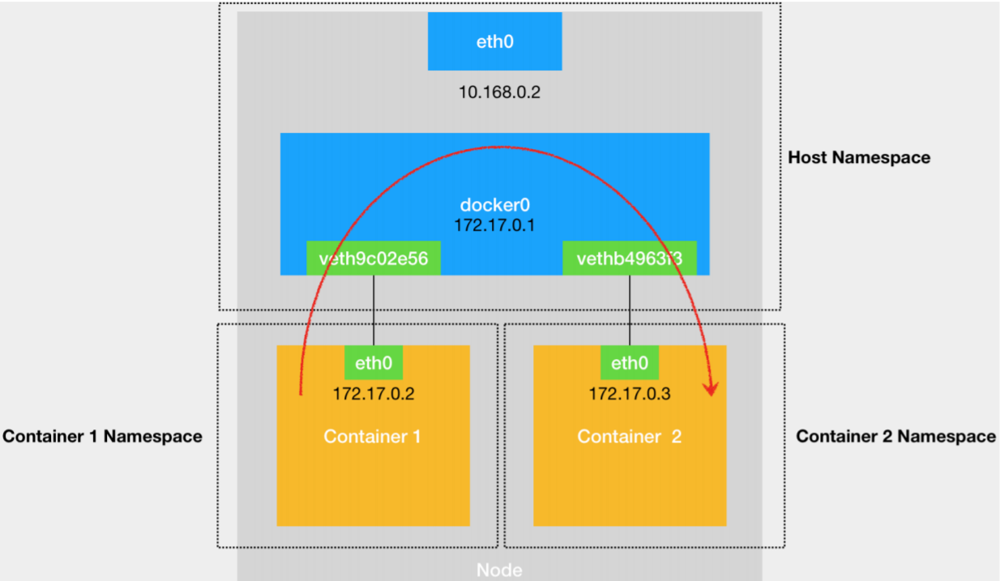
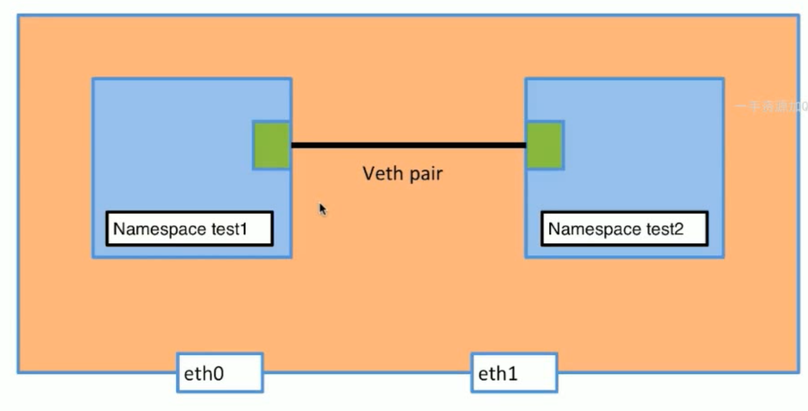
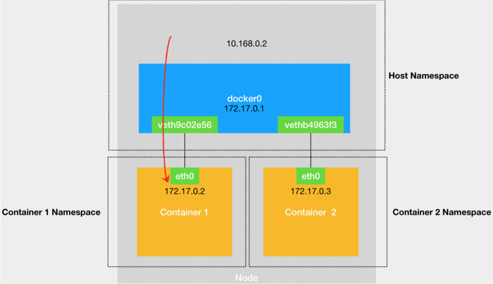
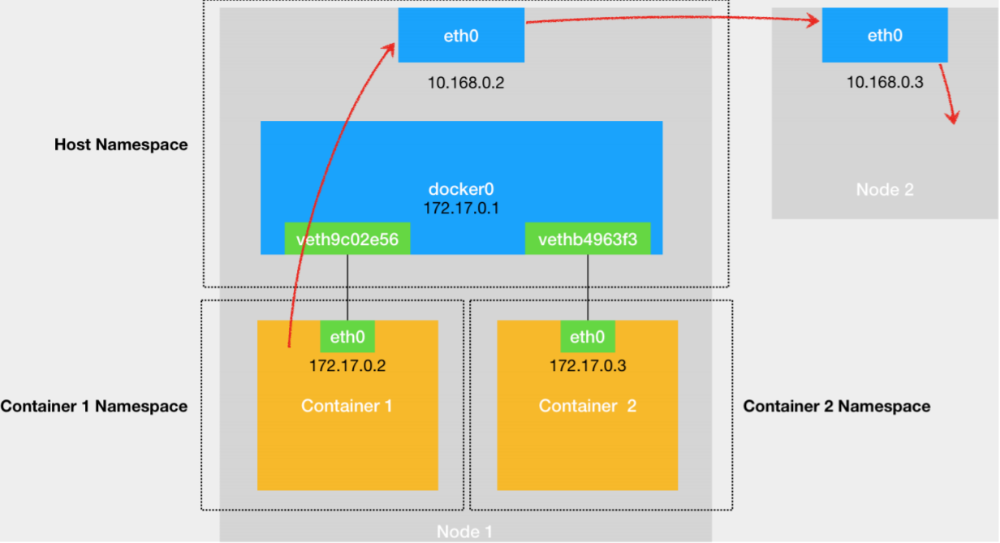
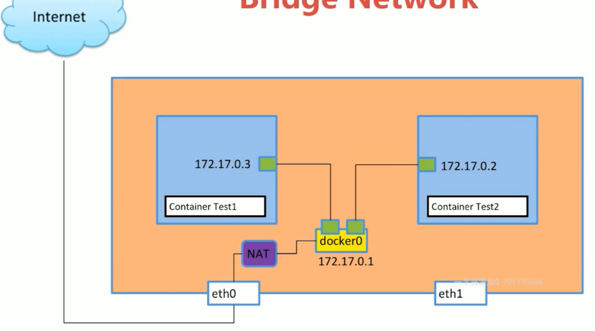
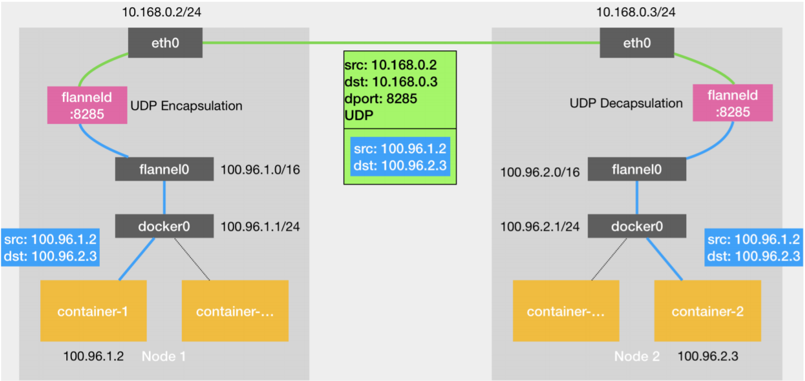
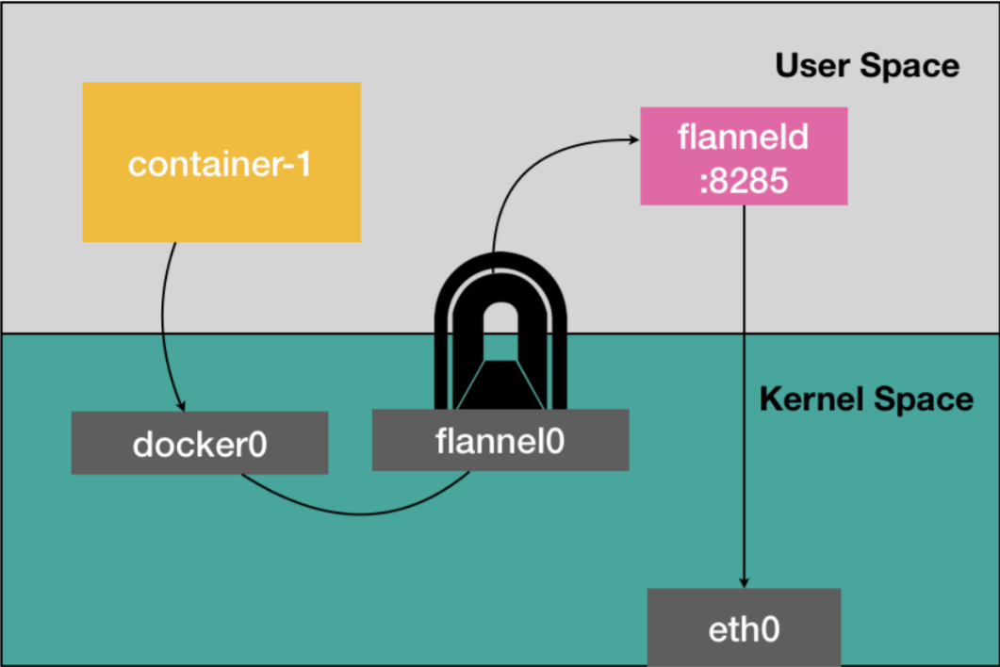
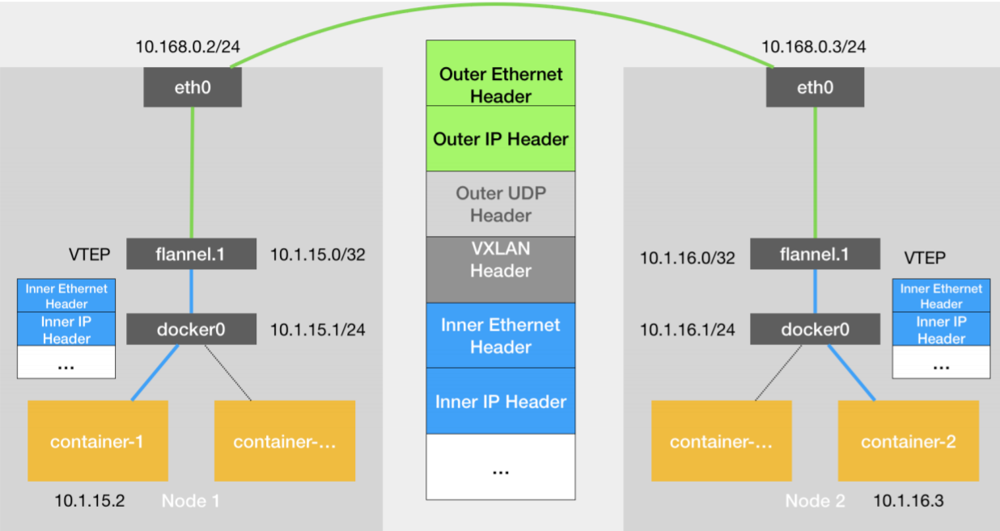
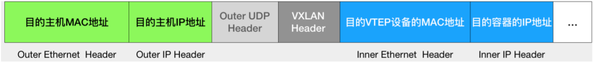

# 网络

有bridge、host、none、overlay等类型的network。

一个“网络栈”包括：网卡（Network Interface）、回环设备（Loopback Device）、路由表（Routing Table）和 iptables 规则。对于一个进程来说，这些要素，就构成了它发起和响应网络请求的基本环境。


## host network

容器没有自己的mac地址、IP v4地址、IP v6地址，但是跟宿主机共享所有接口。

容器直接使用宿主机网络栈，虽然可以为容器提供良好的网络性能，但也会不可避免地引入共享网络资源的问题，比如端口冲突。所以，在大多数情况下，我们都希望容器进程能使用自己 Network Namespace 里的网络栈，即：拥有属于自己的 IP 地址和端口。


## none network

容器没有mac地址、IP v4地址、IP v6地址，只有环回接口，孤立的network namespace。

应用：只允许本地访问，例如存储密码。


## 单机网络

创建两个**busybox**容器(一个集成了三百多个最常用Linux命令和工具的软件)，进行docker容器间的通信测试。默认使用bridge网络。

```
$ docker run -d --name test1 busybox /bin/sh -c "while true; do sleep 3600; done"
$ docker run -d --name test2 busybox /bin/sh -c "while true; do sleep 3600; done"
```


### veth pair

每个容器都在自己的network namespace中，那么这个容器如何跟其他 Network Namespace 里的容器进程进行交互呢？

可以把每一个容器看做一台主机，它们都有一套独立的“网络栈”。如果想要实现两台主机之间的通信，最直接的办法，就是把它们用一根网线连接起来；而如果想要实现多台主机之间的通信，那就需要用网线，把它们连接在一台交换机上。

在 Linux 中，能够起到虚拟交换机作用的网络设备，是网桥（Bridge）。它是一个工作在数据链路层（Data Link）的设备，主要功能是根据 MAC 地址学习来将数据包转发到网桥的不同端口（Port）上。

为了实现上述目的，Docker 会默认在宿主机上创建一个名叫 docker0 的网桥，凡是连接在 docker0 网桥上的容器，就可以通过它来进行通信。

容器使用 Veth Pair 虚拟设备连接到docker0网桥，Veth Pair 设备的特点是：它被创建出来后，总是以两张虚拟网卡（Veth Peer）的形式成对出现的。并且，从其中一个“网卡”发出的数据包，可以直接出现在与它对应的另一张“网卡”上，哪怕这两个“网卡”在不同的 Network Namespace 里。Veth Pair 相当于连接不同 Network Namespace 的“网线”。

进入到busybox容器中查看它的网络设备：

```
$ docker exec -it test1 /bin/sh
/ # ifconfig
eth0      Link encap:Ethernet  HWaddr 02:42:AC:11:00:02
          inet addr:172.17.0.2  Bcast:172.17.255.255  Mask:255.255.0.0
          UP BROADCAST RUNNING MULTICAST  MTU:1500  Metric:1
          RX packets:15 errors:0 dropped:0 overruns:0 frame:0
          TX packets:0 errors:0 dropped:0 overruns:0 carrier:0
          collisions:0 txqueuelen:0
          RX bytes:1186 (1.1 KiB)  TX bytes:0 (0.0 B)

lo        Link encap:Local Loopback
          inet addr:127.0.0.1  Mask:255.0.0.0
          UP LOOPBACK RUNNING  MTU:65536  Metric:1
          RX packets:0 errors:0 dropped:0 overruns:0 frame:0
          TX packets:0 errors:0 dropped:0 overruns:0 carrier:0
          collisions:0 txqueuelen:1000
          RX bytes:0 (0.0 B)  TX bytes:0 (0.0 B)
/ # route
Kernel IP routing table
Destination     Gateway         Genmask         Flags Metric Ref    Use Iface
default         172.17.0.1      0.0.0.0         UG    0      0        0 eth0
172.17.0.0      *               255.255.0.0     U     0      0        0 eth0          
```

容器里有一张叫作 `eth0 `的网卡，它正是一个 Veth Pair 设备在容器里的这一端。

通过 `route `命令查看 test1 容器的路由表，发现 `eth0 `网卡是这个容器里的默认路由设备；所有对 `172.17.0.0/16` 网段的请求，也会被交给 `eth0 `来处理（第二条172.17.0.0 路由规则）。


#### 查看veth pair的两端

```
# 容器内执行
/ # ip link show eth0
15: eth0@if16: <BROADCAST,MULTICAST,UP,LOWER_UP,M-DOWN> mtu 1500 qdisc noqueue
    link/ether 02:42:ac:11:00:02 brd ff:ff:ff:ff:ff:ff
```

`15: eth0@if16`表示`eth0`接口的index是15，16是和它pair的veth peer的index。

这个 Veth Pair 设备的另一端，则在宿主机上：

```
$ ip link show | grep 16
16: veth67ca8e0@if15: <BROADCAST,MULTICAST,UP,LOWER_UP> mtu 1500 qdisc noqueue master docker0 state UP mode DEFAULT group default

$ brctl show
bridge name     bridge id               STP enabled     interfaces
docker0         8000.02422a87f64c       no              veth67ca8e0
                                                        vethf7f0ad0
```

因此，在宿主机上，这个Veth Peer的接口名为`veth67ca8e0`，而且这张网卡被“插”在了 docker0网桥 上。另外一张同样插在这个网桥上的网卡是test2容器的Veth Pair的peer。


#### 容器间通信

在 test1 容器里访问 test2 容器的 IP 地址（比如` ping 172.17.0.3`）的时候，这个目的 IP 地址会匹配到 test1 容器里的第二条路由规则。可以看到，这条路由规则的网关（Gateway）是`*`，意味着这是一条直连规则，即：凡是匹配到这条规则的 IP 包，应该经过本机的 eth0 网卡，**通过二层网络直接发往目的主机**。

要通过**二层网络**到达 test2 容器，就需要有 172.17.0.3 这个 IP 地址对应的 MAC 地址。所以 test1 容器的网络协议栈，就需要通过 eth0 网卡发送一个 ARP 广播，来查找这个 IP 地址对应的 MAC 地址。

这个 eth0 网卡，是一个 Veth Pair，它的一端在这个 test1 容器的Network Namespace 里，而另一端则位于宿主机上（Host Namespace），并且被“插”在了宿主机的 docker0 网桥上。

> 一旦一张虚拟网卡被“插”在网桥上，它就会变成该网桥的“从设备”。**从设备会被“剥夺”调用网络协议栈处理数据包的资格，从而“降级”成为网桥上的一个端口。**而这个端口唯一的作用，就是接收流入的数据包，然后把这些数据包的“生杀大权”（比如转发或者丢弃），全部交给对应的网桥。

在收到这些 ARP 请求之后，docker0 网桥就会扮演二层交换机的角色，把 ARP 广播转发到其他被“插”在 docker0 上的虚拟网卡上。这样，同样连接在 docker0 上的 test2 容器的网络协议栈就会收到这个 ARP 请求，从而将 172.17.0.3 所对应的 MAC 地址回复给test1 容器。

有了这个目的 MAC 地址，test1 容器的 `eth0`网卡就可以将数据包发出去。根据 Veth Pair 设备的原理，这个数据包会立刻出现在宿主机上的 `veth67ca8e0`虚拟网卡上。不过，此时这个 `veth67ca8e0`网卡的网络协议栈的资格已经被“剥夺”，所以这个数据包就直接流入到了 docker0 网桥里。

对于宿主机上这个网桥上流入的数据包，就会通过宿主机的网络协议栈进行处理。需要注意的是，在宿主机上，Docker 早已自动设置如下所示的路由规则：

```
$ route
Kernel IP routing table
Destination     Gateway         Genmask         Flags Metric Ref    Use Iface
172.17.0.0      0.0.0.0         255.255.0.0     U     0      0        0 docker0
......
```

这次流入的数据包的目的 IP 是 172.17.0.3，所以，当它出现宿主机之后，就会按照上述 172.17.0.0 这条路由规则，再次经过 docker0 网桥转发（FORWARD）出去。docker0 处理转发的过程，则继续扮演二层交换机的角色。此时，docker0 网桥根据数据包的目的 MAC 地址（也就是 test2 容器的 MAC 地址），在它的 CAM 表（即交换机通过 MAC地址学习维护的端口和 MAC 地址的对应表）里查到对应的端口（Port）为：`vethf7f0ad0`，然后把数据包发往这个端口。

这个端口，正是 test2 容器“插”在 docker0 网桥上的另一块虚拟网卡，它也是一个 Veth Pair 设备。这样，数据包就进入到了 test2 容器的 Network Namespace 里。test2 容器看到自己的 eth0 网卡上出现了流入的数据包，它的网络协议栈就会对请求进行处理，最后将响应（Pong）返回到 test1。



> 在实际的数据传递时，上述数据的传递过程在网络协议栈的不同层次，都有Linux 内核 Netfilter 参与其中。
>
> ```
> # 打开 iptables 的 TRACE功能查看数据包的传输过程
> $ iptables -t raw -A OUTPUT -p icmp -j TRACE
> $ iptables -t raw -A PREROUTING -p icmp -j TRACE
> ```
>
> 在 `/var/log/syslog` 里可以看到数据包传输的日志。


#### namespace间通信

两个容器间的通信，相当于两个network namespace借助网桥实现通信，除了这种方法，还可以在两个network namespace间直接创建一对Veth Pair，直接进行通信。




##### 操作namespace

- `ip netns list`：查看已有的网络namespace
- `ip netns add test1`：创建namespace
- `ip netns delete test1`：删除namespace
- `ip netns exec ${ns} ${command}`：在名为ns的namespace中执行command命令
- `ip link show`：显示网络接口信息
- `ip link set eth0 up`：开启`eth0 `网卡
- `ip link set eth0 down `：关闭`eth0 `网卡
- `ip link set eth0 promisc on`：开启`eth0 `网卡的混合模式
- `ip link set eth0 promisc offi`：关闭`eth0 `网卡的混合模式
- `ip link set eth0 txqueuelen 1200`： 设置`eth0 `网卡队列长度
- `ip link set eth0 mtu 1400`：设置`eth0 `网卡最大传输单元


```shell
# 创建Veth Pair，两端分别命名为veth-test1和veth-test2
$ ip link add veth-test1 type veth peer name veth-test2
$ ip link
9: veth-test2@veth-test1: <BROADCAST,MULTICAST,M-DOWN> mtu 1500 qdisc noop state DOWN mode DEFAULT group default qlen 1000
    link/ether 56:14:f7:5b:2f:67 brd ff:ff:ff:ff:ff:ff
10: veth-test1@veth-test2: <BROADCAST,MULTICAST,M-DOWN> mtu 1500 qdisc noop state DOWN mode DEFAULT group default qlen 1000
    link/ether da:45:77:03:ef:27 brd ff:ff:ff:ff:ff:ff
    
# 将两端分别添加到两个namespace中
$ ip link set veth-test1 netns test1	
$ ip link set veth-test2 netns test2

# 在test1这个namespace中执行ip link
$ ip netns exec test1 ip link	
10: veth-test1@if9: <BROADCAST,MULTICAST> mtu 1500 qdisc noop state DOWN mode DEFAULT group default qlen 1000
    link/ether da:45:77:03:ef:27 brd ff:ff:ff:ff:ff:ff link-netnsid 1
    
$ ip netns exec test2 ip link
9: veth-test2@if10: <BROADCAST,MULTICAST> mtu 1500 qdisc noop state DOWN mode DEFAULT group default qlen 1000
    link/ether 56:14:f7:5b:2f:67 brd ff:ff:ff:ff:ff:ff link-netnsid 0

# 分配IP地址
$ ip netns exec test1 ip addr add 192.168.1.1/24 dev veth-test1
$ ip netns exec test2 ip addr add 192.168.1.2/24 dev veth-test2
# 此时执行ip link，仍没有ip地址，且是down的状态

# 启动两端
$ ip netns exec test1 ip link set dev veth-test1 up
$ ip netns exec test2 ip link set dev veth-test2 up
$ ip netns exec test1 ip a	#  有ip地址了，且两端可以相互ping通
$ ip netns exec test1 ping 192.168.1.2
```


#### 宿主机访问容器

在一台宿主机上，访问该宿主机上的容器的 IP 地址时，这个请求的数据包，也是先根据路由规则到达 docker0 网桥，然后被转发到对应的 Veth Pair 设备，最后出现在容器里。




#### 容器访问宿主机

当一个容器试图连接到另外一个宿主机时，比如：`ping 10.168.0.3`，它发出的请求数据包，首先经过 docker0 网桥出现在宿主机上。然后根据宿主机的路由表里的直连路由规则（`10.168.0.0/24 via eth0`)，对 10.168.0.3 的访问请求就会交给宿主机的 eth0 处理。

所以接下来，这个数据包就会经宿主机的 eth0 网卡转发到目标主机网络上，到达 10.168.0.3对应的宿主机上。当然，这个过程的实现要求这两台宿主机本身是连通的。



当遇到容器连不通“外网”的时候，可以先试试 docker0 网桥能不能 ping通，然后查看跟 docker0 和 Veth Pair 设备相关的 iptables 规则是不是有异常。


#### 容器访问internet




### docker network基本操作

- `docker network ls`：查看所有网络。
- `docker network inspect network-id`：查看某个网络的详细信息，可以看到哪些容器用到该网络。
- `docker network create -d bridge my-bridge`：创建driver为bridge的network，可通过`brctl show`查看。
- `docker run -d --name test3 --network my-bridge ...`：在创建新的容器时，指定network
- `docker network connect my-bridge test2`：可以已有容器的network，此时，test2既连到默认的bridge，也连到my-bridge。

> 两个容器都连接到用户自定义的network上，而不是默认的docker0，它们之间通信可以直接用容器名取代IP地址，就像`--link`。


### 容器之间的link

当容器A运行后台服务，另一个容器B执行数据库服务，A要去访问B的数据库服务。A需要知道B的IP地址和端口号。端口号一般是固定的，但IP地址不一定。

此时可以在创建容器时，使用`--link`参数，即`docker run -d --name test2 --link test1  ...`

之后test2想访问test1，可以直接用**test1**代替**test1的IP地址**。但是test1想访问test2，必须用test2的IP地址。

相当于用`--link`，给test2添加了一个DNS记录。

> 该参数实际使用较少，因为有其他更方便的方法（例如新建network）。


### 端口映射

`docker run --name web -d -p ip:hostPort:containerPort | ip::containerPort | hostPort:containerPort nginx`

**hostPort:containerPort**方式默认会绑定本地所有接口上的所有地址。

**ip:hostPort:containerPort**指定映射使用一个特定地址及其端口。


## 跨主机网络

要实现不同主机上的容器间的通信，可以使用Flannel 。Flannel 本身只是一个框架，真正提供容器网络功能的，是 Flannel 的后端实现。目前，Flannel 支持三种后端实现，分别是：

- VXLAN
- host-gw
- UDP


### UDP

UDP 模式，是 Flannel 最早支持的一种方式，却也是性能最差的一种方式。

运行两个虚拟机，并让container-1 访问 container-2：

- 宿主机 Node 1 上有一个容器 container-1，它的 IP 地址是 `100.96.1.2`，对应的 docker0 网桥的地址是：`100.96.1.1/24`。
- 宿主机 Node 2 上有一个容器 container-2，它的 IP 地址是 `100.96.2.3`，对应的 docker0 网桥的地址是：`100.96.2.1/24`。

container-1 容器里的进程发起的 IP 包，其源地址就是 `100.96.1.2`，目的地址就是`100.96.2.3`。由于目的地址 `100.96.2.3 `并不在 Node 1 的 docker0 网桥的网段里，所以这个 IP 包会被交给默认路由规则，通过容器的网关进入 docker0 网桥（如果是同一台宿主机上的容器间通信，走的是直连规则），从而出现在宿主机上。

这时候，这个 IP 包的下一个目的地，就取决于宿主机上的路由规则了。此时，Flannel 已经在宿主机上创建出了一系列的路由规则：

```
# 在 Node 1 上
$ ip route
default via 10.168.0.1 dev eth0
100.96.0.0/16 dev flannel0 proto kernel scope link src 100.96.1.0
100.96.1.0/24 dev docker0 proto kernel scope link src 100.96.1.1
10.168.0.0/24 dev eth0 proto kernel scope link src 10.168.0.2
```

由于 IP 包的目的地址是 `100.96.2.3`，它匹配不到本机 docker0 网桥对应的`100.96.1.0/24` 网段，只能匹配到第二条、也就是 `100.96.0.0/16` 对应的这条路由规则，从而进入到一个叫作 flannel0 的设备中。

flannel0 是一个 **Tunnel 设备**，Tunnel 设备是一种工作在三层（Network Layer）的虚拟网络设备，功能非常简单：**在操作系统内核和用户应用程序之间传递 IP 包**。

以 flannel0 设备为例：

当操作系统将一个 IP 包发送给 flannel0 设备之后，flannel0 就会把这个 IP包，交给创建这个设备的应用程序，也就是 Flannel 进程。这是一个从内核态（Linux 操作系统）向用户态（Flannel 进程）的流动方向。

如果 Flannel 进程向 flannel0 设备发送了一个 IP 包，那么这个 IP 包就会出现在宿主机网络栈中，然后根据宿主机的路由表进行下一步处理。这是一个从用户态向内核态的流动方向。

所以，当 IP 包从容器经过 docker0 出现在宿主机，然后又根据路由表进入 flannel0 设备后，宿主机上的 flanneld 进程（Flannel 在每个宿主机上的主进程），就会收到这个 IP 包。然后，flanneld 看到了这个 IP 包的目的地址，是100.96.2.3，在 etcd 中查询该地址对应的子网的宿主机的 IP 地址。

> 在由 Flannel 管理的容器网络里，一台宿主机上的所有容器，都属于该宿主机被分配的一个“子网”。这个例子中，Node 1 的子网是 100.96.1.0/24，container-1 的 IP 地址是100.96.1.2。Node 2 的子网是 100.96.2.0/24，container-2 的 IP 地址是 100.96.2.3。
>
> 这些子网与宿主机的对应关系，保存在 Etcd 当中：
>
> ```
> $ etcdctl ls /coreos.com/network/subnets
> /coreos.com/network/subnets/100.96.1.0-24
> /coreos.com/network/subnets/100.96.2.0-24
> /coreos.com/network/subnets/100.96.3.0-24
> 
> $ etcdctl get /coreos.com/network/subnets/100.96.2.0-24
> {"PublicIP":"10.168.0.3"}
> ```
>
> 

得到container-2的宿主机的IP地址后，对于 flanneld 来说，只要 Node 1 和 Node 2 是互通的，那么 flanneld 作为 Node 1 上的一个普通进程，就一定可以通过 IP 地址（10.168.0.3）访问到 Node 2，这没有任何问题。

之后 flanneld  就会把这个 IP 包直接封装在一个 UDP 包里，然后发送给 Node 2。这个 UDP 包的源地址，就是 flanneld 所在的 Node 1 的地址，目的地址，则是 container-2 所在的宿主机 Node 2 的地址。

实际上，**每台宿主机上的 flanneld，都监听着一个 8285 端口**，所以flanneld 只要把 UDP 包发往 Node 2 的 8285 端口即可。

通过这样一个普通的、宿主机之间的 UDP 通信，一个 UDP 包就从 Node 1 到达了 Node 2。而Node 2 上监听 8285 端口的进程也是 flanneld，所以这时候，flanneld 就可以从这个 UDP 包里解析出封装在里面的、container-1 发来的原 IP 包，然后直接把这个 IP 包发送给它所管理的 TUN 设备，即 flannel0 设备。

Node 2 上的 Linux 内核网络栈就会负责处理这个 IP 包：通过本机的路由表来寻找这个 IP 包的下一步流向。

```
# 在 Node 2 上
$ ip route
default via 10.168.0.1 dev eth0
100.96.0.0/16 dev flannel0 proto kernel scope link src 100.96.2.0
100.96.2.0/24 dev docker0 proto kernel scope link src 100.96.2.1
10.168.0.0/24 dev eth0 proto kernel scope link src 10.168.0.3
```

由于这个 IP 包的目的地址是 100.96.2.3，它跟第三条、也就是 100.96.2.0/24 网段对应的路由规则匹配更加精确。所以，Linux 内核就会按照这条路由规则，把这个 IP 包转发给 docker0 网桥。docker0 网桥扮演二层交换机的角色，将数据包发送给正确的端口，进而通过 Veth Pair 设备进入到 container-2 的Network Namespace 里。

上述流程要正确工作还有一个重要的前提：**docker0 网桥的地址范围必须是Flannel 为宿主机分配的子网**。这个很容易实现，只需要给宿主机上面的 Docker Daemon 启动时配置 `bip `参数即可：

```
$ FLANNEL_SUBNET=100.96.1.1/24
$ dockerd --bip=$FLANNEL_SUBNET ...
```




#### 不足

Flannel UDP 模式提供的其实是一个三层的 Overlay 网络，即：它首先对发出端的 IP 包进行 UDP 封装，然后在接收端进行解封装拿到原始的 IP 包，进而把这个 IP 包转发给目标容器。这就好比，Flannel 在不同宿主机上的两个容器之间打通了一条“隧道”，使得这两个容器可以直接使用 IP 地址进行通信，而无需关心容器和宿主机的分布情况。

在这个过程中，由于需要频繁地进行用户态与内核态的切换，导致性能受到很大的影响。

相比于两台宿主机之间的直接通信，基于 Flannel UDP 模式的容器通信多了一个额外的步骤，即 flanneld 的处理过程。而这个过程，由于使用到了 flannel0 这个 TUN 设备，仅在发出 IP包的过程中，就需要经过三次用户态与内核态之间的数据拷贝，如下所示：



Flannel 进行 UDP 封装（Encapsulation）和解封装（Decapsulation）的过程，也都是在用户态完成的。


### VXLAN

[VXLAN](https://en.wikipedia.org/wiki/Virtual_Extensible_LAN)，Virtual Extensible LAN（虚拟可扩展局域网），是 Linux 内核本身就支持的一种网络虚似化技术，所以 VXLAN 可以**完全在内核态实现上述封装和解封装的工作**，从而通过与UDP 模式相似的“隧道”机制，构建出覆盖网络（Overlay Network）。

VXLAN 的覆盖网络的设计思想是：在现有的三层网络之上，“覆盖”一层虚拟的、由内核 VXLAN模块负责维护的二层（数据链路层）网络，使得连接在这个 VXLAN 二层网络上的“主机”（虚拟机或者容器都可以）之间，可以像在同一个局域网（LAN）里那样自由通信。当然，实际上，这些“主机”可能分布在不同的宿主机上，甚至是分布在不同的物理机房里。

为了能够在二层网络上打通“隧道”，VXLAN 会在宿主机上设置一个特殊的网络设备作为“隧道”的两端。这个设备就叫作 VTEP，即：VXLAN Tunnel End Point（虚拟隧道端点）。VTEP 设备的作用，跟 flanneld 进程非常相似，但是它进行封装和解封装的对象，是二层数据帧（Ethernet frame）；而且这个工作的执行流程，全部是在内核里完成的（因为VXLAN 本身就是 Linux 内核中的一个模块）。



每台宿主机上名叫 flannel.1 的设备，就是 VXLAN 所需的 VTEP 设备，它既有 IP地址，也有 MAC 地址。

现在， container-1 的 IP 地址是 10.1.15.2，要访问的 container-2 的 IP 地址是10.1.16.3。

当 container-1 发出请求之后，这个目的地址是 10.1.16.3 的 IP 包，会先出现在 docker0 网桥，然后被路由到本机flannel.1 设备进行处理，即来到了“隧道”的入口。为了能够将原始 IP 包封装并发送到正确的宿主机，VXLAN 就需要找到这条“隧道”的出口，即：目的宿主机的 VTEP 设备。

这个设备的信息，是每台宿主机上的 flanneld 进程负责维护的。

> 当 Node 2 启动并加入 Flannel 网络之后，在 Node 1（以及所有其他节点）上，flanneld就会添加一条如下所示的路由规则：
>
> ```
> $ route -n
> Kernel IP routing table
> Destination Gateway Genmask Flags Metric Ref Use Iface
> ...
> 10.1.16.0 10.1.16.0 255.255.255.0 UG 0 0 0 flannel.1
> ```
>
> 凡是发往 10.1.16.0/24 网段的 IP 包，都需要经过 flannel.1 设备发出，并且，它最后被发往的网关地址是：10.1.16.0。10.1.16.0 正是 Node 2 上的 VTEP 设备的 IP 地址。
>
> 接下来，Node 1 和 Node 2 上的 flannel.1 设备分别称为“源 VTEP 设备”和“目的 VTEP 设备”。

 VTEP 设备之间，会组成一个虚拟的二层网络，即：通过**二层数据帧**进行通信。

“源 VTEP 设备”收到“原始 IP 包”后，就要想办法把原始 IP 包加上一个**目的 MAC 地址**，封装成一个二层数据帧，然后发送给“目的 VTEP 设备”（因为这个 IP 包的目的地址不是本机）。

“目的 VTEP 设备”的 MAC 地址可以通过ARP得到，实际上，现在的 Flannel 并不依赖 L3 MISS 事件和 ARP 学习，而会在**每台节点启动时把它的 VTEP 设备对应的 ARP 记录，直接下放到其他每台宿主机上**。

```
# 在 Node 1 上查看 flannel.1 上的 ARP记录
$ ip neigh show dev flannel.1
10.1.16.0 lladdr 5e:f8:4f:00:e3:37 PERMANENT
```

根据路由记录，可以得到“目的 VTEP 设备”的 IP 地址，只需要再查一下ARP表，就能得到目的MAC地址了。有了这个“目的 VTEP 设备”的 MAC 地址，Linux 内核就可以开始二层封包工作了。


不过，现在得到的这个二层数据帧并不能在宿主机二层网络里传输，因此把它称为“内部数据帧”（Inner Ethernet Frame）。


接下来要封装 宿主机对应的数据帧，称为“外部数据帧”（Outer Ethernet Frame）。Linux 内核把“内部数据帧”进一步封装成为宿主机网络里的一个普通的数据帧，好让它“载着”“内部数据帧”，通过宿主机的 eth0 网卡进行传输。

Linux 内核会在“内部数据帧”前面，加上一个特殊的 VXLAN头，用来表示这个“乘客”实际上是一个 VXLAN 要使用的数据帧。而这个 VXLAN 头里有一个重要的标志叫作**VNI，它是 VTEP 设备识别某个数据帧是不是应该归自己处理的重要标识。**而在 Flannel 中，VNI 的默认值是 1，这也是为何，宿主机上的 VTEP 设备都叫作 flannel.1 的原因，这里的“1”，其实就是 VNI 的值。

然后，**Linux 内核会把这个数据帧封装进一个 UDP 包里发出去**，但这需要知道目的地址的宿主机的 IP地址。

flannel.1 设备实际上要扮演一个“网桥”的角色，在二层网络进行 UDP 包的转发。而在 Linux 内核里面，“网桥”设备进行转发的依据，来自于一个叫作 FDB（**Forwarding Database**）的转发数据库。

这个 flannel.1“网桥”对应的 FDB 信息，也是 flanneld 进程负责维护的。它的内容可以通过 `bridge fdb` 命令查看到：

```
# 在 Node 1 上，使用“目的 VTEP 设备”的 MAC 地址进行查询
$ bridge fdb show flannel.1 | grep 5e:f8:4f:00:e3:37
5e:f8:4f:00:e3:37 dev flannel.1 dst 10.168.0.3 self permanent
```

即发往“目的 VTEP 设备”（MAC 地址是 5e:f8:4f:00:e3:37）的二层数据帧，应该通过 flannel.1 设备，发往 IP 地址为 10.168.0.3 的主机，这台主机正是 Node 2，UDP 包要发往的目的 IP地址就找到了。

接下来的流程，就是一个正常的、宿主机网络上的封包工作。



UDP 包是一个四层数据包，所以 Linux 内核会在它前面加上一个 IP 头，即上图中的Outer IP Header，组成一个 IP 包。并且，在这个 IP 头里，会填上通过 FDB 查询出来的目的主机的 IP 地址，即 Node 2 的 IP 地址 10.168.0.3。

然后，Linux 内核再在这个 IP 包前面加上二层数据帧头，即上图中的 Outer Ethernet Header，并把 Node 2 的 MAC 地址填进去。这个 MAC 地址本身，是 Node 1 的 ARP 表要学习的内容，无需 Flannel 维护。

这样，封包工作就宣告完成了。接下来，Node 1 上的 flannel.1 设备就可以把这个数据帧从 Node 1 的 eth0 网卡发出去。显然，这个帧会经过宿主机网络来到 Node 2 的 eth0 网卡。

这时候，Node 2 的内核网络栈会发现这个数据帧里有 VXLAN Header，并且 `VNI=1`。所以 Linux 内核会对它进行拆包，拿到里面的内部数据帧，然后根据 VNI 的值，把它交给 Node 2 上的 flannel.1 设备。而 flannel.1 设备则会进一步拆包，取出原始 IP 包。最终，IP 包就进入到了 container-2 容器的 Network Namespace里。


#### docker实践

##### etcd

由于docker daemon需要指定bip启动，因此不能用docker部署etcd 服务。通过脚本安装一个两节点的etcd 集群：

```
#!/bin/bash
ETCD_VER=v3.4.9

if [ $# != 3 ]; then
	echo "usage: ./getEtcd.sh <node name> <node ip> <peer IP>"
fi

# choose either URL
GOOGLE_URL=https://storage.googleapis.com/etcd
GITHUB_URL=https://github.com/etcd-io/etcd/releases/download
DOWNLOAD_URL=${GITHUB_URL}

rm -f /tmp/etcd-${ETCD_VER}-linux-amd64.tar.gz
rm -rf /tmp/etcd-download-test && mkdir -p /tmp/etcd-download-test

curl -L ${DOWNLOAD_URL}/${ETCD_VER}/etcd-${ETCD_VER}-linux-amd64.tar.gz -o /tmp/etcd-${ETCD_VER}-linux-amd64.tar.gz
tar xzvf /tmp/etcd-${ETCD_VER}-linux-amd64.tar.gz -C /tmp/etcd-download-test --strip-components=1
rm -f /tmp/etcd-${ETCD_VER}-linux-amd64.tar.gz

mv /tmp/etcd-download-test/etcd /tmp/etcd-download-test/etcdctl /usr/local/bin
mkdir -p /var/lib/etcd/
mkdir /etc/etcd
groupadd --system etcd
useradd -s /sbin/nologin --system -g etcd etcd
chown -R etcd:etcd /var/lib/etcd/

cat << EOF > /etc/systemd/system/etcd.service
[Unit]
Description=etcd key-value store
Documentation=https://github.com/etcd-io/etcd
After=network.target

[Service]
User=etcd
Type=notify
ExecStart=/usr/local/bin/etcd --config-file=/etc/etcd/conf.yml
Restart=always
RestartSec=10s
LimitNOFILE=40000

[Install]
WantedBy=multi-user.target
EOF

if [ "$1" = "manager" ]; then
        cat << EOF > /etc/etcd/conf.yml
name: manager
data-dir: /var/lib/etcd
listen-client-urls: http://$2:2379,http://127.0.0.1:2379
advertise-client-urls: http://$2:2379
listen-peer-urls: http://$2:2380
initial-advertise-peer-urls: http://$2:2380
initial-cluster: manager=http://$2:2380,client=http://$3:2380
initial-cluster-token: etcd-cluster-token
initial-cluster-state: new
enable-v2: true
EOF
elif [ "$1" = "client" ]; then
        cat << EOF > /etc/etcd/conf.yml
name: client
data-dir: /var/lib/etcd
listen-client-urls: http://$2:2379,http://127.0.0.1:2379
advertise-client-urls: http://$2:2379
listen-peer-urls: http://$2:2380
initial-advertise-peer-urls: http://$2:2380
initial-cluster: manager=http://$3:2380,client=http://$2:2380
initial-cluster-token: etcd-cluster-token
initial-cluster-state: new
enable-v2: true
EOF
else
        echo "fail to populate /etc/etcd/conf.yml: invalid node name"
fi
```

每个参数含义如下：

- `listen-client-urls`：监听客户端请求的地址
- `listen-peer-urls`：监听etcd peers 请求的地址
- `advertise-client-urls`：用于通知其他ETCD节点，客户端接入本节点的监听地址，一般来说是`listen-client-urls`的子集
- `initial-advertise-peer-urls`：通知其他节点与本节点进行数据交换（选举，同步）的地址
- `initial-cluster`：初始化集群内节点地址
- `initial-cluster-token`：初始化集群 token
- `initial-cluster-state`：初始化集群状态，**new** 表示新建
- `enable-v2`：因为flanneld使用etcd 的 v2 API，所以需要设置该参数为true

```
# 在 manger 节点(IP为192.168.50.197)上
$ ./getEtcd.sh manager 192.168.50.197 192.168.50.153

# 在 client 节点(IP为192.168.50.153)上
$ ./getEtcd.sh client 192.168.50.153 192.168.50.197

# 在两个节点上启动etcd服务
$ service etcd start

$ etcdctl member list
3651e81a82622755, started, manager, http://192.168.50.197:2380, http://192.168.50.197:2379, false
72441e670a3f4244, started, client, http://192.168.50.153:2380, http://192.168.50.153:2379, false
```

如果遇到`failed to find member XXX in cluster YYYY`的报错，需要把`data-dir`指定的目录清空，这是因为etcd 启动时会读取已存在的数据，使用老的member ID。

正常运行后，可以把`/etc/etcd/conf.yml`中的`initial-cluster-state`改为`existing`，下次启动就会加载之前的数据文件。


##### flanneld

```
# 下载flanneld
$ wget https://github.com/coreos/flannel/releases/download/v0.10.0/flanneld-amd64 && chmod +x flanneld-amd64

# 在etcd 中配置网络信息，注意要使用 V2 版本的API，否则会报错：Couldn't fetch network config: 100: Key not found
$ ETCDCTL_API=2 etcdctl set /coreos.com/network/config '{ "Network": "10.5.0.0/16", "Backend": {"Type": "vxlan"}}'

# 在两个节点上都启动 flanneld 由于是使用vagrant运行虚拟机，需要选择网卡接口，否则flanneld可能会为不同节点分配相同的网段
$ ./flanneld-amd64 --iface enp0s8
......
I0630 01:45:31.792679    3475 iptables.go:137] Deleting iptables rule: -s 10.5.0.0/16 -j ACCEPT
I0630 01:45:31.797011    3475 iptables.go:137] Deleting iptables rule: -d 10.5.0.0/16 -j ACCEPT
I0630 01:45:31.805833    3475 iptables.go:125] Adding iptables rule: -s 10.5.0.0/16 -j ACCEPT
I0630 01:45:31.812990    3475 iptables.go:125] Adding iptables rule: -d 10.5.0.0/16 -j ACCEPT
```

```shell
root@manager:/home/vagrant# cat /run/flannel/subnet.env
FLANNEL_NETWORK=10.5.0.0/16
FLANNEL_SUBNET=10.5.74.1/24
FLANNEL_MTU=1450
FLANNEL_IPMASQ=false

root@manager:/home/vagrant# ip route
10.5.15.0/24 via 10.5.15.0 dev flannel.1 onlink
...

root@client:/home/vagrant# cat /run/flannel/subnet.env
FLANNEL_NETWORK=10.5.0.0/16
FLANNEL_SUBNET=10.5.15.1/24
FLANNEL_MTU=1450
FLANNEL_IPMASQ=false

root@client:/home/vagrant# ip route
10.5.74.0/24 via 10.5.74.0 dev flannel.1 onlink
...

root@client:/home/vagrant# route -n
Kernel IP routing table
Destination     Gateway         Genmask         Flags Metric Ref    Use Iface
10.5.74.0       10.5.74.0       255.255.255.0   UG    0      0        0 flannel.1
...

# ARP 记录
root@client:/home/vagrant# ip neigh show dev flannel.1
10.5.74.0 lladdr aa:3e:16:c5:53:1d PERMANENT

# manager 节点上的flanneld的IP地址
root@client:/home/vagrant# bridge fdb show flannel.1 | grep aa:3e:16:c5:53:1d
aa:3e:16:c5:53:1d dev flannel.1 dst 192.168.50.197 self permanent

# etcd查询都得指定 V2 API
root@client:/home/vagrant# ETCDCTL_API=2 etcdctl ls /coreos.com/network
/coreos.com/network/config
/coreos.com/network/subnets

root@client:/home/vagrant# ETCDCTL_API=2 etcdctl ls /coreos.com/network/subnets
/coreos.com/network/subnets/10.5.15.0-24
/coreos.com/network/subnets/10.5.74.0-24

root@client:/home/vagrant# ETCDCTL_API=2 etcdctl get /coreos.com/network/subnets/10.5.15.0-24
{"PublicIP":"192.168.50.153","BackendType":"vxlan","BackendData":{"VtepMAC":"1a:b0:71:c5:05:72"}}
```

可以发现，flanneld已经为这两个节点分配了不同的子网，并配置好主机上的路由表、ARP表了。


##### docker

使用flanneld分配的网段启动docker，并运行busybox容器。

```shell
$ vim /etc/systemd/system/docker.service 
# 修改Service部分
[Service]
EnvironmentFile=-/etc/default/docker # - 表示如果文件不存在就忽略
EnvironmentFile=-/run/flannel/subnet.env # 添加这一行
ExecStart=/usr/bin/dockerd --bip=${FLANNEL_SUBNET} --mtu=${FLANNEL_MTU} -H fd:// --containerd=/run/containerd/containerd.sock # 修改启动命令

$ systemctl daemon-reload
$ service docker restart

root@manager:/home/vagrant# docker run -it busybox /bin/sh
/ # ip a
6: eth0@if7: <BROADCAST,MULTICAST,UP,LOWER_UP,M-DOWN> mtu 1450 qdisc noqueue
    link/ether 02:42:0a:05:4a:02 brd ff:ff:ff:ff:ff:ff
    inet 10.5.74.2/24 brd 10.5.74.255 scope global eth0
       valid_lft forever preferred_lft forever

root@client:/home/vagrant# docker run -it busybox /bin/sh
/ # ip a
10: eth0@if11: <BROADCAST,MULTICAST,UP,LOWER_UP,M-DOWN> mtu 1450 qdisc noqueue
    link/ether 02:42:0a:05:0f:02 brd ff:ff:ff:ff:ff:ff
    inet 10.5.15.2/24 brd 10.5.15.255 scope global eth0
       valid_lft forever preferred_lft forever
```

保持两个busybox处于运行状态，然后在manager上启动busybox容器中ping client节点上的busybox容器：

```
/ # ping 10.5.15.2
PING 10.5.15.2 (10.5.15.2): 56 data bytes
64 bytes from 10.5.15.2: seq=0 ttl=62 time=2.466 ms
64 bytes from 10.5.15.2: seq=1 ttl=62 time=0.891 ms
64 bytes from 10.5.15.2: seq=2 ttl=62 time=1.266 ms
```


#### 纯docker实现overlay网络

首先需要在两个节点上运行etcd，在启动dockerd 服务时，需要指定etcd 服务的地址：

```
# client 节点上
$ service docker stop
$ /usr/bin/dockerd -H tcp://0.0.0.0:2375 -H unix:///var/run/docker.sock --cluster-store=etcd://192.168.50.153:2379 --cluster-advertise=192.168.50.153:2375&

# manager 节点上
$ service docker stop
$ /usr/bin/dockerd -H tcp://0.0.0.0:2375 -H unix:///var/run/docker.sock --cluster-store=etcd://192.168.50.197:2379 --cluster-advertise=192.168.50.197:2375&
```

接下来在manager 节点上创建overlay的network：

```
$ docker network ls
NETWORK ID          NAME                DRIVER              SCOPE
0e7bef3f143a        bridge              bridge              local
a5c7daf62325        host                host                local
3198cae88ab4        none                null                local
$ docker network create -d overlay demo
3d430f3338a2c3496e9edeccc880f0a7affa06522b4249497ef6c4cd6571eaa9
$ docker network ls
NETWORK ID          NAME                DRIVER              SCOPE
0e7bef3f143a        bridge              bridge              local
3d430f3338a2        demo                overlay             global
a5c7daf62325        host                host                local
3198cae88ab4        none                null                local
$ docker network inspect demo
[
    {
        "Name": "demo",
        "Id": "3d430f3338a2c3496e9edeccc880f0a7affa06522b4249497ef6c4cd6571eaa9",
        "Scope": "global",
        "Driver": "overlay",
        "EnableIPv6": false,
        "IPAM": {
            "Driver": "default",
            "Options": {},
            "Config": [
                {
                    "Subnet": "10.0.0.0/24",
                    "Gateway": "10.0.0.1/24"
                }
            ]
        },
        "Internal": false,
        "Containers": {},
        "Options": {},
        "Labels": {}
    }
]
```

在client 节点上，这个demo的overlay network会被同步创建

```
$ docker network ls
NETWORK ID          NAME                DRIVER              SCOPE
c9947d4c3669        bridge              bridge              local
3d430f3338a2        demo                overlay             global
fa5168034de1        host                host                local
c2ca34abec2a        none                null                local
```

查看etcd的key-value, 可以知道，这个demo的network是通过etcd从manager同步到client的

```
$ ETCDCTL_API=2 etcdctl ls /docker
/docker/network
/docker/nodes
$ ETCDCTL_API=2 etcdctl ls /docker/nodes
/docker/nodes/192.168.50.153:2375
/docker/nodes/192.168.50.197:2375
$ ETCDCTL_API=2 etcdctl ls /docker/network/v1.0/network
/docker/network/v1.0/network/3d430f3338a2c3496e9edeccc880f0a7affa06522b4249497ef6c4cd6571eaa9
$ ETCDCTL_API=2 etcdctl get /docker/network/v1.0/network/3d430f3338a2c3496e9edeccc880f0a7affa06522b4249497ef6c4cd6571eaa9 | jq .
{
  "addrSpace": "GlobalDefault",
  "enableIPv6": false,
  "generic": {
    "com.docker.network.enable_ipv6": false,
    "com.docker.network.generic": {}
  },
  "id": "3d430f3338a2c3496e9edeccc880f0a7affa06522b4249497ef6c4cd6571eaa9",
  "inDelete": false,
  "ingress": false,
  "internal": false,
  "ipamOptions": {},
  "ipamType": "default",
  "ipamV4Config": "[{\"PreferredPool\":\"\",\"SubPool\":\"\",\"Gateway\":\"\",\"AuxAddresses\":null}]",
  "ipamV4Info": "[{\"IPAMData\":\"{\\\"AddressSpace\\\":\\\"GlobalDefault\\\",\\\"Gateway\\\":\\\"10.0.0.1/24\\\",\\\"Pool\\\":\\\"10.0.0.0/24\\\"}\",\"PoolID\":\"GlobalDefault/10.0.0.0/24\"}]",
  "labels": {},
  "name": "demo",
  "networkType": "overlay",
  "persist": true,
  "postIPv6": false,
  "scope": "global"
}
```


接下来分别在两个节点上运行 使用demo网络 的容器：

```
# 在manager节点上创建名字为test1的busybox，在client节点上创建名字为test2的busybox
$ docker run -d --name test1 --net demo busybox sh -c "while true; do sleep 3600; done"
a95a9466331dd9305f9f3c30e7330b5a41aae64afda78f038fc9e04900fcac54

$ docker exec test1 ifconfig
eth0      Link encap:Ethernet  HWaddr 02:42:0A:00:00:02
          inet addr:10.0.0.2  Bcast:0.0.0.0  Mask:255.255.255.0
          inet6 addr: fe80::42:aff:fe00:2/64 Scope:Link
          UP BROADCAST RUNNING MULTICAST  MTU:1450  Metric:1
          RX packets:15 errors:0 dropped:0 overruns:0 frame:0
          TX packets:8 errors:0 dropped:0 overruns:0 carrier:0
          collisions:0 txqueuelen:0
          RX bytes:1206 (1.1 KiB)  TX bytes:648 (648.0 B)

eth1      Link encap:Ethernet  HWaddr 02:42:AC:12:00:02
          inet addr:172.18.0.2  Bcast:0.0.0.0  Mask:255.255.0.0
          inet6 addr: fe80::42:acff:fe12:2/64 Scope:Link
          UP BROADCAST RUNNING MULTICAST  MTU:1500  Metric:1
          RX packets:8 errors:0 dropped:0 overruns:0 frame:0
          TX packets:8 errors:0 dropped:0 overruns:0 carrier:0
          collisions:0 txqueuelen:0
          RX bytes:648 (648.0 B)  TX bytes:648 (648.0 B)

lo        Link encap:Local Loopback
          inet addr:127.0.0.1  Mask:255.0.0.0
          inet6 addr: ::1/128 Scope:Host
          UP LOOPBACK RUNNING  MTU:65536  Metric:1
          RX packets:0 errors:0 dropped:0 overruns:0 frame:0
          TX packets:0 errors:0 dropped:0 overruns:0 carrier:0
          collisions:0 txqueuelen:1
          RX bytes:0 (0.0 B)  TX bytes:0 (0.0 B)
```

待两个容器正常运行后，在运行test1 容器的manager 节点上验证连通性：

```
$ docker exec test1 sh -c "ping 10.0.0.3"
PING 10.0.0.3 (10.0.0.3): 56 data bytes
64 bytes from 10.0.0.3: seq=0 ttl=64 time=0.579 ms
64 bytes from 10.0.0.3: seq=1 ttl=64 time=0.411 ms
64 bytes from 10.0.0.3: seq=2 ttl=64 time=0.483 ms
```

相比flannel创建不同的子网，这种方式创建的容器IP地址 在同一个子网内。


#### k8s实践


### host-gw


