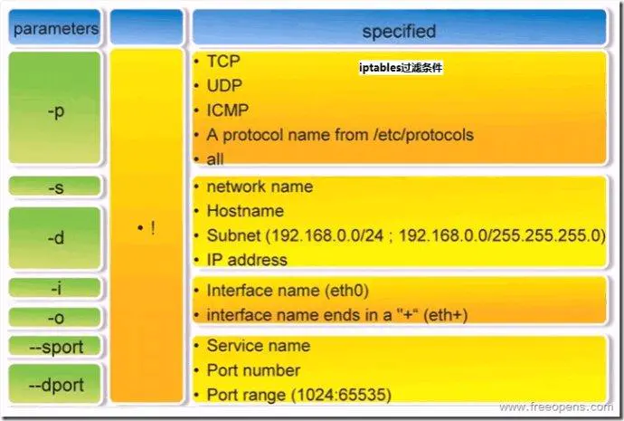

# 网络隔离

Kubernetes 的网络模型，以及主流网络方案的实现，都只关注容器之间网络的“连通”，却并不关心容器之间网络的“隔离”。这跟传统的 IaaS 层的网络方案，区别非常明显。

在 Kubernetes 里，网络隔离能力的定义，是依靠一种专门的 API 对象来描述的，即：NetworkPolicy。


## NetworkPolicy

一个完整的 NetworkPolicy 对象的示例，如下所示：

```
apiVersion: networking.k8s.io/v1
kind: NetworkPolicy
metadata:
  name: test-network-policy
  namespace: default
spec:
  podSelector:
    matchLabels:
      role: db
  policyTypes:
  - Ingress
  - Egress
  ingress:
  - from:
    - ipBlock:
        cidr: 172.17.0.0/16
        except:
        - 172.17.1.0/24
    - namespaceSelector:
        matchLabels:
          project: myproject
    - podSelector:
        matchLabels:
          role: frontend
    ports:
    - protocol: TCP
      port: 6379
  egress:
  - to:
    - ipBlock:
        cidr: 10.0.0.0/24
    ports:
    - protocol: TCP
      port: 5978
```


Kubernetes 里的 Pod 默认都是“允许所有”（Accept All）的，即：Pod 可以接收来自任何发送方的请求；或者，向任何接收方发送请求。而如果要对这个情况作出限制，就必须通过 NetworkPolicy 对象来指定。

如果Pod 被指定 NetworkPolicy，它就变成“拒绝所有” 的状态了，而 NetworkPolicy  相当于白名单，只有里面的指定的对象才可以跟这个Pod 通信。 `policyTypes `字段，定义了这个 NetworkPolicy 的类型是 `ingress `和 `egress`，即：它既会影响流入（ingress）请求，也会影响流出（egress）请求。


上面的 YAML 文件会根据`podSelector `字段选择作用的 Pod，即当前 Namespace 里携带了 `role=db` 标签的 Pod。

如果把这个字段留空，即`podSelector: {}`，那么这个 NetworkPolicy 就会作用于当前 Namespace 下的所有 Pod。


### 白名单规则

在 `ingress `字段里，定义了 `from `和 `ports`，即：允许流入的“白名单”和端口。其中，这个允许流入的“白名单”里，指定了三种并列的情况，分别是：`ipBlock`、`namespaceSelector `和 `podSelector`。

在 `egress `字段里，定义了 `to `和 `ports`，即：允许流出的“白名单”和端口。这里允许流出的“白名单”的定义方法与 ingress 类似。只不过， `ipblock `字段指定的，是目的地址的网段。

综上所述，这个 NetworkPolicy 对象，指定的隔离规则如下所示：

1. **作用对象**：该隔离规则只对 default Namespace 下的，携带了 `role=db` 标签的 Pod 有效。限制的请求类型包括 ingress（流入）和 egress（流出）。
2. **流入请求**：Kubernetes 会拒绝任何访问被隔离 Pod 的请求，除非这个请求来自于以下“白名单”里的对象，并且访问的是被隔离 Pod 的 6379 端口。这些“白名单”对象包括：
  3. default Namespace 里的，携带了 `role=fronted `标签的 Pod；
  2. 任何 Namespace 里的、携带了 `project=myproject` 标签的 Pod；
  3. 任何源地址属于 172.17.0.0/16 网段，且不属于 172.17.1.0/24 网段的请求。
3. **流出请求**：Kubernetes 会拒绝被隔离 Pod 对外发起任何请求，除非请求的目的地址属于 10.0.0.0/24网段，并且访问的是该网段地址的 5978 端口。


> **规则的AND 和 OR**
>
> ```
> ingress:
>  - from:
>    - namespaceSelector:
>        matchLabels:
>          user: alice
>    - podSelector:
>        matchLabels:
>          role: client
> ```
>
> 这里定义的`namespaceSelector` 和 `podSelector`，是或(OR)的关系。
>
> 而下面的这个规则，少了一个`-`，则变成了与(AND)的关系。
>
> ```
> ingress:
>  - from:
>    - namespaceSelector:
>        matchLabels:
>          user: alice
>      podSelector:
>        matchLabels:
>          role: client
> ```
>
> 


如果要使上面定义的 NetworkPolicy 在 Kubernetes 集群里真正产生作用， CNI 网络插件必须支持 Kubernetes 的 NetworkPolicy 。

在具体实现上，凡是支持 NetworkPolicy 的 CNI 网络插件，都维护着一个 NetworkPolicy Controller，通过控制循环的方式对 NetworkPolicy 对象的增删改查做出响应，然后在宿主机上完成 **iptables 规则的配置工作**。

在 Kubernetes 生态里，目前已经实现了 NetworkPolicy 的网络插件包括 Calico、Weave 和 kube-router 等多个项目，但是并不包括 Flannel 项目。如果想要在使用 Flannel 的同时还使用 NetworkPolicy 的话，就需要再额外安装一个网络插件，比如 Calico，来负责执行 NetworkPolicy。


### 安装calico

参考这个[文档](https://docs.projectcalico.org/getting-started/kubernetes/flannel/flannel)，在已经安装了Flannel 的情况下，可以额外安装calico 用来支持NetworkPolicy。

```
$ kubectl apply -f https://docs.projectcalico.org/manifests/canal.yaml
```


## 隔离原理

### iptables

iptables是Linux防火墙的管理工具，真正实现防火墙功能的是netfilter，它是Linux内核中实现包过滤的内部结构。即 iptabels 相当于 netfilter 的前端。netfilter 就是 Linux 内核里挡在“网卡”和“用户态进程”之间的一道“防火墙”。


IP 包“一进一出”的两条路径上，有几个关键的“检查点”，它们是 Netfilter 设置“防火墙”的地方。在 iptables 中，这些“检查点”被称为：链（Chain）。这是因为这些“检查点”对应的 iptables 规则，是按照定义顺序依次进行匹配的。


当一个 IP 包通过网卡进入主机之后，它就进入了 Netfilter 定义的流入路径（Input Path）里。在这个路径中，IP 包要经过路由表路由来决定下一步的去向。而在这次路由之前，Netfilter 设置了一个名叫 `PREROUTING `的“检查点”。在 Linux 内核的实现里，所谓**“检查点”实际上就是内核网络协议栈代码里的 Hook**（比如，在执行路由判断的代码之前，内核会先调用PREROUTING 的 Hook）。

在经过路由之后，IP 包的去向就分为了两种：

- 继续在本机处理，对应`INPUT`。这时候，IP 包将继续向上层协议栈流动。在它进入传输层之前，Netfilter 会设置一个名叫 INPUT 的“检查点”。到这里，IP 包流入路径（Input Path）结束。

  接下来，这个 IP 包通过传输层进入用户空间，交给用户进程处理。而处理完成后，用户进程会通过本机发出返回的 IP 包。这时候，这个 IP 包就进入了流出路径（Output Path）。

  此时，IP 包首先还是会经过主机的路由表进行路由。路由结束后，Netfilter 就会设置一个名叫`OUTPUT `的“检查点”。然后，在 OUTPUT 之后，再设置一个名叫 `POSTROUTING`“检查点”。

- 被转发到其他目的地，对应`FORWARD`。这个 IP 包不会进入传输层，而是会继续在网络层流动，从而进入到转发路径（Forward Path）。在转发路径中，Netfilter 会设置一个名叫 `FORWARD `的“检查点”。

  在 FORWARD“检查点”完成后，IP 包就会来到流出路径。而转发的 IP 包由于目的地已经确定，它就不会再经过路由，也自然不会经过 OUTPUT，而是会直接来到 `POSTROUTING`“检查点”。

在流出路径结束后，之所以 Netfilter 连着设置两个“检查点”，是因为`POSTROUTING`检查点处理来自Forward 和 Output 两个检查点的数据包，它是这两种情况下，最终汇聚在一起的“最终检查点”。


在有网桥参与的情况下，上述 Netfilter 设置“检查点”的流程，实际上也会出现在链路层（二层），并且会跟网络层（三层）的流程有交互。

这些链路层的“检查点”对应的操作界面叫作ebtables。准确地说，数据包在 Linux Netfilter 子系统里完整的流动过程如下：


图中绿色部分，就是**网络层**的 iptables 链的工作流程。

另外，你应该还能看到，每一个白色的“检查点”上，还有一个绿色的“标签”，比如：raw、nat、filter 等等。在 iptables 里，这些标签叫作：表。比如，同样是 OUTPUT 这个“检查点”，filter Output和 nat Output 在 iptables 里的语法和参数，就完全不一样，实现的功能也完全不同。

> iptables内置了4个表，即filter表、nat表、mangle表和raw表，分别用于实现包过滤，网络地址转换、包重构(修改)和数据跟踪处理。

所以说，iptables 表的作用，就是在某个具体的“检查点”（比如 Output）上，按顺序执行几个不同的检查动作（比如，先执行 nat，再执行 filter）。


#### 语法格式

```
iptables [-t 表名] 命令选项 ［链名］ ［条件匹配］ ［-j 目标动作或跳转］
```


**命令选项**：

- `-A` ：在指定链的**末尾**添加（append）一条新的规则
- `-D `： 删除（delete）指定链中的某一条规则，可以按规则序号和内容删除
- `-I`：  在指定链中插入（insert）一条新的规则，**默认在第一行添加**
- `-R  `：修改、替换（replace）指定链中的某一条规则，可以按规则序号和内容替换
- `-L`：列出（list）指定链中所有的规则进行查看
- `-E`： 重命名用户定义的链，不改变链本身
- `-F `： 清空（flush）
- `-N`： 新建（new-chain）一条用户自己定义的规则链
- `-X`：  删除指定表中用户自定义的规则链（delete-chain）
- `-P`：  设置指定链的默认策略（policy）
- `-Z`： 将所有表的所有链的字节和数据包计数器清零
- `-n`：  使用数字形式（numeric）显示输出结果


**处理数据包的四种方式**

- `ACCEPT `：允许数据包通过
- `DROP `：直接丢弃数据包，不给任何回应信息
- `REJECT `：拒绝数据包通过，必要时会给数据发送端一个响应的信息
- 在`/var/log/messages`文件中记录日志信息，然后将数据包传递给下一条规则


**匹配条件**



### 示例

通过下面这个简单的 NetworkPolicy 介绍隔离的实现：

```
apiVersion: extensions/v1beta1
kind: NetworkPolicy
metadata:
  name: test-network-policy
  namespace: default
spec:
  podSelector:
    matchLabels:
      role: db
  ingress:
  - from:
    - namespaceSelector:
        matchLabels:
          project: myproject
    - podSelector:
        matchLabels:
          role: frontend
    ports:
    - protocol: tcp
      port: 6379
```

被隔离的对象，是所有携带了 `role=db` 标签的 Pod。ingress“白名单”，是任何 Namespace 里，携带`project=myproject`  标签的 Pod；以及 default Namespace 里，携带了 `role=frontend` 标签的 Pod。允许被访问的端口是：6379。

这时，Kubernetes 的网络插件就会使用这个 NetworkPolicy 的定义，在宿主机上生成 **iptables 规则**：

```
for dstIP := range 所有被 networkpolicy.spec.podSelector 选中的 Pod 的 IP 地址
  for srcIP := range 所有被 ingress.from.podSelector 和 ingress.from.namespaceSelector 选中的 Pod 的 IP 
    for port, protocol := range ingress.ports {
      iptables -A KUBE-NWPLCY-CHAIN -s $srcIP -d $dstIP -p $protocol -m $protocol --dport $port -j ACCEPT 
    }
  }
} 
```

这是一条通过匹配条件决定下一步动作的 iptables 规则。在链 KUBE-NWPLCY-CHAIN 的末尾添加一条规则：当 IP 包的源地址是 srcIP、目的地址是dstIP、协议是 protocol、目的端口是 port 的时候，就允许它通过（ACCEPT）。匹配这条规则所需的这四个参数，都是从 NetworkPolicy 对象里读取出来的。

Kubernetes 网络插件对 Pod 进行隔离，其实是靠在宿主机上生成 NetworkPolicy 对应的 iptable 规则来实现的。此外，在设置好上述“隔离”规则之后，网络插件还需要想办法，**将所有对被隔离 Pod 的访问请求，都转发到上述 KUBE-NWPLCY-CHAIN 链上去进行匹配。**并且，如果匹配不通过，这个请求应该被“拒绝”。

在 CNI 网络插件中，上述需求可以通过设置两组 iptables 规则来实现。

- 第一组规则，负责“拦截”对被隔离 Pod 的访问请求：

  ```
  for pod := range 该 Node 上的所有 Pod {
    if pod 是 networkpolicy.spec.podSelector 选中的 {
      iptables -A FORWARD -d $podIP -m physdev --physdev-is-bridged -j KUBE-POD-SPECIFIC-FW-CHAIN
      iptables -A FORWARD -d $podIP -j KUBE-POD-SPECIFIC-FW-CHAIN
      ...
    }
  }
  ```

  这里的的 iptables 规则使用到了内置链：FORWARD。

  第一条 FORWARD 链“拦截”的是一种特殊情况：它对应的是**同一台宿主机上容器之间经过 CNI 网桥进行通信的流入数据包**，`--physdev-is-bridged` 的意思就是，这个FORWARD 链匹配的是，通过本机上的网桥设备，发往目的地址是 podIP 的 IP 包。

  > 如果是像 Calico 这样的非网桥模式的 CNI 插件，就不存在这个情况了。
  >
  > kube-router 是一个简化版的 Calico，它也使用 BGP 来维护路由信息，但是使用 CNI bridge 插件负责跟 Kubernetes 进行交互。

  第二条 FORWARD 链“拦截”的则是最普遍的情况，即：**容器跨主通信**。这时候，流入容器的数据包都是经过路由转发（FORWARD 检查点）来的。

  这些规则最后都跳转到了名叫 KUBE-POD-SPECIFIC-FW-CHAIN 的链上。它正是网络插件为 NetworkPolicy 设置的第二组规则。
  

- KUBE-POD-SPECIFIC-FW-CHAIN 的作用，就是做出“允许”或者“拒绝”的判断。这部分功能的实现，可以简单描述为下面这样的 iptables 规则：

  ```
  iptables -A KUBE-POD-SPECIFIC-FW-CHAIN -j KUBE-NWPLCY-CHAIN
  iptables -A KUBE-POD-SPECIFIC-FW-CHAIN -j REJECT --reject-with icmp-port-unreachable
  ```

  首先在第一条规则里，会把 IP 包转交给前面定义的 KUBE-NWPLCY-CHAIN 规则去进行匹配。如果匹配成功，那么 IP 包就会被“允许通过”。

  如果匹配失败，IP 包就会来到第二条规则上，它是一条 REJECT 规则。通过这条规则，不满足 NetworkPolicy 定义的请求就会被拒绝掉，从而实现了对该容器的“隔离”。


### 不接受输入流量的Pod

```
apiVersion: extensions/v1beta1
kind: NetworkPolicy
metadata:
  name: deny-all-policy
  namespace: my-namespace
spec:
  podSelector: {}
  policyTypes:
  - Ingress
```

这个Network Policy，使指定的 Namespace（比如 my-namespace）里的所有 Pod，都不能接收任何 Ingress 请求。一般用在Cronjob、Job等计算型Pod 中，因为它们不需要对外提供服务，通过拒绝所有流入流量，提高系统安全性。

