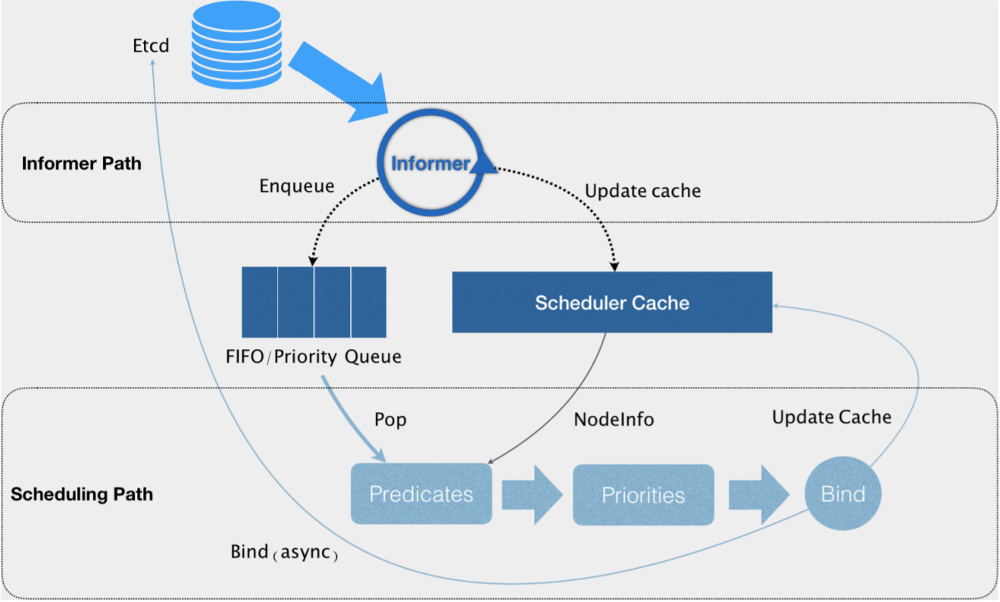
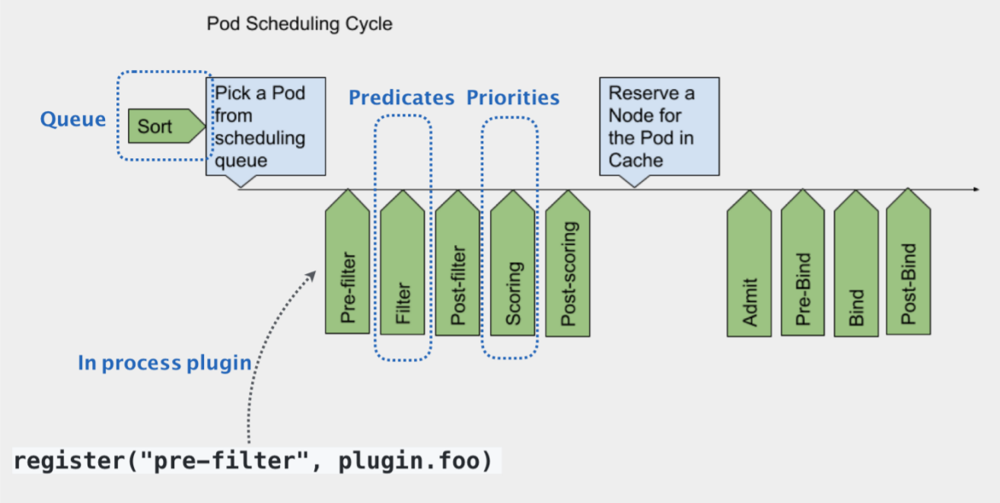
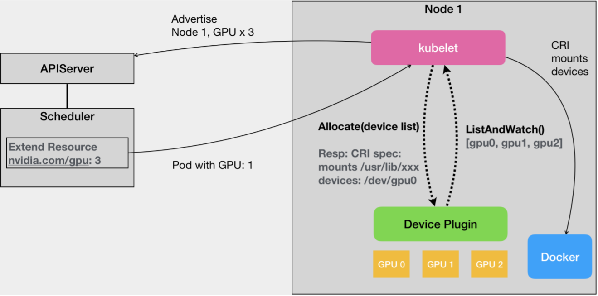

# 调度

## 资源模型 与 资源管理

在 Kubernetes 里，**Pod 是最小的原子调度单位**。这也就意味着，所有跟调度和资源管理相关的属性都应该是属于 Pod 对象的字段。而这其中最重要的部分，就是 Pod 的 CPU 和内存配置，如下所示：

```
apiVersion: v1
kind: Pod
metadata:
  name: frontend
spec:
  containers:
  - name: db
    image: mysql
    env:
    - name: MYSQL_ROOT_PASSWORD
      value: "password"
    resources:
      requests:
        memory: "64Mi"
        cpu: "250m"
      limits:
        memory: "128Mi"
        cpu: "500m"
    - name: wp
      image: wordpress
      resources:
        requests:
          memory: "64Mi"
          cpu: "250m"
        limits:
          memory: "128Mi"
          cpu: "500m"
```

在 Kubernetes 中，像 CPU 这样的资源被称作**可压缩资源**（compressible resources）。它的典型特点是，当可压缩资源不足时，Pod 只会“饥饿”，但不会退出。

像内存这样的资源，则被称作**不可压缩资源**（Incompressible resources）。当不可压缩资源不足时，Pod 就会因为 OOM（Out-Of-Memory）被内核杀掉。

由于 Pod 可以由多个 Container 组成，所以 CPU 和内存资源的限额，是要配置在每个Container 的定义上的。这样，Pod 整体的资源配置，就由这些 Container 的配置值累加得到。


### CPU 和 内存

Kubernetes 里为 CPU 设置的单位是“CPU 的个数”，比如，`cpu=1` 指的就是，这个Pod 的 CPU 限额是 1 个 CPU。Kubernetes 也允许将 CPU 限额设置为分数，比如 500m，指的就是 500 millicpu，也就是 0.5 个 CPU 的意思。这样，这个 Pod就会被分配到 1 个 CPU 一半的计算能力。500m 的这种写法才是 Kubernetes 内部通用的 CPU 表示方式。

> 具体“1 个 CPU”在宿主机上如何解释，是 1 个 CPU核心，还是 1 个 vCPU，还是 1 个 CPU 的超线程（Hyperthread），完全取决于宿主机的CPU 实现方式。Kubernetes 只负责保证 Pod 能够使用到“1 个 CPU”的计算能力。


对于内存资源来说，它的单位自然就是 bytes。Kubernetes 支持使用 Ei、Pi、Ti、Gi、Mi、Ki（或者 E、P、T、G、M、K）的方式来作为 bytes 的值。

> $1Mi=1024*1024$ VS $1M=1000*1000$


### limits 和 requests

Kubernetes 里 Pod 的 CPU 和内存资源，实际上还要分为 `limits `和 `requests `两种情况：

```
spec.containers[].resources.limits.cpu
spec.containers[].resources.limits.memory
spec.containers[].resources.requests.cpu
spec.containers[].resources.requests.memory
```

**在调度的时候，kube-scheduler 只会按照 `requests `的值进行计算。而在真正设置 Cgroups 限制的时候，kubelet 则会按照 `limits `的值来进行设置。**

例如，指定了 `requests.cpu=250m` 之后，相当于将 Cgroups 的 `cpu.shares `的值设置为$ (250/1000)*1024$。而如果没有设置 `requests.cpu` ，`cpu.shares` 默认则是1024。这样，Kubernetes 就通过 `cpu.shares` 完成了对 CPU 时间的按比例分配。

指定了 `limits.cpu=500m` 之后，则相当于将 Cgroups 的 `cpu.cfs_quota_us` 的值设置为$ (500/1000)*100ms$，而 `cpu.cfs_period_us` 的值始终是 100ms。这样，Kubernetes 就设置了这个容器只能用到 CPU 的 50%。

对于内存来说，指定了 `limits.memory=128Mi` 之后，相当于将 Cgroups 的 `memory.limit_in_bytes` 设置为 $128 * 1024 * 1024$。但是在调度的时候，调度器只会使用 `requests.memory=64Mi` 来进行判断。


Kubernetes 这种对 CPU 和内存资源限额的设计，实际上参考了 Borg 论文中对“**动态资源边界**”的定义，既：容器化作业在提交时所设置的资源边界，并不一定是调度系统所必须严格遵守的，这是因为在实际场景中，大多数作业使用到的资源其实远小于它所请求的资源限额。

基于这种假设，Borg 在作业被提交后，会主动减小它的资源限额配置，以便容纳更多的作业、提升资源利用率。而当作业资源使用量增加到一定阈值时，Borg 会通过“快速恢复”过程，还原作业原始的资源限额，防止出现异常情况。

Kubernetes 的 requests+limits 的做法，其实就是上述思路的一个简化版：用户在提交Pod 时，可以声明一个相对较小的 requests 值供调度器使用，而 Kubernetes 真正设置给容器Cgroups 的，则是相对较大的 limits 值。


### QoS

在Kubernetes 中，不同的 `requests `和 `limits `的设置方式，会将这个 Pod 划分到不同的QoS 级别当中。

- **Guaranteed**：Pod 里的每一个 Container 都同时设置 requests 和 limits，并且 requests 和 limits值相等。

   Pod 仅设置 limits 没有设置 requests 的时候，Kubernetes 会自动为它设置与 limits 相同的 requests 值，所以，这也属于 Guaranteed 情况。

  > 实践中最好将 DaemonSet 的 Pod 都设置为Guaranteed 的 QoS 类型。否则，一旦 DaemonSet 的 Pod 被回收，它又会立即在原宿主机上被重建出来，这就使得前面资源回收的动作，完全没有意义了。

- **Burstable**：Pod 不满足 Guaranteed 的条件，但至少有一个 Container 设置了 requests。

- **BestEffort**：既没有设置 requests，也没有设置 limits。

QoS 划分的主要应用场景，是**当宿主机资源紧张的时候，kubelet 对 Pod 进行Eviction（即资源回收）时**需要用到的。


#### Eviction

当 Kubernetes 所管理的宿主机上**不可压缩资源**短缺时，就有可能触发 Eviction。比如，可用内存（`memory.available`）、可用的宿主机磁盘空间（`nodefs.available`），以及容器运行时镜像存储空间（`imagefs.available`）等等。目前，Kubernetes 设置的 Eviction 的默认阈值如下所示：

```
memory.available<100Mi
nodefs.available<10%
nodefs.inodesFree<5%
imagefs.available<15%
```

上述各个触发条件在 kubelet 里都是可配置的：

```
kubelet \
--eviction-hard=imagefs.available<10%,memory.available<500Mi,nodefs.available<5%,nodefs.inodesFree<5%\ 
--eviction-soft=imagefs.available<30%,nodefs.available<10% \
--eviction-soft-grace period=imagefs.available=2m,nodefs.available=2m \
--eviction-max-pod-grace-period=600
```

**Eviction 在 Kubernetes 里分为 Soft 和 Hard 两种模式。**

- Hard Eviction 模式下，Eviction 过程就会在阈值达到之后立刻开始。
- Soft Eviction 允许为 Eviction 过程设置一段“优雅时间”，比如上面的`imagefs.available=2m`，就意味着当 imagefs 不足的阈值达到 2 分钟之后，kubelet 才会开始Eviction 的过程。

> Kubernetes 计算 Eviction 阈值的数据来源，主要依赖于从 Cgroups 读取到的值，以及使用 cAdvisor 监控到的数据。


当宿主机的 Eviction 阈值达到后，就会进入 MemoryPressure 或者 DiskPressure 状态，（利用Taint）从而避免新的 Pod 被调度到这台宿主机上。而当 Eviction 发生的时候，kubelet 具体会挑选哪些 Pod 进行删除操作，就需要参考这些 Pod的 QoS 类别了。

- 首当其冲的，自然是 BestEffort 类别的 Pod。
- 其次，是Burstable 类别、并且发生“饥饿”的资源使用量已经超出了 requests 的Pod。
- 最后，才是 Guaranteed 类别。并且，Kubernetes 会保证只有当 Guaranteed 类别的 Pod的资源使用量超过了其 limits 的限制，或者宿主机本身正处于 Memory Pressure 状态时，Guaranteed 的 Pod 才可能被选中进行 Eviction 操作。

对于同 QoS 类别的 Pod 来说，Kubernetes 还会根据 Pod 的优先级来进行进一步地排序和选择。

> 在 Kubernetes 里，有一种叫作 **Taint Nodes by Condition** 的机制，即当 Node 本身进入异常状态的时候，比如 Condition 变成了 DiskPressure。那么， Kubernetes会通过 Controller 自动给 Node 加上对应的 Taint，从而阻止新的 Pod 调度到这台宿主机上。


#### cpuset

在使用容器的时候，可以通过设置 cpuset **把容器绑定到某个 CPU 的核上**，而不是像 cpushare 那样共享 CPU 的计算能力。这种情况下，由于操作系统在 CPU 之间进行上下文切换的次数大大减少，容器里应用的性能会得到大幅提升。事实上，cpuset 方式，是生产环境里部署在线应用类型的 Pod 时，非常常用的一种方式。

在 Kubernetes 里实现cpuset，首先， Pod 必须是 Guaranteed 的 QoS 类型；然后，只需要将 Pod 的 CPU 资源的 `requests `和 `limits `设置为同一个相等的整数值即可。

```
spec:
  containers:
  - name: nginx
    image: nginx
    resources:
      limits:
        memory: "200Mi"
        cpu: "2"
      requests:
        memory: "200Mi"
        cpu: "2"
```

这时候，该 Pod 就会被绑定在 2 个独占的 CPU 核上，具体是哪两个 CPU 核，是由 kubelet 分配的。


## 默认调度器

在 Kubernetes 中，默认调度器的主要职责，就是**为一个新创建出来的 Pod，寻找一个最合适的节点（Node）**。这里“最合适”的含义，包括两层：
1. 从集群所有的节点中，根据调度算法挑选出**所有可以运行该 Pod 的节点**；
2. 从第一步的结果中，再根据调度算法挑选**一个最符合条件的节点**作为最终结果。

所以在具体的调度流程中，默认调度器会首先调用一组叫作 Predicate 的调度算法，来检查每个Node。然后，再调用一组叫作 Priority 的调度算法，来给上一步得到的结果里的每个 Node 打分。最终的调度结果，就是得分最高的那个 Node。

> 调度器对一个 Pod 调度成功，实际上就是将它的` spec.nodeName `字段填上调度结果的节点名字。


### 工作原理



Kubernetes 调度器的核心，实际上就是两个相互独立的控制循环。

- 第一个控制循环，称之为 **Informer Path**。它的主要目的，是启动一系列 Informer，用来监听（Watch）Etcd 中 Pod、Node、Service 等与调度相关的 API 对象的变化。

  比如，当一个待调度 Pod（即：它的 `nodeName `字段是空的）被创建出来之后，调度器就会通过 Pod Informer 的 Handler，将这个待调度 Pod 添加进调度队列。

  在默认情况下，Kubernetes 的调度队列是一个 PriorityQueue（优先级队列），并且当某些集群信息发生变化的时候，调度器还会对调度队列里的内容进行一些特殊操作。这里的设计，主要是出于**调度优先级和抢占**的考虑。

  此外，Kubernetes 的默认调度器还要负责对调度器缓存（即：scheduler cache）进行更新。事实上，Kubernetes 调度部分进行性能优化的一个最根本原则，就是**尽最大可能将集群信息 Cache 化，以便从根本上提高 Predicate 和 Priority 调度算法的执行效率。**

- 第二个控制循环，是调度器负责 Pod 调度的主循环，称之为 **Scheduling Path**。它的主要逻辑，就是不断地从调度队列里出队一个 Pod。然后，调用Predicates 算法进行“过滤”。这一步“过滤”得到的一组 Node，就是所有可以运行这个
Pod 的宿主机列表。当然，Predicates 算法需要的 Node 信息，都是从 Scheduler Cache 里直接拿到的，这是调度器保证算法执行效率的主要手段之一。

接下来，调度器就会再调用 Priorities 算法为上述列表里的 Node 打分，分数从 0 到 10。得分最高的 Node，就会作为这次调度的结果。

调度算法执行完成后，调度器就需要将 Pod 对象的 `nodeName `字段的值，修改为上述 Node的名字。这个步骤在 Kubernetes 里面被称作 **Bind**。但是，为了不在关键调度路径里远程访问 APIServer，Kubernetes 的默认调度器在 Bind 阶段，只会更新 Scheduler Cache 里的 Pod 和 Node 的信息。这种基于“乐观”假设的 API 对象更新方式，在 Kubernetes 里被称作 **Assume**。

Assume 之后，调度器才会创建一个 Goroutine 来异步地向 APIServer 发起更新 Pod 的请求，来真正完成 Bind 操作。如果这次异步的 Bind 过程失败了，其实也没有太大关系，等Scheduler Cache 同步之后一切就会恢复正常。


正是由于上述 Kubernetes 调度器的“乐观”绑定的设计，当一个新的 Pod 完成调度需要在某个节点上运行起来之前，该节点上的 kubelet 还会通过一个叫作 **Admit** 的操作来再次验证该 Pod 是否确实能够运行在该节点上。这一步 Admit 操作，实际上就是把一组叫作GeneralPredicates 的、最基本的调度算法，比如：“资源是否可用”“端口是否冲突”等再执行一遍，作为 kubelet 端的二次确认。


**除了“Cache 化”和“乐观绑定”，Kubernetes 默认调度器还有一个重要的设计，那就是“无锁化”。**

在 Scheduling Path 上，调度器会启动多个 Goroutine **以节点为粒度**并发执行 Predicates 算法，从而提高这一阶段的执行效率。而与之类似的，Priorities 算法也会以 MapReduce 的方式并行计算然后再进行汇总。而在这些所有需要并发的路径上，调度器会避免设置任何全局的竞争资源，从而免去了使用锁进行同步带来的巨大的性能损耗。

在这种思想的指导下，Kubernetes 调度器只有对调度队列和 Scheduler Cache 进行操作时，才需要加锁。而这两部分操作，都不在 Scheduling Path 的算法执行路径上。


#### 可扩展性设计



默认调度器的可扩展机制，在 Kubernetes 里面叫作 Scheduler Framework。这个设计的主要目的，就是在调度器生命周期的各个关键点上，为用户暴露出可以进行扩展和实现的接口，从而实现由用户自定义调度器的能力。

示意图中每一个绿色的箭头都是一个可以插入自定义逻辑的接口。比如，上面的 Queue 部分，就意味着可以在这一部分提供一个自己的调度队列的实现，从而控制每个 Pod 开始被调度（出队）的时机。

而 Predicates 部分，则意味着可以提供自己的过滤算法实现，根据自己的需求，来决定选择哪些机器。

> 上述这些可插拔式逻辑，都是标准的 Go 语言插件机制（Go plugin 机制），需要在编译的时候选择把哪些插件编译进去。


#### Mesos 

Kubernetes 默认调度器与 Mesos 的“两级”调度器，有什么异同呢？

Mesos 的两级调度器的设计，是 Mesos 自己充当 0 层调度器（Layer 0），负责统一管理整个集群的**资源情况**，把可用资源以 Resource Offer 的方式暴露出去；而上层的大数据框架（比如 Spark）则充当 1 层调度器（Layer 1），它会负责根据 Layer 0 发来的 Resource Offer 来决定**把任务调度到某个具体的节点上**。这样做的好处是：

- 上层大数据框架本身往往自己已经实现了调度逻辑，这样它就可以很方便地接入到Mesos 里面；
- 这样的设计，使得 Mesos 本身能够统一地对上层所有框架进行资源分配，资源利用率和调度效率就可以得到很好的保证了。

相比之下，Kubernetes 的默认调度器实际上无论从功能还是性能上都要简单得多。这也是为什么把 Spark 这样本身就具有调度能力的框架接入到 Kubernetes 里还是比较困难的。


### 调度策略

#### Predicates

Predicates 在调度过程中的作用，可以理解为 Filter，即：**它按照调度策略，从当前集群的所有节点中，“过滤”出一系列符合条件的节点。**这些节点，都是可以运行待调度 Pod 的宿主机。在 Kubernetes 中，默认的调度策略有如下几种。

- **GeneralPredicates**。这一组过滤规则，负责的是最基础的调度策略。

  PodFitsResources 计算的是宿主机的 CPU 和内存资源等是否够用，它检查的只是 Pod 的 `requests `字段。不过，Kubernetes 的调度器并没有为 GPU 等硬件资源定义具体的资源类型，而是统一用一种名叫 Extended Resource 的、Key-Value 格式的扩展字段来描述的。

  PodFitsHost 检查的是，宿主机的名字是否跟 Pod 的 `spec.nodeName` 一致。

  PodFitsHostPorts 检查的是，Pod 申请的宿主机端口（`spec.nodePort`）是不是跟已经被使用的端口有冲突。

  PodMatchNodeSelector 检查的是，Pod 的 `nodeSelector `或者 `nodeAffinity `指定的节点，是否与待考察节点匹配，等等。

  上面这样一组 GeneralPredicates，正是 Kubernetes 考察一个 Pod 能不能运行在一个 Node 上**最基本的过滤条件**。所以，GeneralPredicates 也会被其他组件（比如 kubelet）直接调用。

  > kubelet 在启动 Pod 前，会执行一个 Admit 操作来进行二次确认。这里二次确认的规则，就是执行一遍 GeneralPredicates。

  

- **与 Volume 相关的过滤规则**，负责跟容器持久化 Volume 相关的调度策略。

  NoDiskConflict 检查的条件，是多个 Pod 声明挂载的持久化 Volume 是否有冲突。比如，AWS EBS 类型的 Volume，是不允许被两个 Pod 同时使用的。所以，当一个名叫 A 的EBS Volume 已经被挂载在了某个节点上时，另一个同样声明使用这个 A Volume 的 Pod，就不能被调度到这个节点上了。

  MaxPDVolumeCountPredicate 检查的条件，则是一个节点上某种类型的持久化 Volume是不是已经超过了一定数目，如果是的话，那么声明使用该类型持久化 Volume 的 Pod 就不能再调度到这个节点了。

  VolumeZonePredicate，检查持久化 Volume 的 Zone（高可用域）标签，是否与待考察节点的 Zone 标签相匹配。

  VolumeBindingPredicate ，检查的是该 Pod 对应的PV 的 `nodeAffinity `字段，是否跟某个节点的标签相匹配。

  对于 Local Persistent Volume，必须使用 `nodeAffinity `来跟某个具体的节点绑定。这也就意味着，在 Predicates 阶段，Kubernetes 就必须能够根据 Pod 的 Volume 属性来进行调度。此外，如果该 Pod 的 PVC 还没有跟具体的 PV 绑定的话，调度器还要负责检查所有待绑定 PV，当有可用的 PV 存在并且该 PV 的 `nodeAffinity `与待考察节点一致时，这条规则才会返回“成功”。比如下面这个例子：

  ```
  apiVersion: v1
  kind: PersistentVolume
  metadata:
    name: example-local-pv
  spec:
    capacity:
      storage: 500Gi
    accessModes:
    - ReadWriteOnce
    persistentVolumeReclaimPolicy: Retain
    storageClassName: local-storage
    local:
      path: /mnt/disks/vol1
    nodeAffinity:
      required:
        nodeSelectorTerms:
        - matchExpressions:
          - key: kubernetes.io/hostname
            operator: In
            values:
            - my-node
  ```

  这个 PV 对应的持久化目录，只会出现在名叫 my-node 的宿主机上。所以，任何一个通过 PVC 使用这个 PV 的 Pod，都必须被调度到 my-node 上才可以正常工作。VolumeBindingPredicate，正是调度器里完成这个决策的位置。

- **宿主机相关的过滤规则**，主要考察待调度 Pod 是否满足 Node 本身的某些条件。

  PodToleratesNodeTaints，负责检查的就是 Node 的“污点”机制。只有当 Pod 的 `Toleration `字段与 Node 的 `Taint `字段能够匹配的时候，这个 Pod 才能被调度到该节点上。

  NodeMemoryPressurePredicate，检查的是当前节点的内存是不是已经不够充足，如果是的话，那么待调度 Pod 就不能被调度到该节点上。

-  **Pod 相关的过滤规则**。这一组规则，跟 GeneralPredicates 大多数是重合的。比较特殊的，是PodAffinityPredicate。这个规则的作用，是检查待调度 Pod 与 Node 上的已有 Pod 之间的亲密（affinity）和反亲密（anti-affinity）关系。比如下面这个例子：

  ```
  apiVersion: v1
  kind: Pod
  metadata:
    name: with-pod-antiaffinity
  spec:
    affinity:
      podAntiAffinity:
        requiredDuringSchedulingIgnoredDuringExecution:
        - weight: 100
          podAffinityTerm:
            labelSelector:
              matchExpressions:
              - key: security
                operator: In
                values:
                - S2
            topologyKey: kubernetes.io/hostname
    containers:
    - name: with-pod-affinity
      image: docker.io/ocpqe/hello-pod
  ```

  这个例子里的 podAntiAffinity 规则，就指定了这个 Pod 不希望跟任何携带了` security=S2` 标签的 Pod 存在于同一个 Node 上。需要注意的是，**PodAffinityPredicate 是有作用域的**，比如上面这条规则，就仅对携带了 Key 是`kubernetes.io/hostname`标签的 Node 有效。这正是`topologyKey `这个关键词的作用。

  而与 podAntiAffinity 相反的，就是 podAffinity：

  ```
  apiVersion: v1
  kind: Pod
  metadata:
    name: with-pod-affinity
  spec:
    affinity:
      podAffinity:
        requiredDuringSchedulingIgnoredDuringExecution:
        - labelSelector:
            matchExpressions:
            - key: security
              operator: In
              values:
              - S1
          topologyKey: failure-domain.beta.kubernetes.io/zone
    containers:
    - name: with-pod-affinity
      image: docker.io/ocpqe/hello-pod
  ```

  这个例子里的 Pod，就只会被调度到已经有携带了 `security=S1` 标签的 Pod 运行的 Node上。这条规则的作用域，则是所有携带 Key 是`failuredomain.beta.kubernetes.io/zone`标签的 Node。

  上面这两个例子里的 `requiredDuringSchedulingIgnoredDuringExecution `字段的含义是：这条规则必须在 Pod 调度时进行检查；但是如果是已经在运行的 Pod 发生变化，比如 Label 被修改，造成了该 Pod 不再适合运行在这个 Node 上的时候，Kubernetes 不会进行主动修正。


上面这四种类型的 Predicates，就构成了调度器确定一个 Node 可以运行待调度 Pod 的基本策略。在具体执行的时候， 当开始调度一个 Pod 时，Kubernetes 调度器会同时启动 16 个 Goroutine，来并发地为集群里的所有 Node 计算 Predicates，最后返回可以运行这个 Pod的宿主机列表。

在为每个 Node 执行 Predicates 时，调度器会按照固定的顺序来进行检查。这个顺序，是按照 Predicates 本身的含义来确定的。比如，宿主机相关的 Predicates 会被放在相对靠前的位置进行检查。不然，在一台资源已经严重不足的宿主机上，上来就开始计算 PodAffinityPredicate，是没有实际意义的。


#### Priorities

在 Predicates 阶段完成了节点的“过滤”之后，Priorities 阶段的工作就是为这些节点打分。这里打分的范围是 0-10 分，得分最高的节点就是最后被 Pod 绑定的最佳节点。

Priorities 里最常用到的一个打分规则，是 **LeastRequestedPriority**。它的计算方法可以简单地总结为如下所示的公式：

$$score = (cpu((capacity-sum(requested))10/capacity) + memory((capacity-sum(requested))10/capacity))/2$$

这个算法实际上就是在选择空闲资源（CPU 和 Memory）最多的宿主机。


与 LeastRequestedPriority 一起发挥作用的，还有 **BalancedResourceAllocation**：

$$score = 10 - variance(cpuFraction,memoryFraction,volumeFraction)*10$$

每种资源的 Fraction 的定义是 ：Pod 请求的资源 / 节点上的可用资源。而 variance 算法的作用，则是计算每两种资源 Fraction 之间的“距离”。而最后选择的，则是资源 Fraction差距最小的节点。BalancedResourceAllocation 选择的，是**调度完成后，所有节点里各种资源分配最均衡的那个节点**，从而避免一个节点上 CPU 被大量分配、而 Memory 大量剩余的情况。

此外，还有 NodeAffinityPriority、TaintTolerationPriority 和 InterPodAffinityPriority 这三种 Priority。它们与PodMatchNodeSelector、PodToleratesNodeTaints和 PodAffinityPredicate 这三个 Predicate 的含义和计算方法是类似的。但是作为 Priority，一个 Node 满足上述规则的字段数目越多，它的得分就会越高。

在默认 Priorities 里，还有一个叫作 ImageLocalityPriority 的策略。它是在 Kubernetes v1.12里新开启的调度规则，即：如果待调度 Pod 需要使用的镜像很大，并且已经存在于某些 Node上，那么这些 Node 的得分就会比较高。当然，为了避免这个算法引发调度堆叠，调度器在计算得分的时候还会根据镜像的分布进行优化，即：如果大镜像分布的节点数目很少，那么这些节点的权重就会被调低，从而“对冲”掉引起调度堆叠的风险。


Kubernetes 调度器里其实还有一些默认不会开启的策略，可以通过为 kube-scheduler 指定一个配置文件或者创建一个 ConfigMap ，来配置哪些规则需要开启、哪些规则需要关闭。并且，还可以通过为 Priorities 设置权重，来控制调度器的调度行为。


#### 均匀调度

如何能够让 Kubernetes 的调度器尽可能地将 Pod 分布在不同机器上，避免“堆叠”？

1. 为 Pod 设置`PreferredDuringSchedulingIgnoredDuringExecution`，可以指定 不想和同一个label的pod 放在一起。调度器随后会根据node上不满足 podAntiAffinity 的pod 数量打分，如果不想一起的pod数量越多分数越少。就能够尽量打散同一个service下多个副本pod的分布。
   可以参考[官方文档](https://k8smeetup.github.io/docs/concepts/configuration/assign-pod-node/)。
2. `SelectorSpreadPriority`，kubernetes内置的一个priority策略。具体：与services 上其他pod 尽量不在同一个节点上，节点上同一个Service里pod数量越少得分越高。
3. 自定义策略，实现自己的负载均衡算法（一次性哈希等）。  


### 优先级和抢占机制

优先级和抢占机制，解决的是 **Pod 调度失败时该怎么办的问题**。

正常情况下，当一个 Pod 调度失败后，它就会被暂时“搁置”起来，直到 Pod 被更新，或者集群状态发生变化，调度器才会对这个 Pod 进行重新调度。

但对于高优先级的 Pod来说，在调度失败后，该 Pod 并不会被“搁置”，而是会“挤走”某个 Node 上的一些低优先级的 Pod。这样就可以保证这个高优先级 Pod 的调度成功。这个特性，其实也是一直以来就存在于 Borg 以及 Mesos 等项目里的一个基本功能。


#### PriorityClass

在 Kubernetes 里，要使用这个机制，首先需要在 Kubernetes 里提交一个 PriorityClass 的定义：

```
apiVersion: scheduling.k8s.io/v1beta1
kind: PriorityClass
metadata:
  name: high-priority
value: 1000000
globalDefault: false
description: "This priority class should be used for high priority service pods only."
```

这个 YAML 文件，定义了一个名叫 high-priority 的 PriorityClass，`value `为 1000000 （一百万）。

Kubernetes 规定，优先级是一个 32 bit 的整数，最大值不超过 1000000000（10 亿，1billion），并且**值越大代表优先级越高**。而超出 10 亿的值，其实是被 Kubernetes 保留下来分配给系统 Pod 使用的，这样做的目的，就是保证系统 Pod 不会被用户抢占掉。

如果上述 YAML 文件里的 `globalDefault `被设置为 true 的话，那就意味着这个 PriorityClass 的值会成为系统的默认值。而如果这个值是 false，就表示只希望声明使用该 PriorityClass 的 Pod 拥有值为 1000000 的优先级，而对于没有声明 PriorityClass 的 Pod 来说，它们的优先级就是 0。


在创建了 PriorityClass 对象之后，Pod 就可以通过`priorityClassName`声明使用它了：

```
apiVersion: v1
kind: Pod
metadata:
  name: nginx
  labels:
    env: test
spec:
  containers:
  - name: nginx
    image: nginx
    imagePullPolicy: IfNotPresent
  priorityClassName: high-priority
```

当这个 Pod 被提交给 Kubernetes 之后，Kubernetes 的 PriorityAdmissionController 就会自动将这个 Pod 的` spec.priority `字段设置为 1000000。


#### 调度队列

调度器里维护着一个调度队列。所以，当 Pod 拥有了优先级之后，**高优先级的 Pod 就可能会比低优先级的 Pod 提前出队，从而尽早完成调度过程。**这个过程，就是“优先级”这个概念在 Kubernetes 里的主要体现。

当一个高优先级的 Pod 调度失败的时候，调度器的抢占能力就会被触发。这时，调度器就会试图从当前集群里寻找一个节点，使得当这个节点上的一个或者多个低优先级 Pod 被删除后，待调度的高优先级 Pod 就可以被调度到这个节点上。这个过程，就是“抢占”这个概念在Kubernetes 里的主要体现。

> 将待调度的高优先级 Pod 称为“抢占者”（Preemptor），被抢占的 Pod 为“牺牲者”（victims）。
> 

当抢占过程发生时，抢占者并不会立刻被调度到被抢占的 Node 上。事实上，调度器只会将抢占者的 `spec.nominatedNodeName` 字段，设置为被抢占的 Node 的名字。然后，抢占者会重新进入下一个调度周期，然后在新的调度周期里来决定是不是要运行在被抢占的节点上。这也意味着，即使在下一个调度周期，调度器也不会保证抢占者一定会运行在被抢占的节点上。

这样设计的一个重要原因是，调度器只会通过标准的 DELETE API 来删除被抢占的 Pod，所以，这些 Pod 必然是有一定的“优雅退出”时间（默认是 30s）的。而在这段时间里，其他的节点也是有可能变成可调度的，或者直接有新的节点被添加到这个集群中来。所以，鉴于优雅退出期间，集群的可调度性可能会发生的变化，把抢占者交给下一个调度周期再处理，是一个非常合理的选择。

而在抢占者等待被调度的过程中，如果有其他更高优先级的 Pod 也要抢占同一个节点，那么调度器就会清空原抢占者的 `spec.nominatedNodeName` 字段，从而允许更高优先级的抢占者执行抢占，并且，这也就使得原抢占者本身，也有机会去重新抢占其他节点。这些，都是设置`nominatedNodeName `字段的主要目的。


抢占发生的原因，一定是一个高优先级的 Pod 调度失败。而 Kubernetes 调度器实现抢占算法的一个最重要的设计，就是在调度队列的实现里，使用了两个不同的队列。

-  **activeQ**：凡是在这个队列里的 Pod，都是下一个调度周期需要调度的对象。所以，在 Kubernetes 集群里新创建一个 Pod 的时候，调度器会将这个 Pod 入队到activeQ 里面。调度器不断从队列里出队（Pop）一个 Pod 进行调度，实际上都是从 activeQ 里出队的。
- **unschedulableQ**：存放调度失败的 Pod。当一个 unschedulableQ 里的 Pod 被更新之后，调度器会自动把这个 Pod 移动到 activeQ 里，从而给这些调度失败的 Pod “重新做人”的机会。


在抢占者调度失败之后，抢占者就会被放进 unschedulableQ 里面。然后，这次失败事件就会触发调度器为抢占者寻找牺牲者的流程。

- 第一步，调度器会检查这次失败事件的原因，来确认抢占是不是可以帮助抢占者找到一个新节点。这是因为有很多 Predicates 的失败是不能通过抢占来解决的。比如，PodFitsHost 算法（负责的是，检查 Pod 的 `nodeSelector `与 Node 的名字是否匹配），这种情况下，除非Node 的名字发生变化，否则你即使删除再多的 Pod，抢占者也不可能调度成功。

- 第二步，如果确定抢占可以发生，那么调度器就会把自己缓存的所有节点信息复制一份，然后使用这个副本来模拟抢占过程。

  调度器会检查缓存副本里的每一个节点，然后从该节点上最低优先级的 Pod 开始，逐一“删除”这些 Pod。而每删除一个低优先级 Pod，调度器都会检查一下抢占者是否能够运行在该 Node 上。一旦可以运行，调度器就记录下这个 Node 的名字和被删除 Pod 的列表，这就是一次抢占过程的结果了。

  当遍历完所有的节点之后，调度器会在上述模拟产生的所有抢占结果里做一个选择，找出最佳结果。而这一步的判断原则，就是尽量减少抢占对整个系统的影响。比如，需要抢占的 Pod 越少越好，需要抢占的 Pod 的优先级越低越好，等等。

- 在得到了最佳的抢占结果之后，这个结果里的 Node，就是即将被抢占的 Node；被删除的Pod 列表，就是牺牲者。所以接下来，调度器就可以真正开始抢占的操作了，这个过程，可以分为三步：

  - 第一步，调度器会检查牺牲者列表，清理这些 Pod 所携带的 `nominatedNodeName `字段。
  - 第二步，调度器会把抢占者的 `nominatedNodeName`，设置为被抢占的 Node 的名字，让抢占者在下一个调度周期重新进入调度流程。
  - 第三步，调度器会开启一个 Goroutine，异步地删除牺牲者。

接下来，调度器就会通过正常的调度流程把抢占者调度成功。这也是为什么，调度器并不保证抢占的结果：在这个正常的调度流程里，是一切皆有可能的。

不过，对于任意一个待调度 Pod 来说，因为有上述抢占者的存在，它的调度过程，其实是有一些特殊情况需要特殊处理的。具体来说，在为某一对 Pod 和 Node 执行 Predicates 算法的时候，如果待检查的 Node 是一个即将被抢占的节点，即：调度队列里有 `nominatedNodeName `字段值是该 Node 名字的Pod 存在（可以称之为：“潜在的抢占者”）。那么，调度器就会对这个 Node ，将同样的Predicates 算法运行两遍。

- 第一遍， 调度器会假设上述“潜在的抢占者”已经运行在这个节点上，然后执行 Predicates 算法。
- 第二遍， 调度器会正常执行 Predicates 算法，即：不考虑任何“潜在的抢占者”。

只有这两遍 Predicates 算法都能通过时，这个 Pod 和 Node 才会被认为是可以绑定（bind）的。这里需要执行第一遍 Predicates 算法的原因，是由于 `InterPodAntiAffinity `规则的存在。由于 `InterPodAntiAffinity `规则关心待考察节点上所有 Pod 之间的互斥关系，所以在执行调度算法时必须考虑，如果抢占者已经存在于待考察 Node 上时，待调度 Pod 还能不能调度成功。

当然，这也就意味着，在这一步只需要考虑那些优先级等于或者大于待调度 Pod 的抢占者。毕竟对于其他较低优先级 Pod 来说，待调度 Pod 总是可以通过抢占运行在待考察 Node上。

而需要执行第二遍 Predicates 算法的原因，则是因为“潜在的抢占者”最后不一定会运行在待考察的 Node 上。


当整个集群发生可能会影响调度结果的变化（比如，添加或者更新 Node，添加和更新 PV、Service 等）时，调度器会执行一个被称为 `MoveAllToActiveQueue `的操作，把所调度失败的Pod 从 unscheduelableQ 移动到 activeQ 里面。请问这是为什么？

一个相似的问题是，当一个已经调度成功的 Pod 被更新时，调度器则会将 unschedulableQ 里所有跟这个 Pod 有 Affinity/Anti-affinity 关系的 Pod，移动到 activeQ 里面。请问这又是为什么呢？


在正常情况下，默认调度器在调度失败后，就会把该 Pod 放到 unschedulableQ 里。unschedulableQ 里的 Pod 是不会出现在下个调度周期里的。但是，当集群本身发生变化时，这个 Pod 就有可能再次变成可调度的了，所以这时候调度器要把它们移动到 activeQ 里面，这样它们就获得了下一次调度的机会。

类似地，当原本已经调度成功的 Pod 被更新后，也有可能触发 unschedulableQ 里与它有Affinity 或者 Anti-Affinity 关系的 Pod 变成可调度的，所以它也需要获得“重新做人”的机会。


## 自定义硬件资源

对于云的用户来说，在 GPU 的支持上，最基本的需求非常简单：只要在 Pod 的 YAML 里面，声明某容器需要的 GPU 个数，那么 Kubernetes 创建的容器里就应该出现对应的 GPU 设备，以及它对应的驱动目录。

以 NVIDIA 的 GPU 设备为例，上面的需求就意味着当用户的容器被创建之后，这个容器里必须出现如下两部分设备和目录：

1. GPU 设备，比如 `/dev/nvidia0`。GPU 设备路径，正是该容器启动时的 Devices 参数
2. GPU 驱动目录，比如 `/usr/local/nvidia/*`，该容器启动时的Volume 参数

 Kubernetes 的 GPU 支持的实现里，kubelet 实际上就是将上述两部分内容，设置在了创建该容器的 CRI （Container Runtime Interface）参数里面。这样，等到该容器启动之后，对应的容器里就会出现 GPU 设备和驱动的路径了。


### Extended Resource

不过，Kubernetes 在 Pod 的 API 对象里，并没有为 GPU 专门设置一个资源类型字段，而是使用了一种叫作 **Extended Resource**（ER）的特殊字段来负责传递 GPU 的信息。比如下面这个例子：

```
apiVersion: v1
kind: Pod
metadata:
  name: cuda-vector-add
spec:
  restartPolicy: OnFailure
  containers:
  - name: cuda-vector-add
    image: "k8s.gcr.io/cuda-vector-add:v0.1"
    resources:
      limits:
        nvidia.com/gpu: 1
```

在这个 Pod 的 `limits `字段里，这个资源的名称是`nvidia.com/gpu`，它的值是 1。也就是说，这个 Pod 声明了自己要使用一个 NVIDIA 类型的 GPU。而在 kube-scheduler 里面，它并不关心这个字段的具体含义，只会在计算的时候，一律**将调度器里保存的该类型资源的可用量，直接减去 Pod 声明的数值**即可。所以说，Extended Resource，其实是 Kubernetes 为用户设置的一种对自定义资源的支持。


当然，为了能够**让调度器知道这个自定义类型的资源在每台宿主机上的可用量**，宿主机节点本身，就必须能够向 API Server 汇报该类型资源的可用数量。在 Kubernetes 里，各种类型的资源可用量，就是 Node 对象 `Status `字段的内容，比如下面这个例子：

```
apiVersion: v1
kind: Node
metadata:
  name: node-1
...
Status:
  Capacity:
    cpu: 2
    memory: 2049008Ki
```

为了能够**在上述 `Status `字段里添加自定义资源的数据**，需要使用 PATCH API 来对该Node 对象进行更新，加上自定义资源的数量。这个 PATCH 操作，可以简单地使用 curl 命令来发起：

```
# 启动 Kubernetes 的客户端 proxy，这样就可以直接使用 curl 来跟 Kubernetes 的 API Server 进行交互
$ kubectl proxy

# 执行 PACTH 操作
$ curl --header "Content-Type: application/json-patch+json" \
--request PATCH \
--data '[{"op": "add", "path": "/status/capacity/nvidia.com/gpu", "value": "1"}]' \
http://localhost:8001/api/v1/nodes/<your-node-name>/status
```

PATCH 操作完成后， Node 的 Status 就变成了如下所示的内容：

```
apiVersion: v1
kind: Node
metadata:
  name: node-1
...
Status:
  Capacity:
    cpu: 2
    memory: 2049008Ki
    nvidia.com/gpu: 1
```

在调度器里，它就能够在缓存里记录下 node-1 上的`nvidia.com/gpu`类型的资源的数量是 1。


### Device Plugin

在 Kubernetes 的 GPU 支持方案里，并不需要真正去做上述关于 Extended Resource 的这些操作，因为对所有硬件加速设备进行管理的功能，都是由 Device Plugin 来负责的。这其中也包括了对该硬件的 Extended Resource 进行汇报的逻辑。



对于每一种硬件设备，都需要有它所对应的 Device Plugin 进行管理，这些 Device Plugin，都通过 gRPC 的方式，同 kubelet 连接起来。以 NVIDIA GPU 为例，它对应的插件叫作[NVIDIA GPU device plugin](https://github.com/NVIDIA/k8s-device-plugin)。

这个 Device Plugin 会通过 `ListAndWatch ` API，定期向 kubelet 汇报该 Node 上 GPU 的列表。比如，在上图里，一共有三个 GPU（GPU0、GPU1 和 GPU2）。这样，kubelet 在拿到这个列表之后，就可以直接在它向 API Server 发送的心跳里，以 Extended Resource 的方式，加上这些 GPU 的数量，比如`nvidia.com/gpu=3`。所以，用户在这里是不需要关心 GPU 信息向上的汇报流程的。

> `ListAndWatch `向上汇报的信息，只有本机上 GPU 的 ID 列表，而不会有任何关于 GPU 设备本身的信息。而且 kubelet 在向 API Server 汇报的时候，只会汇报该 GPU 对应的 Extended Resource 的数量。当然，kubelet 本身，会将这个 GPU 的 ID 列表保存在自己的内存里，并通过 `ListAndWatch `API 定时更新。


当一个 Pod 想要使用一个 GPU 的时候，只需要在Pod 的 `limits `字段声明`nvidia.com/gpu: 1`。接下来，Kubernetes 的调度器就会从它的缓存里，寻找 GPU 数量满足条件的 Node，然后将缓存里的 GPU 数量减 1，完成 Pod 与 Node 的绑定。

这个调度成功后的 Pod 信息，自然就会被对应的 kubelet 拿来进行容器操作。而当 kubelet 发现这个 Pod 的容器请求一个 GPU 的时候，kubelet 就会从自己持有的 GPU 列表里，为这个容器分配一个 GPU。此时，kubelet 就会向本机的 Device Plugin 发起一个 `Allocate() `请求。这个请求携带的参数，正是即将分配给该容器的设备 ID 列表。

当 Device Plugin 收到 Allocate 请求之后，它就会根据 kubelet 传递过来的设备 ID，从Device Plugin 里找到这些设备对应的设备路径和驱动目录。这些信息，正是 Device Plugin 周期性的从本机查询到的。比如，在 NVIDIA Device Plugin 的实现里，它会定期访问nvidia-docker 插件，从而获取到本机的 GPU 信息。

而被分配 GPU 对应的设备路径和驱动目录信息被返回给 kubelet 之后，kubelet 就完成了为一个容器分配 GPU 的操作。接下来，kubelet 会把这些信息追加在创建该容器所对应的 CRI 请求当中。这样，当这个 CRI 请求发给 Docker 之后，Docker 创建出来的容器里，就会出现这个 GPU 设备，并把它所需要的驱动目录挂载进去。至此，Kubernetes 为一个 Pod 分配一个 GPU 的流程就完成了。


对于其他类型硬件来说，要想在 Kubernetes 所管理的容器里使用这些硬件的话，也需要遵循上述 Device Plugin 的流程来实现如下所示的 `Allocate `和 `ListAndWatch `API：

```
service DevicePlugin {
  // ListAndWatch returns a stream of List of Devices
  // Whenever a Device state change or a Device disappears, ListAndWatch
  // returns the new list
  rpc ListAndWatch(Empty) returns (stream ListAndWatchResponse) {}
  
  // Allocate is called during container creation so that the Device
  // Plugin can run device specific operations and instruct Kubelet
  // of the steps to make the Device available in the container
  rpc Allocate(AllocateRequest) returns (AllocateResponse) {}
}
```


### 缺点

对于 GPU 等硬件设备的调度工作，实际上是由 kubelet 完成的。即，kubelet 会负责从它所持有的硬件设备列表中，为容器挑选一个硬件设备，然后调用 Device Plugin 的 Allocate API 来完成这个分配操作。

在整条链路中，调度器扮演的角色，仅仅是为 Pod 寻找到可用的、支持这种硬件设备的节点而已。这就使得，Kubernetes 里对硬件设备的管理，**只能处理“设备个数”这唯一一种情况**。

一旦设备是异构的、不能简单地用“数目”去描述具体使用需求的时候，比如，“我的 Pod 想要运行在计算能力最强的那个 GPU 上”，Device Plugin 就完全不能处理了。而在很多场景下，我们其实希望在调度器进行调度的时候，就可以根据整个集群里的某种硬件设备的全局分布，做出一个最佳的调度选择。

此外，上述 Device Plugin 的设计，也使得 Kubernetes 里，缺乏一种能够对 Device 进行描述的 API 对象。这就使得如果硬件设备本身的属性比较复杂，并且 Pod 也关心这些硬件的属性的话，那么 Device Plugin 也是完全没有办法支持的。


