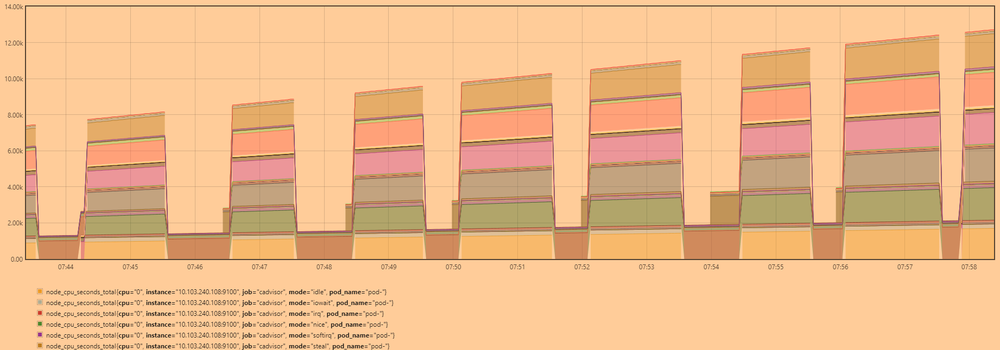

# 问题

## emptyDir

场景：Pod运行一个container，带有内存limit，并挂载了tmpfs的emptyDir。使用`dd`往挂载的目录写入大小超过内存limit的文件，触发OOMKilled，container重启，但由于还是挂载了这个emptyDir（只有在Pod退出后emptyDir才会被清理，因此此时这个emptyDir还是会导致OOM），容器无法正常重启。

- **钩子函数**：只支持`preStop`和`postStart`这两个生命周期函数，而且`preStop`是在Pod terminating的时候调用的，容器crash 之后的重启并不会触发该函数
- **initContainer**：通过initContainer去挂载这个emptyDir，然后清理里面的内容。但是initContainer只在pod启动时运行，无法re-run，参考这个[issue](https://github.com/kubernetes/kubernetes/issues/52345)。
- **扩展emptyDir**：改kubernetes源码，为emptyDir新增`options`属性，并修改错误处理的相关逻辑，在容器重启时主动清空emptyDir。
- **sidecar**：container暴露`/ping`接口，在sidecar（也挂载相同的emptyDir volume）中定时访问这个接口，一旦失败就清空挂载的目录。


## HTTP2的坑

问题来源：Prometheus监控kubernetes集群，某些metrics周期性出现收集不到的现象，（这些metrics来自同一个节点worker1，最后才发现这个信息）。



不是Prometheus本身的问题，因为在master节点执行`kubectl logs prometheus`的时候（该pod运行在worker1节点），偶尔得到结果，偶尔出现超时。因此执行`kubectl logs prometheus -v=6`：

```
$ k logs prometheus-6b7b745cfb-sl44f -v=6
I0908 16:16:00.264921   12556 loader.go:375] Config loaded from file:  /root/.kube/config
I0908 16:16:00.274845   12556 round_trippers.go:443] GET https://10.103.240.108:6443/apis/metrics.k8s.io/v1beta1?timeout=32s 503 Service Unavailable in 8 milliseconds
I0908 16:16:00.284633   12556 request.go:1271] body was not decodable (unable to check for Status): couldn't get version/kind; json parse error: json: cannot unmarshal string into Go value of type struct { APIVersion string "json:\"apiVersion,omitempty\""; Kind string "json:\"kind,omitempty\"" }
I0908 16:16:00.284655   12556 cached_discovery.go:78] skipped caching discovery info due to the server is currently unable to handle the request
I0908 16:16:00.284677   12556 shortcut.go:89] Error loading discovery information: unable to retrieve the complete list of server APIs: metrics.k8s.io/v1beta1: the server is currently unable to handle the request
I0908 16:16:00.288457   12556 round_trippers.go:443] GET https://10.103.240.108:6443/apis/metrics.k8s.io/v1beta1?timeout=32s 503 Service Unavailable in 3 milliseconds
I0908 16:16:00.302435   12556 request.go:1271] body was not decodable (unable to check for Status): couldn't get version/kind; json parse error: json: cannot unmarshal string into Go value of type struct { APIVersion string "json:\"apiVersion,omitempty\""; Kind string "json:\"kind,omitempty\"" }
I0908 16:16:00.302469   12556 cached_discovery.go:78] skipped caching discovery info due to the server is currently unable to handle the request
I0908 16:16:00.305012   12556 round_trippers.go:443] GET https://10.103.240.108:6443/api/v1/namespaces/default/pods/prometheus-6b7b745cfb-sl44f 200 OK in 1 milliseconds
I0908 16:16:30.322582   12556 round_trippers.go:443] GET https://10.103.240.108:6443/api/v1/namespaces/default/pods/prometheus-6b7b745cfb-sl44f/log 500 Internal Server Error in 30003 milliseconds
I0908 16:16:30.323450   12556 helpers.go:216] server response object: [{
  "metadata": {},
  "status": "Failure",
  "message": "Get https://10.103.240.112:10250/containerLogs/default/prometheus-6b7b745cfb-sl44f/prometheus: dial tcp 10.103.240.112:10250: i/o timeout",
  "code": 500
}]
F0908 16:16:30.323469   12556 helpers.go:115] Error from server: Get https://10.103.240.112:10250/containerLogs/default/prometheus-6b7b745cfb-sl44f/prometheus: dial tcp 10.103.240.112:10250: i/o timeout
```

可以发现是访问`https://10.103.240.108:6443/api/v1/namespaces/default/pods/prometheus-6b7b745cfb-sl44f/log `这个API时出现了超时，即访问API Server是没问题的，但是API Server访问worker1节点上的kubelet时出现了超时：`dial tcp 10.103.240.112:10250: i/o timeout`。

查看worker1节点kubelet的日志：

```
$ journalctl -l -u kubelet -f
controller.go:178] failed to update node lease, error: 
Put https://10.103.240.108:6443/apis/coordination.k8s.io/v1/namespaces/kube-node-lease/leases/worker1?timeout=10s: 
context deadline exceeded (Client.Timeout exceeded while awaiting headers)

kubelet_node_status.go:402] Error updating node status, will retry: error getting node "worker1": 
Get https://10.103.240.108:6443/api/v1/nodes/worker1?resourceVersion=0&timeout=10s: context deadline exceeded
```

发现这个kubelet连接API Server出现了超时，搜索得到问题类似的位置：[记一次kubernetes集群异常: kubelet连接apiserver超时](https://www.cnblogs.com/gaorong/p/10925480.html)。

> **H1 VS H2**
>
> 在http1.1中，默认采用`keep-alive`复用网络连接，发起新的请求时， 如果当前有闲置的连接就会复用该连接， 如果没有则新建一个连接。当kubelet连接异常时，老的连接被占用，一直hang在等待对端响应，kubelet在下一次心跳周期，因为没有可用连接就会新建一个，只要新连接正常通信，心跳包就可以正常发送。
>
> 在h2中，为了提高网络性能，**一个主机只建立一个连接**，所有的请求都通过该连接进行，默认情况下，即使网络异常，他还是重用这个连接，直到操作系统将连接关闭，而操作系统关闭僵尸连接的时间默认是十几分钟。

在kubernetes client-go中关于h2的设置的函数：

```
// SetTransportDefaults applies the defaults from http.DefaultTransport
// for the Proxy, Dial, and TLSHandshakeTimeout fields if unset
func SetTransportDefaults(t *http.Transport) *http.Transport {
	t = SetOldTransportDefaults(t)
	// Allow clients to disable http2 if needed.
	if s := os.Getenv("DISABLE_HTTP2"); len(s) > 0 {
		klog.Infof("HTTP2 has been explicitly disabled")
	} else {
		if err := http2.ConfigureTransport(t); err != nil {
			klog.Warningf("Transport failed http2 configuration: %v", err)
		}
	}
	return t
}
```

如果存在`DISABLE_HTTP2`这个环境变量，就不会执行`http2.ConfigureTransport`。因此在worker1上设置环境变量`DISABLE_HTTP2`来禁用h2，然后重启kubelet，问题解决！