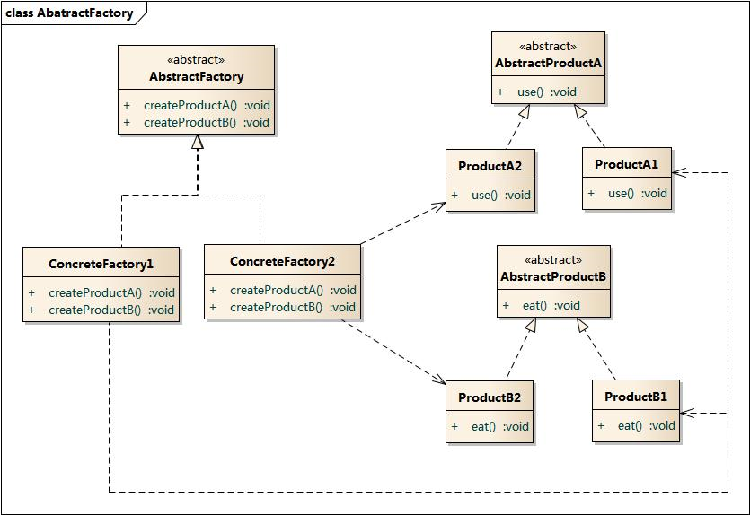

# 抽象工厂模式

**提供一个创建  一系列相关或相互依赖对象的  接口，而无需指定它们具体的类。**


## 产生背景

以操作数据库为例，假如有MySQL和Sql Server两种数据库，实现相同的功能所做的操作不同。

假设有一个User类，对应数据库的User表。

```
type User struct {
	name string
	...
}
```

以及操作User表的两个类：

```
type SqlserverUser struct {...}

func(s *SqlserverUser) Insert(User) {...}
func(s *SqlserverUser) Get(int) User {...}

type MysqlUser struct {...}

func(s *MysqlUser) Insert(User) {...}
func(s *MysqlUser) Get(int) User {...}
```

客户端调用：

```
su := &SqlserverUser{}
su.Insert(..)
su.Get(..)

mu := &MysqlUser{}
mu.Insert(..)
mu.Get(..)
```

这种做法会使得**更换数据库的时候，所有的类名都需要进行替换**，即使在两种数据库操作中相同功能对应的函数名相同。


## 改进

但由于这些功能在不同数据库中都需要，所以可以使用接口进行抽象。

```
type DBUser interface {
	Insert(User)
	Get(int) User
}
```

从上面的代码可以发现，`SqlserverUser`和`MysqlUser`都实现了`DBUser`接口。

接下来使用工厂模式，创建一个工厂，这个工厂能提供**实现`DBUser`接口的实例**：

```
type Factory interface {
	CreateUser() (DBUser, error)
}

type SqlserverFactory struct {...}
func(*SqlserverFactory) CreateUser() (DBUser, error) {
	return &SqlserverUser{}, nil
}

type MysqlFactory struct {...}
func(*MysqlFactory) CreateUser() (DBUser, error) {
	return &MysqlUser{}, nil
}
```

客户端调用：

```
// 更换MySQL数据库时只需要更改实例化的子类，其他地方不用修改
var factory Factory = &SqlserverFactory{}
su, _ := factory.CreateUser()
su.Insert(..)
su.Get(..)
```

数据库不可能只有一个User表，还会有其他的，例如部门表（Department），那就可以新增关于该表的接口。

```
type DBDepartment interface {
	Insert(Department)
	Get(int) Department
}

// 同样有两种实现
type SqlserverDepartment struct {...}

func(s *SqlserverDepartment) Insert(Department) {...}
func(s *SqlserverDepartment) Get(int) Department {...}

type MysqlDepartment struct {...}

func(s *MysqlDepartment) Insert(Department) {...}
func(s *MysqlDepartment) Get(int) Department {...}

// 升级工厂接口
type Factory interface {
	CreateDepartment() (DBDepartment, error)
	CreateUser() (DBUser, error)
}

// 为原有的工厂添加新方法
func(*SqlserverFactory) CreateDepartment() (DBDepartment, error) {
	return &SqlserverDepartment{}, nil
}

func(*MysqlFactory) CreateDepartment() (DBDepartment, error) {
	return &MysqlDepartment{}, nil
}
```


## 结构图




## 优缺点

AbstractFactory应该**包含所有的产品创建的抽象方法**。

**好处：**

- 易于交换产品系列，因为具体工厂类在一个应用中只需要初始化时出现一次
- 让具体的创建实例过程与客户端分离，客户端是通过它们的抽象接口操纵实例，产品的具体类名也被具体工厂的实现分离，不会出现在客户代码

**缺点：**

- 假如又要新增Project表，需要增加DBProject接口，SqlserverProject、MysqlProject类，同时还要修改抽象工厂接口和具体工厂类
- 每一个客户端程序类都需要在类的开始声明`var factory Factory = &XXXFactory{}`，如果有100个调用数据库访问的类，改动时就需要改100次


## 使用简单工厂改进抽象工厂

```
package db

const db string = "Sqlserver" // or Mysql

func CreateUser() (DBUser, error) {
	var res DBUser
	switch (db) {
	case "Sqlserver""
		res = &SqlserverUser{}
	case "Mysql":
		res = &MysqlUser{}
	default:
		return nil, error.New("unknown database" + sf.db)
	}
	return res, nil
}
```

客户端调用：

```
user, err := db.CreateUser()
if err != nil {...}
user.Insert(..)
user.Get(..)
```

这种模式下，增加新的数据库访问，需要修改每个方法的`switch case`分支，而在抽象工厂模式下，只需要增加一个新的工厂类。


## 反射 + 抽象工厂

反射：根据**字符串形式**的类名，找到该类。

```
// 反射的实现
type registerStructMaps map[string]reflect.Type

//根据名字注册实例
func (rsm registerStructMaps)Register(name string, c interface{})  {
	rsm[name] = reflect.TypeOf(c).Elem()
}

//根据name初始化结构
func (rsm registerStructMaps)New(name string) (c interface{}, err error){
	if v, ok := rsm[name]; ok {
		c = reflect.New(v).Interface()
	} else{
		err = fmt.Errorf("not found %s struct",name)
	}
	return
}
```

使用反射就不需要`switch`或者`if`判断了：

```
package db

var rsm registerStructMaps
func init() {
	// 注册不同的工厂
	rsm = make(registerStructMaps)
	rsm.Register("Sqlserver", &SqlserverFactory{})
	rsm.Register("Mysql", &MysqlFactory{})
}

const db string = "Sqlserver" // or Mysql

func CreateUser() (DBUser, error) {
	f, err := rsm.New(db)
	if err != nil {...}
	factory, ok := f.(Factory)
	if !ok {...}
	return factory.CreateUser()
}
```

但是每次更换数据库，需要修改`db`变量，就需要重新编译。


## 反射 + 配置文件

先在配置文件里写明使用的数据库：

```
{
    "db": "Mysql",
    ...
}
```

在db package的`init`函数里读取配置文件，然后赋值给`db`变量（不能用`const`了）。

