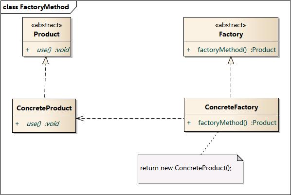

# 工厂方法模式

简单工厂模式的最大优点在于**工厂类中包含了必要的逻辑判断，根据客户端的选择条件动态实例化相关的类，对于客户端来说，去除了与具体产品的依赖**。

工厂方法模式：定义一个用于创建对象的接口，**让子类决定实例化哪一个类**。工厂方法使一个类的实例化延迟到其子类。

在工厂方法模式中，客户端需要决定实例化哪一个工厂来实现运算类，选择判断的问题还是存在的。工厂方法把简单工厂的内部逻辑判断移到了客户端代码来进行。想要加功能，本来是改工厂类，现在却需要修改客户端。但是解决了工厂模式破坏“开放-封闭原则”的问题。**进一步，利用反射可以解决分支判断的问题。**

## 实现

1. 首先定义工厂接口

```
type Factory interface {
	CreateOperation() Operation
}
```

> ```
> type Operation interface {
> 	GetResult(numA, numB float64)  float64
> }
> ```

2. 实现各个具体操作的工厂

```
type AddFactory struct {
}

func(*AddFactory) CreateOperation() Operation {
	return &OperationAdd{}
}
```

> ```
> // 具体操作实现类
> type OperationAdd struct {
> }
> 
> func(*OperationAdd) GetResult(numA, numB float64)  float64 {
> 	return numA + numB
> }
> ```

### 客户端调用

```
var factory Factory = AddFactory{}
op := factory.CreateOperation()
op.GetResult(1.0, 2.0) // 3

factory = MinusFactory{}
op = factory.CreateOperation()
op.GetResult(1.0, 2.0) // -1
```


## 结构图



