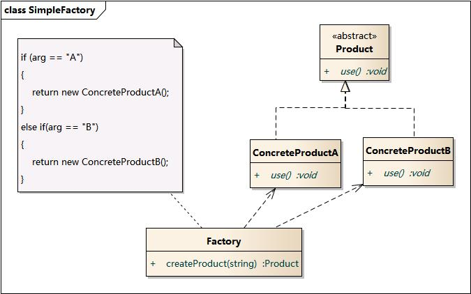

# 简单工厂模式

设计一个计算器，面向过程的做法：

```
func GetResult(numA, numB float64, op string) float64 {
    var res float64
    switch(op) {
    case "+":
        res = numA + numB
    case "-":
        ...
    ......
    }
    return res
}
```

如果要增加新的op，就得重新编译原来的代码，万一误改了原有功能的代码，就更糟糕了。


## 实现

1. 先定义operation接口

```
type Operation interface {
	GetResult(numA, numB float64)  float64
}
```

2. 实现具体的加减乘除struct

```
type OperationAdd struct {
}

func(*OperationAdd) GetResult(numA, numB float64)  float64 {
	return numA + numB
}

......
```

3. 定义工厂

```
func CreateOperation(op string) (Operation, error) {
	switch(op) {
	case "+":
		return &OperationAdd{}, nil
	case "-":
		...
	......
	default:
		return nil, errors.New("unknow operation")
	}
}
```


### 客户端调用

```
if op, err := CreateOperation("+"); err != nil {
	// error handle
} else {
	fmt.Print(op.GetResult(1.0, 2.0))
}
```


## 结构图




## 好处

- 当需要修改某一种运算时，只需要去改这个运算的类，而不会影响其他的运算类
- 添加新运算时，只需要新增运算类，并在工厂类的switch中增加分支


## 坏处

- 破坏了 **开放-封闭原则**，**工厂方法模式**修复了这个问题

