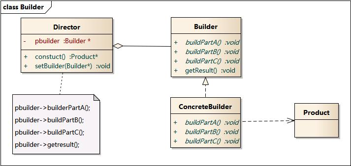

# 建造者模式

**将一个复杂对象的构建与它的表示分离，使得同样的构建过程可以创建不同的表示。**

以构造游戏人物为例，需要头、身体、左手、右手、左脚、右脚。如果直接在一个类的构造函数里面初始化该人物，代码如下：

```
type Person struct {...}
func NewPerson() *Person {
	p := &Person{}
    // create head
    // create body
    // create left hand
    // create right hand
    // create left leg
    // create right leg
    return p
}
```

上述步骤一个都不能缺（但有可能缺失，因为没有强制要求每个步骤必须存在的机制）。

如果要创建新的人物，则创建一个新的类，这个类的构造函数也跟上类 类似。

由于构造过程比较复杂，使用建造者模式可以将一个复杂对象的构建与表示分离，同样的构造过程可以创建不同的表示。

该模式包含如下角色：

- Builder：抽象建造者，为创建一个Product对象的各个部件指定抽象接口
- ConcreteBuilder：具体建造者，实现Builder接口
- Director：指挥者，控制Builder构造对象
- Product：产品角色

**使用时机：**需要创建复杂对象，且这些对象内部构建间的建造顺序通常是稳定的，但对象内部的构建通常面临复杂的变化。


## 实现

1. 定义建造者接口：

```
type Builder interface {
    BuildPartA()
    BuildPartB()
}
```

2. 具体建造者：

```
type ConcreteBuilder struct {...}

func(*ConcreteBuilder) BuildPartA() {...}
func(*ConcreteBuilder) BuildPartB() {...}
func(*ConcreteBuilder) GetResult() Product {...}
```

3. 指挥者：

```
type Director struct {
	builder Builder
}

func NewDirector(builder Builder) *Director {
	return &Director{
		builder: builder,
	}
}

// Construct Product
func (d *Director) Construct() {
	d.builder.BuildPartA()
	d.builder.BuildPartB()
}
```

客户端调用：

```
builder := &ConcreteBuilder{}
director := NewDirector(builder)
director.Construct()
res := builder.GetResult()
```

由于将构建过程每一步骤抽象为接口，ConcreteBuilder类必须实现每一个接口，否则编译失败，这就确保构建不会缺失某一部件。

而构建不同的Product，只需要新建一个ConcreteBuilder类即可实现。


## 结构图




