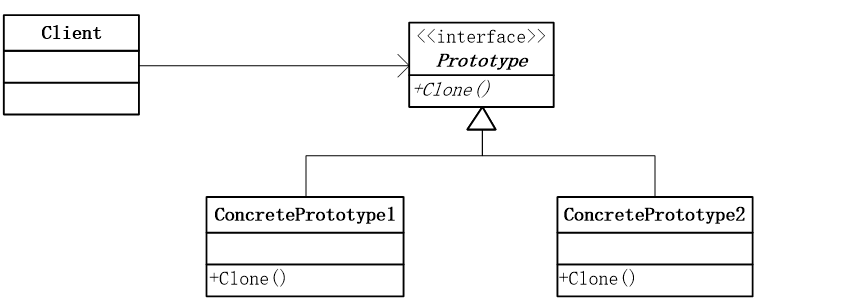

# 原型模式

**用原型实例指定创建对象的种类，并且通过拷贝这些原型创建新的对象。**

从一个对象再创建另外一个可定制的对象，而且不需知道任何创建的细节。


## 实现

定义原型接口：

```
type Cloneable interface {
	Clone() Cloneable
}
```

实现具体原型类：

```
type ConcretePrototype struct {...}
func(this *ConcretePrototype) Clone() Cloneable {
	cp := *this
	return &cp
}
```

客户端调用：

```
obj := &ConcretePrototype{}
newObj := obj.Clone()
if obj == newObj {
	log.Fatal("clone not working for ConcretePrototype")
}
```


## 结构图




## 深拷贝 VS 浅拷贝

浅拷贝：对于值类型的字段，执行逐位复制；对于引用类型的字段，只复制引用但不复制引用的对象。会导致原始对象和副本都引用同一对象。

深拷贝：

```
type ConcretePrototype struct {
	m map[int]int // 引用类型
}

func(this *ConcretePrototype) Clone() Cloneable {
	cp := new(ConcretePrototype)
	err := deepCopy(cp, this)
	if err != nil {...}
	return &cp
}

func deepCopy(dst, src interface{}) error {
    var buf bytes.Buffer
    if err := gob.NewEncoder(&buf).Encode(src); err != nil {
        return err
    }
    return gob.NewDecoder(bytes.NewBuffer(buf.Bytes())).Decode(dst)
}
```

