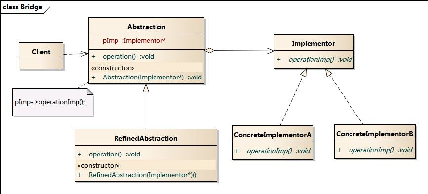

# 桥接模式

**将抽象部分与它的实现部分分离，使他们都可以独立地变化。这并不是说，让抽象类与其派生类分离，因为这没有任何意义。实现指的是抽象类和它的派生类用来实现自己的对象。**

## 合成 / 聚合原则

**尽量使用合成/聚合，尽量不使用类继承。**

- 聚合表示一种弱的‘拥有’关系，体现的是A对象可以包含B对象，但B对象不是A对象的一部分
- 合成则是一种强的‘拥有’关系，体现了严格的部分和整体的关系，部分和整体的生命周期一样


优先使用对象的合成 / 聚合有助于保持每个类被封装，并被集中在单个任务上。这样类和类继承层次会保持较小规模，并且不太可能增长为不可控制的庞然大物。


以不同品牌手机为例，在没有统一标准的情况下，每种软件在每个品牌的手机上都有一种实现。如果以手机软件为抽象类，则有通讯录、游戏等子类，这些子类下还会有具体的实现类，例如品牌M通讯录。这种类的继承会导致很多麻烦：当新增一个软件的时候，每种品牌都需要新增一个该软件的实现类；新增一个品牌时，同样需要实现所有软件的具体实现类。

而且，子类的实现与它的父类有非常紧密的依赖关系，以至于父类实现中的任何变化必然会导致子类发生变化。当需要复用子类时，如果继承下来的实现不适合解决新的问题，则父类必须重写或被其他更适合的类替换。这种依赖关系限制了灵活性并最终限制了复用性。

**一定要在是“is-a”的关系下才考虑使用继承。**


## 结构图




## 实现

以发送普通消息和紧急消息为例，实现发送消息有两种方法：短信和邮件。

首先从实现发送消息的方法这个角度，定义接口：

```
type MessageImplementer interface {
	Send(text, to string)
}
```

它有短信和邮件两种具体实现：

```
type MessageSMS struct {...}
func(*MessageSMS) Send(text, to string) {...}
func ViaSMS() MessageImplementer {
	return &MessageSMS{}
}

type MessageEmail struct {...}
func(*MessageEmail) Send(text, to string) {...}
func ViaEmail() MessageImplementer {
	return &MessageEmail{}
}
```

然后从消息的类型来定义接口：

```
type AbstractMessage interface {
	SendMessage(text, to string)
}
```

有紧急消息和普通消息：

```
type UrgencyMessage struct {
	method MessageImplementer
}

func NewUrgencyMessage(method MessageImplementer) *UrgencyMessage {
	return &UrgencyMessage{method: method}
}

func (m *UrgencyMessage) SendMessage(text, to string) {
	m.method.Send("urgency: " + text, to)
}

type CommonMessage struct {
	method MessageImplementer
}

func NewCommonMessage(method MessageImplementer) *CommonMessage {
	return &CommonMessage{method: method}
}

func (m *CommonMessage) SendMessage(text, to string) {
	m.method.Send("common: " + text, to)
}
```


客户端调用：

```
var m AbstractMessage = NewCommonMessage(ViaSMS())
m.SendMessage("have a drink?", "bob")

m = NewUrgencyMessage(ViaEmail())
m.SendMessage("have a drink?", "bob")
```

**实现系统可能有多角度分类，每一种分类都有可能变化，那么就把这种多角度分离出来让它们独立变化，减少它们之间的耦合。**

本例中发送消息的方法和类型各有2种不同实例，如果定义发送普通邮件、发送普通短信、发送紧急邮件、发送紧急短信这四个类，则耦合度太大，不方便扩展。而对每个角度定义抽象，不同角度的组合更容易实现。