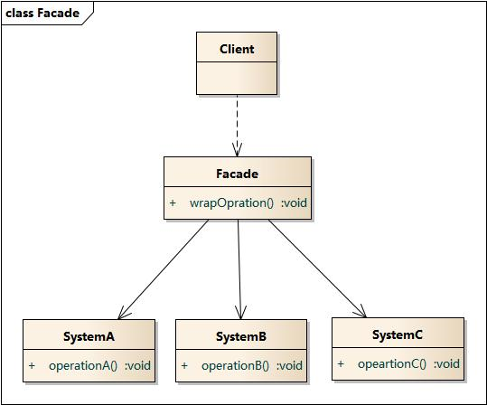

# 外观模式

**为子系统中的一组接口提供一个一致的界面，此模式定义一个高层接口，这个接口使得这一子系统更加容易使用。**

以散户买股票和基金为例

- 散户买股票，需要了解很多支股票（子系统接口）的情况，使得耦合性过高。
- 基金，则是聚集了大众的钱，由专业人士买多支股票。

买股票是为了赚钱，而买基金的本质是把钱交给专业人士买股票，可以更容易地赚钱。

基金就相当于股票的外观。


## 实现

假设有三个子系统，三个子系统对应三个接口：

```
type SystemA interface {
	MethodA()
}

type SystemB interface {
	MethodB()
}

type SystemC interface {
	MethodC()
}
```

三个子系统的实现类：

```
type A struct {...}
func(*A) MethodA() {...}

type B struct {...}
func(*B) MethodB() {...}

type C struct {...}
func(*C) MethodC() {...}
```

定义外观接口：

```
type Facade interface {
	MethodAB()
	MethodAc()
}
```

具体外观类：

```
type FacadeImpl struct {
	a *A
	b *B
	c *C
}

func NewFacadeImpl() Facade {
	return &FacadeImpl{
		a: &A{},
		b: &B{},
		c: &C{},
	}
}

func(f *FacadeImpl) MethodAB() {
	f.a.MethodA()
	f.b.MethodB()
}

func(f *FacadeImpl) MethodAC() {
	f.a.MethodA()
	f.c.MethodC()
}
```

客户端调用：

```
var f Facade = NewFacadeImpl()
f.MethodAB()
f.MethodAC()
```


## 结构图




## 何时使用

- 设计初期，有意识地将不同的层分离，比如经典的三层架构，在数据访问层和业务逻辑层、业务逻辑层和表示层的层与层之间建立外观Facade
- 在开发阶段，子系统往往因为不断的重构演化而变得越来越复杂。大多数模式使用时会产生很多很小的类，这本是好事，但也给外部调用它们的用户带来使用上的困难，增加外观Facade可以提供一个简单接口，减少它们之间的依赖
- 维护一个遗留的大型系统时，可能这个系统已经非常难以维护和扩展，但因为它包含非常重要的功能，新的需求开发必须依赖于它。可以通过Facade与遗留代码交互所有复杂的工作，新系统与Facade对象交互。