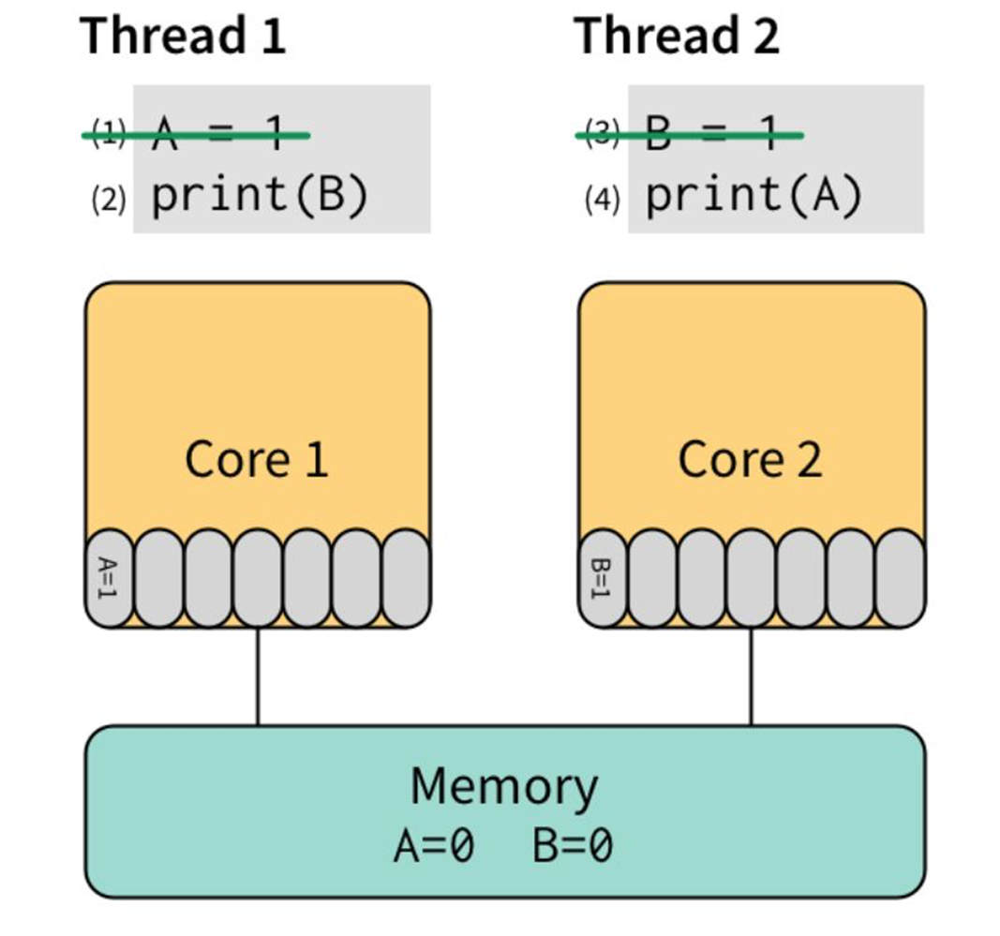

# 并发

## Goroutine

```
func main() {
    http.HanldeFunc("/", func(w http.ResponseWriter, r *http.Request) {
        fmt.Fprintf(w, "hello")
    })
    go func() {
    	// ListenAndServe会一直监听端口，每来一个新请求就开一个goroutine去处理
    	// 除非端口已经被占用或其他异常，才会返回
        if err := http.ListenAndServe(":9000", nil); err != nil {
            log.Fatal(err)
        }
    }()
    
    select{} // 空的select可以使main函数阻塞在这，程序不会退出
}
```

由于`log.Fatal`内部会调用`os.Exit`，导致`defer`不会被执行，没有释放资源，整个程序就退出了。并且`main`函数感知不到这个goroutine什么时候退出，因此这种写法是不推荐的。

如果goroutine在另一个goroutine获得结果之前不能继续执行，通常情况下，直接在当前goroutine去做这项工作，比委托给一个新goroutine更简单。这可以消除将结果从goroutine返回到其启动器所需的大量状态跟踪和chan操作。

```
func main() {
    http.HanldeFunc("/", func(w http.ResponseWriter, r *http.Request) {
        fmt.Fprintf(w, "hello")
    })
	if err := http.ListenAndServe(":9000", nil); err != nil {
		log.Fatal(err)
	}
}
```

> **Only use `log.Fatal` from `main.main` or `init` functions**


### 由调用者发起并发

当某个函数需要并发执行时，由调用者对该函数执行`go`启动一个新goroutine，而不是在函数里面执行`go`，这样更清晰，方便知道这里启动了goroutine。

设计一个API，获取某个目录的内容，下面的两种设计都不完美：

```
func ListDirectory(dir string) ([]string, error)

func ListDirectory(dir string) chan string
```

- 返回切片：将目录读取到一个 `slice `中，然后返回整个切片，或者如果出现错误，则返回错误。这是同步调用的，`ListDirectory `的调用方会阻塞，直到读取所有目录条目。

  根据目录的大小，这可能需要很长时间，并且可能会分配大量内存来构建目录条目名称的 `slice`。

- 返回`chan：ListDirectory `返回一个` chan string`，结果通过该 `chan `传递。当通道关闭时，这表示不再有目录。由于在 `ListDirectory `返回后发生通道的填充，`ListDirectory `可能内部启动 goroutine 来填充通道。

  通过使用一个关闭的通道作为不再需要处理的项目的信号，`ListDirectory `无法告诉调用者中途是否发生了错误，返回的结果是否完整。

  调用者必须继续从通道读取，直到它关闭，这样才能使`ListDirectory`创建的goroutine退出，否则会发生goroutine 泄露。这对 `ListDirectory `的使用是一个严重的限制，调用者必须花时间从通道读取数据，即使它可能已经收到了它想要的答案。对于大中型目录，它可能在内存使用方面更为高效，但这种方法并不比原始的基于 `slice `的方法快。

参考标准库的做法：

```
type WalkFunc func(path string, info os.FileInfo, err error) error

func ListDirectory(dir string, fn WalkFunc)
```

提供一个`WalkFunc`，每次访问到一个文件时，就将控制权交给`WalkFunc`，是否发生错误，是否要继续遍历。


### 管理好goroutine的生命周期

**要知道一个goroutine什么时候会退出，能通过什么方法使其退出。某些情况下做超时控制。**


#### 超时控制

```
func search(term string) (string, error) {
    time.Sleep(200 * time.Millisecond)
    return "some value", nil
}

func process(term string) error {
    record, err := search(term)
    if err != nil {
        return err
    }
    
    // do something
    return nil
}
```

`search`是一个模拟长时间运行的操作，如数据库操作、RPC调用，`process`在处理任务时，会调用`search`，顺序调用产生的延迟可能是不可接受的，`search`的耗时是不确定的，有可能要很久，因此需要进行超时控制。

```
type result struct {
    record string
    err    error
}

func process(term string) error {
    ctx, cancel := context.WithTimeout(context.Background(),100*time.Millisecond)
    defer cancel()
    
    ch := make(chan result)
    
    go func() {
        record, err := search(term)
        ch <- result{record, err}
    }()
    
    select {
        case <-ctx.Done():
            return errors.New("search canceled")
    	case result := <- ch:
    		if result.err != nil {
            	return result.err
    		}
    		// do something
    		return nil    		
    }
}
```


#### 多goroutine管理

通过两个goroutine提供http服务，一个对内提供调试服务，一个对外暴露服务，当其中一个服务挂了之后，整个程序退出。

```
import (
	"fmt"
	"net/http"
	_ "net/http/pprof"
)

func main() {
    mux := http.NewServeMux()
    mux.HandleFunc("/", func(w http.ResponseWriter, r *http.Request) {
        fmt.Fprintf(w, "hello")
    })
    go http.ListenAndServe("127.0.0.1:8001", http.DefaultServeMux) // 内部调试
    http.ListenAndServe(":8080", mux)  // 外部服务
}
```

这个程序中，如果`main`函数对外提供服务出现问题，整个程序会退出，但如果goroutine退出了，程序并不会退出，但这时没法通过内部接口获取调试信息了。

可以将两个服务用函数包装，实现`main`的解耦，然后用`chan`实现`main`函数与它们之间的同步。

```
func serve(addr string, handler http.Handler, stop <-chan struct{}) error {
    s := http.Server{
        Addr: addr,
        Handler: handler,
    }
    
    go func() {
      <-stop
      s.Shutdown(context.Background())
    }()
    
    return s.ListenAndServe()
}

func main() {
    done := make(chan error, 2)
    stop := make(chan struct{})
    go func() {
        done <- serveDebug(stop)
    }()
    go func() {
        done <- serveApp(stop)
    }()
    
    var stopped bool
    for i := 0; i < cap(chan); i++ {
        // 一旦有一个服务结束了，就会通知另一个也退出
        if err := <-done; err != nil {
            fmt.Println("error: ", err)
        }
        
        if !stopped {
            stopped = true
            close(stop) // 会导致serve中的goroutine对stop的监听结束，然后关闭server，serve函数就会返回一个error
        }
    }
}
```


#### 等待goroutine 结束

通过埋点将日志上报到网络中的某个服务：

```
type Tracker struct {}

func (t *Tracker) Event(data string) {
    time.Sleep(time.Millisecond) // 模拟网络调用
    log.Println(data)
}

type App struct {
    track Tracker
}

func (a *App) Handle(w http.ResponseWriter, r *http.Request) {
	// do something
	
	go a.track.Event("xxx") // 失去了对这个goroutine 的控制，不知道它是否退出，可能导致在服务关闭时，有一些事件丢失 
}
```

**使用`WaitGroup`跟踪每一个创建的goroutine。**

```
type Tracker struct {
    wg sync.WaitGroup
}

func (t *Tracker) Event(data string) {
	t.wg.Add()
    go func() {
    	defer t.wg.Done()
    	time.Sleep(time.Millisecond) // 模拟网络调用
	    log.Println(data)
    } ()
}

func (t *Tracker) Shutdown() {
	t.wg.Wait()
}

func (a *App) Handle(w http.ResponseWriter, r *http.Request) {
	// do something
	
	a.track.Event("xxx")
}

func main() {
    var a App
    // do something
    
    // when close
    a.track.Shutdown()
}
```

但是这里的`Tracker.Shutdown`仍可能因为某些耗时的goroutine要等很久，可以通过context 进行超时控制。

```
func (t *Tracker) Shutdown(ctx context.Context) error {
	ch := make(chan struct{})
	go func() {
		t.wg.Wait()
    	close(ch)    
	} ()

	select {
	case <-ch:
		return nil
     case <-ctx.Done():
     	return errors.New("timeout")
	}
}
```

但是这些代码大量创建goroutine，开销大，可以通过`chan`采用类似生产者-消费者的方式进行处理：

```
type Tracker struct {
    ch chan string
	stop chan struct{}
}

func (t *Tracker) Event(ctx context.Context, data string) error {
	select {
    case t.ch <- data:
    	return nil
    case <-ctx.Done():
        return ctx.Err()
	}
}

func (t *Tracker) Run() {
	for data := range t.ch {
        time.Sleep(time.Millisecond)
        log.Println(data)
	}
	t.stop <- struct{}{} // 告知Shutdown Run goroutine已退出
}

func (t *Tracker) Shutdown(ctx context.Context) {
	close(t.ch)
	select {
	case <- t.stop:
	case <-ctx.Done():
	}
}
```


## Memory model

[官方博客介绍](https://golang.org/ref/mem)

### 内存重排

在一个 goroutine 中，读和写一定是按照程序中的顺序执行的。即编译器和处理器只有在不会改变这个 goroutine 的行为时才可能修改读和写的执行顺序。由于重排，不同的goroutine 可能会看到不同的执行顺序。例如，一个goroutine 执行 `a = 1;b = 2;`，另一个 goroutine 可能看到 b 在 a 之前更新。

```
// thread 1
A = 1
print(B)
// thread 2
B = 1
print(A)
```

两个线程执行后的结果可能是`1、1`、`0、1`、`1、0`，也可能是`0、0`，因为对于这两个线程，两个语句的顺序并没有关系，可能发生**内存重排**（Memory Reordering）。

> CPU 为了提高效率，有很多优化手段：流水线、分支预测，为了提高读写内存的效率，也会对读写指令进行重新排列，即内存重排。
>
> 除了CPU重排，还有编译器重排，比如：
>
> ```
> X = 0
> for i in range(100):
> 	X = 1
> 	print(X)
> ```
>
> 可能被编译器优化为：
>
> ```
> X = 1
> for i in range(100):
> 	print(X)
> ```
>
> 但如果有其他线程同时执行了`X = 0`这条指令，在多核心场景下，没有办法轻易判断两段程序是“等价”的。因为这两段代码输出的结果可能是不一样的：1110111….、11100000….

对于多线程程序，由于每个线程占用一个CPU核心，CPU核心有自己独占的L1、L2 cache，在执行上面打印AB的代码时，对于A、B的更新可能还在CPU独占的cache中，没有刷到内存，导致每个线程`print`另一个变量时，读取了内存中的旧值。



对于多线程的程序，所有的 CPU 都会提供“锁”支持，称之为 barrier，或者 fence。它要求：barrier 指令要求**所有对内存的操作都必须要“扩散”到 memory 之后才能继续执行其他对 memory 的操作**。因此，可以用高级点的 atomic compare-and-swap，或者直接用更高级的锁，通常是标准库提供。


### Happen-Before

为了说明读和写的必要条件，定义了先行发生(Happens Before)。如果事件 e1 发生在 e2 前，我们可以说 e2 发生在 e1 后。

如果 e1不发生在 e2 前也不发生在 e2 后，我们就说 e1 和 e2 是并发的。 

> 前面打印AB的示例中，线程1和线程2没有谁先谁后，它们是并发的。

在**单一的独立的 goroutine** 中先行发生的顺序即是程序中表达的顺序。

 

当下面条件满足时，对变量 `v` 的读操作 `r` 是被允许看到对 `v` 的写操作 `w` 的（即写后读）： 

1. `r` 不先行发生于 `w` 
2. 在 `w` 后` r` 前没有对 `v `的其他写操作 

为了保证对变量 `v` 的读操作 `r` 看到对 `v` 的写操作 `w`，要确保 `w` 是 `r` 允许看到的**唯一写操作**。即当下面条件满足时，`r` 被保证看到 `w`： 

1. `w` 先行发生于 `r`
2. 其他对共享变量 `v` 的写操作要么在 `w` 前，要么在 `r` 后。 

这一对条件比前面的条件更严格，需要没有其他写操作与 `w` 或 `r` **并发发生**。

> 参考资料：[Go的内存模型](https://www.jianshu.com/p/5e44168f47a3)

单个goroutine中没有并发，所以上面两个定义是相同的：读操作`r`看到最近一次的写操作 `w` 写入 `v` 的值。 

当多个goroutine 访问共享变量 `v` 时，它们**必须使用同步事件来建立Happen-Before 这一条件**来保证读操作能看到需要的写操作。 

- 对变量 `v` 的零值初始化在内存模型中表现的与写操作相同。 
- 对大于 single machine word（64位机器，8字节大小） 的变量的读写操作 表现的像 以不确定顺序对多个 single machine word的变量的操作。


## Package sync

### data race

data race 是两个或多个 goroutine 访问同一个资源(如变量或数据结构)，并尝试对该资源进行**读写**而不考虑其他 goroutine（如果是并发读，就没有问题）。

通过`race`参数可以启用race detector，它是在构建过程中内置到程序中的代码，一旦程序运行，它就能够检测并报告它发现的任何竞争条件。


#### 原子性

`i++`这个语句并不是原子的，它的汇编是三条指令：加载`i`的值到寄存器，将寄存器的值加1，将寄存器的值存储到`i`的地址。如果多个goroutine对共享变量进行读写，没有同步措施，就会发生意外。

对interface的赋值也不是原子的，因为interface由两个字段构成，一个是`type`指针，一个是`data`指针，两个的大小超过了single machine word，也无法原子赋值。

```
type H interface {
    Hello()
}

type Ben struct{
    //id int
    name string
}

func (b *Ben) Hello() {
    fmt.Prinln("hello from ben:", b.name)
}

type Jerry struct{
    name string
}

func (j *Jerry) Hello() {
    fmt.Prinln("hello from ben:", j.name)
}

func main() {
    var ben = &Ben{name: "Ben"}
    var jerry= &Jerry{name: "Jerry"}
	var h H = ben
	
	var loop0, loop1 func()
	loop0 = func() {
        h = ben
        go loop1()
	}
	
	loop1 = func() {
        h = jerry
        go loop0()
	}
	
	go loop0()
	for {
        h.Hello()
	}
}
```

由于每次对 interface `H`的赋值需要修改两个字段，并且不是原子操作，就可能出现`type`修改了，但是`data`没有修改的情况，从而导致异常。如果把`Ben`结构体的`id`字段取消注释，两个结构体的内存布局将不同，由此可能导致`panic`。


### atomic

模拟一个读多写少的场景：

```
type Config struct {
    a []int
}

func main() {
    cfg := &Config{}
    // one writer, multi reader
    go func() {
        i := 0
    	for {
            i++
            cfg.a = []int{i, i + 1, i + 2, i + 3, i + 4, i + 5}
    	}
    }
    
    var wg sync.WaitGroup
    for i := 0; i < 4; i++ {
        wg.Add(1)
        go func() {
            for n := 0; n < 100; n++ {
                fmt.Printf("%v\n", cfg) // 打印的值可能是不连续的
            }
            wg.Done()
        }()
    }
    
    wg.Wait()
}
```

可以用Mutex、RWMutex来保证打印的值是连续的，不过使用锁开销比较大，因为涉及到多个goroutine之间的上下文切换、唤醒等。针对共享变量的读写，可以使用`atomic.Value`。

```
 func main() {
	var v atomic.Value
	v.Store(&Config{})

    go func() {
        i := 0
    	for {
            i++
            cfg = &Config{a: []int{i, i + 1, i + 2, i + 3, i + 4, i + 5}}
            v.Store(cfg)
    	}
    }
 	
    var wg sync.WaitGroup
    for i := 0; i < 4; i++ {
        wg.Add(1)
        go func() {
            for n := 0; n < 100; n++ {
            	cfg := v.Load().(*Config)
                fmt.Printf("%v\n", cfg) // 打印的值可能是不连续的
            }
            wg.Done()
        }()
    }
    
    wg.Wait()
}    	
```

> Copy On Write
>
> `atomic.Value`的思想就是COW，有多个goroutine在`Store`和`Load`，有可能`Load`的是V1版本，同时`Store`了V2版本，这时候V1版本的值会一直存在，直到没有任何一个goroutine使用它，才会被释放。因此，同一份数据在内存里面可能有多份副本。
>
> 对于读多写少的场景，使用`atomic.Value`效率很高，但如果写多，就会经常拷贝数据，降低效率。


### mutex

```
var mu sync.Mutex
done := make(chan bool, 1)

// goroutine 1 获取锁后sleep
for {
    select {
    case <-done:
    	return
    default:
    	mu.Lock()
    	time.Sleep(100 * time.Microsecond)
    	mu.Unlock()
    }
}

// goroutine 2  先sleep 再获取锁
for i := 0; i < 10; i++ {
    time.Sleep(100 * time.Microsecond)
    mu.Lock()
    mu.Unlock()
}
done <- true
```

在go1.8中，当g2获取到十次锁时，g1已经获取到数百万次锁了，非常不公平。


#### 模式

- **Barging**：这种模式是为了提高吞吐量，当锁被释放时，它会唤醒第一个等待者，然后把锁给第一个等待者或者给**第一个请求锁的人**。

- **Handsoff**：当锁释放时候，锁会一直持有直到第一个等待者准备好获取锁。它降低了吞吐量，因为锁被持有，即使另一个goroutine 准备获取它。

  > 一个互斥锁的 handsoff 会完美地平衡两个goroutine 之间的锁分配，但是会降低性能，因为它会迫使**第一个 goroutine 等待锁**。

- **Spining**：自旋在等待队列为空或者应用程序重度使用锁时效果不错。Parking 和 Unparking goroutines 有不低的性能成本开销，相比自旋来说要慢得多。

go1.8采用了Barging + Spining这两种模式，造成了上述代码的不公平，因为g2每次是休眠后去获取锁，涉及到goroutine的切换，时间开销大，而g1释放完锁就去获取锁，g1一直处于运行状态，即使它在释放锁时通知了等待者，但等待者可能处于休眠状态，需要调度到执行状态才会运行，因此等待者经常处于饥饿状态。

Go 1.9 添加了Handsoff 饥饿模式，该模式在goroutine释放锁时候触发 handsoff。所有等待锁超过一毫秒的 goroutine(也称为有界等待)将被诊断为**饥饿**。当被标记为饥饿状态时，unlock 方法会 handsoff 把锁直接扔给第一个等待者。这解决了上述的不公平，因为当触发饥饿后，g1必须等待另一个等待者可以获取锁了，然后把锁交给等待者。

在饥饿模式下，自旋模式会被停用，因为能够自旋的goroutines 肯定是刚刚发出对锁的请求，等待时间不可能超过1毫秒。


## chan


## Package context


