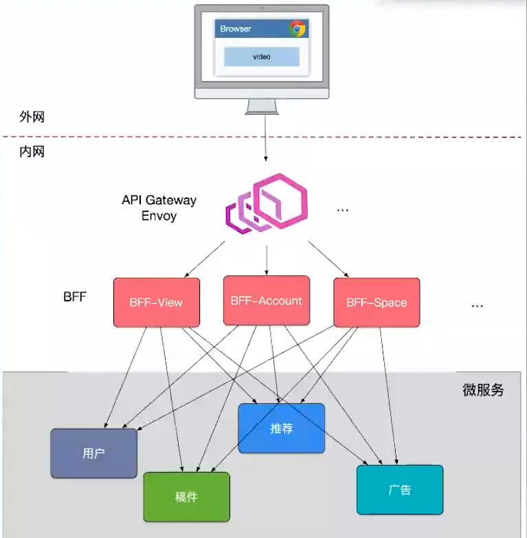
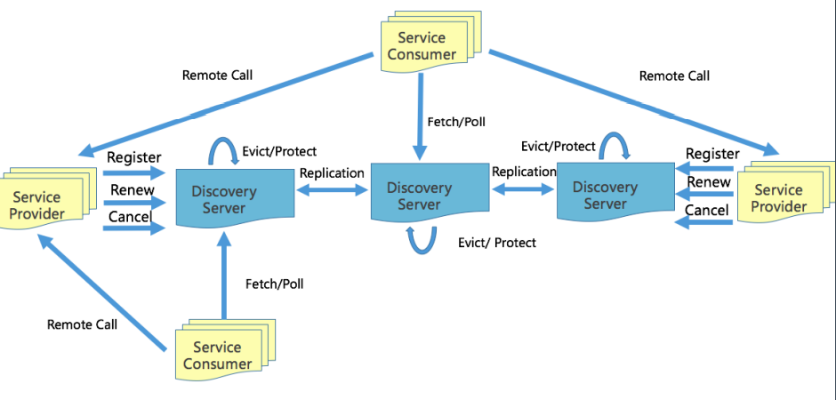
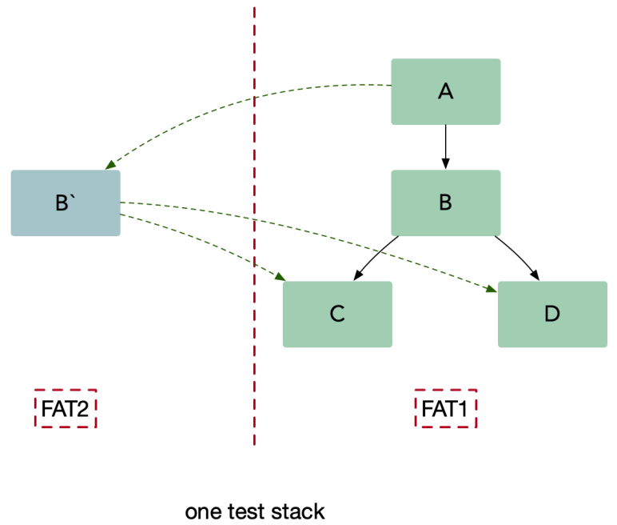
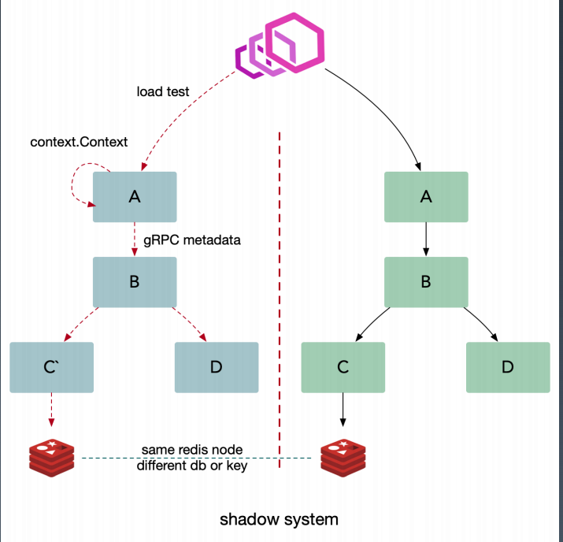

# 微服务

## 概览

微服务容易弹性伸缩，可以提高服务的可用性。对于大型应用系统，如果采用单体应用架构，开发人员可能不能完全搞懂整个系统，导致开发效率低，应用扩展难，可靠性低。而微服务可以让开发人员各司其职，专注于自己的服务，服务间也可以独立开发，提升开发和部署的敏捷性。

不同于单体应用使用一个大数据库，每个微服务使用的数据库可以是分开的，这样可以减少数据库的压力，不过，当某个服务需要其他服务的数据时，就需要通过网络（RPC/HTTP）去访问其他服务。

**微服务可以看作是Service-Oriented Architecture(SOA) 的一种实践**，小的服务代码少，bug也少，易测试、维护，更容易迭代更新。

**可移植性比效率更重要**，语言绑定会增加应用扩展的难度。

微服务也有一些不足：

- 微服务应用是一个分布式系统，服务间的通信会带来很大的网络开销和时延，需要处理通信过程中的异常和服务不可用等问题，增加了复杂度。
  调用其他服务的接口时，提供一个batch化接口 比 用一个`for`循环调用多次接口开销更小。大多数时候，调用的接口可能没有顺序依赖，可以同时调用多个，而不是串行化调用。
- 由于每个微服务使用自己的数据库，而同时更新多个业务主体的事务很普遍，就需要更新不同服务使用的不同数据库，增加了事务支持的难度，甚至会增加请求处理时间。
- 由于服务间有相互的依赖，服务数量多，测试微服务应用比单体应用复杂。应用的升级可能波及多个服务模块的修改。


**微服务的去中心化：**

- 数据去中心化：每个服务独享自身的数据存储（缓存、数据库等），隔离相关干扰
- 治理去中心化
- 技术去中心化


## 设计

### API Gateway

微服务流量的统一入口，可以防止客户端与微服务直接通信带来的强耦合。

网关做聚合接口，客户端就不需要多次请求，降低延迟，同时不用考虑某个请求失败时的降级处理。

网关可以统一不同服务的协议，统一做安全认证、限流。


#### Backend For Frontend

**面向前端的业务**提供后端的接口，而不是面向资源。

聚合接口，提供粗粒度API，方便前后端交互。可以提供差异服务，针对终端定制化API，数据裁剪、聚合。

BFF 也需要多个，根据业务拆分，例如账号BFF、管理BFF等，而不是单个BFF与所有微服务对接。


#### 跨横切面功能

路由、认证、限流、安全等功能，上沉到无状态的API Gateway。BFF层可以更加专注业务逻辑交付。



> API Gateway上面还有CDN、4/7层负载均衡

API Gateway 对用户身份认证成功后，通过JWT将用户信息带到BFF层，BFF层校验后直接把身份信息注入到微服务的Context中，例如直接在BFF 往 微服务的RPC请求中带入用户信息（UserID）。

上面是针对外网的访问，需要做**身份认证**。内部微服务之间的相互调用，也需要做**授权**。

- Full Trust：微服务双方知道对方身份，通过tls链接通信
- Half Trust：微服务双方知道对方身份，没有加密通信
- Zero Trust：微服务双方不知道对方身份，没有加密通信，相当于“裸奔”


### 微服务划分

**通过 业务职能(business capability) 或 DDD的限界上下文(bounded context) 划分微服务。**

- 业务职能：由公司内部不同部门提供的职能，例如客户服务部门提供客户服务的功能，财务部门提供财务相关的职能
- 限界上下文：DDD中用来划分不同业务边界的元素。业务边界是”解决不同业务问题“的问题域和对应的解决方案域，为了解决某种类型的业务问题，贴近领域知识，也就是业务。


#### CQRS

Command Query Responsibility Segregation，将应用程序分为两部分：命令端(Command) 和查询端(Query)。 命令端处理程序创建，更新和删除请求，并在数据更改时发出事件。 查询端通过执行查询来处理查询，并且通过订阅数据更改时发出的事件流而保持最新。


## gRPC & 服务发现

### 健康检查

gRPC提供了标准的健康检测协议，用于检测**消费者与提供者间的网络情况和服务提供者的状态**。

在k8s中，可以通过liveness和readiness检测服务的状态。

通过健康检查，可以实现**平滑发布**：

1. k8s向 服务发现仓库 发起注销请求
2. k8s向应用发送SIGTERM信号，进入优雅退出过程（健康检查接口 标记为失败）
3. 其他客户端在2个心跳周期内（最差，一般是实时的）退出
4. k8s退出超时（一般设置10-60s），SIGKILL强制退出应用


### 服务发现

服务发现可以牺牲一致性，但一定要保证可用性和分区容错。

对于 注册/注销 的事件延迟，满足最终一致性即可。


#### 客户端发现

服务实例启动时，注册到服务仓库，每个服务实例同时有一个服务仓库的客户端，保存其他服务实例的地址。每次调用其他服务的接口时，需要通过负载均衡算法选择一个可用的实例发送请求。

优点是直连，比服务端发现少一次网络跳转，但需要内置非业务逻辑（服务发现）。


#### 服务端发现

类似k8s的Service，服务实例发送请求到一个LB，LB查询服务注册表，然后将请求路由到可用的服务实例上。

服务实例无需考虑非业务逻辑，支持异构语言，但需要基础设施的支撑，并且有一定的性能损失。


#### Eureka

通过 Family(appid) 和 Addr(IP:Port) 定位实例，除此之外还可以附加更多的元数据：权重、染
色标签、集群等。

> appid: 使用三段式命名，`business.service.xxx`



Eureka 属于ap模型，即最终一致性的，每个Discovery Server都是master，都有全量数据，master间通过广播传播 注册/注销 事件，这些事件有时间戳，如果Server收到的广播事件包含的服务实例与其已有的相同，但本地的时间戳更大，说明本地的更新，就会告知对方自己的与该服务实例相关的信息，让对方更新，以此实现最终一致性。

Provider 注册后定期(30s)心跳一次，注册，心跳，下线都需要进行同步，注册和下线需要进行长轮询推送。新启动节点，需要 load cache，JVM 预热。Eureka故障时，Provider 不建议重启和发布，否则由于连不上Eureka，服务启动会失败。

Consumer 启动时拉取实例，发起30s长轮询（发起一个请求，如果没有服务上下线，Eureka Server就不返回响应，直到请求超时客户端再发一个新的请求）。故障时，需要 client 侧 cache 节点信息。

Eureka Server 定期(60s) 检测失效(90s)的实例，失效则剔除。短时间里丢失了大量的心跳连接(15
分钟内心跳低于期望值*85%)，开启自我保护，保留过期服务不删除。因为可能是Eureka Server 与 Provider之间的网络出现问题，但Provider 与 Consumer之间网络正常。

如果Consumer 与 Server网络出现问题，由于Consumer之前已经从Server获取服务信息，因此影响不大，只是出现短暂的延迟（假设很快就能恢复）。

Consumer与Provider 之间网络出现问题，是通过rpc的health check检测出来的，rpc就会将Provider从LB中剔除，因此也没问题。


## 多集群 & 多租户

### 多集群

从单一集群考虑，多个节点保证可用性，通常使用N+2的方式冗余节点。

但要是整个集群出现了问题，例如单个机房内产生故障，将对整个服务产生影响，所以考虑冗余多套集群。

> 多集群指在同一个机房内，不同机房的多套集群为异地多活。

因此可以为每个大类的业务服务搭建一套服务集群，例如直播业务、游戏业务各搭一套集群，这样提供的服务能力更强大，即使某个集群挂了，也可以将使用该集群的服务流量切到其他集群。

同时cache也为每个集群冗余一份，而不是共有同一个cache。DB主库只有一个。现在应用冗余、cache也冗余，业务域也隔离了。

不同业务的数据是正交的，即相同的数据很少，例如直播的人不打游戏，当用于直播的集群发生故障，切到用于游戏的集群后，会导致大量的cache miss，请求都打到了DB。**为了让每个集群的cache里面包含各种业务的数据，可以让客户端的请求负载均衡到每个集群上，而不是根据业务路由到指定集群。**

对于cache miss的数据，每个集群处理自己的；对于数据库更新的数据，通过订阅binlog，异步广播更新到每个集群的cache。


#### 大规模集群的health check问题

由于多套物理资源统一为一套逻辑集群，即gRPC客户端默认忽略服务发现中的cluster信息，按照全部节点，全部连接。长连接会导致比较大的内存和CPU开销，而短连接会造成极大的资源成本和延迟。

因此使用Google提出的**Subset算法**，对整个集群划分子集，每个客户端只连接子集里面的服务端。

- 通常20-100个后端，部分场景需要大子集，比如大批量读写操作
- 后端平均分给客户端
- 客户端重启，保持重新均衡，同时对后端重启保持透明，同时连接的变动最小

```
def Subset(backends, client_id, subset_size):
  subset_count = len(backends) / subset_size # 一共多少个subset
  
  # 将客户端分组，每个组使用相同的shuffled list
  round = client_id / subset_count
  random.seed(round)
  random.shuffle(backends)
  
  subset_id = client_id % subset_count
  start = subset_id * subset_size
  return backends[start:start+subset_size]
```


### 多租户

在一个微服务架构中允许多系统共存是利用微服务稳定性以及模块化最有效的方式之一，这种方式一般被称为多租户(multi-tenancy)。租户可以是测试，金丝雀发布，影子系统(shadow systems)，甚至服务层或者产品线，使用租户能够保证代码的隔离性并且能够基于流量租户做路由决策。

对于传输中的数据(data-in-flight)（例如，消息队列中的请求或者消息）以及静态数据(data-at-rest)（例如，存储或者持久化缓存），租户都能够保证隔离性和公平性，以及基于租户的路由机会。


#### 测试环境

并行测试需要一个和生产环境一样的过渡(staging)环境，并且只是用来处理测试流量。在并行测试中，工程师团队首先完成生产服务的一次变动，然后将变动的代码部署到测试栈。这种方法可以在不影响生产环境的情况下让开发者稳定的测试服务，同时能够在发布前更容易的识别和控制 bug。尽管并行测试是一种非常有效的集成测试方法，但是它也带来了一些可能影响微服务架构成功的挑战：

- 混用环境导致的不可靠测试。
- 多套环境带来的硬件成本。
- 难以做负载测试，仿真线上真实流量情况。


通过**染色发布**，可以把待测试的服务 B 在一个隔离的沙盒环境中启动，并且在沙盒环境下可以访问集成环境(UAT) C 和 D。我们把测试流量路由到服务 B，同时保持生产流量正常流入到集成服务。服务 B 仅仅处理测试流量而不处理生产流量。另外要确保集成流量不要被测试流量影响。生产中的测试提出了两个基本要求，它们也构成了多租户体系结构的基础：

- 流量路由：能够基于流入栈中的流量类型做路由。
- 隔离性：能够可靠的隔离测试和生产中的资源，这样可以保证对于关键业务微服务没有副作用。
- 灰度测试成本代价很大，影响 1/N 的用户，其中 N 为节点数量。



> FAT：Feature Auto Test


#### shadow system

为了防止压测某个服务的时候，产生的数据影响线上已有的生产数据，引入影子系统。在往redis写数据时，在key之后加入固定前后缀，或者使用不同的db。对于MySQL，可以在 影子库/表（原来的表名加固定前后缀） 操作数据，对数据表做的DDL，也同步到影子表。对于消息队列，也可以在message中添加metadata，以影响消息队列对该消息的处理。




给入站请求绑定上下文(如: http header)， inprocess 使用 context 传递，跨服务使用metadata 传递(如: opentracing baggage item)，在这个架构中每一个基础组件都能够理解租户信息，并且能够基于租户路由隔离流量，同时在我们的平台中允许对运行不同的微服务有更多的控制，比如指标和日志。在微服务架构中典型的基础组件是日志，指标，存储，消息队列，缓存以及配置。基于租户信息隔离数据需要分别处理基础组件。

多租户架构本质上描述为：**跨服务传递请求携带上下文(context)，数据隔离的流量路由方案。**

利用服务发现注册租户信息，注册成特定的租户。


