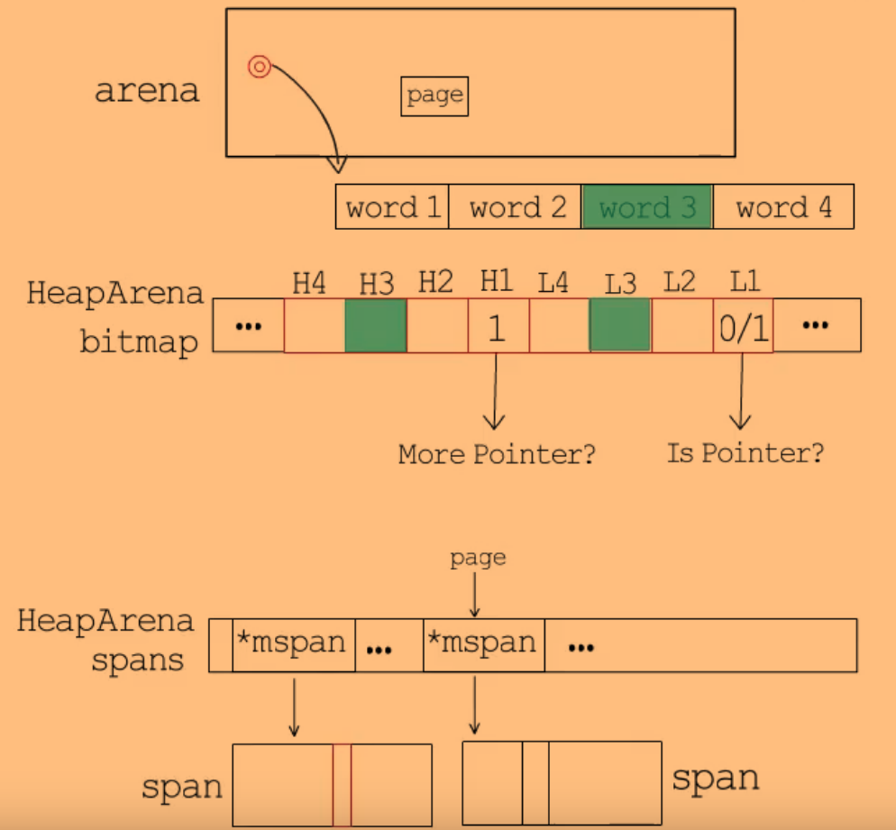
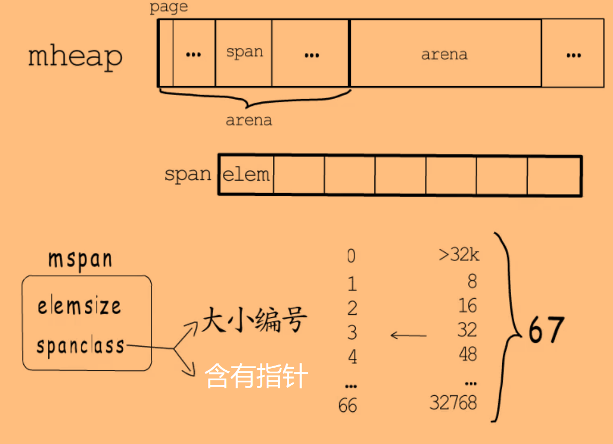
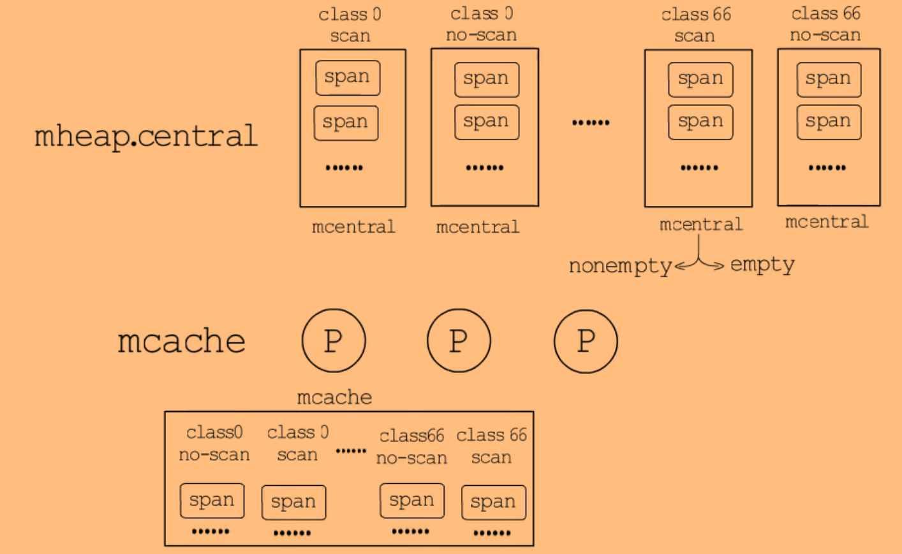
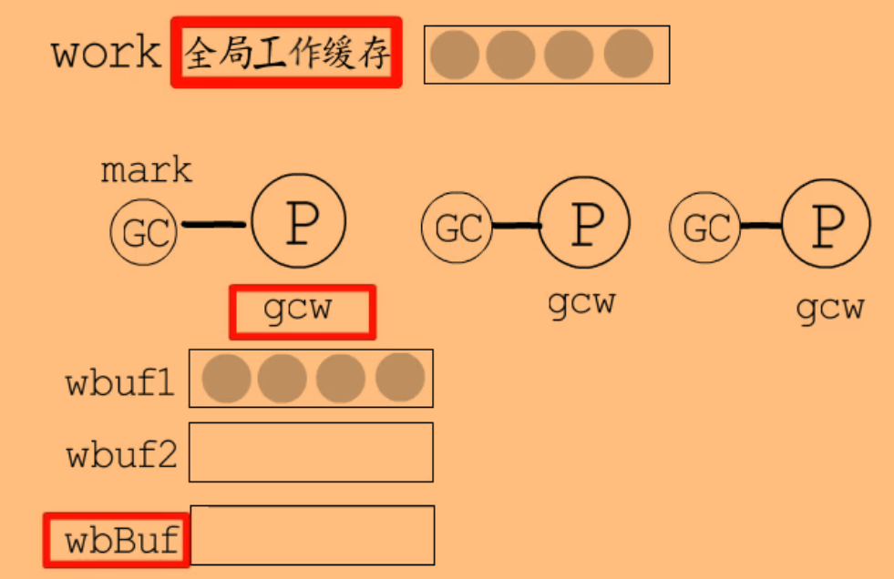
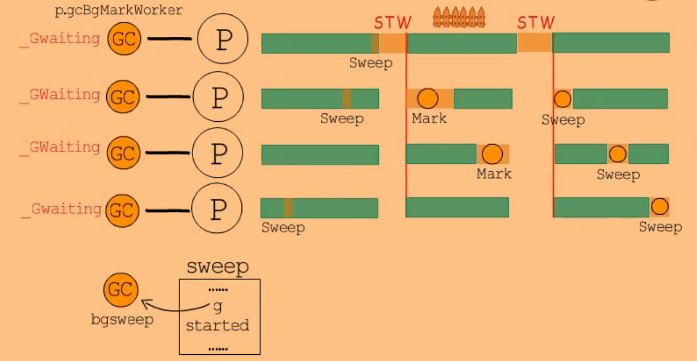

# GC

GC是针对堆上的内存分配而言的，对于不能在编译阶段确定大小或生命周期超出当前函数的数据对象，它们的内存不适合分配在栈上，而应该分配到堆上。

对于栈上分配的变量，随着函数的结束，栈帧被清理的时候变量所占用的内存也就被释放了。

而随着程序的运行，一些分配在堆上的变量已经没用了，这时需要GC才能将它们清理掉。


## 区分垃圾

在堆上使用的对象，肯定是从栈、数据段这些根节点追踪得到的数据，追踪不到的数据，就肯定不会再使用了。

主流的垃圾回收算法都是使用“可达性”近似等价于“存活性”。标记-清扫 算法的核心思想就是把栈和数据段上的数据对象作为root，基于它们进一步追踪，标记追踪到的数据，追踪不到的就是垃圾。


## 回收算法

### 标记-清扫

#### 三色回收

一开始所有对象都是**白色**，追踪栈和数据段上的对象时，将它们标记为**灰色**，对灰色对象展开追踪，追踪完之后将灰色对象标记为**黑色**。当没有灰色节点时，标记工作就可以结束了，此时所有对象要么是白色，要么是黑色，白色的就可以认为是垃圾。

灰色：扫描到，但追踪未结束

黑色：扫描到，并且追踪完成，存活数据


这种方法思想简单，但是容易造成内存碎片化。因此将内存块划分为多种大小的规格，对相同规格的内存块统一管理。


### 标记-整理

通过在标记后，移动非垃圾数据，实现紧凑的内存利用，解决内存碎片化问题。但是开销大，需要多次扫描和移动数据。

除了原地式整理，还有**复制式回收**的方法，将内存平分为`From`和`To`两部分，每一部分大小只有堆的一半。程序运行时使用`From`空间，在垃圾回收的扫描时，直接将非垃圾数据从`From`空间复制到`To`空间。最后二者角色互换，`From`变为`To`，`To`变为`From`。通常会和其他垃圾回收算法搭配使用，只对一部分堆内存使用复制式回收。


### 分代回收

> 弱分代假说：大部分对象都在年轻时死亡

将刚创建的对象称为新生代对象，将经历过多次GC但还存活的对象称为老年代对象。

基于弱分代假说，新生代对象成为垃圾的概率高于老年代对象。可以降低老年代对象的回收频率，不用每次都处理所有数据，可以提高回收效率。

新生代和老年代可以采用不同回收策略。


### 引用计数回收

在程序运行中，会不断更新对象被引用的计数，当计数为0时，就可以将其回收。垃圾识别的开销分摊到了每一次对数据对象的操作中。

缺点：高频率的计数更新会带来不小的开销，对于循环引用（A引用B，B引用A），即使A和B已经没有被引用了，但它们的引用计数还是1，就无法被回收。


## STW

为了减少GC时STW的时间，可以将GC分为多次完成，让用户程序与垃圾回收交替执行，即增量式垃圾回收。

但是有可能在交替执行的过程中，出现GC将对象A从灰色标记为黑色，即追踪完它的每个数据对象了，之后用户出现修改了A，让其指向了一个新对象B（白色）。如果允许这样的情况出现，就会在之后的内存回收中将B回收掉。


### 三色不变式

为了防止出现黑色对象引用白色对象，且该白色对象没有被灰色对象引用的情况，提出了三色不变式。

- 强三色不变式：禁止出现黑色对象对白色对象的引用
- 弱三色不变式：允许出现黑色对象对白色对象的引用，但是该白色对象必须可以通过灰色对象抵达

实现强/弱三色不变式的通常做法是**建立读写屏障**。

- 写屏障 会在写操作中插入指令，让数据对象的修改通知到垃圾回收器，因此写屏障会有一个记录集（顺序存储or哈希表）。

  强三色表达式不允许黑色对象对白色对象的引用，可以在写入黑色对象对白色对象的引用时，将白色对象标记为灰色，或将黑色对象退回灰色。这属于 插入写屏障。

- 删除写屏障，用于弱三色不变式，删除灰色对象到白色对象的引用时，可以把白色对象标记为灰色

- 非移动式回收算法不需要读屏障。对于复制式回收器，通过移动数据避免碎片化，会导致在GC和用户程序的交互执行时，给读数据带来不安全。例如对象A已经从`From`区复制到`To`区，另一个对象B操作了对象A在`From`区的陈旧对象，等到`From`空间被回收后，新的`From`空间里的B对原`From`空间的A的访问就会出错。通过建立读屏障，可以保证用户程序不会访问已经存在新副本的陈旧对象


### 多核

- **并行**垃圾回收：多线程下，STW后多线程并行执行垃圾回收程序，涉及到分工、线程间的同步、避免重复处理的问题。
  例如复制式回收器，要避免不同线程重复复制同一个数据对象。
- **并发**垃圾回收：用户程序与垃圾回收程序并发执行
  - 主体并发式：某些阶段采用STW，在其他阶段支持并发。可以同步各线程间写屏障的开启
    
  - 主体并发增量式：基于主体并发，支持增量回收
    


## golang的GC

使用标记-清扫算法，支持主体并发增量式，使用插入与删除两种写屏障结合的**混合写屏障**。


### 堆内存

#### 结构

`mheap`管理了虚拟地址空间中一大段连续的内存，通常说的从堆内存分配空间，就是从这里分配。

一页为8KB，多个页组成一个span，多个span组成一个arena。



每个arena对应一个HeapArena结构体，该结构体有一个bitmap，这个bitmap的一个字节可以标记arena中连续4个指针大小的内存，每个word对应一个高位和一个低位，分别表示是否需要继续扫描 和 是否为指针。bitmap的信息在分配内存时设置，会使用对应类型的类型元数据中的`gcdata`。

HeapArena还有一个`spans`字段，它是一个`*mspan`数组，记录当前arena中每一页所在的span。




每个span（对应`mspan`结构体）存储一种大小的元素，一共有66种大小的规格，覆盖了从8B到32KB的范围，对于大小超过32KB的大对象，就会直接在`mheap`中分配。

span根据大小编号和是否含有指针进行分类，类别存储在`spanclass`字段，这是一个8位无符号数，最低位存储是否含有指针（scan or no-scan），高7位存储大小编号。一共有$67 * 2 = 134$种span。

> 在申请内存空间时，每种类型的类型元数据中有一个`prtdata`字段，就表示要申请的类型是否为指针。根据类型大小及`ptrdata`，就可以知道要分配哪种span了。

no-scan类型的span不会被GC扫描，即使该span里的元素存储了堆上某个对象的地址，这个对象也不会被垃圾回收追踪到。


#### 内存分配

如果协程申请内存时都直接与`mheap`交互，会带来很大的同步开销。

golang提供了本地与全局的的span缓存：

- 通过`mheap.central`提供全局span缓存，每一个`central`管理一种类型的span，并分别管理有空闲和没有空闲的span
- 每个P使用`mcache`作为本地span缓存，同样对每种类型的span进行管理




### 准备阶段

golang在Mark Setup阶段，会为每个P创建一个mark worker goroutine，然后把这个goroutine的指针存到`gcBgMarkWorker`字段，这些后台mark worker在创建后很快就陷入休眠，直到标记阶段才会得到调度执行。

```
runtime.p跟GC相关的字段
    // Per-P GC state
	gcAssistTime         int64    // Nanoseconds in assistAlloc
	gcFractionalMarkTime int64    // Nanoseconds in fractional mark worker (atomic)
	gcBgMarkWorker       guintptr // (atomic)
	gcMarkWorkerMode     gcMarkWorkerMode

	// gcMarkWorkerStartTime is the nanotime() at which this mark
	// worker started.
	gcMarkWorkerStartTime int64

	// gcw is this P's GC work buffer cache. The work buffer is
	// filled by write barriers, drained by mutator assists, and
	// disposed on certain GC state transitions.
	gcw gcWork

	// wbBuf is this P's GC write barrier buffer.
	//
	// TODO: Consider caching this in the running G.
	wbBuf wbBuf
```


### 标记阶段

全局变量`gcphase`标识GC所处阶段，在标记阶段，`gcphase=_GCMARK`，全局变量`writeBarrier`记录了是否开启写屏障，`gcBlackenEnabled`用于标识是否允许进行GC标记工作。

```
// 标记阶段内部的状态
const (
	_GCoff             = iota // GC not running; sweeping in background, write barrier disabled
	_GCmark                   // GC marking roots and workbufs: allocate black, write barrier ENABLED
	_GCmarktermination        // GC mark termination: allocate black, P's help GC, write barrier ENABLED
)

var writeBarrier struct {
	enabled bool    // compiler emits a check of this before calling write barrier
	pad     [3]byte // compiler uses 32-bit load for "enabled" field
	needed  bool    // whether we need a write barrier for current GC phase
	cgo     bool    // whether we need a write barrier for a cgo check
	alignme uint64  // guarantee alignment so that compiler can use a 32 or 64-bit load
}

// gcBlackenEnabled is 1 if mutator assists and background mark
// workers are allowed to blacken objects. This must only be set when
// gcphase == _GCmark.
var gcBlackenEnabled uint32
```

在Stop The World的情况下开启写屏障，等所有准备工作完成后，Start The World，此时所有P都知道写屏障已经开启。每个P的后台mark worker就可以得到调度执行，开始标记工作。（主体并发）

当标记工作结束后，再一次Stop The World，GC进入标记结束阶段（`gcphase=_GCmarktermination`），确认标记工作已完成后，将`gcBlackenEnabled`置为0。

然后进入`_GCoff`阶段，关闭写屏障，准备开始清扫。

> 在进入`_GCoff`阶段前，新分配的对象会直接标记为黑色。
>
> 进入`_GCoff`阶段后，新分配的对象就被标记为白色了。


#### 指针的判断

标记阶段会从bss段、数据段、协程栈这些root节点开始扫描，追踪到堆上的节点，首先需要判断root节点是否为GC感兴趣的指针，及这些指针是否指向了堆上。

对于不同的段，判断节点是否为指针有不同的方法：

- bss段和数据段的元数据在编译阶段生成，存储在可执行文件，通过各模块的moduledata可以获得`gcdatamask`、`gcbssmask`等信息，用于判断特定root节点是否为指针
- 协程栈的元数据存储在stackmap中，通过它可以知道栈上的局部变量、参数、返回值等对象是否为存活的指针

对于指针对象，如果它们指向了堆上的变量，就把它们加入到GC工作队列中，以进行进一步的扫描。

对于堆上的节点，有两种方法判断是否为指针：

- 根据对象地址查HeapArena结构体的`bitmap`，就可以知道这个地址所存对象是否为指针
- 根据对象地址计算其所在页，根据HeapArena结构体的的`spans`得到该页所在span，根据span类型就知道是否为指针。每个span对应两个位图标记，`allocBits`和`gcmarkBits`，分别用于标记一个存储单元 是否已分配 和 是否存活。当扫描到堆上的对象时，就会将其对应的`gcmarkBits`置为1，标记为灰色，并将其加入到工作队列中。


#### 工作队列

有一个全局变量`work`存储全局工作队列缓存，每个P也有一个本地工作队列，本地工作队列有两个`workbuf`，添加任务时会加入`wbuf1`，`wbuf1`满了就交换两个`workbuf`，如果交换后还是满的，就会把当前`wbuf1`的工作flush到全局工作缓存中。



后台mark worker执行标记工作时，就会消耗工作队列，同时会均衡本地和全局工作队列。如果本地队列空了，就从全局工作缓存中获取任务到本地队列。如果全局工作队列空了：

- 如果`wbuf2`不为空，就把它flush到全局工作队列
- 否则，如果`wbuf1`大小大于4，就把一半的`wbuf1`flush到全局工作队列

并且每个P都有一个写屏障缓冲区`wbBuf`，所以写操作发生时，不会直接操作工作队列，而是把相关指针写入到P的写屏障缓冲区。当写屏障缓冲区已满，或mark worker通过工作队列获取不到任务时，就会把写屏障缓存区的内容flush到工作队列。


#### CPU使用率

GC默认的CPU目标使用率是25%，之所以要控制CPU使用率，是为了尽量减少GC对程序业务的正常运行的影响。在GC的初始化阶段，会用`gomaxprocs`乘以25%，得到需要启动的mark worker数量。但是可能得到不是整数的worker数量，为此GC引入两种工作模式，将工作模式记录在P的`gcMarkWorkerMode`字段，作为这个P的mark worker的工作模式。

- Dedicated：一直执行标记任务，免于抢占。
  如果`gomaxprocs=1`，就只需要启动一个Dedicated模式的mark worker
- Fractional：可以被抢占，或在达到fractional部分的目标`fractionalUtilizationGoal`时主动让出。
  如果`gomaxprocs=6`，就需要启动一个Dedicated模式的mark worker和一个Fractional模式的mark worker，且`fractionalUtilizationGoal = 6/4 - 1 = 0.5`，这会由所有P共同负责。而对于每个P，`fractionalUtilizationGoal`就等于`0.5/6= 1/12`

有一个`gcControllerState`类型的全局变量`gcController`，当调度器执行`findRunnableGcWorker`恢复后台mark worker时，就要设置worker运行的模式，如果此时`dedicatedMarkWorkersNeeded`还大于0，就会设置工作模式为dedicated，并将`dedicatedMarkWorkersNeeded`减一。如果`dedicatedMarkWorkersNeeded`已经为0，就会看`fractionalUtilizationGoal`是否大于0，大于0才会去设置一个fractional工作模式的worker。

```
var gcController gcControllerState
type gcControllerState struct {
    ...
    markStartTime // 本轮GC开始的时间
	dedicatedMarkWorkersNeeded int64 // 需要的dedicated Mark Worker数量
	fractionalUtilizationGoal float64 // 例如上面计算的1/12
}
```

对于Fractional 模式的P，它会记录自己累计执行Fractional work的时间，每完成一定量工作就会检查 fractional模式的工作时间与本轮GC标记工作已经执行的时间的比例，是否达到`fractionalUtilizationGoal`，如果达到了就可以让出。


#### GC Assist

如果goroutine要分配内存，但标记工作还没完成，这个goroutine就要负担一部分标记工作。要申请的内存越大，对应要负担的标记任务就越多，类似一种借贷偿还机制。当前G要申请的内存大小 就对应 它需要负担的债务的大小。

如果当前G的`gcAssistBytes`小于0，在成功申请内存前就需要协助GC完成一些标记工作。

而mark worker每完成一定量标记任务，就会在全局变量`gcController`存一笔信用到`bgScanCredit`，需要偿还债务的G可以从这里steal尽量多的信用来抵消债务。

不管是真正执行标记扫描任务，或是从`gcController`steal信用，在偿还债务后，若还有剩余，就可以用于抵消下次内存分配的债务了。

GC标记阶段中的每次内存分配，都会触发Assist检查是否需要辅助**标记**。而到了清扫阶段，内存分配就会触发Assist检查是否需要辅助**清扫**。分配大内存时，为了维持堆内存分配量`heap_live`与清扫页面数量`page sweep count`的线性关系，可能需要执行一定量的内存清扫工作。或者从P的本地缓存获取一个span时，如果该可用span尚未清扫，也需要先清扫再分配使用。


### 清扫阶段

执行清扫的goroutine由`runtime.main`在`gcenable`中创建，其指针存在全局变量`sweep`中，在清扫阶段，这个后台sweeper就会被加入到run queue，当它被调度时就会开始清扫，这里是增量式清扫，即不是一次性完成清扫任务，而是在每次得到调度时清扫一部分。

```
var sweep sweepdata

type sweepdata struct {
	lock    mutex
	g       *g
	parked  bool
	started bool

	nbgsweep    uint32
	npausesweep uint32

	// centralIndex is the current unswept span class.
	// It represents an index into the mcentral span
	// sets. Accessed and updated via its load and
	// update methods. Not protected by a lock.
	//
	// Reset at mark termination.
	// Used by mheap.nextSpanForSweep.
	centralIndex sweepClass
}
```

由于是增量式清扫，每一轮GC开始前，还要确保完成上一轮GC未完成的清扫工作。


### 总体流程状态



可以发现，只有两次必要的STW，标记与清扫工作并发增量式执行。


### 触发时机

- 手动调用`runtime.GC()`
- 在每次GC后，会设置下一次触发GC的堆内存分配量。分配内存时，如果是分配大对象或从`mcentral`获取空闲内存，就需要检查是否达到触发GC的阈值
- 监控线程sysmon强制执行GC，在runtime包的初始化中，会创建一个`forcegchelper`协程，它在创建后很快就会休眠。监控线程在检测到距离上次GC超过指定时间`forcegcperiod`时，就会把该G添加到全局run queue中，当它得到调度执行时，就开始新一轮的GC


