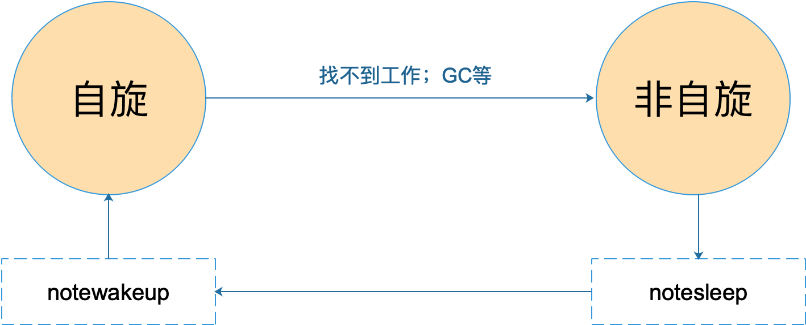

# GMP

## 程序的生命周期

以下面的代码为例，编译为一个可执行文件，执行时可执行文件被加载到内存，在代码段，程序的入口并不是`main.main`。

```
package main
func main() {
  fmtt.Println(1)
}
```

在不同平台下，程序入口也有所不同，windows下入口是`_rt0_amd64_windows`，之后会进行一系列检查与初始化等准备工作，以`runtime.main`为执行入口，创建main goroutine，在这个goroutine里面才会去调用`main.main`。

在数据段上有几个全局变量`g0、m0`，分别是主协程对应的g和主线程对应的m，g需要在m上才能运行，g有指向其运行所在的m的指针，m有指向当前正在执行的g的指针。还有一个`sched`全局变量，它代表了调度器，会保存全局G队列，记录所有空闲的m和p。

在早期的调度模型中，只有GM，有一个全局的G队列，每个M都要去这个队列中获取一个G去运行，获取G时就需要加锁，如果频繁发生调度，就会很大影响程序的并发性能。

在GMP模型中，P相当于解耦了G和M的直接关联，P有一个本地G队列，P直接跟M关联，即一个P运行在一个M上，M直接从P的本地队列取出G并运行。不过仍然有一个全局G队列，因为每个P的本地队列大小是有限的，当放不下更多的G时，新的G就会被加到全局G队列。

在程序初始化时，会根据`GOMAXPROCS`这个环境变量决定创建的P的数量，并把第一个P与`m0`进行关联。


## G

goroutine 主要保存 goroutine 的一些状态信息以及 CPU 的一些寄存器的值，例如 IP 寄存器，以便在轮到本 goroutine 执行时，CPU 知道要从哪一条指令处开始执行。

> 当 goroutine 被调离 CPU 时，调度器负责把 CPU 寄存器的值保存在 g 对象的成员变量之中。
>
> 当 goroutine 被调度起来运行时，调度器又负责把 g 对象的成员变量所保存的寄存器值恢复到 CPU 的寄存器。

```
type g struct {
    // goroutine 使用的栈
    stack       stack   // offset known to runtime/cgo
    // 用于栈的扩张和收缩检查，抢占标志
    stackguard0 uintptr // offset known to liblink
    stackguard1 uintptr // offset known to liblink
    _panic         *_panic // innermost panic - offset known to liblink
    _defer         *_defer // innermost defer
    // 当前与 g 绑定的 m
    m              *m      // current m; offset known to arm liblink
    // goroutine 的运行现场
    sched          gobuf
    syscallsp      uintptr        // if status==Gsyscall, syscallsp = sched.sp to use during gc
    syscallpc      uintptr        // if status==Gsyscall, syscallpc = sched.pc to use during gc
    stktopsp       uintptr        // expected sp at top of stack, to check in traceback
    // wakeup 时传入的参数
    param          unsafe.Pointer // passed parameter on wakeup
    atomicstatus   uint32
    stackLock      uint32 // sigprof/scang lock; TODO: fold in to atomicstatus
    goid           int64
    // g 被阻塞之后的近似时间
    waitsince      int64  // approx time when the g become blocked
    // g 被阻塞的原因
    waitreason     string // if status==Gwaiting
    // 指向全局队列里下一个 g
    schedlink      guintptr
    // 抢占调度标志。这个为 true 时，stackguard0 等于 stackpreempt
    preempt        bool     // preemption signal, duplicates stackguard0 = stackpreempt
    paniconfault   bool     // panic (instead of crash) on unexpected fault address
    preemptscan    bool     // preempted g does scan for gc
    gcscandone     bool     // g has scanned stack; protected by _Gscan bit in status
    gcscanvalid    bool     // false at start of gc cycle, true if G has not run since last scan; TODO: remove?
    throwsplit     bool     // must not split stack
    raceignore     int8     // ignore race detection events
    sysblocktraced bool     // StartTrace has emitted EvGoInSyscall about this goroutine
    // syscall 返回之后的 cputicks，用来做 tracing
    sysexitticks   int64    // cputicks when syscall has returned (for tracing)
    traceseq       uint64   // trace event sequencer
    tracelastp     puintptr // last P emitted an event for this goroutine
    // 如果调用了 LockOsThread，那么这个 g 会绑定到某个 m 上
    lockedm        *m
    sig            uint32
    writebuf       []byte
    sigcode0       uintptr
    sigcode1       uintptr
    sigpc          uintptr
    // 创建该 goroutine 的语句的指令地址
    gopc           uintptr // pc of go statement that created this goroutine
    // goroutine 函数的指令地址
    startpc        uintptr // pc of goroutine function
    racectx        uintptr
    waiting        *sudog         // sudog structures this g is waiting on (that have a valid elem ptr); in lock order
    cgoCtxt        []uintptr      // cgo traceback context
    labels         unsafe.Pointer // profiler labels
    // time.Sleep 缓存的定时器
    timer          *timer         // cached timer for time.Sleep
    gcAssistBytes int64
}
```

`g` 结构体关联了两个比较简单的结构体，stack 表示 goroutine 运行时的栈：

```
// 描述栈的数据结构，栈的范围：[lo, hi)
type stack struct {
    lo uintptr  // 栈顶，低地址
    hi uintptr  // 栈底，高地址
}
```

寄存器的值保存在了`gobuf`中：

```
type gobuf struct {  
    sp   uintptr  // 存储 rsp 寄存器的值
    pc   uintptr  // 存储 rip 寄存器的值
    g    guintptr  // 指向 goroutine
    ctxt unsafe.Pointer // this has to be a pointer so that gc scans it
    ret  sys.Uintreg // 保存系统调用的返回值
    lr   uintptr
    bp   uintptr // for GOEXPERIMENT=framepointer
}
```


### 抢占

在go1.2 ~ 1.13，通过编译器在函数调用时插入**抢占检查**指令，在**函数调用时**检查当前 Goroutine 是否发起了抢占请求，实现基于协作的抢占式调度。因此对于长时间运行，但没有调用函数的goroutine（例如`for`循环）来说，抢占不了。

go1.14实现了基于信号的抢占式调度，使用了[SIGURP信号](https://github.com/golang/proposal/blob/master/design/24543-non-cooperative-preemption.md#other-considerations)。


## M

machine，代表一个工作线程，或者说系统线程。G 需要调度到 M 上才能运行，M 是真正工作的人。

```
// m 代表工作线程，保存了自身使用的栈信息
type m struct {
    // 记录工作线程（也就是内核线程）使用的栈信息。在执行调度代码时需要使用
    // 执行用户 goroutine 代码时，使用用户 goroutine 自己的栈，因此调度时会发生栈的切换
    g0      *g     // goroutine with scheduling stack/
    morebuf gobuf  // gobuf arg to morestack
    divmod  uint32 // div/mod denominator for arm - known to liblink
    // Fields not known to debuggers.
    procid        uint64     // for debuggers, but offset not hard-coded
    gsignal       *g         // signal-handling g
    sigmask       sigset     // storage for saved signal mask
    // 通过 tls 结构体实现 m 与工作线程的绑定
    // 这里是线程本地存储
    tls           [6]uintptr // thread-local storage (for x86 extern register)
    mstartfn      func()
    // 指向正在运行的 gorutine 对象
    curg          *g       // current running goroutine
    caughtsig     guintptr // goroutine running during fatal signal
    // 当前工作线程绑定的 p
    p             puintptr // attached p for executing go code (nil if not executing go code)
    nextp         puintptr
    id            int32
    mallocing     int32
    throwing      int32
    // 该字段不等于空字符串的话，要保持 curg 始终在这个 m 上运行
    preemptoff    string // if != "", keep curg running on this m
    locks         int32
    softfloat     int32
    dying         int32
    profilehz     int32
    helpgc        int32
    // 为 true 时表示当前 m 处于自旋状态，正在从其他线程偷工作
    spinning      bool // m is out of work and is actively looking for work
    // m 正阻塞在 note 上
    blocked       bool // m is blocked on a note
    // m 正在执行 write barrier
    inwb          bool // m is executing a write barrier
    newSigstack   bool // minit on C thread called sigaltstack
    printlock     int8
    // 正在执行 cgo 调用
    incgo         bool // m is executing a cgo call
    fastrand      uint32
    // cgo 调用总计数
    ncgocall      uint64      // number of cgo calls in total
    ncgo          int32       // number of cgo calls currently in progress
    cgoCallersUse uint32      // if non-zero, cgoCallers in use temporarily
    cgoCallers    *cgoCallers // cgo traceback if crashing in cgo call
    // 没有 goroutine 需要运行时，工作线程睡眠在这个 park 成员上，
    // 其它线程通过这个 park 唤醒该工作线程
    park          note
    // 记录所有工作线程的链表
    alllink       *m // on allm
    schedlink     muintptr
    mcache        *mcache
    lockedg       *g
    createstack   [32]uintptr // stack that created this thread.
    freglo        [16]uint32  // d[i] lsb and f[i]
    freghi        [16]uint32  // d[i] msb and f[i+16]
    fflag         uint32      // floating point compare flags
    locked        uint32      // tracking for lockosthread
    // 正在等待锁的下一个 m
    nextwaitm     uintptr     // next m waiting for lock
    needextram    bool
    traceback     uint8
    waitunlockf   unsafe.Pointer // todo go func(*g, unsafe.pointer) bool
    waitlock      unsafe.Pointer
    waittraceev   byte
    waittraceskip int
    startingtrace bool
    syscalltick   uint32
    // 工作线程 id
    thread        uintptr // thread handle
    // these are here because they are too large to be on the stack
    // of low-level NOSPLIT functions.
    libcall   libcall
    libcallpc uintptr // for cpu profiler
    libcallsp uintptr
    libcallg  guintptr
    syscall   libcall // stores syscall parameters on windows
    mOS
}
```

当 M 没有工作可做的时候，在它休眠前，会“自旋”地来找工作：检查全局队列，查看 network poller，试图执行 gc 任务，或者“偷”工作。



M 只有自旋和非自旋两种状态。自旋的时候，会努力找工作；找不到的时候会进入非自旋状态，之后会休眠，直到有工作需要处理时，被其他工作线程唤醒，又进入自旋状态。


调度器最多可以创建1万个线程，但是其中大多数的线程都不会执行用户代码（可能陷入系统调用），最多只会有`GOMAXPROCS `个活跃线程能够正常运行。

默认情况下线程数等于 CPU 数，这种设置不会频繁触发操作系统的线程调度和上下文切换，**所有的调度都会发生在用户态**，由 Go 语言调度器触发，能够减少很多额外开销。


## P

processor，为 M 的执行提供“上下文”，保存 M 执行 G 时的一些资源，例如本地可运行 G 队列，memeory cache 等。

一个 M 只有绑定 P 才能执行 goroutine，当 M 被阻塞时，整个 P 会被传递给其他 M ，或者说整个 P 被接管。

```
// p 保存 go 运行时所必须的资源
type p struct {
    lock mutex
    id          int32 // 在 allp 中的索引
    status      uint32 // one of pidle/prunning/...
    link        puintptr
    schedtick   uint32 // 每次调用 schedule 时会加一
    syscalltick uint32 // 每次系统调用时加一
    // 用于 sysmon 线程记录被监控 p 的系统调用时间和运行时间
    sysmontick  sysmontick // last tick observed by sysmon
    // 指向绑定的 m，如果 p 是 idle 的话，那这个指针是 nil
    m           muintptr   // back-link to associated m (nil if idle)
    mcache      *mcache
    racectx     uintptr
    deferpool    [5][]*_defer // pool of available defer structs of different sizes (see panic.go)
    deferpoolbuf [5][32]*_defer
    // Cache of goroutine ids, amortizes accesses to runtime·sched.goidgen.
    goidcache    uint64
    goidcacheend uint64
    // Queue of runnable goroutines. Accessed without lock.
    // 本地可运行的队列，不用通过锁即可访问
    runqhead uint32 // 队列头
    runqtail uint32 // 队列尾
    // 使用数组实现的循环队列
    runq     [256]guintptr
    // runnext 非空时，代表的是一个 runnable 状态的 G，
    // 这个 G 被 当前 G 修改为 ready 状态，相比 runq 中的 G 有更高的优先级。
    // 如果当前 G 还有剩余的可用时间，那么就应该运行这个 G
    // 运行之后，该 G 会继承当前 G 的剩余时间
    runnext guintptr
    // Available G's (status == Gdead)
    // 空闲的 g
    gfree    *g
    gfreecnt int32
    sudogcache []*sudog
    sudogbuf   [128]*sudog
    tracebuf traceBufPtr
    traceSwept, traceReclaimed uintptr
    palloc persistentAlloc // per-P to avoid mutex
    // Per-P GC state
    gcAssistTime     int64 // Nanoseconds in assistAlloc
    gcBgMarkWorker   guintptr
    gcMarkWorkerMode gcMarkWorkerMode
    runSafePointFn uint32 // if 1, run sched.safePointFn at next safe point
    pad [sys.CacheLineSize]byte
}
```


> 通常情况下（在程序运行时不调整 P 的个数），P 只会在上图中的四种状态下进行切换。 当程序刚开始运行进行初始化时，所有的 P 都处于 `_Pgcstop` 状态， 随着 P 的初始化（`runtime.procresize`），会被置于 `_Pidle`。
>
> 当 M 需要运行时，会 `runtime.acquirep` 来使 P 变成 `Prunning` 状态，并通过 `runtime.releasep` 来释放。
>
> 当 G 执行时需要进入系统调用，P 会被设置为 `_Psyscall`， 如果这个时候被系统监控抢夺（`runtime.retake`），则 P 会被重新修改为 `_Pidle`。
>
> 如果在程序运行中发生 `GC`，则 P 会被设置为 `_Pgcstop`， 并在 `runtime.startTheWorld` 时重新调整为 `_Prunning`。


## 三者的关系

G 需要在 M 上才能运行，M 依赖 P 提供的资源，P 则持有待运行的 G。

M 会从与它绑定的 P 的本地队列获取可运行的 G，也会从 network poller 里获取可运行的 G，还会从其他 P 偷 G。


