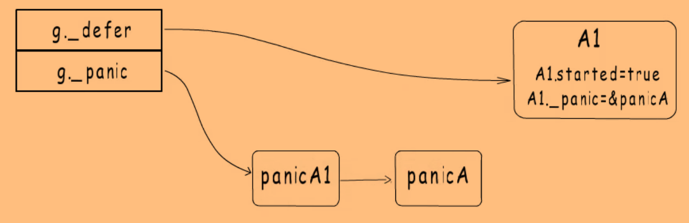

# defer 、panic、recover

## defer

### 特性

`defer`注册的函数按照**后进先出**的顺序执行。

```text
for i := 0; i < 5; i++ {
  defer fmt.Printf("%d ", i) // 4 3 2 1 0
}
```


`defer`的函数若有参数、接收者，**在调用`defer`时就会求值**，而不是在真正执行前才求值。

```
type Slice []int

func NewSlice() Slice {
    return make(Slice, 0)
}

func (s *Slice) Add(elem int) *Slice {
    *s = append(*s, elem)
    fmt.Print(elem)
    return s
}

func main() {
    s := NewSlice()
    defer s.Add(1).Add(2)
    s.Add(3)
}
```

因此上面的程序会打印`132`。


在`defer`中可以**修改函数的返回值**

```text
// Error is the type of a parse error; it satisfies the error interface.
type Error string
func (e Error) Error() string {
  return string(e)
}

// error is a method of *Regexp that reports parsing errors by panicking with an Error.
func (regexp *Regexp) error(err string) {
  panic(Error(err))
}

// Compile returns a parsed representation of the regular expression.
func Compile(str string) (regexp *Regexp, err error) {
  regexp = new(Regexp)
  // doParse will panic if there is a parse error.
  defer func() {
    if e := recover(); e != nil {
      regexp = nil // Clear return value.
      // 如果不是parse error，就会触发新的panic，继续栈的回溯（因为是其他类型的错误）
      // 虽然会在产生实际错误时改变Panic的值，不过在clash report中可以展示出原始和新的错误，因此问题根源还是可见的
      err = e.(Error) 
    }
  }()
  return regexp.doParse(str), nil
}
```


### 具体实现

> 不考虑执行函数过程触发panic的场景。

`defer`的实现已go1.12版本中的为基础，并在1.13和1.14版本中进行了一些优化。

goroutine对应的结构体定义在runtime package中，goroutine的`_defer`字段指向一个`_defer`结构体的链表，新注册的`defer`函数会被添加到该链表的链表头，执行时也是从链表头开始执行。

```
type g struct {
	......
	_panic       *_panic // innermost panic - offset known to liblink
	_defer       *_defer // innermost defer
    ......
}
```

由于不同版本的`_defer`结构体字段不同，放在下面展示。


#### go1.12

```
func B(n int) {
  print(n)
}

func A() {
	defer B(2)
	......
}
```

上面的代码在编译时对`defer`进行了展开：

```
func A() {
  // 注册defer，注册成功返回0，触发panic返回大于0的数
  r = deferproc(8, B)
  if r > 0 {
    goto ret
  }
  
  ...
  
  runtime.deferreturn()
  return
ret:
  runtime.deferreturn()
}
```

因此`defer`实际上也是一种语法糖，通过先注册后调用的方式实现延迟调用的效果。

>  `deferproc`的函数原型是`deferproc(siz int32, fn *funcval)`，`siz`是参数和返回值占用空间的大小，`fn`是一个function value。
>
>  注意到这个函数原型没有返回值，是因为Go中返回值是通过栈来传递的，而**`deferproc`函数的返回值需要放到寄存器中**（这和panic、recover有关），所以`deferproc`函数签名那里没有标明返回值。但是在`deferproc`函数最后有一个`return0()`，它会处理`deferproc`的返回值，正常情况下返回0。

因为函数`B`只有一个参数，没有返回值，因此`siz`为8（`int`类型在64位环境中占用8字节）。

因为`B(2)`没有捕获列表，编译器会进行优化，将`funcval`变量分配在只读数据段，供所有需要的地方使用。


在1.12版本中，`_defer`结构体如下：

```
type _defer struct {
  siz     int32   // 参数与返回值占用的字节数
  started bool    // 是否已执行
  sp      uintptr // 注册该defer的函数栈指针，函数通过它判断自己注册的defer是否执行完了
  pc      uintptr // deferproc的返回地址
  fn      *funcval
  _panic  *_panic
  link    *_defer // 上一个注册的defer
}
```

> `pc`字段存储的deferproc返回地址，就是上面`if r > 0`这个判断指令的地址。当defer函数执行时触发panic时，就会将`r`变量对应的寄存器的值置为大于0，从而中止defer流程，直接跳到函数的`deferreturn`。

创建一个`_defer`结构体时，会在其后面分配`siz`大小的空间用于存放参数和返回值（因此defer 函数的参数是执行defer时进行求值的），在执行函数时被拷贝到调用者参数与返回值空间。

在这个版本中，`_defer`结构体是在堆上分配的。实际上，go会预分配不同规格的defer pool，需要`_defer`结构体时就先从pool中获取，获取不到才会到堆上申请空间，用完后放回pool。这样做可以避免频繁的堆分配与回收。


##### 带捕获变量的情况

```
func A() {
  a, b := 1, 2
  defer func(b int) {
    a = a + b
    print(a, b) // 5 2
  }(b)
  a = a + b
  print(a, b) // 3 2
}
```

这里的defer函数捕获了外层函数的局部变量`a`，形成了闭包。由于`a`在初始化后还被修改过，因此`a`会逃逸到堆上，栈上和`funcval`变量存储`a`在堆上的地址。


##### 嵌套defer的情况

```
func A() {
  defer A1()
  defer A2()
  ......
}

func A1() {
  ......
}

func A2() {
  defer B1()
  defer B2()
  ......
}
```

函数`A`注册了两个defer函数，因此该goroutine的`_defer`链表为: `_defer{A2} -> _defer{A1}`（省略其它字段）。

函数`A`在执行`deferreturn`时，会先判断`_defer`链表头上的defer是不是`A`注册的（通过判断defer结构体的sp是否等于函数`A`的sp），是的话就会**保存函数调用的相关信息，然后就将其从链表移除**。

执行`A2`后，又注册了两个defer函数，现在`_defer`链表为`_defer{B2} -> _defer{B1} -> _defer{A1}`，在函数`A2`执行`deferreturn`时，同样会判断`_defer`链表的元素是不是`A2`注册的，即defer结构体的sp是否等于函数`A2`的sp。

因此执行完`B2`和`B1`后，`_defer`链表只剩下`A1`函数还未执行，但`A1`对应的defer结构体的sp不等于`A2`的sp，`A2`就可以结束了。回到函数`A`的`deferreturn`，执行`A1`，执行完成后，`_defer`链表为空，函数`A`结束。


#### go1.13

在go1.12中，由于defer结构体采用堆分配，参数要在堆栈间来回拷贝（注册时参数从栈上拷贝到堆上，执行时相反），并且使用链表保存defer信息，链表的操作比较慢。因此导致defer的效率比较低，在1.13中，通过**在栈上创建defer结构体**进行优化。

```
func A() {
  defer B(10)
  ...
}

func B(n int) {
  ...
}
```

上面的代码会被展开为：

```
func A() {
  // 在栈上分配空间
  var d struct {
    runtime._defer
    n int   // 函数B的入参
  }
  d.siz = 0
  d.fn = B
  d.n = 10
  r := runtime.deferprocStack(&d._defer) // 将栈上的defer结构体注册到goroutine的defer链表中
  ...
  runtime.deferreturn()
  return
}
```

不过，并不是所有的defer结构体都变为在栈上分配，因为对于下面的显式或隐式循环，仍然是在堆上分配空间：

```
for i < n {
  defer XXX
  i++
}

L:
if i < n {
  defer XXX
  i++
  goto L 
}
```

因此，在1.13版本中，defer结构体中增加了一个`bool`类型的`heap`字段，用于标识是否为堆分配。


#### go1.14

1.14版本引入了Open Coded Defer，即将defer函数调用的相关代码直接展开在代码段。不过同样不支持循环中的defer。

```
func A(i int) {
  defer A1(2 * i)
  if i > 1 {
    defer A2(3 * i)
  }
  ...
  return
}
```

对于defer函数`A1`，可以直接将其需要的变量定义为局部变量，然后在函数返回前用局部变量调用defer函数，省去了defer结构体的构造，同时不需要注册到defer链表的过程。

```
func A(i int) {
  var a int = 2 * i
  ...
  A1(a)
  return
}
```

但对于defer函数`A2`，因为它需要在执行阶段才能确定是否需要被调用，因此引入一个标识变量`df`，`df`的每一位用于标识一个defer函数是否要被执行。

```
func A(i int) {
  var df byte
  var a int = 2 * i
  var b int = 3 * i
  
  df |= 1
  if i > 1 {
    df |= 2
  }
  
  ...
  
  if df & 2 > 0 {
    df &= ^2
    A2(b)
  }
  if df & 1 > 0 {
    df &= ^1
    A1(a)
  }
  return
}
```


如果函数执行过程中发生panic或者`runtime.Goexit`，由于open coded方式实现的defer没有注册到链表，就需要通过栈扫描的方式发现。因此1.14版本新增了一下几个字段：

```
openDefer bool
fd   unsafe.Pointer // funcdata for the function associated with the frame
varp uintptr        // value of varp for the stack frame
framepc uintptr
```


使用这个机制还需要三个条件：

1. 没有禁用编译器优化，即没有设置` -gcflags "-N"`.
2. 函数内 `defer `的数量不超过 8 个，因为`df`变量大小为1个字节，即八个比特。且返回语句与延迟语句个数的乘积不超过 15.
3. `defer `不是在循环语句中。


## panic 与 recover

### 特性

- 当 `panic`被调用后（包括不明确的运行时错误，例如切片检索越界或类型断言失败）， 程序将立刻终止当前函数的执行，并开始回溯 Go 协程的栈，运行任何`defer`函数。 调用 `recover`将停止回溯过程，并返回传入 `panic`的实参。 由于在回溯时只有`defer`函数中的代码在运行，因此 `recover`只能在`defer`函数中才有效。
- `recover`必须在 `defer()` 函数中直接调用才有效，直接调用`recover()`或者`defer recover()`以及`defer()`调用多层嵌套调用`recover`都是无效的。
- `recover`可以终止失败的 Go 协程而无需杀死其它正在执行的 Go 协程。

```text
func server(workChan <-chan *Work) {
  for work := range workChan {
    go safelyDo(work)
  }
}

func safelyDo(work *Work) {
  defer func() {
    if err := recover(); err != nil {
      log.Println("work failed:", err)
    }
  }()
  do(work) // 即使触发了panic，该协程会被干净利落地结束，不会干扰到其它Go协程
}
```


### 原理

goroutine结构体有一个`_defer`字段和一个`_panic`字段，和defer一样，当触发新的panic时，会在`_panic`链表头插入新的panic结构体，`_panic`链表头的panic就是当前正在执行的那一个。

```
type _panic struct {
    // panic当前要执行的defer函数的参数地址
	argp      unsafe.Pointer // pointer to arguments of deferred call run during panic
	arg       interface{}    // argument to panic
	link      *_panic        // link to earlier panic
	pc        uintptr        // where to return to in runtime if this panic is bypassed
	sp        unsafe.Pointer // where to return to in runtime if this panic is bypassed
	recovered bool           // whether this panic is over
	aborted   bool           // the panic was aborted
	goexit    bool
}
```


#### 没有recover的panic

```
func A() {
  defer A1()
  defer A2()
  ...
  panic("panicA")
  ...
}
```

在触发panic时，会调用`runtime.gopanic`函数将panic A添加到panic链表，并执行defer链表。当前goroutine的这两个链表是这样的：


此时会开始执行defer链表，由于函数不是正常结束，在执行defer函数`A2`时，除了将其`started`字段置为`true`，还会将`_panic`字段指向panicA，表示该defer由这个panic触发。**`A2`正常执行结束后，defer链表中的`A2`才会被移除**。这与`deferreturn`的执行流程（保存defer结构体相关信息后就会立马将其从链表中移除）有所区别。这种先标记后释放的设计是为了应对defer函数没有正常结束的情况，可以将panic状态更新为aborted。

假设`A2`执行结束，开始执行`A1`函数，同样会其`started`字段置为`true`，将`_panic`字段指向panicA。假设`A1`函数中会触发新的panic（panic A1），那么goroutine的两个链表更新如下：



这时候又会去执行defer函数，但发现defer链表头的`A1`已经执行过，并且触发它的panic不是panic A1，而是panicA，那么就会根据`_panic`字段记录的panicA的地址，**将panicA标记为已终止（aborted）**，同时将`A1`从defer链表中移除。

此时defer链表为空，就会开始打印panic信息了，打印信息的时候是按照panic的触发顺序打印的，即从链表尾开始打印。


#### 有recover的panic

`recover`只是将当前panic链表的第一个panic元素置为recoverd状态。

```
func A() {
  defer A1()
  defer A2()
  panic("panic A")
}

func A2() {
  recover()
}
```


> 在每个defer函数执行完之后，panic处理流程会检查当前panic是否被恢复。是defer函数执行完之后，而不是里面的recover函数执行之后。

首先执行`A2`函数，会把panicA置为recovered，当`A2`函数结束后，panic处理流程发现panicA已被恢复，就会将其从panic链表中移除。同样的，`A2`也会从defer链表中移除。不过这时不会继续执行`A1`，而是通过`A2`的`sp`和`pc`字段，得到返回地址，跳出panicA的处理流程。

```
func A() {
  r := runtime.deferproc(...)
  if r > 0 {  
    goto ret
  }
  ...
  
ret:
  runtime.deferreturn()
}
```

`sp`就是函数`A`的栈指针，`pc`就是`if r > 0`这个指令的地址。通过`sp`恢复函数`A`的栈帧，通过`pc`恢复指令地址，由于是从panic中恢复过来的，`r`的值不能是0，否则就会重复执行`A`的代码。`r`的值保存在某个寄存器中，只要把它的值置为1，就会执行`goto`语句，进入`deferreturn`函数，继续执行defer链表。在执行defer链表时，会通过sp字段判断每个defer元素是否当前函数注册的，是的话才会执行。


#### recover之后触发panic

```
func A() {
  defer A1()
  defer A2()
  panic("panic A")
}

func A2() {
  recover()
  panic("panic A2")
}
```

如果一个defer函数内先通过defer恢复了panic，在返回前又触发了panic，此时的链表状态如下：


此时又会去执行defer链表，但是发现链表头的`A2`已经执行了，并且panic为panic A，就**会把panic A终止**（相当于恢复失败了），并把`A2`从defer链表中移除。这时候要运行`A1`了，就会把`A1`的panic 置为panic A2。


由于`A1`中没有`recover`，此时就会输出panic异常信息。

> 对于panic链表中已恢复但未移除的panic，打印时会加上`[recovered]`标记。

