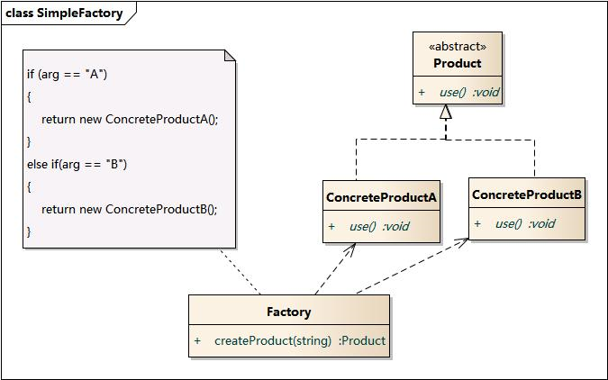

# 简单工厂模式

设计一个计算器，面向过程的做法：

```text
func GetResult(numA, numB float64, op string) float64 {
    var res float64
    switch(op) {
    case "+":
        res = numA + numB
    case "-":
        ...
    ......
    }
    return res
}
```

如果要增加新的op，就得重新编译原来的代码，万一误改了原有功能的代码，就更糟糕了。

## 实现

1. 先定义operation接口

```text
type Operation interface {
    GetResult(numA, numB float64)  float64
}
```

1. 实现具体的加减乘除struct

```text
type OperationAdd struct {
}

func(*OperationAdd) GetResult(numA, numB float64)  float64 {
    return numA + numB
}

......
```

1. 定义工厂

```text
func CreateOperation(op string) (Operation, error) {
    switch(op) {
    case "+":
        return &OperationAdd{}, nil
    case "-":
        ...
    ......
    default:
        return nil, errors.New("unknow operation")
    }
}
```

### 客户端调用

```text
if op, err := CreateOperation("+"); err != nil {
    // error handle
} else {
    fmt.Print(op.GetResult(1.0, 2.0))
}
```

## 结构图



## 好处

* 当需要修改某一种运算时，只需要去改这个运算的类，而不会影响其他的运算类
* 添加新运算时，只需要新增运算类，并在工厂类的switch中增加分支

## 坏处

* 破坏了 **开放-封闭原则**，**工厂方法模式**修复了这个问题

