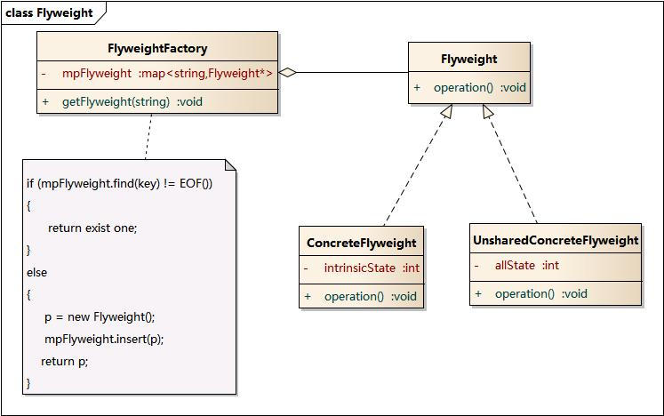

# 享元模式

**运用共享技术有效地支持大量细粒度的对象。**

## 结构图



## 实现

以共享图片对象为例，相同的图片只需要一个实例，即使在多个不同对象中使用。

首先定义图片享元：

```text
type ImageFlyweight struct {
    data string
}

func NewImageFlyweight(filename string) *ImageFlyweight {
    // 从文件系统加载图片到data
    return &ImageFlyweight{
        data: data,
    }
}

func (i *ImageFlyweight) Data() string {
    return i.data
}
```

定义享元工厂：

```text
type ImageFlyweightFactory struct {
    maps map[string]*ImageFlyweight
}

var imageFactory *ImageFlyweightFactory
var once sync.Once

func GetImageFlyweightFactory() *ImageFlyweightFactory {
    once.Do(func() {
        imageFactory = &ImageFlyweightFactory{
            maps: make(map[string]*ImageFlyweight),
        }
    })
    return imageFactory
}

func (f *ImageFlyweightFactory) Get(filename string) *ImageFlyweight {
    image := f.maps[filename]
    if image == nil {
        image = NewImageFlyweight(filename)
        f.maps[filename] = image
    }

    return image
}
```

使用图片不直接去加载图片，而是从享元工厂获取：

```text
type ImageViewer struct {
    *ImageFlyweight
}

func NewImageViewer(filename string) *ImageViewer {
    image := GetImageFlyweightFactory().Get(filename)
    return &ImageViewer{
        ImageFlyweight: image,
    }
}

func (i *ImageViewer) Display() {
    fmt.Printf("Display: %s\n", i.Data())
}
```

享元模式可以避免大量非常相似类的开销。在程序设计中，有时需要生成大量细粒度的类实例来表示数据。如果能发现**这些实例除了几个参数外基本上都是相同的**，有时就能大幅度地减少需要实例化的类的数量。**如果能把那些参数移到类实例的外面，在方法调用时将它们传递进来**，就可以提供共享大幅度地减少单个实例的数量。

## 使用时机

当一个应用程序使用了**大量的对象**，而大量的这些对象造成了很大的存储开销时；或者对象的大多数状态可以外部状态，如果删除对象的外部状态，那么可以用相对较少的共享对象取代很多组对象。

