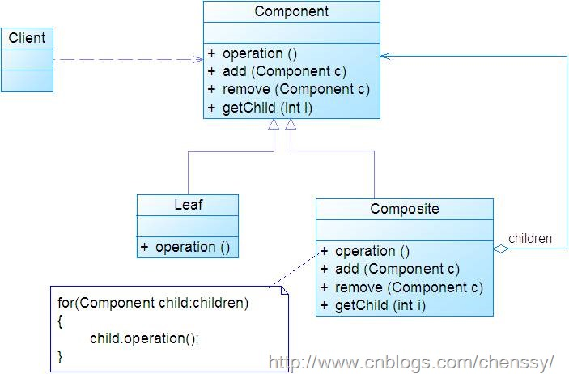

# 组合模式

**将对象组合成树形结构以表示 “部分-整体” 的层次结构。组合模式使得用户对单个对象和组合对象的使用具有一致性。**

## 结构图



## 透明方式  VS  安全方式

* 透明方式： 在`Component`中声明所有用来管理子对象的方法（包括`Add`、`Remove`等）。这样实现`Component`接口的所有子类都具备了`Add`和`Remove`。好处是 叶节点和枝节点对于外界没有区别。但问题也很明显，对于Leaf来说，实现这些管理子对象的方法没有意义。
* 安全方式： `Component`接口中不声明管理子对象的方法，而是在`Composite`中声明所有管理子对象的方法。这样做避免刚才的问题，但由于不够透明，叶节点和枝节点不具有相同接口，客户端调用时需要做相应的判断。

## 透明方式实现

先定义`Component`接口：

```text
type Component interface {
    Operation()
    Parent() Component
    SetParent(Component)
    AddChild(Component)
    Remove(Component)
}

type component struct {
    parent Component
    name   string
}

func (c *component) Parent() Component {
    return c.parent
}

func (c *component) SetParent(parent Component) {
    c.parent = parent
}

// 先不实现 添加、删除 方法， 因为叶节点不需要实现这些方法
func (c *component) AddChild(Component) {}

func (c *component) Remove(Component) {}

// 由具体子类实现具体的操作方法
func (c *component) Operation()  {}
```

实现叶子节点：

```text
type Leaf struct {
    component
}

func NewLeaf() *Leaf {
    return &Leaf{}
}

// 重写该方法
func (l *Leaf) Operation()  {
    ...
}
```

实现枝节点：

```text
type Composite struct {
    component
    children []Component
}

func NewComposite() *Composite {
    return &Composite{
        children: make([]Component, 0),
    }
}

func (c *Composite) AddChild(child Component) {
    child.SetParent(c)
    c.children = append(c.children, child)
}

func (c *Composite) Remove(child Component) {
    j := 0
    for i, v := range c.children {
        if v != child {
            c.children[j] = v
            j++
        }
    }
    c.children = c.children[:j] 
}

func (c *Composite)  Operation()  {
    for _, comp := range c.children {
        comp.Operation()
    }
}
```

创建`Component`：

```text
const (
    LeafNode = iota
    CompositeNode
)

func NewComponent(kind int) Component {
    var c Component
    switch kind {
    case LeafNode:
        c = NewLeaf()
    case CompositeNode:
        c = NewComposite()
    }

    return c
}
```

客户端调用：

```text
root := NewComponent(CompositeNode)
c1 := NewComponent(CompositeNode)
c2 := NewComponent(CompositeNode)

l1 := NewComponent(LeafNode)
l2 := NewComponent(LeafNode)

root.AddChild(c1)
c1.AddChild(c2)
c1.AddChild(l1)
c2.AddChild(l2)

root.Operation()
```

## 使用时机

需求中是**体现部分与整体层次的结构**时，希望用户可以**忽略组合对象与单个对象的不同，统一地使用组合结构中的所有对象**时，就应该考虑使用组合模式。

## 优点

* 可以定义基本对象和组合对象的类层次结构。基本对象可以被组合成更复杂的组合对象，而这个组合对象又可以被组合，这样不断地递归下去，在客户代码中，任何用到基本对象的地方都可以使用组合对象。
* 用户不用关心到底是处理一个叶节点还是组合组件，也就不用为定义组合而写一些选择判断语句。用户**可以一致地使用组合结构和单个对象**。

