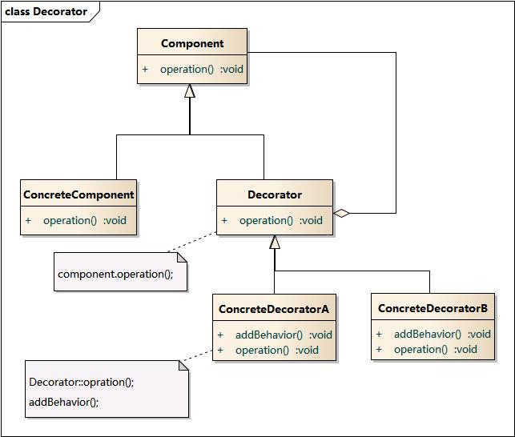

# 装饰模式

**动态地给一个对象添加一些额外的职责，就增加功能来说，装饰模式比生成子类更为灵活。**

## 实现

定义`Component`接口，以及实现该接口的具体类：

```text
type Component interface {
    Calc() int
}

type ConcreteComponent struct{}

func (*ConcreteComponent) Calc() int {
    return 0
}
```

可以通过实现`Component`接口的另一个类，`Decorate`装饰抽象类，给`Component`实例动态地添加职责。对于`Component`来说，是无需知道`Decorator`的存在的。

```text
type Decorate interface {
    Component
    SetComponent(Component)
}

type MulDecorator struct {
    Component
    num int
}

func WrapMulDecorator(num int) Component {
    return &MulDecorator{
        num: num,
    }
}

func (d *MulDecorator) SetComponent(c Component) {
    d.Component = c
}

func (d *MulDecorator) Calc() int {
    return d.Component.Calc() * d.num
}

type AddDecorator struct {
    Component
    num int
}

func WrapAddDecorator(num int) Component {
    return &AddDecorator{
        num: num,
    }
}

func (d *AddDecorator) SetComponent(c Component) {
    d.Component = c
}

func (d *AddDecorator) Calc() int {
    return d.Component.Calc() + d.num
}
```

客户端调用：

```text
var c Component = &ConcreteComponent{}
mulDecorator := WrapMulDecorator(2)
mulDecorator.SetComponent(c)

addDecorator := WrapAddDecorator(3)
addDecorator.SetComponent(mulDecorator)

addDecorator.Calc()
```

**装饰模式就是利用`SetComponent`来对对象进行包装，这样每个装饰对象的实现就和如何使用这个对象分离开了，每个装饰对象只关心自己的功能，不需要关心如何被添加到对象链当中。**

如果只有一个`ConcreteComponent`类而没有抽象的`Component`类，那么`Decorator`类可以是`ConcreteComponent`类的一个子类。

同样道理，如果只有一个`ConcreteDecorator`类，那么就没有必要建立一个单独的`Decorator`类，而可以把`Decorator`和`ConcreteDecorator`的责任合并成一个类。

## 结构图



## 何时使用

当系统需要新功能的时候，如果改变旧类，可能会新加入字段、方法和逻辑，从而增加了主类的复杂度，而**这些新功能仅仅是为了满足一些只在某种特定情况下才会执行的特殊行为的需要**。使用装饰模式，把要装饰的功能放在单独的类中，并让这个类包装它所要装饰的对象，当需要执行特殊行为时，客户代码就可以在运行时根据需要**有选择地、按顺序地**使用装饰功能包装对象。

## 优点

* 把类中的装饰功能从类中搬移去除，可以简化原有的类
* 有效地把类的核心职责和装饰功能区分开，而且可以去除相关类中重复的装饰逻辑

