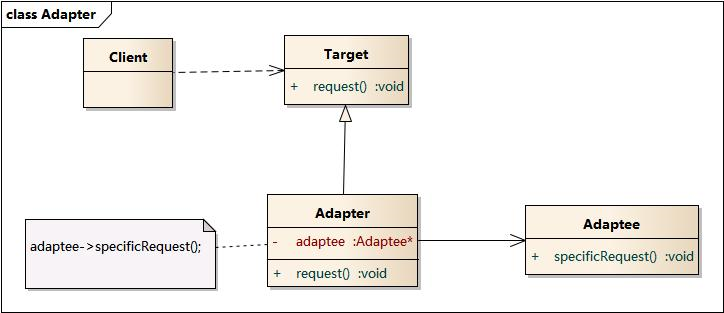

# 适配器模式

**将一个类的接口转换成客户希望的另外一个接口。使原本由于接口不兼容而不能一起工作的那些类可以一起工作。**

当系统的数据和行为都正确，但接口不符时，可以考虑使用适配器，以使控制范围之外的一个原有对象与某个接口匹配。适配器模式主要应用于希望复用一些现存的类，但是接口又与复用环境要求不一致的情况。

适配器模式又分为**类适配器模式**和**对象适配器模式**。

类适配器模式通过多重继承对一个接口与另一个接口进行匹配，不支持多重继承（即一个类只有一个父类的情况）的语言不考虑这种模式。

## 结构图



Target是客户所期待的接口，目标可以是具体的或抽象的类、接口。

## 实现

假设原有接口`Adaptee`及其实现类：

```text
type Adaptee interface { // 需要被适配的接口
    SpecificRequest() 
}

func NewAdaptee() Adaptee {
    return &AdapteeImpl{}
}

type AdapteeImpl struct {...}
func(*AdapteeImpl) SpecificRequest() {...}
```

新接口为`Target`：

```text
type Target interface {
    Request()
}
```

定义适配器：

```text
type Adapter struct {
    adaptee Adaptee
}

func NewAdapter(adaptee Adaptee) *Adapter {
    return &Adapter{
        adaptee: adaptee,
    }
}

func(this *Adapter) Request() {
    this.adaptee.SpecificRequest() // 把源接口转换成目标接口
}
```

客户端调用：

```text
adaptee := NewAdaptee()
target := NewAdapter(adaptee)
target.Request()
```

