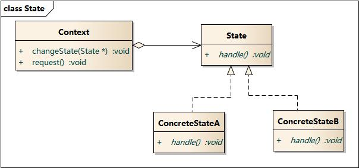

# 状态模式

**当一个对象的内置状态改变时，允许改变其行为，这个对象看起来像是改变了其类。**

主要解决当控制一个对象状态转换的条件表达式过于复杂时的情况。把状态的判断逻辑转移到表示不同状态的一系列类当中，可以把复杂的判断逻辑简化。

## 结构图



## 实现

定义状态接口：

```text
type State interface {
    Handle(Context)
}
```

实现具体状态:

```text
type ConcreteStateA struct {}
func(*ConcreteStateA) Handle(c Context) {
    if /* c满足某个条件 */ {
        ...
    } else {
        // 改变状态，并执行
        c.State = &ConcreteStateB{}
        c.Request()
    }
}

type ConcreteStateB struct {}
func(*ConcreteStateB) Handle(c Context) {
    if /* c满足某个条件 */ {
        ...
    } else {
        c.State = &ConcreteStateA{}
        c.Request()
    }
}
```

定义`Context`：

```text
type Context struct {
    state State
}
func(c *Context) Request() {
    c.state.Handle(c)
}
```

客户端调用：

```text
c := &Context{state: &ConcreteStateA{}}
c.Request()
c.Request()
```

## 好处

* 将与特定状态相关的行为局部化，并且将不同状态的行为分割到每个ConcreteState类中
* 消除了庞大的条件分支语句
* 通过定义新的状态子类，灵活增加新状态和转换

当一个**对象的行为取决于它的状态，并且它必须在运行时刻根据状态改变它的行为时**，就可以考虑使用状态模式。

