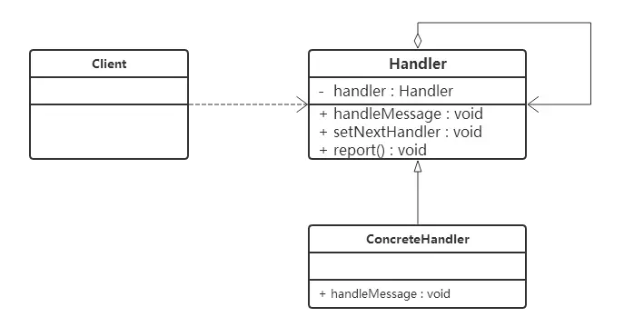

# 职责链模式

**使多个对象都有机会处理请求，从而避免请求的发送者和接收者之间的耦合关系。将这个对象连成一条链，并沿着这条链传递该请求，直到有一个对象处理它为止。**

## 结构图



## 实现

以工程资金请求为例，一共有三个角色处理资金请求，从低到高为项目经理、部门经理、总经理。当有新的请求到来时，先由低级别的经理处理，如果能处理

先定义经理这个接口：

```text
type Manager interface {
    HaveRight(money int) bool // 是否有权限对money数额的请求进行处理
    HandleFeeRequest(name string, money int) bool
}
```

定义职责链：

```text
type RequestChain struct {
    Manager
    successor *RequestChain
}

func (r *RequestChain) SetSuccessor(m *RequestChain) {
    r.successor = m
}

func (r *RequestChain) HandleFeeRequest(name string, money int) bool {
    if r.Manager.HaveRight(money) {
        // 有权限就让它处理
        return r.Manager.HandleFeeRequest(name, money)
    }
    if r.successor != nil {
        return r.successor.HandleFeeRequest(name, money)
    }
    return false
}
```

实现三种经理：

```text
// 项目经理
type ProjectManager struct{}

func NewProjectManagerChain() *RequestChain {
    return &RequestChain{
        Manager: &ProjectManager{},
    }
}

func (*ProjectManager) HaveRight(money int) bool {
    return money < 500
}

func (*ProjectManager) HandleFeeRequest(name string, money int) bool {
    if name == "bob" {
        fmt.Printf("Project manager permit %s %d fee request\n", name, money)
        return true
    }
    fmt.Printf("Project manager don't permit %s %d fee request\n", name, money)
    return false
}

type DepManager struct{}

func NewDepManagerChain() *RequestChain {
    return &RequestChain{
        Manager: &DepManager{},
    }
}

func (*DepManager) HaveRight(money int) bool {
    return money < 5000
}

func (*DepManager) HandleFeeRequest(name string, money int) bool {
    if name == "tom" {
        fmt.Printf("Dep manager permit %s %d fee request\n", name, money)
        return true
    }
    fmt.Printf("Dep manager don't permit %s %d fee request\n", name, money)
    return false
}

type GeneralManager struct{}

func NewGeneralManagerChain() *RequestChain {
    return &RequestChain{
        Manager: &GeneralManager{},
    }
}

func (*GeneralManager) HaveRight(money int) bool {
    return true
}

func (*GeneralManager) HandleFeeRequest(name string, money int) bool {
    if name == "ada" {
        fmt.Printf("General manager permit %s %d fee request\n", name, money)
        return true
    }
    fmt.Printf("General manager don't permit %s %d fee request\n", name, money)
    return false
}
```

客户端调用：

```text
c1 := NewProjectManagerChain()
c2 := NewDepManagerChain()
c3 := NewGeneralManagerChain()

c1.SetSuccessor(c2)
c2.SetSuccessor(c3)

var c Manager = c1 // 屏蔽掉SetSuccessor方法

c.HandleFeeRequest("bob", 400)
c.HandleFeeRequest("tom", 1400)
c.HandleFeeRequest("ada", 10000)
c.HandleFeeRequest("floar", 400)
```

## 好处

* 当客户提交一个请求时，请求是沿链传递直至有一个具体的handler对象负责处理它
* 接收者和发送者都没有对方的明确信息，且链中的对象自己也不知道链的结构。职责链可简化对象的相互连接，它们仅需保持一个指向其后继者的引用，而不需保持它所有的候选接收者的引用
* 可以随时修改处理一个请求的结构，增强给对象指派职责的灵活性

一个请求极有可能到了链的末端都得不到处理，或者因为没有正确配置而得不到处理，需要考虑这种情况。

