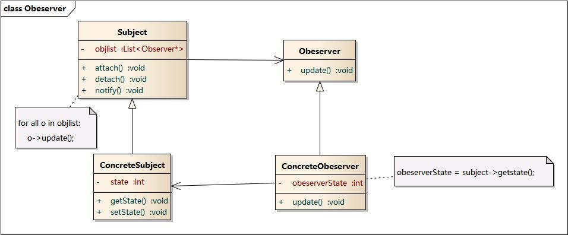

# 观察者模式（发布/订阅模式）

**定义了一种一对多的依赖关系，让多个观察者对象同时监听某一主题对象。这个主题对象在状态发生变化时，会通知所有观察者对象，使他们能够自动更新自己。**

## 结构图



## 实现

定义主题（通知者）接口：

```text
type Subject interface {
    Attach(Observer)
    Detach(Observer)
    Notify(string)
}
```

定义观察者接口：

```text
type Observer interface {
    Update(string)
}
```

实现具体`Subject`：

```text
type ConcreteSubject struct {
    message string
    observers []Observer
}

func (s *ConcreteSubject) Attach(o Observer) {
    s.observers = append(s.observers, o)
}

func (s *ConcreteSubject) Detach(o Observer) {
    j := 0
    for _, observer := range s.observers {
        if observer != o {
            s.observers[j] = observer
            j++
        }
    }
    s.observers = s.observers[:j]
}

func (s *ConcreteSubject) Notify(msg string) {
    for _, observer := range s.observers {
        observer.Update(msg)
    }
}
```

实现具体的观察者：

```text
type ConcreteObserver struct {
    subject Subject
}

func(o *ConcreteObserver) SetSubject(s Subject) {
    if o.subject != nil {
        o.subject.Detach(o)
    }
    o.subject = s
    s.Attach(o)
}
func(o *ConcreteObserver) Update(string) {...}
```

客户端调用：

```text
var subject Subject = &ConcreteSubject{}
var observer Observer = &ConcreteObserver{}
observer.SetSubject(subject)

subject.Notify("hello")
```

## 优点

* 当一个对象的改变需要同时改变其他对象时，且不知道具体有多少对象需要改变，使用观察者模式简化了工作量
* 相当于在解除耦合，让耦合的双方都依赖于抽象，而不是依赖于具体

## 缺点

* `publisher`需要依赖于`subscriber`，否则就没办法`publish`通知
* 每次通知都是调用`subscriber`的`Update`方法，但实际每个`subscriber`需要执行的可能是不同名字的方法

## 委托实现

由于订阅者类型可能很多，不要求强制实现`Observer`接口。

```text
type StockObserver struct {
    subject Subject
}
// Update方法更名
func (so *StockObserver) CloseStockMarket(string) {...}

type NBAObserver struct {
    subject Subject
}
// Update方法更名
func (no *NBAObserver) CloseNBALive(string) {...}
```

发布者不希望依赖于观察者，因此`Subject`接口不需要`Attach`和`Deatch`方法，只需要`Notify`方法。

```text
type Subject interface {
    Notify()
}
```

实现具体的发布者：

```text
type Secretary struct {
    Delegate []func(string)
}

func (s *Secretary) Notify(msg string) {
    for _, f := range s.Delegate {
        f(msg)
    }
}
```

客户端调用：

```text
var s Subject = &Secretary{}
so := &StockObserver{}
no := &NBAObserver{}

s.Delegate = append(s.Delegate, so.CloseStockMarket, no.CloseNBALive)
s.Notify("hello")
```

委托是一种**引用方法**的类型，一旦为委托分配了方法，委托将与该方法具有完全相同的行为。委托方法的使用可以像其他方法一样，具有参数和返回值。

一个委托可以搭载多个方法，所有方法被依次唤起。委托对象所搭载的方法并不需要属于同一个类，但都必须具有相同的签名（相同的参数列表和返回值类型）。

