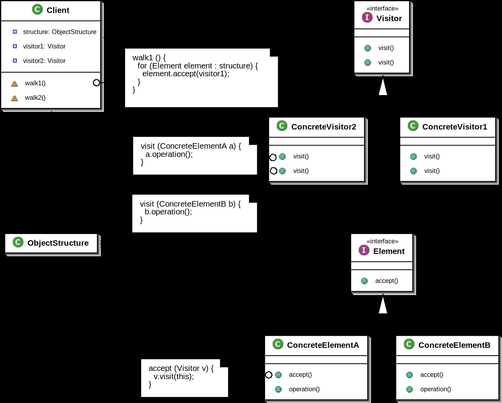

# 访问者模式

**表示一个作用于某对象结构中的各元素的操作。它使你可以在不改变各元素的类的前提下定义作用于这些元素的新操作。**

## 结构图



## 实现

定义`Element`接口，提供`Accept`方法允许`Visitor`访问内部数据：

```text
type Element interface {
    Accept(Visitor)
}
```

定义`Visitor`接口，实现对数据结构的操作：

```text
type Visitor interface {
    Visit(Element)
}
```

实现两个不同的`Element`：

```text
type NumberElement struct {
    num int
}
func NewNumberElement(num int) *NumberElement {
    return &NumberElement{num: num}
}
func(e *NumberElement) Accept(visitor Visitor) {
    visitor.Visit(e)
}

type NumbersElement struct {
    nums []int
}
func NewNumbersElement(nums []int) *NumbersElement {
    n := make([]int, len(nums))
    copy(n, nums)
    return &NumbersElement{nums: n}
}
func(e *NumbersElement) Accept(visitor Visitor) {
    for _, v := range e.nums {
        visitor.Visit(v)
    }
}
```

实现两个不同的`Visitor`：

```text
type VisitorA struct {}
func(v *VisitorA) Visit(element Element) {
    switch e := element.(type) {
    case *NumbersElement:
        ...
    case *NumberElement:
        ...
    }
}

type VisitorB struct {}
func(v *VisitorB) Visit(element Element) {
    switch e := element.(type) {
    case *NumberElement:
        ...
    }
}
```

某个具体的类，只需要存储`Element`，允许 对`Element` 进行操作的算法 `Visitor` 处理数据：

```text
type Object struct {
    elements []Element
}

func (o *Object) Attach(e Element) {
    o.elements = append(o.elements, e)
}
func (o *Object) Remove(element Element) {
    j := 0
    for _, e := range o.elements {
        if e != element {
            o.elements[j] = e
            j++
        }
    }
    o.elements = o.elements[:j]
}
func (o *Object) Accept(v Visitor) {
    for _, e := range o.elements {
        e.Accept(v)
    }
}
```

**访问者模式适用于数据结构相对稳定的系统，它把 数据结构 和 作用于数据结构上的操作 之间的耦合解脱开，使得操作集合可以相对自由地演化。**

它的目的是**把处理从数据结构中分离出来**。如果系统有比较稳定的数据结构，又有易于变化的算法的话，使用访问者模式比较适合，因为访问者模式使得算法操作的增加变得简单。

把对数据结构的操作算法交给访问者执行。因此增加新的操作很容易，因为增加新的操作就意味着增加一个新的访问者。访问者模式将有关的行为集中到一个访问者对象中。

该模式的缺点就是**增加新的数据结构比较困难**，因为需要修改每一个`Visitor`。

