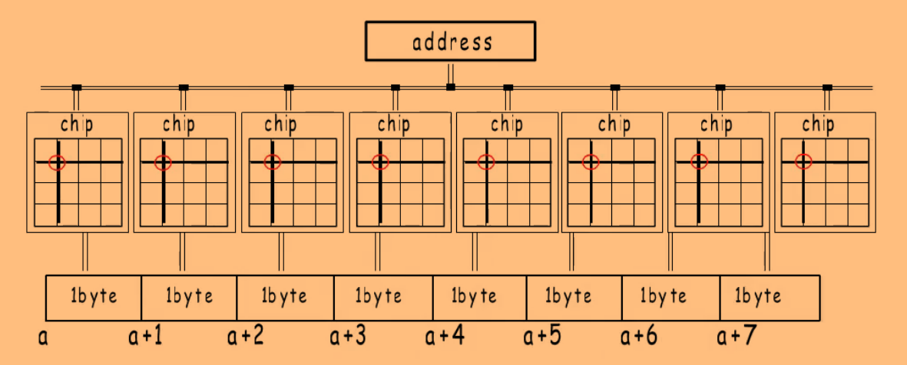
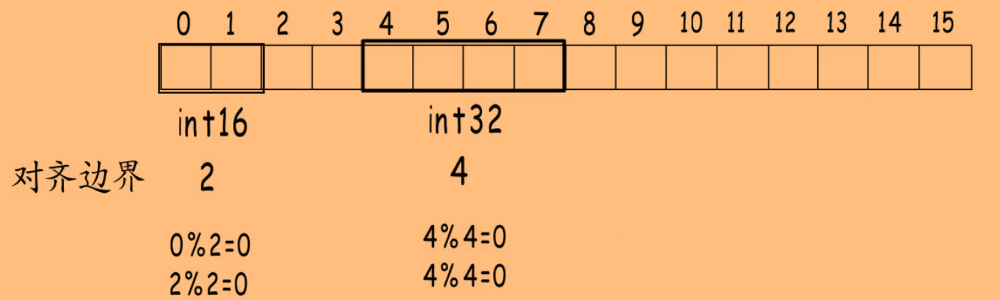
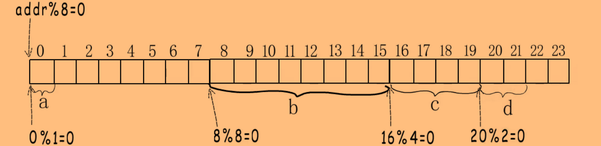

# 内存对齐

## 组成原理

CPU通过地址总线对RAM进行寻址，然后通过数据总线读写RAM。

地址总线的位数代表了可寻址的范围，数据总线的位数则表示一次数据传输最大的位数，也称为**机器字长**。


### 内存布局

一个内存条是一个Rank，上面有多个Chip，一个Chip又有多个Bank。为了并行访问内存，提高性能，每次访问读写不同Chip的相同位置，而不是访问一个Chip中连续的空间。

例如一个Rank有8个Chip、一个Chip有8个Bank的话，给定行列位置后，每个Chip都取出该位置的一个字节（由8个Bank选择该位置，每个Bank提供一个bit），组成八个字节传输到数据总线。

也就是说，逻辑上连续地址的内存，在物理结构上并不是连续的，但通过这种访问方式，提高了访问效率。




## 不对齐的访问

如果想要每次读写8字节只进行一次内存访问，地址就必须是8的倍数。

假设地址为`addr`，要读取8个字节，如果`addr % 8 = 2`，无法在同一次行列位置选择时选中所有字节，就得进行两次内存访问，第一次读取`[addr, addr + 5] `六个字节，第二次读取`[addr + 6, addr + 7]`两个字节，组合为8个字节。

但CPU是支持访问任意地址的内存的，例如从地址1(`1 % 8 = 1`)开始读8个字节，CPU就分成两次内存读取，再进行拼接访问。


## 编译器对齐

为了程序的高效运行，在为各种类型的变量分配内存时，会**从合适的地址开始分配，并占用合适的长度**，以避免不对齐的访问。

### 对齐边界

对齐边界就是每种类型的对齐值。**内存对齐要求每种类型的变量的起始地址和占用的内存长度都是对齐边界的倍数。**



上面的`int32`类型的值，不能直接在第2个字节开始存储，因为`2 % 4 != 0`。

对齐边界与平台相关，**平台的机器字长就是该平台的最大对齐边界**。

类型的对齐边界是$MIN(类型大小, 平台最大对齐边界)$。


### 结构体的对齐边界

结构体的对齐边界是其所有成员的对齐边界的最大值，在64位环境中，最大对齐边界为8字节。

```
type T struct {
  a int8  // 1
  b int64 // 8
  c int32 // 4
  d int16 // 2
}
```

`T`的对齐边界就是8，因此存储该结构体时，起始地址必须是8的倍数。



但这个结构体的大小并不是22个字节，而是24个字节。因为**要考虑该结构体的数组形式**，如果每个`T`只占22字节，那么当数组的第0个元素内存对齐时，占用`[0, 21]`字节，第1个元素占用`[22, 43]`字节，第1个元素就不满足内存对齐了。

即**结构体整体占用内存大小需要是其对齐边界的倍数。**

