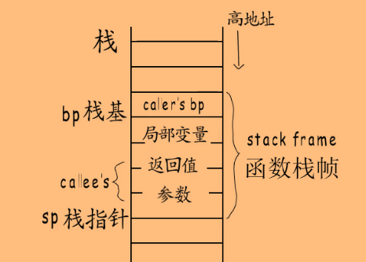
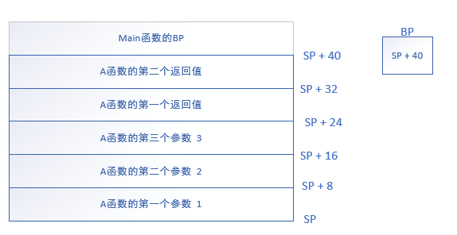
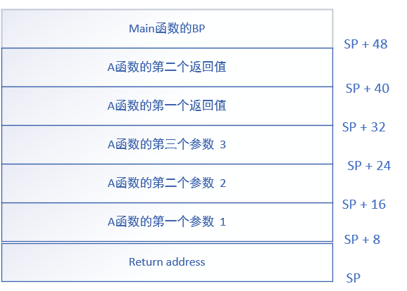
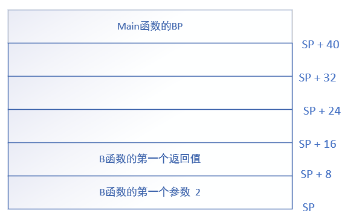
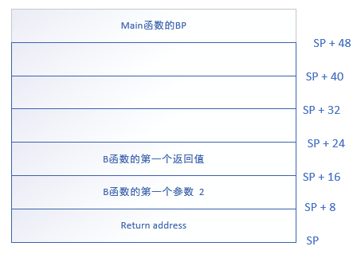
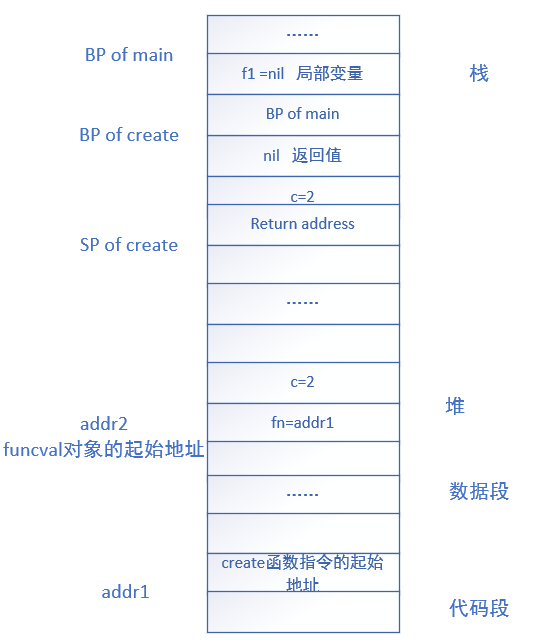

# 函数

程序在运行时，会向操作系统申请一段内存，地址空间被分为堆、栈、数据段、代码段等部分，其中代码就存在了代码段。

函数在运行时，会在栈上申请内存存放调用者栈基地址（函数返回时写回BP寄存器）、局部变量、返回值、参数等数据。栈是从高地址向低地址生长的，分配给函数的栈空间就是**函数栈帧**，栈底(`BP`, base pointer)通常称为栈基，栈顶(`SP`, stack pointer)称为栈指针。


## 参数

参数是通过值拷贝传递的。


### 参数的寻址

在汇编代码中，函数参数的地址一般表示为`SP+XX`的形式，结合下图很好理解。



参数入栈的顺序是从右向左，这样子通过`SP`指针去寻址时会比较方便。


## 返回值

golang支持多返回值，因此在栈上分配返回值空间更方便，而不是通过寄存器传递返回值。

对于有返回值和`defer`的函数，在执行`ret`函数前，会先对返回值赋值，然后才执行`defer`函数。即：返回值赋值->`defer`->返回。


## call

发生函数调用时，即`call`指令，会将下一条指令的地址入栈，等到被调用函数执行结束后就会把该地址加载到IP中，实现回到被调用函数继续执行。然后会加载被调用函数的起始指令地址到IP中。

而在`call`之前，调用者会先将栈基入栈，然后在当前函数堆栈的下面分配栈帧空间，作为被调用函数的函数堆栈，并且将函数参数赋值到新的栈帧中。

分配栈帧空间时，不是逐步扩张的方式（即随着每一条压栈的指令向下移动SP），而是一次性分配足够的空间，直接将SP移动到所需最大栈空间的位置，然后再通过`SP + offset`的方式入栈函数参数。

如果不使用一次性分配足够的空间的方式，假设有3个goroutine正在运行，它们的栈帧是连续的，如果中间的栈帧对应的goroutine调用函数，需要申请更大的空间，采用逐步扩张的方式就有可能导致分配的空间与其他goroutine的栈帧重合，导致栈非法访问。

由于函数栈帧的大小在编译器就可以确定了，对于栈消耗大的函数，编译器会在头部插入检测代码，当出现上面的情况时，就会另外分配一段足够大的栈空间，然后将原来的栈帧拷贝过去，并且释放原来的栈帧。


## 栈帧

```
func A(a, b, c int) (int, int) { 
	return a + b, b + c
}

func B(a int) int { 
	return a * 2
}

func main() { 
	A(1, 2, 3)
	B(2)
}
```

通过观察汇编指令了解函数栈帧的结构。

```
# -N -l 禁止优化和内联
$ go tool compile -S -N -l main.go 
```

先看函数`A`和`B`的汇编代码：

```
"".A STEXT nosplit size=49 args=0x28 locals=0x0
0x0000 00000 (main.go:3)        TEXT    "".A(SB), NOSPLIT|ABIInternal, $0-40
0x0000 00000 (main.go:3)        FUNCDATA        $0, gclocals·33cdeccccebe80329f1fdbee7f5874cb(SB)
0x0000 00000 (main.go:3)        FUNCDATA        $1, gclocals·33cdeccccebe80329f1fdbee7f5874cb(SB)
0x0000 00000 (main.go:3)        MOVQ    $0, "".~r3+32(SP) # 初始化 第一个 返回值
0x0009 00009 (main.go:3)        MOVQ    $0, "".~r4+40(SP) # 初始化 第二个 返回值
0x0012 00018 (main.go:4)        MOVQ    "".a+8(SP), AX    # AX = SP + 8 地址处的数据
0x0017 00023 (main.go:4)        ADDQ    "".b+16(SP), AX   # AX += SP + 16 地址处的数据
0x001c 00028 (main.go:4)        MOVQ    AX, "".~r3+32(SP) # 将SP + 32 地址的内容赋值为AX的值
0x0021 00033 (main.go:4)        MOVQ    "".b+16(SP), AX
0x0026 00038 (main.go:4)        ADDQ    "".c+24(SP), AX
0x002b 00043 (main.go:4)        MOVQ    AX, "".~r4+40(SP)
0x0030 00048 (main.go:4)        RET

"".B STEXT nosplit size=23 args=0x10 locals=0x0
0x0000 00000 (main.go:7)        TEXT    "".B(SB), NOSPLIT|ABIInternal, $0-16
0x0000 00000 (main.go:7)        FUNCDATA        $0, gclocals·33cdeccccebe80329f1fdbee7f5874cb(SB)
0x0000 00000 (main.go:7)        FUNCDATA        $1, gclocals·33cdeccccebe80329f1fdbee7f5874cb(SB)
0x0000 00000 (main.go:7)        MOVQ    $0, "".~r1+16(SP)
0x0009 00009 (main.go:8)        MOVQ    "".a+8(SP), AX
0x000e 00014 (main.go:8)        SHLQ    $1, AX   # AX <<= 1
0x0011 00017 (main.go:8)        MOVQ    AX, "".~r1+16(SP)
0x0016 00022 (main.go:8)        RET
```

可以发现，在汇编代码中，**函数运行时的栈帧不是自己分配的，而是由调用者分配的**：

```
"".main STEXT size=103 args=0x0 locals=0x30
0x0000 00000 (main.go:11)       TEXT    "".main(SB), ABIInternal, $48-0
0x0000 00000 (main.go:11)       MOVQ    TLS, CX
0x0009 00009 (main.go:11)       PCDATA  $0, $-2
0x0009 00009 (main.go:11)       MOVQ    (CX)(TLS*2), CX
0x0010 00016 (main.go:11)       PCDATA  $0, $-1
0x0010 00016 (main.go:11)       CMPQ    SP, 16(CX)
0x0014 00020 (main.go:11)       PCDATA  $0, $-2
0x0014 00020 (main.go:11)       JLS     96
0x0016 00022 (main.go:11)       PCDATA  $0, $-1
0x0016 00022 (main.go:11)       SUBQ    $48, SP    # 为函数A分配48字节的栈帧空间
0x001a 00026 (main.go:11)       MOVQ    BP, 40(SP) # 保存旧BP
0x001f 00031 (main.go:11)       LEAQ    40(SP), BP # 设置新的BP地址 LEAQ：直接用SP+40的值，而不是该地址存放的值
0x0024 00036 (main.go:11)       FUNCDATA        $0, gclocals·33cdeccccebe80329f1fdbee7f5874cb(SB)
0x0024 00036 (main.go:11)       FUNCDATA        $1, gclocals·33cdeccccebe80329f1fdbee7f5874cb(SB)
0x0024 00036 (main.go:12)       MOVQ    $1, (SP)   # 设置 第一个 参数
0x002c 00044 (main.go:12)       MOVQ    $2, 8(SP)  # 设置 第二个 参数
0x0035 00053 (main.go:12)       MOVQ    $3, 16(SP) # 设置 第三个 参数
0x003e 00062 (main.go:12)       PCDATA  $1, $0
0x003e 00062 (main.go:12)       NOP
0x0040 00064 (main.go:12)       CALL    "".A(SB)   # 返回地址入栈，更新SP
0x0045 00069 (main.go:13)       MOVQ    $2, (SP)   # 设置函数B的第一个参数，这里直接复用函数A的栈帧空间
0x004d 00077 (main.go:13)       CALL    "".B(SB)
0x0052 00082 (main.go:14)       MOVQ    40(SP), BP # 恢复旧BP
0x0057 00087 (main.go:14)       ADDQ    $48, SP    # 释放栈帧空间
0x005b 00091 (main.go:14)       RET
```




执行`call`的时候，会将返回地址入栈，并更新SP指针。同时修改ip寄存器，跳转到函数A的起始位置。



A函数执行`ret`返回后，会接着执行B函数，因为B函数所需栈帧空间比A函数小，可以复用A函数的栈帧。





在函数B的`ret`指令执行时，会将Return address出栈到`ip`寄存器。然后由调用者恢复自己的栈基，即读取栈上原来的BP值，恢复到`bp`寄存器，然后释放栈帧空间，即将`sp`设置为`sp+48`。

```
0x0052 00082 (main.go:14)       MOVQ    40(SP), BP # 恢复旧BP
0x0057 00087 (main.go:14)       ADDQ    $48, SP    # 释放栈帧空间
```


## 函数变量

在golang中，函数是“头等公民”，函数可以作为变量，也可以作为函数的参数和返回值，跟普通变量一样，被称为**function value**。

函数代码对应的指令是存在代码段的，要将函数作为变量使用，就需要有个指针指向指令在代码段的起始地址，例如下面的变量`f`：

```
f := func(xxx) xxx {
	...
}
```

`f`是一个`funcval`类型的变量，这个结构体用一个指针存储了函数指令的起始地址。注意到结构体中的注释，该结构体除了存储函数指令的地址，后面还可以跟上函数相关的数据，例如闭包的捕获变量。

```
type funcval struct {
	fn uintptr
	// variable-size, fn-specific data here
}
```


假设有一个普通函数`A`（不涉及闭包），在函数`B`和`C`中都用局部变量指向函数`A`，这种情况下，会被编译器进行优化：

1. `f1`和`f2`共用相同的`funcval`
2. 该`funcval`分配到只读数据段，而不是堆上

```
func A() {
  return 1
}

func B() {
  f1 := A
  f1()
}

func C() {
  f2 := A
  f2()
}
```

当调用`f1`或`f2`时，就会通过`funcval`的`fn`指针得到函数`A`的起始地址，然后跳转执行。


## 闭包

```
func create() func() int {
	c := 2
	return func() int {
		return c
	}
}
```

这就是一个最简单的闭包函数，其中的变量`c`就是**捕获变量**，在`create`函数被调用执行完成后，变量`c`仍然能被`create`返回的函数变量使用到，因此捕获变量是存储在堆上的。

闭包函数的指令也是在编译阶段生成的，但每个闭包对象都有自己的捕获变量，因此闭包的创建是在运行时创建的，并且分配到堆上（一般情况下）。

```
func main() {
  f1 := create()
  f1()
}
```



`create`函数返回后，局部变量`f1`就指向了`addr2`这个`funcval`。

> golang中，通过function value调用函数时，会把对应的funcval结构体地址存入特定寄存器。

在调用闭包函数`f1`时，将`addr2`存入特定寄存器，然后通过寄存器加上偏移量访问捕获变量。


### 捕获列表

> 下文的被捕获变量是指返回闭包的外层函数内的局部变量，捕获变量为funcval结构体中的变量。

捕获列表里面的捕获变量，需要在闭包函数中和外层函数中表现一致，在不同情况下有不同的处理方法：

- 被捕获变量初始化之后就没修改：直接拷贝。例如上面`create`函数返回的闭包中，`c`这个被捕获变量就没有被修改过，因此直接拷贝其值到`funcval`的函数地址之后。

- 初始化后被修改过：

  - 被捕获变量是局部变量：逃逸到堆上

    ```
    func createWithLocalVar(n int) (funcs []func() int) {
    	for i := 0; i < n; i++ {
    		funcs = append(funcs, func() int {
    			fmt.Println(i)
    			return i
    		})
    	}
    }
    
    func main() {
    	funcs := createWithLocalVar(2)
    }
    ```

    闭包函数捕获的是局部变量`i`，并且`i`会被修改，因此将其逃逸到堆上，`funcval`结构体中的捕获列表中的变量`i`是其逃逸后在堆上的地址。

  - 被捕获变量是函数参数：将其拷贝到堆上，外层函数和捕获变量都使用该变量在堆上的地址

  - 被捕获变量是函数返回值：将其拷贝到堆上，外层函数和捕获变量都使用该变量在堆上的地址。在外层函数返回前，需要把堆上的返回值拷贝到栈上的返回值空间


