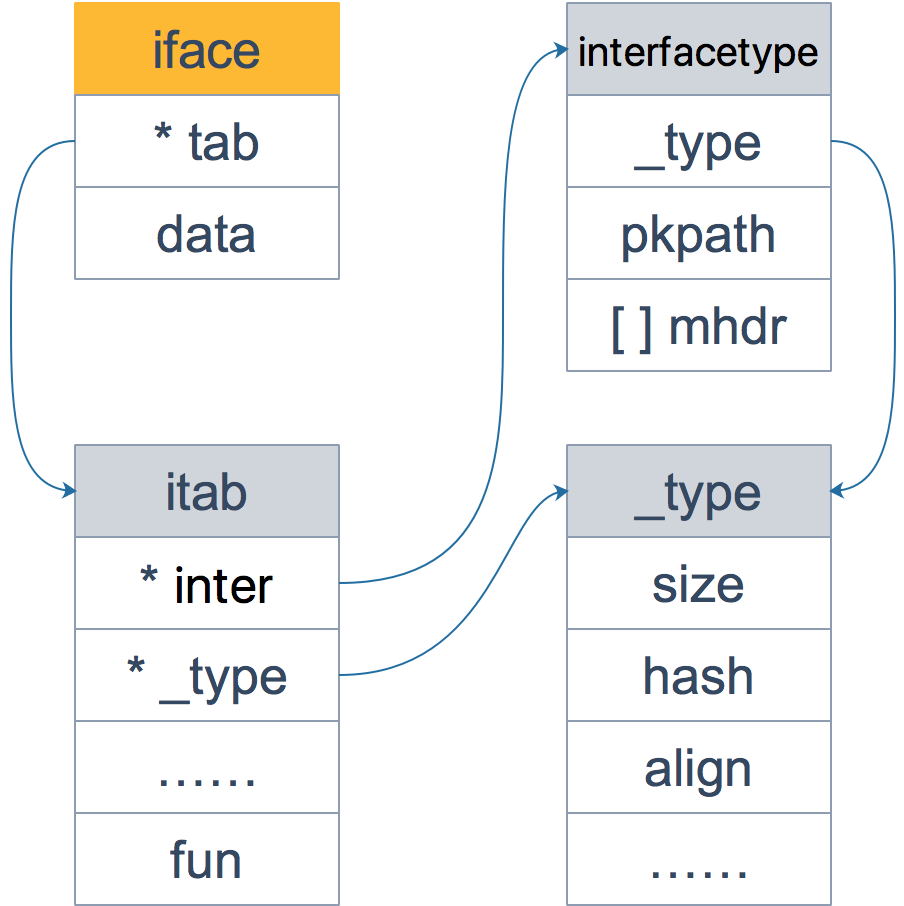

# 类型系统、接口与反射

## 类型系统

### 内置类型

例如：`int、int8、intXX、byte、string、slice、map、channel、func……`，不能为内置类型定义方法


### 自定义类型

可以定义方法

```
type MyInt int

func (i MyInt) Test() {}
```


### 类型描述信息

不管是内置类型还是自定义类型，都有全局唯一的类型描述信息，即“类型元数据”，包括类型名称、类型大小、对齐边界、是否自定义等属性。这些信息由`runtime._type`结构体存储：

```
type _type struct {
    // 类型大小
    size       uintptr
    ptrdata    uintptr
    // 类型的 hash 值
    hash       uint32
    // 类型的 flag，和反射相关
    tflag      tflag
    // 内存对齐相关
    align      uint8
    fieldalign uint8
    // 类型的编号，有bool, slice, struct 等等
    kind       uint8
    equal func(unsafe.Pointer, unsafe.Pointer) bool
    // gc 相关
    gcdata    *byte
    str       nameOff
    ptrToThis typeOff
}
```

Go 语言各种数据类型都是在 `_type` 字段的基础上，增加一些额外的字段来进行管理的：

```
type arraytype struct {
    typ   _type
    elem  *_type
    slice *_type
    len   uintptr
}
type chantype struct {
    typ  _type
    elem *_type
    dir  uintptr
}
type slicetype struct {
    typ  _type
    elem *_type
}
type structtype struct {
    typ     _type
    pkgPath name
    fields  []structfield
}
```

以slice类型的元数据为例，如果是`[]string`，`elem`字段就会指向`stringtype`。

如果是自定义类型，就还会有一个`uncommontype`结构体：

```
type uncommonType struct {
	pkgPath nameOff // import path; empty for built-in types like int, string
	mcount  uint16  // number of methods
	xcount  uint16  // number of exported methods
	moff    uint32  // offset from this uncommontype to [mcount]method
	_       uint32  // unused
}

type method struct {
	name nameOff
	mtyp typeOff
	ifn  textOff
	tfn  textOff
}
```

以一个自定义类型为例：

```
type mySlice []string
func (ms mySlice) Len() { println(len(ms)) }
func (ms mySlice) Cap() { println(cap(ms)) }
```

那么`mySlice`的类型元数据就包括`slicetype`和`uncommontype`，如果`uncommontype`地址为`addr`，那么`addr + moff`就是`mySlice`类型的方法元数据数组的地址。


### `type`（类型） VS `kind`（种类）


- 类型是程序员定义的关于数据和函数的元数据。种类是编译器和运行时定义的关于数据和函数的元数据。

  ```text
  type VersionType string
  var Version VersionType // Version的type是VersionType，kind是string
  ```

  运行时编译器根据 `Kind` 来分别给变量和函数分配内存或栈空间。

- 对于原始类型（`int、float、string`等），它们的`kind`和`type`是相同的。
  **所有 struct 都是相同的 kind，但不是相同的 Type。**

  ```
  type example struct {
      field1 type1
  }
  ```

  对于这个结构体，它的`type`是`example`，`kind`是`struct`。这里的 `kind`可以被看成一个 `type`的 `type`。


### 类型别名 VS 类型定义

```
type MyInt1 int // 类型定义，新类型
type MyInt2 = int // 类型别名 本质上还是int

var i int =0
var i1 MyInt1 = i  // cannot use i (type int) as type MyInt1 in assignment
var i1 MyInt1 = MyInt1(i) // ok
var i2 MyInt2 = i // ok
fmt.Println(i1,i2)
```


## Named type

```
type T int	// named

func F(t T) {}

func main() {
    var q int	// named
    F(q)
}
// 不能通过编译
---

type T []int	// named

func F(t T) {}

func main() {
    var q []int	// unnamed
    F(q)
}
// 可以通过编译
```

对于**底层类型相同**的变量可以相互赋值有一个重要的条件，即**至少有一个不是有名类型**（named type）。

Named Type 有两类：

- 内置类型，比如 int, int64, float, string, bool 等；
- 使用关键字 type 声明的类型；

Unnamed Type 是基于已有的 Named Type 组合一起的类型，例如：`struct{}、[]string、interface{}、map[string]bool `等。


下面的代码不能通过编译，因为Unnamed Type不能作为方法的接收者。

```
func (m map[string]string) Set(key string, value string) {
    m[key] = value
}

func main() {
    m := make(map[string]string)
    m.Set("A", "One")
}
```

改为named type就可以了：

```
type User map[string]string

func (m User) Set(key string, value string) {
    m[key] = value
}

func main() {
    m := make(User)
    m.Set("A", "One")
}
```


## interface

变量包括`(type, value)`两部分，`type`包括`static type`和`concrete type`，`static type`是编码时看见的类型（例如`int、string`），`concrete type`是runtime系统看见的类型。一个`interface`变量包含两个指针，一个指向值的类型`concrete type`，一个指向实际的值。


### eface

`interface{}`，空接口，可以接收任意类型的数据。

```
type eface struct {
    _type *_type  // 动态类型的元数据
    data  unsafe.Pointer // 动态值
}
```

将一个变量赋值给空接口变量时，空接口变量的动态类型就指向变量的类型，动态值为变量的地址。


### iface

非空接口就是有方法列表的接口类型，一个变量要赋值给非空接口，就必须实现该接口定义的所有方法。

```
type iface struct {
    tab  *itab
    data unsafe.Pointer // 动态值
}

type itab struct {
    inter  *interfacetype // 接口的类型
    _type  *_type // 动态值的类型的元数据
    hash   uint32 // copy of _type.hash. Used for type switches. 快速判断类型是否相等
    _      [4]byte
    fun    [1]uintptr // variable sized 动态类型实现该接口要求的方法的地址
}

type interfacetype struct {
	typ     _type  // 描述 Go 语言中各种数据类型的结构体
	pkgpath name  // 接口的包名
	mhdr    []imethod  // 接口要求的方法列表
}
```

`iface` 内部维护两个指针，`tab` 指向一个 `itab` 实体， 它表示接口的类型以及赋给这个接口的实体类型。`data` 与`eface`一样，指向接口具体的值，一般而言是一个指向堆内存的指针。

`itab`的`fun`数组大小为1，它存储的是第一个方法的函数指针，如果有更多的方法，在它之后的内存空间里连续存储。从汇编角度来看，通过增加地址就能获取到这些函数指针。这些方法是按照函数名称的字典序进行排列的。




以一个`io.ReadWriter`接口为例：


#### itab缓存

在`itab`结构体中，只要接口流类型`inter`和动态类型`_type`确定了，`itab`的内容就不会改变了，因此可以复用这个`itab`结构体。

golang以`<接口类型, 动态类型>`为key，对应的`itab`结构体的指针为value，构造了一个`itabTableType`哈希表。

```
type itabTableType struct {
	size    uintptr             // length of entries array. Always a power of 2.
	count   uintptr             // current number of filled entries.
	entries [itabInitSize]*itab // really [size] large
}

// 哈希值的计算
func itabHashFunc(inter *interfacetype, typ *_type) uintptr {
	return uintptr(inter.typ.hash ^ typ.hash)
}

// 确定位置，如果位置已被使用且key不相等，采用开放地址法寻址合适的位置
h := itabHashFunc(m.inter, m._type) & mask // mask == size - 1
```


### 编译器检测类型是否实现接口

```text
type myWriter struct {}

// 解除注释后，运行程序不报错。
/*func (w myWriter) Write(p []byte) (n int, err error) {
    return
}*/

// 检查 *myWriter 类型是否实现了 io.Writer 接口
var _ io.Writer = (*myWriter)(nil)

// 检查 myWriter 类型是否实现了 io.Writer 接口
var _ io.Writer = myWriter{}
```

上述赋值语句会发生隐式地类型转换，在转换的过程中，编译器会检测**等号右边的类型是否实现了等号左边接口所规定的方法**。


### 方法

interface是无效的方法接收者。

实现了接收者是值类型的方法，相当于自动实现了接收者是指针类型的方法；而实现了接收者是指针类型的方法，不会自动生成对应接收者是值类型的方法，因为指针接收者类型的方法可能会对调用者进行修改。

```text
type coder interface {
    code()
    debug()
}

type Gopher struct {
    language string
}

// 会生成接收者是*Gopher类型的code方法
func (p Gopher) code() {
    fmt.Printf("I am coding %s language\n", p.language)
}

// 不会生成接收者是Gopher类型的debug方法
func (p *Gopher) debug() {
    fmt.Printf("I am debuging %s language\n", p.language)
}

func main() {
    var c coder = &Gopher{"Go"}
    // var c coder = Gopher{"Go"} // 会报错，因为没有Gopher类型的debug方法
    c.code()
    c.debug()
}
```

因为 **对于接收者是指针类型的方法，很可能在方法中会对接收者的属性进行更改操作，从而影响接收者**；**而对于接收者是值类型的方法，在方法中不会对接收者本身产生影响**。所以，当实现了一个接收者是值类型的方法，就可以自动生成一个接收者是对应指针类型的方法，因为两者都不会影响接收者。

但是，当实现了一个接收者是指针类型的方法，如果此时自动生成一个接收者是值类型的方法，原本期望对接收者的改变（通过指针实现），现在无法实现，因为值类型会产生一个拷贝，不会真正影响调用者。

语法上 `T` 能直接调 `*T` 的方法仅仅是 `Go` 的语法糖，先取到`T`的指针再去调用`*T`的方法。


### 接口命名

只包含一个方法的接口应当以该方法的名称加上 `- er` 后缀来命名，如 Reader、Writer、 Formatter、CloseNotifier 等


### 函数

函数参数类型为 `interface{}` 时可以接收任何类型的参数，包括用户自定义类型等，就算是接收指针类型也用` interface{}`，而不是使用 `*interface{}`。

**永远不要使用一个指针指向一个接口类型，因为它已经是一个指针。**

```
type S struct {
}

func f(x interface{}) {
}

func g(x *interface{}) {
}

func main() {
    s := S{}
    p := &s
    f(s) // OK
    g(s) // error
    f(p) // OK
    g(p) // error
}
```


## 类型转换、类型断言

### 类型转换

不支持隐式类型转换，即直接`a = b`的方式。

> &lt;结果类型&gt; := &lt;目标类型&gt; \( &lt;表达式&gt; \)

```text
var i int = 9
var f float64

f = float64(i)
a := int(f)

s := []int(i) // cannot convert i (type int) to type []int
```


### 类型断言

作用于接口对象，空接口 `interface{}` 没有定义任何函数，因此 Go 中所有类型都实现了空接口。当一个函数的形参是 `interface{}`，那么在函数中，需要对形参进行断言，从而得到它的真实类型。

- `<目标类型的值>, <布尔参数> := <表达式>.(目标类型)`：安全类型断言，目标类型可以是具体类型或者非空接口
- `<目标类型的值> := <表达式>.(目标类型)`：非安全类型断言

```text
type Student struct {
    Name string
    Age int
}

func main() {
    var i interface{} = new(Student)
    s, ok := i.(Student)    // i的动态类型并不是Student，而是*Student  i.(*Student)
    if ok {
        fmt.Println(s)
    }
}
```


一共有四种类型断言的情况：

- 空接口 -> 具体类型：只需要判断`eface._type`是否为具体类型

  ```
  var e interface{}
  f, _ := os.Open("xx.txt")
  e = f
  r, ok := e.(*os.File) // 断言成功
  r, ok = e.(string)    // 断言失败，r赋值为string类型的零值
  ```

- 非空接口 -> 具体类型：判断`itab`缓存中是否有以`<非空接口类型, 具体类型>`为key的元素，并且非空接口的`itab`指向该元素

  ```
  var rw io.ReadWriter
  f, _ := os.Open("xx.txt")
  rw = f
  r, ok := rw.(*os.File) // 断言成功
  ```

- 空接口 -> 非空接口：判断`itab`缓存中是否有以`<非空接口类型, 空接口的动态类型>`为key的元素。

  如果存在的话，并且`itab`的`fun[0]`不等于0，则断言成功。这是因为即使空接口对应的动态类型没有实现非空接口的所有方法，即断言失败时，也会往`itab`缓存插入以`<非空接口类型, 空接口的动态类型>`为key的元素，但会设置`fun[0]=0`。

  如果不存在的话，会找到动态类型关联的方法数组，和接口要求的方法集进行比较，比较完成后会写入`itab`缓存。

  > 当判定一种类型是否满足某个接口时，Go 使用类型的方法集和接口所需要的方法集进行匹配，如果类型的方法集完全包含接口的方法集，则可认为该类型实现了该接口。
  >
  > 例如某类型有 `m` 个方法，某接口有 `n` 个方法，则很容易知道这种判定的时间复杂度为 `O(m*n)`，Go 会对方法集的函数**按照函数名的字典序进行排序**，所以实际的时间复杂度为 `O(m+n)`。
  >
  > 

  ```
  var e interface{}
  f, _ := os.Open("xx.txt")
  e = f
  rw, ok := e.(io.ReadWriter)
  ```

- 非空接口A -> 非空接口B：与 空接口->非空接口 流程类似，先判断`itab`缓存中是否有以`<接口类型B, A的动态类型>`为key的元素。


还可以使用`switch`判断接口类型

```text
func judge(v interface{}) {
    fmt.Printf("%p %v\n", &v, v)

    switch v := v.(type) {
    case nil:
        fmt.Printf("%p %v\n", &v, v)
        fmt.Printf("nil type[%T] %v\n", v, v)

    case Student:
        fmt.Printf("%p %v\n", &v, v)
        fmt.Printf("Student type[%T] %v\n", v, v)

    case *Student:
        fmt.Printf("%p %v\n", &v, v)
        fmt.Printf("*Student type[%T] %v\n", v, v)

    default:
        fmt.Printf("%p %v\n", &v, v)
        fmt.Printf("unknow\n")
    }
}

type Student struct {
    Name string
    Age int
}
```

`fmt.Println` 函数的参数是 `interface`。

对于内置类型，函数内部会用穷举法，得出它的真实类型，然后转换为字符串打印。

而对于自定义类型，首先确定该类型是否实现了 `String()` 方法（接收者最好为值类型），如果实现了，则直接打印输出 `String()` 方法的结果；否则，会通过反射来遍历对象的成员进行打印。

**类型断言能否成功，取决于变量的`concrete type`，而不是`static type`。** 因此，一个 `reader`变量如果它的`concrete type`也实现了`write`方法的话，它也可以被类型断言为`writer`。


## reflection

**反射就是用来检测存储在接口变量内部`(value, concrete type)`pair对的一种机制。**将类型的元数据暴露给用户。

> 在`runtime`包中定义的类型元数据、接口等结构是未导出的，因此又在`reflect`包中复制了一份。


### 接口的值

`interface`类型的值包含`(value, type)`对。

```text
var r io.Reader
tty, err := os.OpenFile("/dev/tty", os.O_RDWR, 0)
if err != nil {
    return nil, err
}
r = tty // r 的 (value, type)对为：(tty, *os.File)

var w io.Writer
w = r.(io.Writer)    // w 的 (value, type)对为：(tty, *os.File)
```

接口的静态类型确定可以使用接口变量调用哪些方法，即使内部的具体值可能具有更大的方法集。

变量的方法集则蕴含了该变量可以转换为哪些接口。


### 从接口值到反射对象：TypeOf  and  ValueOf

最基础的反射就是从一个接口变量得到其`(value, type)`对，reflect包提供了`reflect.TypeOf` 和`reflect.ValueOf`这两个方法。

> ```text
> ValueOf returns a new Value initialized to the concrete value stored in the interface i. 
> ValueOf(nil) returns the zero Value.
>
> TypeOf returns the reflection Type that represents the dynamic type of i.
> If i is a nil interface value, TypeOf returns nil.
> ```

`reflect.Type`和`reflect.Value`具有一系列方法，包括`SetInt` 和`SetFloat`之类的方法，但使用前需要确认是否可以使用。

```text
var x float64 = 3.4
fmt.Println("type:", reflect.TypeOf(x))    // type: float64
fmt.Println("value:", reflect.ValueOf(x)) // value: 3.4
fmt.Println("value:", reflect.ValueOf(x).String()) // value: <float64 Value>

v := reflect.ValueOf(x)
fmt.Println("type:", v.Type())        // type: float64
fmt.Println("kind is float64:", v.Kind() == reflect.Float64) // kind is float64: true
fmt.Println("value:", v.Float())    // value: 3.4
```

* `Kind`方法描述的是反射对象的底层类型（`int、string、struct、bool等`），而不是静态类型

  ```text
  type MyInt int
  var x MyInt = 7
  v := reflect.ValueOf(x)
  v.Kind() === reflect.Int    // 虽然x的静态类型是MyInt
  ```

* `getter`和`setter`方法都是在能容纳该值的最大类型上运行。以`int64`（有符号整数）为例，`reflect.Value`的`Int()`返回`int64`、`SetInt()`接收一个`int64`的值（可能会转换为涉及的实际类型）

  ```text
  var x uint8 = 'x'
  v := reflect.ValueOf(x)
  fmt.Println("type:", v.Type())    // uint8.
  fmt.Println("kind is uint8: ", v.Kind() == reflect.Uint8)  // true.
  x = uint8(v.Uint())              // v.Uint returns a uint64.
  ```

- `reflect.TypeOf`函数的参数是一个空接口，需要的是一个地址。当把具体类型的变量作为参数时，需要取得该值的地址，但为了不违背golang值传递的原则，需要先把变量在栈上拷贝一份，然后将拷贝的地址作为参数传递到函数中。

- `reflect.ValueOf`函数的参数是一个空接口，同样需要把变量在栈上拷贝一份，以满足值传递的语义。但在`ValueOf`方法中，还会把这个拷贝逃逸到堆上，因为`TypeOf`只需要类型信息，而`ValueOf`还需要值信息。这也是为什么在通过反射修改接口属性时，必须使用指针作为参数的原因，否则修改的都是变量的拷贝。

  ```
  type Value struct {
  	typ *rtype
  	ptr unsafe.Pointer
  	flag  // 是否为方法、是否为指针等
  }
  ```

  


### 从反射对象到接口值

通过 `reflect.Value` 的 `Interface()` 方法可以将`type`和`value`信息打包为接口形式的表示并返回，以获得接口变量的真实内容，然后可以通过类型断言进行转换，转换为原有真实类型，实现从反射对象到接口的转换。

#### 已知原有类型

```text
var num float64 = 3.4

pointer := reflect.ValueOf(&num)
value := reflect.ValueOf(num)

convertPointer, ok := pointer.Interface().(*float64) // 要区分是指针还是值
convertValue, ok := value.Interface().(float64)
```

fmt包的`Println`、`Printf`等方法以空接口的形式接收变量，然后通过`reflect.Value`得到这些接口的实际值。因此，如果我们要打印反射对象的实际值，只需要传递该对象的`Interface` 方法的结果：

```text
fmt.Println(value.Interface())
fmt.Printf("value is %7.1e\n", value.Interface()) // 知道是个float64值，格式化输出 // 3.4e+00
// 不需要类型断言
```


#### 未知原有类型

可以通过遍历Field进行判断

```text
type User struct {
    Name string
    Age int
}

v := User {
    Name: "sf",
    Age: 20,
}

getType := reflect.TypeOf(v)
getValue := reflect.ValueOf(v)

// 遍历数据字段
for i := 0; i < getType.NumField(); i++ {
    field := getType.Field(i)
    value := getValue.Field(i).Interface()
    fmt.Printf("%s: %v = %v\n", field.Name, field.Type, value)
}

// 遍历方法
for i := 0; i < getType.NumMethod(); i++ {
    m := getType.Method(i)
    fmt.Printf("%s: %v\n", m.Name, m.Type)
}
```

如果`v`是指针，就需要先调用`reflect.Indirect`得到指针指向的值。

```text
v := &User {
    Name: "sf",
    Age: 20,
}
getType := reflect.Indirect(reflect.ValueOf(v)).Type()
getValue := reflect.Indirect(reflect.ValueOf(v))
......
```


### 修改反射对象

修改反射对象时，必须使用`settable`的`value`。

```text
var x float64 = 3.4
v := reflect.ValueOf(x)
v.SetFloat(7.1) // panic: reflect: reflect.flag.mustBeAssignable using unaddressable value
```

问题是因为 `v`不是`settable`的。`settable`是`reflect.Value`的属性，但并不是所有类型的`reflect.Value`都具有该属性。

```text
var x float64 = 3.4
v := reflect.ValueOf(x)
fmt.Println("settability of v:", v.CanSet()) // settability of v: false
```

settability是指**反射对象可以修改用于创建反射对象的实际对象的存储空间**，settability由反射对象是否持有原始item确定。上例中，传入`reflect.ValueOf`方法的是变量x的copy，而不是x本身。

与函数传参的传值、传引用类似，要想修改反射对象，需要传入指针。

```text
var x float64 = 3.4
p := reflect.ValueOf(&x) 
fmt.Println("type of p:", p.Type())    // type of p: *float64
fmt.Println("settability of p:", p.CanSet()) // settability of p: false
```

虽然指针的反射对象不可以修改，我们想修改的也不是指针，而是指针指向的值。可以通过`reflect.Value`的`Elem` 方法，会将指针指向的内容保存在新的`reflect.Value`变量中。

```text
var x float64 = 3.4
p := reflect.ValueOf(&x) // 会使x逃逸到堆上，栈上保留指向x的指针
v := p.Elem()  // p.ptr指向的变量 -> 堆上的x  Elem调用者必须是指针或接口
fmt.Println("settability of v:", v.CanSet()) // settability of v: true

v.SetFloat(7.1)
fmt.Println(v.Interface())    // 7.1
fmt.Println(x)    // 7.1
```


#### 通过反射修改struct

使用反射修改结构体的字段更常见，只要有了结构的地址，就可以修改其字段。

```text
type T struct {
    A int    // 只有首字母大写的字段才可以被修改（settable）
    B string
}
t := T{23, "skidoo"}
s := reflect.ValueOf(&t).Elem()
typeOfT := s.Type()
for i := 0; i < s.NumField(); i++ {
    f := s.Field(i)
    fmt.Printf("%d: %s %s = %v\n", i,
        typeOfT.Field(i).Name, f.Type(), f.Interface())
}

output:
0: A int = 23
1: B string = skidoo

s.Field(0).SetInt(77)
s.Field(1).SetString("Sunset Strip")
fmt.Println("t is now", t) // t is now {77 Sunset Strip}
```


### 方法调用

通过`reflect.Value`的`MethodByName`拿到方法的`reflect.Value`，再调用其`Call`方法。

```text
type User struct {
    Id   int
    Name string
    Age  int
}

func (u User) ReflectCallFuncHasArgs(name string, age int) {
    fmt.Println("ReflectCallFuncHasArgs name: ", name, ", age:", age, "and origal User.Name:", u.Name)
}

u := User{}
getValue := reflect.ValueOf(u)
method := getValue.MethodByName("ReflectCallFuncHasArgs")
args := []reflect.Value{reflect.ValueOf("sf"), reflect.ValueOf(20)}
method.Call(args)
```


