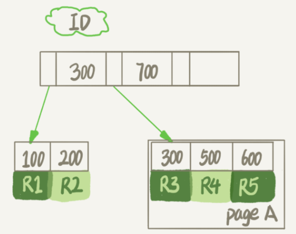
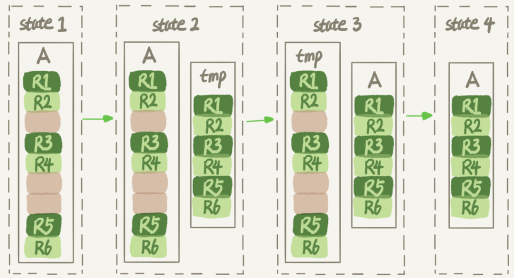
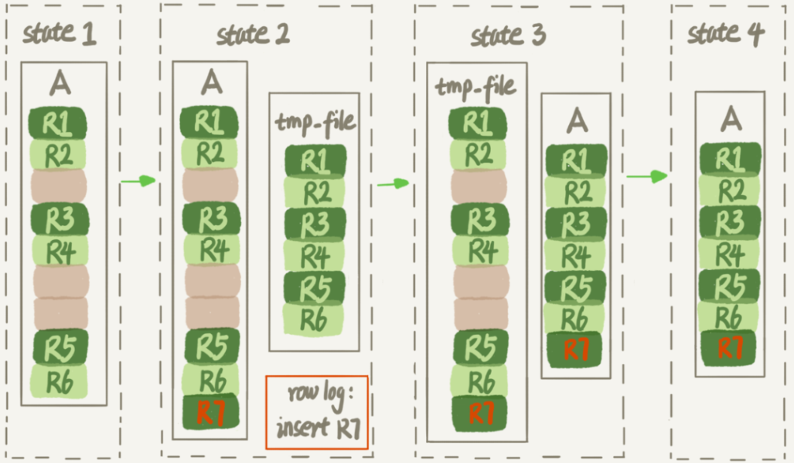

# 表空间的回收

数据库占用空间太大，然后把一个最大的表删掉了一半的数据，结果表文件的大小还是没变，这是为什么呢？

一个InnoDB表包含两部分，即：**表结构定义和数据**。在MySQL 8.0版本以前，表结构是存在以`.frm`为后缀的文件里。而MySQL 8.0版本，则已经允许把表结构定义放在系统数据表中了。因为表结构定义占用的空间很小，所以主要讨论的是表数据。

## innodb_file_per_table

表数据既可以存在共享表空间里，也可以是单独的文件。这个行为是由参数`innodb_file_per_table`控制的：

1. 这个参数设置为OFF表示的是，表的数据放在系统共享表空间，也就是跟数据字典放在一起
2. 这个参数设置为ON表示的是，每个InnoDB表数据存储在一个以 `.ibd`为后缀的文件中

从MySQL 5.6.6版本开始，它的默认值就是ON了。

不论使用哪个版本的MySQL，都将这个值设置为ON。因为，一个表单独存储为一个文件更容易管理，在不需要这个表的时候，通过`drop table`命令，系统就会直接删除这个文件。而如果是放在共享表空间中，即使表删掉了，空间也是不会回收的。

> 接下来的讨论都基于该参数设置为ON。

在**删除整个表**的时候，可以使用`drop table`命令回收表空间。但是，我们遇到的更多的删除数据的场景是**删除某些行**，这时就遇到文章开头的问题：表中的数据被删除了，但是表空间却没有被回收。这要通过数据删除的流程来分析。

## 数据删除流程



- **记录复用**：删掉R4这个记录，InnoDB引擎只会把R4这个记录**标记为删除**。如果之后要再插入一个ID在300和600之间的记录时，可能会复用这个位置。但是，磁盘文件的大小并不会缩小。
- **数据页复用**：InnoDB的数据是按页存储的，如果删掉了一个数据页上的所有记录，整个数据页就可以被复用了。

但是，**数据页的复用跟记录的复用是不同的。**

**记录的复用，只限于符合范围条件的数据。**比如上面的这个例子，R4这条记录被删除后，如果插入一个ID是400的行，可以直接复用这个空间。但如果插入的是一个ID是800的行，就不能复用这个位置了。

而数据页可以被复用到任何位置，如果将数据页page A上的所有记录删除以后，page A会被标记为可复用。这时候如果插入一条ID=50的记录需要使用新页的时候，page A是可以被复用的。

如果相邻的两个数据页利用率都很小，系统就会把这两个页上的数据合到其中一个页上，另外一个数据页就被标记为可复用。

进一步地，如果用delete命令把整个表的数据删除，所有的数据页都会被标记为可复用。但是磁盘上，文件不会变小。

`delete`命令其实只是把记录的位置，或者数据页标记为了“可复用”，但磁盘文件的大小是不会变的，即不能回收表空间的。而`drop table`才会回收表空间。

## 产生空洞的其他操作

**不止是删除数据会造成空洞，插入数据也会，即页分裂的时候。**

如果数据是按照索引递增顺序插入的，那么索引是紧凑的。但如果数据是随机插入的，就可能造成索引的数据页分裂。


由于page A满了，再插入一个ID是550的数据时，就不得不再申请一个新的页面page B来保存数据了。页分裂完成后，page A的末尾就留下了空洞（注意：实际上，可能不止1个记录的位置是空洞）。

**更新索引上的值，可以理解为删除一个旧的值，再插入一个新值。**这也是会造成空洞的。

## 重建表

通过上面的分析可以知道，经过大量增删改的表，都是可能是存在空洞的。所以，如果能够把这些空洞去掉，就能达到收缩表空间的目的。而重建表，就可以达到这样的目的。

试想一下，如果现在有一个表A，需要做空间收缩，为了把表中存在的空洞去掉，可以怎么做呢？

可以新建一个与表A结构相同的表B，然后按照主键ID递增的顺序，把数据一行一行地从表A里读出来再插入到表B中。

由于表B是新建的表，所以表A主键索引上的空洞，在表B中就都不存在了。显然地，表B的主键索引更紧凑，数据页的利用率也更高。如果我们把表B作为临时表，数据从表A导入表B的操作完成后，用表B替换A，从效果上看，就起到了收缩表A空间的作用。

上面的流程可以使用`alter table A engine=InnoDB`命令来实现，在MySQL 5.5版本之前，这个命令的执行流程跟前面描述的差不多，区别只是这个临时表B不需要你自己创建，MySQL会自动完成转存数据、交换表名、删除旧表的操作。



> 在重建表的时候，InnoDB不会把整张表占满，每个页留了1/16给后续的更新用。也就是说，其实重建表之后不是“最”紧凑的。

花时间最多的步骤是往临时表插入数据的过程，如果在这个过程中，有新的数据要写入到表A的话，就会造成数据丢失。因此，在整个DDL过程中，表A中不能有更新，即**这个DDL不是Online的。**

### Online DDL

MySQL 5.6版本开始引入的Online DDL，对这个操作流程做了优化。Online DDL重建表的流程：

1. 建立一个**临时文件**（不是表），扫描表A主键的所有数据页；
2. 用数据页中表A的记录生成B+树，存储到临时文件中；
3. 生成临时文件的过程中，将所有对A的操作记录在一个日志文件（row log）中，对应的是下图state2的状态；
4. 临时文件生成后，将日志文件中的操作应用到临时文件，得到一个逻辑数据上与表A相同的数据文件，对应的就是图中state3的状态；
5. 用临时文件替换表A的数据文件。



由于日志文件记录和重放操作这个功能的存在，这个方案在重建表的过程中，允许对表A做增删改操作。这也就是Online DDL名字的来源。

alter语句(修改表名)在启动的时候需要获取MDL写锁，但是这个写锁在真正拷贝数据之前就退化成读锁了。

为什么要退化呢？为了实现Online，MDL读锁不会阻塞增删改操作。

那为什么不干脆直接解锁呢？为了保护自己，禁止其他线程对这个表同时做DDL。

而对于一个大表来说，Online DDL最耗时的过程就是拷贝数据到临时表的过程，这个步骤的执行期间可以接受增删改操作。所以，相对于整个DDL过程来说，锁的时间非常短。对业务来说，就可以认为是Online的。

需要补充说明的是，上述的这些重建方法都会扫描原表数据和构建临时文件。对于很大的表来说，这个操作是很消耗IO和CPU资源的。因此，如果是线上服务，要很小心地控制操作时间。如果想要比较安全的操作的话，可以使用GitHub开源的gh-ost来做。

### Online 和 inplace

在MySQL 5.5版本之前，重建表时会先把数据表A的数据导出到临时表中，这个临时表是在server层创建的。

而在Online DDL重建表时，根据表A重建出来的数据是放在临时文件里的，这个临时文件是InnoDB在内部创建出来的。整个DDL过程都在InnoDB内部完成。对于server层来说，没有把数据挪动到临时表，是一个“inplace”操作。

> 如果有一个1TB的表，现在磁盘间是1.2TB，能不能做一个inplace的DDL呢？
>
> 不能，因为tmp_file也是要占用临时空间的。这个inplace是相对于server层而言的，而不是在数据文件里。

重建表的语句`alter table t engine=InnoDB`隐含的意思是：

```
mysql> alter table t engine=innodb,ALGORITHM=inplace;
```

跟inplace对应的就是拷贝表的方式(MySQL 5.5版本之前)了，用法是：

```
mysql> alter table t engine=innodb,ALGORITHM=copy;
```

不过，inplace跟Online并不是同一个意思，比如，给InnoDB表的一个字段加全文索引：

```
mysql> alter table t add FULLTEXT(field_name);
```

这个过程是inplace的，但会阻塞增删改操作，是非Online的。

1. DDL过程如果是Online的，就一定是inplace的；
2. 反过来未必，也就是说inplace的DDL，有可能不是Online的。截止到MySQL 8.0，添加全文索引（FULLTEXT index）和空间索引(SPATIAL index)就属于这种情况。

## optimize table、analyze table和alter table

- 从MySQL 5.6版本开始，`alter table t engine = InnoDB`（也就是recreate）默认的就是上面Online DDL的流程了。
- `analyze table t `不是重建表，只是对表的索引信息做重新统计，没有修改数据，这个过程中加了MDL读锁。
- `optimize table t `等于recreate + analyze。


## 思考题

有一个表t文件大小为1TB，对这个表执行 `alter table t engine=InnoDB;`，发现执行完成后，空间不仅没变小，还稍微大了一点儿，比如变成了1.01TB。

可能是因为这个表本身就已经没有空洞的了，比如刚刚做过一次重建表操作。

在DDL期间，如果刚好有外部的DML在执行，这期间可能会引入一些新的空洞。

而且，前面提到了，重建表之后并不是最紧凑的，因为会给每个页预留$1/16$的空间。


可能复现该现象的操作：

1. 将表t重建一次；
2. 插入一部分数据，但是插入的这些数据，**用掉了一部分的预留空间**；
3. 这种情况下，再重建一次表t。

