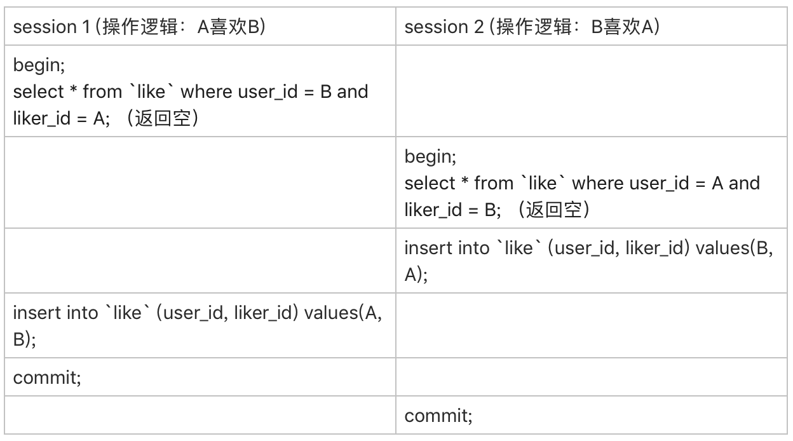

# 事务隔离

事务具有ACID特性，即Atomicity原子性、Consistency一致性、Isolation隔离性、Durability持久性。事务可以保证一组数据库操作，要么**全部**成功，要么**全部**失败。事务隔离与隔离性相关。

> **在MySQL中，事务支持是在引擎层实现的。**MySQL是一个支持多引擎的系统，但并不是所有的引擎都支持事务。比如MySQL原生的MyISAM引擎就不支持事务，这也是MyISAM被InnoDB取代的重要原因之一。

## 隔离性与隔离级别

当数据库上有多个事务同时执行的时候，就可能出现脏读（dirty read）、不可重复读（non-repeatable read）、幻读（phantom read）的问题，为了解决这些问题，就有了“隔离级别”的概念。

隔离级别越高，效率就会越低。我们需要在二者间寻找一个平衡点，SQL标准的事务隔离级别包括：

* **读未提交**\(read uncommitted\)：一个事务还没提交时，它做的变更就能被别的事务看到。
* **读提交**\(read committed\)：一个事务提交之后，它做的变更才会被其他事务看到。
* **可重复读**\(repeatable read\)：一个事务执行过程中看到的数据，总是跟这个事务在启动时看到的数据是一致的。当然在可重复读隔离级别下，未提交变更对其他事务也是不可见的。
* **串行化**\(serializable\)：对于同一行记录，“写”会加“写锁”，“读”会加“读锁”。当出现读写锁冲突的时候，后访问的事务必须等前一个事务执行完成，才能继续执行。

创建表`T`并插入一条数据，然后启动两个事务如下图所示。

```text
mysql> create table T(c int) engine=InnoDB;
mysql> insert into T(c) values(1);
```


* 若隔离级别是“读未提交”， 则V1的值就是2。这时候事务B虽然还没有提交，但是结果已经被A看到了。因此，V2、V3也都是2。
* 若隔离级别是“读提交”，则V1是1，V2的值是2。**事务B的更新在提交后才能被A看到。**所以， V3的值也是2。
* 若隔离级别是“可重复读”，则V1、V2是1，V3是2。之所以V2还是1，遵循的就是这个要求：**事务在执行期间看到的数据前后必须是一致的。**
* 若隔离级别是“串行化”，则**在事务B执行“将1改成2”的时候，会被锁住**。直到事务A提交后，事务B才可以继续执行。所以从A的角度看， V1、V2值是1，V3的值是2。

不同的隔离级别是如何实现的呢？

在实现上，数据库里面会创建一个**视图**，访问的时候以视图的逻辑结果为准。

* 在“可重复读”隔离级别下，这个**视图是在事务启动时创建的**，整个事务存在期间都用这个视图。
* 在“读提交”隔离级别下，这个**视图是在每个SQL语句开始执行的时候创建的**。
* “读未提交”隔离级别下直接返回记录上的最新值，**没有视图概念**
* “串行化”隔离级别下**直接用加锁的方式来避免并行访问**

在不同的隔离级别下，数据库行为是有所不同的。

> Oracle数据库的默认隔离级别其实就是“读提交”，因此对于一些从Oracle迁移到MySQL的应用，为保证数据库隔离级别的一致，一定要记得将MySQL的隔离级别设置为“读提交”。

通过`transaction_isolation`配置隔离级别：

```text
mysql> show variables like 'transaction_isolation';
+-----------------------+-----------------+
| Variable_name         | Value           |
+-----------------------+-----------------+
| transaction_isolation | REPEATABLE-READ |
+-----------------------+-----------------+
mysql> SET SESSION TRANSACTION ISOLATION LEVEL READ COMMITTED;
mysql> show variables like 'transaction_isolation';
+-----------------------+----------------+
| Variable_name         | Value          |
+-----------------------+----------------+
| transaction_isolation | READ-COMMITTED |
+-----------------------+----------------+
```

每个隔离级别都有它自己的使用场景，要根据业务情况来定。

假设你在管理一个个人银行账户表。一个表存了每个月月底的余额，一个表存了账单明细。这时候你要做数据校对，也就是判断上个月的余额和当前余额的差额，是否与本月的账单明细一致。你一定希望在校对过程中，即使有用户发生了一笔新的交易，也不影响你的校对结果。

这时候使用“可重复读”隔离级别就很方便。事务启动时的视图可以认为是静态的，不受其他事务更新的影响。

## 事务隔离的实现

**在MySQL中，实际上每条记录在更新的时候都会同时记录一条回滚操作。**记录上的最新值，通过回滚操作，都可以得到前一个状态的值。

假设一个值从1被按顺序改成了2、3、4，在回滚日志里面就会有类似下面的记录。


以 **可重复读** 隔离级别为例，虽然当前值是4，但是在查询这条记录的时候，不同时刻启动的事务会有不同的read-view。如图中看到的，在视图A、B、C里面，这一个记录的值分别是1、2、4，同一条记录在系统中可以存在多个版本，就是数据库的**多版本并发控制（MVCC）**。对于read-view A，要得到1，就必须将当前值依次执行图中所有的回滚操作得到。

即使现在有另外一个事务正在将4改成5，这个事务跟read-view A、B、C对应的事务是不会冲突的。

回滚日志在不需要的时候会被删除，系统会判断，当没有事务再需要用到这些回滚日志时（**系统里没有比这个回滚日志更早的read-view的时候**），将回滚日志删除。

因此，尽量不要使用长事务。因为长事务意味着系统里面会存在很老的事务视图。由于这些事务随时可能访问数据库里面的任何数据，所以这个事务提交之前，数据库里面它可能用到的回滚记录都必须保留，这就会导致大量占用存储空间。

除了对回滚段的影响，长事务还占用锁资源，也可能拖垮整个库。

## 事务的启动方式

MySQL的事务启动方式有以下几种：

1. 显式启动事务语句， `begin`或`start transaction`。配套的提交语句是`commit`，回滚语句是`rollback`。
2. `set autocommit=0`，这个命令会将这个线程的自动提交关掉。意味着如果你只执行一个select语句，这个事务就启动了，而且并不会自动提交。这个事务持续存在直到你主动执行`commit`或 `rollback`语句，或者断开连接。

有些客户端连接框架会默认在连接成功后先执行一个`set autocommit=0`的命令。这就导致接下来的查询都在事务中，如果是长连接，就导致了意外的长事务。因此，**建议总是使用`set autocommit=1`, 通过显式语句的方式来启动事务。**

对于一个需要频繁使用事务的业务，第二种方式每个事务在开始时都不需要主动执行一次 `begin`，减少了语句的交互次数。

在`autocommit`为1的情况下，用`begin`显式启动的事务，如果执行`commit`则提交事务。如果执行`commit work and chain`，则是提交事务并自动启动下一个事务，这样也省去了再次执行`begin`语句的开销。同时带来的好处是从程序开发的角度明确地知道每个语句是否处于事务中。

可以在`information_schema`库的`innodb_trx`这个表中查询长事务，比如查找持续时间超过60s的事务：

```text
mysql> select * from information_schema.innodb_trx where TIME_TO_SEC(timediff(now(),trx_started))>60
```

### 如何避免长事务对业务的影响？

**从应用开发端来看：**

1. 确认是否使用了`set autocommit=0`。这个确认工作可以在测试环境中开展，把MySQL的general\_log开起来，然后随便跑一个业务逻辑，通过general\_log的日志来确认。一般框架如果会设置这个值，也就会提供参数来控制行为，你的目标就是把它改成1。
2. 确认是否有不必要的只读事务。有些框架会习惯不管什么语句先用`begin/commit`框起来，这种只读事务可以去掉。
3. 业务连接数据库的时候，根据业务本身的预估，通过`SET MAX_EXECUTION_TIME`命令，来控制每个语句执行的最长时间，避免单个语句意外执行太长时间。

**从数据库端来看：**

1. 监控 `information_schema.Innodb_trx`表，设置长事务阈值，超过就报警/或者kill；
2. Percona的pt-kill工具
3. 在业务功能测试阶段要求输出所有的general\_log，分析日志行为提前发现问题；
4. 如果使用的是MySQL 5.6或者更新版本，把`innodb_undo_tablespaces`设置成2（或更大的值）。如果真的出现大事务导致回滚段过大，这样设置后清理起来更方便。

## 事务隔离的视图

在可重复读隔离级别下，事务T启动的时候会创建一个视图read-view，之后事务T执行期间，即使有其他事务修改了数据，事务T看到的仍然跟在启动时看到的一样。那如果事务T要修改某一行，而这一行的行锁被其他事务占有，等到其他事务结束后，事务T读到这一行的值是什么呢？

```text
mysql> CREATE TABLE `t` (
  `id` int(11) NOT NULL,
  `k` int(11) DEFAULT NULL,
  PRIMARY KEY (`id`)
) ENGINE=InnoDB;
mysql> insert into t(id, k) values(1,1),(2,2);
```


> **事务的启动时机**
>
> `begin/start transaction` 命令并不是一个事务的起点，在执行到它们之后的第一个操作InnoDB表的语句，事务才真正启动。
>
> 如果想要马上启动一个事务，可以使用`start transaction with consistent snapshot` 这个命令。
>
> 默认`autocommit=1`

事务C没有显式地使用`begin/commit`，说明这条更新语句本身就是一个事务，语句完成时自动提交。

事务B在更新了行之后查询; 事务A在一个只读事务中查询，并且时间顺序上是在事务B的查询之后。

按照可重复读的概念，事务A读到的值还是1。

而对于事务B，**更新数据都是先读后写的，而这个读，只能读当前的值，称为“当前读”（current read）。**因此事务B更新前读到的值是2，更新后的值就是3了。

之所以会产生这样的结果，还需要结合InnoDB的事务和锁进行分析。在MySQL里，有两个“视图”的概念：

* 一个是view。它是一个用查询语句定义的虚拟表，在调用的时候执行查询语句并生成结果。创建视图的语法是`create view …`，而它的查询方法与表一样。
* 另一个是InnoDB在实现MVCC时用到的一致性读视图，即`consistent read view`，用于支持RC（Read Committed，读提交）和RR（Repeatable Read，可重复读）隔离级别的实现。

它没有物理结构，作用是事务执行期间用来定义“我能看到什么数据”。

### “快照”在MVCC里是怎么工作的？

在可重复读隔离级别下，事务在启动的时候就“拍了个快照”，而且**这个快照是基于整库的**。

但是这个快照并不是真正地把整个数据库复制了一份，而是在逻辑上实现的。

InnoDB里面每个事务有一个唯一的事务ID，叫作transaction id。它是在事务开始的时候向InnoDB的事务系统申请的，是**按申请顺序严格递增**的。

而**每行数据也都是有多个版本的。**每次事务更新数据的时候，都会生成一个新的数据版本，并且把transaction id赋值给这个数据版本的事务ID，记为`row trx_id`。同时，旧的数据版本要保留，并且在新的数据版本中，能够有信息可以直接拿到它。

也就是说，数据表中的一行记录，其实可能有多个版本\(row\)，每个版本有自己的`row trx_id`。


虚线框里是同一行数据的4个版本，当前最新版本是V4，k的值是22，它是被transaction id 为25的事务更新的，因此它的`row trx_id`也是25。

虚线框里的三个虚线箭头，就是**undo log**；而V1、V2、V3并不是物理上真实存在的，而是每次需要的时候根据当前版本和undo log计算出来的。比如，需要V2的时候，就是通过V4依次执行U3、U2算出来。

那么，一个可重复读级别的事务在执行时，它看到的数据行的版本是如何确定的呢？

在事务启动瞬间，InnoDB为该事务构造了一个**数组**，用来保存这个瞬间处于“活跃”状态的所有事务ID。“活跃”指的就是，启动了但还没提交。

数组里面事务ID的最小值记为**低水位**，当前系统里面已经创建过的事务ID的最大值加1记为**高水位**。

这个视图数组和高水位，就组成了当前事务的一致性视图（read-view）。

数据版本的可见性规则，就是基于数据的`row trx_id`和这个一致性视图的对比结果得到的。这个视图数组把所有的`row trx_id` 分成了几种不同的情况。


对于当前事务的启动瞬间来说，一个数据版本的`row trx_id`，有以下几种可能：

1. 如果落在绿色部分，表示这个版本是已提交的事务或者是当前事务自己生成的，这个数据是可见的；
2. 如果落在红色部分，表示这个版本是由将来启动的事务生成的，是肯定不可见的；
3. 如果落在黄色部分\(`row trx_id in [低水位，高水位]`，而不是指该事务就是未提交的\)，那就包括两种情况

   a. 若`row trx_id`在数组中，表示这个版本是由还没提交的事务生成的，不可见；

   b. 若 `row trx_id`不在数组中，表示这个版本是已经提交了的事务生成的，可见。

> 
>
> 对于这一行数据，如果有一个事务，它的低水位是18，表明任何事务ID小于18的事务，都已经提交了。那么当它访问这一行数据时，就会从V4通过U3计算出V3，所以在它看来，这一行的值是11。

有了这个规定，系统里面随后发生的更新，就跟这个事务看到的内容无关了。因为之后的更新，生成的版本一定属于上面的2或者3\(a\)的情况，而对它来说，这些新的数据版本是不存在的，所以这个事务的快照，就是“静态”的了。

**InnoDB利用了“所有数据都有多个版本”的这个特性，实现了“秒级创建快照”的能力。**


现在再来看，事务A读到的值为什么是1？不妨做如下假设：

1. 事务A开始前，系统里面只有一个活跃事务ID是99；
2. 事务A、B、C的版本号分别是100、101、102，且当前系统里只有这四个事务；
3. 三个事务开始前，\(1,1）这一行数据的`row trx_id`是90。

这样，事务A的视图数组就是`[99,100]`, 事务B的视图数组是`[99,100,101]`, 事务C的视图数组是`[99,100,101,102]`。


第一个有效更新是事务C，把数据从`(1,1)`改成了`(1,2)`。这时候，这个数据的最新版本的`row trx_id`是102，而90这个版本已经成为了历史版本。

第二个有效更新是事务B，把数据从`(1,2)`改成了`(1,3)`。这时候，这个数据的最新版本（即`row trx_id`）是101，而102又成为了历史版本。

在事务A查询的时候，其实事务B还没有提交，但是它生成的`(1,3)`这个版本已经变成当前版本了。但这个版本对事务A必须是不可见的，否则就变成脏读了。

现在事务A要来读数据了，它的视图数组是`[99,100]`。当然了，读数据都是从当前版本读起的。所以，事务A查询语句的读数据流程是这样的：

* 找到`(1,3)`的时候，判断出`row trx_id=101`，比高水位大，处于红色区域，不可见；
* 接着，找到上一个历史版本，一看`row trx_id=102`，比高水位大，处于红色区域，不可见；
* 再往前找，终于找到了`(1,1)`，它的`row trx_id=90`，比低水位小，处于绿色区域，可见。

这样执行下来，虽然期间这一行数据被修改过，但是事务A不论在什么时候查询，看到这行数据的结果都是一致的，所以我们称之为一致性读。

一个数据版本，对于一个事务视图来说，除了自己的更新总是可见以外，有三种情况：

1. 版本未提交，不可见；
2. 版本已提交，但是是在视图创建后提交的，不可见；
3. 版本已提交，而且是在视图创建前提交的，可见。

现在，我们用这个规则来判断事务A的查询结果，事务A的查询语句的视图数组是在事务A启动的时候生成的，这时候：

* \(1,3\)还没提交，属于情况1，不可见；
* \(1,2\)虽然提交了，但是是在视图数组创建之后提交的，属于情况2，不可见；
* \(1,1\)是在视图数组创建之前提交的，可见。

### 更新逻辑

事务B与事务A的不同在于，在查询前对这个数据行做了修改。


如果事务B在更新之前查询一次数据，这个查询返回的k的值确实是1。

但是，当它要去更新数据的时候，就不能再在历史版本上更新了，否则事务C的更新就丢失了。因此，事务B此时的`set k=k+1`是在`（1,2）`的基础上进行的操作。

所以，这里就用到了这样一条规则：**更新数据都是先读后写的，而这个读，只能读当前的值，称为“当前读”（current read）。**

因此，在更新的时候，当前读拿到的数据是\(1,2\)，更新后生成了新版本的数据\(1,3\)，这个新版本的`row trx_id`是101。

所以，在执行事务B查询语句的时候，一看自己的版本号是101，最新数据的版本号也是101，是自己的更新，可以直接使用，所以查询得到的k的值是3。

除了update语句外，select语句如果加锁，也是**当前读**。把事务A的查询语句修改为如下的一种，也都可以读到版本号是101的数据，返回的k的值是3。下面这两个`select`语句，就是分别加了读锁（S锁，共享锁）和写锁（X锁，排他锁）。

```text
mysql> select k from t where id=1 lock in share mode;
mysql> select k from t where id=1 for update;
```

假设事务C不是马上提交的，而是变成了下面的事务C’，会怎么样呢？


事务C’的不同是，更新后并没有马上提交，在它提交前，事务B的更新语句先发起了。因为事务C’还没提交，所以还占用着`id=1`这一行数据的写锁。而事务B是当前读，必须要读最新版本，而且必须加锁，因此就被锁住了，必须等到事务C’释放这个锁，才能继续它的当前读。

### 可重复读、读提交

**事务的可重复读的能力是怎么实现的？**

可重复读的核心就是一致性读（consistent read）；而事务更新数据的时候，只能用当前读。如果当前的记录的行锁被其他事务占用的话，就需要进入锁等待。

读提交的逻辑和可重复读的逻辑类似，它们最主要的区别是：

* 在可重复读隔离级别下，只需要在**事务开始**的时候创建一致性视图，之后事务里的其他查询都共用这个一致性视图；
* 在读提交隔离级别下，**每一个语句执行前**都会重新算出一个新的视图。

在读提交隔离级别下，事务A和事务B的查询语句查到的k，分别应该是多少呢？

> `start transaction with consistent snapshot;`的意思是从这个语句开始，创建一个持续整个事务的一致性快照。所以，在读提交隔离级别下，这个用法就没意义了，等效于普通的`start transaction`。


这两个查询语句的创建视图数组的时机发生了变化，即图中的read view框。

事务A的查询语句的视图数组是在执行这个语句的时候创建的，时序上`(1,2)、(1,3)`的生成时间都在创建这个视图数组的时刻之前。但是，在这个时刻：

* `(1,3)`还没提交，属于情况1，不可见；
* `(1,2)`提交了，属于情况3，可见。

所以，这时候事务A查询语句返回的是k=2。显然地，事务B查询结果k=3。

> **为什么表结构不支持“可重复读”？**
>
> 因为表结构没有对应的行数据，也没有`row trx_id`，因此只能遵循当前读的逻辑。
>
> 不过MySQL 8.0已经可以把表结构放在InnoDB字典里了，也许以后会支持表结构的可重复读。

### 为什么更新不了数据

以下列语句构建实验环境，事务隔离级别是可重复读。

```text
mysql> CREATE TABLE `t` (
  `id` int(11) NOT NULL,
  `c` int(11) DEFAULT NULL,
  PRIMARY KEY (`id`)
) ENGINE=InnoDB;
mysql> insert into t(id, c) values(1,1),(2,2),(3,3),(4,4);
```

```text
mysql> select * from t;
+----+------+
| id | c    |
+----+------+
|  1 |    1 |
|  2 |    2 |
|  3 |    3 |
|  4 |    4 |
+----+------+
4 rows in set (0.00 sec)

mysql> update t set c=c+1 where id=c;
Query OK, 0 rows affected (0.00 sec)
Rows matched: 0  Changed: 0  Warnings: 0

mysql> select * from t;
+----+------+
| id | c    |
+----+------+
|  1 |    1 |
|  2 |    2 |
|  3 |    3 |
|  4 |    4 |
+----+------+
4 rows in set (0.00 sec)
```

为什么这个更新没有效果呢？

这就与更新前的**当前读**相关了，说明在执行`update`语句前，其他事务对这几行数据做了修改。


下面的情况，`session B'` 启动得比`session A`早，属于“版本未提交、不可见”的情况。


## 思考题

业务上有这样的需求，A、B两个用户，如果互相关注，则成为好友。设计上是有两张表，一个是`like`表，一个是`friend`表，`like`表有`user_id`、`liker_id`两个字段，设置为复合唯一索引即`uk_user_id_liker_id`。语句执行逻辑是这样的：

以A关注B为例：
先查询对方有没有关注自己（B有没有关注A）
`select * from like where user_id = B and liker_id = A;`

- 如果有，则成为好友：`insert into friend;`
- 没有，则只是单向关注关系：`insert into like;`

但是如果A、B**同时关注对方**，会出现不会成为好友的情况。因为在执行`select`语句时，双方都没关注对方。这种情况要怎么处理？

```
mysql> CREATE TABLE `like` (
  `id` int(11) NOT NULL AUTO_INCREMENT,
  `user_id` int(11) NOT NULL,
  `liker_id` int(11) NOT NULL,
  PRIMARY KEY (`id`),
  UNIQUE KEY `uk_user_id_liker_id` (`user_id`,`liker_id`)
) ENGINE=InnoDB;

mysql> CREATE TABLE `friend` (
  id` int(11) NOT NULL AUTO_INCREMENT,
  `friend_1_id` int(11) NOT NULL,
  `firned_2_id` int(11) NOT NULL,
  UNIQUE KEY `uk_friend` (`friend_1_id`,`firned_2_id`)
  PRIMARY KEY (`id`)
) ENGINE=InnoDB;
```

> “like”是关键字，不建议使用关键字作为库名、表名、字段名或索引名。



可以给“like”表增加一个字段，比如叫作 `relation_ship`，并设为整型，取值1(01)、2(10)、3(11)。

> 值是1的时候，表示`user_id `关注 `liker_id`;
> 值是2的时候，表示`liker_id `关注 `user_id`;
> 值是3的时候，表示互相关注。

当 A关注B的时候，先比较A和B的大小：

- 如果$A<B$

  ```
  mysql> begin; /*启动事务*/
  insert into `like`(user_id, liker_id, relation_ship) values(A, B, 1) on duplicate key update relation_ship=relation_ship | 1;
  select relation_ship from `like` where user_id=A and liker_id=B;
  /*代码中判断返回的 relation_ship，
    如果是1，事务结束，执行 commit
    如果是3，则执行下面这两个语句：
    */
  insert ignore into friend(friend_1_id, friend_2_id) values(A,B);
  commit;
  ```

- 如果$A>B$

  ```
  mysql> begin; /*启动事务*/
  insert into `like`(user_id, liker_id, relation_ship) values(B, A, 2) on duplicate key update relation_ship=relation_ship | 2;
  select relation_ship from `like` where user_id=B and liker_id=A;
  /*代码中判断返回的 relation_ship，
    如果是2，事务结束，执行 commit
    如果是3，则执行下面这两个语句：
  */
  insert ignore into friend(friend_1_id, friend_2_id) values(B,A);
  commit;
  ```

“like”表里的数据保证`user_id < liker_id`，这样不论是A关注B，还是B关注A，在操作“like”表的时候，如果反向的关系已经存在，就会出现行锁冲突。

`insert … on duplicate`语句，确保了在事务内部，执行了这个SQL语句后，就强行占住了这个行锁，之后的`select `判断`relation_ship`这个逻辑时就确保了是在行锁保护下的读操作。

`insert ignore`会忽略导致错误的行，因为friend表的 (`friend_1_id`,`firned_2_id`)索引是唯一索引，防止重复插入的报错。

这里使用唯一索引，是业务可能会插入重复数据，数据库一定要有唯一性约束。

