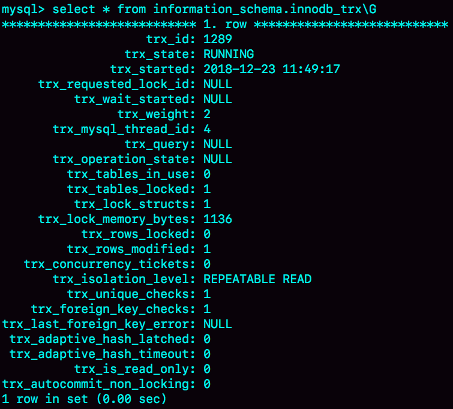
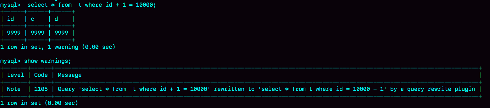

# “饮鸩止渴”提高性能的方法

业务高峰期，生产环境的MySQL压力太大，没法正常响应，需要短期内、临时性地提升一些性能。临时性能提升方案存在一定的风险，否则无损方案早就被应用到系统中了。

## 短连接风暴

正常的短连接模式就是连接到数据库后，执行很少的SQL语句就断开，下次需要的时候再重连。如果使用的是短连接，在业务高峰期的时候，就可能出现连接数突然暴涨的情况。

> MySQL建立连接的过程，成本是很高的。除了正常的网络连接三次握手外，还需要做登录权限判断和获得这个连接的数据读写权限。

短连接模型的缺点是，一旦数据库处理得慢一些，连接数就会暴涨。`max_connections`参数，用来控制一个MySQL实例同时存在的连接数的上限，超过这个值，系统就会拒绝接下来的连接请求，并报错提示`“Too many connections”`。对于被拒绝连接的请求来说，从业务角度看就是数据库不可用。

在机器负载比较高的时候，处理现有请求的时间变长，每个连接保持的时间也更长。这时，再有新建连接的话，就可能会超过`max_connections`的限制。

碰到这种情况时，一个比较自然的想法，就是调高`max_connections`的值。但这样做是有风险的。因为设计`max_connections`这个参数的目的是想保护MySQL，如果把它改得太大，让更多的连接都可以进来，那么系统的负载可能会进一步加大，大量的资源耗费在权限验证等逻辑上，结果可能是适得其反，已经连接的线程拿不到CPU资源去执行业务的SQL请求。

**处理方法**：

- **先处理掉那些占着连接但是不工作的线程。**

  `max_connections`的计算，不是看谁在running，是只要连着就占用一个计数位置。对于那些不需要保持的连接，可以通过`kill connection`主动踢掉。这个行为跟事先设置`wait_timeout`的效果是一样的。设置`wait_timeout`参数表示的是，一个线程空闲`wait_timeout`这么多秒之后，就会被MySQL直接断开连接。

  在`show processlist`的结果里，踢掉显示为sleep的线程，可能是有损的。
  

  如果断开session A的连接，因为这时候session A还没有提交，所以MySQL只能按照回滚事务来处理；而断开session B的连接，就没什么大影响。所以，如果按照优先级来说，应该优先断开像session B这样的**事务外空闲的连接**。

  在`show processlist`的结果里，session A和B的Command都是sleep，Info都是NULL。如何判断哪些是事务外空闲的连接呢？

  这时可以通过`information_schema.innodb_trx`表查看事务具体状态。
  

  这个结果里，`trx_mysql_thread_id=4`，表示`id=4`的线程还处在事务中。

  因此，如果是连接数过多，可以优先断开事务外空闲太久的连接；如果这样还不够，再考虑断开事务内空闲太久的连接。

  从数据库端主动断开连接可能是有损的，尤其是有的应用端收到这个错误后，不重新连接，而是直接用这个已经不能用的句柄重试查询。这会导致从应用端看上去，“MySQL一直没恢复”。

- **减少连接过程的消耗。**

  有的业务代码会在短时间内先大量申请数据库连接做备用，如果确认数据库是被连接行为打挂了，那么一种可能的做法，是让数据库**跳过权限验证阶段**。

  跳过权限验证的方法是：重启数据库，并使用`–skip-grant-tables`参数启动。这样，整个MySQL会跳过所有的权限验证阶段，包括连接过程和语句执行过程在内。

  但是，这种方法风险极高，尤其是数据库外网可访问的话，就更不能这么做了。

  在MySQL 8.0版本里，如果启用`–skip-grant-tables`参数，MySQL会默认把` --skip-networking`参数打开，表示这时候数据库只能被本地的客户端连接。

## 慢查询性能

在MySQL中，会引发性能问题的慢查询，大体有以下三种可能：

1. 索引没有设计好；
2. SQL语句没写好；
3. MySQL选错了索引。

> 实际上出现最多的是前两种，而这两种情况，恰恰是完全可以避免的。比如，通过下面这个过程，我们就可以预先发现问题。
>
> 1. 上线前，在测试环境，把慢查询日志(slow log)打开，并且把`long_query_time`设置成0，确保每个语句都会被记录入慢查询日志；
> 2. 在测试表里插入模拟线上的数据，做一遍回归测试；
> 3. 观察慢查询日志里每类语句的输出，特别留意Rows_examined字段是否与预期一致。
>
> 如果测试量比较大，可以使用[pt-query-digest工具](https://www.percona.com/doc/percona-toolkit/3.0/pt-query-digest.html)检查所有的SQL语句的返回结果。

### 索引没有设计好

这种场景一般就是通过**紧急创建索引**来解决。MySQL 5.6版本以后，创建索引都支持Online DDL了，对于那种高峰期数据库已经被这个语句打挂了的情况，最高效的做法就是直接执行`alter table` 语句。

比较理想的是能够在备库先执行。假设现在的服务是一主一备，主库A、备库B，这个方案的大致流程是这样的：

1. 在备库B上执行 `set sql_log_bin=off`，也就是不写binlog，然后执行`alter table` 语句加上索引；
2. 执行主备切换；
3. 这时候主库是B，备库是A。在A上执行 `set sql_log_bin=off`，然后执行`alter table` 语句加上索引。

> 平时在做变更的时候，应该考虑类似gh-ost这样的方案，更加稳妥。
>
> 但是在需要紧急处理时，上面这个方案的效率是最高的。

### 语句没写好

可以通过改写SQL语句来处理。MySQL 5.7提供了`query_rewrite`功能，可以把输入的一种语句改写成另外一种模式。

比如，语句被错误地写成了 `select * from t where id + 1 = 10000`，可以通过下面的方式，增加一个语句改写规则：

```
mysql> insert into query_rewrite.rewrite_rules(pattern, replacement, pattern_database) values ("select * from t where id + 1 = ?", "select * from t where id = ? - 1", "db1");

mysql> call query_rewrite.flush_rewrite_rules(); # 让插入的新规则生效
```



### MySQL选错了索引

给这个语句加上`force index`：使用查询重写功能，给原来的语句加上`force index`。


## QPS突增

有时候由于业务突然出现高峰，或者应用程序bug，导致某个语句的QPS突然暴涨，也可能导致MySQL压力过大，影响服务。

最理想的情况是让业务把这个功能下掉，服务自然就会恢复。下掉一个功能，如果从数据库端处理的话，对应于不同的背景，有不同的方法可用：

1. 如果是由全新业务的bug导致的，假设DB运维是比较规范的，也就是说白名单是一个个加的。这种情况下，如果你能够确定业务方会下掉这个功能，只是时间上没那么快，那么就可以从数据库端直接把白名单去掉。
2. 如果这个新功能使用的是单独的数据库用户，可以用管理员账号把这个用户删掉，然后断开现有连接。这样，这个新功能的连接不成功，由它引发的QPS就会变成0。
3. 如果这个新增的功能跟主体功能是部署在一起的，那么我们只能通过处理语句来限制。这时，可以使用查询重写功能，把压力最大的SQL语句直接重写成`"select 1"`返回。

这个操作的风险很高，需要考虑清楚，它可能存在下面的副作用：

1. 如果别的功能里面也用到了这个SQL语句模板，会有误伤；
2. 很多业务并不是靠这一个语句就能完成逻辑的，所以如果单独把这一个语句以`select 1`的结果返回的话，可能会导致后面的业务逻辑一起失败。

