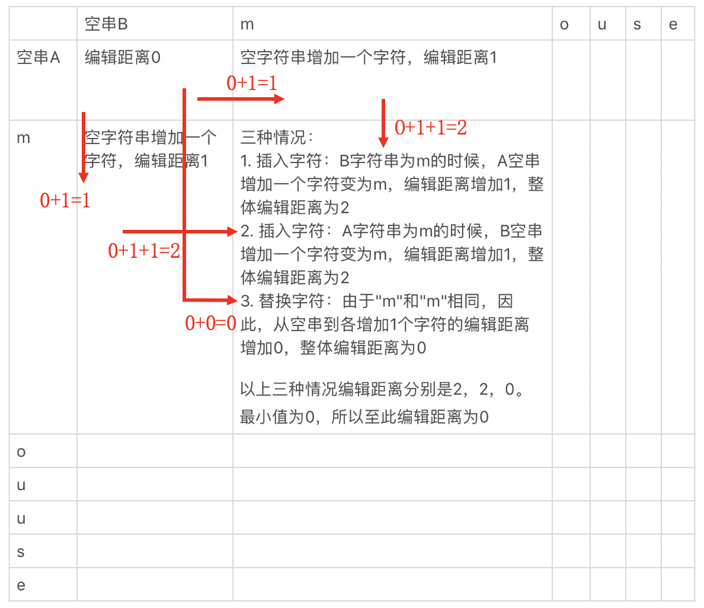

# 动态规划

动态规划需要通过子问题的最优解，推导出最终问题的最优解，因此这种方法特别注重子问题之间的转移关系。通常把这些子问题之间的转移称为**状态转移**，并把用于刻画这些状态转移的表达式称为**状态转移方程**。

找到合适的状态转移方程，是动态规划的关键。


## 编辑距离

测量拉丁文的文本相似度，最常用的指标是**编辑距离**（Edit Distance）。

**编辑距离**：由一个字符串转成另一个字符串所需的最少编辑操作次数，编辑操作有这三种：

- 把一个字符替换成另一个字符；
- 插入一个字符；
- 删除一个字符。

**编辑距离是从计算机的角度出发，直到两个字符串相同时的操作次数，而不是两个字符串的差别。**

考虑**最简单的情况**。假设字符串A和B都是空字符串，那么很明显这个时候编辑距离就是0。如果A增加一个字符a1，B保持不动，编辑距离就增加1。同样，如果B增加一个字符b1，A保持不动，编辑距离增加1。但是，如果A和B有一个字符，那么问题就有点复杂了，我们可以细分为以下几种情况。

我们先来看**插入字符**的情况。A字符串是a1的时候，B空串增加一个字符变为b1；或者B字符串为b1的时候，A空串增加一个字符变为a1。很明显，这种情况下，编辑距离都要增加1。*要注意，不管a1是否等于b1，编辑距离都要加1，因为考虑的是操作次数，不会因为字符相同而不变。*

我们再来看**替换字符**的情况。当A和B都是空串的时候，**同时增加**一个字符。如果要加入的字符a1和b1不相等，表示A和B之间转化的时候需要替换字符，那么编辑距离就是加1；如果a1和b1相等，无需替换，那么编辑距离不变。

最后，我们取上述三种情况中编辑距离的最小值作为当前的编辑距离。注意，这里我们只需要保留这个最小的值，而舍弃其他更大的值。这是为什么呢？因为编辑距离随着字符串的增长，是单调递增的。所以，要求最终的最小值，必须要保证对于每个子串，都取得了最小值。有了这点，之后我们就可以使用迭代的方式，一步步推导下去，直到两个字符串结束比较。




### 状态转移方程

假设字符数组A[]和B[]分别表示字符串A和B，`A[i]`表示字符串A中第i个位置的字符，`B[i]`表示字符串B中第i个位置的字符。二维数组`d[,]`表示字符串间最小编辑距离的二维表格，而d[i,j]表示这张表格中`A[0 ~ i]` 与`B[0 ~ j] `的最终编辑距离。函数`r(i, j)`表示**替换时**产生的编辑距离。如果A[i]和B[j]相同，函数的返回值为0，否则返回值为1。

- 如果i为0，且j也为0，那么d[i, j]为0。
- 如果i为0，且j大于0，那么d[i, j]为j。
- 如果i大于0，且j为0，那么d[i, j]为i。
- 如果i大于0，且 j大于0，那么$d[i, j]=min(d[i-1, j] + 1, d[i, j-1] + 1, d[i-1, j-1] + r(i, j))$。


## 钱币组合

给定总金额和可能的钱币面额，找出钱币数量最少的组合方式。

假设总金额为100，有2、3、7元 3种钱币，则为了凑满100元，有三种选择：

- 总和98元的钱币，加上1枚2元的钱币。如果凑到98元的最少币数是$x_{1}$，那么增加一枚2元后就是($x_{1}$ + 1)枚。
- 总和97元的钱币，加上1枚3元的钱币。如果凑到97元的最少币数是$x_{2}$，那么增加一枚3元后就是($x_{2}$ + 1)枚。
- 总和93元的钱币，加上1枚7元的钱币。如果凑到93元的最少币数是$x_{3}$，那么增加一枚7元后就是($x_{3}$ + 1)枚。

可以得到状态转移方程


c[i]表示总额为i的时候，所需要的最少钱币数，其中j=1,2,3,…,n，表示n种面额的钱币，value[j]表示第j种钱币的面额。c[i - values(j)]表示选择第j种钱币的时候，上一步为止最少的钱币数。需要注意的是，i - value(j)需要大于等于0，而且c[0] = 0。


### 代码

```
func coinChange(coins []int, amount int) int {
    if amount == 0 {
        return 0
    }
	c := make([]int, amount + 1, amount + 1)
    return minMoney(c, coins)
}

func minMoney(c []int, value []int) int {
	for i := 1; i < len(c); i++ {
		tmp := make([]int, len(value)) // 凑满i元时，当前步骤使用每一种钱币的总钱币数量
		for j := 0; j < len(value); j++ {
			if i >= value[j] {
                if i - value[j] == 0 || c[i - value[j]] > 0 {
                    tmp[j] = c[i - value[j]] + 1
                }
			}
		}
		
		// 找出最小的数量 需满足数量大于0的限制
		min := tmp[0]
		for k := 1; k < len(value); k++ {
			if  tmp[k] > 0{
                if min > tmp[k] || min == 0 {
                    min = tmp[k]
                }
            }
		}
		c[i] = min
	}
    
    // 若数量为0，说明没有解
    if c[len(c) - 1] > 0 {
        return c[len(c) - 1]
    }
    return -1
}

```


