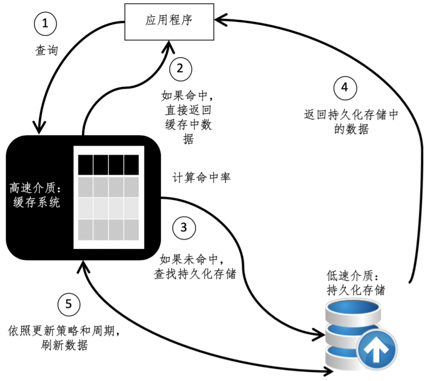
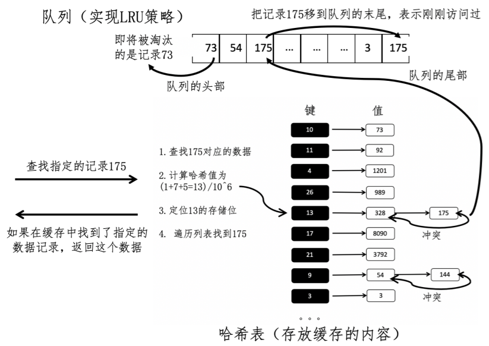

# 缓存系统

缓存（Cache）是计算机系统里非常重要的发明之一，它在编程领域中有非常非常多的应用。小到电脑的中央处理器（CPU）、主板、显卡等硬件，大到大规模的互联网站点，都在广泛使用缓存来提升速度。而在网站的架构设计中，一般不会像 PC 电脑那样采用高速的缓存介质，而是采用普通的服务器内存。但是网站架构所使用的内存容量大得多，至少是数个GB。

我们可以把缓存定义为数据交换的缓冲区。它的读取速度远远高于普通存储介质，可以帮助系统更快地运行。当某个应用需要读取数据时，会优先从缓存中查找需要的内容，如果找到了则直接获取，这个效率要比读取普通存储更高。如果缓存中没有发现需要的内容，再到普通存储中寻找。

## 缓存设计的主要考量因素

- **硬件的性能**。没有绝对的条件来定义何种性能可以达到缓存的资格，只要确保高速读取介质可以充当相对低速的介质的缓冲。

- **命中率**。缓存之所以能提升访问速度，主要是因为能从高速介质读取，这种情况称为“命中”（Hit）。但是，高速介质的成本是非常昂贵的，而且一般也不支持持久化存储，
  因此放入数据的容量必须受到限制，只能是全局信息的一部分。那么，一定是有部分数据无法在缓存中读取，而必须要到原始的存储中查找，这种情况称之为“错过”（Missed）。

  通常使用能够在缓存中查找到数据的次数（$\mid H \mid$ ），除以整体的数据访问次数（$\mid V \mid$  ）计算命中率。如果命中率高，系统能够频繁地获取已经在缓存中驻留的数据，速度会明显提升。
  $HitRatio =\frac{|H|}{|V |}$

  接下来的问题就是，如何在缓存容量有限的情况下，尽可能的提升命中率呢？通过某种机制将缓存中可能无用的数据剔除，然后向剔除后空余的空间中补充将来可能会访问的数据。

  最基本的策略包括**最少使用 LFU**（Least Frequently Used）策略和**最久未用 LRU**（Least Recently Used）策略。

  - LFU 会记录每个缓存对象被使用的频率，并将使用次数最少的对象剔除。
  - LRU 会记录每个缓存对象最近使用的时间，并将使用时间点最久远的对象给剔除。很显然，我们都希望缓存的命中率越高越好。

- **更新周期**。虽然缓存处理的效率非常高，但是，被访问的数据不会一成不变，对于变化速度很快的数据，我们需要将变动主动更新到缓存中，或者让原有内容失效，否则用户将读取到过时的内容。在无法及时更新数据的情况下，高命中率反而变成了坏事，轻则影响用户交互的体验，重则会导致应用逻辑的错误。

## 如何设计

使用哈希表和队列，设计一个基于最久未用 LRU 策略的缓存。

从缓存系统的工作流程可以看出，首先我们需要确认某个被请求的数据，是不是存在于缓存系统中。对于这个功能，哈希表是非常适合的。我们可以通过哈希值计算快速定位，加快查找的速度。不论哈希表中有多少数据，读取、插入和删除操作只需要耗费接近常量的时间，也就是 O (1) 的时间复杂度 ，这正好满足了缓存高速运作的需求。

在 LRU 策略中，系统会根据数据最近一次的使用时间来排序，使用时间最久远的对象会被淘汰。因此可以使用队列这一种先进先出的数据结构，先进入队列的元素会优先得到处理。如果充分利用队列的特点，我们就很容易找到上一次使用时间最久的数据，具体的实现过程如下。

- 第一，根据缓存的大小，设置队列的最大值。通常的做法是使用缓存里所能存放数据记录量的上限，作为队列里结点的总数的上限，两者保持一致。
- 第二，每次访问一个数据后，查看是不是已经存在一个队列中的结点对应于这个数据。如果不是，创造一个对应于这个数据的队列结点，加入队列尾部。如果是，把这个数据所对应的队列结点重新放入队列的尾部，这一点至关重要，因为这种操作可以保证上一次访问时间最久的数据，所对应的结点永远在队列的头部。
- 第三，如果队列已满，就需要淘汰一些缓存中的数据。由于队列里的结点和缓存中的数据记录量是一致的，所以队列里的结点数达到上限制，也就意味着缓存也已经满了。由于第二点的操作，只需要移除队列头部的结点就可以了。

使用哈希表来存放需要被缓存的内容，然后使用队列来实现 LRU 策略。每当数据请求进来的时候，缓存系统首先检查数据记录是不是已经存在哈希表中。如果不存在，那么就返回没有查找到，不会对哈希表和队列进行任何的改变；如果已经存在，就直接从哈希表读取并返回。

与此同时，在队列中进行相应的操作，标记对应记录最后访问的次序。队列头部的结点，对应即将被淘汰的记录。如果缓存或者说队列已满，而又需要插入新的缓存数据，那么就需要移除队列头部的结点，以及它所对应的哈希表结点。

