# PCA

Principal Component Analysis，主成分分析，能够找出数据分布之间的关系，从而达到降低维度的目的，并不需要监督式学习中样本标签和特征之间的关系。

随着特征数量不断的增加，特征向量的维度也会不断上升。这不仅会加大机器学习的难度，还会影响最终的准确度。针对这种情形，我们需要过滤掉一些不重要的特征，或者是把某些相关的特征合并起来，最终达到在减少特征维度的同时，尽量保留原始数据所包含的信息。


## 主要步骤

1. 标准化样本矩阵中的原始数据；
2. 获取标准化数据的协方差矩阵；
3. 计算协方差矩阵的特征值和特征向量；
4. 依照特征值的大小，挑选主要的特征向量；
5. 生成新的特征。


用一个 m个样本、n维特征的矩阵表示数据集

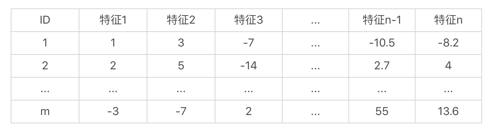

样本集的矩阵形式（每一行表示一个样本，而每一列表示一维特征）：

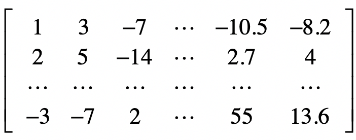

目的：找到一种变换，可以降低这个矩阵的列数，也就是特征的维数，并且尽可能的保留原始数据中有用的信息。


### 1.标准化样本矩阵中的原始数据

$x’=\frac{x-μ}{σ}$

$x$为原始值，$u$为均值，$σ$为标准差，$x’$是变换后的值。

需要注意的是，这里标准化的数据是针对同一种特征，也是**在同一个特征维度之内**。不同维度的特征不能放在一起进行标准化。


### 2.获取协方差矩阵

**协方差**（Covariance）：假设两个变量分别是$x$和$y$，而它们的采样数量都是$m$，那么协方差的计算公式就是如下这种形式：

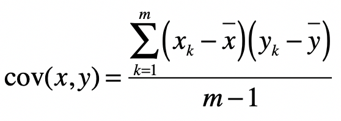

$x_k$表示变量$x$的第$k$个采样数据，$\bar{x}$表示这$k$个采样的平均值。而当两个变量是相同时，协方差就变成了方差。


**协方差矩阵**：假设$X_{,1}$表示样本矩阵$X$的第$1$列，$X_{,2}$表示样本矩阵$X$的第$2$列，依次类推。而$cov(X_{,1},X_{,1})$表示第1列向量和自己的协方差，而$cov(X_{,1},X_{,2})$表示第1列向量和第2列向量之间的协方差。

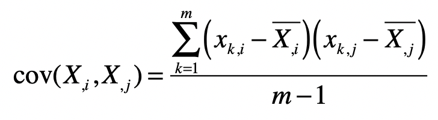

$x_{k,i}$表示矩阵中第$k$行，第$i$列的元素。 $\bar{X_{,i}}$表示第$i$列的平均值。

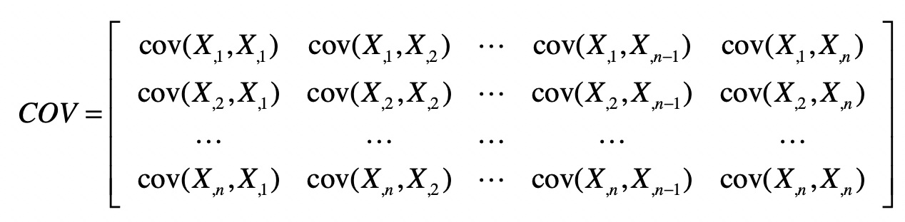

$COV$是个**对称矩阵**：$cov(X_{,i},X_{,j})=cov(X_{,j},X_{,i})$


### 3.计算协方差矩阵的特征值和特征向量

对于一个矩阵$X$，如果能找到向量$v$和标量$λ$，使得$Xv=λv$。

那么，我们就说$v$是矩阵$X$的**特征向量**，而$λ$是矩阵$X$的**特征值**。

矩阵的特征向量和特征值可能不止一个。

把向量$v$左乘一个矩阵$X$看做对$v$进行**旋转或拉伸**，而这种旋转和拉伸都是由于左乘矩阵$X$后，所产生的“运动”所导致的。特征向量$v$表示了矩阵$X$运动的方向，特征值$λ$表示了运动的幅度，这两者结合就能描述左乘矩阵$X$所带来的效果，因此被看作矩阵的“特征”。

**PCA中的主成分，就是指特征向量**，而对应的特征值的大小，就表示这个特征向量或者说主成分的重要程度。特征值越大，重要程度越高，我们要优先现在这个主成分，并利用这个主成分对原始数据进行变换。

**计算特征值的推导过程**：

$Xv=λv$
$Xv-λv=0$
$Xv-λIv=0$
$(X-λI)v=0$

其中I是单位矩阵。

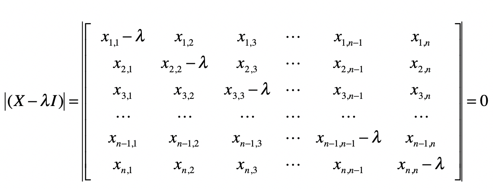

$(x_{1,1}-λ)(x_{2,2}-λ)…(x_{n,n}-λ)+x_{1,2}x_{2,3}…x_{n-1,n}x_{n,1}+…)-(x_{n,1}x_{n-1,2}…x_{2,n-1}x_{1,n})=0$

通过解这个方程式，我们就能求得各种λ的解，而这些解就是特征值。计算完特征值，我们可以把不同的λ值代入$λI-X$(或$X-λI$)，来获取特征向量（使下式为0的列向量）。

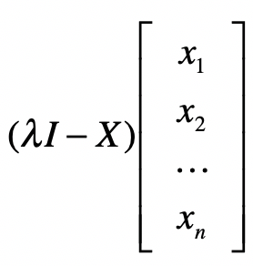


### 4.挑选主要的特征向量，转换原始数据

假设我们获得了k个特征值和对应的特征向量，那么我们就有：

$Xv_1=λ_1v_1$
$Xv_2=λ_2v_2$
$…$
$Xv_k=λ_kv_k$

按照所对应的λ数值的大小，对这k组的v排序。排名靠前的v就是最重要的特征向量。

假设我们只取前k1个最重要的特征，那么我们使用这k1个特征向量，组成一个n×k1维的矩阵D（n是原数据集的特征维数，即将原来n个特征转换为k1个特征）。

把包含原始数据的m×n维矩阵X左乘矩阵D，就能重新获得一个m×k1维的矩阵，达到了降维的目的。

k1的取值：一种常见的做法是，看前k1个特征值的和占所有特征值总和的百分比。


## 例子

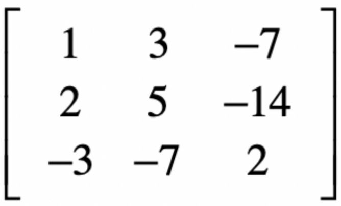

### 1.标准化

在标准化的时候，需要注意的是，分母都使用 m 而不是 m-1，这是为了和之后 Python中 sklearn 库的默认实现保持一致。

第一维特征的数据是 1，2，-3。平均值是 0，方差是$$\sqrt{\frac{1+4+9}{3}}\approx 2.16$$

标准化之后第一维特征的数据是 1/2.16=0.463 ，2/2.16=0.926，-3/2.16=-1.389。以此类推，我们可以获得第二个维度和第三个维度标准化之后的数据。

**代码实现**

```
from numpy import *
from numpy import linalg as LA
from sklearn.preprocessing import scale

# 原始数据，包含了 3 个样本和 3 个特征，每一行表示一个样本，每一列表示一维特征
x = mat([[1,3,-7],[2,5,-14],[-3,-7,2]])

# 矩阵按列进行标准化
x_s = scale(x, with_mean=True, with_std=True, axis=0)
print(" 标准化后的矩阵：", x_s)
```

scale 函数使用了 axis=0，表示对列进行标准化，因为目前的矩阵排列中，每一列代表一个特征维度。如果矩阵排列中每一行代表一个特征维度，则使用 axis=1对行进行标准化。


标准化后的矩阵：

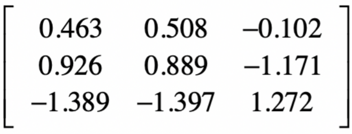


### 2.协方差计算

对于第 1 维向量的方差，有$$\frac{0.463^2 + 0.926^2  + (-1.389)^2}{2}\approx 1.5$$

第 1 维和第 2 维向量之间的协方差是$$\frac{0.463×0.508 + 0.926×0.889  + (-1.389)×(−1.397)}{2}\approx 1.5$$(标准化后每一维的均值都是或接近0）。


**代码实现**

```
# 计算协方差矩阵，注意这里需要先进行转置，因为这里的函数是看行与行之间的协方差
x_cov = cov(x_s.transpose()) # numpy 中的协方差函数 cov 除以的是 (m-1)
# 输出协方差矩阵
print(" 协方差矩阵：\n", x_cov, "\n")
```


协方差矩阵：

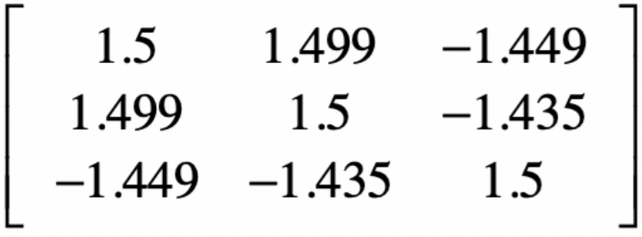


### 3.求解协方差矩阵的特征值和特征向量

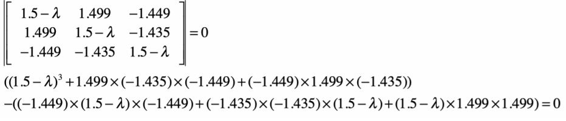

最后化简为：

$$−λ^3 + 4.5λ^2 - 0.343λ = 0$$

$$λ(0.0777 − λ)(λ − 4.4223) = 0$$

所以 有 3 个近似解，分别是 0、0.0777 和 4.4223。


**代码实现**

```
# 求协方差矩阵的特征值和特征向量
eigVals, eigVects = LA.eig(x_cov)
print(" 协方差矩阵的特征值：", eigVals)
print(" 协方差的特征向量（主成分）：\n", eigVects, "\n")
```

可以得到三个特征值及它们对应的特征向量(输出的特征向量是列向量)。


### 4.找出特征值最大的特征向量

```
# 找到最大的特征值，及其对应的特征向量
max_eigVal = -1
max_eigVal_index = -1

for i in range(0, eigVals.size):
  if (eigVals[i] > max_eigVal):
 	max_eigVal = eigVals[i]
 	max_eigVal_index = i
 
  eigVect_with_max_eigVal = eigVects[:,max_eigVal_index]

# 输出最大的特征值及其对应的特征向量，也就是第一个主成分
print(" 最大的特征值：", max_eigVal)
print(" 最大特征值所对应的特征向量：", eigVect_with_max_eigVal)

# 输出变换后的数据矩阵。注意，这里的三个值是表示三个样本，而特征从 3 维变为 1 维了。
print(" 变换后的数据矩阵：", x_s.dot(eigVect_with_max_eigVal), "\n")
```

最大的特征值是 4.422311507725755，对应的特征向量是 [-0.58077228
-0.57896098 0.57228292]。变换后的样本矩阵是：

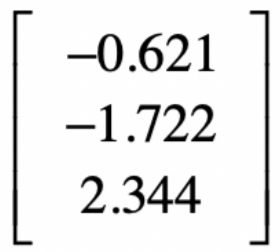

它从原来的 3 个特征维度降维 1 个特征维度了。


## 核心思想

### 为什么要使用协方差矩阵？

为什么我们要使用样本数据中，各个维度之间的协方差，来构建一个新的协方差矩阵？要弄清楚这一点，首先要回到 PCA 最终的目标：**降维**。降维就是要去除那些**表达信息量少**，或者**冗余的维度**。

**如何定义维度的信息量大小**：这里我们认为样本在某个特征上的差异就越大，那么这个特征包含的信息量就越大，就越重要。相反，信息量就越小，需要被过滤掉。很自然，我们就能想到使用某维特征的方差来定义样本在这个特征维度上的差异。

**看如何发现冗余的信息**：如果两种特征是有很高的相关性，那我们可以从一个
维度的值推算出另一个维度的值，所表达的信息就是重复的。可以使用皮尔森（Pearson）相关系数，来描述两个变量之间的线性相关程度。这个系数的取值范围是`[-1, 1]` ，绝对值越大，说明相关性越高，正数表示正相关，负数表示负相关。

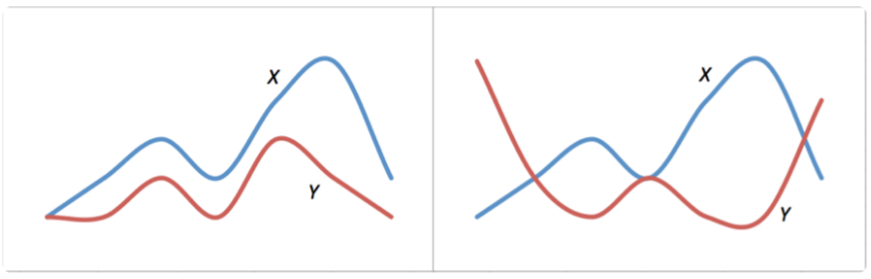

左侧X 曲线和Y 曲线有非常近似的变化趋势，当X 上升 Y往往也是上升的， X下降 Y往往也下降，这表示两者有较强的正相关性。右侧 X和 Y两者相反，这表示两者有较强的负相关性。


**皮尔森系数计算公式**：

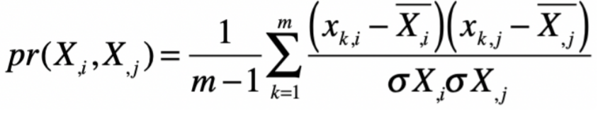

其中 n表示向量维度，m表示样本数量，$x_{k,i}$ 和 $x_{k,j}$ 分别为两个特征维度 i和j 在第 k个采样上的数值。 $\bar{x_{,i}}$和 $\bar{x_{,j}}$分别表示两个特征维度上所有样本的均值， $\sigma X_{,i}$和 $\sigma X_{,j}$分别表示两个特征维度上所有样本的标准差。

皮尔森系数和协方差之间的关系：
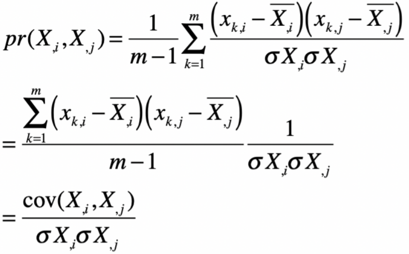

**皮尔森相关系数和数据标准化后的协方差是一致的。**

协方差矩阵**主对角线上的元素是各维度上的方差，也就体现了信息量**，而**其他元素是两两维度间的协方差，也就体现了相关性**。因此我们就使用各个维度之间的协方差所构成的矩阵，作为 PCA 分析的对象。


### 为什么要计算协方差矩阵的特征值和特征向量？

**对角矩阵**：说只有矩阵主对角线之上的元素有非 0 值，而其他元素的值都为 0。

协方差矩阵的主对角线上，都是表示信息量的方差，而其他元素都是表示相关性的协方差。既然我们希望尽可能保留大信息量的维度，而去除相关的维度，那么就意味着我们希望对协方差进行对角化，尽可能地使得矩阵只有主对角线上有非 0 元素。

假如我们确实可以把矩阵尽可能的对角化，那么对角化之后的矩阵，它的主对角线上元素接近矩阵的特征值，而特征值本身又表示了转换后的方差，也就是信息量。而此时，对应的各个特征向量之间是基本正交的，也就是相关性极低甚至没有相关性。


**特征值和特征向量的几何意义**

在向量空间中，对某个向量左乘一个矩阵，实际上是对这个向量进行了一次变换。在这个变换的过程中，被左乘的向量主要发生旋转和伸缩这两种变化。**如果左乘矩阵对某一个向量或某些向量只发生伸缩变换，不对这些向量产生旋转的效果，那么这些向量就称为这个矩阵的特征向量，而伸缩的比例就是特征值。**换句话来说，某个矩阵的特征向量表示了这个矩阵在空间中的变换方向，这些方向都是趋于正交的，而特征值表示每个方向上伸缩的比例。

如果一个特征值很大，那么说明在对应的特征向量所表示的方向上，伸缩幅度很大。这也是为什么，我们需要使用原始的数据去左乘这个特征向量，来获取降维后的新数据。因为这样做可以帮助我们找到一个方向，让它最大程度地包含原有的信息。需要注意的是，**这个新的方向，往往不代表原始的特征，而是多个原始特征的组合和缩放**。


