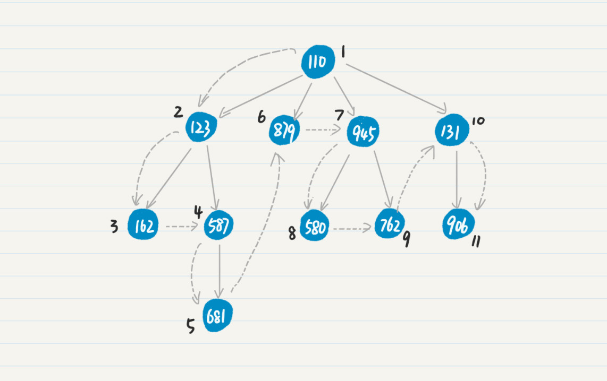
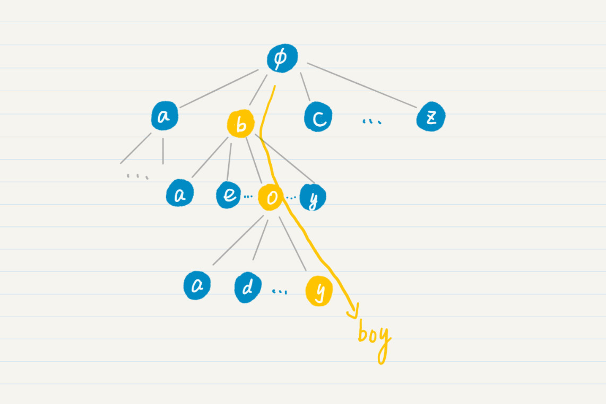
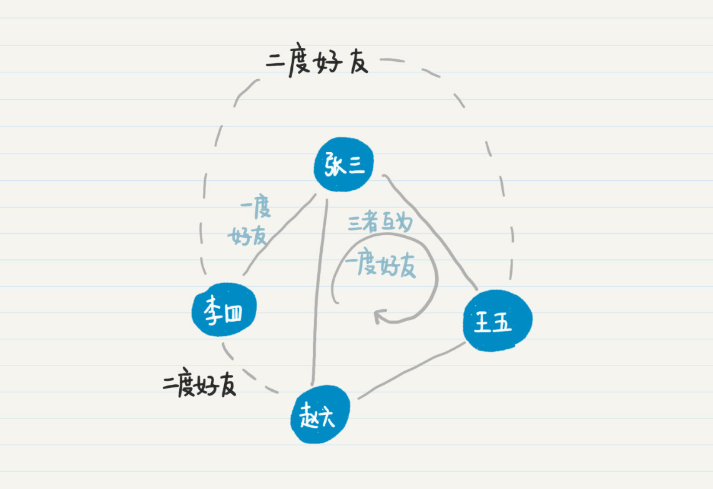
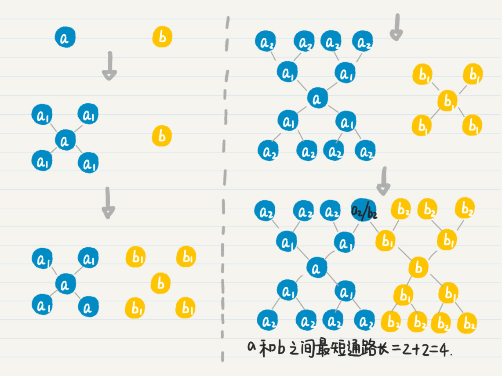
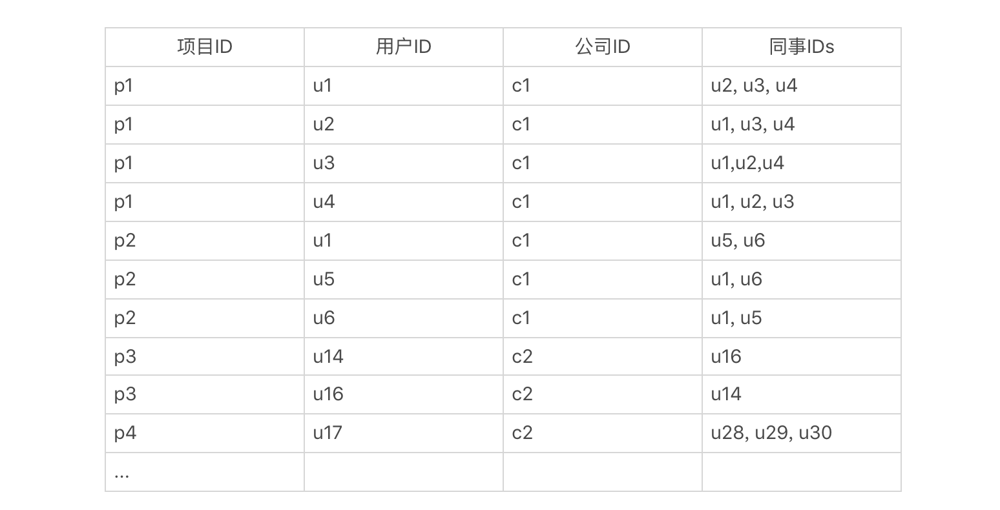
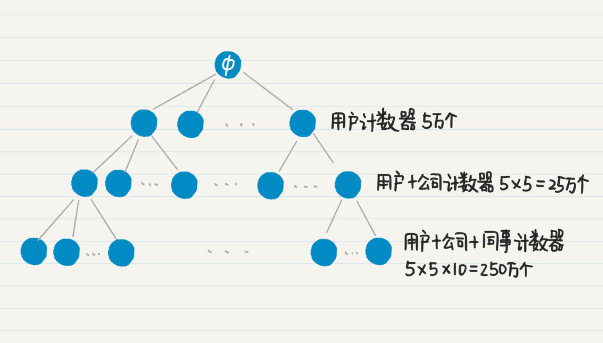
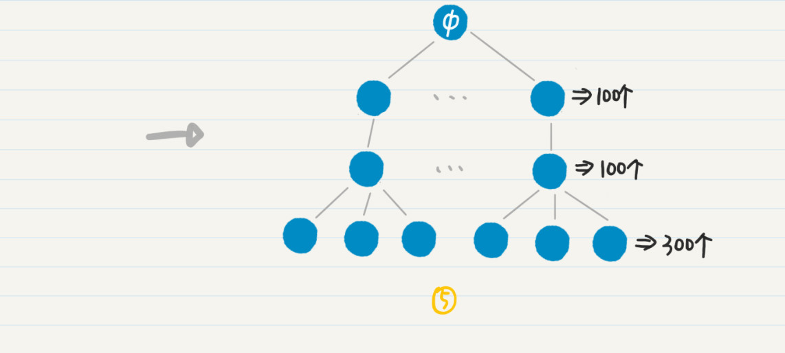

# 树

## 深度优先搜索

从树中的某个结点出发，沿着和这个结点相连的边向前走，找到下一个结点，然后以这种方式不断地发现新的结点和边，一直搜索下去，直到访问了所有和出发点连通的点、或者满足某个条件后停止。

如果到了某个点，发现和这个点直接相连的所有点都已经被访问过，那么就回退到在这个点的父结点，继续查看是否有新的点可以访问；如果没有就继续回退，一直到出发点。由于单棵树中所有的结点都是连通的，所以通过深度优先的策略可以遍历树中所有的结点，因此也被称为**深度优先遍历**。



### 前缀树

从树顶层的根节点一直遍历到最下层的叶子节点，最终逐步构成单词前缀。



- 预测文本输入功能：搜索引擎的输入框中输入搜索关键词的预测文本提示、IDE代码编辑器和浏览器网址中输入时的预测文本提示
- 对字符串或单词按字母顺序实现排序并进行输出的功能
- 近似匹配，包括拼写检查和连字软件使用的算法

#### 构建及查询

把空字符串作为树的根。对于每个单词，其中每一个字符都代表了有向树的一个结点。

```
type node struct {
	isWord   bool
	children map[byte]*node
	explanation string // 单词解释
	label byte // 当前字符
	prefix string // 从树根到当前节点父节点的所有字母组成的前缀
}

func NewNode() *node {
	return &node{
		isWord:   false,
		children: make(map[byte]*node),
	}
}

func (n *node) Insert(word string) {
	curNode := n
	for i := 0; i < len(word); i++ {
		ch := word[i]
		if v, ok := curNode.children[ch]; ok {
			curNode = v
		} else {
			newNode := NewNode()
			curNode.children[ch] = newNode
			curNode = curNode.children[ch]
		}
	}
	curNode.isWord = true
}

func (n node) Search(word string) bool {
	curNode := n
	for i := 0; i < len(word); i++ {
		ch := word[i]
		if v, ok := curNode.children[ch]; ok {
			curNode = *v
		} else {
			return false
		}
	}

	return curNode.isWord
}
```


查询时需注意下列情况：

- 如果还没到叶子结点的时候，待查的单词就结束了。这个时候要看最后匹配上的非叶子结点是否代表一个单词；如果不是，那说明被查单词并不在字典中。

- 如果搜索到前缀树的叶子结点，但是被查单词仍有未处理的字母。由于叶子结点没有子结点，这时候，被查单词不可能在字典中。

- 如果搜索到一半，还没到达叶子结点，被查单词也有尚未处理的字母，但是当前被处理的字母已经无法和结点上的字符匹配了。这时候，被查单词不可能在字典中。


#### 遍历所有单词

查找一个单词的过程，其实就是在有向树中，找一条从树的根到代表这个单词的结点之通路。那么如果要遍历所有的单词，就意味着我们要找出从根到所有代表单词的结点之通路。

```
// 用一个栈模拟
func (n node) GetAll() {
	stack := []*node{&n}
	for len(stack) != 0 {
	    // 出栈
		curNode := stack[len(stack) - 1] 
		stack = stack[:len(stack) - 1]
		
		if curNode.isWord {
			fmt.Println(curNode.prefix + curNode.label) 
		}
		
		for _, v := range curNode.children {
			stack = append(stack, v)
		}
	}
}
```


## 广度优先搜索

从图中的某个结点出发，沿着和这个点相连的边向前走，去寻找和这个点距离为1的所有其他点。只有当和起始点距离为1的所有点都被搜索完毕，才开始搜索和起始点距离为2的点。当所有和起始点距离为2的点都被搜索完了，才开始搜索和起始点距离为3的点，如此类推。


### 社交网络中的好友问题

在数学里，我们通常使用图中的结点来表示一个人，而用图中的边来表示人和人之间的相识关系，“相识关系”又可以分为单向和双向。

单向表示，两个人a和b，a认识b，但是b不认识a。如果是单向关系，我们就需要使用有向边来区分是a认识b，还是b认识a。如果是双向关系，双方相互认识，因此直接用无向边就够了。我们假设相识关系都是双向的，所以我们接下来讨论的都是无向图。

**用两人之间最短通路的长度，来定义他们是几度好友**。照此定义，在下图中，张三、王五和赵六互为一度好友，而李四和赵六、王五为二度好友。



寻找两个人之间的最短通路，或者说找出两人是几度好友，在社交中有不少应用。例如，

- 推荐新的好友
- 找出两人之间的关系的紧密程度
- 职场背景调查等等


这种情况下，不好使用dfs，因为图中可能存在回路，一旦遇到产生回路的边，我们需要将它过滤。具体的操作是，判断新访问的点是不是已经在当前通路中出现过，如果出现过就不再访问。

但是在这个应用中，dfs的适用性不高。

> 六度理论
>
> 地球上任何两个人之间的社交关系不会超过六度。
>
> 假设每个人平均认识100个人，那么你的二度好友就是100^2^ ，以此类推，三度好友是100^3^，到五度好友就有100亿人了，已经超过了地球目前的总人口。

人类的社会关系会随着关系的度数增加，而呈指数级的膨胀。这意味着，在深度搜索的时候，每增加一度关系，就会新增大量的好友。但是当我们在用户推荐中查看可能的好友时，基本上不会看完所有推荐列表，最多也就看个几十个人，一般可能也就看看前几个人。所以，如果我们使用深度优先搜索，把所有可能的好友都找到再排序，那效率实在太低了。

更高效的做法是，我们只需要先找到所有二度的好友，如果二度好友不够了，再去找三度或者四度的好友。


#### 代码模拟

```
const UserNum = 100
const RelationNum = 200

type Node struct {
	userId int
	friends map[int]bool // go没有set，用map代替
	degree int // 用于存放和给定的用户结点，是几度好友
}

func NewUser(id int) Node {
	return Node{
		userId:  id,
		friends: make(map[int]bool),
		degree:  0,
	}
}

func TestBFS(t *testing.T) {
	var users = []Node{}
	for i := 0; i < UserNum; i++ {
		users = append(users, NewUser(i))
	}
	// 生成所有表示好友关系的边
	for i := 0; i < RelationNum; i++ {
		friendAId := rand.Intn(UserNum)
		friendBId := rand.Intn(UserNum)
		
		// 自己不能是自己的好友。如果生成的两个好友id相同，跳过
		if friendAId == friendBId {
			continue
		};
		
		friendA := users[friendAId]
		friendB := users[friendBId]
		friendA.friends[friendBId] = true
		friendB.friends[friendAId] = true
	}

	users[0].BFS(users)
}

// 查找n对应的用户的好友
func (n Node) BFS(users []Node) {
	queue := []int{n.userId}
	visited := map[int]bool{
		n.userId: true,
	}

	for len(queue) > 0 {
		userId := queue[0]
		queue = queue[1:]

		for k, v := range users[userId].friends {
			if v && !visited[k] {
				queue = append(queue, k)
				users[k].degree = users[userId].degree + 1
				visited[k] = true
				fmt.Printf("%d度好友：%d\n", users[k].degree, k)
			}
		}
	}
}
```


### 双向bfs

求两个用户间的最短路径，基本的做法是，从其中一个人出发，进行广度优先搜索，看看另一个人是否在其中。如果不幸的话，两个人相距六度，那么即使是广度优先搜索，同样要达到万亿级的数量。

如何更高效地求得两个用户的最短路径呢？

很显然，随着社会关系的度数增加，好友数量是呈指数级增长的。所以，如果我们可以控制这种指数级的增长，那么就可以控制潜在好友的数量，达到提升效率的目的。

假设有两个人$a$、$b$。我们首先从$a$出发，进行广度优先搜索，记录$a$的所有一度好友$a_{1}$，然后看点$b$是否出现在集合$a_{1}$中。如果没有，就再从$b$出发，进行广度优先搜索，记录所有一度好友$b_{1}$，然后看$a$和$a_{1}$是否出现在$b$和$b_{1}$的并集中。如果没有，就回到$a$，继续从它出发的广度优先搜索，记录所有二度好友$a_{2}$，然后看$b$和$b_{1}$是否出现在$a$、$a_{1}$和$a_{2}$三者的并集中（其实只要看$b$和$b_{1}$是否出现在$a_{2}$中就可以了）。如果没有，就回到$b$，继续从它出发的广度优先搜索。如此轮流下去，直到找到$a$的好友和$b$的好友的交集。

如果有交集，就表明这个交集里的点到$a​$和$b​$都是通路。我们假设$c​$在这个交集中，那么把$a​$到$c​$的通路长度和$b​$到$c​$的通路长度相加，得到的就是从$a​$到$b​$的最短通路长，也就是两者为几度好友。




#### 代码

```
type Node struct { 	
	userId int 	
	friends map[int]bool // go没有set，用map代替 	
	degree int // 用于存放和给定的用户结点，是几度好友 
	degrees map[int]int // 从不同用户出发，到当前用户是第几度结点
}

func biBFS(users []Node, idA, idB int) int {
	if idA == idB {
		return 0
	}
	
	queueA := []int{idA}
	visitedA := map[int]bool{
		idA: true,
	}

	queueB := []int{idB}
	visitedB := map[int]bool{
		idB: true,
	}

	var (
		degreeA = 0
		degreeB = 0
		maxDegree = 20	// 防止两者间没有通路
	)

	for degreeA + degreeB < maxDegree {
		degreeA++
		// 沿着a出发的方向，继续广度优先搜索degree + 1的好友
		getNextDegreeFriend(idA, users, queueA, visitedA, degreeA)

		// 判断到目前为止，被发现的a的好友，和被发现的b的好友，两个集合是否存在交集
		if hasOverlap(visitedA, visitedB) {
			return degreeA + degreeB
		}

		degreeB++
		getNextDegreeFriend(idB, users, queueB, visitedB, degreeB)
		if hasOverlap(visitedA, visitedB) {
			return degreeA + degreeB
		}
	}
	return -1
}
```


### 嵌套型聚合

聚合是数据分析中一个很常见的操作，它会根据一定的条件把记录聚集成不同的分组，以便我们统计每个分组里的信息。例如，SQL语言中的GROUP BY语句，Python和Spark语言中data frame的groupby函数，Solr的facet查询和Elasticsearch的aggregation查询，都可以实现聚合的功能。

我们可以嵌套使用不同的聚合，获得层级型的统计结果。但是，实际上，针对一个规模超大的数据集，聚合的嵌套可能会导致性能严重下降。

下面这个数据表描述了一个社交网络中，每个人的职业经历。字段包括项目的ID、用户ID、公司ID和同事的IDs。

 

对于这张表，我们可以进行三层嵌套的聚集。第一级是根据用户ID来聚，获取每位用户一共参与了多少项目。第二级是根据公司ID来聚，获取每位用户在每家公司参与了多少项目。第三级根据同事ID来聚，获取每位用户在每家公司，和每位同事共同参与了多少项目。最终结果应该是类似下面这样的：

```
用户u88，总共50个项目（包括在公司c42中的10个，c26中的8个...）
		在公司c42中，参与10个项目（包括和u120共事的4个，和u99共事的3个...）
				和u120共同参与4个项目
				和u99共同参与3个项目
				和u72共同参与3个项目
		在公司c26中，参与了8个项目
				和u145共同参与5个项目
				和u128共同参与3个项目
		（用户u88在其他公司的项目...）

用户u66，总共47个项目
		在公司c28中，参与了16个项目
		  和u65共同参与了5个项目
(用户u66的剩余数据...）
...		
（其他用户的数据...）
```


如何实现这种聚合统计呢？

分别为“每个用户”“每个用户+每个公司”“每个用户+每个公司+每位同事”，生成很多很多的计数器。可是，如果用户的数量非常大，那么这个“很多”就会成为一个可怕的数字。

假设这个社交网有5万用户，每位用户平均在5家公司工作过，而用户在每家公司平均有10名共事的同事，那么针对用户的计数器有5万个，针对“每个用户+每个公司”的计数器有25万个，而到了“每个用户+每个公司+每位同事”的计数器，就已经达到250万个了，三个层级总共需要280万计数器。



假设一个计数器是4个字节，那么280万个计数器就需要消耗超过10M的内存。对于高并发、低延迟的实时性服务，如果每个请求都要消耗10M内存，很容易就导致服务器崩溃。另外，**实时性的服务，往往只需要前若干个结果就足以满足需求了**。在这种情况下，完全基于排列的设计就有优化的空间了。

对于只需要返回前若干结果的应用场景，我们可以对图中的树状结构进行剪枝，去掉绝大部分不需要的结点和边，这样就能节省大量的内存和CPU计算。

比如，如果我们只需要返回前100个参与项目最多的用户，那么就没有必要按照深度优先的策略，去扩展树中高度为2和3的结点了，而是应该使用广度优先策略，首先找出所有高度为1的结点，根据项目数量进行排序，然后只取出前100个，把计数器的数量从5万个一下子降到100个。

以此类推，我们还可以控制高度为2和3的结点之数量。如果我们只要看前100位用户，每位用户只看排名第一的公司，而每家公司只看合作最多的3名同事，那么最终计数器数量就只有50000+100x5+100x1x10=51500。




广度优先搜索，相对于深度优先搜索，没有函数的嵌套调用和回溯操作，所以运行速度比较快。但是，随着搜索过程的进行，广度优先需要在队列中存放新遇到的所有结点，因此占用的存储空间通常比深度优先搜索多。

相比之下，深度优先搜索法只保留用于回溯的结点，而扩展完的结点会从栈中弹出并被删除。所以深度优先搜索占用空间相对较少。不过，深度优先搜索的速度比较慢，而并不适合查找结点之间的最短路径之类的应用。

双向广度优先比单向广度优先更高效，必须要满足 **两个被搜索节点必须是连通的** 这个条件。


## 从树到图

地图导航App查询出行路线，就是将地点当作图中的节点，道路就是边（有向边），边的权重可能是从一点到另一点所花费的时间 或者 两点之间的物理距离。

### Dijkstra算法

求两点间的最短路。

