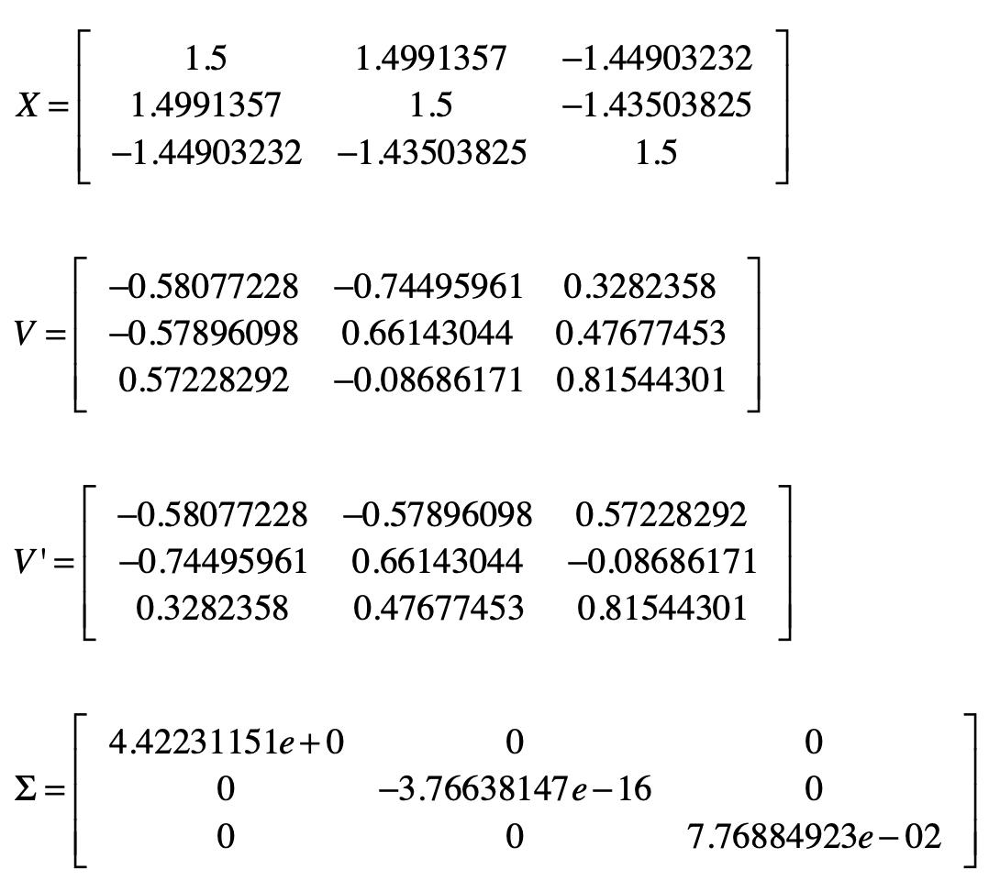
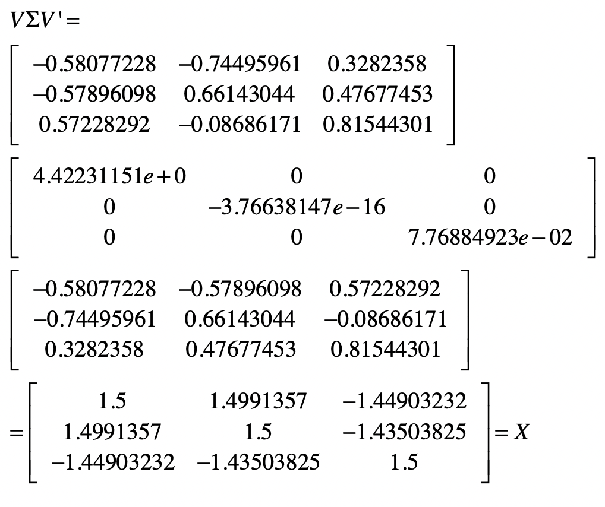
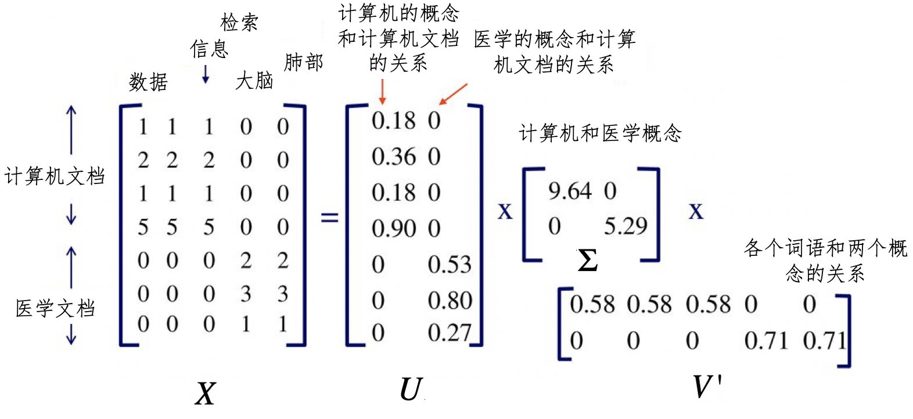

# SVD

Singular Value Decomposition：奇异值分解，它的核心思路和 PCA 不同。PCA 是通过分析不同纬特征之间的协方差，找到包含最多信息量的特征向量，从而实现降维。而 SVD 这种方法试图通过样本**矩阵本身的分解**，找到一些“潜在的因素”，然后通过把原始的特征维度映射到较少的潜在因素之上，达到降维的目的。

## 方阵的特征分解

**方阵**（Square Matrix）：行数和列数相等。如果一个矩阵的行数和列数都是 n，那么我们把它称作 n 阶方阵。

**酉矩阵**（Unitary Matrix）：和其转置矩阵相乘得到的是单位矩阵，即$X'X=I$(X’表示 X 的转置，I 表示单位矩阵)。矩阵 X 为酉矩阵的充分必要条件是 X 的转置矩阵和 X 的逆矩阵相等（$X'=X^{-1}$）。

对于一个 n×n 维的矩阵 X，n 维向量 v，标量 λ，如果有 Xv=λv。那么就说 λ 是 X 的特征值，v 是 X 的特征向量，并对应于特征值 λ。

特征向量表示了矩阵变化的方向，而特征值表示了变化的幅度。实际上，通过特征值和特征矩阵，我们还可以把矩阵 X 进行**特征分解**（Eigendecomposition），即**把矩阵分解为由其特征值和特征向量表示的矩阵之积**的方法。如果我们求出了矩阵 X 的 n 个特征值 λ1，λ2，…，λn，以及这 n 个特征值所对应的特征向量 v1，v2，…，vn，那么就有 $XV=VΣ$。

其中，**V 是这 n 个特征向量所组成的 n×n 维矩阵，而Σ为这 n 个特征值为主对角线的 n×n 维矩阵**。进一步推导，我们可以得到：

$XVV^{−1}=VΣV^{−1}$

$XI=VΣV^{−1}$

$X=VΣV^{−1}$

如果把$V$的这 n 个特征向量进行标准化处理，那么对于每个特征向量 $V_i$，就有 $∣∣Vi∣∣_2=1$，而这表示 $V’_iV_i=1$，此时$V$的 n 个特征向量为标准正交基，满足 $V’V=I$ ， 也就是说 $V$ 为酉矩阵，有 $V’=V^{−1}$ 。这样一来，我们就可以把特征分解表达式写作 $X=VΣV’$。

**矩阵 $X$ 必须为对称方阵才能进行有实数解的特征分解**。如果 $X$ 不是方阵，应该如何进行矩阵的分解呢？

## 矩阵的奇异值分解

假设矩阵 $X$ 是一个 m×n 维的矩阵，那么 $X$ 的 SVD 为 $X=UΣV’$。

SVD 并不要求要分解的矩阵为方阵，所以这里的 $U$ 和 $V’$ 并不是互为逆矩阵。其中 $U$ 是一个 m×m 维的矩阵，$V$ 是一个 n×n 维的矩阵。而 Σ 是一个 m×n 维的矩阵，对于 $Σ$ 来说，只有主对角线之上的元素可以为非 0，其他元素都是 0，而主对角线上的每个元素就称为**奇异值**。$U $和 $V$ 都是酉矩阵，即满足 $U’U=I$,$V’V=I$。

### 求出用于 SVD 分解的 U,Σ和V 

之所以不能使用有实数解的特征分解，是因为此时矩阵 X 不是对称的方阵。我们可以把 $X$ 的转置 $X’$ 和 $X$ 做矩阵乘法，得到一个 n×n 维的对称方阵 $X’X$。这时，我们就能对 $X’X$ 这个对称方阵进行特征分解了，得到的特征值和特征向量满足 $(X’X)v_i=λ_iv_i$。

这样一来，我们就得到了矩阵$ X’X $的 n 个特征值和对应的 n 个特征向量 $v$。通过 $X’X $的所有特征向量构造一个 n×n 维的矩阵$ V$，这就是上述 SVD 公式里面的 $V$ 矩阵了。通常我们把 $V$ 中的每个特征向量叫作 X 的**右奇异向量**。

> $V$矩阵的证明：
>
> $X = UΣV′$
>
> $X' = VΣ′U'$
>
> $X' X = (VΣ' U')(UΣV' ) = VΣ' (U' U)ΣV' = VΣ^2V' $
>
> ($U’U=I$    Σ是对角矩阵，所以$Σ'Σ = Σ^2$，$Σ^2$仍是对角矩阵)
>
> 由于$Σ^2$ 是对角矩阵，所以通过$X' X = V Σ^2 V′$ ，我们可以看出$V$ 中的向量就是$X’X$ 的特征向量，而特征值是$Σ^2$ 对角线上的值。
>
> $X’X$的特征值矩阵等于奇异值矩阵的平方，也就是说可以通过求出$ X’X$ 特征值的平方根来求奇异值。
>
> 同理可证明$XX'$的相关性质。

同样的道理，如果我们把 $X$ 和 $X’$做矩阵乘法，那么会得到一个 m×m 维的方阵 $XX’$。由于 $XX’$也是方阵，因此我们同样可以对它进行特征分解，得到的特征值和特征向量满足 $(XX’)u_i=λ_iu_i$。

类似地，我们得到了矩阵 $XX’ $的 m 个特征值和对应的 m 个特征向量 $u$。通过 $XX’$的所有特征向量构造一个 m×m 的矩阵 $U$。这就是上述 SVD 公式里面的 $U$ 矩阵了。通常，我们把 $U$ 中的每个特征向量叫作 $X$ 的**左奇异向量**。

$Σ $除了对角线上是奇异值之外，其他位置的元素都是 0，所以我们只需要求出每个奇异值 $σ$ 就可以了：

$X=UΣV’$

$XV=UΣV’V$

由于 $V$ 是酉矩阵，所以$ V’V=I$，就有：

$XV=UΣI$

$XV=UΣ$

$Xv_i=σ_iu_i$

$σ_i=\frac{Xv_i}{u_i}$

其中 $v_i$ 和 $u_i$ 都是列向量。一旦我们求出了每个奇异值 $σ$，那么就能得到奇异值矩阵 $Σ$。

通过上述几个步骤，我们就能把一个 mxn 维的实数矩阵，分解成 $X=UΣV’ $的形式。

## 潜在语义分析和 SVD

在向量空间模型中，对于一个大的文档集合，我们首先要构造字典，然后根据字典构造每篇文档的向量，最后通过所有文档的向量构造矩阵。矩阵的行和列分别表示文档和词条。基于这个矩阵、向量空间中的距离、余弦夹角等度量，我们就可以进行基于相似度的信息检索或文档聚类。

不过，最简单的向量空间模型采用的是精确的词条匹配，它没有办法处理词条形态的变化、同义词、近义词等情况。我们需要使用拉丁语系的取词根（Stemming）操作，并手动建立同义词、近义词词典。这些处理方式都需要人类的语义知识，也非常依赖人工的干预。另外，有些词语并不是同义词或者近义词，但是相互之间也是有语义关系的。例如“学生”“老师”“学校”“课程”等等。

有什么模型，，可以自动地挖掘在语义层面的信息呢？

潜在语义分析(Latent Semantic Analysis)，也叫潜在语义索引 (Latent Semantic Index)，通过词条和文档所组成的矩阵，发掘词和词之间的语义关系，并过滤掉原始向量空间中存在的一些“噪音”，最终提高信息检索和机器学习算法的精确度。

### LSA的主要步骤

- 第一步，分析文档集合，建立表示文档和词条关系的矩阵。

- 第二步，对文档 - 词条矩阵进行 SVD 奇异值分解。在 LSA 的应用场景下，分解之后所得到的奇异值$σ$对应了一个语义上的“概念”，而 **σ 值的大小表示这个概念在整个文档集合中的重要程度。$U$ 中的左奇异值向量表示了每个文档和这些语义“概念”的关系强弱，$V$ 中的右奇异值向量表示每个词条和这些语义“概念”的关系强弱。**

  所以说，SVD 分解把原来的词条 - 文档关系，转换成了词条 - 语义概念 - 文档关系。

  

  在这张图中，有一个 7×5 维的矩阵 $X$，表示 7 个文档和 5 个单词。经过 SVD 分解之后，我们得到了两个主要的语义概念，一个概念描述了计算机领域，另一个概念描述了医学领域。矩阵 U 描述文档和这两个概念之间的关系，而矩阵 $V’$ 描述了各个词语和这两个概念之间的关系。如果要对文档进行检索，我们可以使用 U 这个降维之后的矩阵，找到哪些文档和计算机领域相关。同样，对于聚类算法，我们也可以使用 U 来判断哪些文档属于同一个类。

- 第三步，对 SVD 分解后的矩阵进行降维，这个操作和 PCA 的降维操作是类似的。

- 第四步，使用降维后的矩阵重新构建概念 - 文档矩阵，新矩阵中的元素不再表示词条是不是出现在文档中，而是表示**某个概念是不是出现在文档中**。

SVD 奇异值分解巧妙的运用了矩阵$ X $和自己的转置相乘，生成了两种对称的方阵，并通过这两者的特征分解，获得了 SVD 中的左奇异向量所组成的矩阵 $U$ 和右奇异向量所组成的矩阵 $V$，并最终推导出奇异值矩阵$Σ$。这样，SVD 就可以对原始的数据矩阵进行分解，并运用最终的奇异向量进行降维。

我们可以把 SVD 运用在很多场合中，在不同的应用场景下，$U$，$V$ 和 $Σ$ 代表了不同的含义。例如，在 LSA 分析中，通过对词条和文档矩阵的 SVD 分解，我们可以利用$Σ$获得代表潜在语义的一些概念。而矩阵 $U$ 表示了这些概念和文档之间的关系，矩阵 $V$ 表示了这些概念和单个词语之间的关系。

