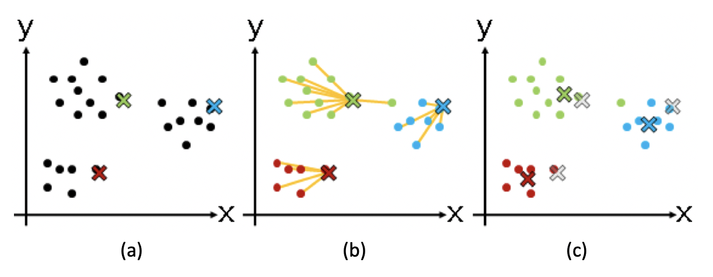
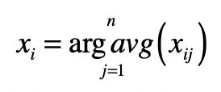

# 文本检索与聚类

## 文本检索

**信息检索就是让计算机根据用户信息需求，从大规模、非结构化的数据中，找出相关的资料。**

**非结构化**没有严格的字段定义（Schema）（例如MySQL数据库），互联网世界里所存储的海量文本就是“非结构化“数据的典型代表。因为这些文章如果没有经过我们的分析，对于其描述的主题、写作日期、作者等信息，我们是一无所知的。这时候就需要采用信息检索的技术。

**在信息检索中，相关性是个永恒的话题。**

### 布尔模型

最简单的模型是布尔模型，它借助了逻辑（布尔）代数的基本思想。如果我想看一篇文章是否关于体育，最简单的方法莫过于看看其中是否提到和体育相关的关键词，比如“足球”“NBA”“奥运会”等等。如果有，就相当于返回值为“真”，我就认为这篇文章就是相关的。如果没有，就相当于返回值为“假”，我就认为这篇文章不相关。这就是布尔模型的核心思想。

例如要求全部关键词都出现的查询条件：

$$keyword_1 AND keyword_2 AND … AND keyword_n $$

当然，我们可以根据具体的需求，在查询条件中加入“OR”，允许进行部分关键词的匹配。

### 向量空间模型

**将文档转换为向量，然后比较向量之间的距离或者相似程度。**

在转换的时候，通常会使用词包（Bag Of Word）的方式，忽略了单词在文章中出现的顺序，简化计算复杂度。类似地，这个模型也会把用户输入的查询转换为向量。如此一来，相关性问题就转化为计算查询向量和文档向量之间的距离或者相似度了。距离越小或者说相似度越高，那么我们就认为相关度越高。

相对于标准的布尔数学模型，向量空间模型的主要优势在于，允许文档和查询之间的**部分匹配**。

整个方法从大体上来说，可以分为**四个主要步骤**。

- 第一步，把文档集合都转换成向量的形式。

  预处理文本，包括针对中文等语系的分词操作、针对英文等拉丁语系的词干（Stemming）和归一化（Normalization）处理，以及所有语言都会碰到的停用词（Stopword）、同义词和扩展词处理。

  完成了前面这些预处理，我们就可以获得每篇文档出现的单词和词组。而通过对所有文档中的单词和词组进行去重，我们就可以构建整个文档集合的词典（Vocabulary）。**向量空间模型把词典中的每个词条作为向量的一个维度**。

  

  有了向量的维度，再来考虑每个维度需要取什么值。

  - **基于词频**：假设有一个文档集合c，d表示c中的一个文档，t表示一个单词，使用tf表示词频（Term Frequency），也就是一个词t在文档d中出现的次数。这种方法的假设是，如果某个词在文档中的tf越高，那么这个词对于这个文档来说就越重要。

  - 考虑tf和idf，idf表示逆文档频率（Inverse Document Frequency）。

    df表示文档频率（Document Frequency），也就是**文档集合c中出现某个词t的文档数量**。一般的假设是，某个词t在文档集合c中，出现在越多的文档中，那么其重要性越低，反之则越高。

    $$idf=log \frac{N}{df}$$

    其中N是整个文档集合中文章数量，log是为了确保idf分值不要远远高于tf而埋没tf的贡献。这样一来，单词t的df越低，其idf越高，t的重要性越高。

    $$tf-idf = tf*idf$$

- 第二步，把用户输入的查询转换成向量的形式，然后把这个查询的向量和所有文档的向量，进行比对，计算出基于距离或者夹角余弦的相似度。

  把查询转换成向量，和文档的转换流程是基本一致的，但要注意下面几个问题。

  - **查询和文档长度不一致**。人们输入的查询通常都很短，甚至都不是一个句子，而只是几个关键词。

    使用文档字典中所有的词条来构建向量。如果某维分量所对应的词条出现在文档或者查询中，就取1、tf或tf-idf值，如果没有就取0。这样，文档向量和查询向量的维度就相同了，只是查询向量更稀疏、拥有多维度的0。

  - **查询里出现了文档集合里没有的词**。简单的做法是直接去除这维分量，也可以使用相对于其他维度来说极小的一个数值，这和分类中的平滑技术类似。

  - **查询里词条的idf该如何计算。**由于查询本身并不存在文档集合的概念，所以也就不存在df和idf。对于这种情况，可以借用文档集合里对应词条的idf。

  把查询转换成向量之后，我们就可以把这个查询的向量和所有文档的向量依次对比，看看查询和哪些文档更相似。

  由于夹角余弦不用进行归一化，所以这种方法更为流行。

  **信息检索里，夹角余弦的取值范围通常是[0,1]，而不再是[-1,1]。**这是因为在进行文本处理的时候，我们根据单词的出现与否，设置0、1/tf/tf-idf，因此向量每个分量的取值都是正的。

  

  由于文本向量往往是非常稀疏的，我们也可能需要对转换后的文档和查询向量，进行特征选择和特征值的转换。

  

- 第三步，根据查询和每个文档的相似度，找出相似度最高的文档，认为它们是和指定查询最相关的。

- 第四步，评估查询结果的相关性。

> 假设你使用了tf-idf的机制来构造向量，那么当文档集合中新增了文档之后，是不是只需要为新增文档构建向量？原有文档的向量是否需要更新？
>
> 新增文档后，N肯定会发生变化，有很多的 df也会发生变化。
>
> 但当数据量大到一定程度时，少量的新增文档而导致的idf变化不大。实际处理时，应该不会每新增一个文档，就重新构建原文档的向量，而是在一定条件下触发原文档向量的构建，如：多长时间重新构建一次；或新增了多少文档重新构建一次；或手工触发重新构建。

## 文本聚类

### 聚类算法

监督式学习通过训练资料学习并建立一个模型，并依此模型对新的实例进行预测。

不过，在实际场景中，我们常常会遇到另一种更为复杂的情况。这时候不存在任何关于样本的先验知识，而是需要机器在没人指导的情形下，去将很多东西进行归类。由于缺乏训练样本，这种学习被称为“**非监督学习**”（Unsupervised Learning），也就是我们通常所说的聚类（Clustering）。在这种学习体系中，系统必须通过一种有效的方法**发现样本的内在相似性**，并把数据对象以群组（Cluster）的形式进行划分。

#### K-Means

在一个任意多的数据上，得到一个事先定好群组数量（K）的聚类结果。

中心思想：**尽量最大化总的群组内相似度，同时尽量最小化群组之间的相似度。**

群组内或群组间的相似度，是通过各个成员和群组质心相比较来确定的。具体步骤如下：

1. 从N个数据对象中随机选取k个对象作为质心，这里每个群组的质心定义是，群组内所有成员对象的平均值。因为是第一轮，所以第i个群组的质心就是第i个对象，而且这时候我们只有这一个组员。
2. 对剩余的对象，测量它和每个质心的相似度，并把它归到最近的质心所属的群组。可以是距离，也可以是相似度，只是两者呈现反比关系。
3. 重新计算已经得到的各个群组的质心。这里质心的计算是关键，如果使用特征向量来表示的数据对象，那么最基本的方法是取群组内成员的特征向量，将它们的平均值作为质心的向量表示。
4. 迭代上面的第2步和第3步，直至新的质心与原质心相等或相差之值小于指定阈值，算法结束。

(a)步骤是选择初始质心，质心用不同颜色的x表示；( b )步骤开始进行聚类，把点分配到最近的质心所在的组；( c )步骤重新计算每个群组的质心，x的位置发生了改变。之后就是如此重复，进入下一轮聚类。

K均值算法是通过不断迭代、调整K个聚类质心的算法。而质心或者群组的中心点，是通过求群组所包含的成员之平均值来计算的。

#### 向量空间

在推送新闻时，使用向量空间模型对新闻聚类，从而过滤类似的新闻。

- 第一步，把文档集合都转换成向量的形式。

- 第二步，使用K均值算法对文档集合进行聚类。这个算法的关键是如何确定数据对象和分组质心之间的相似度。针对这点，有两个点需要关注：
  - 使用向量空间中的距离或者夹角余弦度量，计算两个向量的相似度。

  - 计算质心的向量。K均值里，质心是分组里成员的平均值。所以，我们需要求分组里所有文档向量的平均值。求法非常直观，就是分别为每维分量求平均值：
    

    其中，$x_{i}$表示向量的第i个分量，$x_{ij}$表示第j个向量的第$i$个分量，而$j=1,2,…,n$表示属于某个分组的所有向量。

- 第三步，在每个分类中，选出和质心最接近的几篇文章作为代表。而其他的文章作为冗余的内容过滤掉。

