# 线性代数

## 向量 

相对于标量，向量能表示方向。它代表一组数字，并且这些数字是有序排列的。可以用数组或者链表来表达。

### 向量的运算

标量和向量之间可以进行运算，比如标量和向量相加或者相乘时，我们直接把标量和向量中的每个元素相加或者相乘就行了。

向量和向量之间的加法或乘法应该如何进行呢？我们需要先定义向量空间。

向量空间主要有几个特性：

- 空间由无穷多个的位置点组成；
- 这些点之间存在相对的关系；
- 可以在空间中定义任意两点之间的长度，以及任意两个向量之间的角度；
- 这个空间的点可以进行移动。

两个向量之间的加法，首先它们需要维度相同，然后是对应的元素相加。

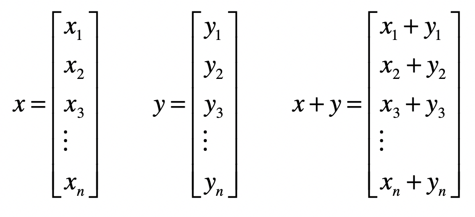

向量之间的乘法默认是**点乘**，向量x和y的点乘是这么定义的：

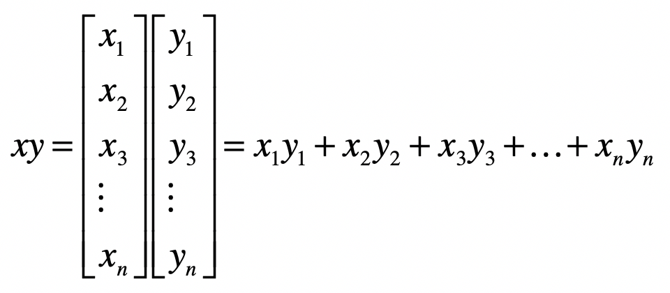

点乘的作用是把相乘的两个向量转换成了标量，它有具体的几何含义。我们会用点乘来计算向量的长度以及两个向量间的夹角，所以一般情况下我们会**默认向量间的乘法是点乘**。

### 矩阵的运算

矩阵由多个长度相等的向量组成，其中的每列或者每行就是一个向量。

向量其实也是一种特殊的矩阵。如果一个矩阵是n × m维，那么一个n × 1的矩阵也可以称作一个n维列向量；而一个1 × m矩阵也称为一个m维行向量。

同样，我们也可以定义标量和矩阵之间的加法和乘法，我们只需要把标量和矩阵中的每个元素相加或相乘就可以了。

矩阵和矩阵之间是如何进行加法和乘法的呢？矩阵加法比较简单，只要保证参与操作的两个矩阵具有相同的行维度和列维度，我们就可以把对应的元素两两相加。

而乘法略微繁琐一些，写成公式就是这种形式：

$$Z=XY$$

$$Z_{i,j}=\sum_k X_{i,k}Y_{k,j}$$

其中，矩阵$Z$为矩阵$X$和$Y$的乘积，$X$是形状为i x k的矩阵，而$Y$是形状为k × j的矩阵。**$X$的列数k必须和$Y$的行数k相等，两者才可以进行这样的乘法。**

两个矩阵中对应元素进行相乘，也是存在的，我们称它为元素**对应乘积**，或者Hadamard乘积。

**转置**（Transposition）是指矩阵内的元素行索引和纵索引互换，例如$X_{ij}$就变为$X_{ji}$，相应的，矩阵的形状由转置前的n × m变为转置后的m × n。从几何的角度来说，矩阵的转置就是原矩阵以对角线为轴进行翻转后的结果。

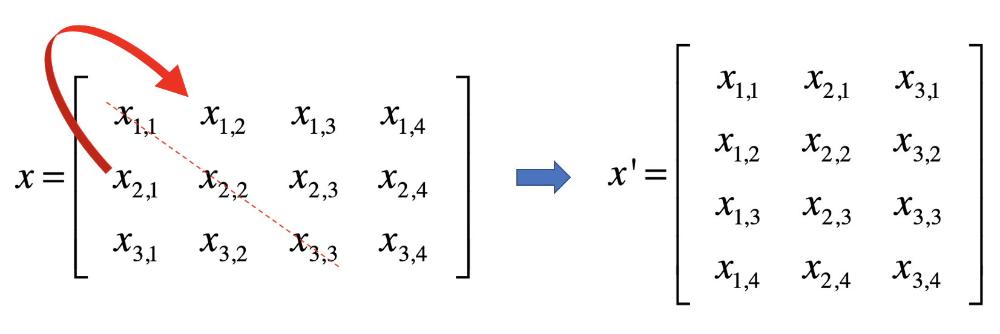

**单位矩阵**（Identity Matrix）：所有沿主对角线的元素都是1，而其他位置的所有元素都是0。常只考虑单位矩阵为方阵的情况，也就是行数和列数相等，我们把它记做$I_{n}$，$n$表示维数。

如果有矩阵$X$，我们把它的**逆矩阵**记做$X^{-1}$，两者相乘的结果是单位矩阵：

$$X^{-1}X=I_n$$

## 向量空间

**域**：一个数的集合$F$，它满足“$F$中任意两个数的加减乘除法（除数不为零）的结果仍然在这个$F$中”。如果域$F$里的元素都为实数，那么$F$就是实数域。

如果$x_{1}，x_{2}，……，x_{n}∈F$，那么$F$上的$n$维向量就是：

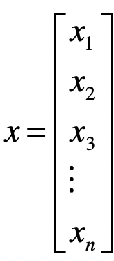

转置形式：

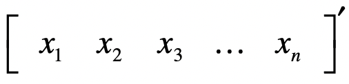

向量中第$i$个元素，也称为第$i$个分量。$F_{n}$是由$F$上所有$n$维向量构成的集合。

假设$V$是$F_{n}$的非零子集：

- $V$**对向量的加法封闭**： 如果对任意的向量$x$、向量$y∈V$，都有$(x+y)∈V$
- **$V$对标量与向量的乘法封闭**：对任意的标量$k∈V$，向量$x∈V$，都有$kx$属于$V$

如果$V$满足向量的加法和乘法封闭性，就称$V$是$F$上的向量空间。向量空间除了满足这两个封闭性，还满足基本运算法则，比如交换律、结合律、分配律等等。

### 向量间的距离

常用距离：

- **曼哈顿距离**（Manhattan Distance）
  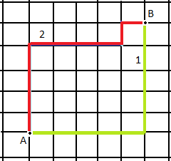

  从A点到B点有多条路径，但是无论哪条，曼哈顿距离都是一样的。

  在二维空间中，两个点（实际上就是二维向量）$x(x_{1},x_{2})$与$y(y_{1},y_{2})$间的曼哈顿距离是：

  $$MD(x,y)=\mid x_1 - y_1 \mid + \mid x_2 - y_2 \mid$$

  

  推广到**$n$维空间，曼哈顿距离的计算公式**为：

  $$MD(x,y)=\sum_{i=1}^n \mid x_i - y_i \mid$$

  其中$n$表示向量维度，$x_{i}$表示第一个向量的第$i$维元素的值，$y_{i}$表示第二个向量的第$i$维元素的值。

- **欧氏距离**（Euclidean Distance）

  欧几里得距离，指在n维空间中两个点之间的真实距离，在二维空间中，两个点$x(x_{1},x_{2})$与$y(y_{1},y_{2})$间的欧氏距离是：

  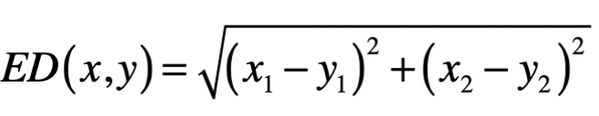

  n维空间，欧氏距离的计算公式为：
  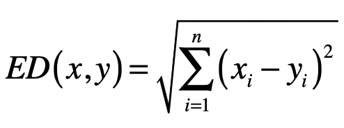

- **切比雪夫距离**（Chebyshev Distance）

  切比雪夫其实是在模拟国际象棋里国王的走法。国王可以走临近8个格子里的任何一个，那么国王从格子$(x_{1},x_{2})$走到格子$(y_{1},y_{2})$最少需要多少步呢？其实就是二维空间里的切比雪夫距离。

  一开始，为了走尽量少的步数，国王走的一定是斜线，所以横轴和纵轴方向都会减1，直到国王的位置和目标位置在某个轴上没有差距，这个时候就改为沿另一个轴每次减1。所以，国王走的最少格子数是$|x_{1}-y_{1}|$和$|x_{2}-y_{2}|$这两者的较大者。

  所以，在二维空间中，两个点$x(x_{1},x_{2})$与$y(y_{1},y_{2})$间的切比雪夫距离是：

  $$CD(x,y)=max(\mid x_1 - y_1 \mid,\mid x_2 - y_2\mid)$$

  

  推广到n维空间，切比雪夫距离的计算公式为：

  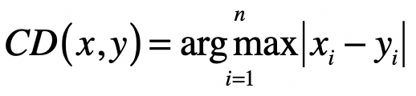

- **闵可夫斯基距离**

  也叫闵氏距离，一种通用的形式表示上述三种距离。在二维空间中，两个点$x(x_{1},x_{2})$与$y(y_{1},y_{2})$间的闵氏距离是：

  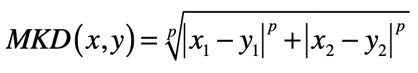

  

  两个$n$维变量$x(x_{1},x_{2},…,x_{n})$与$y(y_{1},y_{2},…,y_{n})$间的闵氏距离的定义为：

  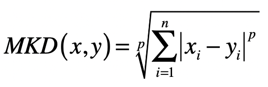

  其中$p$是一个变参数：

  - 当$p=1$时，就是曼哈顿距离；
  - 当$p=2$时，就是欧氏距离；
  - 当$p$趋近于无穷大的时候，就是切比雪夫距离。这是因为当$p$趋近于无穷大的时候，最大的$|x_{i}-y_{i}|$会占到全部的权重。

### 向量的长度

向量的长度，也叫向量的模，是向量所对应的点到空间原点的距离。通常我们使用**欧氏距离**来表示向量的长度。

**范数**常常被用来衡量某个向量空间中向量的大小或者长度。范数满足非负性、齐次性、和三角不等式。

- $L_{1}$范数$||x||$ ，它是$x$向量各个元素绝对值之和，对应于向量$x$和原点之间的曼哈顿距离。
- $L_{2}$范数$||x||_{2}$ ，它是$x$向量各个元素平方和的$\frac{1}{2}$次方，对应于向量$x$和原点之间的欧氏距离。
- $L_{p}$范数$||x||_{p}$ ，为$x$向量各个元素绝对值$p$次方和的1/p次方，对应于向量$x$和原点之间的闵氏距离。
- $L_{∞}$范数$||x||_{∞}$ ，为$x$向量各个元素绝对值最大那个元素的绝对值，对应于向量$x$和原点之间的切比雪夫距离。

所以，在讨论向量的长度时，我们需要弄清楚是L几范数。

### 向量间的夹角

空间中两个向量所形成夹角的余弦值：

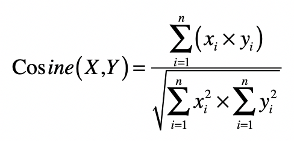

分子是两个向量的点乘，而分母是两者长度（或L2范数）的乘积，而L2范数可以使用向量点乘自身的转置来实现。

夹角余弦的取值范围在[-1,1]，当两个向量的方向重合时夹角余弦取最大值1，当两个向量的方向完全相反夹角余弦取最小值-1。值越大，说明夹角越小，两点相距就越近；值越小，说明夹角越大，两点相距就越远。

### 向量空间模型

向量空间模型假设所有的对象都可以转化为向量，然后使用向量间的距离（通常是欧氏距离）或者是向量间的夹角余弦来表示两个对象之间的相似程度。

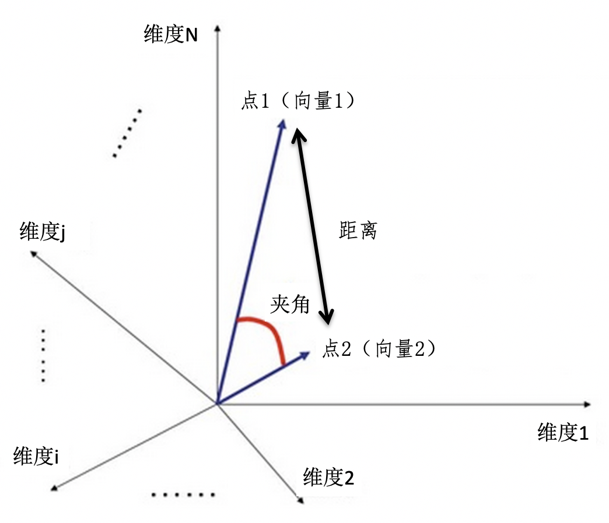

由于夹角余弦的取值范围已经在-1到1之间，而且越大表示越相似，所以可以直接作为相似度的取值。

相对于夹角余弦，欧氏距离ED的取值范围可能很大，而且和相似度呈现反比关系，所以通常要进行1/(1+ED)这种归一化。

当ED为0的时候，变化后的值就是1，表示相似度为1，完全相同。当ED趋向于无穷大的时候，变化后的值就是0，表示相似度为0，完全不同。所以，这个变化后的值，取值范围是0到1之间，而且和相似度呈现正比关系。

