# 线性回归

回归分析属于监督式学习算法，主要研究一个或多个随机变量$y_1$，$y_2$，…，$y_i$与另一些变量$x_{1}$，$x_{2}$，…，$x_{k}$之间的关系。其中，将$y_{1}，y_{2}、…，y_{i}$称为因变量，$x_1，x_2，…，x_k$称为自变量。按照不同的维度，可以把回归分为三种。

- 按照自变量数量，当自变量$x$的个数大于1时就是**多元回归**。
- 按照因变量数量，当因变量$y$个数大于1时就是**多重回归**。
- 按照模型种类，
  - 如果因变量和自变量为线性关系时，就是**线性回归模型**
  - 如果因变量和自变量为非线性关系时时，就是**非线性回归分析模型**


## 高斯消元解线性方程组

对于回归分析来说，最简单的情形是只有一个自变量和一个因变量，且它们大体上是有线性关系的，这就是一元线性回归。对应的模型很简单，就是$Y=a+bX+ε$。$X$是自变量，$Y$是因变量，$a$是截距，b是自变量的系数，$ε$表示随机误差，只不过我们通常假定随机误差的均值为$0$。

暂时不考虑a和ε，把它扩展为多元的形式，那么就可以得到类似下面这种形式的方程：

$b_1·x_1+b_2·x_2+…+b_{n-1}·x_{n-1} +b_n·x_n=y$

假设有多个这样的方程，就能构成线性方程组。

$2x_1+x_2+x_3=0$
$4x_1+2x_2+x_3=56$
$2x_1-x_2+4x_3=4$

高斯消元法主要分为两步，**消元**（Forward Elimination）和**回代**（Back Substitution）。所谓消元，就是要减少某些方程中元的数量。如果某个方程中的元只剩一个了$x_m$了，那么这个自变量$x_m$的解就能知道了。所谓的回代，就是把已知的解$x_m$代入到方程式中，求出其他未知的解。

首先保持第一个方程不变，然后消除第二个和第三个方程中的$x_1$。让第二个方程式减去第一个方程式的两倍：

$(4x_1+2x_2+x_3)-2(2x_1+x_2+x_3)=56-2·0$

$-x_3=56$

让第三个方程减去第一个方程：

$-2x_2+3x_3=4$

三个方程式变为：

$2x_2+x_2+x_3=0$
$-x_3=56$
$-2x_2+3x_3=4$

至此，我们使用第一个方程式作为参照，消除了第二个和第三个方程式中的$x_1$，我们称这里的第一个方程式为“主元行”。

接下来，我们要把第二个方程式作为“主元行”，来消除第三个方程中的$x_2$。**第二个方程中的$x_2$已经没有了，失去了参照，这个时候需要把第二个方程和第三个方程互换**，变为：

$2x_1+x_2+x_3=0$
$-2x_2+3x_3=4$
$-x_3=56$

由于第三个方程以及没有$x_2$了，所以无需再消元。如果还有$x_2$，那么就需要参照第二个方程式来消除第三个方程中的$x_2$。

观察一下现在的方程组，第一个方程有3个自变量，第二个方程有2个自变量，第三个方程只有1个自变量。这个时候，我们就可以从第三个方程开始，开始回代的过程了。通过第三个方程，显然我们可以得到$x_3=-56$，然后把这个值代入第二个方程，就可以得到$x_2 = -86$。最后把$x_2$和$x_3$的值代入第一个方程式，我们可以得到$x_1=71$。


### 矩阵实现高斯消元

1. 为了进行矩阵操作，首先我们要把方程中的系数$b_i$转成矩阵，我们把这个矩阵记作$B$。对于上面的方程组示例，系数矩阵为：
   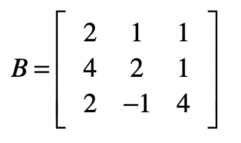

   通过消元，最终把系数矩阵B变为：

   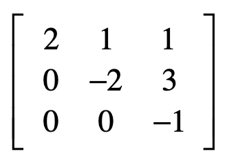


   **消元的过程就是把原始的系数矩阵变为上三角矩阵。**

2. **回代的过程是把上三角矩阵变为单位矩阵。**

   为了便于回代计算，我们可以把方程式等号右边的值加入到系数矩阵，称这个新的矩阵为**增广矩阵$A$**。

   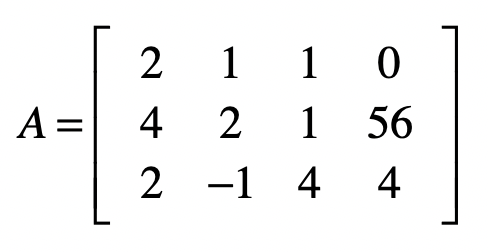

   对于这个矩阵，我们的最终目标是，**把除了最后一列之外的部分，变成单位矩阵，而此时最后一列中的每个值，就是每个自变量所对应的解了**。

3. 首先保持第一个方程不变，然后消除第二个和第三个方程中的$x_1$。这就意味着要把$A_{2,1}$和$A_{3,1}$变为$0$。

   对于第一个方程式，如果要保持它不变，我们可以让向量$[1, 0, 0]$左乘$A$。

   对于第二个方程，具体操作是让第二个方程式减去第一个方程式的两倍，达到消除$x_1$的目的。我们可以让向量$[-2, 1, 0]$左乘$A$。

   对于第三个方程式，具体操作是让第三个方程式减去第一个方程式，达到消除$x_1$的目的。我们可以让向量$[-1, 0, 1]$左乘$A$。我们使用这三个行向量组成一个矩阵$E1$。

   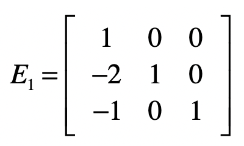

   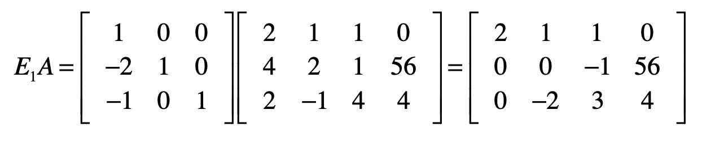

4. 下一步是消除第三个方程中的$x_2$。依照之前的经验，我们要把第二个方程式作为“主元行”，来消除第三个方程中的$x_2$。可是第二个方程中的$x_2$已经没有了，失去了参照，这个时候我们需要把第二个方程和第三个方程互换。

   如何使用矩阵来实现互换的操作呢？

   使用下面这个矩阵$E2$左乘增广矩阵$A$。

   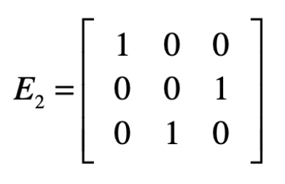


   这个矩阵第一行`[1 0 0]​`的意思就是我们只取第一行的方程，而第二行`​[0 0 1]​`的意思是只取第三个方程，而第三行`​[0 1 0]​`表示只取第二个方程。

5. 我们先让$E1$左乘$A$，然后再让$E2$左乘$E1A$的结果，就能得到消元后的系数矩阵。

   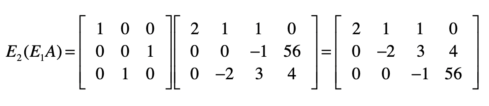

   把$E1$乘$E2$的结果记作$E3$，并把$E3$称为**消元矩阵**。

   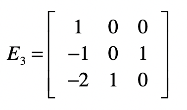

6. 对于目前的结果矩阵来说，除了最后一列，它已经变成了一个上三角矩阵，也就是说消元步骤完成。接下来，要使得最后一列之外的部分变成一个单位矩阵，就能得到最终的方程组解。

   和消元不同的是，我们将从最后一行开始。对于最后一个方程，我们只需要把所有系数取反就行了，所以会使用下面这个矩阵$S1$实现。

   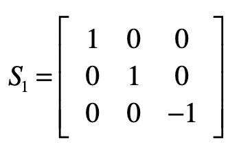

   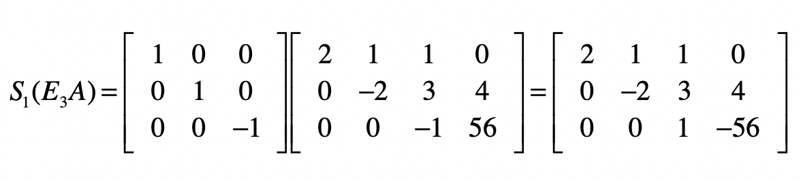

7. 接下来要去掉第二个方程中的$x_3$，我们要把第二个方程减去3倍的第三个方程，然后除以-2。

   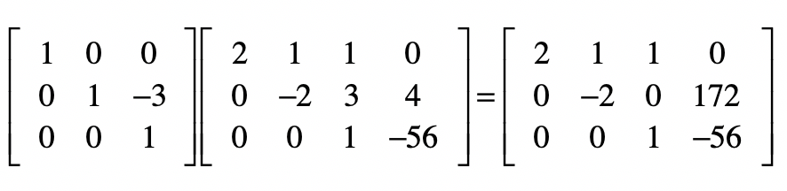

   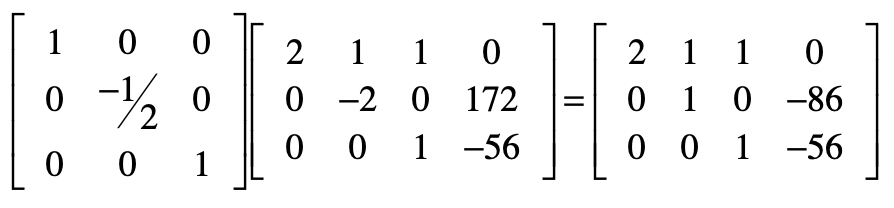

8. 最后，对于第一个方程，我们要把第一个方程减去第二个和第三个方程，最后除以2。

   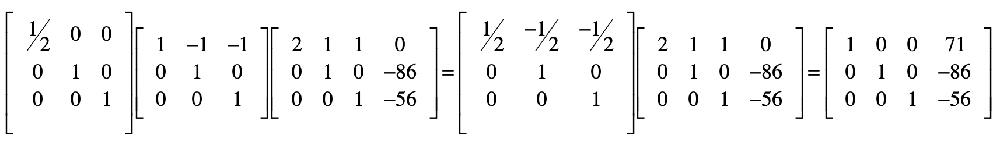

9. 结果矩阵的最后一列就是方程组的解。我们把回代部分的矩阵，都乘起来。
   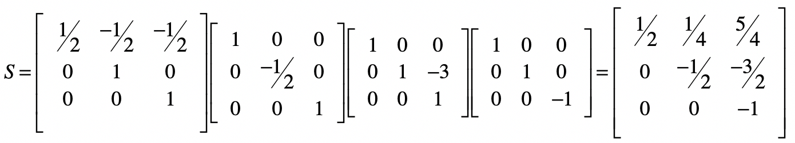

   而消元矩阵$E3$为：

   

   可以让矩阵$S$左乘矩阵$E3$：

   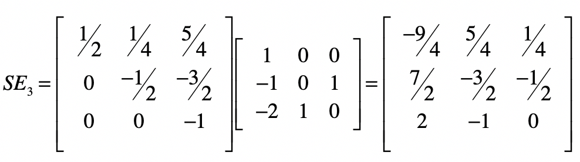

   把这个矩阵记作$SE$，再乘以最初的系数矩阵$B$，就得到了一个单位矩阵。根据逆矩阵的定义，$SE$就是$B$的逆矩阵。换个角度来思考，**使用消元法进行线性方程组求解的过程，就是在找系数矩阵的逆矩阵的过程**。


#### 与回归分析的区别

- 在线性回归分析中，样本数据会告诉我们自变量和因变量的值，要求的是系数。

  而在线性方程组中，我们已知系数和因变量的值，要求的是自变量的值。

- 在线性回归分析中，方程的数量要远远大于自变量的数量，而且我们不要求每个方程式都是完全成立。这里，不要求完全成立的意思是，拟合出来的因变量值可以和样本数据给定的因变量值存在差异，也就允许模型拟合存在误差。模型的拟合不可能100%完美，这和我们求解线性方程组精确解的概念是不同的。


## 最小二乘法直线拟合

通常，多元线性回归会写作：

$y=b_0+b_1·x_1+b_2·x_2+…+b_{n-1}·x_{n-1}+b_n·x_n+ε$

这里的$x_1，x_2，…，x_n$是自变量，$y$是因变量，$b_0$是截距，$b_1$，$b_2$，…，$b_n$是自变量的系数，$ε$是随机误差。

在线性回归中，为了实现最小化$ε$的目标，我们可以使用最小二乘法进行直线的拟合。最小二乘法通过**最小化误差的平方和**，来寻找和观测数据匹配的最佳函数。

$ε=\sum_{i=1}^m (y_i-\hat{y})^2$

其中，$y_i$表示来自数据样本的观测值，而$\hat{y}$是假设的函数的理论值，$ε$是误差，在机器学习中也常被称为损失函数，它是观测值和真实值之差的平方和。最小二乘法里的“二乘”就是指的平方操作。

最小二乘问题的矩阵形式：$min||XB-Y||_{2}^{2}$

其中$B$为系数矩阵，$X$为自变量矩阵，$Y$为因变量矩阵。换句话说，我们要在向量空间中，找到一个$B$，使向量$XB$与$Y$之间欧氏距离的平方数最小的$B$。

$||XB-Y||_{2}^{2}=tr((XB-Y)’(XB-Y))$

其中$(XB-Y)’$表示矩阵$(XB-Y)$的转置。而$tr()$函数表示取对角线上所有元素的和，对于某个矩阵$A$来说，$tr(A)$的值计算如下：

$$tr(A)=\sum_{i=1}^m a_{ii}$$

根据矩阵的运算法则：

$||XB-Y||_{2}^{2}$
$=tr((XB-Y)’(XB-Y))$
$=tr(B’X’-Y’)(XB-Y)$
$=tr(B’X’XB-B’X’Y-Y’XB+Y’Y)$

> **$(XB)’=B’X’$的证明**：
>
> 对于$XB$中的每个元素$xb_{i,j}$，有：
>
> 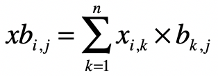
>
> 而对于$(XB)’$中的每个元素$xb’_{i,j}$，有：
>
> 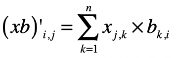
>
> 对于$B’$中的每个元素有：
>
> $b’_{i,k}=b_{k,i}$
>
> $X’$中的每个元素有：
>
> $x’_{k,j}=x_{j,k}$
>
> 那么，对于$B’X’$中的每个元素$b’x’_{i,j}$，就有：
>
> 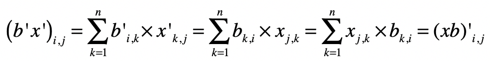
>
> 所以有$(XB)’ = B’X’$。
>
> 从而也能推出$(XB-Y)’=B’X’-Y’$


求最极值问题直接对应的就是导数为0，因此对上述的矩阵形式进行求导，得到如下的式子：

$\frac{d||XB-Y||_{2}^{2}}{dB}$
$=\frac{d(tr(B’X’XB-B’X’Y-Y’XB+Y’Y))}{dB}$
$=X’XB+X’XB-X’Y-X’Y$
$=2X’XB-2X’Y$

> **$\frac{d(tr(B’X’XB))}{dB}=2X’XB$的证明：**
>
> $\frac{d(tr(B’X’XB))}{dB}$
> $=\frac{d(tr(B’(X’XB)))}{dB}+\frac{d(tr((B’X’X)B))}{dB}$
> $=(X’XB)+(B’X’X)’$
> $=X’XB+X’XB$
> $=2X’XB$

> **$\frac{d(tr(B’X’Y))}{dB}=X’Y$的证明：**
>
> 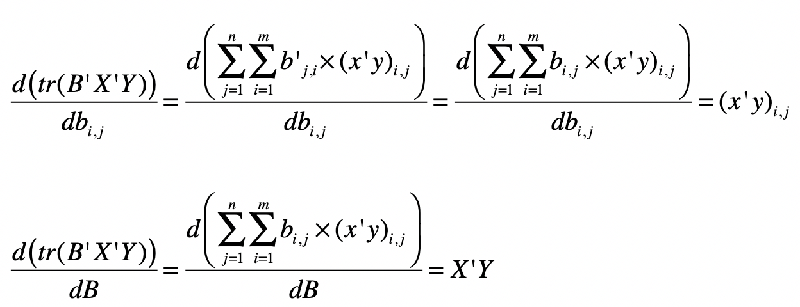
>
> 同理，可以证明：
>
> $\frac{d(tr(Y’XB))}{dB}=(Y’X)’=X’Y$
>
> 常量对于变量求导为0，因此$\frac{d(Y’Y)}{dB}=0$。


如果要$||XB-Y||_{2}^{2}$最小，就要满足两个条件。

- 一阶导为0，$\frac{d||XB-Y||_{2}^{2}}{dB}$为0，也就是$2X’XB-2X’Y=0$。
- 二阶导大于0，$\frac{d(2X’XB-2X’Y)}{dB}>0$。

​	由于$\frac{d(2X’XB-2X’Y)}{dB}=2X’X>0$，所以，第二个条件是满足的。只要$2X’XB=2X’Y$，就能获得$ε$的最小值。

$2X’XB=2X’Y$
$X’XB=X’Y$
$(X’X)^{-1}X’XB=(X’X)^{-1}X’Y$
$IB=(X’X)^{-1}X’Y$
$B=(X’X)^{-1}X’Y$

其中$I$为单位矩阵。而$(X’X)^{-1}$表示$X’X$的逆矩阵。所以，最终系数矩阵为：

$B=(X’X)^{-1}X’Y$


### 如何使用求导获取极小值

极值是一个函数的极大值或极小值。如果一个函数在一点的某个邻域内每个地方都有确定的值，而以该点所对应的值是最大（小）的，那么这函数在该点的值就是一个极大（小）值。而函数的极值可以通过它的一阶和二阶导数来确定。

对于一元可微函数$f(x)$，它在某点$x_0$有极值的充分必要条件是$f(x)$在$x_0$的邻域上一阶可导，在$x_0$处二阶可导，且一阶导数$f’(x_0)=0$，二阶导数$f’’(x_0)≠0$。其中$f’$和$f’’$分别表示一阶导数和二阶导数。

在一阶导数$f’(x0)=0$的情况下

- 如果$f’’(x0)<0$，则$f$在$x_0$取得极大值
- 如果$f’’(x0)>0$，则$f$在$x_0$取得极小值

这就是为什么在求矩阵$B$的时候，我们要求$2X’XB-2X’Y$为$0$，并且$2X’XB-2X’Y$的导数要大于$0$，这样我们才能确保求得极小值。


## 最小二乘法效果验证

### 可得精确解例子

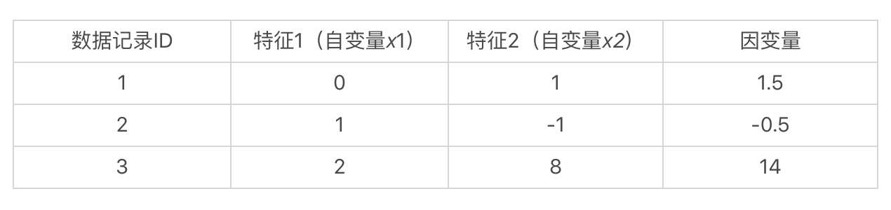

假想有一个数据集，里面有3条数据记录。每条数据记录有2维特征，也就是2个自变量，和1个因变量。

如果我们假设这些自变量和因变量都是线性的关系，那么就可以使用如下这种线性方程，来表示数据集中的样本（这里先不考虑截距）：

$b_1·0+b_2·1=1.5$
$b_1·1-b_2·1=-0.5$
$b_1·2+b_2·8=14$

已知自变量$x_1$、$x_2$和因变量_y_的值，而要求解的是$b_1$和$b_2$这两个系数。如果我们能求出$b_1$和$b_2$，那么在处理新数据的时候，就能根据新的自变量$x_1$和$x_2$的取值，来预测$y$的值。

对于系数矩阵$B$，有：$B=(X’X)^{-1}X’Y$

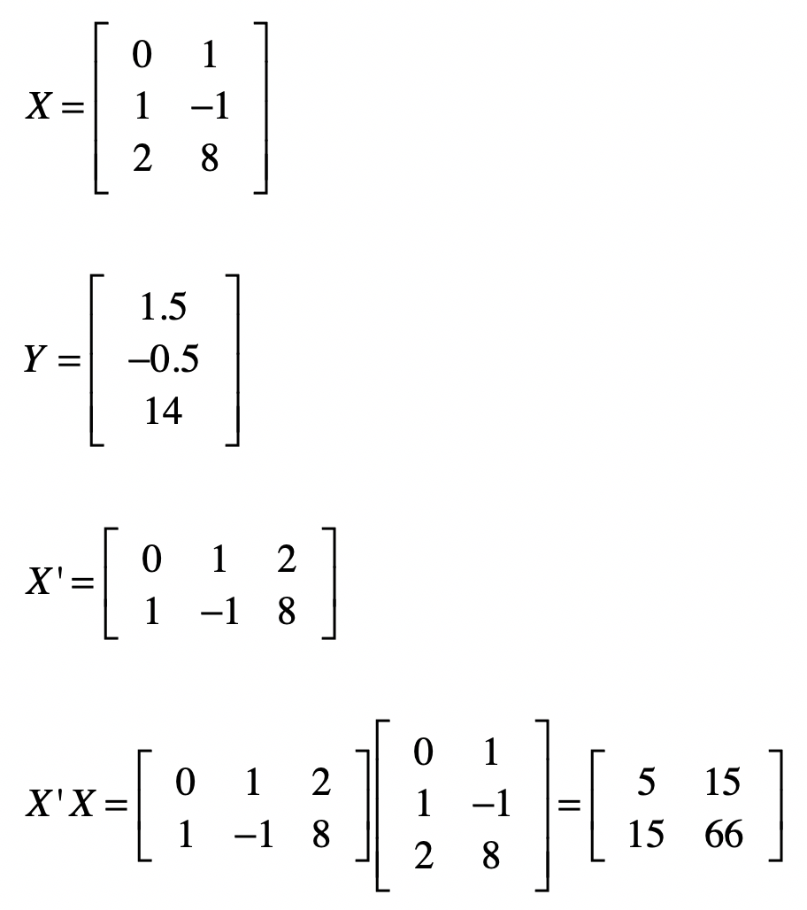


#### 求矩阵的逆

借鉴高斯消元和回代的过程（把系数矩阵变为单位矩阵），求解$X^{-1}$。

1. 先把原始的系数矩阵$X$列在左边，然后把单位矩阵列在右边，像$[X | I]$这种形式，其中$I$表示单位矩阵。

2. 然后对左侧的矩阵进行高斯消元和回代，把左边矩阵X变为单位矩阵，同时也把这个相应的矩阵操作运用在右侧。这样当左侧变为单位矩阵之后，那么右侧的矩阵就是原始矩阵$X$的逆矩阵$X^{-1}$，具体证明如下：

   $[X | I]$
   $[X^{-1}X | X^{-1}I]$
   $[I | X^{-1}I]$
   $[I | X^{-1}]$

求$(X’X)^{-1}$ ：

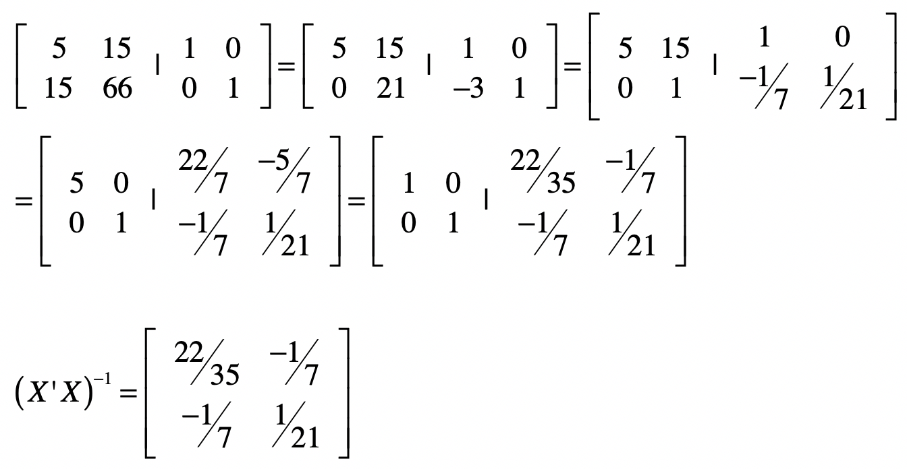


求出$(X’X)^{-1}$之后，就可以使用$B=(X’X)^{-1}X’Y$来计算矩阵B。

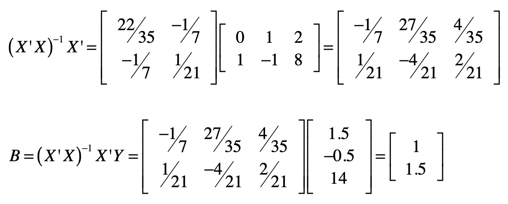

系数矩阵为`[1 1.5]`，也就是说$b_1 = 1$, $b_2 = 1.5$。实际上，这两个数值是精确解。用高斯消元也是能获得同样结果的。


### 存在误差解例子

修改上面例子中的$y$​值，让这个方程组没有精确解。

$b_1·0+b_2·1=1.4$
$b_1·1-b_2·1=-0.48$
$b_1·2+b_2·8=13.2$

使用高斯消元法对这个方程组求解，只要两个方程就能求出解。但是无论是哪两个方程求出的解，都无法满足第三个方程。


通过最小二乘法求解：

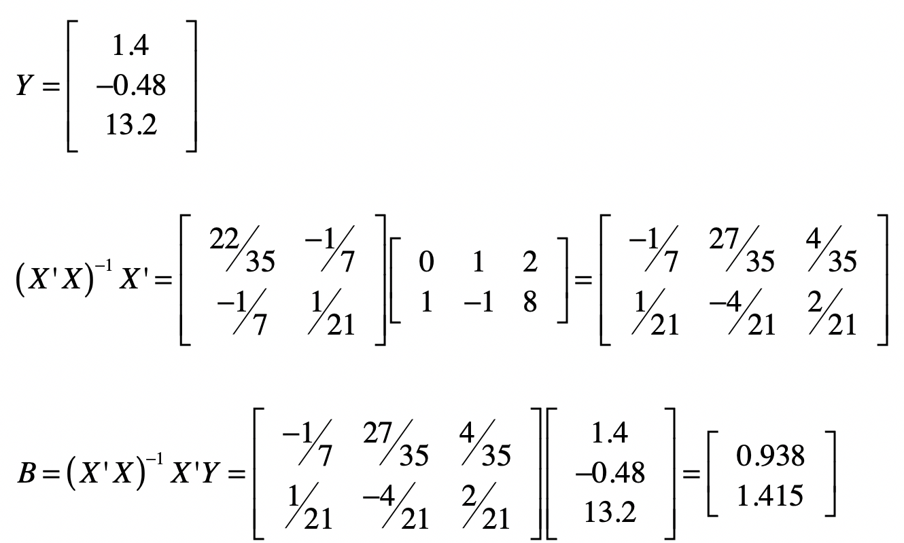

通过系数矩阵$B$和自变量矩阵$X$计算预测值：

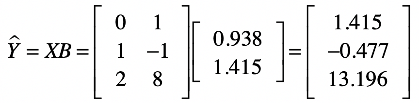

样本数据中的观测值：

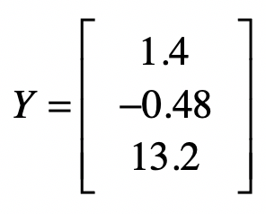

可以得到误差：

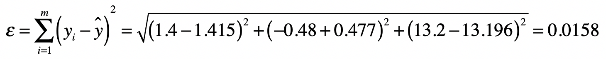

这两次计算预测值_y_的过程，其实也是使用线性回归，对新的数据进行预测的过程。线性回归模型根据大量的训练样本，推算出系数矩阵$B$，然后根据新数据的自变量$X$向量或者矩阵，计算出因变量的值，作为新数据的预测。


### 代码实现计算过程

```
# 最小二乘法
# 主要操作有 矩阵的转置、点乘和求逆
from numpy import *

x = mat([[0,1],[1,-1],[2,8]])
y = mat([[1.4],[-0.48],[13.2]])

# 分别求出矩阵X'、X'X、(X'X)的逆
# 注意，这里的I表示逆矩阵而不是单位矩阵
print("X矩阵的转置X'：\n", x.transpose())
print("\nX'点乘X：\n", x.transpose().dot(x))
print("\nX'X矩阵的逆\n", (x.transpose().dot(x)).I)

print("\nX'X矩阵的逆点乘X'\n", (x.transpose().dot(x)).I.dot(x.transpose()))
print("\n系数矩阵B：\n", (x.transpose().dot(x)).I.dot(x.transpose()).dot(y))
```

上面提到没有考虑截距，假设有截距存在，线性回归方程就要改写为：

$b_0+b_1·x_1+b_2·x_2+…+b_{n-1}·x_{n-1}+b_n·x_n=y$

其中，$b_0$表示截距，而我们这里的方程组用例就要改写为：

$b_0+b_1·0+b_2·1=1.4$
$b_0+b_1·1-b_2·1=-0.48$
$b_0+b_1·2+b_2·8=13.2$

矩阵$X$要改写为：

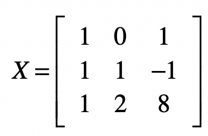

```
from numpy import *

x = mat([[1,0,1],[1,1,-1],[1,2,8]])
y = mat([[1.4],[-0.48],[13.2]])

print("\n系数矩阵B：\n", (x.transpose().dot(x)).I.dot(x.transpose()).dot(y))
```


### 数据集能否用线性模型表示

使用线性回归的时候，我们都有一个前提假设，那就是数据的自变量和因变量之间现线性关系。如果不是线性关系，那么使用线性模型来拟合的效果一定不好，需要对原始的数据进行非线性的变换，或者是使用非线性的模型来拟合。

在线性回归中，可以使用**决定系数R2**。这个统计指标使用了回归平方和与总平方和之比，是反映模型拟合度的重要指标。它的取值在0到1之间，越接近于1表示拟合的程度越好、数据分布越接近线性关系。

随着自变量个数的增加，R2将不断增大，因此我们还需要考虑方程所包含的自变量个数对R2的影响，这个时候可使用**校正的决定系数Rc2**。所以，在使用各种科学计算库进行线性回归时，你需要关注R2或者Rc2，来看看是不是一个好的线性拟合。