# 信息熵与决策树

“测测你是哪个武侠人物”、测星座、测运势之类的心理测试小游戏，通常会有一个题库，包含了许多小题目，也就是从不同的方面，来测试人的性格。不过，针对特定的测试目标，我们可能没必要让被测者回答所有的问题。问卷设计者利用**信息熵**的概念，选择合适的题目，使读者回答尽量少的问题的同时，相对准确地测出自己是什么“性格”。

在“测测你是哪个武侠人物”的小游戏中，一共有10个人物。每个人物都有性别、智商、情商、侠义和个性共5个属性。通过设计5道题目分别测试这5个属性，然后与下表中的武侠人物对照，就可以找到最接近的答案，也就是被测者对应的武侠人物。

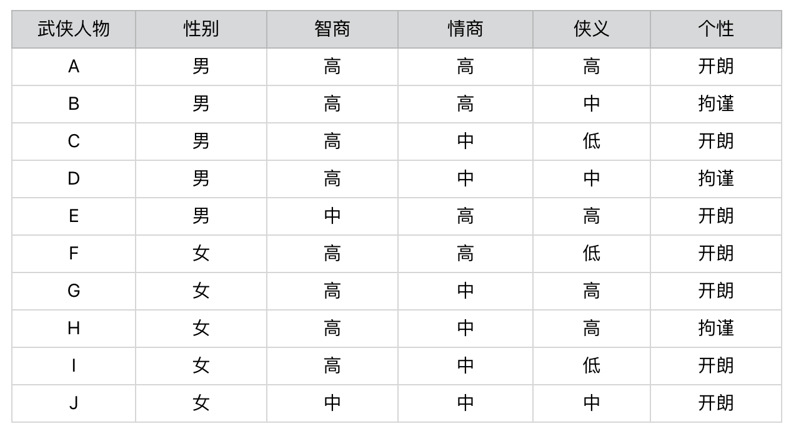

在这个设计过程中，起决定性作用的环节其实就是，如何设计这5道题目。比如，题目的先后顺序会不会直接影响要回答问题的数量？每个问题在人物划分上，是否有着不同的区分能力？

每一个问题都会将被测试者划分为不同的人物分组。如果某个问题将属于不同人物分组的被测者，尽可能地划分到了相应的分组，那么我们认为这个问题的**区分能力较强。相反，如果某个问题无法将属于不同人物分组的被测者划分开来，那么我们认为这个问题的区分能力较弱**。

以“性别”和“智商”这两个属性为例。

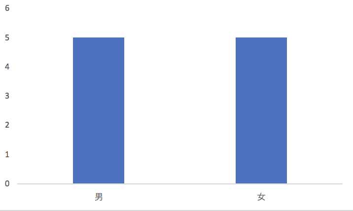

性别属性将武侠人物平均地划分为一半一半，也就是说“男”和“女”出现的先验概率是各50%。如果我们假设被测试的人群，其男女性别的概率分布也是50%和50%，那么关于性别的测试题，就能将被测者的群体大致等分。

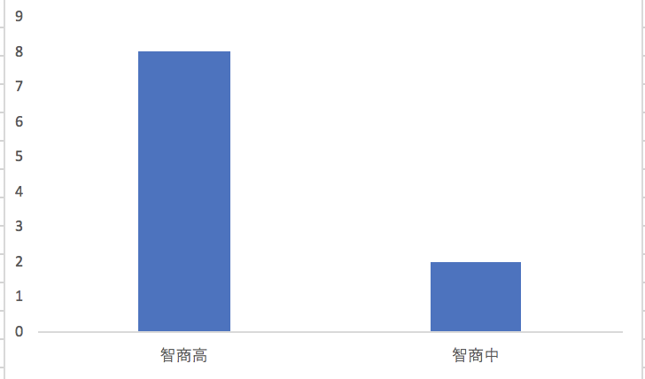

“智商高”的先验概率是80%，而“智商中等”的先验概率只有20%。同样，我们假设被测试的人群，其智商的概率分布也是类似地，那么经过关于智商的测试题之后，仍然有80%左右的不同人物还是属于同一个集合，并没有被区分开来。因此，我们可以认为关于“智商”的测试题，在对人物进行分组这个问题上，其能力要弱于“性别”的测试题。

上述这些都是根据经验划分的，接下来试着用两个科学的度量指标来衡量每道题目的区分能力。

## 信息熵

信息熵，即**信息的不确定度，可以用来刻画给定集合的纯净度。**

如果一个集合里的元素全部属于同一个分组，这个时候就表示最纯净，我们就说熵为0；如果这个集合里的元素是来自不同的分组，那么熵是大于0的值。

$$Entropy(P)=-\sum_{i=1}^n p_{i} * \log_2 p_{i} $$

其中，$n$表示集合中分组的数量，$p_{i}$表示属于第$i$个分组的元素在集合中出现的概率。

熵的公式是用来计算某个随机变量的**信息量之期望**，而信息量是信息论中的一个度量，相当于当我们观察到某个随机变量的具体值时，接收到了多少信息。而我们接收到的信息量跟发生事件的概率有关。事情发生的概率越大，产生的信息量越小；事情发生的概率越小，产生的信息量越大。

因此，我们想要设计一个能够描述信息量的函数，就要同时考虑到下面这三个特点：

- 信息量应该为正数；
- 一个事件的信息量和它发生的概率成反比；
- $H(x)$与$P(x)$的对数有关。其中$H(x)$表示$x$的信息量，$P(x)$表示$x$出现的概率。假设有两个不相关的事件$x$和$y$，我们观察到这两个事件同时发生时获得的信息量，应该等于这两个事件各自发生时获得的信息量之和，用公式表达出来就是$H(x,y)=H(x)+H(y)$。如果$x，y$是两个不相关的事件，那么就有$P(x,y)=P(x)*P(y)$。

依照上述这三点，我们可以设计出信息量公式：$H(x)=-log_2 P(x)$。函数log的使用是体现了$H(x)$和$P(x)$的对数关系。这个公式可以量化随机变量某种取值时，所产生的信息量。最后，加上计算随机变量不同可能性所产生的信息量之期望，我们就得到了熵的公式。

从集合和分组的角度来说，如果一个集合里的元素趋向于落在同一分组里，那么告诉你某个元素属于哪个分组的信息量就越小，整个集合的熵也越小，换句话说，整个集合就越“纯净”。相反，如果一个集合里的元素趋向于分散在不同分组里，那么告诉你某个元素属于哪个分组的信息量就越大，整个集合的熵也越大，换句话说，整个集合就越“混乱”。

如果将一个集合划分成多个更小的集合之后，又该如何根据这些小集合，来计算整体的熵呢？

信息量和熵具有加和的性质，所以对于包含多个集合的更大集合，它的信息量期望值是可以通过每个小集合的信息量期望值来推算的。

$$ \sum_{v \in Value(T)}  \frac{\mid P_{v} \mid}{\mid P \mid} Entroy(P_v) $$

其中，$T$表示一种划分，$P_{v}$表示划分后其中某个小集合，$Entropy(P_{v})$表示某个小集合的熵， 而$\frac{|Pv|} {|P|}$ 表示某个小集合出现的概率。所以这个公式其实就表示，**对于多个小集合而言，其整体的熵等于各个小集合之熵的加权平均**。而每个小集合的权重是其在整体中出现的概率。

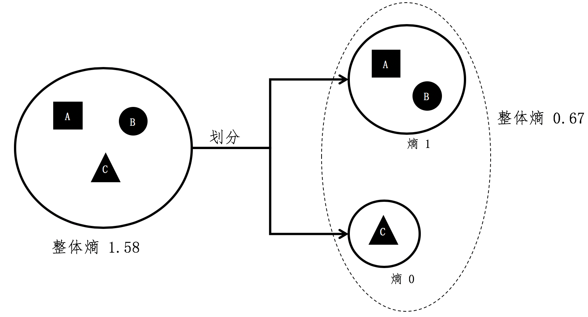

A和B组元素所组成的小集合，它的熵是1。而C组没有和其他组混合，所形成的小集合其熵为0。在计算前两个小集合的整体熵时，A组和B组形成的集合出现的概率为$\frac{2}{3}$，而C组形成的集合出现概率为$\frac{1}{3}$，所有整体熵$=\frac{2}{3} * 1 + \frac{1}{3} * 0 = 0.67$。

## 信息增益

如果我们将划分前后的整体熵做个对比，你会发现划分后的整体熵要小于划分之前的整体熵。这是因为每次划分，都可能将不同分组的元素区分开来，降低划分后每个小集合的混乱程度，也就是降低它们的熵。将划分后整体熵的下降，称为**信息增益**（Information Gain）。如果划分后整体熵下降的越多，信息增益就越大。

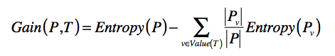

其中T表示当前选择的特征，$Entropy(P)$表示选择特征$T$之前的熵，$Entropy(P_{v})$表示特征$T$取值为$v$分组的熵。减号后面的部分表示选择T做决策之后，各种取值加权平均后整体的熵。

$Gain(P,T)$表示两个熵值之差，越大表示信息增益越多，应该选择这维特征$T$。

从游戏的最开始出发，比较一下有关性别和智商的两个测试题。

在提出任何问题之前，我们无法知道被测者属于哪位武侠人物，因此所有被测者属于同一个集合。假设被测者的概率分布和这10位武侠人物的先验概率分布相同，那么被测者集合的熵为10*(-1 * 0.1 * log(0.1, 2))=3.32。

通过性别的测试问题对人物进行划分后，我们得到了两个更小的集合，每个小集合都包含5种不同的人物分组，因此每个小集合的熵是(-1 * 5 * 0.2 * log(0.2, 2)) = 2.32，两个小集合的整体熵是0.5 * 2.32 + 0.5 * 2.32 = 2.32。因此使用性别的测试题后，信息增益是3.32 - 2.32 = 1。

而通过智商的测试问题对人物分组后，我们也得到了两个小集合，一个包含了8种人物，另一个包含了2种人物。包含8种人物的小集合其熵是(-1* 8 * 0.125 * log(0.125, 2)) = 3，包含2种人物的小集合其熵是(-1* 2 * 0.5 * log(0.5, 2)) = 1。两个小集合的整体熵是0.8 * 3 + 0.2 * 1 = 2.6。因此使用智商的测试题后，信息增益是3.32 - 2.6 = 0.72，低于基于性别的测试。所以，我们可以得出结论，有关性别的测试题比有关智商的测试题更具有区分能力。

信息增益和信息熵是紧密相关的。如果说信息熵衡量了某个状态下，每个分组的纯净程度或者说混乱程度，那么信息增益就是比较了不同状态下，信息熵的差异程度。

## 决策树

由于每道问题的区分能力不同，而我们对问题的选择会影响熵下降的幅度。这个幅度就是信息增益。如果问卷题的顺序选择得好，我们可以更快速地完成对用户性格的判定。

每次选择问题的时候，我们可以选择信息增益最高的问题，这样熵值下降得就最快。

开始选择第一个问题。首先，依次计算“性别”“智商”“情商”“侠义”和“个性”对人物进行划分后的信息增益。得到如下结果：

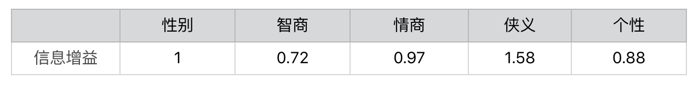

显然，第一步我们会选择“侠义”，之后用户就会被细分为3组。

对于每一组，继续选择在该组中，区分力最强、也是就信息增益最高的问题。后续的步骤依次类推，直到所有人物都被分开。

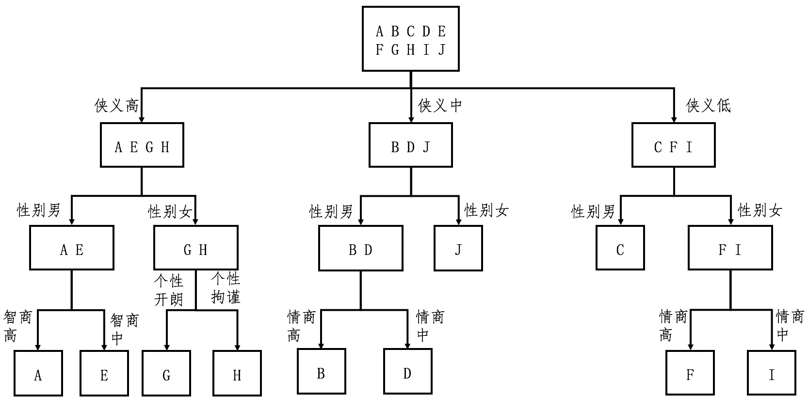

从这个图可以看出来，对于每种人物的判断，我们至多需要问3个问题，没有必要问全5个问题。

假设读者属于10种武侠人物的概率是均等的，可以得到读者需要回答的问题数量之期望值。每种人物出现的概率是0.1，8种人物需要问3个问题，2种人物需要问2个问题，那么回答问题数的期望值是0.8 * 3 + 0.2 * 2 = 2.8（题）。

如果每次不选熵值最高的问题，而选择熵值最低的问题呢？

最差的情况下，要问完全部5个问题，才能确定被测者所对应的武侠人物。而且问4个问题的情况也不少，回答问题数的期望值会在4到5之间，明显要多于基于最高熵来选择题目的方法。

### 问卷设计的核心思想

**根据当前的概率分布，挑选在当前阶段区分能力更强的那些问题。**具体的步骤有三个。

- 第一步，根据分组中的人物类型，为每个集合计算信息熵，并通过全部集合的熵之加权平均，获得整个数据集的熵。注意，一开始集合只有一个，并且包含了所有的武侠人物。
- 第二步，根据信息增益，计算每个问卷题的区分能力。挑选区分能力最强的题目，并对每个集合进行更细的划分。
- 第三步，有了新的划分之后，回到第一步，重复第一和第二步，直到没有更多的问卷题，或者所有的人物类型都已经被区分开来。这一步也体现了递归的思想。

上述这个过程就体现了训练**决策树**（Decision Tree）的基本思想。决策树学习属于归纳推理算法之一，适用于分类问题。分类算法主要包括了建立模型和分类新数据两个阶段。决定问卷题出现顺序的这个过程，其实就是建立决策树模型的过程。

### 构建决策树的步骤

- 第一步，根据集合中的样本分类，为每个集合计算信息熵，并通过全部集合的熵之加权平均，获得整个数据集的熵。注意，一开始集合只有一个，并且包含了所有的样本。
- 第二步，根据信息增益，计算每个特征的区分能力。挑选区分能力最强的特征，并对每个集合进行更细的划分。
- 第三步，有了新的划分之后，回到第一步，重复第一步和第二步，直到没有更多的特征，或者所有的样本都已经被分好类。

在泛化的机器学习问题中，每个类型对应了多个样本。因此，决策树通常都只能把整体的熵降低到一个比较低的值，而无法完全降到0。这也意味着，训练得到的决策树模型，常常无法完全准确地划分训练样本，只能求到一个近似的解。

### 决策树算法比较

#### ID3

Iterative Dichotomiser 3，迭代二叉树3代，采用**信息增益**来构建决策树。这个算法有一个缺点，它一般会优先考虑具有较多取值的特征，因为取值多的特征会有相对较大的信息增益。

更多的取值会把数据样本划分为更多更小的分组，这样熵就会大幅降低，信息增益就会大幅上升。但是这样构建出来的树，很容易导致机器学习中的过拟合现象，不利于决策树对新数据的预测。

#### C4.5

使用**信息增益率**（Information Gain Ratio）来替代信息增益，作为选择特征的标准，并降低决策树过拟合的程度。信息增益率通过引入一个被称作**分裂信息**（Split Information）的项来惩罚取值较多的特征。

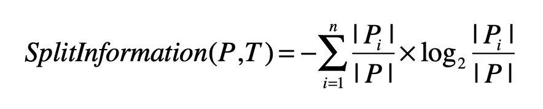

其中，训练数据集$P$通过属性$T$的属性值，划分为$n$个子数据集，$|Pi|$表示第$i$个子数据集中样本的数量，$|P|$表示划分之前数据集中样本总数量。 

熵计算的时候考虑的是，集合内数据是否属于同一个类，因此即使集合数量很多，但是集合内的数据如果都是来自相同的分类（或分组），那么熵还是会很低。而这里的分裂信息是不同的，它**只考虑子集的数量**。如果某个特征取值很多，那么相对应的子集数量就越多，最终分裂信息的值就会越大。

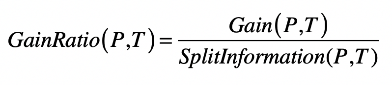

其中$Gain(P,T)$是数据集$P$使用特征$T$之后的信息增益，$GainRatio(P,T)$是数据集$P$使用特征$T$之后的信息增益率。

#### CART

Classification and Regression Trees，分类与回归树

- 在分类时，CART不再采用信息增益或信息增益率，而是采用**基尼指数**（Gini）来选择最好的特征并进行数据的划分；
- 在ID3和C4.5决策树中，算法根据特征的属性值划分数据，可能会划分出多个组。而CART算法**采用了二叉树，每次把数据切成两份，分别进入左子树、右子树**。

当然，CART算法和ID3、C4.5也有类似的地方。首先，CART中每一次迭代都会降低基尼指数，这类似于ID3、C4.5降低信息熵的过程。另外，基尼指数描述的也是纯度，与信息熵的含义相似。

$$Gini(P)=1- \sum_{i=1}^{n}p_i^2$$

其中，$n$为集合$P$中所包含的不同分组（或分类）数量。如果集合$P$中所包含的不同分组越多，那么这个集合的基尼指数越高，纯度越低。

算整个数据集的基尼指数：

$$Gini(P,T)=\sum_{j=1}^{m}p_j * Gini(P_j)$$

其中，$m$为全集使用特征$T$划分后，所形成的子集数量。$P_{j}$为第$j$个集合。

## 特征选择

### 利用信息熵

**对分类有价值的特征**：如果一个特征，经常只在某个或少数几个分类中出现，而很少在其他分类中出现，那么说明这个特征具有较强的区分力，它的出现很可能预示着整个数据属于某个分类的概率很高或很低。

是否属于少数几个类这一点，可以使用信息熵来衡量。

$$- \sum_{j=1}^n P(c_j \mid Df_i)*log_2P(c_j \mid Df_i)$$

$Df_{i}$表示所有出现特征$f_{i}$的数据集合，这个集合一共包含了$n$个分类$C$，而$c_{j}$表示这$n$个分类中的第$j$个。

如果熵值很低，说明包含这个特征的数据只出现在少数分类中，对于分类的判断有价值。

计算出每个特征所对应的数据集之熵，我们就可以按照熵值由低到高对特征进行排序，挑选出排列靠前的特征。

这个做法只考虑了单个特征出现时，对应数据的分类情况，而并没有考虑整个数据集的分类情况。比如，虽然出现“电影”这个词的文章，经常出现在“娱乐”这个分类中，很少出现在其他分类中，但是可能整个样本数据中，“娱乐”这个分类本来就已经占绝大多数，所以“电影”可能并非一个很有信息含量的特征。

为了改进这一点，可以借用决策树中信息增益的概念。把单个特征f是不是出现作为一个决策条件，将数据集分为$Df_{i}$ 和$D\bar{f_{i}}$ ，$Df_{i}$表示出现了这个特征的数据，而$D\bar{f_{i}}$表示没有出现这个特征的数据。那么使用特征$f_{i}$进行数据划分之后，我们就能得到基于两个新数据集的熵，然后和没有划分之前的熵进行比较，得出信息增益。

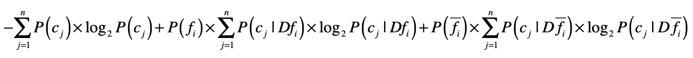

如果基于某个特征的划分，所产生的信息增益越大，说明这个特征对于分类的判断越有价值。所以，我们可以计算基于每个特征的划分，所产生的信息增益，然后按照增益值由高到低对特征进行排序，挑选出排列靠前的特征。

### 利用卡方检验

在统计学中，卡方检验被用来检验两个变量是否相互独立。把它运用到特征选择，我们就可以检验特征与分类这两个变量是否独立。如果两者独立，证明特征和分类没有明显的相关性，特征对于分类来说没有提供足够的信息量。反之，如果两者有较强的相关性，那么特征对于分类来说就是有信息量的，是个好的特征。为了检验独立性，卡方检验考虑了四种情况的概率：$P(f_{i},c_{j})$ 、$P(\bar{f_{i}} ,\bar{c_{j}})$、$P(f_{i},\bar{c_{j}})$和$P(\bar{f_{i}},c_{j})$。

在这四种概率中，$P(f_{i},c_{j})$和$P(\bar{f_{i}} ,\bar{c_{j}})$表示特征$f_{i}$和分类$c_{j}$是**正相关**的。如果$P(f_{i},c_{j})$很高，表示特征fi的出现意味着属于分类$c_{j}$的概率更高；如果$P(\bar{f_{i}} ,\bar{c_{j}})$很高，表示特征$f_{i}$不出现意味着不属于分类$c_{j}$的概率更高。

类似地，$P(f_{i},\bar{c_{j}})$和$P(\bar{f_{i}},c_{j})$表示特征$f_{i}$和分类$c_{j}$是**负相关**的。如果$P(f_{i},\bar{c_{j}})$很高，表示特征$f_{i}$的出现意味着不属于分类$c_{j}$的概率更高；如果$P(\bar{f_{i}},c_{j})$很高，表示特征$f_{i}$不出现意味着属于分类$c_{j}$的概率更高。

如果特征和分类的相关性很高，要么是正向相关值远远大于负向相关值，要么是负向相关值远远大于正向相关值。如果特征和分类相关性很低，那么正向相关值和负向相关的值就会很接近。卡方检验就是利用了正向相关和负向相关的特性。

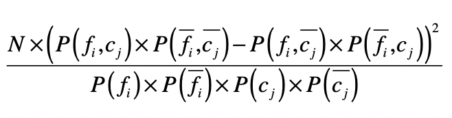

$N$表示数据的总个数。通过这个公式，你可以看到，如果一个特征和分类的相关性很高，无论是正向相关还是负向相关，那么正向相关和负向相关的差值就很大，最终计算的值就很高。最后，我们就可以按照卡方检验的值由高到低对特征进行排序，挑选出排列靠前的特征。

