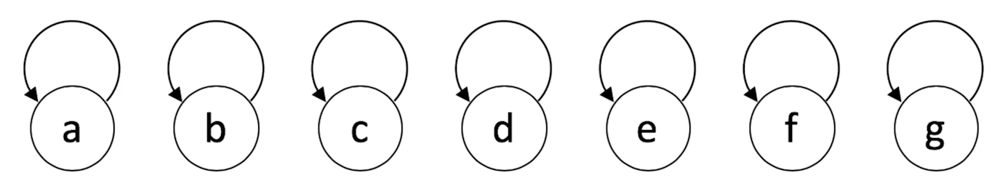
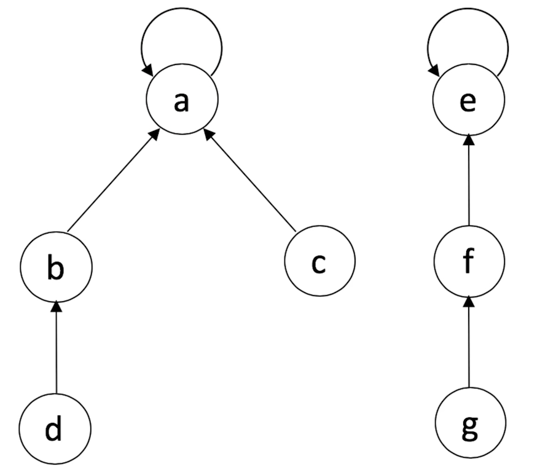
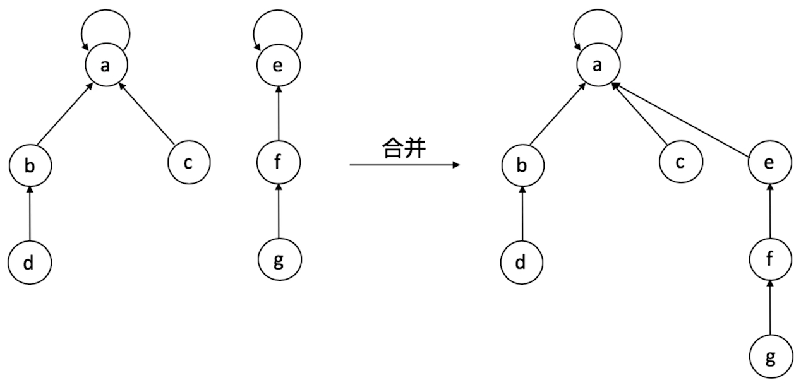
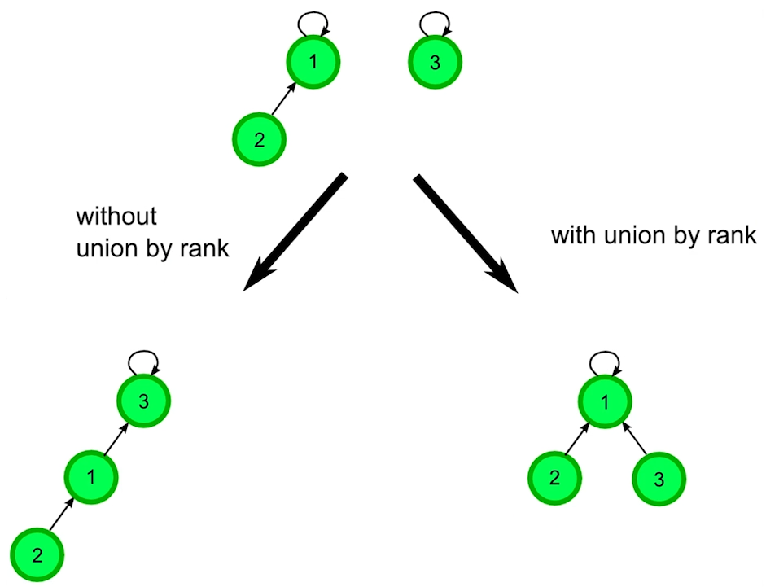
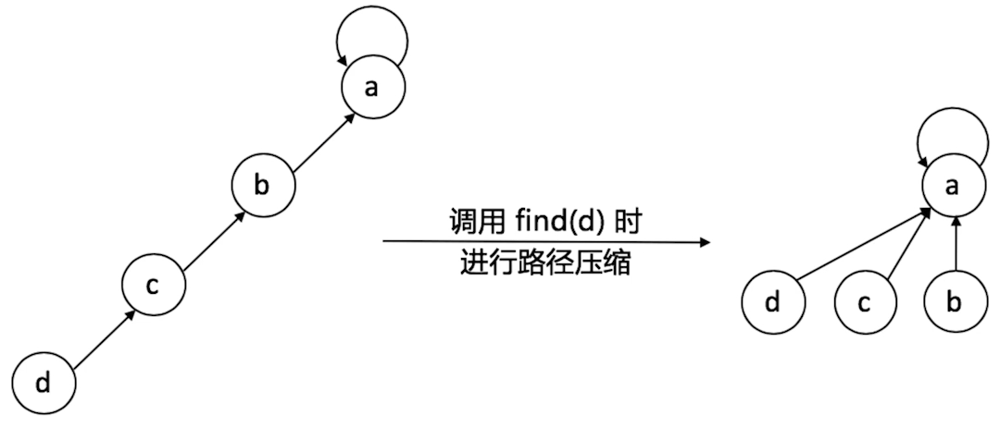

# 并查集

并查集（union & find）是一种树型的数据结构，用于处理一些不交集（disjoint sets）的合并及查询问题。

- **Find**：确定元素属于哪一个子集。它可以被用来确定两个元素是否属于同一子集
- **Union**：将两个子集合并成同一个集合

## 实现

通常用数组实现，数组下标`i`表示第`i`个元素，数组值表示该元素所属的父节点下标。

初始时每个节点的值都是自己的下标（各自为营）。



```
type QuickUnionUF struct {
	Roots []int
}

func NewQuickUnionUF(n int) *QuickUnionUF {
	this := &QuickUnionUF{
		Roots: make([]int, n)
	}
	for i := range this.Roots {
		this.Roots[i] = i
	}
	return this
}

// 返回元素i所属集合的root
func(this *QuickUnionUF) FindRoot(i int) int {
	root := i
	for this.Roots[root] != root {
		root = this.Roots[root]
	}
	return root
}

// 元素i、j是否处于同一个集合
func(this *QuickUnionUF) Connected(i, j int) bool {
	return this.FindRoot(i) == this.FindRoot(j)
}

// 合并两个集合
func(this *QuickUnionUF) Union(i, j int) {
	iroot := this.FindRoot(i)
	jroot := this.FindRoot(j)
	this.Roots[iroot] = jroot
}
```

调用多次`Union`后：



再次合并：




## 优化

### 根据深度（rank）优化

下图两个并查集合并的时候，有两种选择：

- 直接将1的root指向3
- 将3的root指向1



合并之后，查找2的root时，第一种情况需要走两步，而第二种情况只需要走一步。

第二种情况的组织结构更扁平，在并查集中，将深度称为rank，深度越小，效率越高。

**合并的时候，将rank较低的并查集，合并到rank较高的并查集中，**以生成总体rank较低的并查集。

```
type UFNode struct {
	Parent int
	Rank int // 深度
}

type QuickUnionUF struct {
	Roots []UFNode
}

func NewQuickUnionUF(n int) *QuickUnionUF {
	this := &QuickUnionUF{
		Roots: make([]UFNode, n)
	}
	for i := range this.Roots {
		this.Roots[i].Parent = i
		this.Roots[i].Rank = 1
	}
	return this
}

// 返回元素i所属集合的root
func(this *QuickUnionUF) FindRoot(i int) int {
	root := i
	for this.Roots[root].Parent != root {
		root = this.Root[root].Parent
	}
	return root
}

// 元素i、j是否处于同一个集合
func(this *QuickUnionUF) Connected(i, j int) bool {
	return this.FindRoot(i) == this.FindRoot(j)
}

func(this *QuickUnionUF) Union(i, j int) {
	iroot := this.FindRoot(i)
	jroot := this.FindRoot(j)
	if iroot == jroot {
		return
	}
	
	if this.Roots[iroot].Rank <= this.Roots[jroot].Rank {
		this.Roots[iroot].Parent = jroot
		this.Roots[jroot].Rank++
	} else {
		this.Roots[jroot].Parent = iroot
		this.Roots[iroot].Rank++
	}
}
```


### 路径压缩



让每个节点都指向它们的root，用了该优化后，基本上就不需要rank了。

```
type QuickUnionUF struct {
	Roots []int
	Count int // 集合数量
}

func NewQuickUnionUF(n int) *QuickUnionUF {
	this := &QuickUnionUF{
		Roots: make([]int, n),
		Count: n,
	}
	for i := range this.Roots {
		this.Roots[i] = i
	}
	return this
}

// 返回元素i所属集合的root
func(this *QuickUnionUF) FindRoot(i int) int {
	root := i
	for this.Roots[root] != root { // 先找到最终的root
		root = this.Roots[root]
	}
	
	// 在这里进行优化，将从i到root的经过的节点的root指向最终的root
	for i != root {
		this.Roots[i], i = root, this.Roots[i]
	}
	
	return root
}

// 元素i、j是否处于同一个集合
func(this *QuickUnionUF) Connected(i, j int) bool {
	return this.FindRoot(i) == this.FindRoot(j)
}

// 合并两个集合
func(this *QuickUnionUF) Union(i, j int) {
	iroot := this.FindRoot(i)
	jroot := this.FindRoot(j)
	if iroot != jroot {
		this.Roots[iroot] = jroot
		this.Count--
	}
}
```


